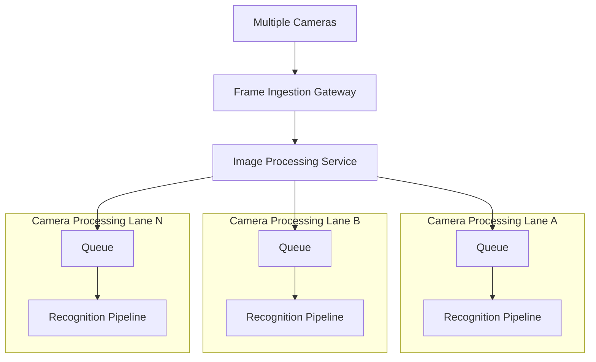
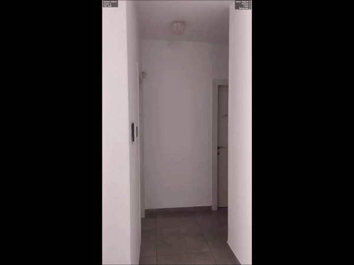

# Camera Recognition System

### Real-Time Multi-Camera Person & Face Recognition Platform

A modular computer vision system that processes multiple camera streams concurrently, detects motion, identifies people, recognizes faces, and generates identity-aware recognition events.

Designed using a **Spec-Driven Development** approach with a focus on **real-time processing**, **scalability**, **system architecture**.

---

## Architecture

---

## Recognition Pipeline

---

## Engineering Highlights

* Multi-Camera Processing
* Per-Camera Isolation
* Real-Time First Design
* Multi-Threaded Architecture
* Bounded Queue Architecture
* Queue-Based Backpressure Management
* Motion-Gated Processing
* Runtime Metrics & Diagnostics
* Replay Framework
* Config-Driven Runtime Behavior
* Spec-Driven Development
* 500+ Automated Tests

---

## Technologies

**Python • OpenCV • YOLO • ONNX Runtime • NumPy • Docker • Linux • Pytest • YAML • Git**

---

## Design Documentation

Detailed design specifications covering system architecture, runtime processing flow, recognition pipeline orchestration, and shared contracts.

* [Image Processing Service](doc/image_processing_service/image_processing_service.md)
* [Recognition Pipeline Manager](doc/image_processing_service/RecognitionPipelineManager.md)
* [Frame Ingestion Gateway](doc/image_processing_service/frame_ingestion_gateway.md)

---

## Demo

  

Motion Detection → Object Detection → Face Detection → Face Recognition
---

## Author

**Tali Fruman**
B.Sc. Information Systems (AI Specialization)
University of Haifa
