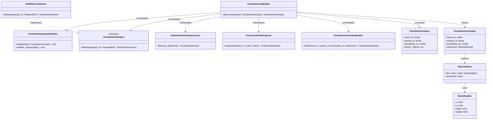
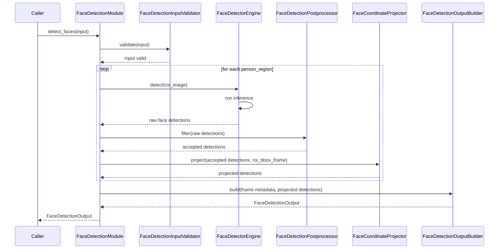

# Face Detection Module Specification

## 1. Purpose

The Face Detection module is responsible only for detecting faces inside already prepared person ROI images.

The module does not crop images, does not detect persons, and does not perform face recognition or identity matching. Its responsibility starts after upstream processing has already produced person-specific ROI images and ends when the module returns accepted face locations in full-frame coordinates.

## 2. Input

### 2.1 Input Responsibility Boundary

The module receives pre-cropped person images. These person ROIs are produced upstream by a dedicated sub-component inside the Frame Transformation Layer.

That upstream sub-component is responsible for:

- cropping each person ROI from the original frame
- resizing the ROI to the detector's expected spatial size
- color conversion
- layout conversion
- dtype conversion
- normalization

The representation produced by the Frame Transformation Layer matches the configured detector input contract exactly. The Face Detection module does not perform cropping, resizing, color conversion, layout conversion, dtype conversion, normalization, or any other image preprocessing.

If multiple people exist in the source frame, the upstream layer splits them into multiple ROI images. The Face Detection module receives those ROIs as a list and evaluates each ROI independently.

### 2.2 Input Structure

```text
struct BoundingBox {
    int32 x;
    int32 y;
    int32 width;
    int32 height;
}

struct PersonRegion {
    Image roi_image;
    BoundingBox roi_bbox_frame;
}

struct FaceDetectionInput {
    uint64 frame_id;
    string camera_id;
    uint64 timestamp_ms;
    vector<PersonRegion> person_regions;
}
```

- `frame_id` identifies the source frame for traceability.
- `camera_id` identifies the source camera.
- `timestamp_ms` is the capture timestamp in milliseconds.
- `person_regions` is the full list of prepared person ROIs associated with the frame.
- `roi_image` is one prepared person ROI image.
- `roi_bbox_frame` is the bounding box of that ROI in the original frame coordinate system.

### 2.3 ROI Image Contract

Each `roi_image` must already match the configured detector input contract before inference starts.

Default SCRFD-oriented contract:

- color format: `RGB`
- layout: `HWC`
- dtype: `uint8`
- value range: `[0, 255]`

The exact detector contract is configuration-defined, but the module expects every ROI to be consistent with that contract. The module validates the incoming ROI image shape, layout compatibility, dtype, and range assumptions before sending it to the detector engine.

The ROI image therefore arrives fully prepared. The Face Detection module does not perform any image preprocessing. Any minimal runtime-specific adaptation required for inference, such as wrapping the validated image into the backend's tensor type or adding a batch dimension, is handled internally by `FaceDetectorEngine` and does not modify the image data.

## 3. AI Model Usage

The module uses an AI-based face detection algorithm.

SCRFD is the default face detection model implementation.

The module sends the validated `roi_image` for each `PersonRegion` directly to the configured detector engine after validation.

The model returns raw face detections in ROI coordinates. A raw detection may contain:

- a face bounding box relative to the ROI image
- a confidence score produced by the detector
- optional facial landmarks relative to the ROI image

These raw outputs remain internal to the module. The public module contract must remain model-agnostic so that SCRFD can be replaced in the future by another face detector without changing `FaceDetectionInput`, `FaceDetectionOutput`, or the calling code.

## 4. Internal Pipeline

The Face Detection module is not a single flat processing unit. It is an orchestrated module composed of internal subcomponents with separate responsibilities.

### 4.1 FaceDetectionModule

`FaceDetectionModule` is the orchestration layer only.

Its responsibilities are:

- receive `FaceDetectionInput`
- invoke internal subcomponents in the correct order
- loop over `person_regions`
- accumulate accepted detections across all ROI images
- delegate final output construction to `FaceDetectionOutputBuilder`

`FaceDetectionModule` must not embed validation, inference logic, postprocessing rules, coordinate projection logic, or output assembly logic directly when those responsibilities belong to dedicated internal components.

### 4.2 FaceDetectionInputValidator

`FaceDetectionInputValidator` validates the frame-level input and each `PersonRegion` before inference begins.

Frame-level validation includes:

- `frame_id` must exist
- `camera_id` must exist and be non-empty
- `timestamp_ms` must exist
- `person_regions` must exist

Per-ROI validation includes:

- `roi_image` must exist
- `roi_bbox_frame` must exist
- `roi_bbox_frame.width` and `roi_bbox_frame.height` must be greater than zero
- `roi_image` must match the configured detector input contract

An empty `person_regions` list is valid. In that case, the module returns an empty `detections` list.

### 4.3 FaceDetectorEngine

`FaceDetectorEngine` is the internal detector abstraction used by the module to run AI inference.

Its responsibilities are:

- accept the validated ROI image directly from the orchestrator
- run detector inference
- return raw face detections in ROI coordinates

`SCRFDFaceDetector` is the default implementation of `FaceDetectorEngine`.

### 4.4 FaceDetectionPostprocessor

`FaceDetectionPostprocessor` consumes the raw detector output and applies the module's internal acceptance rules.

Its responsibilities are:

- interpret raw face detections produced by the engine
- apply configuration-defined thresholds
- discard malformed or invalid boxes
- apply detector-specific suppression or refinement rules if required
- decide which detections are accepted for downstream projection

This component is the only place inside the module that decides whether a raw detector result becomes an externally visible face detection.

### 4.5 FaceCoordinateProjector

`FaceCoordinateProjector` converts accepted detections from ROI coordinates into full-frame coordinates.

Its responsibilities are:

- offset `face_bbox_roi` by `roi_bbox_frame.x` and `roi_bbox_frame.y`
- map optional landmarks from ROI space into full-frame space using the same ROI offset
- ensure all externally returned coordinates are expressed in frame coordinates

### 4.6 FaceDetectionOutputBuilder

`FaceDetectionOutputBuilder` constructs the final developer-facing output structures.

Its responsibilities are:

- create `DetectedFace` entries from projected detections
- assemble the final `FaceDetectionOutput`
- preserve `frame_id`, `camera_id`, and `timestamp_ms` from the input

### 4.7 End-to-End Processing Flow

For one invocation of `detect_faces`, the internal flow is:

1. `FaceDetectionModule` receives `FaceDetectionInput`.
2. `FaceDetectionModule` calls `FaceDetectionInputValidator` to validate frame metadata and the list of ROI regions.
3. `FaceDetectionModule` iterates over `person_regions` one ROI at a time.
4. For each ROI, `FaceDetectionModule` sends the validated `roi_image` directly to `FaceDetectorEngine`.
5. `FaceDetectorEngine` runs inference and returns raw detections in ROI coordinates.
6. `FaceDetectionModule` sends the raw detections to `FaceDetectionPostprocessor`.
7. `FaceDetectionPostprocessor` returns only accepted detections.
8. `FaceDetectionModule` sends the accepted detections and ROI bounding box to `FaceCoordinateProjector`.
9. `FaceCoordinateProjector` returns projected detections in full-frame coordinates.
10. `FaceDetectionModule` accumulates projected detections from all ROI images.
11. After all ROI images are processed, `FaceDetectionModule` calls `FaceDetectionOutputBuilder`.
12. `FaceDetectionOutputBuilder` constructs and returns the final `FaceDetectionOutput`.

All raw model outputs, confidence scores, rejected detections, and intermediate backend-specific artifacts remain internal to the module.

## 5. Output

### 5.1 Output Structure

```text
struct Point {
    int32 x;
    int32 y;
}

struct DetectedFace {
    BoundingBox face_bbox_frame;
    map<string, Point> landmarks;      // optional
}

struct FaceDetectionOutput {
    uint64 frame_id;
    string camera_id;
    uint64 timestamp_ms;
    vector<DetectedFace> detections;
}
```

### 5.2 Output Semantics

- `frame_id`, `camera_id`, and `timestamp_ms` are copied from the input for traceability.
- `detections` contains only accepted face detections.
- `face_bbox_frame` is always expressed in full-frame coordinates, not ROI coordinates.
- `landmarks` may be included when the selected detector provides them and the module configuration enables their retention.

The output must not expose detector confidence, raw inference tensors, rejection reasons, or any recognition-related data.

## 6. Decision Logic

`FaceDetectionPostprocessor` is responsible for deciding whether a raw detector result is accepted as a valid face detection.

Acceptance is internal and configuration-driven. Typical rules include:

- minimum confidence threshold
- optional suppression of duplicate overlapping face boxes
- bounding box sanity checks
- optional landmark validation

Model confidence is internal only. It is used by `FaceDetectionPostprocessor` when applying the acceptance rules, but it is not returned in `FaceDetectionOutput`.

Only accepted detections are returned to callers. If no detections survive postprocessing for any ROI, the module returns an empty `detections` list.

## 7. Module Interface

The public module contract is:

```text
detect_faces(input: FaceDetectionInput) -> FaceDetectionOutput
```

The detector backend is abstracted behind an internal interface:

```text
interface FaceDetectorEngine {
    detect(prepared_roi: PreparedROI) -> RawFaceDetections
}
```

Default implementation:

```text
class SCRFDFaceDetector implements FaceDetectorEngine
```

The Face Detection module depends on `FaceDetectorEngine`, not on SCRFD directly. `SCRFDFaceDetector` is the default implementation of that interface, but the module design allows another detector engine to replace it later without changing the public module interface or the responsibilities of the surrounding internal components.

## 8. Class Diagram



## 9. Sequence Diagram



## 10. Constraints

The Face Detection module must not:

- perform image preprocessing (cropping, resizing, color conversion, layout conversion, dtype conversion, normalization)
- perform face recognition
- perform identity matching
- detect persons
- manage state across frames
- expose raw detector outputs externally
- expose raw detector confidence externally

The module is limited to face detection inside prepared person ROIs and to returning accepted face locations in full-frame coordinates.
