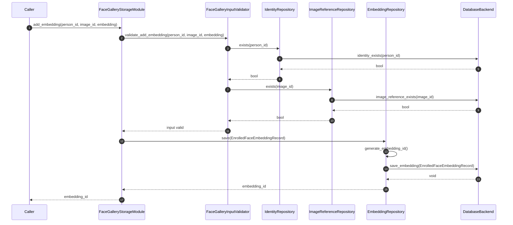
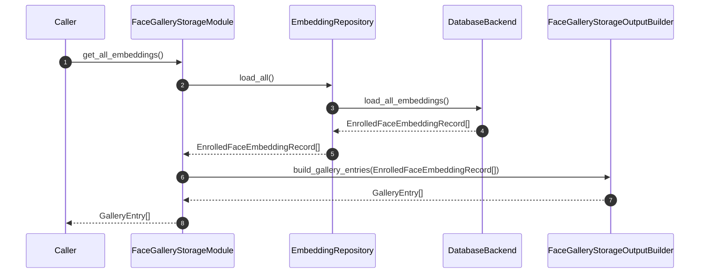
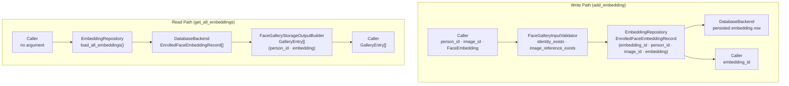

# Face Gallery Storage Module Specification

### Module Principle

This module is fully self-contained. It does not reference, depend on, or describe external modules, pipeline stages, or system-wide orchestration.

## 1. Scope

### Purpose

The Face Gallery Storage Module is responsible for storing and managing identity records, image references, and face embeddings. It is the central persistence layer for all gallery read and write operations.

### In Scope

- Creating and persisting identity records (`person_id`, `person_name`)
- Storing image data via the image storage backend and persisting the resulting file reference
- Storing face embeddings linked to identities and image records
- Providing read access to all embeddings across all enrolled identities
- Providing read access to embeddings filtered by `person_id`
- Providing read access to identity metadata by `person_id`
- Enforcing data integrity: unique `person_id`, unique `image_id`, unique `embedding_id`
- Backend-abstracted database and image storage via fixed default implementations

### Out of Scope

The Face Gallery Storage Module does NOT:

The module does not perform any image processing, feature extraction, or decision-making logic.

---

## 2. Input

### 2.1 Input Responsibility Boundary

The module receives write inputs across three operations: an identity creation call (providing `person_id` and `person_name`), an image storage call (providing `person_id` and a local source image path), and an embedding persistence call (providing `person_id`, `image_id`, and a `FaceEmbedding`). Read operations accept a `person_id` or no argument.

Embeddings are provided as input values and are assumed to be pre-computed. The module does not produce, validate, or transform embeddings.

The module does not perform any image analysis or transformation operations.

### 2.2 Input Structure

```text
struct CreateIdentityInput {
    string person_id;    // UUID format, globally unique
    string person_name;  // display name, metadata only
}

struct AddImageInput {
    string person_id;    // must reference an existing identity
    string source_path;  // local file path to the image to be stored
}

struct AddEmbeddingInput {
    string person_id;    // must reference an existing identity
    string image_id;     // must reference an existing image record for this person_id
    FaceEmbedding embedding;
}
```

`FaceEmbedding` is an opaque type. Its internal representation is not defined by this module. The contract this module depends on: the value is non-null and serializable as a binary blob for storage and retrieval. The module stores it as received and does not inspect its contents.

### 2.3 Input Contract

- `person_id` must be a non-empty string in UUID format for all operations
- `person_name` must be a non-empty string in `create_identity`
- `source_path` must be a non-empty string referencing a readable image file in `add_image`
- `image_id` must be non-empty and must reference a record previously returned by `add_image` for the same `person_id` in `add_embedding`
- `embedding` must be non-null in `add_embedding`

### 2.4 Validation Rules

`FaceGalleryInputValidator` must verify:

- `person_id` is non-empty and conforms to UUID format in all write calls
- `person_name` is non-empty for `create_identity`
- `person_id` does not already exist in the database for `create_identity`
- `source_path` is non-empty for `add_image`
- `person_id` references an existing identity record for `add_image` and `add_embedding`
- `image_id` is non-empty for `add_embedding`
- `image_id` references an existing image record in the database for `add_embedding`
- `embedding` is non-null for `add_embedding`

### 2.5 Input Semantics

- `person_id` — globally unique identity key in UUID format; primary lookup key for all read and write operations; never modified after creation
- `person_name` — human-readable metadata only; it is never used for matching or querying and is not present in `GalleryEntry` or any matching-facing output type
- `source_path` — local file path to the image to be stored; passed to `ImageStorageBackend`; the resulting stored URI is persisted, not the source path itself
- `image_id` — opaque unique identifier generated by the module after a successful `add_image` call; links an embedding record to its source image record
- `embedding` — pre-computed face feature vector; stored as received; not inspected by this module

---

## 3. Output

### 3.1 Output Structure

```text
struct IdentityMetadata {
    string person_id;
    string person_name;
}

struct GalleryEntry {
    string        person_id;
    FaceEmbedding embedding;
}

struct EmbeddingRecord {
    string        person_id;
    string        embedding_id;
    string        image_id;
    FaceEmbedding embedding;
}
```

`GalleryEntry` is a minimal identity-to-embedding mapping. It contains only `person_id` and `embedding`; no additional fields from any internal record are included.

### 3.2 Output Semantics

- `IdentityMetadata.person_id` — the unique identity key; returned by `get_identity_metadata`
- `IdentityMetadata.person_name` — the stored display name; metadata only; not used for matching
- `GalleryEntry.person_id` — identity key used for matching lookups
- `GalleryEntry.embedding` — stored feature vector available for matching
- `EmbeddingRecord.person_id` — identity this embedding is attributed to
- `EmbeddingRecord.embedding_id` — unique identifier for this embedding record
- `EmbeddingRecord.image_id` — image record this embedding was derived from
- `EmbeddingRecord.embedding` — stored feature vector

### 3.3 Output Constraints

The output must NOT expose:

- Raw image pixel data
- Internal database row identifiers or auto-increment keys
- Storage backend paths, credentials, bucket names, or connection strings
- Database connection handles, cursors, or transaction objects
- The `stored_uri` value from `EnrollmentImageRecord` — this is an internal persistence detail; excluding it preserves backend abstraction and enables the image storage implementation to be replaced without affecting any public output
- Partial or uncommitted records

---

## 4. Public API

```text
create_identity(person_id: string, person_name: string)                              -> void
add_image(person_id: string, source_path: string)                                    -> string          // returns image_id
add_embedding(person_id: string, image_id: string, embedding: FaceEmbedding)         -> string          // returns embedding_id
get_embeddings(person_id: string)                                                     -> EmbeddingRecord[]
get_all_embeddings()                                                                  -> GalleryEntry[]
get_identity_metadata(person_id: string)                                              -> IdentityMetadata
```

The API must remain stable regardless of the active backend implementation.

---

## 5. Non-Functional Requirements

- **Stateful module** — gallery content accumulates persistently across all invocations; storage state is shared across all callers
- **Multi-method API** — methods are independently callable, subject to logical preconditions: `create_identity` must precede `add_image`; both `create_identity` and `add_image` must precede `add_embedding`
- **Atomic write operations** — all write operations must be atomic; if any step fails, no partial state is persisted
- **Side-effect-free read operations** — `get_embeddings`, `get_all_embeddings`, and `get_identity_metadata` do not modify gallery state
- **Deterministic** — same gallery state produces identical read results for the same inputs
- **Backend-agnostic API** — the public output schema is independent of the configured database or image storage implementation
- **Strict isolation** — no backend-specific types (handles, cursors, file descriptors, connection objects) appear in any public return type or method signature

---

## 6. Processing Engine

### 6.1 Engine Abstraction Interface

```text
interface DatabaseBackend {
    save_identity(record: EnrolledIdentityRecord)                 -> void
    identity_exists(person_id: string)                            -> bool
    load_identity(person_id: string)                              -> EnrolledIdentityRecord
    save_image_reference(record: EnrollmentImageRecord)           -> void
    image_reference_exists(image_id: string)                      -> bool
    save_embedding(record: EnrolledFaceEmbeddingRecord)           -> void
    load_embeddings_by_person(person_id: string)                  -> EnrolledFaceEmbeddingRecord[]
    load_all_embeddings()                                         -> EnrolledFaceEmbeddingRecord[]
}

interface ImageStorageBackend {
    store_image(image_id: string, source_path: string)            -> string   // returns stored URI or path
}
```

### 6.2 Current Default Implementations

```text
class SQLiteDatabaseBackend implements DatabaseBackend
class FilesystemImageStorageBackend implements ImageStorageBackend
```

Both are algorithmic implementations (no AI or ML). `SQLiteDatabaseBackend` persists structured records in relational tables in a local SQLite file and returns typed record objects on retrieval. `FilesystemImageStorageBackend` copies the source image into a configured managed directory, names it by `image_id`, and returns the absolute stored path as the stored URI.

`SQLiteDatabaseBackend` and `FilesystemImageStorageBackend` are the fixed default implementations for the current version. The default implementations are instantiated at construction time using parameters from `FaceGalleryStorageConfig`. Alternative implementations may be injected via constructor parameters at construction time; no backend type substitution occurs at runtime after initialization.

### 6.3 Replaceability

The module depends on the `DatabaseBackend` and `ImageStorageBackend` interfaces, not on `SQLiteDatabaseBackend` or `FilesystemImageStorageBackend` directly. Either backend may be replaced — SQLite → PostgreSQL, or filesystem → cloud object storage — without modifying any public API method, output schema, or calling code. Replacing either backend does NOT affect the public API.

---

## 7. Acceptance / Filtering Logic

Write acceptance is exclusively managed by `FaceGalleryInputValidator`.

`IdentityRepository` checks whether a `person_id` already exists in the database via `DatabaseBackend.identity_exists` and returns a boolean result. For `create_identity`, `FaceGalleryInputValidator` receives this result: if the identity already exists, the call is rejected and no record is written. For `add_image` and `add_embedding`, `FaceGalleryInputValidator` uses the same check in reverse: if the identity does not exist, the call is rejected before any storage operation begins.

`ImageReferenceRepository` checks whether an `image_id` references an existing record via `DatabaseBackend.image_reference_exists` and returns a boolean result. For `add_embedding`, `FaceGalleryInputValidator` uses this result: if the image record does not exist, the call is rejected.

Validation runs to completion before any persistence operation begins. No partial writes are performed on any validation failure. No existence flags, conflict codes, or intermediate boolean results are returned to the caller through the public output types; a structured rejection error is propagated.

`FaceGalleryInputValidator` is the only component inside the module that makes accept or reject decisions on incoming write operations.

Validation enforces strict referential integrity between identity, image, and embedding records. Write acceptance enforces this constraint explicitly: `add_image` may only proceed after `create_identity` has been called for the same `person_id`; `add_embedding` may only proceed after both `create_identity` and `add_image` have been called for the same `person_id` and `image_id`. No write operation may bypass these constraints.

Acceptance logic applies only to write operations. Read operations do not modify state.

---

## 8. Internal Pipeline

### 8.1 FaceGalleryStorageModule

`FaceGalleryStorageModule` is the orchestration layer only. It owns no persistence logic.

Its responsibilities are:

- receive all public API calls and dispatch to internal components in the correct order
- pass results between internal components through the pipeline
- return final output values or propagate structured errors to the caller

`FaceGalleryStorageModule` initializes all internal components using the provided configuration, injecting the `DatabaseBackend` instance (defaulting to `SQLiteDatabaseBackend`) into `IdentityRepository`, `ImageReferenceRepository`, and `EmbeddingRepository`, and injecting the `ImageStorageBackend` instance (defaulting to `FilesystemImageStorageBackend`) into `ImageReferenceRepository`.

`FaceGalleryStorageModule` must not embed validation logic, persistence logic, identifier generation, or direct storage backend calls.

### 8.2 FaceGalleryInputValidator

`FaceGalleryInputValidator` is responsible for validating inputs and enforcing write acceptance for all API calls.

Its responsibilities are:

- verify format and completeness of all input fields
- verify that `person_id` does not already exist for `create_identity`
- verify that `person_id` references an existing identity record for `add_image` and `add_embedding`
- verify that `image_id` references an existing image record for `add_embedding`
- reject invalid calls before any persistence operation begins

`FaceGalleryInputValidator` must not persist records, access image storage, generate identifiers, or make matching-related decisions.

### 8.3 IdentityRepository

`IdentityRepository` is responsible for all persistence and retrieval of identity records.

Its responsibilities are:

- write an `EnrolledIdentityRecord` to the database via `DatabaseBackend`
- check existence of a `person_id` via `DatabaseBackend.identity_exists` and return the result to `FaceGalleryInputValidator`
- load an `EnrolledIdentityRecord` by `person_id` via `DatabaseBackend.load_identity` and return it to the orchestrator

`IdentityRepository` must not manage image references, manage embeddings, or access image storage.

### 8.4 ImageReferenceRepository

`ImageReferenceRepository` is responsible for persisting image references and delegating image file storage.

Its responsibilities are:

- generate a unique `image_id` for each new image reference; `image_id` must be globally unique and UUID-based generation is required
- call `ImageStorageBackend.store_image(image_id, source_path)` to store the image and obtain the stored URI
- write an `EnrollmentImageRecord` (containing `image_id`, `person_id`, and stored URI) to the database via `DatabaseBackend`
- check existence of an `image_id` via `DatabaseBackend.image_reference_exists` and return the result to `FaceGalleryInputValidator`
- return the generated `image_id` to the orchestrator

`ImageReferenceRepository` must not manage identity records, manage embedding records, or perform face alignment or embedding operations.

### 8.5 EmbeddingRepository

`EmbeddingRepository` is responsible for all persistence and retrieval of face embedding records.

Its responsibilities are:

- generate a unique `embedding_id` for each new embedding record; `embedding_id` must be globally unique and UUID-based generation is required
- write an `EnrolledFaceEmbeddingRecord` to the database via `DatabaseBackend`
- load all embedding records for a given `person_id` and return them as `EmbeddingRecord[]`
- load all embedding records across all identities and return them as `GalleryEntry[]`
- treat `FaceEmbedding` as an opaque binary payload — store it as received without inspection, transformation, or comparison

`EmbeddingRepository` must not perform embedding comparison, apply thresholds, manage identity records, or manage image reference records.

### 8.6 FaceGalleryStorageOutputBuilder

`FaceGalleryStorageOutputBuilder` is responsible for separating internal database record types from public output types and constructing public output structs from internal records.

Its responsibilities are:

- map `EnrolledIdentityRecord` to `IdentityMetadata`
- map `EnrolledFaceEmbeddingRecord[]` to `EmbeddingRecord[]`
- map `EnrolledFaceEmbeddingRecord[]` to `GalleryEntry[]` (projecting only `person_id` and `embedding`)
- enforce strict separation between internal data representation and public output — no internal record field absent from the public output schema may appear in any returned value

`FaceGalleryStorageOutputBuilder` must not access the database, access image storage, perform validation, or make acceptance decisions.

### 8.7 End-to-End Processing Flow

**create_identity:** validation → identity persistence

1. `FaceGalleryStorageModule` receives `create_identity(person_id, person_name)`.
2. `FaceGalleryStorageModule` calls `FaceGalleryInputValidator.validate_create_identity(person_id, person_name)`.
3. `FaceGalleryStorageModule` calls `IdentityRepository.save(EnrolledIdentityRecord{person_id, person_name})`.
4. `FaceGalleryStorageModule` returns to caller.

**add_image:** validation → image storage → reference persistence → return image_id

1. `FaceGalleryStorageModule` receives `add_image(person_id, source_path)`.
2. `FaceGalleryStorageModule` calls `FaceGalleryInputValidator.validate_add_image(person_id, source_path)`.
3. `FaceGalleryStorageModule` calls `ImageReferenceRepository.save(person_id, source_path)` → `image_id`.
4. `FaceGalleryStorageModule` returns `image_id` to caller.

**add_embedding:** validation → embedding persistence → return embedding_id

1. `FaceGalleryStorageModule` receives `add_embedding(person_id, image_id, embedding)`.
2. `FaceGalleryStorageModule` calls `FaceGalleryInputValidator.validate_add_embedding(person_id, image_id, embedding)`.
3. `FaceGalleryStorageModule` calls `EmbeddingRepository.save(EnrolledFaceEmbeddingRecord{person_id, image_id, embedding})` → `embedding_id`.
4. `FaceGalleryStorageModule` returns `embedding_id` to caller.

**get_all_embeddings:** load all embeddings → output construction → return GalleryEntry[]

1. `FaceGalleryStorageModule` receives `get_all_embeddings()`.
2. `FaceGalleryStorageModule` calls `EmbeddingRepository.load_all()` → `EnrolledFaceEmbeddingRecord[]`.
3. `FaceGalleryStorageModule` calls `FaceGalleryStorageOutputBuilder.build_gallery_entries(EnrolledFaceEmbeddingRecord[])` → `GalleryEntry[]`.
4. `FaceGalleryStorageModule` returns `GalleryEntry[]` to caller.

**get_embeddings:** validation → load by person → output construction → return EmbeddingRecord[]

1. `FaceGalleryStorageModule` receives `get_embeddings(person_id)`.
2. `FaceGalleryStorageModule` calls `FaceGalleryInputValidator.validate_lookup(person_id)`.
3. `FaceGalleryStorageModule` calls `EmbeddingRepository.load_by_person(person_id)` → `EnrolledFaceEmbeddingRecord[]`.
4. `FaceGalleryStorageModule` calls `FaceGalleryStorageOutputBuilder.build_embedding_records(EnrolledFaceEmbeddingRecord[])` → `EmbeddingRecord[]`.
5. `FaceGalleryStorageModule` returns `EmbeddingRecord[]` to caller.

**get_identity_metadata:** validation → load identity → output construction → return IdentityMetadata

1. `FaceGalleryStorageModule` receives `get_identity_metadata(person_id)`.
2. `FaceGalleryStorageModule` calls `FaceGalleryInputValidator.validate_lookup(person_id)`.
3. `FaceGalleryStorageModule` calls `IdentityRepository.load(person_id)` → `EnrolledIdentityRecord`.
4. `FaceGalleryStorageModule` calls `FaceGalleryStorageOutputBuilder.build_identity_metadata(EnrolledIdentityRecord)` → `IdentityMetadata`.
5. `FaceGalleryStorageModule` returns `IdentityMetadata` to caller.

All intermediate data (`EnrolledIdentityRecord`, `EnrollmentImageRecord`, `EnrolledFaceEmbeddingRecord`, stored URIs, database rows) remain strictly internal to the module.

---

## 9. Configuration

### 9.1 Configuration Parameters

```text
struct FaceGalleryStorageConfig {
    string database_path;           // file path or connection string for SQLiteDatabaseBackend
    string image_root_path;         // root directory for FilesystemImageStorageBackend managed image storage
}
```

### 9.2 Loading Behavior

Configuration is loaded exactly once during module initialization. It is immutable after initialization and reused unchanged across all invocations. No configuration parameter is part of any public API input.

Configuration supplies environment parameters only — file paths and connection strings — not backend type selection. Backend types are fixed: `SQLiteDatabaseBackend` and `FilesystemImageStorageBackend`. Alternative implementations may be injected at construction time.

Injection at construction time:

- `database_path` → passed to `SQLiteDatabaseBackend` at construction
- `image_root_path` → passed to `FilesystemImageStorageBackend` at construction
- `DatabaseBackend` instance → injected into `IdentityRepository`, `ImageReferenceRepository`, and `EmbeddingRepository`
- `ImageStorageBackend` instance → injected as an abstract dependency into `ImageReferenceRepository`

---

## 10. Internal Data Structures

- **`EnrolledIdentityRecord`** — database record for one identity; `person_id` + `person_name`; `person_name` is metadata only and is never used for matching or querying; produced by `IdentityRepository.save`, consumed by `IdentityRepository.load` and `FaceGalleryStorageOutputBuilder`; lifecycle: `persistent`
- **`EnrollmentImageRecord`** — database record for one image reference; `image_id` + `person_id` + `stored_uri`; `stored_uri` is the canonical storage location for the image and replaces `source_path` as the persisted reference; produced by `ImageReferenceRepository.save`, consumed by `ImageReferenceRepository.exists` and `FaceGalleryInputValidator`; lifecycle: `persistent`
- **`EnrolledFaceEmbeddingRecord`** — database record for one face embedding; `embedding_id` + `person_id` + `image_id` + `FaceEmbedding`; produced by `EmbeddingRepository.save`, consumed by `EmbeddingRepository.load_by_person`, `EmbeddingRepository.load_all`, and `FaceGalleryStorageOutputBuilder`; lifecycle: `persistent`

---

## 11. Error Handling

- **Duplicate `person_id` in `create_identity`** → `FaceGalleryInputValidator` rejects; propagate error to caller; no record written
- **Unknown `person_id` in `add_image` or `add_embedding`** → `FaceGalleryInputValidator` rejects; propagate error to caller; no record written
- **Unknown `image_id` in `add_embedding`** → `FaceGalleryInputValidator` rejects; propagate error to caller; no record written
- **Image storage failure in `add_image`** → `ImageStorageBackend` error caught internally; propagate error to caller; no `EnrollmentImageRecord` written
- **Database write failure** → catch internally; propagate structured error to caller; no partial record persisted
- **Unknown `person_id` in `get_embeddings`** → return empty `EmbeddingRecord[]`; normal operation
- **Unknown `person_id` in `get_identity_metadata`** → propagate structured NotFound error to caller
- **Database read failure in `get_all_embeddings` or `get_embeddings`** → database read failures are caught internally and result in an empty list being returned, preserving read-path stability

**Read-path missing-data policy:** Read operations apply operation-specific missing-data behavior. `get_embeddings` returns an empty list when no embeddings are found for the requested `person_id`; `get_identity_metadata` propagates a structured NotFound error when no identity record exists for the requested `person_id`.

---

## 12. Metrics / Observability

- `create_identity_count` — total successful `create_identity` calls
- `add_image_count` — total successful `add_image` calls
- `add_embedding_count` — total successful `add_embedding` calls
- `write_rejection_count` — write calls rejected by `FaceGalleryInputValidator`
- `get_all_embeddings_count` — total `get_all_embeddings` calls served
- `db_write_failure_count` — `DatabaseBackend` write failures caught internally
- `image_storage_failure_count` — `ImageStorageBackend` failures caught internally
- `total_identities_gauge` — current count of enrolled identities in the database
- `total_embeddings_gauge` — current count of stored embeddings in the database

Metrics are internal and operational. Not part of the public API.

---

## 13. Lifecycle

### 13.1 Initialization

- Load `FaceGalleryStorageConfig` from the configuration source
- Construct `SQLiteDatabaseBackend` with `database_path` from configuration; open connection and run schema migrations if required
- Construct `FilesystemImageStorageBackend` with `image_root_path` from configuration; verify root path
- Wire `IdentityRepository`, `ImageReferenceRepository`, and `EmbeddingRepository` with the `DatabaseBackend` instance
- Inject `ImageStorageBackend` into `ImageReferenceRepository`

### 13.2 Per Invocation

**validation → persistence or retrieval → output construction**

Stateful; gallery content persists across invocations. Each API call is independently atomic.

### 13.3 Shutdown

- Flush any pending writes to `DatabaseBackend`
- Close the `DatabaseBackend` connection
- Release `ImageStorageBackend` resources

---

## 14. Class Diagram

```mermaid
classDiagram
    class FaceGalleryStorageModule {
        +create_identity(person_id: string, person_name: string) void
        +add_image(person_id: string, source_path: string) string
        +add_embedding(person_id: string, image_id: string, embedding: FaceEmbedding) string
        +get_embeddings(person_id: string) EmbeddingRecord[]
        +get_all_embeddings() GalleryEntry[]
        +get_identity_metadata(person_id: string) IdentityMetadata
    }

    class FaceGalleryInputValidator {
        +validate_create_identity(person_id: string, person_name: string) void
        +validate_add_image(person_id: string, source_path: string) void
        +validate_add_embedding(person_id: string, image_id: string, embedding: FaceEmbedding) void
        +validate_lookup(person_id: string) void
    }

    class IdentityRepository {
        +save(record: EnrolledIdentityRecord) void
        +exists(person_id: string) bool
        +load(person_id: string) EnrolledIdentityRecord
    }

    class ImageReferenceRepository {
        +save(person_id: string, source_path: string) string
        +exists(image_id: string) bool
    }

    class EmbeddingRepository {
        +save(record: EnrolledFaceEmbeddingRecord) string
        +load_by_person(person_id: string) EnrolledFaceEmbeddingRecord[]
        +load_all() EnrolledFaceEmbeddingRecord[]
    }

    class FaceGalleryStorageOutputBuilder {
        +build_identity_metadata(record: EnrolledIdentityRecord) IdentityMetadata
        +build_embedding_records(records: EnrolledFaceEmbeddingRecord[]) EmbeddingRecord[]
        +build_gallery_entries(records: EnrolledFaceEmbeddingRecord[]) GalleryEntry[]
    }

    class DatabaseBackend {
        <<interface>>
        +save_identity(record: EnrolledIdentityRecord) void
        +identity_exists(person_id: string) bool
        +load_identity(person_id: string) EnrolledIdentityRecord
        +save_image_reference(record: EnrollmentImageRecord) void
        +image_reference_exists(image_id: string) bool
        +save_embedding(record: EnrolledFaceEmbeddingRecord) void
        +load_embeddings_by_person(person_id: string) EnrolledFaceEmbeddingRecord[]
        +load_all_embeddings() EnrolledFaceEmbeddingRecord[]
    }

    class ImageStorageBackend {
        <<interface>>
        +store_image(image_id: string, source_path: string) string
    }

    class SQLiteDatabaseBackend {
        +save_identity(record: EnrolledIdentityRecord) void
        +identity_exists(person_id: string) bool
        +load_identity(person_id: string) EnrolledIdentityRecord
        +save_image_reference(record: EnrollmentImageRecord) void
        +image_reference_exists(image_id: string) bool
        +save_embedding(record: EnrolledFaceEmbeddingRecord) void
        +load_embeddings_by_person(person_id: string) EnrolledFaceEmbeddingRecord[]
        +load_all_embeddings() EnrolledFaceEmbeddingRecord[]
    }

    class FilesystemImageStorageBackend {
        +store_image(image_id: string, source_path: string) string
    }

    class EnrolledIdentityRecord {
        +person_id: string
        +person_name: string
    }

    class EnrollmentImageRecord {
        +image_id: string
        +person_id: string
        +stored_uri: string
    }

    class EnrolledFaceEmbeddingRecord {
        +embedding_id: string
        +person_id: string
        +image_id: string
        +embedding: FaceEmbedding
    }

    class GalleryEntry {
        +person_id: string
        +embedding: FaceEmbedding
    }

    class IdentityMetadata {
        +person_id: string
        +person_name: string
    }

    class EmbeddingRecord {
        +person_id: string
        +embedding_id: string
        +image_id: string
        +embedding: FaceEmbedding
    }

    FaceGalleryStorageModule --> FaceGalleryInputValidator : orchestrates
    FaceGalleryStorageModule --> IdentityRepository : orchestrates
    FaceGalleryStorageModule --> ImageReferenceRepository : orchestrates
    FaceGalleryStorageModule --> EmbeddingRepository : orchestrates
    FaceGalleryStorageModule --> FaceGalleryStorageOutputBuilder : orchestrates
    IdentityRepository --> DatabaseBackend : uses
    ImageReferenceRepository --> DatabaseBackend : uses
    ImageReferenceRepository --> ImageStorageBackend : uses
    EmbeddingRepository --> DatabaseBackend : uses
    SQLiteDatabaseBackend ..|> DatabaseBackend : implements
    FilesystemImageStorageBackend ..|> ImageStorageBackend : implements
    FaceGalleryStorageModule --> GalleryEntry : returns
    FaceGalleryStorageModule --> IdentityMetadata : returns
    FaceGalleryStorageModule --> EmbeddingRecord : returns
```



---

## 15. Sequence Diagram

**Write Path — add_embedding**



**Read Path — get_all_embeddings**



---

## 16. Data Flow Diagram



---

## 17. Extensibility

**What can change without breaking the public API:**

- Database backend: `SQLiteDatabaseBackend` may be replaced by any class implementing `DatabaseBackend` (e.g., PostgreSQL, MySQL); alternative implementations may be injected at construction time
- Image storage backend: `FilesystemImageStorageBackend` may be replaced by any class implementing `ImageStorageBackend` (e.g., S3, GCS, Azure Blob); alternative implementations may be injected at construction time
- Database schema (internal migration, indexes, partitioning — invisible to callers)
- Image path format and storage layout (internal to `ImageStorageBackend` implementation)
- Addition of embedding versioning (new fields in `EnrolledFaceEmbeddingRecord` — internal only)
- Scaling strategy (connection pooling, sharding, read replicas — internal to backend)

**What must remain stable:**

- All 6 public API method signatures and their parameter types
- Output schema: `IdentityMetadata`, `GalleryEntry`, `EmbeddingRecord` field names and types
- `person_id` as the single lookup and matching key across all operations
- `GalleryEntry` schema: `{ person_id, embedding }` — minimal identity-to-embedding mapping; field names and types must remain stable
- Fallback semantics: empty `EmbeddingRecord[]` for unknown `person_id` in `get_embeddings`; structured NotFound error for unknown identity in `get_identity_metadata`

---

## 18. Module Compliance Checklist

- [ ] No raw image pixel data is stored in the database — only file references (`stored_uri`) are persisted
- [ ] `person_id` is the only identifier used for all lookups, reads, and write preconditions
- [ ] `person_name` is stored as metadata only — never used for matching, filtering, or querying
- [ ] Multi-embedding design enforced — multiple `EnrolledFaceEmbeddingRecord` entries per `person_id` are stored and returned independently
- [ ] Write operations validated before any persistence begins — no partial write occurs on validation failure
- [ ] `DatabaseBackend` abstraction respected — module depends on `DatabaseBackend` interface, not `SQLiteDatabaseBackend` directly
- [ ] `ImageStorageBackend` abstraction respected — module depends on `ImageStorageBackend` interface, not `FilesystemImageStorageBackend` directly
- [ ] No backend-specific types appear in any public output — no connection handles, cursors, file descriptors, or stored URIs
- [ ] `GalleryEntry` exposes only `person_id` and `embedding` — `person_name`, `image_id`, `embedding_id`, and `stored_uri` are not included
- [ ] Read operations are side-effect free — `get_embeddings`, `get_all_embeddings`, and `get_identity_metadata` do not modify gallery state
- [ ] `person_name` is not present in `GalleryEntry` — `GalleryEntry` exposes only `person_id` and `embedding`
- [ ] `"UNKNOWN"` is not returned for any missing identity — `get_identity_metadata` propagates a structured NotFound error for unknown `person_id`
- [ ] Empty list returned for missing `person_id` in `get_embeddings`
- [ ] `FaceGalleryInputValidator` is the only component that makes accept or reject decisions on write operations
- [ ] All identifiers (`person_id`, `image_id`, `embedding_id`) are globally unique
