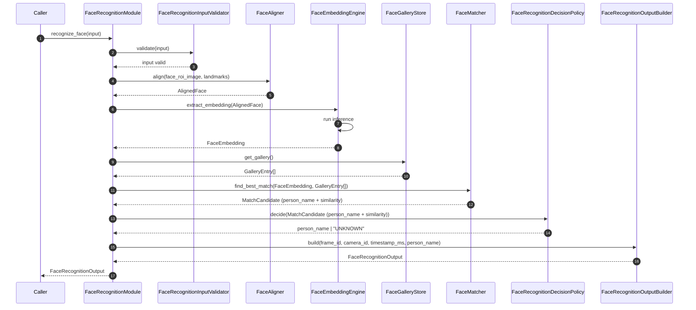
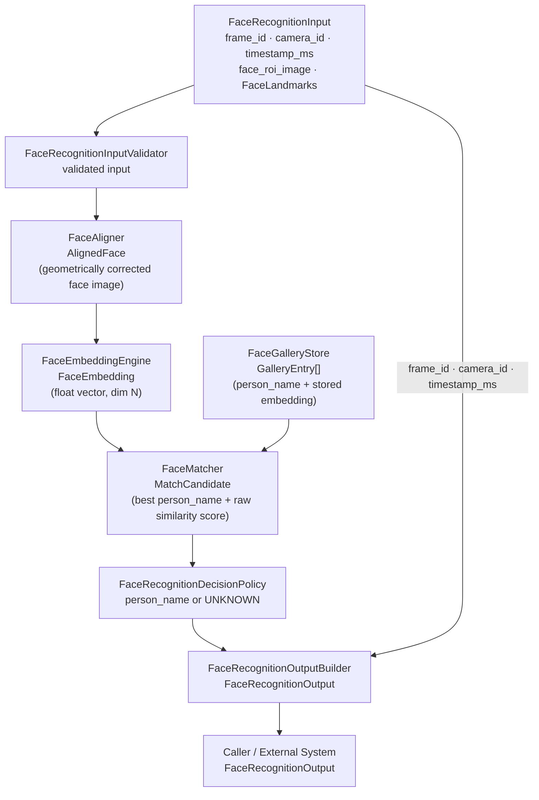

# Face Recognition Module Specification

---

## 1. Scope

### Purpose

The Face Recognition module is responsible for determining the identity of a single detected face. It receives a pre-cropped face ROI image and its canonical facial landmarks, and returns a single recognized person name or `"UNKNOWN"`. This module is the final stage in the IPS pipeline. After this stage, the IPS forwards the result to an external system without further processing.

### In Scope

- Validating the incoming face ROI image and landmarks
- Aligning the face using the 5-point canonical landmarks
- Extracting a face embedding via the configured embedding engine
- Comparing the embedding against the enrolled gallery
- Applying threshold-based recognition acceptance
- Returning a clean identity result (`person_name` or `"UNKNOWN"`)
- Configuration-driven threshold — loaded at initialization, not passed per invocation

### Out of Scope

The Face Recognition Module does NOT:

- Perform color conversion, resizing, normalization, or any generic image preprocessing — these are handled outside this module
- Detect faces or persons
- Manage multi-face input — upstream IPS handles dispatching; one face per invocation
- Expose similarity scores, embeddings, landmarks, bounding boxes, or match flags
- Enroll new identities into the gallery
- Manage camera stream state or frame sequencing

---

## 2. Input

### 2.1 Input Responsibility Boundary

The module receives a pre-cropped face ROI image already matching the configured recognition engine input contract. The input image is assumed to be pre-prepared before entering the module. The following have already been applied:

- Color format conversion
- Resize to model-required dimensions
- Normalization and layout compliance

The Face Recognition module does not perform any generic image preprocessing. It assumes `face_roi_image` already satisfies the configured engine contract. Only recognition-specific processing (alignment, embedding, matching) is performed inside this module.

### 2.2 Input Structure

```text
struct Point {
    int32 x;
    int32 y;
}

struct FaceLandmarks {
    Point left_eye;
    Point right_eye;
    Point nose;
    Point mouth_left;
    Point mouth_right;
}

struct FaceRecognitionInput {
    uint64        frame_id;
    string        camera_id;
    uint64        timestamp_ms;
    Image         face_roi_image;
    FaceLandmarks landmarks;
}
```

`Image` is an opaque type. Its internal representation is not defined by this module. `FaceLandmarks` is a fully typed canonical struct defined above.

### 2.3 Input Contract

`face_roi_image` must satisfy the configured recognition engine contract before entering the module:

- Contains only the detected face (pre-cropped; not the full frame)
- Color format, layout, dtype, and value range match the configured `FaceEmbeddingEngine` input requirements
- Dimensions match the requirements of the configured embedding model

`FaceLandmarks` provides the canonical 5 facial key points. All coordinates are relative to `face_roi_image`. No bounding boxes are present or required at this stage.

### 2.4 Validation Rules

`FaceRecognitionInputValidator` must verify:

- `frame_id` must exist
- `camera_id` must exist and be non-empty
- `timestamp_ms` must exist
- `face_roi_image` must exist and be non-null
- `landmarks` must be present with all 5 points defined
- Each landmark point must have finite coordinates within `face_roi_image` bounds

### 2.5 Input Semantics

- `frame_id` — source frame identifier; preserved unchanged for traceability
- `camera_id` — source camera identifier; preserved unchanged for traceability
- `timestamp_ms` — capture timestamp in milliseconds; preserved unchanged for traceability
- `face_roi_image` — prepared face crop; input to the alignment and embedding pipeline
- `landmarks` — canonical 5-point facial key points used exclusively by `FaceAligner`; not used for detection, bounding, or output

---

## 3. Output

### 3.1 Output Structure

```text
struct FaceRecognitionOutput {
    uint64 frame_id;
    string camera_id;
    uint64 timestamp_ms;
    string person_name;
}
```

### 3.2 Output Semantics

- `frame_id`, `camera_id`, `timestamp_ms` — copied unchanged from input for traceability
- `person_name` — the recognized identity if a match was found above threshold; set to `"UNKNOWN"` if no valid match was found

### 3.3 Output Constraints

The output must NOT expose:

- Similarity scores or distance values
- Face embeddings or feature vectors
- Facial landmarks
- Bounding boxes
- Match flags, confidence indicators, or candidate lists

All matching logic and intermediate computation are strictly internal. The only externally visible result is `person_name`.

---

## 4. Public API

```text
recognize_face(input: FaceRecognitionInput) -> FaceRecognitionOutput
```

The API must remain stable regardless of which embedding engine is configured. Threshold is never a parameter — it is immutable internal configuration state loaded at initialization.

---

## 5. Non-Functional Requirements

- **Stateless per invocation** — no cross-frame memory, with the sole exception of `FaceGalleryStore`, which is read-only during recognition
- **Single face per invocation** — upstream IPS is responsible for dispatching individual face crops; the module must not accept batched input
- **Real-time capable** — suitable for per-frame online processing
- **Deterministic** — same input + same configuration + same gallery state produce the same output
- **Model-agnostic API** — the public output schema is independent of the underlying embedding model
- **Strict isolation** — no internal AI data (embeddings, scores, raw tensors) escapes the public API

---

## 6. Processing Engine

### 6.1 Engine Abstraction Interface

```text
interface FaceEmbeddingEngine {
    extract_embedding(aligned_face: AlignedFace) -> FaceEmbedding
}
```

### 6.2 Current Default Implementation

```text
class ArcFaceEmbeddingEngine implements FaceEmbeddingEngine
```

ArcFace is an AI-based engine (neural network inference). It produces a fixed-dimension L2-normalized embedding vector from an aligned face image.

### 6.3 Replaceability

The module depends on the `FaceEmbeddingEngine` interface, not on `ArcFaceEmbeddingEngine` directly. Any embedding model producing a fixed-dimension vector may be substituted without changing `FaceRecognitionInput`, `FaceRecognitionOutput`, or calling code. Replacing the engine does NOT affect the public API.

---

## 7. Acceptance / Filtering Logic

Recognition acceptance is threshold-based and exclusively managed by `FaceRecognitionDecisionPolicy`.

- `FaceMatcher` returns the best candidate and its raw similarity score from the gallery. If the gallery is empty, it returns no candidate.
- `FaceRecognitionDecisionPolicy` applies `recognition_threshold`:
  - If similarity ≥ `recognition_threshold` → return `person_name`, else `"UNKNOWN"`
- The threshold is loaded from configuration at initialization. It is immutable and not adjustable per invocation.
- No match flags or similarity scores are returned to the caller.
- `FaceRecognitionDecisionPolicy` is the only place inside the module that makes accept or reject decisions.

---

## 8. Internal Architecture

| Component | Responsibility |
|---|---|
| `FaceRecognitionModule` | Orchestration only; wires and invokes internal components in order |
| `FaceRecognitionInputValidator` | Validates all input fields and landmarks before processing begins |
| `FaceAligner` | Produces a geometrically aligned face image from the ROI using 5 landmarks |
| `FaceEmbeddingEngine` | Abstraction interface; runs embedding model inference on aligned face |
| `ArcFaceEmbeddingEngine` | Default implementation of `FaceEmbeddingEngine` (AI-based, neural network) |
| `FaceGalleryStore` | Provides read-only access to enrolled face embeddings; persistent across invocations |
| `FaceMatcher` | Compares query embedding to gallery entries; returns best candidate and raw similarity score |
| `FaceRecognitionDecisionPolicy` | Applies threshold; returns person name or `"UNKNOWN"` |
| `FaceRecognitionOutputBuilder` | Constructs the final `FaceRecognitionOutput`; copies metadata from input |

### Component Boundaries

**`FaceRecognitionModule`**
- Receives: `FaceRecognitionInput`
- Returns: `FaceRecognitionOutput`
- Must NOT: embed validation, alignment, inference, matching, or decision logic

**`FaceRecognitionInputValidator`**
- Receives: `FaceRecognitionInput`
- Returns: validated signal (or error caught by module)
- Must NOT: perform preprocessing, alignment, or matching

**`FaceAligner`**
- Receives: `face_roi_image`, `FaceLandmarks`
- Returns: `AlignedFace`
- Must NOT: run inference, access gallery, apply thresholds

**`FaceEmbeddingEngine`**
- Receives: `AlignedFace`
- Returns: `FaceEmbedding`
- Must NOT: compare to gallery, make accept or reject decisions

**`FaceGalleryStore`**
- Receives: gallery retrieval request
- Returns: `GalleryEntry[]`
- Must NOT: modify gallery state during recognition, make matching decisions

**`FaceMatcher`**
- Receives: `FaceEmbedding`, `GalleryEntry[]`
- Returns: `MatchCandidate` (best candidate + raw similarity score) or empty
- Must NOT: apply threshold, make accept or reject decisions

**`FaceRecognitionDecisionPolicy`**
- Receives: `MatchCandidate` (or empty)
- Returns: `person_name` string or `"UNKNOWN"`
- Must NOT: access gallery, run inference

**`FaceRecognitionOutputBuilder`**
- Receives: frame metadata + `person_name`
- Returns: `FaceRecognitionOutput`
- Must NOT: perform matching or decision logic

---

## 9. Internal Pipeline

**Single-line flow:**

```
validate → align face → extract embedding → compare to gallery → apply threshold → return person_name
```

**Step-by-step:**

1. `FaceRecognitionModule` receives `FaceRecognitionInput`
2. `FaceRecognitionModule` calls `FaceRecognitionInputValidator.validate(input)`
3. `FaceRecognitionModule` calls `FaceAligner.align(face_roi_image, landmarks)` → `AlignedFace`
4. `FaceRecognitionModule` calls `FaceEmbeddingEngine.extract_embedding(AlignedFace)` → `FaceEmbedding`
5. `FaceRecognitionModule` calls `FaceGalleryStore.get_gallery()` → `GalleryEntry[]`
6. `FaceRecognitionModule` calls `FaceMatcher.find_best_match(FaceEmbedding, GalleryEntry[])` → `MatchCandidate`
7. `FaceRecognitionModule` calls `FaceRecognitionDecisionPolicy.decide(MatchCandidate)` → `person_name` or `"UNKNOWN"`
8. `FaceRecognitionModule` calls `FaceRecognitionOutputBuilder.build(frame_id, camera_id, timestamp_ms, person_name)` → `FaceRecognitionOutput`
9. `FaceRecognitionModule` returns `FaceRecognitionOutput` to caller

All intermediate data (aligned face, embedding, gallery entries, match scores) remain strictly internal.

---

## 10. Configuration

### 10.1 Configuration Parameters

```text
struct FaceRecognitionConfig {
    float  recognition_threshold;    // acceptance threshold; applied internally only
    string gallery_source;           // "database" | "file" | "external_service"
}
```

### 10.2 Loading Behavior

Configuration is loaded exactly once during module initialization. It is immutable after initialization and reused unchanged across all invocations. No configuration parameter is part of `FaceRecognitionInput`.

Injection at construction time:

- `recognition_threshold` → `FaceRecognitionDecisionPolicy`
- `gallery_source` → `FaceGalleryStore`
- `FaceEmbeddingEngine` is injected as an abstract dependency, with `ArcFaceEmbeddingEngine` as the default implementation

---

## 11. Internal Data Structures

- **`AlignedFace`** — geometrically aligned face image ready for embedding extraction; produced by `FaceAligner`, consumed by `FaceEmbeddingEngine`; lifecycle: per-call
- **`FaceEmbedding`** — fixed-dimension float vector representing face identity; produced by `FaceEmbeddingEngine`, consumed by `FaceMatcher`; lifecycle: per-call
- **`GalleryEntry`** — enrolled identity record containing `person_name` and stored embedding vector; provided by `FaceGalleryStore`; lifecycle: persistent (loaded at initialization or on demand from source)
- **`MatchCandidate`** — best gallery match containing candidate `person_name` and raw similarity score; produced by `FaceMatcher`, consumed by `FaceRecognitionDecisionPolicy`; lifecycle: per-call

---

## 12. Error Handling

- **Validation failure** (missing fields, null image, malformed landmarks) → return `FaceRecognitionOutput` with `person_name = "UNKNOWN"`
- **Alignment failure** (degenerate landmarks, geometric error) → catch internally, return `person_name = "UNKNOWN"`
- **Inference failure** (embedding engine runtime error) → catch internally, return `person_name = "UNKNOWN"`
- **Empty gallery** (no enrolled identities) → `FaceMatcher` returns no candidate; `FaceRecognitionDecisionPolicy` returns `"UNKNOWN"`; normal operation
- **No match above threshold** → return `person_name = "UNKNOWN"`; normal operation

---

## 13. Metrics / Observability

- `alignment_time_ms` — `FaceAligner.align()` duration
- `inference_time_ms` — `FaceEmbeddingEngine.extract_embedding()` duration
- `total_recognition_time_ms` — full `recognize_face()` duration
- `recognition_accepted_count` — invocations producing a named match
- `recognition_unknown_count` — invocations returning `"UNKNOWN"`
- `validation_failure_count` — inputs rejected by `FaceRecognitionInputValidator`

Metrics are internal and operational. Not part of the public API.

---

## 14. Lifecycle

- **Initialization** — load `FaceRecognitionConfig`; initialize the configured `FaceEmbeddingEngine` implementation; initialize `FaceGalleryStore` (connect to gallery source, load or index entries); wire all internal components with injected configuration values
- **Per invocation** — stateless; validate → align → embed → match → decide → build output; no state carries between calls
- **Shutdown** — release `FaceEmbeddingEngine` resources; close `FaceGalleryStore` connection if applicable

---

## 15. Class Diagram

```mermaid
classDiagram
    class FaceRecognitionModule {
        +recognize_face(input: FaceRecognitionInput) FaceRecognitionOutput
    }

    class FaceRecognitionInputValidator {
        +validate(input: FaceRecognitionInput) void
    }

    class FaceAligner {
        +align(face_roi_image: Image, landmarks: FaceLandmarks) AlignedFace
    }

    class FaceEmbeddingEngine {
        <<interface>>
        +extract_embedding(aligned_face: AlignedFace) FaceEmbedding
    }

    class ArcFaceEmbeddingEngine {
        +extract_embedding(aligned_face: AlignedFace) FaceEmbedding
    }

    class FaceGalleryStore {
        +get_gallery() GalleryEntry[]
    }

    class FaceMatcher {
        +find_best_match(embedding: FaceEmbedding, gallery: GalleryEntry[]) MatchCandidate
    }

    class FaceRecognitionDecisionPolicy {
        +decide(candidate: MatchCandidate) string
    }

    class FaceRecognitionOutputBuilder {
        +build(frame_id: uint64, camera_id: string, timestamp_ms: uint64, person_name: string) FaceRecognitionOutput
    }

    class FaceRecognitionInput {
        +frame_id: uint64
        +camera_id: string
        +timestamp_ms: uint64
        +face_roi_image: Image
        +landmarks: FaceLandmarks
    }

    class FaceRecognitionOutput {
        +frame_id: uint64
        +camera_id: string
        +timestamp_ms: uint64
        +person_name: string
    }

    class FaceLandmarks {
        +left_eye: Point
        +right_eye: Point
        +nose: Point
        +mouth_left: Point
        +mouth_right: Point
    }

    class Point {
        +x: int32
        +y: int32
    }

    FaceRecognitionModule --> FaceRecognitionInputValidator : orchestrates
    FaceRecognitionModule --> FaceAligner : orchestrates
    FaceRecognitionModule --> FaceEmbeddingEngine : orchestrates
    FaceRecognitionModule --> FaceGalleryStore : orchestrates
    FaceRecognitionModule --> FaceMatcher : orchestrates
    FaceRecognitionModule --> FaceRecognitionDecisionPolicy : orchestrates
    FaceRecognitionModule --> FaceRecognitionOutputBuilder : orchestrates
    ArcFaceEmbeddingEngine ..|> FaceEmbeddingEngine : implements
    FaceRecognitionModule --> FaceRecognitionInput : consumes
    FaceRecognitionModule --> FaceRecognitionOutput : returns
    FaceRecognitionInput --> FaceLandmarks : contains
    FaceLandmarks --> Point : uses
```



---

## 16. Sequence Diagram



---

## 17. Data Flow Diagram



---

## 18. Extensibility

**What can change without breaking the public API:**

- Embedding model (`ArcFaceEmbeddingEngine` → any engine implementing `FaceEmbeddingEngine`)
- Inference backend (ONNX, TensorRT, etc.) — internal to the engine implementation
- Gallery source (`database` / `file` / `external_service`, via configuration)
- Recognition threshold (configuration-only change)

**What must remain stable:**

- `recognize_face(input: FaceRecognitionInput) -> FaceRecognitionOutput` signature
- Output schema: `{ frame_id, camera_id, timestamp_ms, person_name }`
- `"UNKNOWN"` semantics for the no-match case

---

## 19. Module Compliance Checklist

- [ ] One face per invocation — module must not accept or process batched face input
- [ ] Threshold applied internally — `recognition_threshold` must never appear in `FaceRecognitionInput` or `FaceRecognitionOutput`
- [ ] No embedding exposure — `FaceEmbedding` must never appear in `FaceRecognitionOutput`
- [ ] No score exposure — similarity or distance values must never appear in `FaceRecognitionOutput`
- [ ] No landmark exposure — `FaceLandmarks` is not returned in output
- [ ] No bounding box in input — `BoundingBox` is not part of `FaceRecognitionInput`
- [ ] Engine abstraction respected — `FaceRecognitionModule` depends on `FaceEmbeddingEngine` interface, not on `ArcFaceEmbeddingEngine` directly
- [ ] Preprocessing boundaries enforced — module performs no color conversion, resize, or normalization
- [ ] Metadata preserved — `frame_id`, `camera_id`, `timestamp_ms` copied unchanged from input to output
- [ ] `"UNKNOWN"` returned for all non-match scenarios — including empty gallery, threshold miss, validation failure, and runtime failure
