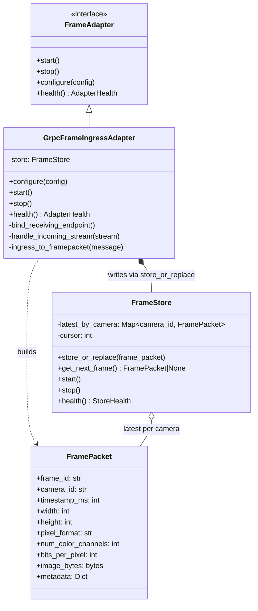
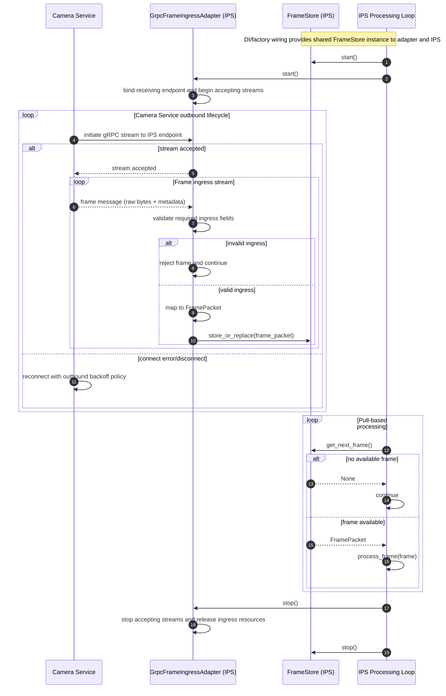

# Frame Adapter

## Purpose
The Frame Adapter in IPS is a server-side ingress receiver for Camera Service frame streams. IPS hosts the receiving gRPC endpoint, accepts incoming frame messages pushed by Camera Service, validates ingress fields, and builds canonical FramePacket objects for IPS.

IPS does not connect directly to cameras and does not dial Camera Service for frame pull. RTSP/USB/file connectivity and outbound streaming initiation belong to Camera Service.

## Architectural Role
The Frame Adapter architecture is composed of two focused classes with clear boundaries:

**GrpcFrameIngressAdapter** - server-side ingress receiving and packet construction:
- Hosts/exposes the gRPC receiving stream endpoint inside IPS.
- Accepts Camera Service outbound streaming connections.
- Handles accepted stream messages from Camera Service.
- Parses ingress transport messages and validates required fields.
- Builds canonical FramePacket objects (`frame_id`, `camera_id`, `timestamp_ms`, `width`, `height`, `pixel_format`, `num_color_channels`, `bits_per_pixel`, `image_bytes`, `metadata`).
- Emits ingress metrics: `frames_in_total`, `ingest_latency_ms`, `active_ingress_streams`.
- Pushes every accepted frame to FrameStore using `store_or_replace(frame_packet)`.

**FrameStore** - latest-frame-per-camera storage and retrieval only:
- Owns in-memory storage with exactly one slot per `camera_id`.
- Exposes `store_or_replace(frame_packet)` as ingestion target.
- Replaces any older frame currently stored for the same camera with the newest frame.
- Exposes `get_next_frame()` as the only frame retrieval API for IPS.
- Does not parse ingress messages and does not perform gRPC operations.
- Emits storage metrics: `frames_overwritten_total`, `active_camera_slots`, `frames_served_total`.

**Key Principle:**
Camera Service sends raw frame payload only. Frame Adapter does not decode or transcode ingress payloads.

## Responsibility Boundary
Camera Service owns outbound stream initiation, outbound stream maintenance, and reconnect behavior toward IPS.

GrpcFrameIngressAdapter owns receiving endpoint lifecycle inside IPS (`bind`, `accept`, `handle inbound stream`, `shutdown`), ingress receive/parse/validation, and FramePacket creation. FrameStore owns latest-frame storage and round-robin retrieval. Neither class performs downstream image processing.

## Module Diagrams (mermaid)

### Class Diagram


### Sequence Diagram


## Supported Ingress Contract
- gRPC streaming messages sent from Camera Service to IPS receiving endpoint.
- Required ingress fields: `frame_id`, `camera_id`, `timestamp_ms`, `width`, `height`, `pixel_format`, `num_color_channels`, `bits_per_pixel`, raw payload bytes.
- Encoded/compressed payload ingress is out of scope for this contract.
- Adapter accepts ingress messages, validates required fields, and canonicalizes to FramePacket before storage.

## Base Interfaces

### FrameAdapter
All concrete adapters implement the following conceptual interface:
- `start()` - Non-blocking. Allocates ingress resources, binds/starts the receiving gRPC service endpoint, and begins accepting Camera Service streams.
- `stop()` - Graceful shutdown: stop accepting streams, end stream handlers, and release ingress server/network resources.
- `configure(config: FrameAdapterConfig)` - Provide adapter configuration (bind address, service name, stream policy, and validation options).
- `health() -> AdapterHealth` - Optional health/status report for monitoring.

### FrameStore
Frame retrieval is provided only by FrameStore:
- `store_or_replace(frame_packet: FramePacket)`
- `get_next_frame() -> FramePacket | None`
- `start()` / `stop()`
- `health() -> StoreHealth`

## Concurrency Model
GrpcFrameIngressAdapter runs one ingress receiving endpoint with one or more server-side stream handlers. Each handler processes incoming messages from an accepted Camera Service stream: validate fields, build FramePacket, then write to FrameStore via `store_or_replace(frame_packet)`.

FrameStore is shared between ingress producer handlers (GrpcFrameIngressAdapter) and the IPS processing loop consumer. IPS pulls frames directly from FrameStore by calling `get_next_frame()`.

## Round-Robin Retrieval Rule (FrameStore)
- Camera traversal order is fixed by configured camera list order.
- If a camera slot has no new frame, skip it and continue to next camera.
- The internal cursor advances across calls and resumes from the next camera after each returned frame.
- Returning a frame marks that camera slot as consumed until a new frame arrives.
- If all configured camera slots are empty, `get_next_frame()` returns `None` immediately.

## Storage Sizing
Storage capacity is proportional to active camera count: one frame slot per camera. With 5 active cameras, maximum retained frames is 5.

## Lifecycle Ordering
- `start()`: start FrameStore, then start GrpcFrameIngressAdapter receiving endpoint.
- `stop()`: stop GrpcFrameIngressAdapter receiving endpoint, then stop FrameStore.

## IPS Core Implementation

### GrpcFrameIngressAdapter
Public adapter implementation for server-side ingress receiving.

- Binds and serves the IPS receiving gRPC endpoint on `start()`.
- Accepts Camera Service outbound stream connections and handles inbound frame messages.
- Parses envelope and metadata (`frame_id`, `camera_id`, `timestamp_ms`, `width`, `height`, `pixel_format`, `num_color_channels`, `bits_per_pixel`).
- Creates FramePacket from raw ingress payload without altering representation.
- Calls `FrameStore.store_or_replace(frame_packet)` for each accepted frame.

**Interface:**
- `configure(config)`
- `start()` / `stop()`
- `health() -> AdapterHealth`

**Metrics owned:** `frames_in_total`, `ingest_latency_ms`, `active_ingress_streams`, `ingress_rejected_total`.

**Configuration fields owned:**
```yaml
bind_address: 0.0.0.0:50061
service_name: ips.frame_ingress.v1.FrameIngressService
stream_name: frames
max_concurrent_streams: 32
```

---

### FrameStore
Pure latest-frame storage and retrieval. No gRPC parsing.

- Exposes `store_or_replace(frame_packet)` ingestion entry point.
- Stores exactly one latest frame per camera key (`camera_id`).
- Overwrites the previously stored frame for the same camera on every new arrival.
- Exposes `get_next_frame()` for round-robin pull retrieval.
- Does not execute downstream callbacks.

**Interface:**
- `store_or_replace(frame_packet: FramePacket)`
- `get_next_frame() -> FramePacket | None`
- `start()` / `stop()`
- `health() -> StoreHealth`

**Metrics owned:** `frames_overwritten_total`, `active_camera_slots`, `frames_served_total`.

**Configuration fields owned:**
```yaml
max_camera_slots: 128
camera_order_source: configured_list
```

## Frame Object: FramePacket
Canonical in-process frame model used by IPS pipeline.

```python
from dataclasses import dataclass
from typing import Any, Dict


@dataclass
class FramePacket:
    frame_id: str           # provided by Camera Service ingress
    camera_id: str
    timestamp_ms: int       # epoch milliseconds
    width: int
    height: int
    pixel_format: str       # e.g., 'RGB', 'BGR', 'GRAY8', 'YUV420'
    num_color_channels: int
    bits_per_pixel: int
    image_bytes: bytes      # raw ingress payload bytes only
    metadata: Dict[str, Any]
```

### Payload Handoff to Transformation Layer

- `image_bytes` is the canonical payload field produced by Frame Adapter.
- In transformation-layer contracts that use `payload`, `payload` maps directly to `FramePacket.image_bytes`.
- `metadata` should carry `encoding` when payload is encoded (for example `JPEG`, `H264`) and `pixel_format` remains mandatory.
- Frame Adapter does not decode or transcode payload bytes. Decoding is delegated to the transformation boundary `PayloadDecoder`.

**Mutability Strategy:**
- FramePacket carries ingest/core fields produced by the ingress receiver.
- Raw payload fields are immutable by policy after creation.

**Adapter Conversion Rules:**
- Preserve ingress representation; do not decode or transcode in Frame Adapter.
- Populate `width`, `height`, `pixel_format`, `num_color_channels`, `bits_per_pixel` from ingress metadata.
- Validate metadata consistency against payload expectations when possible.
- `frame_id` and `camera_id` come from Camera Service ingress and are mandatory.

## Communication and Integration

- Camera Service owns outbound stream initiation toward IPS.
- GrpcFrameIngressAdapter owns the receiving endpoint lifecycle and accepted-stream handling inside IPS.
- GrpcFrameIngressAdapter receives gRPC frame messages from Camera Service and writes accepted frames to FrameStore.
- IPS pipeline calls `FrameStore.get_next_frame()` directly to pull frames in round-robin order.

**Explicit communication model note:**
"Camera Service is the active streaming sender. IPS Frame Adapter is the passive receiving ingress endpoint. IPS does not dial Camera Service to pull frames in this architecture."

## Initialization / DI Wiring
1. Config loader reads adapter and store config (IPS bind address/service options, validation options, storage options).
2. Composition root creates one shared FrameStore instance.
3. Composition root creates GrpcFrameIngressAdapter, injecting the shared FrameStore.
4. Call `adapter.start()` to bind/start the IPS receiving endpoint.
5. Camera Service connects and pushes frame messages into IPS.
6. Processing loop pulls frames directly from the shared FrameStore:

```python
store = FrameStore(store_config)
adapter = GrpcFrameIngressAdapter(adapter_config, store)

adapter.start()

while running:
    frame = store.get_next_frame()
    if frame is None:
        continue
    process_frame(frame)
```

## Implementation Notes
- Camera ingestion inside IPS is gRPC-only and receiving-endpoint based.
- Ingress payload is raw-only; encoded/compressed ingress is rejected.
- Camera Service handles outbound reconnect policy when streams disconnect.
- FrameStore intentionally overwrites stale frames for the same camera.
- Retrieval order is round-robin across cameras using fixed configured camera list order.
- Unit tests for FrameStore: overwrite semantics, round-robin order, per-camera isolation, max slot bounds.

## Verification Checklist

**GrpcFrameIngressAdapter**
- [ ] Unit tests pass: server-side stream handling, gRPC ingress parsing, FramePacket mapping, timestamp handling.
- [ ] Endpoint lifecycle validated: bind/start accepts streams on `start()`, stop rejects new streams on `stop()`.
- [ ] Ingress mapping validated (`frame_id`, `camera_id`, `pixel_format`, `num_color_channels`, `bits_per_pixel`).
- [ ] Integration with FrameStore validated (`store_or_replace` called for accepted frames).

**Camera Service integration contract**
- [ ] Camera Service initiates outbound stream toward IPS ingress endpoint.
- [ ] Camera Service reconnect behavior validated when IPS endpoint is unavailable or connection drops.

**FrameStore**
- [ ] One-slot-per-camera behavior validated.
- [ ] With 5 active cameras, retained frames never exceed 5.
- [ ] New frame for camera replaces prior stored frame for same camera.
- [ ] `get_next_frame()` returns frames in round-robin fixed configured camera order.
- [ ] Overwrite on camera A does not affect camera B.
- [ ] FrameStore does not invoke downstream consumers; retrieval is pull-only via `get_next_frame()`.

**End-to-end flow**
- [ ] Integration test: Camera Service -> GrpcFrameIngressAdapter -> FrameStore -> IPS pull loop.

## Design Goals
- Clear separation: GrpcFrameIngressAdapter owns ingress receiving endpoint and canonicalization; FrameStore owns latest-frame storage and retrieval.
- Camera Service remains the active outbound sender and reconnect owner.
- Always prefer newest frame per camera over backlog processing.
- Bound memory by camera count (one frame per camera).
- Round-robin fairness across cameras in retrieval order.

---

## Appendix: Minimal Ingress-to-FramePacket Mapping Example (Python)
```python
import time


def ingress_to_framepacket(payload_bytes, src_meta):
    return FramePacket(
        frame_id=src_meta["frame_id"],
        camera_id=src_meta["camera_id"],
        timestamp_ms=src_meta.get("pts_ms") or int(time.time() * 1000),
        width=src_meta["width"],
        height=src_meta["height"],
        pixel_format=src_meta["pixel_format"],
        num_color_channels=src_meta["num_color_channels"],
        bits_per_pixel=src_meta["bits_per_pixel"],
        image_bytes=payload_bytes,
        metadata=src_meta,
    )
```

**Appendix wording note:**
The mapping example assumes payload bytes arrive from an already accepted Camera Service outbound stream into the IPS receiving endpoint. The adapter maps and validates only; it does not dial Camera Service and does not decode/transcode payload bytes.
