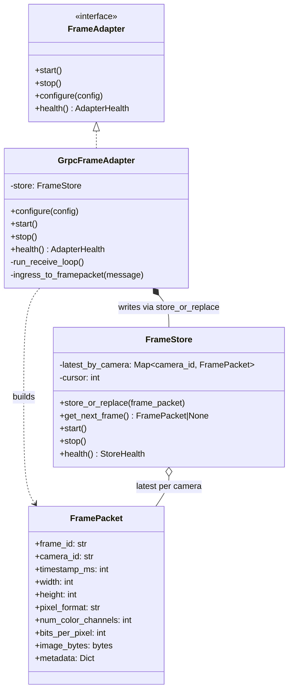
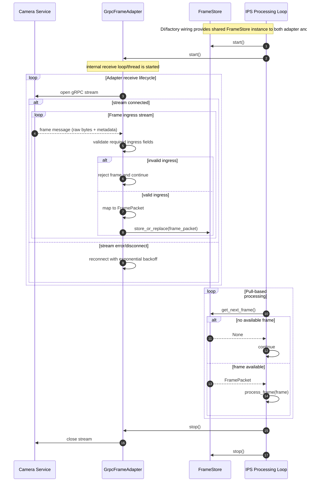

# Frame Adapter

## Purpose
The Frame Adapter in IPS is a gRPC client adapter. It receives frames from the Camera Service gRPC stream, validates ingress fields, and builds canonical FramePacket objects for IPS.

IPS does not connect directly to cameras. RTSP/USB/file connectivity and camera-side stream handling belong to Camera Service.

## Architectural Role
The Frame Adapter architecture is composed of two focused classes with clear boundaries:

**GrpcFrameAdapter** - ingress and packet construction:
- Acts as the gRPC client for Camera Service frame streaming.
- Receives frame messages from Camera Service.
- Parses ingress transport messages and validates required fields.
- Builds canonical FramePacket objects (`frame_id`, `camera_id`, `timestamp_ms`, `width`, `height`, `pixel_format`, `num_color_channels`, `bits_per_pixel`, `image_bytes`, `metadata`).
- Handles reconnect logic with exponential backoff.
- Emits ingress metrics: `frames_in_total`, `adapter_reconnects_total`, `ingest_latency_ms`.
- Pushes every accepted frame to FrameStore using `store_or_replace(frame_packet)`.

**FrameStore** - latest-frame-per-camera storage and retrieval only:
- Owns in-memory storage with exactly one slot per `camera_id`.
- Exposes `store_or_replace(frame_packet)` as ingestion target.
- Replaces any older frame currently stored for the same camera with the newest frame.
- Exposes `get_next_frame()` as the only frame retrieval API for IPS.
- Does not parse ingress messages and does not perform gRPC operations.
- Emits storage metrics: `frames_overwritten_total`, `active_camera_slots`, `frames_served_total`.

**Key Principle:**
Camera Service sends raw frame payload only. Frame Adapter does not decode or transcode ingress payloads.

**Responsibility Boundary:**
GrpcFrameAdapter owns ingress receive/parse/validation and FramePacket creation. FrameStore owns latest-frame storage and round-robin retrieval. Neither class performs downstream image processing.

## Module Diagrams (mermaid)

### Class Diagram


### Sequence Diagram


## Supported Ingress Contract
- gRPC streaming messages from Camera Service only.
- Required ingress fields: `frame_id`, `camera_id`, `timestamp_ms`, `width`, `height`, `pixel_format`, `num_color_channels`, `bits_per_pixel`, raw payload bytes.
- Encoded/compressed payload ingress is out of scope for this contract.

## Base Interfaces

### FrameAdapter
All concrete adapters implement the following conceptual interface:
- `start()` - Non-blocking. Allocates resources and starts the gRPC receive loop.
- `stop()` - Graceful shutdown: stop receive loop and close stream and network handles.
- `configure(config: FrameAdapterConfig)` - Provide adapter configuration (service endpoint, stream name, filters, and retry options).
- `health() -> AdapterHealth` - Optional health/status report for monitoring.

### FrameStore
Frame retrieval is provided only by FrameStore:
- `store_or_replace(frame_packet: FramePacket)`
- `get_next_frame() -> FramePacket | None`
- `start()` / `stop()`
- `health() -> StoreHealth`

## Concurrency Model
GrpcFrameAdapter runs a single gRPC receive thread (or async task). For each incoming message, it validates fields, builds a FramePacket, and writes to FrameStore via `store_or_replace(packet)`.

FrameStore is shared between producer (GrpcFrameAdapter) and consumer (IPS processing loop). IPS pulls frames directly from FrameStore by calling `get_next_frame()`.

## Round-Robin Retrieval Rule (FrameStore)
- Camera traversal order is fixed by configured camera list order.
- If a camera slot has no new frame, skip it and continue to next camera.
- The internal cursor advances across calls and resumes from the next camera after each returned frame.
- Returning a frame marks that camera slot as consumed until a new frame arrives.
- If all configured camera slots are empty, `get_next_frame()` returns `None` immediately.

## Storage Sizing
Storage capacity is proportional to active camera count: one frame slot per camera. With 5 active cameras, maximum retained frames is 5.

## Lifecycle Ordering
- `start()`: start FrameStore, then start GrpcFrameAdapter receive loop.
- `stop()`: stop GrpcFrameAdapter receive loop, then stop FrameStore.

## IPS Core Implementation

### GrpcFrameAdapter
Public adapter implementation for ingress.

- Connects to Camera Service gRPC streaming endpoint and receives frame messages.
- Parses envelope and metadata (`frame_id`, `camera_id`, `timestamp_ms`, `width`, `height`, `pixel_format`, `num_color_channels`, `bits_per_pixel`).
- Creates FramePacket from raw ingress payload without altering representation.
- Handles stream reconnect with exponential backoff.
- Calls `FrameStore.store_or_replace` for each accepted frame.

**Interface:**
- `configure(config)`
- `start()` / `stop()`
- `health() -> AdapterHealth`

**Metrics owned:** `frames_in_total`, `ingest_latency_ms`, `adapter_reconnects_total`.

**Configuration fields owned:**
```yaml
camera_service_endpoint: camera-service:50051
stream_name: frames
reconnect:
  max_retries: 0    # 0 == infinite
  base_backoff_ms: 500
  max_backoff_ms: 10000
```

---

### FrameStore
Pure latest-frame storage and retrieval. No gRPC parsing.

- Exposes `store_or_replace(frame_packet)` ingestion entry point.
- Stores exactly one latest frame per camera key (`camera_id`).
- Overwrites the previously stored frame for the same camera on every new arrival.
- Exposes `get_next_frame()` for round-robin pull retrieval.
- Does not execute downstream callbacks.

**Interface:**
- `store_or_replace(frame_packet: FramePacket)`
- `get_next_frame() -> FramePacket | None`
- `start()` / `stop()`
- `health() -> StoreHealth`

**Metrics owned:** `frames_overwritten_total`, `active_camera_slots`, `frames_served_total`.

**Configuration fields owned:**
```yaml
max_camera_slots: 128
camera_order_source: configured_list
```

## Frame Object: FramePacket
Canonical in-process frame model used by IPS pipeline.

```python
from dataclasses import dataclass
from typing import Any, Dict


@dataclass
class FramePacket:
    frame_id: str           # provided by Camera Service ingress
    camera_id: str
    timestamp_ms: int       # epoch milliseconds
    width: int
    height: int
    pixel_format: str       # e.g., 'RGB', 'BGR', 'GRAY8', 'YUV420'
    num_color_channels: int
    bits_per_pixel: int
    image_bytes: bytes      # raw ingress payload bytes only
    metadata: Dict[str, Any]
```

**Mutability Strategy:**
- FramePacket carries ingest/core fields produced by adapter.
- Raw payload fields are immutable by policy after creation.

**Adapter Conversion Rules:**
- Preserve ingress representation; do not decode or transcode in Frame Adapter.
- Populate `width`, `height`, `pixel_format`, `num_color_channels`, `bits_per_pixel` from ingress metadata.
- Validate metadata consistency against payload expectations when possible.
- `frame_id` and `camera_id` come from Camera Service ingress and are mandatory.

## Communication and Integration

- GrpcFrameAdapter receives gRPC frame messages from Camera Service.
- GrpcFrameAdapter writes every accepted frame to FrameStore.
- IPS pipeline calls `FrameStore.get_next_frame()` directly to pull frames in round-robin order.

**Initialization (DI/factory wiring):**
1. Config loader reads adapter and store config (`camera_service_endpoint`, `stream_name`, storage/retry options).
2. Composition root creates one shared `FrameStore` instance.
3. Composition root creates `GrpcFrameAdapter`, injecting the shared `FrameStore`.
4. Call `adapter.start()` to start ingress.
5. Processing loop pulls frames directly from the shared `FrameStore`:

```python
store = FrameStore(store_config)
adapter = GrpcFrameAdapter(adapter_config, store)

adapter.start()

while running:
    frame = store.get_next_frame()
    if frame is None:
        continue
    process_frame(frame)
```

## Implementation Notes
- Camera ingestion inside IPS is gRPC-only.
- Ingress payload is raw-only; encoded/compressed ingress is rejected.
- Stream reconnect uses bounded exponential backoff (GrpcFrameAdapter).
- FrameStore intentionally overwrites stale frames for the same camera.
- Retrieval order is round-robin across cameras using fixed configured camera list order.
- Unit tests for FrameStore: overwrite semantics, round-robin order, per-camera isolation, max slot bounds.

## Verification Checklist

**GrpcFrameAdapter**
- [ ] Unit tests pass: gRPC parsing, FramePacket mapping, timestamp handling.
- [ ] Reconnect with exponential backoff validated.
- [ ] Ingress mapping validated (`frame_id`, `camera_id`, `pixel_format`, `num_color_channels`, `bits_per_pixel`).
- [ ] Integration with FrameStore validated (`store_or_replace` called for accepted frames).

**FrameStore**
- [ ] One-slot-per-camera behavior validated.
- [ ] With 5 active cameras, retained frames never exceed 5.
- [ ] New frame for camera replaces prior stored frame for same camera.
- [ ] `get_next_frame()` returns frames in round-robin fixed configured camera order.
- [ ] Overwrite on camera A does not affect camera B.
- [ ] FrameStore does not invoke downstream consumers; retrieval is pull-only via `get_next_frame()`.

**End-to-end flow**
- [ ] Integration test: Camera Service -> GrpcFrameAdapter -> FrameStore -> IPS pull loop.

## Design Goals
- Clear separation: GrpcFrameAdapter owns ingress; FrameStore owns latest-frame storage and retrieval.
- Always prefer newest frame per camera over backlog processing.
- Bound memory by camera count (one frame per camera).
- Round-robin fairness across cameras in retrieval order.

---

## Appendix: Minimal FramePacket Conversion Example (Python)
```python
import time


def ingress_to_framepacket(payload_bytes, src_meta):
    return FramePacket(
        frame_id=src_meta["frame_id"],
        camera_id=src_meta["camera_id"],
        timestamp_ms=src_meta.get("pts_ms") or int(time.time() * 1000),
        width=src_meta["width"],
        height=src_meta["height"],
        pixel_format=src_meta["pixel_format"],
        num_color_channels=src_meta["num_color_channels"],
        bits_per_pixel=src_meta["bits_per_pixel"],
        image_bytes=payload_bytes,
        metadata=src_meta,
    )
```
