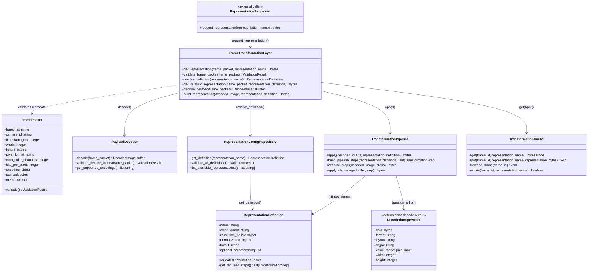
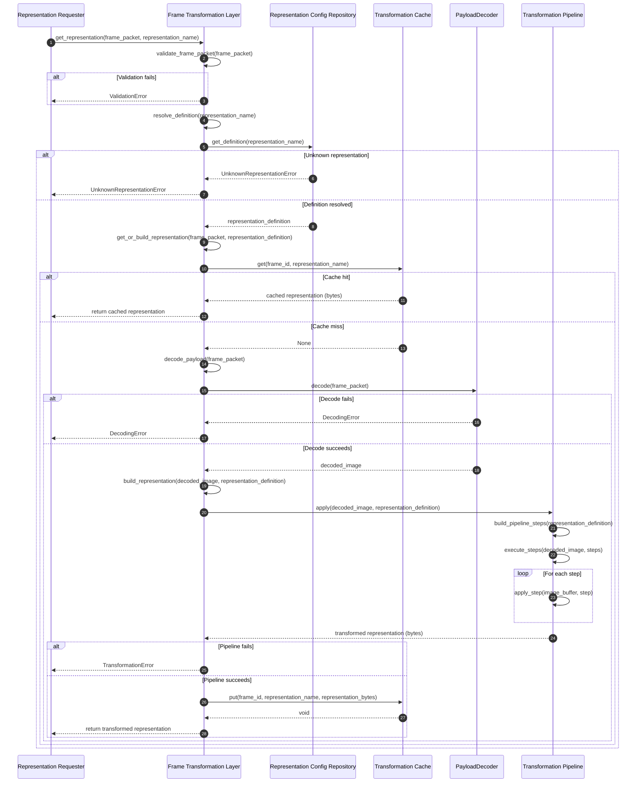
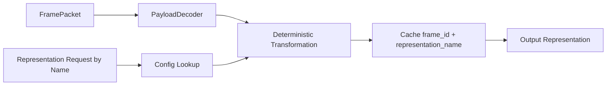

# Frame Transformation Layer

## Purpose

The Frame Transformation Layer converts one canonical frame input into one or more deterministic target representations.

The layer receives:

- An immutable `FramePacket` (canonical frame metadata and payload contract).
- A representation name that resolves to a configuration-defined transformation contract.

The layer does not run inference, does not know module internals, and does not contain module-specific transformation methods.

## Architectural Role

The Frame Transformation Layer is a representation service inside IPS.

It has exactly one architectural responsibility: build named representations from `FramePacket` payloads according to configuration-defined contracts.

Normative role:

- Accept immutable canonical frame input.
- Resolve a representation definition by representation name.
- Decode `FramePacket.payload` through a dedicated `PayloadDecoder` component.
- Apply deterministic transformation steps to decoded image buffers.
- Return the transformed representation.
- Cache results per frame and representation name.

Non-goals:

- No hardcoded APIs such as `build_for_motion_detection` or `build_for_object_detection`.
- No branching by module type.
- No embedded model-specific preprocessing logic outside representation definitions.

## Responsibility Boundary

### In Scope

- Read and validate canonical `FramePacket` metadata needed for frame-level consistency checks.
- Decode payload bytes through `PayloadDecoder` into deterministic internal image buffers.
- Build named target representations from representation definitions.
- Enforce deterministic preprocessing execution.
- Cache transformation outputs per frame and representation name.

### Out of Scope

The Frame Transformation Layer does not:

- Know what module uses the output.
- Perform inference.
- Contain model-specific logic outside representation definitions.
- Make decisions based on module type.
- Decide pipeline routing or execution order.
- Ingest camera streams or create `FramePacket`.

## Representation-Driven Design

### Representation Definition

Downstream consumers do not call dedicated transformation methods. They request a representation by unique name.

Each representation definition must include:

- Required color format (for example: `RGB`, `BGR`, `GRAYSCALE`).
- Resolution rules (resize target, aspect-ratio policy, letterbox policy).
- Normalization rules (for example: `[0,1]`, mean/std normalization).
- Data layout (`HWC` or `CHW`).
- Optional preprocessing steps (for example: crop, alignment, blur).

A representation definition is an explicit contract, not an implicit behavior.

## Configuration-Driven Behavior

All representation definitions are loaded from configuration.

Mandatory constraints:

- The Frame Transformation Layer must not hardcode representation logic.
- Representation changes must be possible through configuration only.
- Each representation must have a globally unique name within the service configuration.

Example representation names:

- `object_detection_input`
- `motion_detection_input`
- `face_detection_input`
- `face_recognition_input`

## Input Contract

The layer consumes:

- `FramePacket` (canonical metadata container, immutable).

Expected canonical fields include:

- `frame_id`
- `camera_id`
- `timestamp_ms`
- `width`
- `height`
- `pixel_format`
- `num_color_channels`
- `bits_per_pixel`
- `encoding` (optional if payload is already raw)
- payload bytes
- metadata map

Rules:

- `FramePacket` is immutable.
- Payload decoding must be deterministic.
- Missing or inconsistent required metadata must produce controlled validation errors.

## Output Contract

The layer returns one transformed representation for one requested representation name.

Rules:

- Returned output is a derived artifact, never a mutation of `FramePacket`.
- Output shape, type, layout, and value range must match the named representation definition.
- Callers may not assume interchangeability across representation names.

## Transformation Flow

The flow is request-driven by representation name.

1. A caller requests a representation by name.
2. The layer resolves the representation definition from configuration.
3. The layer checks cache using `(frame_id, representation_name)`.
4. On cache miss, the layer decodes payload via `PayloadDecoder`.
5. The layer applies deterministic transformations to the decoded image buffer.
6. The layer caches the result under `(frame_id, representation_name)`.
7. The layer returns the representation.

## Caching Strategy

Caching is mandatory and strictly frame-scoped.

Rules:

- Transformations are computed lazily (on demand only).
- Cache key is `(frame_id, representation_name)`.
- If multiple consumers request the same representation for the same frame, cached output must be reused.
- Cache lifetime matches frame lifecycle.
- No long-lived cross-frame representation cache is required by this contract.

## Determinism Requirements

- Decoding order and rules must follow `PayloadDecoder` contract exactly.
- Transformation order must follow the resolved representation definition exactly.
- No hidden heuristics are allowed.
- The same frame and same representation definition must produce the same output.

## Error Handling

Controlled error classes:

- `ValidationError`: missing or inconsistent required frame metadata.
- `UnknownRepresentationError`: representation name does not exist in configuration.
- `DecodingError`: payload decode failed due to unsupported encoding or malformed payload bytes.
- `TransformationError`: deterministic transform pipeline failed.

Error policy:

- Errors are explicit and caller-visible.
- Failed decodes or failed transformations must not be cached as valid outputs.

## Example

Object Detection requests `object_detection_input`.

Configuration defines:

- Resize: `640x640` with letterbox.
- Color: `RGB`.
- Normalize: `[0,1]`.
- Layout: `CHW`.

Execution:

1. Layer resolves `object_detection_input` from config.
2. Layer checks cache for `(frame_id, object_detection_input)`.
3. On miss, layer decodes `FramePacket.payload` with `PayloadDecoder`.
4. Layer applies:
   - resize with letterbox to `640x640`
   - color conversion to `RGB` (if needed)
   - normalization to `[0,1]`
   - layout transform `HWC -> CHW`
5. Layer stores output in cache.
6. Layer returns transformed representation.

No module-specific method is called, and no representation logic is hardcoded in code paths tied to module identity.

## Mermaid Class Diagram

## Core Class Methods (Low-Level Design)

This section defines the minimal, language-agnostic public APIs and essential internal methods for each class in the Frame Transformation Layer. Each class is specified with its responsibilities, required methods, parameter contracts, and return types to guide implementation.

### Class: FramePacket

**Responsibilities**

- Hold immutable canonical frame metadata and payload.
- Serve as a stable identity source for caching via `frame_id`.
- Enable validation of required metadata consistency.

**Attributes**

- `frame_id: string` - Unique frame identifier for identity and cache keying.
- `camera_id: string` - Source camera identifier.
- `timestamp_ms: integer` - Epoch millisecond timestamp for frame ordering.
- `width: integer` - Frame width in pixels.
- `height: integer` - Frame height in pixels.
- `pixel_format: string` - Declared pixel format (e.g., `RGB`, `BGR`, `GRAYSCALE`).
- `num_color_channels: integer` - Number of color channels.
- `bits_per_pixel: integer` - Bit depth per pixel.
- `encoding: string` (optional) - Encoding type if payload is not raw (e.g., `JPEG`, `H264`).
- `payload: bytes` - Raw or encoded frame data.
- `metadata: map[string, any]` - Arbitrary metadata key-value pairs.

**Methods**

- `validate() -> ValidationResult`
  - **Purpose:** Verify that all required canonical fields are present and consistent.
  - **Return:** `ValidationResult` indicating success or listing missing/invalid fields.
  - **Error:** Raises `ValidationError` if required fields are absent or values are inconsistent (e.g., width/height mismatch with declared pixel format and color channels).

---

### Class: PayloadDecoder

**Responsibilities**

- Decode immutable `FramePacket.payload` into a deterministic internal image buffer.
- Normalize decode output metadata needed by downstream transforms.
- Enforce supported encoding and format rules.

**Methods**

- `decode(frame_packet: FramePacket) -> DecodedImageBuffer`
  - **Purpose:** Decode payload bytes into a deterministic working image buffer.
  - **Parameters:** `frame_packet` - Canonical frame packet containing payload bytes and metadata.
  - **Return:** `DecodedImageBuffer` ready for deterministic transformation steps.
  - **Semantics:** Deterministic; same packet input yields the same decoded output.
  - **Error:** Raises `DecodingError` when payload bytes cannot be decoded or encoding is unsupported.

- `validate_decode_inputs(frame_packet: FramePacket) -> ValidationResult`
  - **Purpose:** Validate metadata required for decoding before attempting decode.
  - **Parameters:** `frame_packet` - Canonical frame packet.
  - **Return:** `ValidationResult` indicating decode-readiness.
  - **Error:** Raises `ValidationError` on missing or inconsistent decode-critical fields.

- `get_supported_encodings() -> list[string]`
  - **Purpose:** Return supported payload encodings for diagnostics and startup validation.
  - **Return:** List of supported encoding names (e.g., `['RAW', 'JPEG']`).

---

### Class: DecodedImageBuffer

**Responsibilities**

- Represent deterministic decode output passed into transformation steps.
- Carry normalized buffer metadata needed by transforms.

**Attributes**

- `data: bytes` - Decoded image bytes.
- `format: string` - Color format in normalized form (e.g., `RGB`, `BGR`, `GRAYSCALE`).
- `layout: string` - Data layout: `HWC` or `CHW`.
- `dtype: string` - Data type descriptor (e.g., `uint8`, `float32`).
- `value_range: [min, max]` - Value range in the decoded buffer.
- `width: integer` - Image width in pixels.
- `height: integer` - Image height in pixels.

---

### Class: RepresentationDefinition

**Responsibilities**

- Define an immutable transformation contract for converting decoded image buffers to named representations.
- Validate that all required transformation directives are specified.
- Normalize and order transformation steps deterministically.

**Attributes**

- `name: string` - Unique representation name globally within service configuration (e.g., `object_detection_input`, `motion_detection_input`).
- `color_format: string` - Target color format after transformation.
- `resolution_policy: object` - Specifies resize target, aspect-ratio policy (e.g., `preserve`, `ignore`), and letterbox/crop behavior.
- `normalization: object` - Normalization rules: value range and optionally mean/std for standardization.
- `layout: string` - Target data layout: `HWC` or `CHW`.
- `optional_preprocessing: list[string]` - Optional preprocessing step names (e.g., `crop`, `blur`, `align`) to append after core steps.

**Methods**

- `validate() -> ValidationResult`
  - **Purpose:** Verify all required transformation fields are present and valid.
  - **Return:** `ValidationResult` indicating success or listing invalid/missing fields.
  - **Error:** Raises `ValidationError` if any required field is absent or invalid (e.g., unknown color format, invalid layout).

- `get_required_steps() -> list[TransformationStep]`
  - **Purpose:** Return normalized, ordered list of all transformation steps this definition requires.
  - **Return:** Ordered list of transformation steps: color format conversion, then resolution adjustment, then normalization, then layout conversion, then optional preprocessing steps.
  - **Semantics:** Step order is canonical and deterministic. The same definition always produces the same step list.

---

### Class: RepresentationConfigRepository

**Responsibilities**

- Load and provide access to representation definitions from configuration.
- Serve as single source of truth for all available representation names and contracts.
- Validate configuration consistency.

**Methods**

- `get_definition(representation_name: string) -> RepresentationDefinition`
  - **Purpose:** Resolve a representation definition by name.
  - **Parameters:** `representation_name` - Name of the requested representation.
  - **Return:** `RepresentationDefinition` corresponding to the name.
  - **Error:** Raises `UnknownRepresentationError` if name is not found in configuration.

- `validate_all_definitions() -> ValidationResult`
  - **Purpose:** Verify that all loaded definitions are internally consistent.
  - **Return:** `ValidationResult` indicating success or listing invalid definitions and fields.
  - **Error:** Raises `ValidationError` if any definition is invalid or representation names are not globally unique.

- `list_available_representations() -> list[string]`
  - **Purpose:** Return list of all available representation names.
  - **Return:** List of representation name strings (e.g., `['object_detection_input', 'motion_detection_input', 'face_recognition_input']`).

---

### Class: TransformationPipeline

**Responsibilities**

- Execute deterministic, ordered transformation steps on decoded image buffers according to a representation definition.
- Build a concrete step list from a definition.
- Execute each step in strict order to ensure reproducibility.

**Methods**

- `apply(decoded_image: DecodedImageBuffer, representation_definition: RepresentationDefinition) -> bytes`
  - **Purpose:** Transform a decoded image buffer according to a representation contract, returning the fully transformed representation.
  - **Parameters:**
    - `decoded_image` - Deterministic decode output.
    - `representation_definition` - Transformation contract defining steps and target properties.
  - **Return:** Transformed byte buffer matching the definition's color format, resolution, normalization, and layout.
  - **Semantics:** Deterministic; same inputs always produce same output. Internally calls `build_pipeline_steps()` and `execute_steps()`.
  - **Error:** Raises `TransformationError` if any step fails (e.g., invalid image data, unsupported resize mode).

- `build_pipeline_steps(representation_definition: RepresentationDefinition) -> list[TransformationStep]`
  - **Purpose:** Construct the concrete ordered list of transformation steps from a definition.
  - **Parameters:** `representation_definition` - Transformation contract.
  - **Return:** Ordered list of `TransformationStep` objects ready for execution.
  - **Semantics:** Must match the order returned by `definition.get_required_steps()`.

- `execute_steps(decoded_image: DecodedImageBuffer, steps: list[TransformationStep]) -> bytes`
  - **Purpose:** Execute all transformation steps in strict order on a decoded image buffer.
  - **Parameters:**
    - `decoded_image` - Source decoded image.
    - `steps` - Ordered list of transformation steps.
  - **Return:** Transformed byte buffer after all steps.
  - **Semantics:** Steps are applied sequentially. Output of step i is input to step i+1. Deterministic.
  - **Error:** Raises `TransformationError` if any step fails.

- `apply_step(image_buffer: bytes, step: TransformationStep) -> bytes`
  - **Purpose:** Apply a single transformation step to an image buffer.
  - **Parameters:**
    - `image_buffer` - Current image data.
    - `step` - Single transformation step (e.g., color conversion, resize, normalize).
  - **Return:** Image buffer after applying this step.
  - **Semantics:** Deterministic; same inputs always produce same output.
  - **Error:** Raises `TransformationError` if step execution fails.

---

### Class: TransformationCache

**Responsibilities**

- Provide frame-scoped, in-memory memoization of transformation results.
- Prevent redundant transformation work for duplicate requests.
- Enforce frame lifecycle eviction when frame processing completes.

**Methods**

- `get(frame_id: string, representation_name: string) -> bytes | None`
  - **Purpose:** Retrieve cached transformation result if it exists.
  - **Parameters:**
    - `frame_id` - Frame identifier.
    - `representation_name` - Representation name.
  - **Return:** Cached transformed bytes if present, `None` on cache miss.
  - **Semantics:** O(1) lookup by composite key. No storage fallback; in-memory cache only.

- `put(frame_id: string, representation_name: string, representation_bytes: bytes) -> void`
  - **Purpose:** Store a successful transformation result in cache.
  - **Parameters:**
    - `frame_id` - Frame identifier.
    - `representation_name` - Representation name.
    - `representation_bytes` - Transformed output.
  - **Return:** None.
  - **Semantics:** Stores under composite key. Overwrites any prior entry for the same key. Only store successful transformations; do not cache failed outputs.

- `release_frame(frame_id: string) -> void`
  - **Purpose:** Evict all cached entries for a given frame when frame processing completes.
  - **Parameters:** `frame_id` - Frame identifier to release.
  - **Return:** None.
  - **Semantics:** Removes all representations cached for this frame. Called by orchestration layer when frame is no longer needed downstream. Prevents memory leaks.

- `exists(frame_id: string, representation_name: string) -> boolean`
  - **Purpose:** Check if a cache entry exists without retrieving it.
  - **Parameters:**
    - `frame_id` - Frame identifier.
    - `representation_name` - Representation name.
  - **Return:** `True` if cached, `False` otherwise.
  - **Semantics:** O(1) existence check. Useful for debug logging and diagnostics.

---

### Class: FrameTransformationLayer

**Responsibilities**

- Primary entry point and orchestration facade for the transformation service.
- Validate frame canonical metadata.
- Resolve representation definitions from configuration.
- Decode payload bytes through `PayloadDecoder`.
- Manage cache lookups and transformation execution flow.
- Ensure deterministic, frame-scoped transformation delivery.

**Methods**

- `get_representation(frame_packet: FramePacket, representation_name: string) -> bytes`
  - **Purpose:** Main public API; fetch or build a named representation for a frame.
  - **Parameters:**
    - `frame_packet` - Immutable canonical frame.
    - `representation_name` - Name of requested representation.
  - **Return:** Transformed byte buffer.
  - **Semantics:** Orchestrates entire flow: validate, resolve, check cache, decode, execute if missed, cache, return. Must be deterministic.
  - **Error:** Raises `ValidationError` (invalid frame), `UnknownRepresentationError` (undefined representation), `DecodingError` (payload decode failure), or `TransformationError` (pipeline failure).

- `validate_frame_packet(frame_packet: FramePacket) -> ValidationResult`
  - **Purpose:** Verify frame canonical metadata consistency.
  - **Parameters:** `frame_packet` - Frame to validate.
  - **Return:** `ValidationResult` indicating success or listing validation failures.
  - **Error:** Raises `ValidationError` if required fields are missing or inconsistent.

- `resolve_definition(representation_name: string) -> RepresentationDefinition`
  - **Purpose:** Look up representation definition by name from config repository.
  - **Parameters:** `representation_name` - Name of representation.
  - **Return:** `RepresentationDefinition` for this name.
  - **Error:** Raises `UnknownRepresentationError` if name does not exist.

- `get_or_build_representation(frame_packet: FramePacket, representation_definition: RepresentationDefinition) -> bytes`
  - **Purpose:** Internal orchestration step; check cache and build if missed.
  - **Parameters:**
    - `frame_packet` - Frame providing identity and payload.
    - `representation_definition` - Transformation contract.
  - **Return:** Transformed bytes.
  - **Semantics:** Checks cache using `(frame_id, representation_name)`. On hit, returns cache. On miss, calls `decode_payload()`, then `build_representation()`, caches result, returns result.

- `decode_payload(frame_packet: FramePacket) -> DecodedImageBuffer`
  - **Purpose:** Internal method; decode payload bytes into deterministic working image buffer.
  - **Parameters:** `frame_packet` - Frame to decode.
  - **Return:** `DecodedImageBuffer`.
  - **Semantics:** Delegates to `PayloadDecoder`. Deterministic.
  - **Error:** Raises `DecodingError` on decode failure.

- `build_representation(decoded_image: DecodedImageBuffer, representation_definition: RepresentationDefinition) -> bytes`
  - **Purpose:** Internal method; transform a decoded image into named representation.
  - **Parameters:**
    - `decoded_image` - Deterministic decode output.
    - `representation_definition` - Transformation contract.
  - **Return:** Transformed bytes.
  - **Semantics:** Delegates to transformation pipeline. Deterministic.
  - **Error:** Raises `TransformationError` on pipeline failure.

---

### Class: RepresentationRequester

**Responsibilities**

- External actor role representing any downstream consumer (e.g., object detection, motion detection, face recognition).
- Request representations by unique name, never by module-specific APIs.

**Methods**

- `request_representation(representation_name: string) -> bytes`
  - **Purpose:** Request a named representation from the transformation layer.
  - **Parameters:** `representation_name` - Name of transformation output desired (e.g., `object_detection_input`).
  - **Return:** Transformed byte buffer.
  - **Semantics:** External interface; actual implementation delegated to `FrameTransformationLayer.get_representation()`. Representation names are resolved, not module types.

---

## Mermaid Sequence Diagram

## Mermaid Flow Diagram

## Integration Notes

- The Frame Adapter remains responsible for ingestion and canonical frame packaging.
- The Frame Transformation Layer remains responsible for decode-plus-representation construction only.
- Inference services remain responsible for model execution and decision logic.

This boundary is strict and must not be crossed.

## Summary

The Frame Transformation Layer is a decoupled, configuration-driven representation engine.

It accepts canonical frame context, resolves named representation contracts from configuration, decodes payloads through a dedicated decoder contract, builds deterministic outputs on demand, and reuses cached outputs per frame and representation name. It is intentionally unaware of module identity and contains no hardcoded module-specific transformation APIs.
