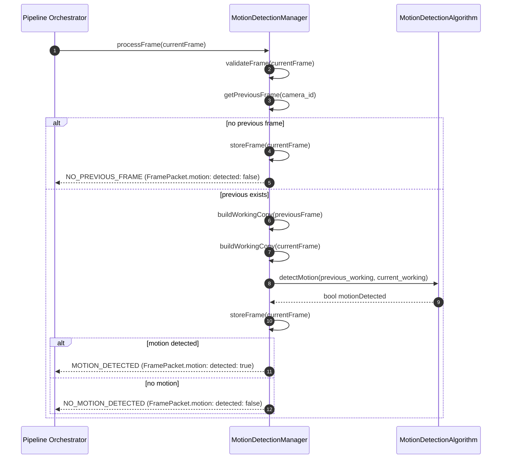
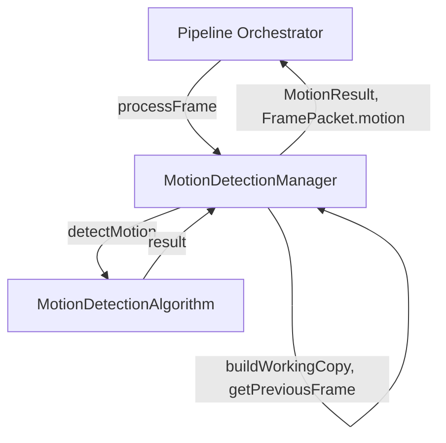

# Motion Detection Module — Architecture


## Motion Storage Contract

- Purpose: Define the external, stable payload and semantics for `FramePacket.motion` so downstream pipeline modules and the Pipeline Orchestrator can rely on a minimal contract.
- Write semantics: The `MotionDetectionManager.processFrame()` method MUST atomically attach a `motion` payload to the incoming `FramePacket` before returning control to the Pipeline Orchestrator. This update is a required side-effect in addition to the `MotionResult` return value.
- Immutability: After `processFrame()` returns, `FramePacket.motion` is considered immutable for that packet; downstream stages may read it without acquiring locks.
- External payload (minimal, authoritative):

```yaml
frame_packet.motion:
  detected: bool                # required — true when motion detected, false otherwise
  bboxes?:                       # optional — present only when configured to produce boxes
    - [x1, y1, x2, y2]           # coordinates in the frame's pixel space
```

- Contract notes:
  - The manager MUST set `frame_packet.motion` for every processed packet. When no previous frame exists, set `detected: false` and return the `NO_PREVIOUS_FRAME` MotionResult.
  - The `MotionResult` return from `processFrame()` is a control signal for the orchestrator; it complements but does not replace the authoritative `frame_packet.motion` payload.
  - Downstream modules and the orchestrator MUST treat the external `frame_packet.motion` payload as minimal: only `detected` and optional `bboxes` are part of the public contract. Do NOT rely on any further diagnostic fields being present.
  - Internal-only diagnostics (examples: `score`, `motion_pixel_count`, `timestamp_ms`, `mask`) MUST remain internal to the Motion Detection implementation and MUST NOT be exposed on `FramePacket.motion`.
  - If additional diagnostics are required for debugging or observability, expose them via internal logs, metrics, or a dedicated diagnostic API — do not add them to the external `FramePacket.motion` contract.

## Architecture

The module is composed of two primary classes:

- `MotionDetectionAlgorithm` — implements the core detection algorithm.
- `MotionDetectionManager` — orchestrates lifecycle, frame storage, validation, and invocation of the algorithm.

Auxiliary types used across the module:

- `Frame` (type): width, height, timestamp, camera_id (optional), format (GRAY|RGB|BGR|NV12|JPEG), pixels (opaque buffer).
- `MotionResult` (enum): `NO_PREVIOUS_FRAME`, `MOTION_DETECTED`, `NO_MOTION_DETECTED`, `INVALID_FRAME`.

## Classes

### Class: MotionDetectionAlgorithm

Description

Core algorithm implementation: accepts two frames and deterministically determines whether motion exists. The algorithm is stateless after construction and receives parameters at initialization.

#### Functions

`bool detectMotion(Frame previousFrame, Frame currentFrame)`

- Purpose: Compare `previousFrame` and `currentFrame` and return true when motion is present according to configured algorithm rules.
- Inputs: `previousFrame` (Frame, non-null), `currentFrame` (Frame, non-null).
- Output: Boolean — `true` when motion is detected; `false` otherwise.
- Behavior:
    1. Ensure frames are compatible (convert to a common working format — recommended: GRAY).
      - Rationale: Converting both frames to single-channel grayscale simplifies per-pixel arithmetic, reduces memory and compute, and removes color-space differences across cameras. Use a deterministic conversion (e.g., OpenCV `cvtColor(src, COLOR_BGR2GRAY)` for BGR inputs or decode JPEG to grayscale).
      - Implementation notes: If the input format is YUV/NV12, extract the luma (Y) plane as the working grayscale buffer rather than converting color planes.
  2. Optionally resize to `processing_width`/`processing_height`.
  3. Optionally apply Gaussian blur to both frames to reduce sensor noise.
  4. Compute per-pixel absolute difference: `diff = abs(current - previous)`.
  5. Threshold `diff` by `motion_threshold` to produce a binary motion mask.
  6. Optionally apply morphological operations to reduce isolated noise pixels.
  7. Compute motion score:
     - `motion_pixel_count = count_nonzero(binary_mask)` (number of pixels where diff >= `motion_threshold`).
     - `motion_fraction = motion_pixel_count / (processing_width * processing_height)` (fraction of pixels changed in the processing resolution).
  8. Compare score to thresholds to determine motion:
     - If `motion_fraction >= motion_fraction_threshold` OR `motion_pixel_count >= motion_pixel_count_threshold` then motion is detected.
     - Explanation: the OR policy gives two complementary ways to trigger motion: a relative measure (`motion_fraction`) that adapts to image size, and an absolute pixel count (`motion_pixel_count_threshold`) that protects small-resolution cases or tuned absolute requirements.
     - Example: For `processing_width=640`, `processing_height=360`, total pixels = 230400. With `motion_fraction_threshold=0.01`, motion requires >= 2,304 changed pixels. If `motion_pixel_count_threshold=1000`, then motion would also be triggered when >= 1,000 pixels change (useful on smaller ROIs or lower-res deployments).
     - Tuning guidance: lower `motion_threshold` (per-pixel) increases sensitivity to small intensity changes (noise), raising `motion_fraction_threshold` reduces false positives by requiring more pixels to change.

### How the comparison is performed (step-by-step)

1. Convert both frames to the working grayscale and resize to `processing_width` x `processing_height`.
2. Optionally blur both frames to smooth sensor noise.
3. Compute `diff = abs(current - previous)` per pixel.
4. Build `binary_mask` by applying `binary_mask[p] = 1 if diff[p] >= motion_threshold else 0`.
5. Compute `motion_pixel_count = sum(binary_mask)` and `motion_fraction = motion_pixel_count / (processing_width * processing_height)`.
6. Compare against thresholds as described above and return boolean motion result.

## Eviction & memory policy (expanded)

When the manager stores previous frames for many streams, memory can grow unbounded. The manager must enforce an eviction policy controlled by configuration parameters.

- `max_stored_streams` (int): maximum number of separate `camera_id` entries the manager will retain. If adding a new stream would exceed this limit, evict one or more existing entries according to the configured eviction policy.
  - Implementation: maintain an LRU (least-recently-used) list of keys. When storing a new frame and `stored_count >= max_stored_streams`, evict the LRU entries until `stored_count < max_stored_streams`.

- `memory_cap_bytes` (int): a soft/firm cap on memory used by stored frames. The manager should estimate per-entry memory (e.g., width * height * bytes_per_pixel for stored resolution) and evict entries when the cap is reached.
  - Implementation: track `stored_frames_memory_bytes`. On `storeFrame`, add the new frame's estimated byte cost; if the total exceeds `memory_cap_bytes`, evict LRU entries until under cap. Eviction must be performed while holding the write lock for consistency.

- LRU eviction behavior and policy choices:
  - LRU is recommended because recently-active cameras are more likely to produce correlated frames and require lower latency for comparison.
  - For fairness in multi-tenant deployments, consider a per-camera weight metric (e.g., prioritise cameras marked `critical=true`).
  - Evicted entries should free buffers and update `stored_frames_memory_bytes` and `stored_frames_count` metrics.

- Locking and performance:
  - Keep eviction work incremental; avoid long pauses. For large evictions, schedule background GC that releases a limited number of entries per iteration.

## Optional enhancements — expanded (recommendations vs necessity)

This section explains optional algorithmic improvements, what they provide, and recommendations for adoption.

1. Background modeling (running average / background subtraction)
   - What: maintain a per-pixel running background model (e.g., exponential moving average `bg_{t+1} = alpha * frame_t + (1-alpha) * bg_t`) or a median background computed from an N-frame ring buffer.
   - Pros: reduces false positives caused by gradual illumination changes, e.g., clouds or day/night transitions; robust to repeating motion (tree branches) by slowly adapting the background.
   - Cons: more memory (store running background or N-frame buffer); additional compute on update; requires tuning `alpha` or buffer size.
   - Recommendation: Recommended for outdoor or variable-light deployments where ambient changes occur; not strictly necessary for controlled indoor cameras with stable lighting.

2. Adaptive thresholding
   - What: compute `motion_threshold` dynamically per-frame or per-region based on measured noise statistics (e.g., median absolute deviation) rather than using a fixed 25 value.
   - Pros: adjusts sensitivity to sensor noise and compression artifacts, reducing false positives in noisy cameras and increasing sensitivity on clean feeds.
   - Cons: slightly more compute and complexity; can oscillate if not smoothed.
   - Recommendation: Useful in mixed-hardware fleets or when camera quality varies; optional for MVP but recommended when deployments show varied noise profiles.

3. Contour extraction and bounding boxes
   - What: after thresholding and morphology, extract connected components (contours), filter by area, and return bounding boxes or masks in `MotionResult`.
   - Pros: provides spatial localization enabling ROI-based downstream processing (e.g., run object detector only on boxes), better event payloads, reduced downstream cost.
   - Cons: additional compute for contour extraction and optional NMS merging; more complex event payloads.
   - Recommendation: Recommended when integrating with object detection to avoid running heavy detectors on entire frames. Optional for MVP where only motion/no-motion is needed.

4. Optical flow and multi-frame analysis
   - What: use algorithms like Lucas-Kanade or Farneback to compute pixel or region motion vectors across multiple frames.
   - Pros: richer motion understanding (direction, speed), better at rejecting global illumination changes.
   - Cons: significantly more compute and algorithm complexity; may require GPU for high frame rates.
   - Recommendation: Advanced enhancement for high-accuracy or behavior-analytics use cases; not necessary for basic motion detection.

## Configuration keys — detailed explanation

- `motion_threshold` (int, 0–255): per-pixel intensity difference used to mark a pixel as changed. Lower values detect smaller intensity changes; higher values reduce noise sensitivity. Default: 25.

- `use_gaussian_blur` (bool): when true, apply Gaussian blur to both frames before differencing to reduce sensor-level noise. Recommended `true` for most cameras.

- `gaussian_kernel_size` (odd int): kernel size for Gaussian blur (e.g., 3, 5, 7). Larger kernels increase smoothing.

- `motion_fraction_threshold` (float 0..1): fraction of pixels that must be above `motion_threshold` to signal motion. Use for size-normalized detection. Default: 0.01.

- `motion_pixel_count_threshold` (int): absolute pixel count threshold to signal motion. Useful for small-RoI or fixed absolute-change requirements. Default: 1000.

- `processing_width` / `processing_height` (int): resolution to which frames are resized for detection. Lower values reduce CPU usage but decrease spatial fidelity. Example: 640x360.

- `max_width` / `max_height` (int): maximum allowed input resolution. Frames exceeding these values should be rejected and return `INVALID_FRAME` to avoid excessive processing on unexpected inputs.

- `store_downsampled_frame` (bool): if true, store a downsampled previous frame (matching processing dims) rather than the full original to reduce memory.

- `max_stored_streams` (int): maximum number of camera streams to retain previous frames for (evict older streams beyond this limit).

- `memory_cap_bytes` (int): cap on memory used by stored frames; trigger eviction when exceeded.

## Sequence Diagram (module-level)

Expanded sequence diagram showing the function and data flow between Pipeline Orchestrator, MotionDetectionManager, and MotionDetectionAlgorithm:




Notes: optional enhancements (background modeling, adaptive thresholding, contour extraction) are documented later under Future Extensions.

### Class: MotionDetectionManager

Description

Lifecycle and orchestration class. Stores previous frames (per stream), validates incoming frames against configuration, invokes the algorithm, updates storage, and returns `MotionResult` for the pipeline.

#### Functions

`MotionResult processFrame(Frame currentFrame)`

- Purpose: Primary per-frame entrypoint; validates frame, performs motion detection (if possible), updates stored previous frame, and returns a `MotionResult`.
- Inputs: `currentFrame` (must include `camera_id`, `width`, `height`, `timestamp`, `format`, `pixels`).
- Output: One of the `MotionResult` enum values.
- Detailed behavior:
  1. Validate `currentFrame` (required fields present) and ensure `width <= max_width` and `height <= max_height`. If invalid, increment `invalid_frames` metric and return `INVALID_FRAME` without storing.
  2. Acquire per-`camera_id` lock to perform read-modify-write safely.
  3. Retrieve `previous = getPreviousFrame(camera_id)`.
  4. If `previous == null`: call `storeFrame(currentFrame)`, release lock, and return `NO_PREVIOUS_FRAME`.
  5. Else:
     - Produce preprocessed working copies (grayscale/resized/blurred) using `buildWorkingCopy()`.
     - Call `algorithm.detectMotion(previous_working, current_working)`.
     - Call `storeFrame(currentFrame)` to update stored frame.
    - If algorithm returns true: publish metrics, attach motion metadata to the `FramePacket.motion` field (and optionally enqueue a non-blocking hint for the orchestrator), release lock, and return `MOTION_DETECTED`.
    - Else: attach a metadata-only motion payload (e.g., `detected: false`, `motion_pixel_count: 0`) to `FramePacket.motion` to ensure a consistent contract, release lock, and return `NO_MOTION_DETECTED`.
  6. Failure handling: if algorithm throws, catch, log, increment `detection_errors` and return `NO_MOTION_DETECTED` (fail-safe).

`Frame? getPreviousFrame(string camera_id)`

- Purpose: Return the stored previous frame (or null) for the given camera stream.
- Inputs: `camera_id` (string). If omitted, return default-stream previous frame.
- Output: `Frame` or `null`.
- Behavior: O(1) lookup in internal storage map; return an immutable copy to avoid races.

`void storeFrame(Frame frame)`

- Purpose: Persist `frame` as the previous frame for subsequent comparisons.
- Inputs: `frame` (must include `camera_id`).
- Behavior:
  1. Validate frame essentials (dimensions, non-empty payload).
  2. If `store_downsampled_frame` is true and `processing_width/height` configured: create and store a downsampled working copy to save memory; otherwise store the full frame.
  3. Atomically replace prior entry in the storage map; free previous buffer when replaced.
  4. Update metrics (`stored_frames_count`, `memory_bytes`).
  5. Use per-camera write lock during replacement to ensure readers see only consistent frames.

#### Private helpers (recommended)

`bool validateFrame(Frame frame)` — centralized validation for required fields and resolution limits.

`Frame buildWorkingCopy(Frame frame)` — convert to working format (grayscale), resize to `processing_width/height`, and apply Gaussian blur if configured.

`void notifyOrchestratorOfMotion(string camera_id, int64 timestamp, float score, optional mask/bboxes)` — construct and attach motion metadata to the `FramePacket` and notify the Pipeline Orchestrator non-blocking so it can decide whether to publish an event.

`void clearPreviousFrame(string camera_id)` — remove stored previous frame (admin action / camera disconnect).

`Eviction & memory policy` — implement `max_stored_streams`, `memory_cap_bytes`, and LRU eviction when configured.

## Configuration

Motion detection is configured at startup via the `motion_detection` section in the system configuration (YAML/JSON). Example:

```yaml
motion_detection:
  motion_threshold: 25
  use_gaussian_blur: true
  gaussian_kernel_size: 5
  motion_fraction_threshold: 0.01
  motion_pixel_count_threshold: 1000
  processing_width: 640
  processing_height: 360
  max_width: 1920
  max_height: 1080
  store_downsampled_frame: true
  max_stored_streams: 1000
  memory_cap_bytes: 1073741824
```

- `motion_threshold`: per-pixel intensity threshold (0–255). Default: 25.
- `motion_fraction_threshold`: fraction of pixels changing to signal motion. Default: 0.01.
- `processing_width/height`: optional runtime resize for detection performance.
- `max_width/max_height`: maximum allowed input resolution; oversize frames return `INVALID_FRAME`.

## Initialization

Initialization flow on IPS startup:

1. Load global configuration and extract `motion_detection` section.
2. Instantiate `MotionDetectionAlgorithm` with algorithm parameters (`motion_threshold`, blur settings, fraction thresholds, processing dims).
3. Instantiate `MotionDetectionManager` with the algorithm instance and manager config (`max_width`, `max_height`, `store_downsampled_frame`, eviction policy).
4. Register the manager in the IPS pipeline so the orchestrator calls `processFrame` for incoming `FramePacket`s.

## Data Flow (module-level, mermaid)



<!-- System-level dataflow and orchestration details have been moved to doc/image_processing_service.md under the Motion Detection "Details and implementation" section. -->

## Motion Detection Algorithms

Primary algorithm (Frame differencing + absolute difference + thresholding):

1. Convert frames to grayscale (if needed).
2. Optionally resize to `processing_width`/`processing_height`.
3. Optionally apply Gaussian blur to both frames.
4. Compute absolute per-pixel difference: `diff = abs(current - previous)`.
5. Threshold `diff` with `motion_threshold` to produce a binary mask.
6. Optionally apply morphological opening/closing to remove noise.
7. Compute `motion_pixel_count` and `motion_fraction`.
8. Decision: motion if `motion_fraction >= motion_fraction_threshold` OR `motion_pixel_count >= motion_pixel_count_threshold`.

Notes: optional improvements include background modeling (running average), adaptive thresholding, optical flow, and contour extraction for bounding boxes.

## Future Extensions

- Return motion masks and bounding boxes in `MotionResult` for ROI cropping.
- Per-camera calibration UI and per-camera sensitivity tuning.
- Multi-frame background subtraction and optical-flow based detectors.
- Hardware-accelerated paths (GPU/NNAPI) and platform-specific optimizations.

## Testing Guidance

- Unit tests:
  - `processFrame` returns `NO_PREVIOUS_FRAME` when no previous frame exists.
  - `processFrame` returns `INVALID_FRAME` for oversized frames.
  - Identical synthetic frames -> `NO_MOTION_DETECTED`.
  - Synthetic frames with engineered changes -> `MOTION_DETECTED`.
  - Exceptions from `detectMotion` are handled and do not crash manager; metrics incremented and return `NO_MOTION_DETECTED`.
  - `processFrame` populates `FramePacket.motion` for every packet; the contents must be consistent with the returned `MotionResult` and readable by downstream modules without races.
- Concurrency tests:
  - Parallel `processFrame` calls for multiple `camera_id`s do not block each other.
  - Concurrent `getPreviousFrame` during `storeFrame` yields consistent frames (old or new) and never corrupted data.

## Observability & Metrics

- Counters/histograms to expose:
  - `frames_processed_total`
  - `motion_detections_total`
  - `invalid_frames_total`
  - `detection_errors_total`
  - `processing_latency_ms` (histogram)
  - `stored_frames_memory_bytes`

---

Appendix: Minimal example function signatures (language-agnostic)

```text
type Frame = {width:int, height:int, timestamp:int, format:string, pixels:bytes}

class MotionDetectionAlgorithm:
    constructor(config: MotionConfig)
    bool detectMotion(Frame previousFrame, Frame currentFrame)

class MotionDetectionManager:
    constructor(algorithm: MotionDetectionAlgorithm, config: ManagerConfig)
    MotionResult processFrame(Frame currentFrame)
    Frame? getPreviousFrame()
    void storeFrame(Frame frame)

enum MotionResult { NO_PREVIOUS_FRAME, MOTION_DETECTED, NO_MOTION_DETECTED, INVALID_FRAME }
```
