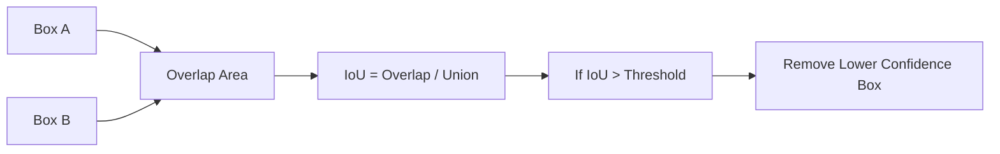
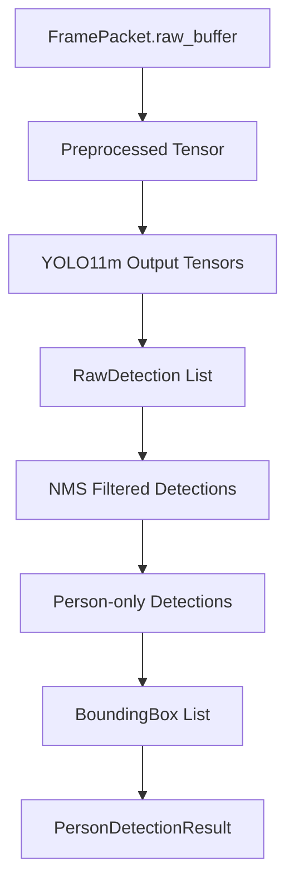

# Object Detection Module Specification (Person Detection Only)

## 1. Scope

This document defines only the Object Detection Module responsible for person detection in video frames.

### In Scope
- Detect humans (person class only) per frame.
- Return person bounding boxes.
- Return a boolean indicating if at least one person is detected.
- Internal preprocessing, inference, and postprocessing required to produce module output.

## 2. YOLO Model Decision (Architectural)

- The module uses YOLO11m as the defined and default detection model.
- The module is currently configured to use YOLO11m as the default model.
- This is a fixed architectural decision for this module specification, not an optional behavior.
- The module does not implement object detection from scratch.
- YOLO11m is the actual detection engine used for inference.
- YOLO11s may be supported as a lighter non-default alternative through configuration.
- The architecture is intentionally designed to support future replacement of the selected YOLO model variant through configuration and inference engine flexibility.
- This allows dynamic model evolution without changing the external API of the module.

## 3. Module Goals and Non-Functional Requirements

### Functional Goals
- Detect only persons in each input frame.
- Produce bounding boxes for detected persons.
- Expose whether one or more persons are present.

### Non-Functional Requirements
- Stateless: no cross-frame memory is required for correctness.
- Real-time capable: suitable for per-frame online processing.
- Deterministic behavior: same input and same configuration produce the same output.
- Isolated: module output contract is independent of external business logic.

## 4. Public API Contract

The external API must expose only:
- person_detected (boolean)
- persons (list of BoundingBox)

The external API must not expose:
- labels
- confidence scores
- raw detections
- model outputs
- DetectionStatus
- runtime-specific metadata

## 5. Input Definition

### 5.1 FramePacket

```text
struct FramePacket {
    int64 timestamp;            // epoch milliseconds or equivalent monotonic source
    string camera_id;           // non-empty identifier of frame source
    uint64 frame_id;            // monotonically increasing per camera stream
    uint32 width;               // frame width in pixels
    uint32 height;              // frame height in pixels
    PixelFormat pixel_format;   // declared format of raw buffer
    bytes raw_buffer;           // frame bytes in declared pixel format
}
```

### 5.2 Validation Rules
- timestamp must be present and valid numeric value.
- camera_id must be present and non-empty.
- frame_id must be present.
- width > 0 and height > 0.
- pixel_format must be supported by the module preprocessor.
- raw_buffer must be present and size-consistent with width, height, and pixel_format.

### 5.3 Assumptions
- FramePacket integrity is expected from upstream producer, but this module performs strict validation before processing.
- The module may reject frames that do not satisfy format/size requirements.
- Timestamp timezone semantics are not interpreted by this module.

## 6. Output Definition

### 6.1 BoundingBox

```text
struct BoundingBox {
    int32 x;        // top-left x in pixels
    int32 y;        // top-left y in pixels
    int32 width;    // box width in pixels
    int32 height;   // box height in pixels
}
```

### 6.2 PersonDetectionResult

```text
struct PersonDetectionResult {
    uint64 frame_id;
    bool person_detected;
    vector<BoundingBox> persons;
}
```

### 6.3 Output Semantics
- frame_id corresponds to the input FramePacket.frame_id to maintain traceability between input and output.
- person_detected is derived as persons.size() > 0.
- persons includes only valid person boxes after filtering and optional box validation.
- The persons list may contain zero, one, or multiple bounding boxes depending on the number of detected persons in the frame.

### 6.4 Why Confidence Is Hidden
- Confidence is model- and calibration-dependent and can change across model versions.
- Hiding confidence keeps the public contract stable and decoupled from detector internals.
- The module can update thresholds and model families without breaking consumers.

## 7. Internal Architecture (Module-Local)

The module is composed of internal components only:

- Preprocessor
- Inference Engine (abstracted)
- Postprocessor
- Person Filtering Layer
- Result Builder

### 7.1 Internal Detection Structure (Internal Only)

```text
struct RawDetection {
    string label;        // class name from model output
    float confidence;    // score in [0.0, 1.0]
    BoundingBox bbox;    // decoded box in image coordinates
}
```

RawDetection is strictly internal and must never be returned by the external API.

### 7.2 Component Responsibilities

#### Preprocessor
- Validates frame dimensions and format constraints.
- If a general frame transformation layer exists, it handles generic transformations only.
- Model-specific preprocessing remains inside this module.
- Converts raw_buffer to model input tensor format.
- Applies deterministic transforms required by YOLO11m, including resize to model input size, color conversion, normalization, and tensor preparation.

#### Inference Engine
- Loads and runs the YOLO11m model using the preprocessed tensor.
- Returns raw detection outputs without applying person filtering or business-level filtering.

#### Postprocessor
- Decodes raw model tensors into RawDetection entries.
- Applies Non-Max Suppression.
- Non-Max Suppression (NMS) is applied using an IoU threshold to remove overlapping detections.
- IoU (Intersection over Union) is a metric that measures the overlap between two bounding boxes. It is calculated as the ratio between the area of intersection and the area of union of the boxes.
- During Non-Max Suppression (NMS), IoU is used to identify overlapping detections. If the IoU between two boxes exceeds a configured threshold, the lower-confidence detection is removed.
- Maps decoded detection boxes back to the original frame resolution (before preprocessing resize).

All bounding boxes must be transformed back to the original frame coordinate system before being included in the final output.

#### IoU and Non-Max Suppression Illustration



#### Person Filtering Layer
- Retains only detections where label equals person.
- Applies confidence threshold policy.
- Performs optional bbox sanity checks (non-negative, in-frame, non-zero area).

#### Result Builder
- Converts filtered detections to list of BoundingBox.
- Computes person_detected from resulting list size.
- Constructs PersonDetectionResult.

## 8. How YOLO Is Used

Practical flow for each input frame:

1. Frame is received as FramePacket.
2. Model-specific preprocessing is applied inside this module.
3. The inference engine loads and runs YOLO11m.
4. YOLO11m produces raw detections.
5. The module filters detections where label == "person".
6. The configured confidence threshold is applied internally.
7. The module outputs only:
    - person_detected
    - persons (list of BoundingBox)

Implementation note:
- In the initial implementation, YOLO11m is expected to be executed using a Python-based runtime such as the Ultralytics YOLO library.
- The inference engine wraps this runtime and returns raw detection outputs to module-local postprocessing.

## 9. Inference Engine Design

### 9.1 Interface

```text
interface IInferenceEngine {
    EngineStatus initialize(PersonDetectionConfig config);
    InferenceOutput infer(Tensor input_tensor);
    void shutdown();
}
```

The inference engine abstraction is intentionally simple:
- The inference engine is an internal component responsible for loading and executing the YOLO11m model and returning raw detection outputs.
- The inference engine must remain flexible enough to load a different configured YOLO variant, model path, or backend in future revisions without external API changes.

### 9.2 Implementations

#### ONNX Runtime (Recommended)
- Recommended backend for this module.
- Selected as a production-oriented design choice.
- Provides balanced portability and runtime stability for deployment.

#### TensorRT (Optional)
- Optional future optimization for NVIDIA GPU environments.

Inference backend choice must not change the module public API.

## 10. Processing Pipeline

For each FramePacket, processing order is:

The module processes one frame at a time (batch size = 1).

1. Frame validation.
2. Preprocessing.
3. Model inference using YOLO11m through the inference engine.
4. Output decoding.
5. Non-Max Suppression.
6. Filtering:
   - label equals person
   - confidence greater than or equal to configured threshold
7. Bounding box validation (optional).
8. Result construction.

Determinism requirement: with fixed model, fixed thresholds, fixed NMS parameters, and identical frame input, output must be reproducible.

## 11. Module-Local Data Flow

Data transformations inside this module:

1. FramePacket.raw_buffer -> preprocessed tensor.
2. Preprocessed tensor -> raw inference tensors.
3. Raw inference tensors -> RawDetection list.
4. RawDetection list -> NMS-pruned detections.
5. NMS-pruned detections -> person-only filtered detections.
6. Filtered detections -> validated BoundingBox list.
7. BoundingBox list -> PersonDetectionResult.

No system-wide routing, orchestration, or external workflow behavior is defined here.

## Data Flow Diagram



## 12. Component Design

### 12.1 ObjectDetectionModule
- Owns processing pipeline orchestration for one frame at a time.
- Depends on IInferenceEngine abstraction.
- Exposes only PersonDetectionResult as public output.

### 12.2 Concrete Inference Engine
- Concrete class implementing IInferenceEngine using ONNX Runtime or TensorRT.
- Responsible only for runtime interaction, not person filtering policy.

## 13. Performance Considerations

Module-level considerations only:

- Inference latency is the dominant cost in most deployments.
- The module is expected to operate within real-time constraints (for example, approximately 10-50 ms per frame depending on hardware).
- Preprocessing should minimize allocations and redundant color/layout conversions.
- CPU path should prefer efficient tensor preparation and bounded thread usage.
- GPU path should reduce host-device copy overhead where runtime allows.
- Optional frame skipping may be configured to meet latency budgets under overload, but module remains stateless for each processed frame.

## 14. Metrics

The module emits only the following operational metrics:

- inference_time_ms
- preprocessing_time_ms
- detected_people_count
- invalid_frames

Metric semantics:
- inference_time_ms: elapsed inference runtime per processed frame.
- preprocessing_time_ms: elapsed preprocessing time per processed frame.
- detected_people_count: number of returned person boxes per frame.
- invalid_frames: count of frames rejected by validation.

## 15. Error Handling (Internal/Operational)

### 15.1 Internal DetectionStatus

```text
enum DetectionStatus {
    Success,
    InvalidFrame,
    InferenceError
}
```

DetectionStatus is internal/operational and is not part of the external API contract.

### 15.2 Local Behavior
- Success: valid frame processed; PersonDetectionResult returned.
- InvalidFrame: validation failure; empty persons and person_detected false are returned with InvalidFrame status.
- InferenceError: inference runtime/model execution failure; empty persons and person_detected false are returned with InferenceError status.

The module does not define recovery behavior outside its own processing boundaries.

## 16. Extensibility (Module-Level)

This module can evolve without changing its external contract:

- Add additional detectable classes in future internal revisions while keeping current person-only API behavior by default.
- Keep YOLO11m as the current default model while allowing future replacement with another YOLO variant through configuration.
- Replace model weights and change model_path without changing the public API contract.
- Tune confidence and NMS thresholds through configuration.
- Update or replace inference backends through IInferenceEngine while preserving external response schema.

Any extension must preserve current public API constraints unless a deliberate versioned API change is introduced.

## 17. Configuration Parameters (Module-Local)

```text
struct PersonDetectionConfig {
    string model_path;                  // default points to YOLO11m; can be updated for future model replacement
    float person_confidence_threshold;
    float nms_iou_threshold;
    int32 input_width;
    int32 input_height;
    string inference_backend;          // default: onnxruntime; backend is configurable for future evolution
    bool enable_bbox_validation;
    uint32 max_detections;
    uint32 optional_frame_skip;        // 0 means disabled
}
```

Configuration changes affect internal detection behavior but must not alter external response schema.
The combination of model_path and inference_backend enables dynamic model and runtime evolution while preserving the same public API.
The default person confidence threshold is typically set to 0.5 (configurable).

## 18. Compliance Checklist

- Only person detection behavior is specified.
- Public output contains only person_detected and bounding boxes.
- Internal label/confidence/model outputs remain private.
- DetectionStatus is not part of the public API.
- YOLO11m is the defined and default detection engine.
- No tracking/event/recognition logic is defined.
- Module is stateless, deterministic, and real-time oriented.
- Specification is self-contained and implementation-ready for this single module.

The module acts as a clean abstraction layer over the YOLO11m detection model, ensuring stable external behavior while allowing internal model evolution.
