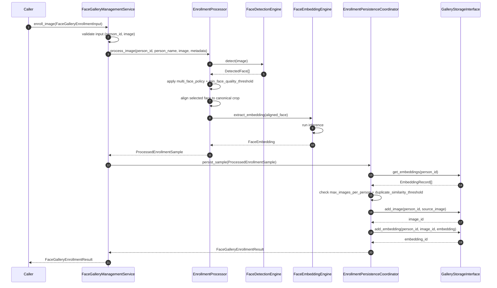
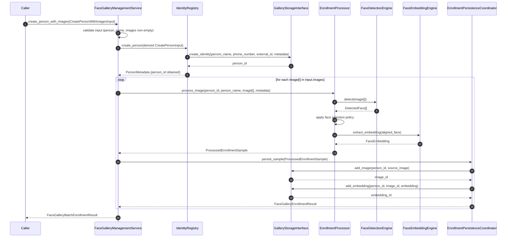
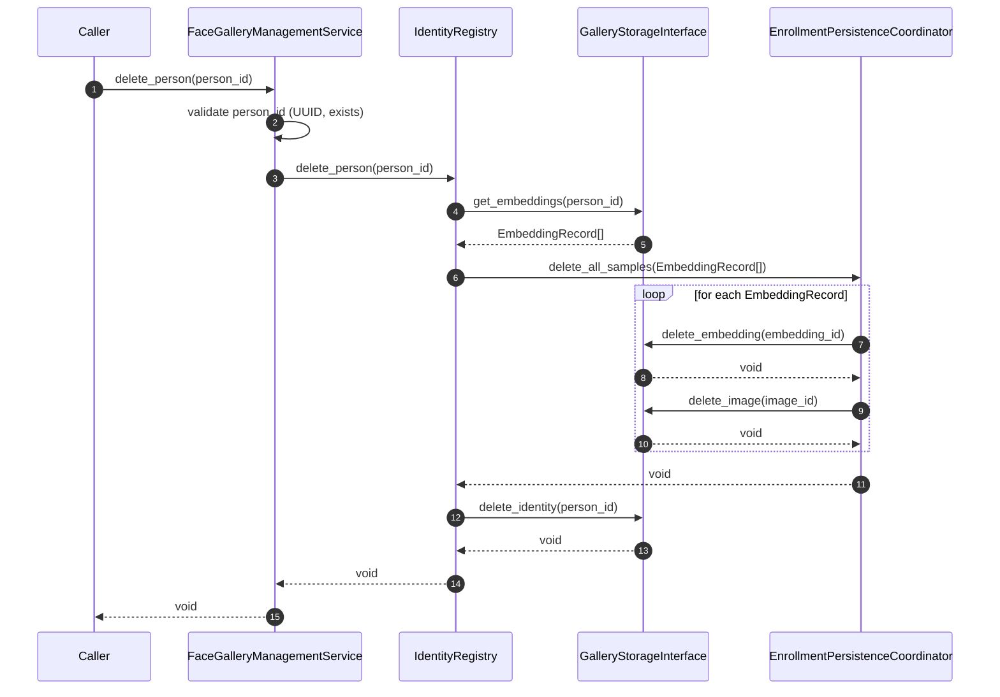
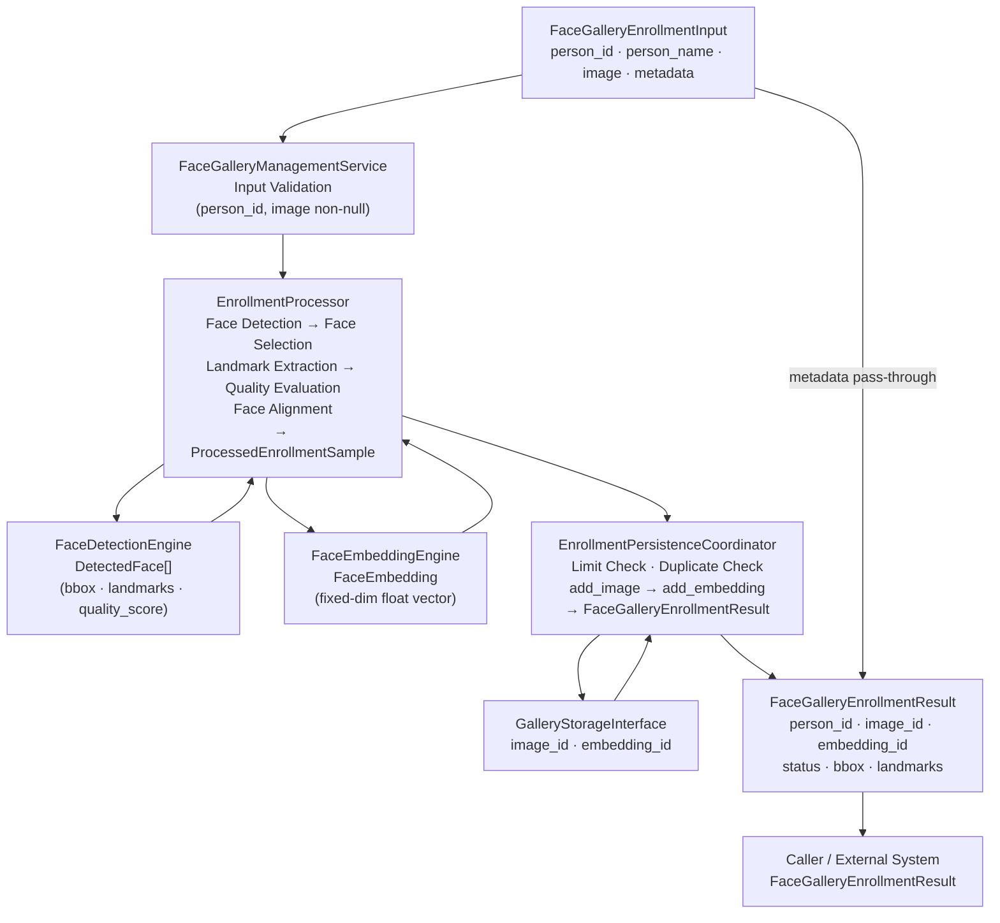

# Face Gallery Management Service Specification

## 1. Scope

### Purpose

The Face Gallery Management Service is responsible for the full lifecycle management of a face gallery. It receives management commands — identity operations, face enrollment inputs, gallery queries, and deletion requests — and returns structured results. This service operates exclusively as a management and data layer; it is not part of the real-time Image Processing pipeline. After enrollment, it delegates all persistence to a dedicated external storage module.

### In Scope

- Creating, updating, retrieving, searching, and deleting person identities
- Enrolling a single face image for a person (single enrollment flow)
- Enrolling multiple face images for a person (batch enrollment flow, orchestrated directly by the service)
- Creating a person and immediately enrolling images in a single atomic-intent operation
- Running the full enrollment processing pipeline for each source image: input validation, face detection, face selection, landmark extraction, quality evaluation, face alignment, and embedding extraction
- Enforcing enrollment constraints: maximum images per person, duplicate detection, quality threshold, multi-face policy
- Persisting processed enrollment samples (image reference + embedding) via the external storage module
- Returning enrollment results including `person_id`, `image_id`, `embedding_id`, enrollment status, and selected face geometry
- Retrieving a person's identity metadata and enrolled gallery samples
- Deleting individual gallery samples (embedding and image together, atomically)
- Deleting a person and all associated gallery data permanently (hard delete)
- Configuration-driven behavior — thresholds, enrollment policies, and limits loaded at initialization, not passed per invocation

### Out of Scope

The Face Gallery Management Service does NOT:

- Participate in any real-time frame processing pipeline — handled outside this service
- Perform face detection or recognition during real-time streams — handled outside this service
- Expose raw face embedding vectors in any public output
- Expose quality scores, similarity scores, or detection confidence values in any public output
- Perform generic image preprocessing (color conversion, resize, normalization) before calling detection — these are handled inside `EnrollmentProcessor`
- Manage which gallery embeddings are loaded during live recognition — handled outside this service
- Handle authentication or authorization — handled outside this service
- Redefine or extend the responsibilities of the external storage module

---

## 2. Input

### 2.1 Input Responsibility Boundary

The service receives all management commands as typed input structs. Images provided inside `FaceGalleryEnrollmentInput` and `FaceGalleryBatchEnrollmentInput` are raw `Image` objects — no preprocessing has been applied by the caller. The service performs all face processing internally via `EnrollmentProcessor`.

Identity fields `person_name`, `phone_number`, and `external_id` are explicit typed fields on input structs. They are not placed in `metadata`. The `metadata` field is auxiliary and carries audit, traceability, and source context only — it is never used in core identity logic or gallery queries.

Clients cannot be expected to know `person_id` in advance. `person_name` alone is not sufficient as a lookup key because it is not unique. `phone_number` and `external_id` exist as additional business-domain identifiers to enable reliable identity retrieval and deduplication without relying on `person_id`. `search_person` exists for this reason: it allows callers to locate a person by `person_name` and `phone_number` before performing further operations.

`FaceGalleryEnrollmentInput` includes `person_name` alongside `person_id` so that `EnrollmentProcessor` can produce a `ProcessedEnrollmentSample` carrying identity context without requiring a separate identity lookup during the processing pipeline.

### 2.2 Input Structure

```text
struct CreatePersonInput {
    string              person_name;     // display name; not unique; not used for matching
    optional string     phone_number;    // business identifier; used for search
    optional string     external_id;     // external-system identifier; used for search and deduplication
    map<string,string>  metadata;        // audit, traceability, source context; not used in core logic
}

struct CreatePersonWithImagesInput {
    string              person_name;     // display name for the new identity
    optional string     phone_number;    // business identifier
    optional string     external_id;     // external-system identifier
    vector<Image>       images;          // ordered list of raw images; each independently processed and enrolled
    map<string,string>  metadata;        // audit context; applied to the identity and each enrollment result
}

struct UpdatePersonInput {
    string              person_id;       // must reference an existing identity; immutable key
    optional string     person_name;     // updated display name; omit to leave unchanged
    optional string     phone_number;    // updated phone number; omit to leave unchanged
    optional string     external_id;     // updated external identifier; omit to leave unchanged
    map<string,string>  metadata;        // audit context; not used in core logic
}

struct FaceGalleryEnrollmentInput {
    string              person_id;       // must reference an existing identity (unless auto_create_identity = true)
    string              person_name;     // identity display name; used to populate ProcessedEnrollmentSample
    Image               image;           // raw image containing the face to enroll; not pre-processed by caller
    map<string,string>  metadata;        // audit, traceability; passed through unchanged to enrollment result
}

struct FaceGalleryBatchEnrollmentInput {
    string              person_id;       // must reference an existing identity (unless auto_create_identity = true)
    string              person_name;     // identity display name; shared across all images in the batch
    vector<Image>       images;          // ordered list of raw images; each independently processed
    map<string,string>  metadata;        // shared audit context; applied to each per-image result
}
```

`Image` is an opaque type. Its internal representation is not defined by this service. The contract it satisfies: non-null, decodable by the configured `FaceDetectionEngine`, representing a color image in any standard format.

### 2.3 Input Contract

- `person_name` must be a non-empty string in `CreatePersonInput` and `CreatePersonWithImagesInput`
- `person_id` must be a non-empty string in UUID format in all operations that reference an existing identity
- `image` must be non-null in `FaceGalleryEnrollmentInput`
- `images` must be non-null and non-empty in `FaceGalleryBatchEnrollmentInput` and `CreatePersonWithImagesInput`; individual elements within the vector may be null and will be rejected individually
- `metadata` is optional; an empty map is valid; its contents are never validated or interpreted by core logic
- `phone_number`, `external_id`, and optional fields on `UpdatePersonInput` are each independently optional; omitting them leaves the corresponding stored value unchanged

### 2.4 Validation Rules

`FaceGalleryManagementService` must verify the following before dispatching to internal components:

- `person_name` is non-empty for `CreatePersonInput` and `CreatePersonWithImagesInput`
- `person_id` is non-empty and conforms to UUID format for all operations that reference an existing identity (`UpdatePersonInput`, `FaceGalleryEnrollmentInput`, `FaceGalleryBatchEnrollmentInput`, `get_person`, `get_person_gallery`, `delete_gallery_sample`, `delete_person`)
- `person_id` does not already exist for `create_person` and `create_person_with_images` (when `auto_create_identity = false`)
- `person_id` references an existing identity for `update_person`, `enroll_image`, `batch_enroll_images`, `get_person`, `get_person_gallery`
- `image` is non-null for `FaceGalleryEnrollmentInput`
- `images` is non-null and non-empty for `FaceGalleryBatchEnrollmentInput` and `CreatePersonWithImagesInput`
- `embedding_id` is non-empty for `delete_gallery_sample`
- `embedding_id` references an existing embedding record for `delete_gallery_sample`

### 2.5 Input Semantics

- `person_id` — globally unique identity key in UUID format; immutable after creation; primary internal lookup key for all operations
- `person_name` — human-readable display name; mutable; not unique; not used for matching or recognition
- `phone_number` — optional business-domain identifier; used in `search_person` queries and identity deduplication; not used for recognition
- `external_id` — optional external-system identifier; enables cross-system identity linkage; not used for recognition
- `image` — raw face image to be enrolled; caller applies no preprocessing; `EnrollmentProcessor` performs all pipeline steps including detection, alignment, and embedding extraction
- `images` — ordered collection of raw face images; each element is processed independently by `EnrollmentProcessor`; the index of each element is preserved in batch results for traceability
- `metadata` — caller-provided context for audit and traceability; passed through unchanged to enrollment results; never used in identity logic, gallery queries, or enrollment decisions

---

## 3. Output

### 3.1 Output Structure

```text
struct PersonMetadata {
    string              person_id;           // immutable unique identity key
    string              person_name;         // current display name
    optional string     phone_number;        // current phone number; absent if not set
    optional string     external_id;         // current external identifier; absent if not set
    uint32              enrolled_count;       // number of currently enrolled embeddings for this person
    uint64              created_at_ms;        // identity creation timestamp in milliseconds
    uint64              updated_at_ms;        // last identity update timestamp in milliseconds
}

struct PersonSearchResult {
    PersonMetadata      person;              // full identity metadata for the matched person
    float               match_score;         // relevance score for this search result; management/admin use only
}

struct BoundingBox {
    int32 x;
    int32 y;
    int32 width;
    int32 height;
}

struct Point {
    float x;
    float y;
}

struct FaceGalleryEnrollmentResult {
    string              person_id;           // identity this sample is attributed to
    string              image_id;            // opaque identifier for the stored image record
    string              embedding_id;        // opaque identifier for the stored embedding record
    string              status;              // "ENROLLED" on success; reason string on failure
    BoundingBox         selected_face_bbox;  // bounding box of the selected face used for enrollment
    vector<Point>       selected_face_landmarks; // 5-point facial landmarks of the selected face
    map<string,string>  metadata;            // metadata passed through unchanged from input
}

struct BatchEnrollmentItemResult {
    uint32              image_index;         // zero-based index of this image in the input vector
    bool                success;             // true if enrollment succeeded for this image
    FaceGalleryEnrollmentResult result;      // populated on success; embedding_id and image_id valid
    string              failure_reason;      // populated on failure; empty on success
}

struct FaceGalleryBatchEnrollmentResult {
    string                          person_id;  // identity this batch was enrolled for
    vector<BatchEnrollmentItemResult> items;    // one entry per input image, in input order
}

struct GallerySample {
    string              embedding_id;        // opaque identifier for the stored embedding record
    string              image_id;            // opaque identifier for the associated image record
    BoundingBox         face_bbox;           // bounding box of the face used during enrollment
    vector<Point>       face_landmarks;      // 5-point landmarks stored during enrollment
    map<string,string>  metadata;            // metadata stored at enrollment time
    uint64              enrolled_at_ms;      // enrollment timestamp in milliseconds
}

struct PersonGalleryView {
    string              person_id;           // identity these samples belong to
    string              person_name;         // display name at time of retrieval
    vector<GallerySample> samples;           // all enrolled samples for this person; for management/admin use
}
```

### 3.2 Output Semantics

- `PersonMetadata.person_id` — the immutable unique identity key; returned by identity operations
- `PersonMetadata.person_name` — current display name; mutable via `update_person`
- `PersonMetadata.phone_number` — current phone number; absent if not set
- `PersonMetadata.external_id` — current external identifier; absent if not set
- `PersonMetadata.enrolled_count` — current number of active embedding records for this person
- `PersonMetadata.created_at_ms` — creation timestamp; immutable after creation
- `PersonMetadata.updated_at_ms` — last modification timestamp; updated on each `update_person` call
- `PersonSearchResult.person` — full identity metadata for the candidate match
- `PersonSearchResult.match_score` — relevance score for administrative search ranking; for management/admin use only; not a recognition similarity score
- `FaceGalleryEnrollmentResult.person_id` — identity the enrolled sample is attributed to
- `FaceGalleryEnrollmentResult.image_id` — storage identifier for the image record; opaque to the caller
- `FaceGalleryEnrollmentResult.embedding_id` — storage identifier for the embedding record; used as the key for `delete_gallery_sample`
- `FaceGalleryEnrollmentResult.status` — `"ENROLLED"` on success; a descriptive reason string on failure
- `FaceGalleryEnrollmentResult.selected_face_bbox` — bounding box of the face selected during enrollment processing; for management/audit visibility
- `FaceGalleryEnrollmentResult.selected_face_landmarks` — 5-point landmarks of the selected face; for management/audit visibility
- `FaceGalleryEnrollmentResult.metadata` — input metadata copied unchanged; for audit traceability
- `BatchEnrollmentItemResult.image_index` — preserves source position in the input `images` vector for failure traceability
- `BatchEnrollmentItemResult.success` — true if this image was successfully enrolled
- `BatchEnrollmentItemResult.failure_reason` — describes why enrollment failed; empty string on success
- `GallerySample.embedding_id` — key used to identify this sample for `delete_gallery_sample`
- `GallerySample.face_bbox` — geometry of the enrolled face; for management visibility
- `GallerySample.enrolled_at_ms` — timestamp when this sample was enrolled
- `PersonGalleryView.samples` — all active enrolled samples for the person; for management, admin, and UI flows only, not for runtime recognition

### 3.3 Output Constraints

The output must NOT expose:

- Raw face embedding vectors (`FaceEmbedding` floating-point values) in any output struct
- Quality scores, similarity scores, or detection confidence values from any internal computation
- Internal database row identifiers or auto-increment keys
- Storage backend paths, credentials, bucket names, or connection strings
- Database connection handles, cursors, or transaction objects
- Partial or uncommitted records

All face processing intermediates — `FaceEmbedding` vectors, quality scores, candidate similarity values, raw detection tensors, and aligned face crops — remain strictly internal to the service. The only geometry exposed in public output is `selected_face_bbox` and `selected_face_landmarks`, which are for management audit visibility only.

---

## 4. Public API

```text
create_person(input: CreatePersonInput)                                              -> PersonMetadata
create_person_with_images(input: CreatePersonWithImagesInput)                        -> FaceGalleryBatchEnrollmentResult
update_person(input: UpdatePersonInput)                                              -> PersonMetadata
get_person(person_id: string)                                                        -> PersonMetadata
search_person(query: string)                                                         -> PersonSearchResult[]

enroll_image(input: FaceGalleryEnrollmentInput)                                      -> FaceGalleryEnrollmentResult
batch_enroll_images(input: FaceGalleryBatchEnrollmentInput)                          -> FaceGalleryBatchEnrollmentResult

get_person_gallery(person_id: string)                                                -> PersonGalleryView
delete_gallery_sample(person_id: string, embedding_id: string)                       -> void
delete_person(person_id: string)                                                     -> void
```

The API must remain stable regardless of which face detection engine or face embedding engine is configured. All thresholds, policies, and limits are internal configuration state loaded at initialization and are never parameters of any public API method.

---

## 5. Non-Functional Requirements

- **Stateful service** — gallery content accumulates persistently across all invocations; identity and enrollment state is stored in the external persistence layer and shared across all callers
- **Multi-method API** — methods are independently callable, subject to logical preconditions: `create_person` must precede `enroll_image`; `enroll_image` must precede `delete_gallery_sample`; `create_person_with_images` combines both
- **Management-layer only** — this service is not suitable or intended for real-time per-frame invocation; all operations are management commands
- **Atomic write operations** — enrollment sequences and deletion sequences must be atomic; if any step fails, no partial state is persisted
- **Side-effect-free read operations** — `get_person`, `search_person`, and `get_person_gallery` must not modify any identity or gallery state
- **Batch failure isolation** — individual image failures within `batch_enroll_images` and `create_person_with_images` do not abort the batch; succeeded results for other images are returned normally
- **Model-agnostic API** — the public output schema is fully independent of the configured face detection and face embedding engine implementations
- **Strict isolation** — no face embeddings, quality scores, similarity values, detection tensors, or engine-specific data appear in any public output type

---

## 6. Processing Engine

### 6.1 Engine Abstraction Interfaces

```text
interface FaceDetectionEngine {
    detect(image: Image) -> DetectedFace[]
}

interface FaceEmbeddingEngine {
    extract_embedding(aligned_face: Image) -> FaceEmbedding
}
```

`DetectedFace` is an internal type defined in Section 10. `FaceEmbedding` is an internal opaque type also defined in Section 10. Both interfaces are used exclusively inside `EnrollmentProcessor`.

### 6.2 Current Default Implementations

```text
class SCRFDFaceDetector implements FaceDetectionEngine
class ArcFaceEmbeddingEngine implements FaceEmbeddingEngine
```

`SCRFDFaceDetector` is an AI-based engine (neural network inference). It receives an `Image` and produces a list of `DetectedFace` objects, each containing a bounding box, 5-point facial landmarks, and a quality score.

`ArcFaceEmbeddingEngine` is an AI-based engine (neural network inference). It receives an aligned face crop image and produces a fixed-dimension floating-point `FaceEmbedding` vector.

### 6.3 Replaceability

`EnrollmentProcessor` depends on the `FaceDetectionEngine` and `FaceEmbeddingEngine` interfaces, not on `SCRFDFaceDetector` or `ArcFaceEmbeddingEngine` directly. Any face detector or face embedding model implementing the respective interface may be substituted at construction time without changing `FaceGalleryEnrollmentResult`, `FaceGalleryBatchEnrollmentResult`, or any other part of the public API. Replacing either engine does NOT affect the public API of the service.

---

## 7. Acceptance / Filtering Logic

Face enrollment acceptance is threshold-based and exclusively managed by `EnrollmentProcessor`. Duplicate-based rejection is threshold-based and exclusively managed by `EnrollmentPersistenceCoordinator`.

`FaceDetectionEngine` returns all `DetectedFace[]` objects found in the source image. Each `DetectedFace` carries a bounding box, 5-point landmarks, and a quality score. If the image contains no detectable faces, the engine returns an empty list.

`EnrollmentProcessor` applies `min_face_quality_threshold` and `multi_face_policy`:

- If zero faces are detected → enrollment fails with reason `"NO_FACE_DETECTED"`
- If multiple faces are detected and `multi_face_policy = REJECT` → enrollment fails with reason `"MULTIPLE_FACES_DETECTED"`
- If multiple faces are detected and `multi_face_policy = SELECT_BEST` → the face with the highest quality score is selected, provided it meets `min_face_quality_threshold`; if the best candidate does not meet the threshold, enrollment fails with reason `"FACE_QUALITY_TOO_LOW"`
- If exactly one face is detected and its quality score is below `min_face_quality_threshold` → enrollment fails with reason `"FACE_QUALITY_TOO_LOW"`

`EnrollmentPersistenceCoordinator` applies `duplicate_similarity_threshold` after a `ProcessedEnrollmentSample` has been received. It computes cosine similarity between the new embedding and all existing embeddings for the same `person_id`. If any existing embedding exceeds the threshold, enrollment fails with reason `"DUPLICATE_EMBEDDING"`.

Both thresholds are loaded from configuration at initialization. They are immutable and not adjustable per invocation. No quality scores, similarity values, face counts, or selection flags are returned to the caller. `EnrollmentProcessor` is the only component inside the service that makes face-selection accept or reject decisions. `EnrollmentPersistenceCoordinator` is the only component that makes duplicate-detection accept or reject decisions.

---

## 8. Internal Pipeline

### 8.1 FaceGalleryManagementService

`FaceGalleryManagementService` is the orchestration layer for all public API methods. It owns no processing, persistence, or identity-management logic.

Its responsibilities are:

- receive all public API invocations
- validate all inputs against the rules defined in Section 2.4 before dispatching
- dispatch identity operations (`create_person`, `update_person`, `get_person`, `search_person`, `delete_person`) to `IdentityRegistry`
- dispatch single-image enrollment processing to `EnrollmentProcessor`, then pass the result to `EnrollmentPersistenceCoordinator`
- iterate over all images in `batch_enroll_images` and `create_person_with_images`, invoking the enrollment pipeline per image and collecting `BatchEnrollmentItemResult` entries directly
- return structured output to the caller

During initialization, `FaceGalleryManagementService` is responsible for loading `FaceGalleryManagementConfig` and wiring each internal component with its required settings, including injecting `min_face_quality_threshold` and `multi_face_policy` into `EnrollmentProcessor`, and injecting `max_images_per_person`, `duplicate_similarity_threshold`, and `auto_create_identity` into `EnrollmentPersistenceCoordinator`. `GalleryStorageInterface` is injected into both `IdentityRegistry` and `EnrollmentPersistenceCoordinator`.

`FaceGalleryManagementService` must not embed face detection, face alignment, embedding extraction, duplicate detection, persistence logic, or identity CRUD operations directly.

### 8.2 IdentityRegistry

`IdentityRegistry` is responsible for all identity lifecycle operations. It is the single component that manages the creation, retrieval, update, search, and deletion of person identities.

Its responsibilities are:

- create a new person identity record via `GalleryStorageInterface`
- update mutable fields of an existing identity (`person_name`, `phone_number`, `external_id`) via `GalleryStorageInterface`
- retrieve a single identity by `person_id` via `GalleryStorageInterface`, returning `PersonMetadata`
- search by query string across `person_name` and `phone_number` via `GalleryStorageInterface`, returning ranked `PersonSearchResult[]`
- hard-delete an identity and all associated samples: retrieve all embedding records for the `person_id`, atomically delete each embedding and its corresponding image record, then delete the identity record from `GalleryStorageInterface`

`IdentityRegistry` must not perform image processing, embedding extraction, quality evaluation, or enrollment persistence logic. It must not access `FaceDetectionEngine` or `FaceEmbeddingEngine`.

### 8.3 EnrollmentProcessor

`EnrollmentProcessor` is responsible for running the full single-image enrollment processing pipeline from raw input to a processed sample ready for persistence.

Its responsibilities are:

- validate that the input `Image` is non-null
- invoke `FaceDetectionEngine.detect(image)` to obtain `DetectedFace[]`
- apply `multi_face_policy` and `min_face_quality_threshold` to select a single eligible face from the detection results
- extract the 5-point landmarks and bounding box from the selected `DetectedFace`
- align the detected face into a canonical face crop `Image` using the extracted landmarks
- invoke `FaceEmbeddingEngine.extract_embedding(aligned_face)` to produce a `FaceEmbedding`
- assemble and return a `ProcessedEnrollmentSample` containing `person_id`, `person_name`, `source_image`, `selected_face_bbox`, `selected_face_landmarks`, `embedding`, and `metadata`

`EnrollmentProcessor` must not persist data to storage, enforce enrollment count limits, perform duplicate checks, or make identity creation decisions.

### 8.4 EnrollmentPersistenceCoordinator

`EnrollmentPersistenceCoordinator` is responsible for all enrollment persistence decisions and write operations.

Its responsibilities are:

- receive a `ProcessedEnrollmentSample` and orchestrate the following persistence sequence:
  - if `auto_create_identity = true` and the `person_id` does not exist in storage, call `GalleryStorageInterface.create_identity` before proceeding
  - retrieve existing embedding count for the `person_id`; if count ≥ `max_images_per_person`, reject with reason `"MAX_IMAGES_EXCEEDED"`
  - retrieve existing embeddings for the `person_id`; compute cosine similarity between the new embedding and each existing embedding; if any similarity ≥ `duplicate_similarity_threshold`, reject with reason `"DUPLICATE_EMBEDDING"`
  - call `GalleryStorageInterface.add_image` with the source image, returning `image_id`
  - call `GalleryStorageInterface.add_embedding` with `person_id`, `image_id`, and the embedding, returning `embedding_id`
  - return `FaceGalleryEnrollmentResult`
- for `delete_gallery_sample`: retrieve the embedding record by `embedding_id` to obtain the associated `image_id`, call `GalleryStorageInterface.delete_embedding(embedding_id)`, then call `GalleryStorageInterface.delete_image(image_id)`; both operations must succeed atomically
- for `delete_person` (invoked by `IdentityRegistry`): accept a list of `EmbeddingRecord[]`; for each record, call `delete_embedding` and `delete_image` atomically

`EnrollmentPersistenceCoordinator` must not run face detection, perform face alignment, invoke embedding extraction, or call `FaceDetectionEngine` or `FaceEmbeddingEngine`.

### 8.5 End-to-End Processing Flows

---

**create_person → validation → identity creation → PersonMetadata**

1. `FaceGalleryManagementService` receives `CreatePersonInput`.
2. `FaceGalleryManagementService` validates: `person_name` is non-empty; `person_id` must not already exist.
3. `FaceGalleryManagementService` calls `IdentityRegistry.create_person(input)` → `PersonMetadata`.
4. `IdentityRegistry` calls `GalleryStorageInterface.create_identity(person_name, phone_number, external_id, metadata)` → `person_id` (generated UUID).
5. `IdentityRegistry` constructs and returns `PersonMetadata`.
6. `FaceGalleryManagementService` returns `PersonMetadata` to the caller.

---

**create_person_with_images → identity creation → batch enrollment loop → FaceGalleryBatchEnrollmentResult**

1. `FaceGalleryManagementService` receives `CreatePersonWithImagesInput`.
2. `FaceGalleryManagementService` validates: `person_name` is non-empty; `images` is non-null and non-empty.
3. `FaceGalleryManagementService` calls `IdentityRegistry.create_person(derived CreatePersonInput)` → `PersonMetadata` (obtains `person_id`).
4. `FaceGalleryManagementService` iterates over each `image` at index `i` in `input.images`:
   - calls `EnrollmentProcessor.process_image(person_id, person_name, image, metadata)` → `ProcessedEnrollmentSample` or error
   - if error: appends `BatchEnrollmentItemResult(image_index=i, success=false, failure_reason=reason)`; continues to next image
   - if success: calls `EnrollmentPersistenceCoordinator.persist_sample(sample)` → `FaceGalleryEnrollmentResult` or error
   - appends `BatchEnrollmentItemResult(image_index=i, success=true/false, result=..., failure_reason=...)`
5. `FaceGalleryManagementService` assembles `FaceGalleryBatchEnrollmentResult(person_id, items=[...])`.
6. `FaceGalleryManagementService` returns `FaceGalleryBatchEnrollmentResult` to the caller.

All intermediate data (`DetectedFace[]`, `FaceEmbedding`, aligned face crops, similarity scores) remain strictly internal to the service.

---

**update_person → validation → identity update → PersonMetadata**

1. `FaceGalleryManagementService` receives `UpdatePersonInput`.
2. `FaceGalleryManagementService` validates: `person_id` is non-empty UUID; `person_id` references an existing identity.
3. `FaceGalleryManagementService` calls `IdentityRegistry.update_person(input)` → `PersonMetadata`.
4. `IdentityRegistry` calls `GalleryStorageInterface.update_identity(person_id, person_name, phone_number, external_id, metadata)`.
5. `IdentityRegistry` constructs and returns updated `PersonMetadata`.
6. `FaceGalleryManagementService` returns `PersonMetadata` to the caller.

---

**get_person → validation → identity retrieval → PersonMetadata**

1. `FaceGalleryManagementService` receives `person_id`.
2. `FaceGalleryManagementService` validates: `person_id` is non-empty UUID.
3. `FaceGalleryManagementService` calls `IdentityRegistry.get_person(person_id)` → `PersonMetadata`.
4. `IdentityRegistry` calls `GalleryStorageInterface.get_identity_metadata(person_id)` → `IdentityMetadata`.
5. `IdentityRegistry` constructs and returns `PersonMetadata`.
6. `FaceGalleryManagementService` returns `PersonMetadata` to the caller.

---

**search_person → validation → search → PersonSearchResult[]**

1. `FaceGalleryManagementService` receives `query: string`.
2. `FaceGalleryManagementService` validates: `query` is non-empty.
3. `FaceGalleryManagementService` calls `IdentityRegistry.search_person(query)` → `PersonSearchResult[]`.
4. `IdentityRegistry` calls `GalleryStorageInterface.search_identities(query)` → ranked identity matches.
5. `IdentityRegistry` constructs and returns `PersonSearchResult[]` with `match_score` per candidate.
6. `FaceGalleryManagementService` returns `PersonSearchResult[]` to the caller.

---

**enroll_image → validation → processing → persistence → FaceGalleryEnrollmentResult**

1. `FaceGalleryManagementService` receives `FaceGalleryEnrollmentInput`.
2. `FaceGalleryManagementService` validates: `person_id` is non-empty UUID; `person_id` references an existing identity (unless `auto_create_identity = true`); `image` is non-null.
3. `FaceGalleryManagementService` calls `EnrollmentProcessor.process_image(person_id, person_name, image, metadata)` → `ProcessedEnrollmentSample`.
4. `EnrollmentProcessor` calls `FaceDetectionEngine.detect(image)` → `DetectedFace[]`.
5. `EnrollmentProcessor` applies face selection policy → selected `DetectedFace` (or raises if no eligible face).
6. `EnrollmentProcessor` aligns the selected face into aligned face crop `Image`.
7. `EnrollmentProcessor` calls `FaceEmbeddingEngine.extract_embedding(aligned_face)` → `FaceEmbedding`.
8. `EnrollmentProcessor` assembles and returns `ProcessedEnrollmentSample`.
9. `FaceGalleryManagementService` calls `EnrollmentPersistenceCoordinator.persist_sample(sample)` → `FaceGalleryEnrollmentResult`.
10. `EnrollmentPersistenceCoordinator` calls `GalleryStorageInterface.get_embeddings(person_id)` → `EmbeddingRecord[]` (for limit and duplicate checks).
11. `EnrollmentPersistenceCoordinator` calls `GalleryStorageInterface.add_image(person_id, source_image)` → `image_id`.
12. `EnrollmentPersistenceCoordinator` calls `GalleryStorageInterface.add_embedding(person_id, image_id, embedding)` → `embedding_id`.
13. `EnrollmentPersistenceCoordinator` constructs and returns `FaceGalleryEnrollmentResult`.
14. `FaceGalleryManagementService` returns `FaceGalleryEnrollmentResult` to the caller.

All intermediate data (`DetectedFace[]`, `FaceEmbedding`, aligned face crop, similarity values) remain strictly internal to the service.

---

**batch_enroll_images → validation → per-image enrollment loop → FaceGalleryBatchEnrollmentResult**

1. `FaceGalleryManagementService` receives `FaceGalleryBatchEnrollmentInput`.
2. `FaceGalleryManagementService` validates: `person_id` is non-empty UUID; `person_id` references an existing identity; `images` is non-null and non-empty.
3. `FaceGalleryManagementService` iterates over each `image` at index `i` in `input.images`:
   - constructs a `FaceGalleryEnrollmentInput(person_id, person_name, image, metadata)`
   - calls `EnrollmentProcessor.process_image(...)` → `ProcessedEnrollmentSample` or error
   - on error: appends `BatchEnrollmentItemResult(image_index=i, success=false, failure_reason=reason)`; continues
   - on success: calls `EnrollmentPersistenceCoordinator.persist_sample(sample)` → `FaceGalleryEnrollmentResult` or error
   - appends `BatchEnrollmentItemResult(image_index=i, success=true/false, ...)`
4. `FaceGalleryManagementService` assembles and returns `FaceGalleryBatchEnrollmentResult(person_id, items=[...])`.

---

**get_person_gallery → validation → gallery retrieval → PersonGalleryView**

1. `FaceGalleryManagementService` receives `person_id`.
2. `FaceGalleryManagementService` validates: `person_id` is non-empty UUID; `person_id` references an existing identity.
3. `FaceGalleryManagementService` calls `GalleryStorageInterface.get_embeddings(person_id)` → `EmbeddingRecord[]`.
4. `FaceGalleryManagementService` calls `GalleryStorageInterface.get_identity_metadata(person_id)` → `IdentityMetadata`.
5. `FaceGalleryManagementService` constructs `PersonGalleryView` from identity metadata and each `EmbeddingRecord` mapped to `GallerySample`.
6. `FaceGalleryManagementService` returns `PersonGalleryView` to the caller.

---

**delete_gallery_sample → validation → sample deletion → void**

1. `FaceGalleryManagementService` receives `person_id` and `embedding_id`.
2. `FaceGalleryManagementService` validates: `person_id` is non-empty UUID; `embedding_id` is non-empty; `embedding_id` references an existing record.
3. `FaceGalleryManagementService` calls `EnrollmentPersistenceCoordinator.delete_sample(embedding_id)` → void.
4. `EnrollmentPersistenceCoordinator` retrieves the `image_id` associated with the `embedding_id` via `GalleryStorageInterface.get_embedding_record(embedding_id)`.
5. `EnrollmentPersistenceCoordinator` calls `GalleryStorageInterface.delete_embedding(embedding_id)`.
6. `EnrollmentPersistenceCoordinator` calls `GalleryStorageInterface.delete_image(image_id)`.
7. Both writes are applied atomically; if either fails, neither is committed.
8. `FaceGalleryManagementService` returns void to the caller.

---

**delete_person → validation → cascade deletion → void**

1. `FaceGalleryManagementService` receives `person_id`.
2. `FaceGalleryManagementService` validates: `person_id` is non-empty UUID; `person_id` references an existing identity.
3. `FaceGalleryManagementService` calls `IdentityRegistry.delete_person(person_id)` → void.
4. `IdentityRegistry` calls `GalleryStorageInterface.get_embeddings(person_id)` → `EmbeddingRecord[]`.
5. `IdentityRegistry` calls `EnrollmentPersistenceCoordinator.delete_all_samples(embedding_records)` → void.
6. `EnrollmentPersistenceCoordinator` iterates: for each `EmbeddingRecord`, calls `GalleryStorageInterface.delete_embedding(embedding_id)` then `GalleryStorageInterface.delete_image(image_id)` atomically.
7. `IdentityRegistry` calls `GalleryStorageInterface.delete_identity(person_id)`.
8. `FaceGalleryManagementService` returns void to the caller.

All intermediate records (`EmbeddingRecord[]`) remain strictly internal to the service.

---

## 9. Configuration

### 9.1 Configuration Parameters

```text
struct FaceGalleryManagementConfig {
    uint32  max_images_per_person;           // maximum number of enrolled images allowed per identity;
                                             // enforced by EnrollmentPersistenceCoordinator at persist time
    float   duplicate_similarity_threshold;  // cosine similarity threshold above which a new embedding
                                             // is considered a duplicate of an existing one;
                                             // enforced by EnrollmentPersistenceCoordinator; never exposed in output
    float   min_face_quality_threshold;      // minimum quality score a detected face must have to be
                                             // selected for enrollment; enforced by EnrollmentProcessor;
                                             // never exposed in output
    string  multi_face_policy;              // "REJECT" = fail enrollment if multiple faces detected;
                                             // "SELECT_BEST" = select highest-quality face;
                                             // enforced exclusively by EnrollmentProcessor
    bool    auto_create_identity;            // if true, EnrollmentPersistenceCoordinator creates the identity
                                             // automatically if person_id does not exist at persist time;
                                             // default: false
}
```

### 9.2 Loading Behavior

Configuration is loaded exactly once during service initialization. It is immutable after initialization and reused unchanged across all invocations. No configuration parameter is part of any public input type.

Injection at construction time:

- `min_face_quality_threshold` + `multi_face_policy` → `EnrollmentProcessor`
- `max_images_per_person` + `duplicate_similarity_threshold` + `auto_create_identity` → `EnrollmentPersistenceCoordinator`
- `FaceDetectionEngine` is injected as an abstract dependency into `EnrollmentProcessor`; default implementation: `SCRFDFaceDetector`
- `FaceEmbeddingEngine` is injected as an abstract dependency into `EnrollmentProcessor`; default implementation: `ArcFaceEmbeddingEngine`
- `GalleryStorageInterface` is injected as an abstract dependency into both `IdentityRegistry` and `EnrollmentPersistenceCoordinator`; default implementation: `FaceGalleryStorageModule`

---

## 10. Internal Data Structures

- **`DetectedFace`** — single face detection result containing `bbox`, `landmarks` (5 points), and `quality_score`; produced by `FaceDetectionEngine`, consumed by `EnrollmentProcessor` face selection logic; lifecycle: per-call
- **`BoundingBox`** — `{ int32 x; int32 y; int32 width; int32 height }`; contained within `DetectedFace` and `ProcessedEnrollmentSample`; lifecycle: per-call
- **`Landmark`** — `{ float x; float y }`; single facial keypoint; 5 of these are embedded in each `DetectedFace` and `ProcessedEnrollmentSample`; lifecycle: per-call
- **`FaceEmbedding`** — opaque fixed-dimension floating-point vector; produced by `FaceEmbeddingEngine`, consumed by `EnrollmentPersistenceCoordinator` for duplicate check and storage persistence; never exposed in any public output type; lifecycle: per-call
- **`ProcessedEnrollmentSample`** — cross-component transfer object carrying `{ person_id: string; person_name: string; source_image: Image; selected_face_bbox: BoundingBox; selected_face_landmarks: vector<Landmark>; embedding: FaceEmbedding; metadata: map<string,string> }`; produced by `EnrollmentProcessor`, consumed by `EnrollmentPersistenceCoordinator`; lifecycle: per-call

---

## 11. Error Handling

- **Validation failure** (missing `person_id`, non-UUID format, null `image`, empty `person_name`) → raise `ValidationError` with specific field and reason; no state written
- **Identity not found** (`person_id` does not exist in storage) → raise `IdentityNotFoundError`; no state written
- **Identity conflict** (`person_id` already exists for `create_person`) → raise `IdentityConflictError`; no state written
- **Max images exceeded** (enrolled count ≥ `max_images_per_person`) → raise `EnrollmentLimitError` with current count and configured limit; no image or embedding written
- **Duplicate embedding detected** (cosine similarity ≥ `duplicate_similarity_threshold`) → raise `DuplicateEnrollmentError`; no image or embedding written
- **No face detected** (`FaceDetectionEngine` returns empty list) → raise `EnrollmentProcessingError("NO_FACE_DETECTED")`; no state written
- **Multiple faces detected with REJECT policy** → raise `EnrollmentProcessingError("MULTIPLE_FACES_DETECTED")`; no state written
- **Face quality too low** (selected face quality score below `min_face_quality_threshold`) → raise `EnrollmentProcessingError("FACE_QUALITY_TOO_LOW")`; no state written
- **Detection engine runtime failure** → catch internally, raise `EnrollmentProcessingError` with reason; no state written
- **Embedding engine runtime failure** → catch internally, raise `EnrollmentProcessingError` with reason; no state written
- **Storage write failure** (on `add_image` or `add_embedding`) → catch internally, roll back any partial write, raise `EnrollmentPersistenceError`; atomicity must be guaranteed
- **Batch enrollment** — individual image failures produce `BatchEnrollmentItemResult(success=false, failure_reason=reason)` entries; they do not abort the batch; succeeded results for remaining images are processed and returned normally

---

## 12. Metrics / Observability

- `enrollment_processing_time_ms` — `EnrollmentProcessor.process_image()` duration per call
- `face_detection_time_ms` — `FaceDetectionEngine.detect()` duration inside `EnrollmentProcessor`
- `embedding_extraction_time_ms` — `FaceEmbeddingEngine.extract_embedding()` duration inside `EnrollmentProcessor`
- `persistence_time_ms` — `EnrollmentPersistenceCoordinator.persist_sample()` duration per call
- `enrollment_success_count` — `enroll_image()` calls producing a successful `FaceGalleryEnrollmentResult`
- `enrollment_failure_count` — `enroll_image()` calls that failed at any stage
- `batch_enrollment_images_total` — total images submitted across all `batch_enroll_images()` calls
- `batch_enrollment_images_succeeded` — individual images successfully enrolled in batch calls
- `batch_enrollment_images_failed` — individual image failures in batch calls
- `duplicate_rejection_count` — enrollments rejected due to duplicate embedding detection
- `quality_rejection_count` — enrollments rejected because face quality exceeded threshold
- `identity_create_count` — identities created via `create_person`, `create_person_with_images`, or `auto_create_identity`
- `identity_delete_count` — identities permanently deleted via `delete_person`
- `validation_failure_count` — inputs rejected by service-level validation before dispatching

Metrics are internal and operational. Not part of the public API.

---

## 13. Lifecycle

### 13.1 Initialization

- Load `FaceGalleryManagementConfig` from the configuration source
- Instantiate and initialize the configured `FaceDetectionEngine` implementation (default: `SCRFDFaceDetector`) — load model weights
- Instantiate and initialize the configured `FaceEmbeddingEngine` implementation (default: `ArcFaceEmbeddingEngine`) — load model weights
- Instantiate `EnrollmentProcessor` with `FaceDetectionEngine`, `FaceEmbeddingEngine`, `min_face_quality_threshold`, and `multi_face_policy`
- Connect `GalleryStorageInterface` (default: `FaceGalleryStorageModule`) — establish storage backend connection
- Instantiate `EnrollmentPersistenceCoordinator` with `GalleryStorageInterface`, `max_images_per_person`, `duplicate_similarity_threshold`, and `auto_create_identity`
- Instantiate `IdentityRegistry` with `GalleryStorageInterface`

### 13.2 Per Invocation

**validation → dispatch → EnrollmentProcessor / IdentityRegistry / EnrollmentPersistenceCoordinator → result**

Stateful service — each write call accumulates state in the persistence layer. Read calls (`get_person`, `search_person`, `get_person_gallery`) are side-effect-free. One management command per invocation.

### 13.3 Shutdown

- Release `FaceDetectionEngine` resources (unload model weights, free inference context)
- Release `FaceEmbeddingEngine` resources (unload model weights, free inference context)
- Close `GalleryStorageInterface` connection if applicable

---

## 14. Class Diagram

```mermaid
classDiagram
    class FaceGalleryManagementService {
        +create_person(input: CreatePersonInput) PersonMetadata
        +create_person_with_images(input: CreatePersonWithImagesInput) FaceGalleryBatchEnrollmentResult
        +update_person(input: UpdatePersonInput) PersonMetadata
        +get_person(person_id: string) PersonMetadata
        +search_person(query: string) PersonSearchResult[]
        +enroll_image(input: FaceGalleryEnrollmentInput) FaceGalleryEnrollmentResult
        +batch_enroll_images(input: FaceGalleryBatchEnrollmentInput) FaceGalleryBatchEnrollmentResult
        +get_person_gallery(person_id: string) PersonGalleryView
        +delete_gallery_sample(person_id: string, embedding_id: string) void
        +delete_person(person_id: string) void
    }

    class IdentityRegistry {
        +create_person(input: CreatePersonInput) PersonMetadata
        +update_person(input: UpdatePersonInput) PersonMetadata
        +get_person(person_id: string) PersonMetadata
        +search_person(query: string) PersonSearchResult[]
        +delete_person(person_id: string) void
    }

    class EnrollmentProcessor {
        +process_image(person_id: string, person_name: string, image: Image, metadata: map) ProcessedEnrollmentSample
    }

    class EnrollmentPersistenceCoordinator {
        +persist_sample(sample: ProcessedEnrollmentSample) FaceGalleryEnrollmentResult
        +delete_sample(embedding_id: string) void
        +delete_all_samples(records: EmbeddingRecord[]) void
    }

    class FaceDetectionEngine {
        <<interface>>
        +detect(image: Image) DetectedFace[]
    }

    class FaceEmbeddingEngine {
        <<interface>>
        +extract_embedding(aligned_face: Image) FaceEmbedding
    }

    class SCRFDFaceDetector {
        +detect(image: Image) DetectedFace[]
    }

    class ArcFaceEmbeddingEngine {
        +extract_embedding(aligned_face: Image) FaceEmbedding
    }

    class GalleryStorageInterface {
        <<interface>>
        +create_identity(person_name: string, phone_number: string, external_id: string, metadata: map) string
        +update_identity(person_id: string, person_name: string, phone_number: string, external_id: string, metadata: map) void
        +get_identity_metadata(person_id: string) IdentityMetadata
        +search_identities(query: string) IdentityMetadata[]
        +delete_identity(person_id: string) void
        +add_image(person_id: string, source_image: Image) string
        +add_embedding(person_id: string, image_id: string, embedding: FaceEmbedding) string
        +get_embeddings(person_id: string) EmbeddingRecord[]
        +get_embedding_record(embedding_id: string) EmbeddingRecord
        +delete_embedding(embedding_id: string) void
        +delete_image(image_id: string) void
    }

    class FaceGalleryStorageModule {
        +create_identity(person_name: string, phone_number: string, external_id: string, metadata: map) string
        +update_identity(person_id: string, person_name: string, phone_number: string, external_id: string, metadata: map) void
        +get_identity_metadata(person_id: string) IdentityMetadata
        +search_identities(query: string) IdentityMetadata[]
        +delete_identity(person_id: string) void
        +add_image(person_id: string, source_image: Image) string
        +add_embedding(person_id: string, image_id: string, embedding: FaceEmbedding) string
        +get_embeddings(person_id: string) EmbeddingRecord[]
        +get_embedding_record(embedding_id: string) EmbeddingRecord
        +delete_embedding(embedding_id: string) void
        +delete_image(image_id: string) void
    }

    class CreatePersonInput {
        +person_name: string
        +phone_number: optional string
        +external_id: optional string
        +metadata: map~string,string~
    }

    class FaceGalleryEnrollmentInput {
        +person_id: string
        +person_name: string
        +image: Image
        +metadata: map~string,string~
    }

    class FaceGalleryEnrollmentResult {
        +person_id: string
        +image_id: string
        +embedding_id: string
        +status: string
        +selected_face_bbox: BoundingBox
        +selected_face_landmarks: vector~Point~
        +metadata: map~string,string~
    }

    class PersonMetadata {
        +person_id: string
        +person_name: string
        +phone_number: optional string
        +external_id: optional string
        +enrolled_count: uint32
        +created_at_ms: uint64
        +updated_at_ms: uint64
    }

    class ProcessedEnrollmentSample {
        +person_id: string
        +person_name: string
        +source_image: Image
        +selected_face_bbox: BoundingBox
        +selected_face_landmarks: vector~Landmark~
        +embedding: FaceEmbedding
        +metadata: map~string,string~
    }

    FaceGalleryManagementService --> IdentityRegistry : orchestrates
    FaceGalleryManagementService --> EnrollmentProcessor : orchestrates
    FaceGalleryManagementService --> EnrollmentPersistenceCoordinator : orchestrates
    FaceGalleryManagementService --> GalleryStorageInterface : reads gallery
    IdentityRegistry --> GalleryStorageInterface : reads and writes identities
    EnrollmentProcessor --> FaceDetectionEngine : invokes
    EnrollmentProcessor --> FaceEmbeddingEngine : invokes
    EnrollmentPersistenceCoordinator --> GalleryStorageInterface : reads and writes samples
    SCRFDFaceDetector ..|> FaceDetectionEngine : implements
    ArcFaceEmbeddingEngine ..|> FaceEmbeddingEngine : implements
    FaceGalleryStorageModule ..|> GalleryStorageInterface : implements
```



---

## 15. Sequence Diagrams

### 15.1 Sequence Diagram — enroll_image



### 15.2 Sequence Diagram — create_person_with_images



### 15.3 Sequence Diagram — delete_person



---

## 16. Data Flow Diagram



---

## 17. Extensibility

**What can change without breaking the public API:**

- Face detection engine (`SCRFDFaceDetector` → any implementation of `FaceDetectionEngine`) — internal to `EnrollmentProcessor`
- Face embedding engine (`ArcFaceEmbeddingEngine` → any implementation of `FaceEmbeddingEngine`) — internal to `EnrollmentProcessor`
- Inference backend (ONNX, TensorRT, PyTorch) — internal to the respective engine implementation
- Storage implementation (`FaceGalleryStorageModule` → any implementation of `GalleryStorageInterface`) — internal to persistence components
- `min_face_quality_threshold` — configuration-only change; no code change required
- `duplicate_similarity_threshold` — configuration-only change; no code change required
- `max_images_per_person` — configuration-only change; no code change required
- `multi_face_policy` (switching between `REJECT` and `SELECT_BEST`) — configuration-only change

**What must remain stable:**

- All 10 public API method signatures and their return types as defined in Section 4
- Output schema for `PersonMetadata`, `FaceGalleryEnrollmentResult`, `FaceGalleryBatchEnrollmentResult`, `BatchEnrollmentItemResult`, `PersonGalleryView`, and `PersonSearchResult` — all field names and types must remain unchanged
- The guarantee that no `FaceEmbedding` vector appears in any public output type
- Hard-delete semantics for `delete_person`: all embeddings, images, and the identity record are permanently removed; no partial state remains
- Batch failure isolation semantics: individual image failure within batch operations does not abort the remaining images

---

## 18. Module Compliance Checklist

- [ ] No raw embedding vectors exposed — `FaceEmbedding` must never appear in `PersonMetadata`, `FaceGalleryEnrollmentResult`, `FaceGalleryBatchEnrollmentResult`, `BatchEnrollmentItemResult`, `PersonGalleryView`, or `PersonSearchResult`
- [ ] No quality scores or similarity values exposed — detection quality scores, cosine similarity values, and selection flags must never appear in any public output type
- [ ] Thresholds applied internally only — `min_face_quality_threshold`, `duplicate_similarity_threshold`, and `max_images_per_person` must never appear in any public input type or as API parameters
- [ ] Face detection engine abstraction respected — `EnrollmentProcessor` must depend on `FaceDetectionEngine` interface, not on `SCRFDFaceDetector` directly
- [ ] Face embedding engine abstraction respected — `EnrollmentProcessor` must depend on `FaceEmbeddingEngine` interface, not on `ArcFaceEmbeddingEngine` directly
- [ ] Storage abstraction respected — `IdentityRegistry` and `EnrollmentPersistenceCoordinator` must depend on `GalleryStorageInterface`, not on `FaceGalleryStorageModule` directly
- [ ] Hard delete semantics enforced — `delete_person` must permanently remove all embedding records, all image records, and the identity record; no soft-delete state is maintained
- [ ] Batch failure isolation — individual image failures within `batch_enroll_images` and `create_person_with_images` must not abort the batch; all other images must be processed and results returned
- [ ] Metadata passed through unchanged — the `metadata` field from enrollment input must be copied unchanged to `FaceGalleryEnrollmentResult.metadata`; it must never be used as a source of core identity fields
- [ ] `person_id` is immutable — `update_person` must not modify `person_id`; `person_id` is set at creation and never changed
