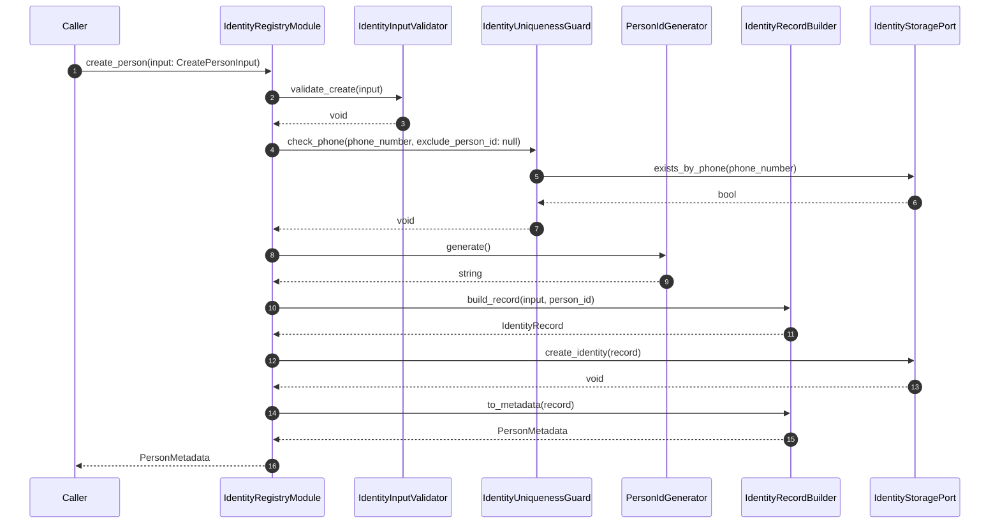
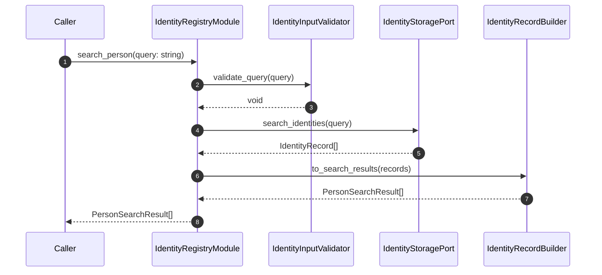
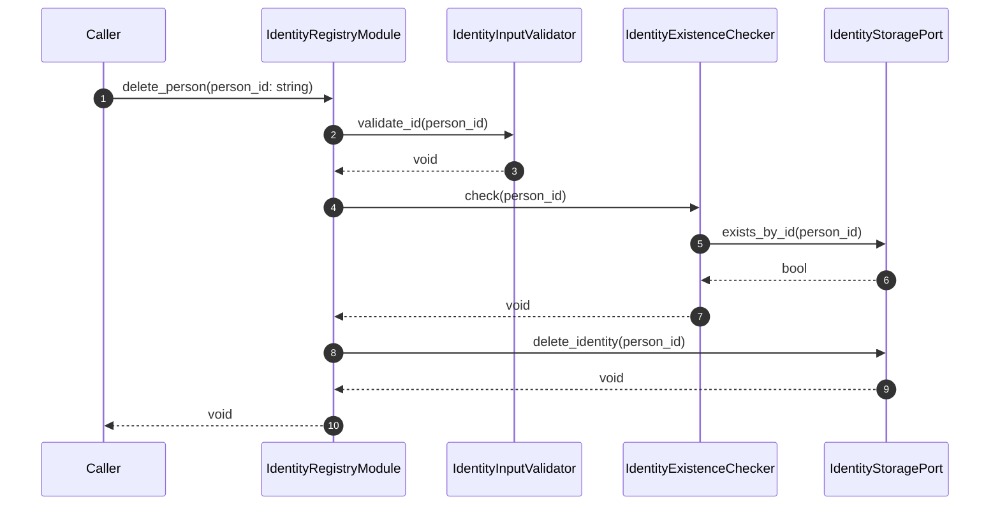

# IdentityRegistry Module Specification

---

## 1. Scope

### Purpose

The `IdentityRegistry` module is responsible for identity lifecycle management within the Face Gallery Management Service. It receives typed identity operation requests and returns structured identity metadata. It is the authoritative interface for creating, updating, retrieving, searching, and deleting identity records, and it enforces all business rules governing identity uniqueness.

### In Scope

- Generating `person_id` as the internal identity key upon creation
- Validating identity input data: non-empty `person_name`, UUID-format `person_id`, E.164-format `phone_number`
- Enforcing uniqueness of `phone_number` across all identities
- Verifying identity existence before mutating or reading operations
- Creating identity records via the persistence port
- Updating identity attributes (`person_name`, `phone_number`, `external_id`, `metadata`)
- Retrieving identity metadata by `person_id`
- Searching identities by `phone_number`, `person_name`, or `external_id`
- Deleting identity records (hard delete) via the persistence port
- Returning structured `PersonMetadata` and `PersonSearchResult` outputs

### Out of Scope

The `IdentityRegistry` module does NOT:

- Process images or video frames — handled outside this module
- Extract or manage face embeddings — handled outside this module
- Manage gallery samples or enrolled face data — handled outside this module
- Perform enrollment logic — handled outside this module
- Execute batch identity operations — handled outside this module
- Access any database or storage backend directly — delegated to the downstream persistence port

---

## 2. Input

### 2.1 Input Responsibility Boundary

The module receives typed input structs for each operation. No preprocessing of identity data is performed outside the module. The caller is responsible only for providing well-formed request structs. The module is responsible for all validation, uniqueness enforcement, existence verification, and `person_id` generation. The module does not receive raw images, embeddings, or binary data of any kind.

### 2.2 Input Structure

```text
struct CreatePersonInput {
    string person_name;               // required; display name of the identity
    optional string phone_number;     // optional; business identifier; must be unique if present
    optional string external_id;      // optional; external system reference
    map<string, string> metadata;     // auxiliary key-value annotations; may be empty
}

struct UpdatePersonInput {
    string person_id;                 // required; internal identity key; immutable
    optional string person_name;      // if present, replaces the current display name
    optional string phone_number;     // if present, replaces the current phone; must remain unique
    optional string external_id;      // if present, replaces the current external reference
    map<string, string> metadata;     // replaces the current auxiliary metadata map
}

struct SearchPersonInput {
    string query;                     // required; non-empty search term
}
```

### 2.3 Input Contract

- `person_name` must be a non-empty string for `create_person`
- `person_id` must be a non-empty string in UUID format for `update_person`, `get_person`, and `delete_person`
- `phone_number`, when present, must be a non-empty string conforming to E.164 format
- `query` must be a non-empty string for `search_person`
- `metadata` must be a non-null map; an empty map is valid

### 2.4 Validation Rules

`IdentityInputValidator` must verify:

- `person_name` is non-empty for `create_person`
- `person_id` is non-empty and conforms to UUID format for `update_person`, `get_person`, and `delete_person`
- `phone_number`, if present, conforms to the configured E.164 format pattern in `create_person` and `update_person`
- `phone_number`, if present, is not already assigned to a different identity in `create_person` and `update_person`
- `query` is non-empty for `search_person`
- `metadata` is non-null in all operations that accept it

### 2.5 Input Semantics

- `person_name` — display-only label for the identity; not unique; not used for identity matching or uniqueness enforcement
- `person_id` — system-generated UUID; the only true internal identifier; immutable after creation; never supplied by the caller at creation time
- `phone_number` — optional business identifier; enforced as unique across all identities when present; used as a direct search field
- `external_id` — optional opaque string linking the identity to an external system; not used for internal matching or uniqueness logic
- `metadata` — auxiliary key-value map for audit, traceability, and context; not used in uniqueness logic or identity matching
- `query` — free-text term matched against `phone_number`, `person_name`, and `external_id`

---

## 3. Output

### 3.1 Output Structure

```text
struct PersonMetadata {
    string person_id;                 // system-generated UUID; primary identity key
    string person_name;               // display name
    optional string phone_number;     // business identifier; absent if not set
    optional string external_id;      // external system reference; absent if not set
    map<string, string> metadata;     // auxiliary annotations; may be empty
}

struct PersonSearchResult {
    string person_id;                 // system-generated UUID
    string person_name;               // display name
    optional string phone_number;     // present if set for this identity
}
```

### 3.2 Output Semantics

- `person_id` — the immutable internal key generated at creation; stable across all operations
- `person_name` — current display name of the identity at time of response
- `phone_number` — current phone number if one is set; absent otherwise
- `external_id` — current external system reference if set; absent from `PersonSearchResult` to minimize result payload
- `metadata` — full auxiliary annotation map at time of response; present only in `PersonMetadata`

### 3.3 Output Constraints

The output must NOT expose:

- Face embeddings or embedding identifiers
- Image data, image references, or image identifiers
- Storage backend identifiers or internal persistence keys
- Database row IDs, index values, or backend-specific record handles
- Confidence scores, similarity scores, or matching flags
- Internal validation state or error diagnostics

---

## 4. Public API

```text
create_person(input: CreatePersonInput) -> PersonMetadata
update_person(input: UpdatePersonInput) -> PersonMetadata
get_person(person_id: string) -> PersonMetadata
search_person(query: string) -> PersonSearchResult[]
delete_person(person_id: string) -> void
```

The API must remain stable regardless of which persistence backend is configured.

---

## 5. Non-Functional Requirements

- The module is stateless per invocation; all persistent state is owned exclusively by the downstream persistence port
- Each invocation processes exactly one identity operation; batch operations are not supported
- The module is suitable for synchronous request-response usage
- All operations are deterministic given the same inputs and storage state
- The public API is persistence-backend-agnostic; the caller is never exposed to storage internals
- No internal persistence types, record handles, or backend artifacts may leak through the public API

---

## 6. Processing Engine

### 6.1 Engine Abstraction Interface

```text
interface IdentityStoragePort {
    create_identity(record: IdentityRecord) -> void
    update_identity(record: IdentityRecord) -> void
    get_identity_metadata(person_id: string) -> IdentityRecord
    search_identities(query: string) -> IdentityRecord[]
    delete_identity(person_id: string) -> void
    exists_by_phone(phone_number: string) -> bool
    exists_by_id(person_id: string) -> bool
}
```

### 6.2 Current Default Implementation

```text
class FaceGalleryStorageAdapter implements IdentityStoragePort
```

This implementation is persistence-based, not AI-based. It delegates identity record persistence to the downstream storage component via its defined read/write API. It does not perform any logic beyond translating between `IdentityRecord` and the downstream component's input/output types.

### 6.3 Replaceability

The `IdentityRegistry` module depends only on `IdentityStoragePort`, not on `FaceGalleryStorageAdapter` or any concrete backend. Replacing the storage adapter does not affect the public API, the validation logic, the uniqueness enforcement logic, or any calling code.

---

## 7. Acceptance / Filtering Logic

`IdentityInputValidator` evaluates all input field constraints before any operation is forwarded to the storage port. Any rejection at this stage is immediate: no uniqueness check, existence check, or persistence call is made.

For `create_person` and `update_person`, `IdentityUniquenessGuard` queries the storage port using `exists_by_phone` to determine whether the supplied `phone_number` is already assigned to a different identity. If a duplicate is detected, the operation is rejected and no record is written. `IdentityUniquenessGuard` is the only component that makes accept or reject decisions for phone number uniqueness. The rejection criterion is an exact match; it is not configurable.

For `update_person`, `get_person`, and `delete_person`, `IdentityExistenceChecker` calls `exists_by_id` prior to any read or write operation to confirm the identity exists. If the identity does not exist, the operation is rejected and no persistence call is made. `IdentityExistenceChecker` is the only component that makes accept or reject decisions for identity existence.

No validation state, uniqueness check result, or existence flag is returned to the caller. All caller-facing output is either a valid `PersonMetadata`, a `PersonSearchResult[]`, or a structured error.

---

## 8. Internal Pipeline

### 8.1 IdentityRegistryModule

`IdentityRegistryModule` is responsible for orchestrating identity lifecycle operations across its internal components.

Its responsibilities are:

- Loading configuration at initialization
- Wiring and injecting all internal components at construction time
- Delegating each public API call to the appropriate pipeline sequence
- Returning the final typed output to the caller

`IdentityRegistryModule` must not contain validation logic, uniqueness enforcement logic, `person_id` generation logic, or persistence logic.

### 8.2 IdentityInputValidator

`IdentityInputValidator` is responsible for enforcing all input field contracts before any operation proceeds.

Its responsibilities are:

- Verifying that required string fields are non-empty
- Verifying that `person_id` conforms to UUID format where required
- Verifying that `phone_number`, if present, conforms to the configured E.164 format pattern
- Verifying that `query` is non-empty for search operations
- Verifying that `metadata` is non-null

`IdentityInputValidator` must not perform uniqueness checks, existence checks, persistence calls, or identity construction.

### 8.3 IdentityUniquenessGuard

`IdentityUniquenessGuard` is responsible for enforcing phone number uniqueness across all identities.

Its responsibilities are:

- Receiving a `phone_number` value and an optional `exclude_person_id` for update operations
- Calling `IdentityStoragePort.exists_by_phone` to detect conflicts
- Rejecting the operation immediately if a duplicate is found

`IdentityUniquenessGuard` must not validate field formats, generate identifiers, build output structs, or persist data.

### 8.4 IdentityExistenceChecker

`IdentityExistenceChecker` is responsible for verifying that a given `person_id` references an existing identity before any mutating or read operation proceeds.

Its responsibilities are:

- Calling `IdentityStoragePort.exists_by_id` with the provided `person_id`
- Rejecting the operation if no matching identity is found

`IdentityExistenceChecker` must not validate input format, enforce uniqueness, build output structs, or persist data.

### 8.5 PersonIdGenerator

`PersonIdGenerator` is responsible for producing a new unique `person_id` for each identity creation request.

Its responsibilities are:

- Generating a UUID v4 string using the configured namespace strategy
- Returning the generated identifier to the orchestrator

`PersonIdGenerator` must not validate input, access storage, or apply any identity business logic.

### 8.6 IdentityRecordBuilder

`IdentityRecordBuilder` is responsible for assembling `IdentityRecord` structs from validated input data and for constructing public output structs from records returned by the storage port.

Its responsibilities are:

- Constructing an `IdentityRecord` for create operations from validated input and a generated `person_id`
- Constructing an updated `IdentityRecord` for update operations by merging the existing record with the provided update fields
- Constructing `PersonMetadata` output structs from `IdentityRecord` values
- Constructing `PersonSearchResult` output structs from `IdentityRecord` values

`IdentityRecordBuilder` must not validate input, access storage, perform uniqueness checks, or generate identifiers.

### 8.7 End-to-End Processing Flow

**create_person:** validate → check phone uniqueness → generate person_id → build record → persist → build output

1. `IdentityRegistryModule` calls `IdentityInputValidator.validate_create(input: CreatePersonInput)` → `void`
2. `IdentityRegistryModule` calls `IdentityUniquenessGuard.check_phone(phone_number: string, exclude_person_id: null)` → `void`
3. `IdentityRegistryModule` calls `PersonIdGenerator.generate()` → `string`
4. `IdentityRegistryModule` calls `IdentityRecordBuilder.build_record(input: CreatePersonInput, person_id: string)` → `IdentityRecord`
5. `IdentityRegistryModule` calls `IdentityStoragePort.create_identity(record: IdentityRecord)` → `void`
6. `IdentityRegistryModule` calls `IdentityRecordBuilder.to_metadata(record: IdentityRecord)` → `PersonMetadata`

**update_person:** validate → check existence → check phone uniqueness → fetch existing → build updated record → persist → build output

1. `IdentityRegistryModule` calls `IdentityInputValidator.validate_update(input: UpdatePersonInput)` → `void`
2. `IdentityRegistryModule` calls `IdentityExistenceChecker.check(person_id: string)` → `void`
3. `IdentityRegistryModule` calls `IdentityUniquenessGuard.check_phone(phone_number: string, exclude_person_id: string)` → `void`
4. `IdentityRegistryModule` calls `IdentityStoragePort.get_identity_metadata(person_id: string)` → `IdentityRecord`
5. `IdentityRegistryModule` calls `IdentityRecordBuilder.build_updated_record(existing: IdentityRecord, input: UpdatePersonInput)` → `IdentityRecord`
6. `IdentityRegistryModule` calls `IdentityStoragePort.update_identity(record: IdentityRecord)` → `void`
7. `IdentityRegistryModule` calls `IdentityRecordBuilder.to_metadata(record: IdentityRecord)` → `PersonMetadata`

**get_person:** validate → check existence → retrieve → build output

1. `IdentityRegistryModule` calls `IdentityInputValidator.validate_id(person_id: string)` → `void`
2. `IdentityRegistryModule` calls `IdentityExistenceChecker.check(person_id: string)` → `void`
3. `IdentityRegistryModule` calls `IdentityStoragePort.get_identity_metadata(person_id: string)` → `IdentityRecord`
4. `IdentityRegistryModule` calls `IdentityRecordBuilder.to_metadata(record: IdentityRecord)` → `PersonMetadata`

**search_person:** validate → search → build output list

1. `IdentityRegistryModule` calls `IdentityInputValidator.validate_query(query: string)` → `void`
2. `IdentityRegistryModule` calls `IdentityStoragePort.search_identities(query: string)` → `IdentityRecord[]`
3. `IdentityRegistryModule` calls `IdentityRecordBuilder.to_search_results(records: IdentityRecord[])` → `PersonSearchResult[]`

**delete_person:** validate → check existence → delete

1. `IdentityRegistryModule` calls `IdentityInputValidator.validate_id(person_id: string)` → `void`
2. `IdentityRegistryModule` calls `IdentityExistenceChecker.check(person_id: string)` → `void`
3. `IdentityRegistryModule` calls `IdentityStoragePort.delete_identity(person_id: string)` → `void`

All intermediate data (`IdentityRecord`, existence flags, uniqueness check results) remain strictly internal to the module.

---

## 9. Configuration

### 9.1 Configuration Parameters

```text
struct IdentityRegistryConfig {
    string phone_number_format;    // regex pattern for E.164 phone validation; default: "^\+[1-9]\d{1,14}$"
    string person_id_namespace;    // UUID generation strategy identifier; default: "random"
}
```

### 9.2 Loading Behavior

Configuration is loaded exactly once at module initialization. It is immutable after initialization. No configuration parameter is part of any input struct.

Configuration injection at construction time:

- `phone_number_format` is injected into `IdentityInputValidator`
- `phone_number_format` is injected into `IdentityUniquenessGuard`
- `person_id_namespace` is injected into `PersonIdGenerator`
- `IdentityStoragePort` implementation is injected into `IdentityRegistryModule` as a named dependency

---

## 10. Internal Data Structures

- **`IdentityRecord`** — complete identity state including all fields; produced by `IdentityRecordBuilder`, consumed by `IdentityStoragePort`; lifecycle: per-call
- **`CreatePersonInput`** — typed create request; produced by the caller, consumed by `IdentityInputValidator` and `IdentityRecordBuilder`; lifecycle: per-call
- **`UpdatePersonInput`** — typed update request; produced by the caller, consumed by `IdentityInputValidator`, `IdentityUniquenessGuard`, and `IdentityRecordBuilder`; lifecycle: per-call
- **`SearchPersonInput`** — typed search request; produced by the caller, consumed by `IdentityInputValidator`; lifecycle: per-call
- **`PersonMetadata`** — public identity output; produced by `IdentityRecordBuilder`, returned to the caller; lifecycle: per-call
- **`PersonSearchResult`** — public search output element; produced by `IdentityRecordBuilder`, returned to the caller; lifecycle: per-call

---

## 11. Error Handling

- `phone_number` duplicate detected → reject operation; return `DuplicatePhoneError` naming the conflicting field; no record is written
- invalid input (empty required field, malformed UUID, malformed phone number, null metadata, empty query) → reject operation; return `ValidationError` naming the offending field; no persistence call is made
- `person_id` not found → reject operation; return `NotFoundError` with the provided `person_id`; no persistence call is made for mutating operations
- persistence failure → propagate as `StorageError`; no partial state is committed; the error does not expose backend internals

---

## 12. Metrics / Observability

- `create_person_count` — total number of successful `create_person` invocations
- `update_person_count` — total number of successful `update_person` invocations
- `get_person_count` — total number of successful `get_person` invocations
- `search_person_count` — total number of successful `search_person` invocations
- `delete_person_count` — total number of successful `delete_person` invocations
- `validation_failure_count` — total number of invocations rejected by `IdentityInputValidator` or `IdentityUniquenessGuard`

Metrics are internal and operational. Not part of the public API.

---

## 13. Lifecycle

### 13.1 Initialization

- Load `IdentityRegistryConfig` once
- Construct `IdentityInputValidator` with `phone_number_format`
- Construct `PersonIdGenerator` with `person_id_namespace`
- Construct `IdentityUniquenessGuard` with `phone_number_format` and the injected `IdentityStoragePort`
- Construct `IdentityExistenceChecker` with the injected `IdentityStoragePort`
- Construct `IdentityRecordBuilder`
- Inject all components into `IdentityRegistryModule`

### 13.2 Per Invocation

- Validate input → enforce uniqueness / existence → generate ID (create only) → build record → persist → build output
- Each invocation is independent; no state is carried between calls

### 13.3 Shutdown

- No internal state to flush or release
- `IdentityStoragePort` lifecycle is managed by the injecting context, not by this module

---

## 14. Class Diagram

```mermaid
classDiagram
    class IdentityRegistryModule {
        +create_person(input: CreatePersonInput) PersonMetadata
        +update_person(input: UpdatePersonInput) PersonMetadata
        +get_person(person_id: string) PersonMetadata
        +search_person(query: string) PersonSearchResult[]
        +delete_person(person_id: string) void
    }

    class IdentityInputValidator {
        +validate_create(input: CreatePersonInput) void
        +validate_update(input: UpdatePersonInput) void
        +validate_id(person_id: string) void
        +validate_query(query: string) void
    }

    class IdentityUniquenessGuard {
        +check_phone(phone_number: string, exclude_person_id: string) void
    }

    class IdentityExistenceChecker {
        +check(person_id: string) void
    }

    class PersonIdGenerator {
        +generate() string
    }

    class IdentityRecordBuilder {
        +build_record(input: CreatePersonInput, person_id: string) IdentityRecord
        +build_updated_record(existing: IdentityRecord, input: UpdatePersonInput) IdentityRecord
        +to_metadata(record: IdentityRecord) PersonMetadata
        +to_search_results(records: IdentityRecord[]) PersonSearchResult[]
    }

    class IdentityStoragePort {
        <<interface>>
        +create_identity(record: IdentityRecord) void
        +update_identity(record: IdentityRecord) void
        +get_identity_metadata(person_id: string) IdentityRecord
        +search_identities(query: string) IdentityRecord[]
        +delete_identity(person_id: string) void
        +exists_by_phone(phone_number: string) bool
        +exists_by_id(person_id: string) bool
    }

    class FaceGalleryStorageAdapter {
        +create_identity(record: IdentityRecord) void
        +update_identity(record: IdentityRecord) void
        +get_identity_metadata(person_id: string) IdentityRecord
        +search_identities(query: string) IdentityRecord[]
        +delete_identity(person_id: string) void
        +exists_by_phone(phone_number: string) bool
        +exists_by_id(person_id: string) bool
    }

    class CreatePersonInput {
        +string person_name
        +optional string phone_number
        +optional string external_id
        +map~string,string~ metadata
    }

    class UpdatePersonInput {
        +string person_id
        +optional string person_name
        +optional string phone_number
        +optional string external_id
        +map~string,string~ metadata
    }

    class PersonMetadata {
        +string person_id
        +string person_name
        +optional string phone_number
        +optional string external_id
        +map~string,string~ metadata
    }

    class PersonSearchResult {
        +string person_id
        +string person_name
        +optional string phone_number
    }

    class IdentityRecord {
        +string person_id
        +string person_name
        +optional string phone_number
        +optional string external_id
        +map~string,string~ metadata
    }

    IdentityRegistryModule --> IdentityInputValidator : orchestrates
    IdentityRegistryModule --> IdentityUniquenessGuard : orchestrates
    IdentityRegistryModule --> IdentityExistenceChecker : orchestrates
    IdentityRegistryModule --> PersonIdGenerator : orchestrates
    IdentityRegistryModule --> IdentityRecordBuilder : orchestrates
    IdentityRegistryModule --> IdentityStoragePort : orchestrates
    FaceGalleryStorageAdapter ..|> IdentityStoragePort : implements
```



---

## 15. Sequence Diagram

### create_person



### search_person



### delete_person



---

## 16. Data Flow Diagram

```mermaid
flowchart TD
    Caller([Caller\nCreatePersonInput / UpdatePersonInput\nget / search / delete]) --> Validator

    Validator[IdentityInputValidator\nvalidated fields] --> RouteDecision

    RouteDecision{Operation type}

    RouteDecision -->|create / update: phone present| UniquenessGuard
    RouteDecision -->|update / get / delete| ExistenceChecker
    RouteDecision -->|create| IdGenerator
    RouteDecision -->|search| StorageSearch

    UniquenessGuard[IdentityUniquenessGuard\nexists_by_phone result] --> IdGenerator
    UniquenessGuard --> ExistenceChecker

    ExistenceChecker[IdentityExistenceChecker\nexists_by_id result] --> StorageRW

    IdGenerator[PersonIdGenerator\nperson_id: string] --> RecordBuilder

    RecordBuilder[IdentityRecordBuilder\nIdentityRecord] --> StorageRW

    StorageRW[IdentityStoragePort\nread / write] --> OutputBuilder

    StorageSearch[IdentityStoragePort\nsearch_identities\nIdentityRecord[]] --> OutputBuilder

    OutputBuilder[IdentityRecordBuilder\nPersonMetadata / PersonSearchResult[]] --> Response

    Response([Caller response])
```

---

## 17. Extensibility

**What can change without breaking the public API:**

- Replacing `FaceGalleryStorageAdapter` with any implementation that satisfies `IdentityStoragePort`
- Changing the underlying persistence technology (relational database, document store, in-memory store)
- Changing the `phone_number_format` regex at configuration time
- Changing the UUID generation strategy via `person_id_namespace`
- Adding observability instrumentation inside any internal component

**What must remain stable:**

- The public API function signatures: `create_person`, `update_person`, `get_person`, `search_person`, `delete_person`
- The `PersonMetadata` output schema: field names, types, and optional field semantics
- The `PersonSearchResult` output schema: field names, types, and optional field semantics
- The `NotFoundError` semantics for an unknown `person_id`
- The `DuplicatePhoneError` semantics for a conflicting `phone_number`

---

## 18. Module Compliance Checklist

- [ ] Each public API call processes exactly one identity per invocation; batch operations are not supported
- [ ] `phone_number` uniqueness is enforced internally by `IdentityUniquenessGuard`; the uniqueness result is never returned to the caller
- [ ] Identity existence is verified internally by `IdentityExistenceChecker`; the existence flag is never returned to the caller
- [ ] No `IdentityRecord`, existence flag, storage handle, or backend identifier is exposed in any public output type
- [ ] The module depends on `IdentityStoragePort` interface, not on any concrete storage adapter class
- [ ] `person_id` is generated internally by `PersonIdGenerator`; it is never supplied by the caller at creation time
- [ ] `metadata` is preserved unchanged from input to output; it is never used in uniqueness or matching logic
- [ ] All error paths resolve to a structured, typed error response; no partial state is committed on failure
- [ ] Embeddings, images, gallery samples, and enrollment logic are excluded from all pipelines and all output types
- [ ] Configuration is loaded once at initialization and is immutable during the module's lifetime
