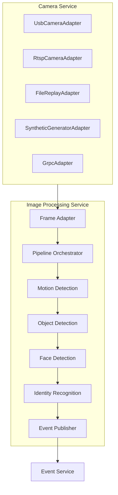
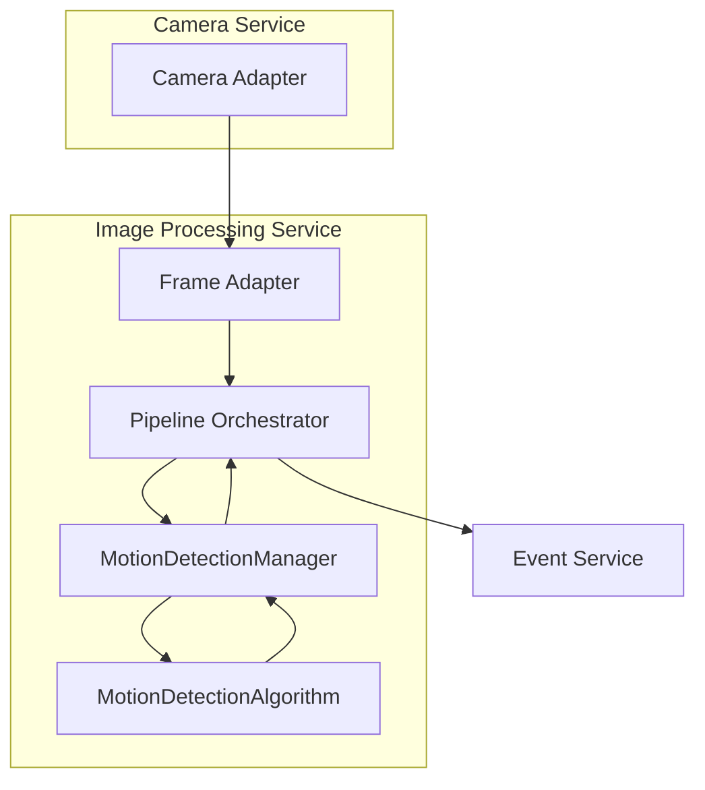
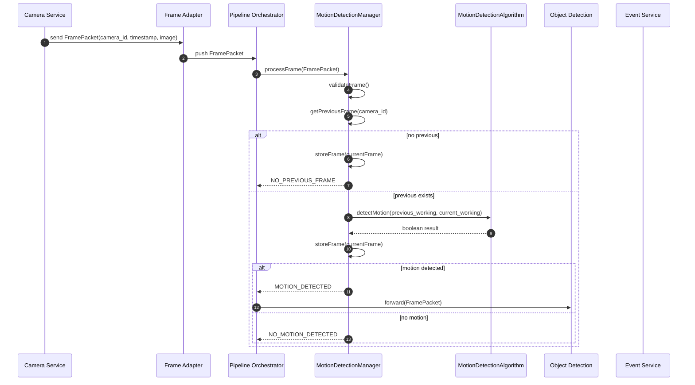

detections = object_detector.detect(frame_packet)
def build_pipeline(config):
# Image Processing Service

## Overview

The Image Processing Service (IPS) ingests frames from the Camera Service, normalizes them into a canonical `FramePacket`, runs deterministic processing modules (motion, object, face, identity), and emits structured events to downstream services.

## Responsibilities

- Ingest frames via gRPC and normalize into `FramePacket`.
- Execute pipeline modules in deterministic order and attach results to `FramePacket`.
- Publish structured events to the Event Service according to configured rules.
- Expose diagnostics and pipeline tracing for observability.

## Position in System Architecture

- Upstream: `Camera Service` (RTSP/USB/file/synthetic).
- Downstream: `Event Service` (event streams), `Media Service` (clip generation via Frame Buffer Service).
- The IPS is not responsible for storing video clips.

## High-Level Architecture



---

# Modules

## Motion Detection

### Overview

Motion Detection is an internal, first-stage module of the Image Processing Service (IPS) that determines whether a given `FramePacket` contains perceptible motion relative to a previously-stored frame for the same `camera_id`. It runs as a pipeline stage invoked by the Pipeline Orchestrator and is responsible for producing a deterministic motion result attached to the `FramePacket`.

### Purpose & responsibilities (service-level)

- Validate incoming `FramePacket` against configured limits (resolution, fields).
- Compare the current frame to a stored previous frame for the same `camera_id` and determine whether motion exists.
- Populate `FramePacket.motion` with a motion result (e.g., `motion_detected`, `score`, optional mask or ROIs) and emit lightweight metrics.
- Provide a manager API for the orchestrator to call (e.g., `process(frame_packet) -> MotionResult`).

Note: Motion Detection does NOT publish events. It annotates the `FramePacket` and returns a result to the Pipeline Orchestrator which decides whether to continue downstream processing and whether events should be emitted.

### Inputs and outputs

- Input: canonical `FramePacket` (normalized by the Frame Adapter). The packet must include `camera_id`, `timestamp_ms`, pixel data and resolution.
- Output: the same `FramePacket` augmented with `frame_packet.motion` (and optional `pipeline_flags`, such as `skip_remaining`) and a `MotionResult` returned to the orchestrator.

### Motion payload (contract)

- The Motion Detection manager MUST attach a `frame_packet.motion` payload before returning from `process(frame_packet)`. The field is considered immutable for that packet after `process()` returns.
- Recommended default shape (metadata-first):

```yaml
frame_packet.motion:
  detected: bool
  score: float            # optional, normalized (0.0 - 1.0)
  motion_pixel_count: int
  timestamp_ms: int
```

- Optional `details` (mask, bboxes) may be included when configured; heavier payloads should be opt-in.

### Interaction with Pipeline Orchestrator

- The Pipeline Orchestrator invokes Motion Detection as the first pipeline stage. Example flow:
  1. Orchestrator calls `motion_manager.process(frame_packet)`.
  2. The manager validates the packet and compares with a stored previous frame for `camera_id`.
  3. The manager attaches the motion result to `frame_packet.motion` and returns a `MotionResult` value to the orchestrator.
  4. The orchestrator uses that result (and configured rules) to decide whether to forward the `FramePacket` to downstream modules (Object Detection, Face Detection, Identity Recognition) or short-circuit further processing.

Note: The orchestrator should consult both the `MotionResult` return value and the contents of `frame_packet.motion` when making forwarding or event-publishing decisions. The `MotionResult` provides a quick control signal, while `frame_packet.motion` carries the authoritative details for downstream use (scores, masks, ROIs).

### Configuration (service-level keys)

Motion Detection configuration is provided under the `motion_detection` section of the IPS configuration. See `doc/MOTION_DETECTION.md` for the authoritative list and defaults. Representative keys (service-level reference):

- `motion_detection.motion_threshold`
- `motion_detection.use_gaussian_blur`
- `motion_detection.motion_fraction_threshold`
- `motion_detection.motion_pixel_count_threshold`
- `motion_detection.processing_width` / `processing_height`
- `motion_detection.max_width` / `max_height`

The full configuration schema, eviction policy and tuning guidance live in `doc/MOTION_DETECTION.md`.

### Observability & side effects

- Motion Detection increments metrics (`frames_processed`, `motion_detections`, `invalid_frames`) and exposes health for the manager.
- It stores a per-stream previous frame (subject to eviction policies) for future comparisons; that storage is internal to the Motion Detection manager.

### Initialization

- On startup the orchestrator instantiates the Motion Detection manager with its configuration and registers it as the pipeline stage. The manager initializes internal buffers, eviction structures and metrics; no event publication occurs here.

### Details and implementation

The following implementation-level details are the authoritative, module-level descriptions moved from the Motion Detection module document. They include system-level diagrams, the IPS initialization flow for the module, and a textual data/sequence summary for integrators. For the algorithm, configuration keys, and testing guidance see `doc/MOTION_DETECTION.md`.

## Data Flow (mermaid, system-style)



## Sequence Diagram (mermaid, system-style)



## Initialization

Initialization flow on IPS startup:

1. Load global configuration and extract `motion_detection` section.
2. Instantiate `MotionDetectionAlgorithm` with algorithm parameters (`motion_threshold`, blur settings, fraction thresholds, processing dims).
3. Instantiate `MotionDetectionManager` with the algorithm instance and manager config (`max_width`, `max_height`, `store_downsampled_frame`, eviction policy).
4. Register the manager in the IPS pipeline so the orchestrator calls `processFrame` for incoming `FramePacket`s.

## Data Flow (textual)

- Camera Service -> Frame Adapter -> `FramePacket` -> IPS Pipeline Orchestrator -> `MotionDetectionManager.processFrame(Frame)` -> `MotionDetectionAlgorithm.detectMotion(previous, current)` -> Manager updates stored frame and returns `MotionResult` (the motion result is attached to `FramePacket.motion`) -> Pipeline Orchestrator forwards the `FramePacket` to the next module (typically Object Detection). Event generation is performed only after downstream analysis (object/face/identity).

## Sequence (textual)

Camera Service
  ↓ send Frame
Image Processing Service (Frame Adapter)
  ↓ call processFrame(currentFrame)
MotionDetectionManager
  ↓ validate frame resolution
  ↓ getPreviousFrame()
  ↓ if previous exists -> MotionDetectionAlgorithm.detectMotion(previousFrame, currentFrame)
  ↓ algorithm returns boolean
  ↓ storeFrame(currentFrame)
  ↓ return MotionResult to IPS

If motion detected: the manager stores the motion result on `FramePacket.motion` and returns `MOTION_DETECTED`; the Pipeline Orchestrator forwards the `FramePacket` to the next processing stage (typically Object Detection). Event generation is performed only after downstream analysis (object/face/identity).
---

## Object Detection

### Overview

Detects objects of interest and populates `frame_packet.objects` for downstream processing and event emission.

### Responsibilities

- Produce `DetectedObject` entries with `class_id`, `class_name`, `confidence`, and `bbox`.

### Components / Classes

- `ObjectDetector` — module orchestrating preprocessing, inference call, and post-processing.
- `ModelProvider` — a small abstraction used to load and run runtime-specific inference (keeps system docs implementation-agnostic).

### Interfaces

- `object_detector.detect(frame_packet: FramePacket) -> List[DetectedObject]`

### Configuration

- `object_detection.enabled`, `conf_threshold`, `iou_threshold`, `classes`, `trigger.require_motion`.

### Initialization

- Load model via `ModelProvider` at startup and optionally perform a warm-up.

### Data Flow

- Input: `frame_packet.raw_frame` (or ROIs from `frame_packet.motion.mask`).
- Preprocessing: color conversion, resize/pad (letterbox), and apply model-specific preprocessing.
- Inference: call `ModelProvider.infer()` and obtain raw outputs.
- Post-processing: confidence filtering, NMS (configured `iou_threshold`), coordinate transform back to original frame, class mapping.
- Output: append detections to `frame_packet.objects` and update `pipeline_trace`.

---

## Face Detection

### Overview

Locates faces for subsequent recognition; typically run within person bounding boxes.

### Responsibilities

- Populate `frame_packet.faces` with detected face regions and confidence.

### Components / Classes

- `FaceDetector`.

### Interfaces

- `face_detector.detect(frame_packet: FramePacket) -> List[DetectedFace]`

### Configuration

- `face_detection.enabled`.

### Initialization

- Load face detection assets as required.

### Data Flow

- Input: person ROIs or entire frame.
- Output: `frame_packet.faces` and `pipeline_trace` update.

---

## Identity Recognition

### Overview

Matches detected faces to known identities and appends `RecognizedIdentity` entries to `frame_packet.identities`.

### Responsibilities

- Identify known individuals and provide confidence/hints for events.

### Components / Classes

- `IdentityRecognizer`.

### Interfaces

- `recognizer.identify(detected_face: DetectedFace) -> RecognizedIdentity | None`

### Configuration

- `identity.enabled` and credentials/access to identity store.

### Initialization

- Load identity references or connect to identity service.

### Data Flow

- Input: `frame_packet.faces`
- Output: `frame_packet.identities` and `pipeline_trace` update.

---
    
  ## Frame Processing (Frame Adapter)

### Overview

Normalizes incoming frames into the canonical `FramePacket` used by the pipeline.

### Responsibilities

- Validate and decode incoming frame payloads.
- Populate `FramePacket` ingest fields.

### Components / Classes

  - `FrameAdapter` (handles gRPC ingestion).

### Interfaces

Example gRPC schema:

```proto
message Frame {
  string camera_id = 1;
  int64 timestamp_ms = 2;
  string frame_id = 3;
  int32 width = 4;
  int32 height = 5;
  bytes image = 6;
  string format = 7;
}

service FrameSource {
  rpc StreamFrames(stream Frame) returns (Ack);
}
```

### Configuration

- `ingest.grpc.port`, `ingest.ipc.enabled`, retry/backoff.

### Initialization

- Start gRPC servers/IPC listeners; configure decoders and metrics.

### Data Flow

- Input: raw IPC/gRPC payload
- Output: `FramePacket` with `camera_id`, `timestamp`, `frame_id`, `width`, `height`, `raw_frame`, `raw_metadata`.

Example ingestion flow:

```python
frame_packet = FramePacket(
  camera_id=frame.camera_id,
  timestamp=parse_timestamp(frame.timestamp_ms),
  frame_id=frame.frame_id,
  width=frame.width,
  height=frame.height,
  raw_frame=decode_payload(frame.image, frame.format),
)
```

---

## Event Emission (Event Publisher)

### Overview

Serializes and publishes structured events derived from pipeline results to the configured Event Service transport.

### Responsibilities

- Format event payloads with source metadata and detection details.
- Send events reliably with configured retry and backoff.

### Components / Classes

- `EventPublisher`.

### Interfaces

- `event_publisher.publish(event_payload) -> Ack`

### Configuration

- `event.transport` (type and connection parameters), `event.rules`.

### Initialization

- Initialize transport clients and health checks.

### Data Flow

- Input: `FramePacket` detection fields and orchestrator decision.
- Output: structured event message (example below).

Example event payload:

```json
{
  "camera_id": "cam-123",
  "timestamp": 1670000000000,
  "frame_id": "uuid-...",
  "type": "OBJECT_DETECTED",
  "detections": [ { "class_name": "person", "confidence": 0.92, "bbox": [x,y,w,h] } ]
}
```

---

## Integration Guidance

- Keep system docs implementation-agnostic: include `ModelProvider` abstraction (with `load_model()` and `infer()`), but avoid listing vendor-specific tooling in system-level docs.
- Use DI/factory patterns to create pipeline modules from configuration.

---

## Glossary

- **FramePacket**: canonical frame structure passed through modules.
- **Pipeline Orchestrator**: executes modules in order and decides event emission.
- **Event Service**: external stream/topic consumer.

## Revision Notes

Update this document when input contracts, pipeline order, or event payloads change.

