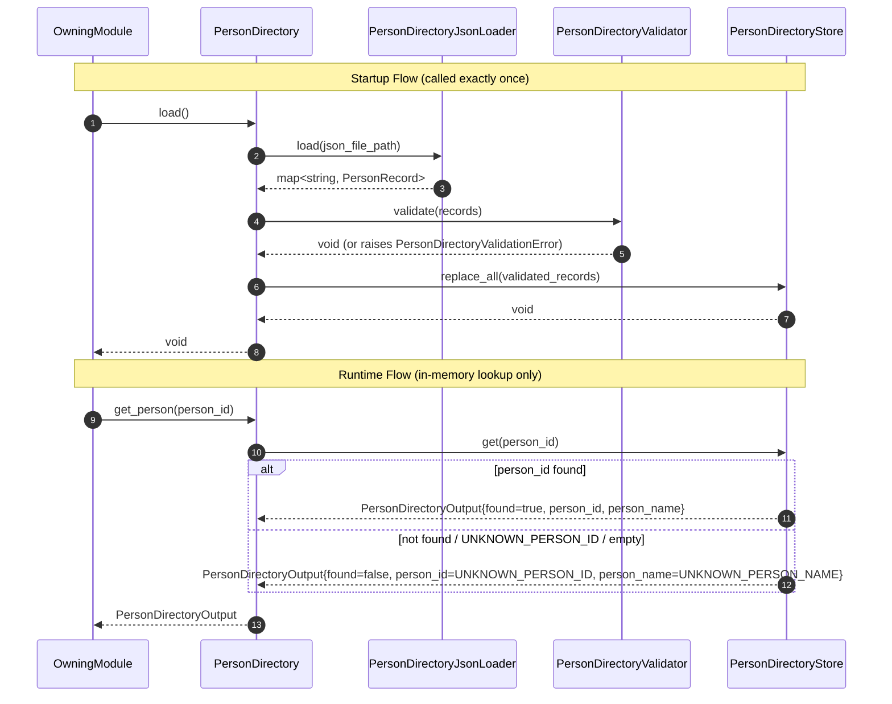
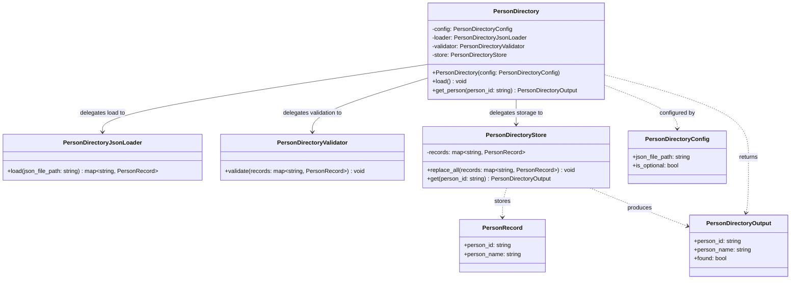

# PersonDirectory — Internal Component Specification

> **Ownership.** PersonDirectory is an internal component owned and managed exclusively by its owning module. It is not a public module and must not be depended on by any component outside the owning module.

---

## 1. Overview

PersonDirectory is responsible for loading and storing person metadata from a JSON file, and for resolving a recognized `person_id` into a `PersonRecord` containing the corresponding `person_name`.

PersonDirectory is initialized once at owning-module startup. `load()` is called exactly once during owning-module/system startup. During that single call, PersonDirectory reads the configured JSON file, parses it, validates all records, builds an in-memory map from `person_id` to `PersonRecord`, and publishes it to the store.

After successful `load()`, the store is read-only. Runtime `get_person(person_id)` performs only an in-memory lookup and returns a `PersonDirectoryOutput` containing the resolved `person_name` and a `found` flag.

`load()` is expected during startup, but runtime lookup is fail-safe even before successful `load()`: `get_person()` returns the canonical UNKNOWN output (`found = false`) and does not raise.

If `person_id` is unknown, missing, empty, or equals `UNKNOWN_PERSON_ID`, PersonDirectory returns a canonical UNKNOWN output (`person_id = UNKNOWN_PERSON_ID`, `person_name = UNKNOWN_PERSON_NAME`, `found = false`). PersonDirectory never fails the pipeline due to missing person metadata at runtime.

PersonDirectory is strictly internal to the owning module. It creates no cross-module dependencies and is not reachable from any other module.

---

## 2. Responsibilities

- Load person metadata from a configured JSON file during the single startup `load()` call
- Validate all person records during `load()`: reject records with empty `person_id`, empty `person_name`, or the reserved `person_id` value `UNKNOWN_PERSON_ID`
- Build an in-memory map: `person_id → PersonRecord`
- Publish the fully built map to `PersonDirectoryStore` via `replace_all()` during `load()`
- Respond to `get_person(person_id)` queries at runtime
- Return a `PersonDirectoryOutput` with `found = true` and the matching `PersonRecord` fields when `person_id` is known
- Return a canonical UNKNOWN `PersonDirectoryOutput` (`person_id = UNKNOWN_PERSON_ID`, `person_name = UNKNOWN_PERSON_NAME`, `found = false`) when `person_id` is unknown, empty, or equals `UNKNOWN_PERSON_ID`
- Keep runtime lookup fail-safe: if `get_person()` is called before successful `load()`, return canonical UNKNOWN output (`found = false`) and do not raise
- Safely serve concurrent runtime lookups after successful `load()` because the store is read-only

---

## 3. Non-Responsibilities

PersonDirectory does NOT:

- Perform face recognition, embedding matching, or similarity scoring — handled outside this component
- Load or manage face embeddings or gallery data — handled outside this component
- Perform image processing of any kind — handled outside this component
- Know which pipeline stage produced the `person_id` it receives
- Register new persons at runtime or accept enrollment requests
- Persist any state to disk after initialization
- Be depended on by any component outside the owning module
- Know about cameras, frames, or video pipeline concerns
- Support hot reload in the current version

---

## 4. Runtime API Contract

### 4.1 Runtime API

```text
get_person(person_id: string) -> PersonDirectoryOutput
```

### 4.2 Contract

- `person_id` must be a string
- `person_id` may be empty, unknown, or equal to `UNKNOWN_PERSON_ID` — all such cases are valid runtime inputs and return the canonical UNKNOWN output after successful `load()`
- `person_id` is passed directly from the upstream producer without modification by the caller
- PersonDirectory does not know or depend on the producer of `person_id`
- Calling `get_person()` before successful `load()` is allowed and returns canonical UNKNOWN output (`found = false`)

### 4.3 Runtime Behavior Constraints

At runtime, `get_person()` does not perform:

- File I/O
- JSON parsing
- Validation
- `replace_all()`
- Any mutation of the store

---

## 5. Output Contract

### 5.1 Constants

```text
const string UNKNOWN_PERSON_ID = "UNKNOWN"
const string UNKNOWN_PERSON_NAME = "UNKNOWN"
```

### 5.2 Output Structure

```text
struct PersonRecord {
    string person_id;    // stable internal identifier; matches the key used in the JSON file
    string person_name;  // human-readable display name; non-empty for valid records
}

struct PersonDirectoryOutput {
    string person_id;    // resolved person_id; UNKNOWN_PERSON_ID when not found
    string person_name;  // resolved display name; UNKNOWN_PERSON_NAME when not found
    bool   found;        // true when person_id was found in the in-memory store; false otherwise
}
```

### 5.3 Output Semantics

- `person_id` — echoes the resolved identity; equals `UNKNOWN_PERSON_ID` when lookup fails
- `person_name` — the display name of the resolved person; equals `UNKNOWN_PERSON_NAME` when `found = false`
- `found` — `true` when `person_id` was present in the in-memory store; `false` for all unresolved cases

### 5.4 UNKNOWN Output

When lookup fails for any reason (unknown `person_id`, empty `person_id`, `person_id == UNKNOWN_PERSON_ID`), PersonDirectory returns:

```text
PersonDirectoryOutput {
    person_id:   UNKNOWN_PERSON_ID,
    person_name: UNKNOWN_PERSON_NAME,
    found:       false
}
```

This output must never cause the pipeline to fail.

### 5.5 Output Constraints

The output must NOT expose:

- Face embeddings or similarity scores
- Internal map state or record counts
- Load errors or file system paths
- Any data beyond `person_id`, `person_name`, and `found`

---

## 6. Configuration

### 6.1 Configuration Parameters

```text
struct PersonDirectoryConfig {
    string json_file_path;  // absolute or relative path to the person metadata JSON file; required
    bool   is_optional;     // if false (default), a missing or unreadable JSON file fails startup;
                            // if true, an absent file is silently ignored and the store is initialized empty
}
```

### 6.2 Loading Behavior

Configuration is loaded exactly once at initialization. It is immutable after initialization and is not passed as a parameter to any runtime call.

Injection at construction time:

- `json_file_path` -> injected into `PersonDirectoryJsonLoader` as the source path
- `is_optional` -> injected into `PersonDirectory` to control startup failure behavior
- No runtime call receives configuration as a parameter

---

## 7. JSON File Format

### 7.1 Recommended Format

```json
{
  "person_001": {
    "person_name": "Daniel Cohen"
  },
  "person_002": {
    "person_name": "Maya Levi"
  }
}
```

### 7.2 Parsing Rules

- The file must be valid JSON
- The top-level JSON value must be an object/map
- The top-level object is a map from `person_id` (string key) to a record object
- During parsing, each JSON key is promoted into `PersonRecord.person_id`
- Each record object must contain a `person_name` field with a non-empty string value
- Additional fields in the record object are ignored
- Duplicate keys at the JSON level are invalid; `PersonDirectoryJsonLoader` must detect and reject them explicitly during parsing, because some JSON parsers silently collapse duplicate keys
- A completely empty object `{}` is valid; the store is initialized empty and all lookups return the canonical UNKNOWN output

### 7.3 Validation Rules (Load-Only)

Validation is performed by `PersonDirectoryValidator` during `load()` only.

- `person_id` must be a non-empty string
- `person_name` must be a non-empty string
- `person_id` must not equal `UNKNOWN_PERSON_ID`
- Duplicate `person_id` values are invalid and fail startup

---

## 8. Internal Components

### 8.1 PersonDirectory

PersonDirectory is the public-facing orchestration component for this internal unit. It owns no loading, validation, or storage logic directly.

Its responsibilities are:

- Accept `PersonDirectoryConfig` at construction
- Call `PersonDirectoryJsonLoader.load(json_file_path)` during `load()`
- Pass loaded records to `PersonDirectoryValidator.validate(records)`
- Pass validated records to `PersonDirectoryStore.replace_all(records)` to publish the in-memory map
- Delegate `get_person(person_id)` queries to `PersonDirectoryStore.get(person_id)`
- Return the `PersonDirectoryOutput` produced by the store

PersonDirectory must not parse JSON, apply validation rules directly, or access the in-memory map directly.

**Public API:**

```text
PersonDirectory(config: PersonDirectoryConfig)
load() -> void
get_person(person_id: string) -> PersonDirectoryOutput
```

### 8.2 PersonDirectoryJsonLoader

PersonDirectoryJsonLoader is responsible for reading and parsing the JSON file into a `PersonRecord` map.

Its responsibilities are:

- Read the file at the configured path
- Parse the JSON content
- Detect and reject duplicate `person_id` keys during parsing before returning records
- Promote each JSON key to `PersonRecord.person_id`
- Return a `map<string, PersonRecord>` where each key is a `person_id` and each value contains the resolved `person_id` and `person_name`

PersonDirectoryJsonLoader must not apply business validation rules (empty names, reserved keys), build the in-memory store, or handle missing files; file-not-found behavior is controlled by the caller (`PersonDirectory`) based on `is_optional`.

### 8.3 PersonDirectoryValidator

PersonDirectoryValidator is responsible for enforcing validation rules against loaded records during `load()`.

Its responsibilities are:

- Verify each `person_id` is non-empty
- Verify each `person_name` is non-empty
- Verify the reserved key `UNKNOWN_PERSON_ID` is not present
- Raise a `PersonDirectoryValidationError` on the first violation (fail-fast)

PersonDirectoryValidator must not load files, build the store, or perform lookups.

### 8.4 PersonDirectoryStore

PersonDirectoryStore is responsible for managing the in-memory `person_id -> PersonRecord` map and serving runtime lookup queries.

Its responsibilities are:

- Accept a `map<string, PersonRecord>` from `replace_all(records)` and atomically replace the existing map
- Respond to `get(person_id)` by returning a matching `PersonDirectoryOutput` if found, or the canonical UNKNOWN output if not found
- Guarantee that `replace_all` is atomic: the old map is replaced only when the new map is fully constructed; the store is never partially mutated

`replace_all()` is called only inside `load()`. It is not part of runtime behavior.

After successful `load()`, no store mutation occurs. The map is read-only and concurrent `get_person()` calls are safe.

The implementation must safely publish the fully built store after `load()` succeeds. No complex runtime locking is required in the current version.

PersonDirectoryStore must not load files, parse JSON, or apply validation rules.

**Internal API:**

```text
replace_all(records: map<string, PersonRecord>) -> void
get(person_id: string) -> PersonDirectoryOutput
```

### 8.5 Future Considerations

No hot reload is supported in the current version.

A future version may introduce a controlled reload design that reuses `replace_all()` semantics after full parse and validation, but this behavior is out of scope for the current specification.

---

## 9. Lifecycle

### 9.1 Initialization

- `PersonDirectory` is constructed with `PersonDirectoryConfig`
- `PersonDirectory.load()` is expected to be called once by the owning module during startup before normal runtime traffic
- `PersonDirectoryJsonLoader` reads and parses the JSON file
- If the file is missing and `is_optional = false` -> raise `PersonDirectoryLoadError`; startup fails
- If the file is missing and `is_optional = true` -> use empty map; startup continues
- `PersonDirectoryValidator` validates all loaded records; any violation raises `PersonDirectoryValidationError`; startup fails
- `PersonDirectoryStore.replace_all(records)` publishes the in-memory map
- After successful `load()`, the store is read-only

### 9.2 Per Invocation

- The owning module calls `PersonDirectory.get_person(person_id)`
- `load()` is never called per runtime invocation
- If `load()` has not completed successfully, `get_person()` remains fail-safe and returns canonical UNKNOWN output (`found = false`)
- `PersonDirectoryStore.get(person_id)` is called internally
- A `PersonDirectoryOutput` is returned immediately using in-memory lookup only

### 9.3 Shutdown

- No cleanup is required
- The in-memory map is released when the owning module is destroyed

---

## 10. Processing Flow

### 10.1 Startup Flow

**JSON load -> validation -> store build**

1. Owning module calls `PersonDirectory.load()` exactly once at startup.
2. `PersonDirectory` calls `PersonDirectoryJsonLoader.load(config.json_file_path)` -> `map<string, PersonRecord>`.
3. If file is missing: if `is_optional = false` -> raise `PersonDirectoryLoadError`; if `is_optional = true` -> use empty map.
4. `PersonDirectory` calls `PersonDirectoryValidator.validate(records)` -> void (raises `PersonDirectoryValidationError` on failure).
5. `PersonDirectory` calls `PersonDirectoryStore.replace_all(validated_records)` -> void.
6. Store publication completes; runtime lookups are now enabled.

### 10.2 Runtime Flow

**get_person -> store lookup -> output**

1. Owning module calls `PersonDirectory.get_person(person_id)` -> `PersonDirectoryOutput`.
2. If `load()` is not successful, continue fail-safe behavior and return canonical UNKNOWN output (`found = false`).
3. `PersonDirectory` calls `PersonDirectoryStore.get(person_id)` -> `PersonDirectoryOutput`.
4. If `person_id` is in the store: return `PersonDirectoryOutput{person_id, person_name, found=true}`.
5. Otherwise: return `PersonDirectoryOutput{person_id=UNKNOWN_PERSON_ID, person_name=UNKNOWN_PERSON_NAME, found=false}`.

All intermediate data remain strictly internal to PersonDirectory.

---

## 11. Sequence Diagram



---

## 12. Class Diagram



---

## 13. Error Handling

- **`get_person()` before successful `load()`** -> canonical UNKNOWN output (`found = false`); no exception is raised
- **Missing JSON file (`is_optional = false`)** -> `PersonDirectory.load()` raises `PersonDirectoryLoadError`; owning module startup fails; no runtime lookups may proceed
- **Missing JSON file (`is_optional = true`)** -> store is initialized empty; startup continues normally
- **JSON parse error** -> `PersonDirectoryJsonLoader` raises `PersonDirectoryLoadError`; owning module startup fails
- **Invalid JSON top-level type (not object/map)** -> `PersonDirectoryValidationError`; owning module startup fails
- **Invalid record - empty `person_id`** -> `PersonDirectoryValidator` raises `PersonDirectoryValidationError`; owning module startup fails
- **Invalid record - empty `person_name`** -> `PersonDirectoryValidator` raises `PersonDirectoryValidationError`; owning module startup fails
- **Reserved key `UNKNOWN_PERSON_ID` present in JSON** -> `PersonDirectoryValidator` raises `PersonDirectoryValidationError`; owning module startup fails
- **Duplicate `person_id` key in JSON** -> `PersonDirectoryJsonLoader` raises `PersonDirectoryValidationError` during parsing; owning module startup fails
- **Unknown `person_id` at runtime** -> `PersonDirectoryStore.get()` returns canonical UNKNOWN output (`found = false`); no exception is raised
- **Empty `person_id` at runtime** -> `PersonDirectoryStore.get()` returns canonical UNKNOWN output; no exception is raised
- **`person_id == UNKNOWN_PERSON_ID` at runtime** -> `PersonDirectoryStore.get()` returns canonical UNKNOWN output; no exception is raised

---

## 14. Metrics

- `person_directory_load_time_ms` - duration of `PersonDirectory.load()` from start to store publication completion
- `person_identity_resolver_record_count` - number of valid `PersonRecord` entries loaded into the store after initialization
- `person_identity_resolver_lookup_count` - number of `get_person()` calls since initialization
- `person_identity_resolver_unknown_lookup_count` - number of `get_person()` calls that returned canonical UNKNOWN output (`found = false`)
- `person_identity_resolver_load_error_count` - number of failed `load()` attempts (parse or validation errors)

Metrics are internal and operational. Not part of the public API.

---

## 15. Testing Plan

| # | Test Name | Description |
|---|-----------|-------------|
| 1 | `test_person_directory_load_valid_json` | Load a well-formed JSON file with multiple valid records; verify all records are accessible via `get_person()` |
| 2 | `test_person_directory_reject_malformed_json` | Pass malformed JSON; verify `PersonDirectoryLoadError` is raised and the store is not published |
| 3 | `test_person_directory_reject_empty_person_id` | Include a record with an empty string key; verify `PersonDirectoryValidationError` is raised |
| 4 | `test_person_directory_reject_empty_person_name` | Include a record with an empty `person_name`; verify `PersonDirectoryValidationError` is raised |
| 5 | `test_person_directory_reject_reserved_unknown_person_id` | Include a record with key `UNKNOWN_PERSON_ID`; verify `PersonDirectoryValidationError` is raised |
| 6 | `test_person_directory_reject_duplicate_json_keys` | Include duplicate `person_id` keys in JSON; verify duplicate detection in `PersonDirectoryJsonLoader` raises `PersonDirectoryValidationError` |
| 7 | `test_person_directory_get_existing_person_id` | After successful load, call `get_person()` with known `person_id`; verify `found = true` and correct `person_name` |
| 8 | `test_person_directory_get_unknown_person_id_returns_unknown` | After successful load, call `get_person()` with unknown `person_id`; verify UNKNOWN output and `found = false` |
| 9 | `test_person_directory_get_unknown_literal_returns_unknown` | After successful load, call `get_person(UNKNOWN_PERSON_ID)`; verify UNKNOWN output and `found = false` |
| 10 | `test_get_person_before_load_returns_unknown` | Call `get_person()` before successful `load()`; verify canonical UNKNOWN output (`found = false`) and no exception |
| 11 | `test_load_called_once_builds_read_only_store` | Verify startup calls `load()` once, store is published once via `replace_all()`, and runtime lookups perform no mutation |

---

## 16. Open Questions

1. **Future reload mechanism** — If hot reload is introduced later, should it be triggered by explicit API, file watch, or external orchestration signal?

2. **Observability extension** — Should a dedicated metric be added in the future for pre-load fallback usage (`get_person()` called before successful `load()` and returning UNKNOWN) to simplify startup diagnostics?
