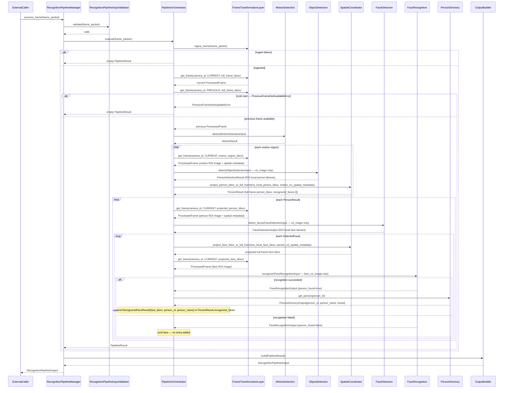
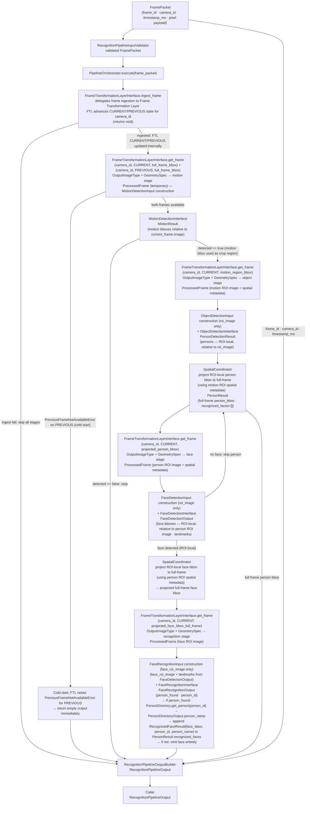

# RecognitionPipelineManager Module Specification

## Shared Contract Types

The following types used by this module are defined in [shared_contracts.md](shared_contracts.md) and must not be duplicated here:

- `BoundingBox` — the single shared bounding-box type (§1). Note: `BoundingBox` can represent ROI-local or full-frame coordinates; the coordinate space must be explicitly stated at the usage site.
- `ResizePolicy` — the resize behavior enum (§2)
- `GeometrySpec` — the geometry transformation struct (§3)
- `OutputImageType` — the pixel representation enum (§4)
- `PipelineStageInputContract` — the stage initialization contract (§5)
- `Image` — the canonical shared public image struct; carries `data`, `width`, `height`, `color_format`, `layout`, `dtype`, and `value_range`; pixel format is described by `OutputImageType` (§6)
- `Point` — the pixel coordinate type; coordinate space must be stated by context (§7)
- `FaceLandmarks` — the canonical 5-point landmark struct; coordinate space must be stated by the owning field (§8)
- Coordinate-space terminology (`FULL_FRAME`, `ROI_LOCAL`, `CROP_LOCAL`) — see §9 for definitions and usage rules

---

## 1. Scope

### Purpose

RecognitionPipelineManager is responsible ONLY for orchestrating the internal recognition pipeline:

**Motion Detection → Object Detection → Face Detection → Face Recognition**

It receives a canonical `FramePacket`, orchestrates all interaction with the Frame Transformation Layer by controlling when frames are ingested and when processed frame data is requested for each pipeline stage, constructs the exact stage input contracts, executes the recognition pipeline in deterministic order, projects ROI-local bounding boxes produced by Object Detection and Face Detection back to full-frame coordinates via `SpatialCoordinator`, and returns a structured `RecognitionPipelineOutput` containing all detected persons with their recognized faces for the frame. Each `PersonResult` carries a list of recognized faces nested directly inside it; unrecognized faces are omitted from the output entirely.

RecognitionPipelineManager exposes a single synchronous per-frame API. It receives a `FramePacket` and orchestrates the recognition pipeline for that frame.

RecognitionPipelineManager orchestrates all interaction with the Frame Transformation Layer. It controls when frames are ingested and when processed frame data is requested for each pipeline stage. The Frame Transformation Layer is responsible for internal frame storage and processing, including maintaining the per-camera temporal frame state (CURRENT and PREVIOUS slots). RecognitionPipelineManager does not access or manage the Frame Transformation Layer's internal implementation.

The Frame Transformation Layer owns per-camera temporal frame state. RecognitionPipelineManager only selects `CURRENT` or `PREVIOUS` when requesting processed frames via `FrameTemporalSelector`. RecognitionPipelineManager does not store or track frame references across invocations.

RecognitionPipelineManager is NOT responsible for:
- frame ingestion
- transport
- gRPC
- camera connections
- external services
- system-level threading
- lifecycle management outside the pipeline

### In Scope

- Validating the incoming `FramePacket`
- Ingesting every received `FramePacket` into the Frame Transformation Layer before any pipeline stage executes
- Orchestrating all interaction with the Frame Transformation Layer — controlling when frames are ingested and when processed frame data is retrieved — without accessing or managing its internal implementation
- Executing the pipeline stages in the defined deterministic order: motion detection → object detection → face detection → face recognition
- Applying routing gate decisions at each pipeline stage boundary
- Applying per-frame ROI guardrails before downstream fan-out (`max_motion_rois_per_frame`, `max_person_rois_per_frame`, `max_face_rois_per_frame`)
- Requesting processed full-frame and ROI data from the Frame Transformation Layer at each pipeline stage using `FrameTemporalSelector` to select CURRENT or PREVIOUS
- Using the returned processed frames to construct the exact stage input contracts: `MotionDetectionInput`, `ObjectDetectionInput`, `FaceDetectionInput`, `FaceRecognitionInput`
- Projecting person detection bounding boxes from ROI-local coordinates to full-frame coordinates via `SpatialCoordinator`
- Assembling a structured `RecognitionPipelineOutput` from all projected person and face results
- Capturing per-frame orchestration metrics for observability (`total_ftl_calls_per_frame`, stage call counts, and ROI request counters)
- Ensuring that execution of one camera's pipeline does not block execution of another camera's pipeline

### Out of Scope

The RecognitionPipelineManager Module does NOT:

- Perform motion detection, object detection, face detection, or face recognition — handled outside this module
- Perform any image preprocessing (color conversion, resize, normalization, layout conversion, dtype conversion, cropping) — all frame preparation is delegated to the Frame Transformation Layer
- Perform frame ingestion, transport, or management
- Handle gRPC, camera connections, or external services
- Manage system-level threading or lifecycle outside the pipeline
- Decode or access raw pixel data within the received `FramePacket`
- Store image bytes, full-frame `Image`, or `ProcessedFrame`- Own or manage internal storage of the Frame Transformation Layer
- Store or track `FrameReference` values per camera across invocations — per-camera temporal frame state is owned exclusively by the Frame Transformation Layer
- Implement model inference, embedding extraction, or similarity matching — handled outside this module
- Manage face identity enrollment or gallery updates — handled outside this module
- Access the filesystem after initialization
- Process more than one `FramePacket` per invocation
- Expose raw detection scores, embeddings, landmarks, or intermediate bounding boxes in `RecognitionPipelineOutput`
- Create, own, stop, sleep, wake, or schedule execution threads — thread ownership and lifecycle are entirely outside this module
- Pull frames or access frame sources of any kind
- Know about threads, scheduling, ingestion, transport, camera connections, or external services
- Know who the caller is — the external execution model is outside this module

---

## 2. Input

### 2.1 Input Responsibility Boundary

The module receives a `FramePacket` directly via `process_frame`. The caller supplies a complete `FramePacket`. `RecognitionPipelineManager` does not know who the caller is — the caller may be any external runtime component, test harness, or scheduler. `RecognitionPipelineManager` does not know or care how the `FramePacket` was produced — its origin is outside this module.

Only pipeline orchestration and coordinate projection are performed inside this module. No frame references, pixel data, or image objects are stored across invocations — per-camera temporal frame state is owned exclusively by the Frame Transformation Layer.

### 2.2 Input Structure

`process_frame` receives a `FramePacket` directly. No wrapper struct is used:

```text
process_frame(frame_packet: FramePacket) -> RecognitionPipelineOutput
```

`frame_id`, `camera_id`, and `timestamp_ms` are extracted from `frame_packet` internally for traceability. No pixel data is accessed by `RecognitionPipelineManager` directly — pixel access is delegated exclusively to the Frame Transformation Layer.

### 2.3 Input Contract

The `FramePacket` passed to `process_frame` must satisfy the following before any pipeline stage executes:

- `frame_packet` must be non-null
- `frame_packet.frame_id` must be non-empty
- `frame_packet.camera_id` must be present and non-empty
- `frame_packet.timestamp_ms` must be present

### 2.4 Validation Rules

`RecognitionPipelineInputValidator` must verify:

- `frame_packet` must be non-null
- `frame_packet.frame_id` must be non-empty
- `frame_packet.camera_id` must exist and be non-empty
- `frame_packet.timestamp_ms` must exist

### 2.5 Input Semantics

- `frame_packet` — the canonical frame container; it is the sole input to the pipeline; all frame data, pixel payload, and metadata are carried within it
- `frame_packet.frame_id` — unique identifier for the frame; extracted internally and preserved unchanged for traceability throughout the pipeline
- `frame_packet.camera_id` — identifies the source camera; extracted internally and passed to all Frame Transformation Layer operations as the `camera_id` parameter
- `frame_packet.timestamp_ms` — capture timestamp in milliseconds; extracted internally and preserved unchanged for traceability throughout the pipeline

---

## 3. Output

### 3.1 Output Structure

`BoundingBox` is defined in [shared_contracts.md §1](shared_contracts.md).

```text
struct RecognizedFaceResult {
    BoundingBox face_bbox;
    string      person_id;
    string      person_name;
}

struct PersonResult {
    BoundingBox                   person_bbox;
    vector<RecognizedFaceResult>  recognized_faces;
}

struct RecognitionPipelineOutput {
    string               frame_id;
    string               camera_id;
    uint64               timestamp_ms;
    vector<PersonResult> persons;
}
```

### 3.2 Output Semantics

- `frame_id` — copied unchanged from `frame_packet.frame_id` for traceability
- `camera_id` — copied unchanged from `frame_packet.camera_id` for traceability
- `timestamp_ms` — copied unchanged from `frame_packet.timestamp_ms` for traceability
- `persons` — set of all detected persons in the frame; may be empty; each entry represents one detected person with their bounding box and any recognized faces
- `PersonResult.person_bbox` — full-frame bounding box of the detected person; coordinates are expressed relative to the full input frame with origin at the top-left corner
- `PersonResult.recognized_faces` — all successfully recognized faces belonging to this person; may be empty when no faces were detected for this person or when all detected faces failed recognition; only recognized faces are present — unrecognized faces are omitted entirely
- `RecognizedFaceResult.face_bbox` — full-frame bounding box of the recognized face; coordinates are expressed relative to the full input frame with origin at the top-left corner
- `RecognizedFaceResult.person_id` — the unique stable internal identifier of the recognized identity
- `RecognizedFaceResult.person_name` — the human-readable display name of the recognized identity

### 3.3 Output Constraints

The output must NOT expose:

- Detection confidence scores or similarity scores from any pipeline stage
- Face embeddings or feature vectors
- Facial landmarks or geometric alignment data
- ROI-local bounding boxes or intermediate-stage bounding boxes not projected to full-frame coordinates
- Motion region bounding boxes or intermediate motion detection results
- Routing decisions, skip flags, or pipeline gate outcomes
- Raw pixel data or any intermediate image representation
- Unrecognized faces — if face detection succeeds but recognition fails, no face entry is added to `recognized_faces`

All pipeline-internal data, intermediate coordinates, and detection artifacts remain strictly internal. The only externally visible results are full-frame bounding boxes, recognized identity identifiers, recognized identity display names, and traceability metadata. All bounding boxes in `RecognitionPipelineOutput` are guaranteed to be in full-frame coordinates.

---

## 4. Public API

```text
RecognitionPipelineOutput process_frame(frame_packet: FramePacket)
dict get_last_frame_metrics()
```

- The caller supplies a complete `FramePacket`.
- `RecognitionPipelineManager` processes exactly one `FramePacket` per invocation.
- `get_last_frame_metrics()` returns instrumentation counters for the most recent invocation on this manager instance.
- `RecognitionPipelineManager` does not know who the caller is. The caller may be any external runtime component, test harness, or scheduler, but this module must not name or depend on it.
- No batching is allowed. One `FramePacket` per invocation.
- The API must remain stable regardless of which pipeline stage implementations are configured. No threshold, image type, geometry spec, or configuration parameter is a parameter of this method — all such values are immutable internal configuration state loaded at initialization.

---

## 5. Non-Functional Requirements

- **Single frame per invocation** — one `FramePacket` per call; the module must not accept batched input
- **No ingestion responsibility** — `RecognitionPipelineManager` does not own frame transport, camera connections, or ingestion logic
- **RecognitionPipelineManager does not pull frames** — `RecognitionPipelineManager` never accesses frame sources of any kind; all frames are supplied by the external caller
- **No image storage** — `RecognitionPipelineManager` does not store image bytes, full-frame `Image` structs, or `ProcessedFrame`; frame storage is managed exclusively by the Frame Transformation Layer
- **Image data ownership contract** — `RecognitionPipelineManager` and downstream stages treat `ProcessedFrame.image.data` buffers as read-only; mutation is forbidden by contract, and callers must not rely on whether FTL returned copies or references
- **No frame reference storage** — `RecognitionPipelineManager` does not store or track `FrameReference` values across invocations; per-camera temporal frame state (CURRENT and PREVIOUS slots) is owned exclusively by the Frame Transformation Layer
- **Frame Transformation Layer manages per-camera temporal state** — the Frame Transformation Layer maintains CURRENT and PREVIOUS frame slots independently per `camera_id`; after each successful `ingest_frame`, the FTL advances its internal temporal state; `RecognitionPipelineManager` only selects CURRENT or PREVIOUS via `FrameTemporalSelector` when requesting processed frames
- **Frame Transformation Layer manages frame storage** — the Frame Transformation Layer manages frame storage internally; `RecognitionPipelineManager` delegates all frame ingestion and retrieval to it via the public interface
- **No thread ownership** — `RecognitionPipelineManager` does not create, own, stop, sleep, wake, or schedule execution threads; the execution model is entirely external to this module
- **Parallel invocations targeting different `camera_id` values are safe** — parallel `process_frame` calls targeting **different** `camera_id` values are safe when the `FrameTransformationLayerInterface` implementation is concurrency-safe, because per-camera temporal state is isolated inside the FTL by `camera_id`; `RecognitionPipelineManager` owns one `PipelineOrchestrator` instance and holds no per-camera mutable state
- **Same-camera sequential ordering** — frames from the same `camera_id` must be processed sequentially in FIFO order; this must be enforced externally by the caller; `RecognitionPipelineManager` does not reorder frames
- **`FrameTransformationLayerInterface` concurrency** — its implementation must be safe for concurrent `ingest_frame` and `get_frame` calls if multiple cameras are processed in parallel; `RecognitionPipelineManager` only invokes its public interface and does not own its storage
- **Real-time capable** — suitable for per-frame online processing
- **Deterministic** — same `FramePacket` + same configuration + same Frame Transformation Layer state produce the same `RecognitionPipelineOutput`
- **Bounded fan-out** — ROI guardrails cap downstream OD/FD/FR fan-out per frame
- **Model-agnostic API** — the public output schema is independent of the underlying pipeline stage implementations
- **Strict isolation** — no internal AI data (detection scores, embeddings, raw tensors, landmarks) escapes the public API
- **All outputs are full-frame coordinates** — no ROI-local coordinates appear in `RecognitionPipelineOutput`
- **Per-camera execution isolation** — per-camera temporal frame state is isolated inside the Frame Transformation Layer by `camera_id`; processing of one `camera_id` must not corrupt the temporal state of another `camera_id`
- **RecognitionPipelineManager is only invoked by an external caller** — the external execution model is outside this module; `RecognitionPipelineManager` does not know whether the caller is a scheduler, test harness, or any other component

---

## 6. Processing Engine

### 6.1 Engine Abstraction Interfaces

`RecognitionPipelineManager` depends on four pipeline stage interfaces, one per processing stage, and a required internal frame-preparation dependency represented by `FrameTransformationLayerInterface`.

Each pipeline stage interface must expose its required input contract. The input contract specifies the image format and geometry that the stage expects when processed frame data is retrieved from the Frame Transformation Layer:

`PipelineStageInputContract` is defined in [shared_contracts.md §5](shared_contracts.md).

Each stage interface must provide:

```text
get_input_contract() -> PipelineStageInputContract
```

`FrameTemporalSelector` is an enum used by `PipelineOrchestrator` to select which temporal slot to retrieve from the Frame Transformation Layer. The FTL resolves the actual stored frame internally based on the `camera_id` and the selector:

```text
enum FrameTemporalSelector {
    CURRENT,   // the latest successfully ingested frame for the given camera_id
    PREVIOUS   // the frame that was current before the latest ingest for the given camera_id
}
```

```text
interface MotionDetectionInterface {
    get_input_contract() -> PipelineStageInputContract
    detect(input: MotionDetectionInput) -> MotionResult
}

interface ObjectDetectionInterface {
    get_input_contract() -> PipelineStageInputContract
    detect(input: ObjectDetectionInput) -> PersonDetectionResult
}

interface FaceDetectionInterface {
    get_input_contract() -> PipelineStageInputContract
    detect_faces(input: FaceDetectionInput) -> FaceDetectionOutput
}

interface FaceRecognitionInterface {
    get_input_contract() -> PipelineStageInputContract
    recognize(input: FaceRecognitionInput) -> FaceRecognitionOutput
}

interface FrameTransformationLayerInterface {
    ingest_frame(frame_packet: FramePacket) -> void
    get_frame(
        camera_id:         string,
        temporal_selector: FrameTemporalSelector,
        region_bbox:       BoundingBox,
        output_type:       OutputImageType,
        geometry_spec:     GeometrySpec
    ) -> ProcessedFrame
}
```

`FramePacket` and `ProcessedFrame` are types defined by the Frame Transformation Layer. `FrameTemporalSelector` is a shared public enum known to both the caller and the FTL. `RecognitionPipelineManager` does not construct `FrameReference` values and does not store them — frame identity resolution by `camera_id` and temporal slot is the exclusive responsibility of the Frame Transformation Layer.

`OutputImageType` specifies the color format, layout, dtype, and value range required by the receiving pipeline stage. `GeometrySpec` specifies size and crop geometry. Both are stage-defined — each stage exposes its required values via `get_input_contract()`. `RecognitionPipelineManager` does not define or hardcode image formats or geometry. Instead, during initialization, it queries each configured pipeline stage interface for its input contract and uses these contracts when requesting processed frames from the Frame Transformation Layer. `FrameTransformationLayerInterface.get_frame` returns a `ProcessedFrame` based on the `OutputImageType` and `GeometrySpec` provided by the pipeline stage input contract.

If multiple cameras are processed concurrently, the `FrameTransformationLayerInterface` implementation must safely support concurrent `ingest_frame` and `get_frame` calls. `RecognitionPipelineManager` does not own the Frame Transformation Layer storage; it only invokes the public interface.

### 6.2 Replaceability

`RecognitionPipelineManager` depends on `MotionDetectionInterface`, `ObjectDetectionInterface`, `FaceDetectionInterface`, `FaceRecognitionInterface`, and `FrameTransformationLayerInterface` — not on their concrete implementations directly. Any compliant implementation of any interface may be substituted without changing the public API or calling code. Replacing any pipeline stage implementation or the Frame Transformation Layer implementation does NOT affect the public API.

---

## 7. Acceptance / Filtering Logic

Pipeline routing is gate-based and exclusively managed by `PipelineOrchestrator`.

- `MotionDetectionInterface` returns a `MotionResult` containing a `detected` flag and, when `detected = true`, bounding boxes of motion regions in the frame. If `detected = false`, no motion regions are returned.
- `PipelineOrchestrator` applies the motion gate: if `MotionResult.detected = false`, no further pipeline stages are invoked and an empty `PipelineResult` is returned immediately.
- `ObjectDetectionInterface` returns a `PersonDetectionResult` containing zero or more person bounding boxes in ROI-local coordinates relative to the motion-region ROI image. Object Detection runs only for motion-region crops — it never receives the full frame.
- `PipelineOrchestrator` applies the person gate: if no person bounding boxes are returned across all motion-region crops, face detection and recognition are not invoked and an empty `PipelineResult` is returned.
- `FaceDetectionInterface` returns a `FaceDetectionOutput` per person-region crop. Face Detection runs only for projected full-frame person bboxes — it receives only the person ROI image, never the full frame. If no face is detected for a given person crop (`detections` is empty), `PipelineOrchestrator` skips face recognition for that person and continues to the next.
- No detection scores, similarity scores, or internal routing flags are returned to the caller.
- `PipelineOrchestrator` is the only component inside the module that makes routing gate decisions.

---

## 8. Internal Pipeline

### 8.1 RecognitionPipelineManager

`RecognitionPipelineManager` is the orchestration layer only. It owns no detection, recognition, or projection logic.

It maintains:

```text
PipelineOrchestrator  orchestrator
```

One `PipelineOrchestrator` instance, injected or created during initialization and shared across all invocations. `RecognitionPipelineManager` holds no per-camera mutable state — per-camera temporal frame state is owned exclusively by the Frame Transformation Layer.

Its responsibilities are:

- **`process_frame(frame_packet)`**: validate the `frame_packet` via `RecognitionPipelineInputValidator`; call `orchestrator.execute(frame_packet)` and return its output to the caller

`RecognitionPipelineManager` must not run pipeline stages directly, manage threads, pull frames, or perform frame ingestion.

During initialization, `RecognitionPipelineManager` is responsible for loading the pipeline configuration, querying each configured pipeline stage interface for its `PipelineStageInputContract`, and wiring the `PipelineOrchestrator` with its required component dependencies including the configured pipeline stage implementations, their stage-defined input contracts, and the required Frame Transformation Layer implementation.

`RecognitionPipelineManager` must not embed validation logic, detection logic, projection logic, or frame retrieval logic directly. Each of those responsibilities belongs to a dedicated internal component.

### 8.2 RecognitionPipelineInputValidator

`RecognitionPipelineInputValidator` is responsible only for input validation. It validates the `FramePacket` and its required fields before processing begins.

Its responsibilities are:

- verify `frame_packet` is non-null
- verify `frame_packet.frame_id` is non-empty
- verify `frame_packet.camera_id` is present and non-empty
- verify `frame_packet.timestamp_ms` is present

`RecognitionPipelineInputValidator` must not ingest frames, invoke pipeline stages, or make routing decisions.

### 8.3 PipelineOrchestrator

`PipelineOrchestrator` controls the execution flow of the four-stage detection and recognition pipeline for one frame.

Its responsibilities are:

- receive a `FramePacket` from `RecognitionPipelineManager`
- delegate frame ingestion to the Frame Transformation Layer via `FrameTransformationLayerInterface.ingest_frame(frame_packet)` (returns void); if `ingest_frame` fails, return an empty `PipelineResult` immediately without executing any downstream pipeline stage
- request processed frame data from the Frame Transformation Layer using `FrameTransformationLayerInterface.get_frame(camera_id, temporal_selector, region_bbox, output_type, geometry_spec)` for each pipeline stage; the `camera_id` is extracted from `frame_packet.camera_id`; the `FrameTemporalSelector` is `CURRENT` for all post-motion stages and `CURRENT`/`PREVIOUS` for motion detection; the `OutputImageType` and `GeometrySpec` parameters are obtained from the corresponding pipeline stage input contract (`stage_input_contract.output_image_type` and `stage_input_contract.geometry_spec`); the number of `get_frame` calls is dynamic and depends on the number of motion regions, detected persons, and detected faces; there are always up to two full-frame `get_frame` calls for Motion Detection when PREVIOUS exists (current frame and previous frame); all subsequent `get_frame` calls are per detected region or result:
  1. `get_frame(camera_id, CURRENT, full_frame_bbox, motion_contract.output_image_type, motion_contract.geometry_spec)` — current frame for motion detection
  2. `get_frame(camera_id, PREVIOUS, full_frame_bbox, motion_contract.output_image_type, motion_contract.geometry_spec)` — previous frame for motion detection; if the FTL raises `PreviousFrameNotAvailableError` for PREVIOUS, this is a cold start — return empty `PipelineResult` immediately
  3. `get_frame(camera_id, CURRENT, motion_region_bbox, object_detection_contract.output_image_type, object_detection_contract.geometry_spec)` — per motion-region crop for object detection (once per motion region)
  4. `get_frame(camera_id, CURRENT, projected_person_bbox, face_detection_contract.output_image_type, face_detection_contract.geometry_spec)` — per person-region crop for face detection (once per detected person); `projected_person_bbox` is the full-frame person bbox produced by `SpatialCoordinator` after Object Detection; Face Detection receives only this ROI image
  5. `get_frame(camera_id, CURRENT, projected_face_bbox, face_recognition_contract.output_image_type, face_recognition_contract.geometry_spec)` — per face-region crop for face recognition (once per detected face); `projected_face_bbox` is the full-frame face bbox produced by `SpatialCoordinator` after Face Detection; Face Recognition receives only this ROI image
- construct the exact stage input contract expected by each downstream pipeline stage before invoking it
- invoke each pipeline stage interface in the defined order
- apply routing gate decisions at each stage boundary
- invoke `SpatialCoordinator.project_bbox_to_full_frame` after object detection for each ROI-local person bbox, using the motion ROI spatial metadata, to produce a projected full-frame person bbox; create a `PersonResult` with `person_bbox` set to the projected full-frame coordinates and `recognized_faces = []`
- invoke `SpatialCoordinator.project_bbox_to_full_frame` after face detection for each ROI-local face bbox, using the person ROI spatial metadata, to produce a projected full-frame face bbox; use this projected face bbox to request the face ROI image from the FTL for face recognition
- accumulate all projected `PersonResult` entries into `PipelineResult`
- for each detected face, if recognition succeeds, append a `RecognizedFaceResult` into the parent person's `recognized_faces`; if recognition fails, omit the face entirely
- return `PipelineResult` to `RecognitionPipelineManager`

`PipelineOrchestrator` must not perform coordinate arithmetic directly, perform image preprocessing, or modify pixel data.

### 8.3.1 Spatial Projection Contract (Mandatory)

`PipelineOrchestrator` and `SpatialCoordinator` must treat `ProcessedFrame.spatial_transform` as mandatory spatial metadata on every `get_frame` response.

Rules:

- For `ResizePolicy.NONE`, projection to full-frame is identity-plus-offset:
    - `scale_x = 1`, `scale_y = 1`, `pad_left = 0`, `pad_top = 0`
    - Add `source_bbox_full_frame.x`/`source_bbox_full_frame.y` after local-to-crop conversion.
- For `ResizePolicy.LETTERBOX`, inverse projection must remove padding first, then divide by scale.

Mandatory inverse projection steps for an output-local point `(ox, oy)`:

```text
1. Remove padding:   cx = ox - pad_left
                                         cy = oy - pad_top
2. Undo scale:       rx = cx / scale_x
                                         ry = cy / scale_y
3. Add crop origin:  fx = rx + source_bbox_full_frame.x
                                         fy = ry + source_bbox_full_frame.y
```

`fx, fy` are full-frame coordinates.

Integration safety rules:

- RPM must never project boxes or landmarks from transformed output coordinates back to full-frame coordinates without `spatial_transform` when geometry is non-identity.
- If `spatial_transform` is missing or invalid for non-identity geometry, RPM must treat this as an integration error and fail fast for that frame.

`PipelineOrchestrator` must not:

- store image bytes, full-frame `Image` structs, or `ProcessedFrame`
- store or track `FrameReference` values — the FTL resolves frames by `camera_id` and `FrameTemporalSelector`
- maintain per-camera maps or per-camera `previous_frame_ref` fields
- create or manage execution threads
- pull frames from any source
- assign or track `person_index` values — persons are linked to their recognized faces by direct nesting, not by index

### 8.4 Temporal Frame State

Per-camera temporal frame state is owned exclusively by the Frame Transformation Layer. `RecognitionPipelineManager` and `PipelineOrchestrator` do not store or track frame references across invocations.

How temporal state works:

- The Frame Transformation Layer maintains two temporal slots per `camera_id`: **CURRENT** and **PREVIOUS**.
- After a successful `ingest_frame(frame_packet)`, the FTL advances internal state for `frame_packet.camera_id`: the previous CURRENT frame becomes PREVIOUS, and the newly ingested frame becomes CURRENT.
- `PipelineOrchestrator` selects which temporal slot to use by passing `FrameTemporalSelector.CURRENT` or `FrameTemporalSelector.PREVIOUS` to `FrameTransformationLayerInterface.get_frame`.
- The FTL resolves the actual stored frame from the selected temporal slot for the given `camera_id` and returns a `ProcessedFrame`.

Cold start:

- On the very first `ingest_frame` for a `camera_id`, no PREVIOUS frame exists in the FTL.
- When `PipelineOrchestrator` subsequently calls `get_frame(camera_id, PREVIOUS, …)`, the FTL raises `PreviousFrameNotAvailableError`.
- `PipelineOrchestrator` treats `PreviousFrameNotAvailableError` on a PREVIOUS request as a cold start and returns an empty `PipelineResult` immediately. Cold start is normal operation; no error is raised to the caller.

Rules:

- `RecognitionPipelineManager` stores no frame references — no `previous_frame_ref`, no `current_ref`, no `FrameReference`
- `PipelineOrchestrator` stores no frame references across invocations
- Per-camera temporal isolation is guaranteed by the FTL: CURRENT and PREVIOUS are independent slots per `camera_id`
- A failed `ingest_frame` does not advance the FTL temporal state; CURRENT and PREVIOUS remain unchanged for that `camera_id`

Per-frame lifecycle:

1. Call `FrameTransformationLayerInterface.ingest_frame(frame_packet)` — if it fails, return empty `PipelineResult` immediately; FTL temporal state is not advanced
2. Call `get_frame(camera_id, PREVIOUS, …)` for motion detection — if FTL raises `PreviousFrameNotAvailableError`, this is a cold start; return empty `PipelineResult` immediately (see §8.5.1)
3. Call `get_frame(camera_id, CURRENT, …)` for motion detection and all subsequent stages

### 8.5 Stage Input Construction

`PipelineOrchestrator` is responsible for (1) requesting the correct processed data from the Frame Transformation Layer using the `OutputImageType` and `GeometrySpec` obtained from each stage's `PipelineStageInputContract`, and (2) constructing the exact stage input contract expected by each downstream pipeline stage. The Frame Transformation Layer returns processed frame data only — it does NOT construct pipeline stage inputs.

#### 8.5.1 Motion Detection Stage Input Construction

`PipelineOrchestrator` calls:

```text
current_processed  = FrameTransformationLayerInterface.get_frame(camera_id, CURRENT,  full_frame_bbox, motion_contract.output_image_type, motion_contract.geometry_spec)
previous_processed = FrameTransformationLayerInterface.get_frame(camera_id, PREVIOUS, full_frame_bbox, motion_contract.output_image_type, motion_contract.geometry_spec)
```

If the FTL raises `PreviousFrameNotAvailableError` when requesting PREVIOUS (cold start):

- Return an empty `PipelineResult` immediately
- Cold start is normal operation; no error is raised
- Cold start must not continue to Motion Detection

Otherwise, `PipelineOrchestrator` constructs:

```text
MotionDetectionInput {
    current_frame:  MotionInputFrame {
                        frame_id:     frame_packet.frame_id,
                        camera_id:    frame_packet.camera_id,
                        timestamp_ms: current_processed.timestamp_ms,
                        image:        current_processed.image
                    },
    previous_frame: MotionInputFrame {
                        frame_id:     previous_processed.frame_id,
                        camera_id:    frame_packet.camera_id,
                        timestamp_ms: previous_processed.timestamp_ms,
                        image:        previous_processed.image
                    }
}
```

`PipelineOrchestrator` retrieves `ProcessedFrame` objects from the FTL and constructs full `MotionInputFrame` objects for both `current_frame` and `previous_frame`. `MotionDetectionInput` must not receive bare `Image` objects — each field must be a complete `MotionInputFrame` carrying `frame_id`, `camera_id`, `timestamp_ms`, and `image`.

> **Note.** `MotionInputFrame` is the input container type used by the Motion Detection module. It is distinct from the FTL-level `FramePacket` (which carries raw `image_bytes` as bytes and is the entry point into the FTL). `MotionInputFrame` carries a fully prepared shared `Image` struct.

> **Frame traceability.** `previous_processed.frame_id` is supplied by the FTL through `ProcessedFrame.frame_id`, which the FTL copies unchanged from the source `FramePacket.frame_id` during ingest and preserves through all crop, resize, letterbox, and pixel-format conversion operations. RPM does not synthesize or modify `frame_id` for either frame. The previous frame's original source identity is fully preserved through the FTL `FrameStore`.

and invokes `MotionDetectionInterface.detect(MotionDetectionInput)`.

`MotionResult.bboxes` are relative to `MotionDetectionInput.current_frame.image`. Because `RecognitionPipelineManager` supplies the full current frame to Motion Detection, the returned motion bboxes are used as crop regions over the full current frame. The returned bboxes are relative to the image supplied to Motion Detection — not implicitly in any other coordinate space.

#### 8.5.2 Object Detection Stage Input Construction

For each `motion_region_bbox` in `MotionResult.bboxes`, `PipelineOrchestrator` calls:

```text
FrameTransformationLayerInterface.get_frame(camera_id, CURRENT, motion_region_bbox, object_detection_contract.output_image_type, object_detection_contract.geometry_spec) -> ProcessedFrame
```

`PipelineOrchestrator` then constructs `ObjectDetectionInput` from `ProcessedFrame.image` and the preserved frame metadata from `frame_packet`:

```text
ObjectDetectionInput {
    frame_id       = frame_packet.frame_id,
    camera_id      = frame_packet.camera_id,
    timestamp_ms   = frame_packet.timestamp_ms,
    roi_image      = ProcessedFrame.image,
    roi_bbox_frame = motion_region_bbox
}
```

`roi_bbox_frame` carries the ROI position in full-frame coordinates — it is the motion-region bbox that was passed to the FTL to produce this `ProcessedFrame`. Image pixel dimensions are owned exclusively by `roi_image.width` and `roi_image.height` inside the `Image` struct; no standalone `width` or `height` fields exist on `ObjectDetectionInput`. The motion-region crop defines a new ROI-local coordinate space: the ROI image is the primary input Object Detection needs. The ROI image is already prepared by the Frame Transformation Layer using the stage-defined input contract (`object_detection_contract.output_image_type` and `object_detection_contract.geometry_spec`). The Object Detection stage does not call the Frame Transformation Layer. `PipelineOrchestrator` invokes `ObjectDetectionInterface.detect(ObjectDetectionInput)` → `PersonDetectionResult`.

`PersonDetectionResult.persons` are ROI-local coordinates relative to `ObjectDetectionInput.roi_image`. They must never be used as full-frame coordinates or exposed publicly. `PipelineOrchestrator` passes each ROI-local person bbox to `SpatialCoordinator.project_bbox_to_full_frame` together with the motion ROI spatial metadata (`ProcessedFrame.source_bbox_full_frame`, `ProcessedFrame.spatial_transform`) to obtain the projected full-frame person bbox.

#### 8.5.3 Face Detection Stage Input Construction

For each projected `full_frame_person_bbox` in accumulated `PipelineResult.persons`, `PipelineOrchestrator` calls:

```text
FrameTransformationLayerInterface.get_frame(camera_id, CURRENT, full_frame_person_bbox, face_detection_contract.output_image_type, face_detection_contract.geometry_spec) -> ProcessedFrame
```

`PipelineOrchestrator` then constructs:

```text
FaceDetectionInput {
    frame_id:     frame_packet.frame_id,
    camera_id:    frame_packet.camera_id,
    timestamp_ms: frame_packet.timestamp_ms,
    roi_image:    ProcessedFrame.image
}
```

`FaceDetectionInput` does not carry `roi_bbox_frame`, spatial metadata, or ROI coordinates — those remain internal pipeline state managed by the FTL and `PipelineOrchestrator`. The person-region crop defines another ROI-local coordinate space: the ROI image is the only input Face Detection needs. `PipelineOrchestrator` invokes `FaceDetectionInterface.detect_faces(FaceDetectionInput)`.

`FaceDetectionOutput.detections` carries zero or more `DetectedFace` entries; each `DetectedFace.face_bbox` is in ROI-local coordinates relative to the person ROI image. These coordinates must never be used as full-frame coordinates or exposed publicly. `PipelineOrchestrator` passes each ROI-local face bbox to `SpatialCoordinator.project_bbox_to_full_frame` together with the person ROI spatial metadata (`ProcessedFrame.source_bbox_full_frame`, `ProcessedFrame.spatial_transform`) to obtain the projected full-frame face bbox. The FTL then creates the face ROI image from the projected full-frame face bbox.

#### 8.5.4 Face Recognition Stage Input Construction

For each accepted face in `FaceDetectionOutput.detections`, `PipelineOrchestrator` first obtains the projected full-frame face bbox by calling `SpatialCoordinator.project_bbox_to_full_frame(roi_local_face_bbox, source_bbox_full_frame, spatial_transform)`. Before constructing `FaceRecognitionInput`, `PipelineOrchestrator` re-expresses `DetectedFace.landmarks` in face-crop-local coordinates by subtracting the face bbox origin from each landmark: for each landmark `lm`, `face_local_lm.x = lm.x - DetectedFace.face_bbox.x` and `face_local_lm.y = lm.y - DetectedFace.face_bbox.y`. `PipelineOrchestrator` then calls:

```text
FrameTransformationLayerInterface.get_frame(camera_id, CURRENT, projected_face_bbox, face_recognition_contract.output_image_type, face_recognition_contract.geometry_spec) -> ProcessedFrame
```

where `projected_face_bbox` is the full-frame face bbox produced by `SpatialCoordinator`. `PipelineOrchestrator` then constructs:

```text
FaceRecognitionInput {
    frame_id:       frame_packet.frame_id,
    camera_id:      frame_packet.camera_id,
    timestamp_ms:   frame_packet.timestamp_ms,
    face_roi_image: ProcessedFrame.image,
    landmarks:      face_crop_local_landmarks
}
```

and invokes `FaceRecognitionInterface.recognize(FaceRecognitionInput)`. Face Recognition receives only the face ROI image — it does not receive full-frame data, ROI bbox metadata, or spatial metadata. `landmarks` are the canonical 5-point `FaceLandmarks` re-expressed in face-crop-local coordinates (relative to `face_roi_image`, not the person ROI image). `FaceRecognitionOutput` returns only `person_found` and `person_id` — it does not carry human-readable display names; Face Recognition remains engine-agnostic and identity-only. If recognition succeeds (`person_found = true`), `PipelineOrchestrator` calls `PersonDirectory.get_person(person_id)` → `PersonDirectoryOutput` and uses `PersonDirectoryOutput.person_name` to enrich the result; if `PersonDirectoryOutput.found = false`, `person_name` is set to `"UNKNOWN"`. If `PersonDirectory.get_person()` raises an exception, `PipelineOrchestrator` catches it and uses deterministic UNKNOWN fallback (`person_id = "UNKNOWN"`, `person_name = "UNKNOWN"`, `found = false`); the face is still appended to `recognized_faces` — no exception propagates to the pipeline level. `PipelineOrchestrator` then appends `RecognizedFaceResult{face_bbox, person_id, person_name}` to the parent `PersonResult.recognized_faces`. If recognition fails (`person_found = false`), the face is omitted entirely.

### 8.6 SpatialCoordinator

`SpatialCoordinator` projects ROI-local coordinates produced by downstream ROI-based stages back to full-frame coordinates using FTL spatial metadata.

Its responsibilities are:

- project ROI-local Object Detection person bboxes to full-frame coordinates using motion ROI spatial metadata (`source_bbox_full_frame` and `spatial_transform`) returned by the Frame Transformation Layer
- project ROI-local Face Detection face bboxes to full-frame coordinates using person ROI spatial metadata (`source_bbox_full_frame` and `spatial_transform`) returned by the Frame Transformation Layer
- return the projected `BoundingBox` in full-frame coordinates

`SpatialCoordinator` is invoked after Object Detection (to project person bboxes using motion ROI spatial metadata) and after Face Detection (to project face bboxes using person ROI spatial metadata). `SpatialCoordinator` does NOT create ROI images — it only projects coordinates. `SpatialCoordinator` must not apply detection logic, make routing decisions, or modify any image data.

`SpatialCoordinator.project_bbox_to_full_frame(local_bbox, source_bbox_full_frame, spatial_transform)` must apply inverse geometry before adding source-crop offsets:

1. Remove geometry padding: `x_unpadded = local_x - spatial_transform.pad_left`, `y_unpadded = local_y - spatial_transform.pad_top`
2. Undo geometry scale: `x_crop = x_unpadded / spatial_transform.scale_x`, `y_crop = y_unpadded / spatial_transform.scale_y`, and the same for width/height
3. Translate into full-frame coordinates: `x_full = x_crop + source_bbox_full_frame.x`, `y_full = y_crop + source_bbox_full_frame.y`

For `ResizePolicy.NONE`, the inverse reduces to identity because `scale_x=scale_y=1.0` and `pad_left=pad_top=0`. For `ResizePolicy.LETTERBOX`, all three steps are mandatory.

### 8.7 RecognitionPipelineOutputBuilder

`RecognitionPipelineOutputBuilder` is responsible for constructing the final `RecognitionPipelineOutput` from projected pipeline results and preserved frame metadata.

Its responsibilities are:

- receive `frame_id`, `camera_id`, and `timestamp_ms` extracted from the `FramePacket`
- receive the `PipelineResult` containing all projected `PersonResult` records, each with their nested `recognized_faces`
- copy traceability metadata unchanged from input
- assemble and return the final `RecognitionPipelineOutput` containing only `persons`

`RecognitionPipelineOutputBuilder` must not invoke pipeline stages, apply projection logic, or make routing decisions.

### 8.8 PersonDirectory

`PersonDirectory` is responsible for resolving a recognized `person_id` into a `PersonRecord` containing the corresponding `person_name` for identity enrichment.

Its responsibilities are:

- load person metadata from a configured JSON file exactly once at initialization
- validate all loaded records: reject records with empty `person_id`, empty `person_name`, or the reserved key `"UNKNOWN"`
- build and maintain an in-memory map: `person_id → PersonRecord`
- respond to `get_person(person_id)` queries from `PipelineOrchestrator` at runtime
- return a canonical UNKNOWN output (`person_id = "UNKNOWN"`, `person_name = "UNKNOWN"`, `found = false`) when the `person_id` is unknown, empty, or equals `"UNKNOWN"`

`PersonDirectory` must not perform face recognition, load face embeddings, access the gallery, or be depended on by any pipeline stage implementation. `PersonDirectory` must not fail the pipeline due to a missing `person_id` — all unresolvable lookups return the canonical UNKNOWN output.

### 8.9 End-to-End Processing Flow

For one invocation of `process_frame`, the internal pipeline follows this order:

**validation → Frame Transformation Layer ingest → cold-start check → motion detection → object detection → person projection → face detection → face recognition → output construction**

1. External caller invokes `process_frame(frame_packet)`. `RecognitionPipelineManager` receives the `FramePacket` directly.
2. `RecognitionPipelineManager` calls `RecognitionPipelineInputValidator.validate(frame_packet)`.
3. `RecognitionPipelineManager` calls `orchestrator.execute(frame_packet)` → `PipelineResult`.
4. `PipelineOrchestrator` delegates frame ingestion to the Frame Transformation Layer via `FrameTransformationLayerInterface.ingest_frame(frame_packet)`. On success, the Frame Transformation Layer stores the frame and advances its internal per-camera CURRENT/PREVIOUS temporal state. If `ingest_frame` fails, return an empty `PipelineResult` immediately; no downstream pipeline stage is executed.
5. `PipelineOrchestrator` calls `FrameTransformationLayerInterface.get_frame(camera_id, CURRENT, full_frame_bbox, motion_contract.output_image_type, motion_contract.geometry_spec)` → `current_processed`.
6. `PipelineOrchestrator` calls `FrameTransformationLayerInterface.get_frame(camera_id, PREVIOUS, full_frame_bbox, motion_contract.output_image_type, motion_contract.geometry_spec)` → `previous_processed`. If the FTL raises `PreviousFrameNotAvailableError` (cold start — no PREVIOUS for this `camera_id` yet) → return empty `PipelineResult` immediately. Cold start does not proceed to Motion Detection.
7. `PipelineOrchestrator` constructs `MotionDetectionInput{current_frame, previous_frame}` and calls `MotionDetectionInterface.detect(MotionDetectionInput)` → `MotionResult`. If `detected == false` → return empty `PipelineResult`.
8. For each `motion_region_bbox` in `MotionResult.bboxes`: `PipelineOrchestrator` calls `FrameTransformationLayerInterface.get_frame(camera_id, CURRENT, motion_region_bbox, object_detection_contract.output_image_type, object_detection_contract.geometry_spec)` → `ProcessedFrame` (motion ROI image + spatial metadata). The motion-region crop defines a new ROI-local coordinate space. `PipelineOrchestrator` constructs `ObjectDetectionInput{frame_id, camera_id, timestamp_ms, roi_image=ProcessedFrame.image, roi_bbox_frame=motion_region_bbox}` — Object Detection receives the ROI image (which carries its own width and height inside the `Image` struct) and the ROI position in full-frame coordinates. `PipelineOrchestrator` calls `ObjectDetectionInterface.detect(ObjectDetectionInput)` → `PersonDetectionResult`. `PersonDetectionResult.persons` are ROI-local coordinates relative to `ObjectDetectionInput.roi_image`.
9. For each ROI-local `person_bbox` in `PersonDetectionResult.persons`: `PipelineOrchestrator` calls `SpatialCoordinator.project_bbox_to_full_frame(person_bbox, ProcessedFrame.source_bbox_full_frame, ProcessedFrame.spatial_transform)` using the motion ROI spatial metadata → projected `BoundingBox` (full-frame person bbox); creates `PersonResult{person_bbox, recognized_faces=[]}` and accumulates it into `PipelineResult.persons`.
10. If `PipelineResult.persons` is empty → return `PipelineResult` (empty persons, empty faces).
11. For each `PersonResult` in `PipelineResult.persons`: `PipelineOrchestrator` calls `FrameTransformationLayerInterface.get_frame(camera_id, CURRENT, PersonResult.person_bbox, face_detection_contract.output_image_type, face_detection_contract.geometry_spec)` → `ProcessedFrame` (person ROI image + spatial metadata). The person-region crop defines another ROI-local coordinate space. `PipelineOrchestrator` constructs `FaceDetectionInput{frame_id, camera_id, timestamp_ms, roi_image=ProcessedFrame.image}` — Face Detection receives only the ROI image, never the full frame, `roi_bbox_frame`, or spatial metadata. `PipelineOrchestrator` calls `FaceDetectionInterface.detect_faces(FaceDetectionInput)` → `FaceDetectionOutput`. If `FaceDetectionOutput.detections` is empty → skip this person; continue to next. `FaceDetectionOutput.detections` carries zero or more `DetectedFace` entries; each `DetectedFace.face_bbox` is in ROI-local coordinates relative to the person ROI image.
12. For each ROI-local `DetectedFace` in `FaceDetectionOutput.detections`: `PipelineOrchestrator` calls `SpatialCoordinator.project_bbox_to_full_frame(DetectedFace.face_bbox, ProcessedFrame.source_bbox_full_frame, ProcessedFrame.spatial_transform)` using the person ROI spatial metadata → projected full-frame face bbox. Before constructing `FaceRecognitionInput`, `PipelineOrchestrator` re-expresses `DetectedFace.landmarks` in face-crop-local coordinates by subtracting the face bbox origin: for each landmark `lm`, `face_local_lm.x = lm.x - DetectedFace.face_bbox.x` and `face_local_lm.y = lm.y - DetectedFace.face_bbox.y`. `PipelineOrchestrator` then calls `FrameTransformationLayerInterface.get_frame(camera_id, CURRENT, projected_face_bbox, face_recognition_contract.output_image_type, face_recognition_contract.geometry_spec)` → face ROI `ProcessedFrame`. `PipelineOrchestrator` constructs `FaceRecognitionInput{frame_id, camera_id, timestamp_ms, face_roi_image=ProcessedFrame.image, landmarks=face_crop_local_landmarks}`; calls `FaceRecognitionInterface.recognize(FaceRecognitionInput)` → `FaceRecognitionOutput`. Face Recognition receives only the face ROI image — no full-frame data, ROI bbox metadata, or spatial metadata. If recognition succeeds (`person_found = true`), `PipelineOrchestrator` calls `PersonDirectory.get_person(FaceRecognitionOutput.person_id)` → `PersonDirectoryOutput`; uses `PersonDirectoryOutput.person_name` for the enriched result (if `PersonDirectoryOutput.found = false`, `person_name = "UNKNOWN"`); if `PersonDirectory.get_person()` raises an exception, `PipelineOrchestrator` catches it and uses deterministic UNKNOWN fallback (`person_id = "UNKNOWN"`, `person_name = "UNKNOWN"`, `found = false`) — the face is still appended and no exception propagates; then appends `RecognizedFaceResult{face_bbox=projected_face_bbox, person_id, person_name}` into the current `PersonResult.recognized_faces`. If recognition fails (`person_found = false`), the face is omitted entirely — no entry is added.
13. `SpatialCoordinator` is invoked after Object Detection (using motion ROI spatial metadata to project person bboxes) and after Face Detection (using person ROI spatial metadata to project face bboxes). No ROI-local coordinates appear in `PipelineResult` or `RecognitionPipelineOutput`.
14. `PipelineOrchestrator` returns `PipelineResult` to `RecognitionPipelineManager`.
15. `RecognitionPipelineManager` calls `RecognitionPipelineOutputBuilder.build(frame_id, camera_id, timestamp_ms, PipelineResult)` → `RecognitionPipelineOutput`.
16. `RecognitionPipelineManager` returns `RecognitionPipelineOutput` to the caller.

All intermediate data (Frame Transformation Layer outputs, ROI-local bounding boxes, face embeddings, motion region data, pipeline routing flags, `ProcessedFrame`) remain strictly internal to the module.

### 8.10 Concurrency Model

- `RecognitionPipelineManager` is safe for parallel calls targeting different `camera_id` values when the `FrameTransformationLayerInterface` implementation is concurrency-safe.
- `RecognitionPipelineManager` owns one `PipelineOrchestrator` instance and holds no per-camera mutable state.
- Per-camera temporal isolation is guaranteed by the Frame Transformation Layer: CURRENT and PREVIOUS slots are independent per `camera_id`.
- Frames for the same `camera_id` must be passed sequentially by the external caller.
- `RecognitionPipelineManager` does not create, own, stop, sleep, wake, schedule, or manage execution threads.
- `RecognitionPipelineManager` does not pull frames or access frame sources.

Rules:

- Parallel invocations of `process_frame` targeting **different** `camera_id` values are safe when the `FrameTransformationLayerInterface` implementation supports concurrent `ingest_frame` and `get_frame` calls; `RecognitionPipelineManager` itself holds no per-camera mutable state
- Sequential ordering for frames from the **same** `camera_id` must be enforced externally by the caller; `RecognitionPipelineManager` does not reorder frames
- The module does not manage threads or scheduling — the execution model is entirely external
- `FrameTransformationLayerInterface` must safely support concurrent `ingest_frame` and `get_frame` calls when multiple cameras are processed in parallel

---

## 9. Configuration

### 9.1 Configuration Parameters

```text
struct RecognitionPipelineManagerConfig {
    // No camera_ids required — per-camera temporal state is owned by the Frame Transformation Layer
}
```

Image format and geometry requirements are not configuration-defined. Each pipeline stage interface exposes its own `PipelineStageInputContract` via `get_input_contract()`. `RecognitionPipelineManager` queries each stage interface for its contract during initialization and uses the stage-defined `OutputImageType` and `GeometrySpec` when requesting processed frames from the Frame Transformation Layer.

### 9.2 Loading Behavior

Configuration is loaded exactly once during module initialization. It is immutable after initialization and reused unchanged across all invocations. No configuration parameter is part of the `process_frame` call.

Injection at construction time:

- `FrameTransformationLayerInterface` implementation — **required**; injected into `PipelineOrchestrator` at construction; must be initialized before any pipeline execution begins
- `MotionDetectionInterface` implementation → injected into `PipelineOrchestrator` as the motion detection engine; its `PipelineStageInputContract` is queried at initialization and used for all Motion Detection frame data requests
- `ObjectDetectionInterface` implementation → injected into `PipelineOrchestrator` as the object detection engine; its `PipelineStageInputContract` is queried at initialization and used for all Object Detection frame data requests
- `FaceDetectionInterface` implementation → injected into `PipelineOrchestrator` as the face detection engine; its `PipelineStageInputContract` is queried at initialization and used for all Face Detection frame data requests
- `FaceRecognitionInterface` implementation → injected into `PipelineOrchestrator` as the face recognition engine; its `PipelineStageInputContract` is queried at initialization and used for all Face Recognition frame data requests
- `SpatialCoordinator` → injected into `PipelineOrchestrator` for person detection coordinate projection
- `PersonDirectory` → injected into `PipelineOrchestrator` for `person_id` → `person_name` resolution; startup `PersonDirectory.load()` is recommended before runtime traffic, while lookup remains fail-safe (`found = false` / UNKNOWN) if startup load is delayed or unavailable

---

## 10. Internal Data Structures

- **`FramePacket`** — immutable frame container received by `RecognitionPipelineManager`; carries frame metadata and pixel payload; passed to the Frame Transformation Layer via `FrameTransformationLayerInterface.ingest_frame`; lifecycle: per-call
- **`FrameTemporalSelector`** — shared public enum with values `CURRENT` and `PREVIOUS`; passed by `PipelineOrchestrator` to `FrameTransformationLayerInterface.get_frame` to select which temporal slot to retrieve for the given `camera_id`; the FTL resolves the actual stored frame from the selected slot internally; lifecycle: constant — per-call usage only, never stored
- **`BaseImage`** — full-frame image managed internally by the Frame Transformation Layer; `RecognitionPipelineManager` never accesses or stores `BaseImage` directly; lifecycle: owned exclusively by the Frame Transformation Layer
- **`ProcessedFrame`** — processed frame region returned by the Frame Transformation Layer; carries the converted image (`image`), the source region bounding box in full-frame coordinates (`source_bbox_full_frame`), and spatial mapping metadata; the spatial metadata is internal pipeline state used by `SpatialCoordinator` for coordinate projection — it is not exposed to downstream model inputs (`ObjectDetectionInput`, `FaceDetectionInput`, `FaceRecognitionInput`); produced by `FrameTransformationLayerInterface.get_frame`, consumed by pipeline stage input construction; lifecycle: per-call
- **`MotionResult`** — result of the motion detection stage; contains a `detected` flag and, when `detected = true`, motion region bounding boxes relative to `MotionDetectionInput.current_frame.image`; because the full current frame is supplied to Motion Detection, these bboxes serve as crop regions over the full current frame; produced by `MotionDetectionInterface`, consumed by `PipelineOrchestrator`; lifecycle: per-call
- **`PersonDetectionResult`** — result of object detection for one motion-region crop; contains zero or more person bounding boxes in ROI-local coordinates; produced by `ObjectDetectionInterface`, consumed by `PipelineOrchestrator`; lifecycle: per-call
- **`FaceDetectionOutput`** — result of face detection for one person-region crop; contains zero or more `DetectedFace` entries each carrying a face bbox in ROI-local coordinates relative to the person ROI image, and canonical `FaceLandmarks`; these ROI-local coordinates must never be exposed publicly; `SpatialCoordinator` projects each face bbox to full-frame coordinates using the person ROI spatial metadata before any further use; produced by `FaceDetectionInterface`, consumed by `PipelineOrchestrator`; lifecycle: per-call
- **`FaceRecognitionOutput`** — result of face recognition for one face-region crop; contains `person_found` flag and, when `person_found = true`, `person_id` only; `person_name` is not part of `FaceRecognitionOutput` — it is resolved by `PersonDirectory` after recognition; produced by `FaceRecognitionInterface`, consumed by `PipelineOrchestrator`; lifecycle: per-call
- **`PersonRecord`** — resolved person identity record containing `person_id` and `person_name`; stored in `PersonDirectoryStore`; consumed by `PersonDirectory.get_person()` to construct `PersonDirectoryOutput`; lifecycle: persistent
- **`PersonDirectoryOutput`** — result of a `PersonDirectory.get_person()` call; contains `person_id`, `person_name`, and `found` flag; produced by `PersonDirectory`, consumed by `PipelineOrchestrator` for identity enrichment; `person_name = "UNKNOWN"` and `found = false` when the `person_id` is unresolvable; lifecycle: per-call
- **`PipelineResult`** — accumulated pipeline output for one frame; formally defined as:

  ```text
  struct PipelineResult {
      vector<PersonResult> persons;
  }
  ```

  Contains all projected `PersonResult` records, each with their nested `recognized_faces`; does not own `frame_id`, `camera_id`, or `timestamp_ms` — those are copied from the original `FramePacket` by `RecognitionPipelineOutputBuilder` when building `RecognitionPipelineOutput`; produced by `PipelineOrchestrator`, consumed by `RecognitionPipelineOutputBuilder`; lifecycle: per-call

---

## 11. Error Handling

- **Validation failure** (missing or invalid `FramePacket` fields) → return `RecognitionPipelineOutput` with `persons = []`
- **Frame Transformation Layer ingest failure** (frame transformation dependency failure) → catch internally within `PipelineOrchestrator`; return `RecognitionPipelineOutput` with `persons = []`; downstream stages are not executed; a frame that failed to ingest was not stored in the Frame Transformation Layer and the FTL temporal state for this `camera_id` is not advanced
- **Cold start — no PREVIOUS frame available** (FTL raises `PreviousFrameNotAvailableError` when `PipelineOrchestrator` requests PREVIOUS on the first invocation for this `camera_id`) → catch `PreviousFrameNotAvailableError` internally within `PipelineOrchestrator`; return `RecognitionPipelineOutput` with `persons = []`; normal operation
- **Frame Transformation Layer `get_frame` failure — Motion Detection stage** (`FrameTransformationLayerInterface.get_frame` for current or previous full-frame retrieval raises an error other than `PreviousFrameNotAvailableError`) → catch internally within `PipelineOrchestrator`; return `RecognitionPipelineOutput` with `persons = []`
- **Frame Transformation Layer `get_frame` failure — Object Detection stage** (a `get_frame` call for a motion-region crop fails) → skip that motion region; continue with remaining motion regions; partial results from other regions are returned
- **Frame Transformation Layer `get_frame` failure — Face Detection stage** (a `get_frame` call for a person-region crop fails) → skip that person; continue with remaining persons; partial results from other persons are returned
- **Frame Transformation Layer `get_frame` failure — Face Recognition stage** (a `get_frame` call for a face-region crop fails) → omit that face entirely from `recognized_faces`; continue with remaining faces; partial results are returned
- **Invalid projection bbox** (source or local bounding box has zero or negative dimensions) → `SpatialCoordinator` discards the affected result; the corresponding `PersonResult` is omitted from `PipelineResult`; remaining projected results are returned normally
- **Pipeline stage runtime failure** (any pipeline stage interface raises a runtime exception during Motion Detection or Motion Detection input preparation) → catch internally within `PipelineOrchestrator`; return `RecognitionPipelineOutput` with `persons = []`; for Object Detection, Face Detection, and Face Recognition stage failures on individual regions, skip only the affected region and continue with remaining results
- **Recognition failure for a detected face** (Face Recognition returns `person_found = false`) → omit the face entirely from `recognized_faces`; do NOT add any placeholder or partial entry
- **`PersonDirectory` lookup failure** (`person_id` is unknown, empty, or equals `"UNKNOWN"`) → `PersonDirectory.get_person()` returns canonical UNKNOWN output (`person_name = "UNKNOWN"`, `found = false`); `PipelineOrchestrator` still appends `RecognizedFaceResult` with `person_name = "UNKNOWN"`; the pipeline is not interrupted
- **`PersonDirectory.get_person()` raises an exception** (unexpected runtime error during enrichment) → `PipelineOrchestrator` catches the exception; uses deterministic UNKNOWN fallback (`person_id = "UNKNOWN"`, `person_name = "UNKNOWN"`, `found = false`); the face is still appended to `recognized_faces`; no exception propagates to the pipeline level

Partial results are returned whenever possible. Raw Frame Transformation Layer errors are never exposed in `RecognitionPipelineOutput`. The module always returns a structurally valid output.

---

## 12. Metrics / Observability

All metrics are scoped by `camera_id` extracted from the `FramePacket`. Metrics for one `camera_id` are independent of metrics for any other `camera_id`.

- `motion_detection_time_ms` — `MotionDetectionInterface.detect()` duration per invocation, scoped by `camera_id`
- `object_detection_time_ms` — `ObjectDetectionInterface.detect()` cumulative duration across all motion-region crops per invocation, scoped by `camera_id`
- `face_detection_time_ms` — `FaceDetectionInterface.detect_faces()` cumulative duration across all person-region crops per invocation, scoped by `camera_id`
- `face_recognition_time_ms` — `FaceRecognitionInterface.recognize()` cumulative duration across all face-region crops per invocation, scoped by `camera_id`
- `frame_transformation_layer_ingest_time_ms` — `FrameTransformationLayerInterface.ingest_frame()` duration per invocation, scoped by `camera_id`
- `total_pipeline_time_ms` — full `process_frame()` duration per invocation, scoped by `camera_id`
- `motion_detected_count` — invocations where `MotionResult.detected = true`, scoped by `camera_id`
- `persons_detected_count` — total projected person bboxes accumulated into `PipelineResult` per invocation, scoped by `camera_id`
- `faces_detected_count` — total face detections processed by the recognition stage per invocation, scoped by `camera_id`
- `recognized_faces_count` — total `RecognizedFaceResult` entries successfully appended into `recognized_faces` per invocation, scoped by `camera_id`
- `projection_error_count` — person bboxes discarded due to invalid projection parameters, scoped by `camera_id`
- `validation_failure_count` — inputs rejected by `RecognitionPipelineInputValidator`
- `person_directory_lookup_count` — `PersonDirectory.get_person()` calls per invocation, scoped by `camera_id`
- `person_directory_unknown_lookup_count` — `PersonDirectory.get_person()` calls that returned `found = false` per invocation, scoped by `camera_id`

Metrics are internal and operational. Not part of the public API.

---

## 13. Lifecycle

### 13.1 Initialization

All dependencies are injected during initialization. No configuration parameter, pipeline stage dependency, or Frame Transformation Layer implementation is resolved after initialization begins.

Injection at initialization time:

- `RecognitionPipelineManagerConfig` — loaded from the configuration source; immutable after initialization
- `FrameTransformationLayerInterface` implementation — **required**; must be fully initialized before any pipeline execution begins
- One `PipelineOrchestrator` instance — all four pipeline stage interfaces, their stage-defined `PipelineStageInputContract` values (queried from each interface via `get_input_contract()`), the Frame Transformation Layer interface, and `SpatialCoordinator` are injected into the `PipelineOrchestrator`; no per-camera mutable state is held in `RecognitionPipelineManager` or `PipelineOrchestrator`
- `PersonDirectory` startup load is recommended at initialization: `PersonDirectory.load(PersonDirectoryConfig)` is called so person metadata is in memory before normal runtime traffic; if startup load is delayed or fails, runtime lookup remains fail-safe (UNKNOWN) and no JSON file I/O occurs during `process_frame`
- All internal components are wired before the first invocation

### 13.2 Per Invocation

**validation → Frame Transformation Layer ingest → cold-start check → motion detection → object detection → person projection → face detection → face recognition → output construction**

External caller invokes `process_frame(frame_packet)`. `RecognitionPipelineManager` receives the `FramePacket` directly and passes it to `PipelineOrchestrator`. No frame references, image bytes, or per-camera state are held across invocations inside `RecognitionPipelineManager` or `PipelineOrchestrator` — per-camera temporal frame state is owned exclusively by the Frame Transformation Layer. One `FramePacket` per call. Different cameras may be processed in parallel if the `FrameTransformationLayerInterface` implementation is concurrency-safe.

### 13.3 Shutdown

- Release resources held by all injected pipeline stage interface implementations
- Release resources held by the Frame Transformation Layer implementation
- Execution thread lifecycle is entirely outside this module; `RecognitionPipelineManager` has no thread shutdown responsibilities

---

## 14. Class Diagram

```mermaid
classDiagram
    class RecognitionPipelineManager {
        -orchestrator: PipelineOrchestrator
        +process_frame(frame_packet: FramePacket) RecognitionPipelineOutput
    }

    class RecognitionPipelineInputValidator {
        +validate(frame_packet: FramePacket) void
    }

    class PipelineOrchestrator {
        %% no per-camera state — temporal state is owned by the FTL
        +execute(frame_packet: FramePacket) PipelineResult
    }

    class SpatialCoordinator {
        +project_bbox_to_full_frame(local_bbox: BoundingBox, source_bbox_full_frame: BoundingBox, spatial_transform: SpatialTransform) BoundingBox
    }

    class RecognitionPipelineOutputBuilder {
        +build(frame_id: string, camera_id: string, timestamp_ms: uint64, result: PipelineResult) RecognitionPipelineOutput
    }

    class PersonDirectory {
        +load(config: PersonDirectoryConfig) void
        +get_person(person_id: string) PersonDirectoryOutput
    }

    class PersonDirectoryOutput {
        +person_id: string
        +person_name: string
        +found: bool
    }

    class FrameTemporalSelector {
        <<enum>>
        CURRENT
        PREVIOUS
    }

    class MotionDetectionInterface {
        <<interface>>
        +detect(input: MotionDetectionInput) MotionResult
    }

    class ObjectDetectionInterface {
        <<interface>>
        +detect(input: ObjectDetectionInput) PersonDetectionResult
    }

    class FaceDetectionInterface {
        <<interface>>
        +detect_faces(input: FaceDetectionInput) FaceDetectionOutput
    }

    class FaceRecognitionInterface {
        <<interface>>
        +recognize(input: FaceRecognitionInput) FaceRecognitionOutput
    }

    class FrameTransformationLayerInterface {
        <<interface>>
        +ingest_frame(frame_packet: FramePacket) void
        +get_frame(camera_id: string, temporal_selector: FrameTemporalSelector, region_bbox: BoundingBox, output_type: OutputImageType, geometry_spec: GeometrySpec) ProcessedFrame
    }

    class RecognitionPipelineOutput {
        +frame_id: string
        +camera_id: string
        +timestamp_ms: uint64
        +persons: vector~PersonResult~
    }

    class PersonResult {
        +person_bbox: BoundingBox
        +recognized_faces: vector~RecognizedFaceResult~
    }

    class RecognizedFaceResult {
        +face_bbox: BoundingBox
        +person_id: string
        +person_name: string
    }

    %% BoundingBox defined in shared_contracts.md
    class BoundingBox {
        +x: int32
        +y: int32
        +width: int32
        +height: int32
    }

    RecognitionPipelineManager --> RecognitionPipelineInputValidator : orchestrates
    RecognitionPipelineManager *-- PipelineOrchestrator : owns one
    RecognitionPipelineManager --> RecognitionPipelineOutputBuilder : orchestrates
    PipelineOrchestrator --> FrameTransformationLayerInterface : delegates frame ingestion and retrieval via
    PipelineOrchestrator --> FrameTemporalSelector : selects temporal slot using
    PipelineOrchestrator --> MotionDetectionInterface : orchestrates
    PipelineOrchestrator --> ObjectDetectionInterface : orchestrates
    PipelineOrchestrator --> FaceDetectionInterface : orchestrates
    PipelineOrchestrator --> FaceRecognitionInterface : orchestrates
    PipelineOrchestrator --> SpatialCoordinator : projects person bboxes via
    PipelineOrchestrator --> PersonDirectory : resolves person_id via
    RecognitionPipelineManager --> RecognitionPipelineOutput : returns
    RecognitionPipelineOutput --> PersonResult : contains
    PersonResult --> RecognizedFaceResult : contains
    PersonResult --> BoundingBox : uses
    RecognizedFaceResult --> BoundingBox : uses
```



---
## 15. Sequence Diagram



---

## 16. Data Flow Diagram



---

## 17. Extensibility

**What can change without breaking the public API:**

- Any pipeline stage implementation — any compliant implementation of the corresponding interface may be substituted
- The Frame Transformation Layer implementation — any component implementing `FrameTransformationLayerInterface` may be substituted
- Per-stage `OutputImageType` and `GeometrySpec` values (stage-defined input contract change — updated in the stage implementation)
- The projection algorithm inside `SpatialCoordinator` — provided the full-frame coordinate guarantee for person bboxes is preserved
- The internal mechanism by which the Frame Transformation Layer manages per-camera CURRENT/PREVIOUS temporal state — provided the `get_frame` and `ingest_frame` interface contracts are preserved
- The `PersonDirectory` implementation and JSON file path — the in-memory store contents and source file may change without affecting the `RecognitionPipelineOutput` schema, provided `get_person()` always returns a valid `PersonDirectoryOutput`

**What must remain stable:**

- `process_frame(frame_packet: FramePacket) -> RecognitionPipelineOutput` signature
- Output schema: `{ frame_id, camera_id, timestamp_ms, persons: PersonResult[] }` with field names and types
- `PersonResult` contains `person_bbox` (full-frame) and `recognized_faces: RecognizedFaceResult[]`
- `RecognizedFaceResult` contains `face_bbox` (full-frame), `person_id`, and `person_name`
- All bounding boxes in `RecognitionPipelineOutput` are in full-frame coordinates — this guarantee must never be broken by any internal change
- Only recognized faces are exposed — faces where recognition failed must never appear in `recognized_faces`
- `person_name` is always populated for every `RecognizedFaceResult` — it is resolved by `PipelineOrchestrator` via identity enrichment using `person_id` and must never be empty or absent
- `RecognitionPipelineOutput` is always structurally valid; its content may be empty or partial depending on where processing stopped or failed

---

## 18. Module Compliance Checklist

- [ ] Module is named `RecognitionPipelineManager` throughout — no `IPSManager` naming appears anywhere
- [ ] No external module names referenced — no Frame Ingestion Gateway, no gRPC, no transport, no upstream module names
- [ ] `RecognitionPipelineManager` exposes only `process_frame(frame_packet: FramePacket) -> RecognitionPipelineOutput`
- [ ] `RecognitionPipelineManager` never pulls frames
- [ ] The caller supplies a complete `FramePacket`
- [ ] `RecognitionPipelineManager` does not know whether the caller is a scheduler, test harness, or any other component
- [ ] Any scheduling, ordering, or source reading behavior is outside this module
- [ ] Same-camera sequential ordering is enforced externally by the caller
- [ ] Different cameras may be processed in parallel by external callers when the `FrameTransformationLayerInterface` implementation is concurrency-safe
- [ ] `RecognitionPipelineManager` does NOT own frame ingestion, transport, or camera connections
- [ ] `RecognitionPipelineManager` owns one `PipelineOrchestrator` instance — no `camera_lanes` map, no `CameraProcessingLane` objects
- [ ] `RecognitionPipelineManager` holds no per-camera mutable state — per-camera temporal frame state is owned exclusively by the Frame Transformation Layer
- [ ] `RecognitionPipelineManager` does not create, own, stop, sleep, wake, or schedule execution threads — thread ownership and lifecycle are entirely outside this module
- [ ] Parallel `process_frame` calls targeting different `camera_id` values are safe when the `FrameTransformationLayerInterface` implementation is concurrency-safe; `RecognitionPipelineManager` itself holds no per-camera mutable state
- [ ] Frames from the same `camera_id` must be processed sequentially by the caller in FIFO order — `RecognitionPipelineManager` does not reorder frames
- [ ] `FrameTemporalSelector` enum has two values: `CURRENT` and `PREVIOUS`
- [ ] `CURRENT` means the latest successfully ingested frame for the given `camera_id`
- [ ] `PREVIOUS` means the frame that was current before the latest successfully ingested frame for the same `camera_id`
- [ ] The Frame Transformation Layer maintains CURRENT and PREVIOUS frame slots independently per `camera_id`
- [ ] `RecognitionPipelineManager` does not store or track `FrameReference` values — no `previous_frame_ref`, no `current_ref`, no per-lane frame ref fields anywhere in the module
- [ ] `PipelineOrchestrator` does not construct `FrameReference` values — the FTL resolves frames by `camera_id` and `FrameTemporalSelector`
- [ ] `FrameTransformationLayerInterface.get_frame(camera_id, temporal_selector, region_bbox, output_type, geometry_spec)` is the only Frame Transformation Layer frame retrieval method — no `get_frame_pair`, no `get_frame_region`, no `FrameReference` parameter
- [ ] `FrameTransformationLayerInterface.ingest_frame(frame_packet)` advances the FTL's internal per-camera CURRENT/PREVIOUS temporal state — `RecognitionPipelineManager` does not observe or track this state
- [ ] Cold start is detected by `PipelineOrchestrator` receiving `PreviousFrameNotAvailableError` when requesting PREVIOUS from the FTL — no `previous_frame_ref is None` check
- [ ] Cold start returns immediately with empty output — does not continue to Motion Detection
- [ ] FTL ingest failure returns empty output; FTL temporal state is not advanced; downstream stages are not executed
- [ ] No `ConversionContract` anywhere — all Frame Transformation Layer requests use `OutputImageType` + `GeometrySpec` sourced from each stage's `PipelineStageInputContract`
- [ ] `RecognitionPipelineManager` does not define or hardcode image formats or geometry — all `OutputImageType` and `GeometrySpec` values come from stage-defined input contracts
- [ ] Each pipeline stage interface exposes `get_input_contract() -> PipelineStageInputContract`; `RecognitionPipelineManager` queries this at initialization
- [ ] `FramePacket` received directly by `process_frame` — no wrapper struct
- [ ] `RecognitionPipelineManager` constructs the exact stage input contracts: `MotionDetectionInput`, `ObjectDetectionInput`, `FaceDetectionInput`, `FaceRecognitionInput`
- [ ] Motion Detection always uses `CURRENT` and `PREVIOUS` temporal selectors for its two full-frame `get_frame` calls
- [ ] Object Detection, Face Detection, and Face Recognition always use `CURRENT` temporal selector
- [ ] Object Detection person bboxes are projected by `SpatialCoordinator` from motion-region-local to full-frame coordinates
- [ ] Face Detection face bboxes are projected by `SpatialCoordinator` from person-region-local to full-frame coordinates using person ROI spatial metadata
- [ ] Face Recognition input includes canonical 5-point landmarks sourced from `FaceDetectionOutput.detections`
- [ ] `PipelineOrchestrator` creates each `PersonResult` with `person_bbox` and `recognized_faces = []` at person detection accumulation time; no `person_index` is assigned
- [ ] If recognition succeeds (`person_found = true`), `PipelineOrchestrator` appends a `RecognizedFaceResult` into the parent `PersonResult.recognized_faces`
- [ ] If recognition fails (`person_found = false`), the face is omitted entirely — no entry is added to `recognized_faces`
- [ ] Only recognized faces appear in the public output — unrecognized faces are never exposed
- [ ] One `FramePacket` per invocation — the module must not accept or process batched input
- [ ] All bounding boxes in `RecognitionPipelineOutput` are in full-frame coordinates — no ROI-local coordinates may appear in the output
- [ ] `PersonDirectory` is loaded at initialization; no JSON file I/O occurs during `process_frame`
- [ ] `PipelineOrchestrator` calls `PersonDirectory.get_person(person_id)` after face recognition returns `person_found = true`
- [ ] `PersonDirectory.get_person()` raising an exception during enrichment does not crash the pipeline — `PipelineOrchestrator` catches it and falls back to UNKNOWN metadata; the face is still appended to `recognized_faces`
- [ ] Unknown or unresolvable `person_id` from face recognition results in `person_name = "UNKNOWN"` in `RecognizedFaceResult`; the face is not omitted from `recognized_faces`
- [ ] `PersonDirectory` is not depended on by face recognition, gallery loader, or any pipeline stage implementation
- [ ] Coordinate projection by `SpatialCoordinator` — for person bboxes after Object Detection (using motion ROI spatial metadata) and for face bboxes after Face Detection (using person ROI spatial metadata)
- [ ] No detection score or similarity score exposure — no score or confidence value from any pipeline stage may appear in `RecognitionPipelineOutput`
- [ ] No embedding exposure — no face embedding or feature vector from any pipeline stage may appear in `RecognitionPipelineOutput`
- [ ] No landmark exposure — `FaceDetectionOutput` landmarks are internal to the pipeline; they must not appear in `RecognitionPipelineOutput`
- [ ] Per-camera temporal isolation — CURRENT and PREVIOUS slots in the FTL are independent per `camera_id`; processing one `camera_id` must not corrupt the temporal state of another `camera_id`
- [ ] Engine abstraction respected — `PipelineOrchestrator` depends on stage interfaces, not on concrete module implementations directly
- [ ] No preprocessing inside the module — image color conversion, resize, normalization, and layout conversion are delegated entirely to the Frame Transformation Layer
- [ ] Metadata preserved — `frame_id`, `camera_id`, `timestamp_ms` are extracted from the `FramePacket` and copied unchanged to `RecognitionPipelineOutput`
- [ ] Pipeline-level failures (validation failure, FTL ingest failure, cold start, motion-frame retrieval failure, Motion Detection runtime failure) return empty output (`persons = []`); region-level failures (Object Detection, Face Detection, Face Recognition on individual regions) return partial output by skipping the affected region and continuing with others
- [ ] `PipelineResult` is formally defined with `persons: vector<PersonResult>` only — no top-level `faces` field; it does not own `frame_id`, `camera_id`, or `timestamp_ms`
- [ ] `ObjectDetectionInput` is constructed by `PipelineOrchestrator` from `ProcessedFrame.image`; the Object Detection stage does not call the Frame Transformation Layer
- [ ] Frame Transformation Layer `get_frame` failure returns partial results — stages that completed successfully before the failure contribute results; only the affected stage invocation is skipped
- [ ] `RecognizedFaceResult` always exposes both `person_id` and `person_name` — both fields are populated for every entry in `recognized_faces`
- [ ] `RecognitionPipelineOutput` exposes only `persons` — there is no top-level `faces` field
- [ ] `recognized_faces` may be empty — when no faces were detected for a person or all detected faces failed recognition
- [ ] Module is fully isolated, fully deterministic, pipeline-only, and independent from ingestion implementation
- [ ] Frame Transformation Layer is a required internal dependency — `FrameTransformationLayerInterface` must be initialized before any pipeline execution begins
- [ ] `PipelineOrchestrator` ingests every `FramePacket` into the Frame Transformation Layer as the first action before any pipeline stage executes
- [ ] `PipelineOrchestrator` requests all processed frames from the Frame Transformation Layer via `FrameTransformationLayerInterface.get_frame` using `camera_id` and `FrameTemporalSelector`
- [ ] The Frame Transformation Layer does NOT construct stage input contracts — `PipelineOrchestrator` is solely responsible for building `MotionDetectionInput`, `ObjectDetectionInput`, `FaceDetectionInput`, and `FaceRecognitionInput`
- [ ] The Frame Transformation Layer does NOT orchestrate the pipeline — it only returns processed image data on demand
- [ ] `FrameTransformationLayerInterface.ingest_frame` returns void — it does not return frame references
- [ ] The Frame Transformation Layer manages frame storage internally — `RecognitionPipelineManager` delegates all frame ingestion and retrieval to it via the public interface
- [ ] `RecognitionPipelineManager` stores no image data — never `BaseImage`, `ProcessedFrame`, or image bytes
- [ ] The Frame Transformation Layer owns current/previous frame tracking per `camera_id` — `RecognitionPipelineManager` has no involvement in that state
- [ ] A real-time implementation may invoke the single `PipelineOrchestrator` concurrently for different cameras via external callers; execution model and thread ownership are outside this module
- [ ] `FrameTransformationLayerInterface` implementation must be safe for concurrent `ingest_frame` and `get_frame` calls if multiple cameras are processed in parallel by external callers
- [ ] The number of `FrameTransformationLayerInterface.get_frame` calls is dynamic — determined by the number of motion regions, detected persons, and detected faces — not a fixed count
- [ ] Partial results are returned whenever possible — per-region or per-face failures are isolated and do not discard results from other regions or faces
- [ ] Same-camera processing is sequential — must be enforced externally by the caller; `RecognitionPipelineManager` does not reorder frames
- [ ] Different cameras may be processed in parallel — parallel `process_frame` calls targeting different `camera_id` values are safe when the `FrameTransformationLayerInterface` implementation is concurrency-safe
- [ ] MotionResult.bboxes are relative to MotionDetectionInput.current_frame.image
- [ ] Motion-region crop defines an ROI-local coordinate space
- [ ] FTL creates motion ROI image and spatial metadata from motion bbox
- [ ] Object Detection receives ROI image only
- [ ] ObjectDetectionInput contains `roi_bbox_frame` representing the ROI position in full-frame coordinates
- [ ] ObjectDetectionInput contains `width` and `height` representing the pixel dimensions of `roi_image`
- [ ] MotionDetectionInput.current_frame and previous_frame are full MotionInputFrame objects — bare Image objects must not be passed
- [ ] PersonDetectionResult.persons are ROI-local coordinates relative to ObjectDetectionInput.roi_image
- [ ] SpatialCoordinator projects ROI-local Object Detection person bboxes to full-frame coordinates
- [ ] SpatialCoordinator uses motion ROI spatial metadata
- [ ] Person-region crop defines another ROI-local coordinate space
- [ ] FTL creates person ROI image and spatial metadata from projected person bbox
- [ ] Face Detection receives ROI image only
- [ ] FaceDetectionInput does not contain roi_bbox_frame
- [ ] FaceDetectionOutput.detections carries zero or more DetectedFace entries; each DetectedFace.face_bbox is ROI-local relative to the person ROI image
- [ ] SpatialCoordinator projects ROI-local face bboxes to full-frame coordinates
- [ ] SpatialCoordinator uses person ROI spatial metadata
- [ ] FTL creates face ROI image from projected full-frame face bbox
- [ ] Face Recognition receives face ROI image only
- [ ] SpatialCoordinator never creates ROI images
- [ ] Spatial metadata remains internal pipeline state and is not exposed to downstream model inputs
- [ ] No ROI-local coordinates are exposed publicly
- [ ] FaceRecognitionOutput contains only `person_found` and `person_id` — it does not carry `person_name`
- [ ] `RecognizedFaceResult.person_name` is populated by identity enrichment using `person_id`, performed by `PipelineOrchestrator` after recognition — not by `FaceRecognitionInterface`