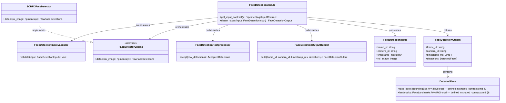
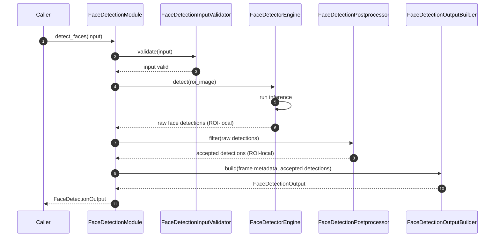

# Face Detection Module Specification

## Shared Contract Types

The following types used by this module are defined in [shared_contracts.md](shared_contracts.md) and must not be duplicated here:

- `BoundingBox` — the single shared bounding-box type (§1); coordinate space must be stated at the usage site
- `ResizePolicy` — the resize behavior enum (§2)
- `GeometrySpec` — the geometry transformation struct (§3)
- `OutputImageType` — the pixel representation enum (§4)
- `PipelineStageInputContract` — the stage initialization contract (§5)
- `Image` — the canonical shared public image struct; carries `data`, `width`, `height`, `color_format`, `layout`, `dtype`, and `value_range`; pixel format is described by `OutputImageType` (§6)
- `Point` — the pixel coordinate type; coordinate space must be stated by context (§7)
- `FaceLandmarks` — the canonical 5-point landmark struct; coordinate space must be stated by the owning field (§8)
- Coordinate-space terminology (`FULL_FRAME`, `ROI_LOCAL`, `CROP_LOCAL`) — see §9 for definitions and usage rules

---

## 1. Purpose

The Face Detection module is responsible only for detecting faces inside an already prepared person ROI image.

The module does not crop images, does not detect persons, and does not perform face recognition or identity matching. Its responsibility starts after upstream processing has already produced person-specific ROI images and ends when the module returns accepted face locations in **ROI-local coordinates relative to `roi_image`**.

The module does not perform full-frame coordinate projection.

The module does not describe or manage any external system responsibilities. External components such as the upstream person ROI preparation pipeline are treated as black boxes.

## 2. Input

### 2.1 Input Responsibility Boundary

The module receives pre-cropped person images. These person ROIs are produced outside the module.

The preparation done outside the module includes:

- cropping each person ROI from the original frame
- color conversion
- layout conversion
- dtype conversion
- normalization

The representation produced outside the module matches the configured detector input contract exactly. The Face Detection module does not perform cropping, color conversion, layout conversion, dtype conversion, normalization, or any other image preprocessing.

The module processes exactly one person ROI per invocation. If multiple people exist in the source frame, upstream IPS is responsible for splitting the frame into individual person ROIs and invoking the module separately for each one. The module is stateless per invocation.

### 2.2 Input Structure

`BoundingBox` is defined in [shared_contracts.md §1](shared_contracts.md). `Image` is defined in [shared_contracts.md §6](shared_contracts.md) — the canonical shared public image struct carrying explicit metadata fields.

```text
struct FaceDetectionInput {
    string frame_id;
    string camera_id;
    uint64 timestamp_ms;
    Image  roi_image;  // shared Image struct; metadata fields (color_format, layout, dtype, value_range) must match the configured detector input contract
}
```

- `frame_id` identifies the source frame for traceability.
- `camera_id` identifies the source camera.
- `timestamp_ms` is the capture timestamp in milliseconds. In the Python implementation it is represented as `int` and must be non-negative (milliseconds since epoch).
- `roi_image` is the prepared person ROI image. All detections produced by the module are expressed in ROI-local coordinates relative to this image.

`FaceDetectionInput` does not carry `roi_bbox_frame` or any spatial metadata. The ROI position in full-frame coordinates is maintained by `PipelineOrchestrator` and is used there after receiving the module's output to project face locations to full-frame coordinates if needed.

### 2.3 ROI Image Contract

The `roi_image` must already match the configured detector input contract before inference starts.

Default SCRFD-oriented contract:

- color format: `RGB`
- layout: `HWC`
- dtype: `uint8`
- value range: `[0, 255]`

The exact detector contract is configuration-defined. The `roi_image.color_format`, `roi_image.layout`, `roi_image.dtype`, and `roi_image.value_range` fields carry this information explicitly as part of the shared `Image` contract. The module validates the incoming `roi_image` against the configured `DetectorInputContract` using these metadata fields before sending it to the detector engine. `roi_image.width` and `roi_image.height` are explicit fields carrying the pixel dimensions of the prepared ROI.

The ROI image therefore arrives fully prepared. The Face Detection module does not perform any image preprocessing. Any minimal runtime-specific adaptation required for inference, such as wrapping the validated image into the backend's tensor type or adding a batch dimension, is handled internally by `FaceDetectorEngine` and does not modify the image data.

## 3. Configuration

### 3.1 Configuration Structure

```text
struct DetectorInputContract {
    string color_format;
    string layout;
    string dtype;
    string value_range;
}

struct FaceDetectionConfig {
    float32 confidence_threshold;
    DetectorInputContract detector_input_contract;
    GeometrySpec geometry_spec;
}
```

- `confidence_threshold` is the minimum confidence score a raw detection must meet to be accepted as a valid face detection.
- `detector_input_contract` defines the expected properties of the incoming ROI image, including color format, layout, dtype, and value range.
- `geometry_spec` defines the target spatial dimensions and resize policy expected by the configured detector engine. It is returned to `RPM` via `get_input_contract()` so the Frame Transformation Layer can prepare the model-ready ROI image at the correct size.

### 3.2 Configuration Loading Behavior

Configuration is loaded exactly once during module initialization. `FaceDetectionModule` reads the configuration source and injects the relevant values into internal subcomponents:

- `confidence_threshold` is injected into `FaceDetectionPostprocessor` at construction time.
- `detector_input_contract` is injected into `FaceDetectionInputValidator` at construction time.

Once loaded, configuration is immutable for the entire module lifecycle. It is reused unchanged across all invocations. Configuration is not reloaded per call and is not part of `FaceDetectionInput` or any other per-call runtime input.

## 4. AI Model Usage

The module depends on `FaceDetectorEngine`, an internal detector abstraction, not on any specific model implementation. This keeps the public API model-agnostic.

SCRFD is the default implementation of `FaceDetectorEngine`. It can be replaced by another face detector without changing `FaceDetectionInput`, `FaceDetectionOutput`, or the calling code.

After validation, the module sends the validated `roi_image` directly to the configured `FaceDetectorEngine`.

The engine returns raw face detections in ROI coordinates. A raw detection may contain:

- a face bounding box relative to the ROI image
- a confidence score produced by the detector
- facial landmarks relative to the ROI image

All raw outputs, confidence scores, rejected detections, and backend-specific artifacts remain strictly internal to the module and are never exposed through the public API.

## 5. Internal Pipeline

The Face Detection module is not a single flat processing unit. It is an orchestrated module composed of internal subcomponents with separate responsibilities.

### 5.1 FaceDetectionModule

`FaceDetectionModule` is the orchestration layer only. It owns no detection logic.

Its responsibilities are:

- receive `FaceDetectionInput`
- invoke internal subcomponents in the correct order
- process the single ROI provided in the input
- pass projected detections to `FaceDetectionOutputBuilder`

During initialization, `FaceDetectionModule` is responsible for loading the module configuration and wiring each internal subcomponent with its required settings, including injecting the `confidence_threshold` into `FaceDetectionPostprocessor`.

`FaceDetectionModule` must not embed validation, inference, postprocessing/acceptance, coordinate projection, or output assembly logic directly. Each of those responsibilities belongs to a dedicated internal component.

### 5.2 FaceDetectionInputValidator

`FaceDetectionInputValidator` is responsible only for input validation. It validates the input fields and the ROI before inference begins.

Validation rules:

- `frame_id` must exist
- `camera_id` must exist and be non-empty
- `timestamp_ms` must exist
- `roi_image` must exist
- `roi_image.data` must be non-null and contain valid pixel data
- `roi_image.width` must be > 0 and `roi_image.height` must be > 0
- `roi_image.color_format`, `roi_image.layout`, `roi_image.dtype`, and `roi_image.value_range` must match the configured `DetectorInputContract`
- `roi_image.data.shape` must be consistent with `roi_image.width`, `roi_image.height`, `roi_image.layout`, and `roi_image.color_format`

`FaceDetectionInputValidator` does not perform any image preprocessing and makes no acceptance decisions.

### 5.3 FaceDetectorEngine

`FaceDetectorEngine` is the internal detector runtime abstraction used by the module to run AI inference.

Its responsibilities are:

- accept the validated ROI image directly from the orchestrator
- run detector inference
- return raw face detections in ROI coordinates, including bounding boxes, confidence scores, and landmarks

`FaceDetectorEngine` does not apply confidence thresholds, filter detections, or project coordinates. It returns raw output only.

`SCRFDFaceDetector` is the current default implementation of `FaceDetectorEngine`. The module depends on the `FaceDetectorEngine` abstraction, not on SCRFD directly, so a different detector can be substituted in the future without changing `FaceDetectionInput`, `FaceDetectionOutput`, or any other part of the public API.

`FaceDetectorEngine` may return model-specific raw landmarks whose format, count, or naming vary by detector. These raw landmark formats are strictly internal and are never exposed through the public API. Any `FaceDetectorEngine` implementation must return landmarks that can be mapped to the canonical 5-point `FaceLandmarks` representation (`left_eye`, `right_eye`, `nose`, `mouth_left`, `mouth_right`). If a detector does not natively provide the canonical landmarks, an internal mapping or approximation must be applied to produce the required canonical representation.

### 5.4 FaceDetectionPostprocessor

`FaceDetectionPostprocessor` is responsible for interpreting raw detector output and deciding which detections are accepted.

Its responsibilities are:

- interpret raw face detections produced by the engine
- apply `confidence_threshold` to discard low-confidence detections
- discard malformed or invalid boxes
- apply detector-specific suppression or refinement rules if required
- determine which detections are accepted and passed to coordinate projection

The `confidence_threshold` is read from the module configuration file exactly once during module initialization. It is injected into `FaceDetectionPostprocessor` at construction time and stored as immutable internal state. It is reused unchanged for every invocation. The `confidence_threshold` is not part of `FaceDetectionInput` or any other per-call runtime input.

This component is the only place inside the module that decides whether a raw detector result becomes an accepted face detection. `FaceDetectionPostprocessor` does not project coordinates and does not construct output structures.

### 5.5 FaceDetectionOutputBuilder

`FaceDetectionOutputBuilder` is responsible for constructing the final `FaceDetectionOutput` from accepted ROI-local detections and preserved input metadata.

Its responsibilities are:

- create `DetectedFace` entries from accepted detections in ROI-local coordinates
- map accepted raw landmarks into the canonical `FaceLandmarks` structure (`left_eye`, `right_eye`, `nose`, `mouth_left`, `mouth_right`)
- assemble the final `FaceDetectionOutput`
- copy `frame_id`, `camera_id`, and `timestamp_ms` from the input for traceability

`FaceDetectionOutputBuilder` acts as the internal adaptation layer that decouples model-specific landmark formats from the public contract. It receives whatever landmark format the detector produced (after acceptance by `FaceDetectionPostprocessor`) and produces the canonical 5-point `FaceLandmarks` output. Model-specific landmark formats do not escape this component.

All coordinates in the output are ROI-local relative to `roi_image`. `FaceDetectionOutputBuilder` does not project coordinates, does not apply acceptance logic, and does not perform full-frame mapping.

### 5.6 End-to-End Processing Flow

For one invocation of `detect_faces`, the internal pipeline follows this order:

**validation → inference → postprocessing/acceptance → output construction**

1. `FaceDetectionModule` receives `FaceDetectionInput`.
2. `FaceDetectionModule` calls `FaceDetectionInputValidator` to validate the input.
3. `FaceDetectionModule` sends the validated `roi_image` to `FaceDetectorEngine`.
4. `FaceDetectorEngine` runs inference and returns raw detections in ROI-local coordinates.
5. `FaceDetectionModule` sends the raw detections to `FaceDetectionPostprocessor`.
6. `FaceDetectionPostprocessor` applies acceptance rules and returns only accepted detections in ROI-local coordinates. Rejected detections are discarded.
7. `FaceDetectionModule` calls `FaceDetectionOutputBuilder` with frame metadata and accepted ROI-local detections.
8. `FaceDetectionOutputBuilder` constructs and returns the final `FaceDetectionOutput` with all coordinates expressed in ROI-local space.

All raw model outputs, confidence scores, rejected detections, and intermediate backend-specific artifacts remain internal to the module.

## 6. Internal Data Structures

All intermediate representations below are strictly internal and never exposed through the public API.

- **`RawFaceDetections`** — Raw bounding boxes, confidence scores, and model-specific landmarks in ROI-local coordinates. Produced by `FaceDetectorEngine`, consumed by `FaceDetectionPostprocessor`.
- **`AcceptedDetections`** — Detections that passed confidence threshold and validation checks, still in ROI-local coordinates. Produced by `FaceDetectionPostprocessor`, consumed by `FaceDetectionOutputBuilder`.

## 7. Output

### 7.1 Output Structure

`Point` is defined in [shared_contracts.md §7](shared_contracts.md). `FaceLandmarks` is defined in [shared_contracts.md §8](shared_contracts.md). `BoundingBox` is defined in [shared_contracts.md §1](shared_contracts.md).

```text
struct DetectedFace {
    BoundingBox   face_bbox;   // ROI-local, relative to roi_image
    FaceLandmarks landmarks;  // ROI-local, relative to roi_image
}

struct FaceDetectionOutput {
    string frame_id;
    string camera_id;
    uint64 timestamp_ms;
    vector<DetectedFace> detections;
}
```

### 7.2 Output Semantics

- `frame_id`, `camera_id`, and `timestamp_ms` are copied from the input for traceability.
- `detections` contains only accepted face detections.
- `face_bbox` is expressed in ROI-local coordinates relative to `roi_image`. Full-frame projection is not performed by this module — that responsibility belongs to `RPM` / `PipelineOrchestrator`.
- `landmarks` are always present in every `DetectedFace` and are expressed in ROI-local coordinates relative to `roi_image`. The module exposes a canonical 5-point landmark representation: `left_eye`, `right_eye`, `nose`, `mouth_left`, and `mouth_right` (see [shared_contracts.md §8](shared_contracts.md)).

The `FaceLandmarks` structure is a fixed, model-agnostic public contract. It does not change based on the underlying detector. Model-specific landmark formats are never exposed outside the module. The public API remains stable even if the detector engine is replaced.

The output must not expose detector confidence, raw inference tensors, rejection reasons, model-specific landmark formats, or any recognition-related data.

## 8. Acceptance Logic

`FaceDetectionPostprocessor` is responsible for deciding whether a raw detector result is accepted as a valid face detection.

Acceptance is internal and configuration-driven. Typical rules include:

- minimum confidence threshold loaded from module configuration during initialization
- optional suppression of duplicate overlapping face boxes
- bounding box sanity checks
- landmark validation

Detector confidence is strictly internal. It is used by `FaceDetectionPostprocessor` when applying acceptance rules but is never returned in `FaceDetectionOutput`.

Only accepted detections proceed to coordinate projection. If no detections survive postprocessing, the module returns an empty `detections` list.

## 9. Module Interface

### 9.1 Public API

The public module contract is:

```text
get_input_contract() -> PipelineStageInputContract
detect_faces(input: FaceDetectionInput) -> FaceDetectionOutput
```

`get_input_contract()` is called once during `RecognitionPipelineManager` initialization. It returns the `PipelineStageInputContract` (containing `output_image_type` and `geometry_spec`) that the Frame Transformation Layer uses to prepare model-ready ROI images for this stage. The return value is stable across invocations.

The public API must not expose detector confidence, raw inference tensors, rejection reasons, internal state, or any model-specific data. The contract is stable regardless of which detector engine is configured.

### 9.2 Detector Abstraction

The detector backend is abstracted behind an internal interface:

```text
interface FaceDetectorEngine {
    detect(roi_image: np.ndarray) -> RawFaceDetections
}
```

> **Engine receives raw ndarray, not `Image` struct.** `FaceDetectionModule` validates `FaceDetectionInput.roi_image` as an `Image` struct (see shared_contracts.md §6) and extracts `roi_image.data` before passing it to `FaceDetectorEngine.detect()`. The engine interface is kept free of `Image` struct dependency — it operates on the raw pixel buffer only. `FaceDetectorEngine` is an internal interface; it is not part of the public module API.

Default implementation:

```text
class SCRFDFaceDetector implements FaceDetectorEngine
```

The Face Detection module depends on `FaceDetectorEngine`, not on SCRFD directly. `SCRFDFaceDetector` is the default implementation of that interface. Another detector engine can replace it in the future without changing the public API or the responsibilities of the surrounding internal components.

## 10. Error Handling

All errors are handled internally. The caller never receives exceptions or partial output. In every failure scenario, the module returns a structurally valid `FaceDetectionOutput`.

- **Invalid input** (missing fields, zero-size ROI, contract mismatch) → return valid output with empty `detections`
- **Inference failure** (engine runtime error) → catch internally, return valid output with empty `detections`
- **Empty detection result** (zero detections or all rejected) → return valid output with empty `detections`; normal operation

## 11. Lifecycle

### 11.1 Initialization

- Load `FaceDetectionConfig` from the configuration source
- Wire subcomponents: `FaceDetectionInputValidator` (with `detector_input_contract`), `FaceDetectorEngine` (with configured backend + model loading), `FaceDetectionPostprocessor` (with `confidence_threshold`), `FaceDetectionOutputBuilder`

### 11.2 Per-Invocation

**validation → inference → postprocessing → output construction**

Stateless per invocation. No state carries between calls. One person ROI per call.

## 12. Metrics / Observability

- `inference_time_ms` — `FaceDetectorEngine.detect()` duration
- `validation_time_ms` — `FaceDetectionInputValidator.validate()` duration
- `accepted_faces_count` — accepted detections per invocation
- `rejected_detections_count` — detections discarded by `FaceDetectionPostprocessor` per invocation

Metrics are internal and operational. Not part of the public API.

## 13. Class Diagram



## 14. Sequence Diagram



## 15. Constraints

The Face Detection module must not:

- perform image preprocessing (cropping, color conversion, layout conversion, dtype conversion, normalization)
- perform face recognition
- perform identity matching
- detect persons
- manage state across frames
- expose raw detector outputs externally
- expose raw detector confidence externally

The module is limited to face detection inside a prepared person ROI and to returning accepted face locations in **ROI-local coordinates relative to `roi_image`**. Full-frame projection is the responsibility of `RPM` / `PipelineOrchestrator`.
