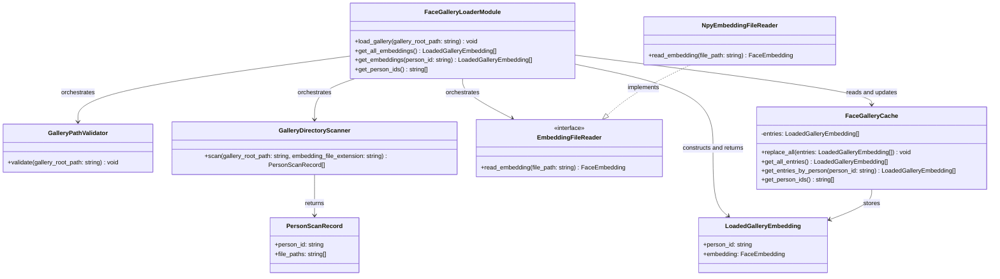
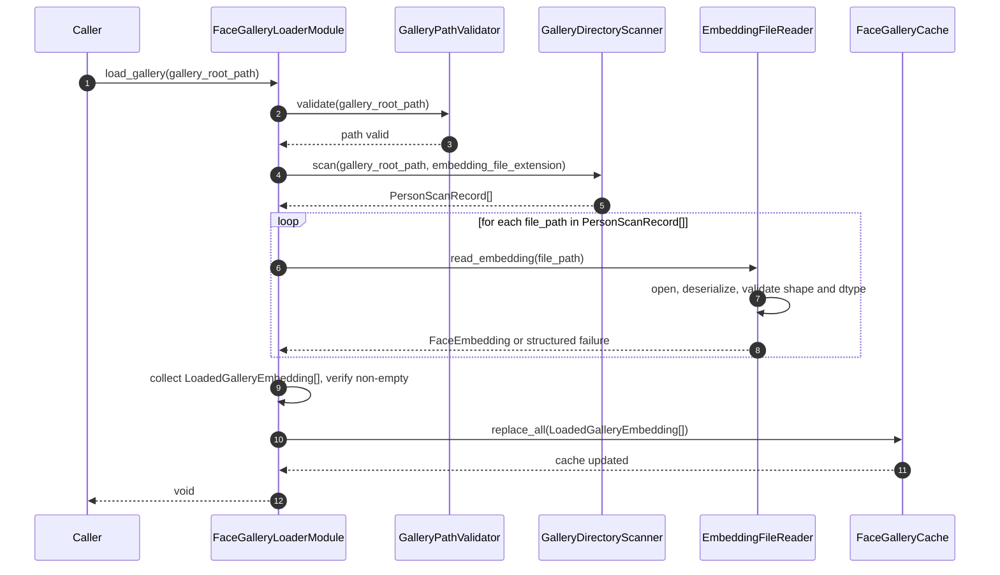
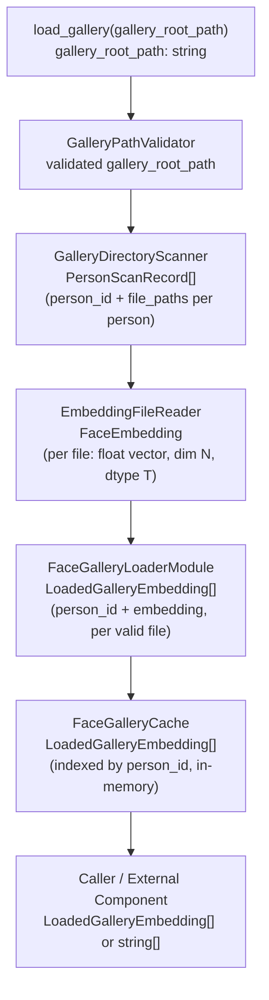

# FaceGalleryLoader Module Specification

### Module Principle

This module is fully self-contained. It does not reference, depend on, or describe external modules, pipeline stages, or system-wide orchestration.

---

## 1. Scope

### Purpose

The FaceGalleryLoader module is responsible for loading precomputed face embeddings from an existing gallery directory on disk, validating their format and content, building an in-memory gallery cache, and providing read access to the loaded embeddings. It receives a `gallery_root_path` at load time and returns `LoadedGalleryEmbedding[]` values on read calls. This module is a stateful, read-only loader that prepares the in-memory gallery state required by downstream identity lookup.

> **Downstream consumer:** The `LoadedGalleryEmbedding[]` produced by `get_all_embeddings()` is consumed by service startup code, which maps it to `EnrolledIdentity[]` and passes it to `FaceRecognitionModule` at construction time. See `doc/system.md` § "Service Startup Sequence" for the explicit wiring and `doc/image_processing_service/face_recognition.md §9.2` for the receiver.

> **Domain separation:** `LoadedGalleryEmbedding` is the Face Gallery Loader output type. It is **not** `EnrolledIdentity`. It is **not** a Face Recognition type. It must **not** be moved to `shared_contracts.md`. Startup code is responsible for mapping `LoadedGalleryEmbedding[]` → `EnrolledIdentity[]` before passing to `FaceRecognitionModule`.

### In Scope

- Validating `gallery_root_path` accessibility and basic directory structure
- Scanning the gallery root directory to discover person subdirectories
- Deriving `person_id` from each person subdirectory name
- Enumerating embedding files within each person directory that match the configured file extension
- Loading embedding files from disk via the configured `EmbeddingFileReader`
- Validating each loaded embedding for expected dimension, dtype, and non-null contract
- Skipping malformed or unsupported embedding files without corrupting the gallery load
- Raising a structured error if no valid embeddings are found across all persons
- Building an in-memory `FaceGalleryCache` from all successfully loaded embeddings
- Providing read access to all cached `LoadedGalleryEmbedding` values via `get_all_embeddings`
- Providing read access to embeddings filtered by `person_id` via `get_embeddings`
- Providing the list of loaded person identifiers via `get_person_ids`

### Out of Scope

The FaceGalleryLoader Module does NOT:

- Create, update, or delete person identities, images, or embeddings — handled outside this module
- Generate face embeddings from images — handled outside this module
- Perform image processing, face detection, or face alignment — handled outside this module
- Apply matching logic, similarity scoring, or threshold decisions — handled outside this module
- Manage identity metadata such as `person_name` — not part of this module's responsibility
- Connect to a database, external storage service, or network — this module reads only from the local filesystem
- Scan nested subdirectories inside a person directory
- Expose file paths, directory names, file names, internal cache keys, or embedding record identifiers
- Write to disk or modify any file or directory it reads

---

## 2. Input

### 2.1 Input Responsibility Boundary

The module receives a `gallery_root_path` in the `load_gallery` call. This path is assumed to reference a pre-existing directory on disk that has already been populated by an external system. The following have already been applied outside this module:

- Identity creation and assignment of `person_id` values
- Face embedding computation and serialization to files
- Directory structure construction (one subdirectory per person, each containing one or more embedding files)

The FaceGalleryLoader module does not perform any of the above. Only gallery loading and read access are performed inside this module.

The `get_embeddings` call receives a `person_id` string as its sole parameter. `get_all_embeddings` and `get_person_ids` accept no external input.

### 2.2 Input Structure

```text
// load_gallery input
struct LoadGalleryInput {
    string gallery_root_path;    // absolute or relative path to the gallery root directory
}

// get_embeddings input
struct GetEmbeddingsInput {
    string person_id;            // person identifier to filter by
}
```

`FaceEmbedding` is an opaque type defined outside this module. This module does not interpret the semantic meaning of the embedding. It validates only its structural contract: the value is non-null, its dimension matches `expected_embedding_dim`, and its data type matches `expected_dtype`. This module does not generate or inspect the internal structure of `FaceEmbedding` beyond those constraints.

### 2.3 Input Contract

`gallery_root_path` must satisfy:

- Non-empty string
- References an existing directory readable by the process
- Contains at least one direct subdirectory

`person_id` (in `get_embeddings`) must satisfy:

- Non-empty string

No image data, raw pixel data, or model tensors enter this module.

### 2.4 Validation Rules

`GalleryPathValidator` must verify:

- `gallery_root_path` is non-empty
- `gallery_root_path` references an existing path in the filesystem
- `gallery_root_path` is a directory and is readable by the process
- At least one direct child entry exists under `gallery_root_path`

`get_embeddings(person_id)` performs no validation beyond the emptiness check — if `person_id` is not found in the cache, an empty list is returned without error.

### 2.5 Input Semantics

- `gallery_root_path` — the root directory containing per-person subdirectories; scanned non-recursively
- `person_id` (in `get_embeddings`) — used as a lookup key against the in-memory cache; must match a subdirectory name from the gallery root exactly to produce results

---

## 3. Output

### 3.1 Output Structure

`LoadedGalleryEmbedding` is a validated embedding record loaded from persistent gallery storage.
It is the Face Gallery Loader output type. It is **not** `EnrolledIdentity`. It is **not** a Face Recognition type.

```text
struct LoadedGalleryEmbedding {
    string        person_id;
    FaceEmbedding embedding;
}
```

### 3.2 Output Semantics

- `person_id` — the unique person identifier derived from the subdirectory name under the gallery root; primary key for identity lookup
- `embedding` — the face feature vector loaded from disk and associated with this person; stored as loaded; not modified by this module

### 3.3 Output Constraints

The output must NOT expose:

- File paths or file names for any embedding file
- Directory names or internal gallery directory structure
- Embedding record identifiers, file-level identifiers, or internal index keys
- Internal cache data structure layout or indexing details
- File format metadata, dtype annotations, or dimension metadata
- Per-file validation results, load warnings, or structured failure details
- Person metadata such as `person_name` or any display label

All load-time intermediate data (file paths, raw file contents, `PersonScanRecord` values, per-file validation state) remain strictly internal to the module. The only externally visible result is `LoadedGalleryEmbedding[]` containing `person_id` and `embedding`.

---

## 4. Public API

```text
load_gallery(gallery_root_path: string)    -> void
get_all_embeddings()                       -> LoadedGalleryEmbedding[]
get_embeddings(person_id: string)          -> LoadedGalleryEmbedding[]
get_person_ids()                           -> string[]
```

The API must remain stable regardless of which embedding file reader implementation is configured. `embedding_file_extension`, `expected_embedding_dim`, and `expected_dtype` are never parameters — they are immutable internal configuration state loaded at initialization.

---

## 5. Non-Functional Requirements

- **Stateful after load** — the module holds loaded embeddings in `FaceGalleryCache` as persistent in-memory state; state is replaced only by a successful `load_gallery` call
- **Read-only** — the module performs no write operations to disk, to cached embeddings, or to identity records at any point; read operations have no side effects
- **Multi-method API** — `get_all_embeddings`, `get_embeddings`, and `get_person_ids` may be called independently and repeatedly after a successful `load_gallery` call
- **Deterministic** — same on-disk gallery state with the same configuration always produces identical cache content and identical read results; `get_person_ids()` returns person IDs in lexicographically sorted order; `get_all_embeddings()` returns entries sorted by `person_id` then by file enumeration order within a person; `get_embeddings(person_id)` returns entries in file enumeration order within that person
- **File-format-agnostic API** — the public output schema is independent of the embedding file format used on disk
- **Strict isolation** — no internal file paths, raw file contents, per-file validation state, or storage metadata escape the public API

---

## 6. Processing Engine

### 6.1 Engine Abstraction Interface

```text
interface EmbeddingFileReader {
    read_embedding(file_path: string) -> FaceEmbedding
}
```

### 6.2 Current Default Implementation

```text
class NpyEmbeddingFileReader implements EmbeddingFileReader
```

`NpyEmbeddingFileReader` is an algorithmic implementation (no AI or ML). It reads a `.npy` NumPy binary file from disk, deserializes its contents, verifies the array shape matches `expected_embedding_dim`, verifies the dtype matches `expected_dtype`, and returns the result as a `FaceEmbedding` value.

### 6.3 Replaceability

The module depends on the `EmbeddingFileReader` interface, not on `NpyEmbeddingFileReader` directly. Any file reader satisfying the interface may be substituted to support alternative embedding file formats (e.g., `.bin`, `.pt`, `.csv`) without changing `LoadedGalleryEmbedding`, `get_all_embeddings`, `get_embeddings`, or any other part of the public API. Replacing the reader does NOT affect the public API.

---

## 7. Acceptance / Filtering Logic

Embedding file acceptance is validated by `EmbeddingFileReader`, with the skip-or-fail policy applied by `FaceGalleryLoaderModule`.

- `GalleryDirectoryScanner` returns the full list of candidate file paths found under each person directory, filtered by `embedding_file_extension`. It applies no validation on file contents.
- `EmbeddingFileReader` attempts to load each candidate file and validates its contents:
  - If the file is well-formed, non-null, has the expected dimension, matches the expected dtype, **and is L2-normalized** → `EmbeddingFileReader` returns the `FaceEmbedding`; the file is accepted and its embedding is included in the gallery build.
  - If the file is malformed, unreadable, has an unexpected shape or dtype, is not L2-normalized, or produces a null value → `EmbeddingFileReader` returns a structured failure result; `FaceGalleryLoaderModule` skips the file, records a structured warning, and continues with remaining files.
- If all candidate files across all person directories produce structured failures and zero valid embeddings are collected, `FaceGalleryLoaderModule` raises a structured error; the gallery load is aborted.
- No file paths, rejection reasons, or per-file validation details are returned to the caller.
- `EmbeddingFileReader` is the only place inside the module that decides whether a given file's embedding content is valid or invalid.

### 7.1 L2 Normalization Requirement

Embeddings stored in gallery `.npy` files **must be L2-normalized** (unit vectors; L2 norm = 1.0 within tolerance `1e-4`).

**Why this is required:** The downstream `FaceMatcher` (inside `FaceRecognitionModule`) computes identity similarity using the dot product of the query embedding and each gallery embedding. The dot product of two L2-normalized vectors equals cosine similarity. If a gallery embedding is not L2-normalized, the dot product produces a mathematically incorrect similarity score without any runtime error — causing silent misidentification.

**Validation in `NpyEmbeddingFileReader`:** After loading and dtype-checking the array, `NpyEmbeddingFileReader.read_embedding()` checks `abs(np.linalg.norm(arr) - 1.0) <= 1e-4`. If the embedding fails this check, `read_embedding()` emits a `warnings.warn` and returns `None` (structured failure); `FaceGalleryLoaderModule` then skips the file and continues.

**Gallery preparation responsibility:** Gallery embeddings are expected to be produced by ArcFace (which outputs L2-normalized vectors by design). Any tool that generates or stores gallery embeddings must preserve L2 normalization.

---

## 8. Internal Pipeline

### 8.1 FaceGalleryLoaderModule

`FaceGalleryLoaderModule` is the orchestration layer only. It owns no gallery scanning, file reading, or caching logic.

Its responsibilities are:

- receive `load_gallery` calls, coordinate internal components in the correct order, and update the in-memory cache
- receive `get_all_embeddings`, `get_embeddings`, and `get_person_ids` calls and delegate directly to `FaceGalleryCache`
- apply the skip-or-fail policy: collect all valid `LoadedGalleryEmbedding` values from `EmbeddingFileReader` results, skip files that produced a structured failure, and raise a structured error if zero valid entries were collected
- return results from `FaceGalleryCache` to the caller for all read operations

During initialization, `FaceGalleryLoaderModule` is responsible for loading the module configuration and wiring each internal component with its required settings, including injecting `embedding_file_extension`, `expected_embedding_dim`, and `expected_dtype` into `EmbeddingFileReader` and injecting `embedding_file_extension` into `GalleryDirectoryScanner`.

`FaceGalleryLoaderModule` must not embed path validation, directory scanning, file reading, embedding content validation, or cache construction logic directly. Each of those responsibilities belongs to a dedicated internal component.

### 8.2 GalleryPathValidator

`GalleryPathValidator` is responsible only for validating the gallery root path before any scanning or loading begins.

Its responsibilities are:

- receive `gallery_root_path`
- verify the path is non-empty
- verify the path exists and is a directory on the filesystem
- verify the directory is readable by the process
- verify at least one direct child entry exists under the path
- raise a structured error for any failed check

`GalleryPathValidator` must not scan directory contents beyond confirming at least one entry exists, read any embedding file, or make decisions about person directories or file types.

### 8.3 GalleryDirectoryScanner

`GalleryDirectoryScanner` is responsible for discovering person directories and enumerating embedding files within them.
`GalleryDirectoryScanner` is responsible for discovering person directories and enumerating embedding files within them.

Its responsibilities are:

- receive the validated `gallery_root_path` and `embedding_file_extension`
- list all direct subdirectories under `gallery_root_path`; each direct subdirectory is treated as one person directory; its name is used as the `person_id`
- enumerate files within each person directory that match `embedding_file_extension`
- skip non-directory entries under `gallery_root_path` without error
- return a `PersonScanRecord[]` where each record contains `person_id` and the matched file paths for that person

`GalleryDirectoryScanner` must not read file contents, validate embedding values, scan nested subdirectories inside a person directory, or make decisions about whether any file is a valid embedding.

### 8.4 EmbeddingFileReader

`EmbeddingFileReader` is the internal file-reading engine abstraction. It is the only component with knowledge of the embedding file format on disk.

Its responsibilities are:

- accept a file path from the orchestrator
- open and read the file from disk
- deserialize the file contents into a `FaceEmbedding` value
- validate the resulting value: non-null, dimension matches `expected_embedding_dim`, dtype matches `expected_dtype`
- return the `FaceEmbedding` on success
- return a structured failure result on any format, dimension, dtype, or I/O error

`EmbeddingFileReader` does not manage directories, assign `person_id` values, build the gallery cache, or apply the gallery-level skip-or-fail policy. It validates and returns one embedding per call only. This is the only component that knows the on-disk embedding file format. It does not interpret the semantic meaning of the embedding — it validates only its structural contract: non-null, expected dimension, expected dtype.

`NpyEmbeddingFileReader` is the current default implementation of `EmbeddingFileReader`. The module depends on the `EmbeddingFileReader` abstraction, not on `NpyEmbeddingFileReader` directly, so a different file format reader can be substituted without changing `LoadedGalleryEmbedding`, `get_all_embeddings`, or any other part of the public API.

### 8.5 FaceGalleryCache

`FaceGalleryCache` stores the loaded gallery in memory and supports read access by `person_id` and across all loaded entries. It is the only component that holds gallery state in memory.

Its responsibilities are:

- receive a complete `LoadedGalleryEmbedding[]` list via `replace_all` and store it internally indexed by `person_id`
- return all entries on `get_all_entries()` in deterministic order: sorted by `person_id` lexicographically, then by file enumeration order within each person
- return entries filtered by `person_id` on `get_entries_by_person(person_id)` in file enumeration order; return an empty list if `person_id` is not present
- return all loaded person identifiers on `get_person_ids()` in lexicographically sorted order
- replace all stored entries atomically on `replace_all(entries)` when `load_gallery` rebuilds the gallery

`FaceGalleryCache` must not read files from disk, validate embedding content, scan directories, or make decisions about which embeddings to accept.

### 8.6 End-to-End Processing Flow

For one invocation of `load_gallery`, the internal pipeline follows this order:

**path validation → directory scan → embedding load and validation → cache construction**

1. `FaceGalleryLoaderModule` receives `load_gallery(gallery_root_path)`.
2. `FaceGalleryLoaderModule` calls `GalleryPathValidator.validate(gallery_root_path)`.
3. `FaceGalleryLoaderModule` calls `GalleryDirectoryScanner.scan(gallery_root_path, embedding_file_extension)` → `PersonScanRecord[]`.
4. For each `PersonScanRecord` and each file path it contains, `FaceGalleryLoaderModule` calls `EmbeddingFileReader.read_embedding(file_path)` → `FaceEmbedding` or structured failure.
5. `FaceGalleryLoaderModule` collects successful results as `LoadedGalleryEmbedding(person_id, embedding)` values; skips and records a structured warning for each file that returned a failure.
6. `FaceGalleryLoaderModule` verifies at least one `LoadedGalleryEmbedding` was collected; raises a structured error if none were collected.
7. `FaceGalleryLoaderModule` calls `FaceGalleryCache.replace_all(LoadedGalleryEmbedding[])`.
8. `FaceGalleryLoaderModule` returns control to the caller.

For `get_all_embeddings`: `FaceGalleryLoaderModule` calls `FaceGalleryCache.get_all_entries()` → `LoadedGalleryEmbedding[]` and returns the result directly.

For `get_embeddings(person_id)`: `FaceGalleryLoaderModule` calls `FaceGalleryCache.get_entries_by_person(person_id)` → `LoadedGalleryEmbedding[]` and returns the result directly.

For `get_person_ids`: `FaceGalleryLoaderModule` calls `FaceGalleryCache.get_person_ids()` → `string[]` and returns the result directly.

All intermediate data (file paths, raw file contents, `PersonScanRecord` values, per-file validation state) remain strictly internal to the module.

---

## 9. Configuration

### 9.1 Configuration Parameters

```text
struct FaceGalleryLoaderConfig {
    string embedding_file_extension;    // file extension filter for embedding files (e.g., ".npy")
    int32  expected_embedding_dim;      // expected number of dimensions per valid embedding
    string expected_dtype;              // expected data type for valid embeddings (e.g., "float32")
}
```

### 9.2 Loading Behavior

Configuration is loaded exactly once during module initialization. It is immutable after initialization and reused unchanged across all load and read invocations. No configuration parameter is part of `load_gallery`, `get_embeddings`, or any other public API input. `gallery_root_path` is not a configuration parameter — it is runtime input to `load_gallery` only.

Injection at construction time:

- `embedding_file_extension` → `GalleryDirectoryScanner`
- `embedding_file_extension`, `expected_embedding_dim`, `expected_dtype` → `EmbeddingFileReader`
- `EmbeddingFileReader` is injected as an abstract dependency, with `NpyEmbeddingFileReader` as the default implementation

---

## 10. Internal Data Structures

- **`PersonScanRecord`** — person directory scan result containing `person_id` (string, derived from subdirectory name) and `file_paths` (list of matched embedding file paths under that person's directory); produced by `GalleryDirectoryScanner`, consumed by `FaceGalleryLoaderModule`; lifecycle: per `load_gallery` call
- **`LoadedGalleryEmbedding`** — validated embedding record loaded from persistent gallery storage; contains `person_id` and `FaceEmbedding`; constructed by `FaceGalleryLoaderModule` from accepted `EmbeddingFileReader` results, stored by `FaceGalleryCache`; lifecycle: persistent in `FaceGalleryCache` after load, replaced atomically on reload. This is the Face Gallery Loader output type. It is not `EnrolledIdentity` and must not be moved to `shared_contracts.md`.
- **`FaceEmbedding`** — opaque fixed-dimension float vector loaded from disk by `EmbeddingFileReader`; consumed by `FaceGalleryLoaderModule` for `LoadedGalleryEmbedding` construction; lifecycle: per file read, then persistent within `LoadedGalleryEmbedding` in the cache

---

## 11. Error Handling

- **Invalid root path** (`gallery_root_path` is empty, non-existent, or not a directory) → `GalleryPathValidator` raises a structured error; gallery load is aborted; cache is not modified
- **Unreadable directory** (process lacks read permission on the gallery root) → `GalleryPathValidator` raises a structured error; gallery load is aborted; cache is not modified
- **Malformed embedding file** (I/O error, corrupt format, null deserialization result) → `EmbeddingFileReader` returns a structured failure; `FaceGalleryLoaderModule` skips the file, records a structured warning, and continues with remaining files
- **Dimension or dtype mismatch** (embedding does not match `expected_embedding_dim` or `expected_dtype`) → treated as malformed; same skip-with-warning policy applies
- **Unsupported file type** (extension does not match `embedding_file_extension`) → `GalleryDirectoryScanner` does not enumerate the file; it is never presented to `EmbeddingFileReader`
- **No valid embeddings loaded** (all files skipped, or no files found after scanning) → `FaceGalleryLoaderModule` raises a structured error indicating the gallery cannot be loaded; cache is not modified
- **`get_embeddings(person_id)` not found** → `FaceGalleryCache` returns an empty list; no error is raised; this is normal operation

---

## 12. Metrics / Observability

- `gallery_load_time_ms` — full `load_gallery()` duration from path validation to cache replacement
- `embedding_files_found_count` — total number of candidate files enumerated by `GalleryDirectoryScanner`
- `embedding_files_loaded_count` — number of files successfully accepted by `EmbeddingFileReader`
- `embedding_files_skipped_count` — number of files skipped due to format, dimension, dtype, or I/O errors
- `persons_loaded_count` — number of distinct `person_id` values present in the loaded cache after a successful load

Metrics are internal and operational. Not part of the public API.

---

## 13. Lifecycle

### 13.1 Initialization

- Load `FaceGalleryLoaderConfig` from the configuration source
- Initialize the configured `EmbeddingFileReader` implementation with `embedding_file_extension`, `expected_embedding_dim`, and `expected_dtype`
- Initialize `GalleryDirectoryScanner` with `embedding_file_extension`
- Initialize `FaceGalleryCache` as empty
- Wire all internal components with injected configuration values

### 13.2 Per Invocation

`load_gallery`:

**path validation → directory scan → embedding load and validation → cache construction**

`get_all_embeddings`, `get_embeddings`, `get_person_ids`:

Read directly from `FaceGalleryCache`; no file I/O or directory scanning is performed.

Module is stateful. Cache state persists across all read calls. Cache is replaced atomically on `load_gallery` only.

### 13.3 Shutdown

- Release any open file handles held by `EmbeddingFileReader` if applicable
- `FaceGalleryCache` is discarded with the module instance

---

## 14. Class Diagram



---

## 15. Sequence Diagram



---

## 16. Data Flow Diagram



---

## 17. Extensibility

**What can change without breaking the public API:**

- `EmbeddingFileReader` implementation (`NpyEmbeddingFileReader` → any reader implementing `EmbeddingFileReader`) to support alternative embedding file formats
- Embedding file extension (configuration-only change via `embedding_file_extension`)
- Expected embedding dimension and dtype (configuration-only changes; no code change required)
- `FaceGalleryCache` internal indexing or storage strategy — provided the public read contract is preserved
- Gallery root path — runtime input to `load_gallery`; not a configuration value

**What must remain stable:**

- `load_gallery(gallery_root_path: string) -> void`, `get_all_embeddings() -> LoadedGalleryEmbedding[]`, `get_embeddings(person_id: string) -> LoadedGalleryEmbedding[]`, `get_person_ids() -> string[]` signatures
- Output schema: `LoadedGalleryEmbedding { person_id: string, embedding: FaceEmbedding }`
- Empty list semantics for `get_embeddings` when `person_id` is not found in the cache
- Structured error semantics for invalid path, unreadable directory, and empty gallery
- Deterministic ordering: `get_person_ids()` returns lexicographically sorted person IDs; `get_all_embeddings()` and `get_embeddings(person_id)` return entries in stable, reproducible order

---

## 18. Module Compliance Checklist

- [ ] Read-only guarantee — module performs no write operations to disk, to embeddings, or to identity records at any point
- [ ] No file paths or internal storage details exposed — `LoadedGalleryEmbedding` must contain only `person_id` and `embedding`; no file name, directory name, record ID, or cache key is returned
- [ ] No embedding generation — no inference engine is invoked; all embeddings are loaded from pre-existing files on disk
- [ ] No matching logic — no similarity computation, threshold comparison, or identity decision is performed inside this module
- [ ] Engine abstraction respected — `FaceGalleryLoaderModule` depends on the `EmbeddingFileReader` interface, not on `NpyEmbeddingFileReader` directly
- [ ] Cache is the single source of in-memory state — `FaceGalleryCache` is the only component that holds the loaded gallery after a successful load
- [ ] Malformed file skip policy consistently applied — individual file failures never abort the gallery load unless zero valid embeddings remain after all files are processed
- [ ] Empty gallery structured error — `load_gallery` must raise a structured error if no valid embeddings are collected; cache must not be modified in that case
- [ ] `get_embeddings(person_id)` returns empty list — `FaceGalleryCache` returns an empty list when `person_id` is not present; no error is raised
- [ ] Deterministic ordering — `get_person_ids()` returns person IDs in lexicographically sorted order; `get_all_embeddings()` and `get_embeddings(person_id)` return entries in stable, reproducible order for the same gallery state
- [ ] No nested directory scanning — `GalleryDirectoryScanner` must not recurse into subdirectories inside a person directory
- [ ] Input responsibility boundary enforced — module performs no embedding computation, image processing, or identity creation
