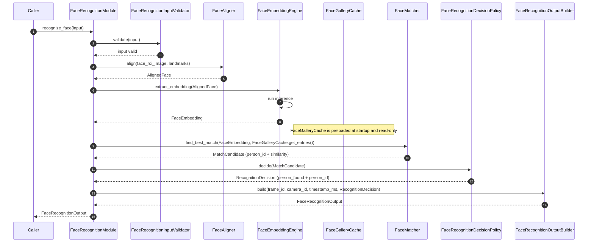
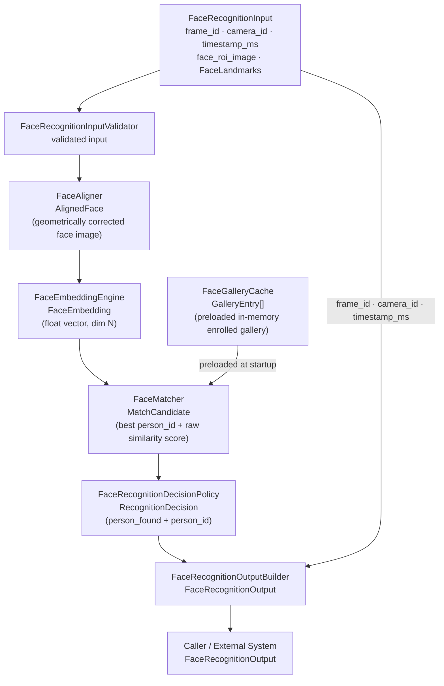

# Face Recognition Module Specification

## 1. Scope

### Purpose

The Face Recognition module is responsible for determining the identity of a single detected face. It receives a pre-cropped face ROI image and its canonical facial landmarks, and returns a `FaceRecognitionOutput` containing `person_found` and, when a valid match is accepted, `person_id`. This module is the final stage in the IPS pipeline. After this stage, the IPS forwards the result to an external system without further processing.

### In Scope

- Validating the incoming face ROI image and landmarks
- Aligning the face using the 5-point canonical landmarks
- Extracting a face embedding via the configured embedding engine
- Comparing the embedding against the enrolled gallery
- Applying threshold-based recognition acceptance
- Returning a clean identity result (`person_found` boolean, and `person_id` when a valid match is accepted)
- Configuration-driven threshold — loaded at initialization, not passed per invocation

### Out of Scope

The Face Recognition Module does NOT:

- Perform color conversion, resizing, normalization, or any generic image preprocessing — these are handled outside this module
- Detect faces or persons
- Manage multi-face input — upstream IPS handles dispatching; one face per invocation
- Expose similarity scores, embeddings, landmarks, bounding boxes, or match flags
- Enroll new identities into the gallery
- Manage camera stream state or frame sequencing

## 2. Input

### 2.1 Input Responsibility Boundary

The module receives a pre-cropped face ROI image already matching the configured recognition engine input contract. The input image is assumed to be pre-prepared before entering the module. The following have already been applied:

- Color format conversion
- Resize to model-required dimensions
- Normalization and layout compliance

The Face Recognition module does not perform any generic image preprocessing. It assumes `face_roi_image` already satisfies the configured engine contract. Only recognition-specific processing (alignment, embedding, matching) is performed inside this module.

### 2.2 Input Structure

```text
struct Point {
    int32 x;
    int32 y;
}

struct FaceLandmarks {
    Point left_eye;
    Point right_eye;
    Point nose;
    Point mouth_left;
    Point mouth_right;
}

struct FaceRecognitionInput {
    uint64        frame_id;
    string        camera_id;
    uint64        timestamp_ms;
    Image         face_roi_image;
    FaceLandmarks landmarks;
}
```

`Image` is an opaque type. Its internal representation is not defined by this module. `FaceLandmarks` is a fully typed canonical struct defined above.

### 2.3 ROI Image Contract

`face_roi_image` must already match the configured embedding engine input contract before inference starts.

Default ArcFace-oriented contract (current default implementation — not a fixed public API requirement):

- color format: `RGB`
- layout: `HWC`
- dtype: `float32`
- value range: `[-1.0, 1.0]` (mean-normalized)
- dimensions: `112 × 112` pixels (height × width × channels)
- content: contains only the detected face, pre-cropped to a tight face region; the face is centered and occupies the full ROI extent

The exact embedding contract is configuration-defined and depends on the currently configured AI embedding model and engine. This contract is dynamic — if the underlying embedding model is replaced, the expected color format, layout, dtype, value range, or dimensions may change without modifying the public module API.

The Face Recognition module validates the incoming `face_roi_image` against the configured embedding contract before sending it to `FaceEmbeddingEngine`. The module does not perform any image preprocessing on the incoming ROI — no cropping, resizing, normalization, alignment, color conversion, layout conversion, or dtype conversion is applied. The ROI image arrives fully prepared from upstream processing.

Any minimal runtime-specific adaptation required for inference — such as wrapping the validated image into the backend tensor type or adding a batch dimension — is handled internally by `FaceEmbeddingEngine` and does not modify the image data.

`FaceLandmarks` provides the canonical 5 facial key points. All coordinates are relative to `face_roi_image`. No bounding boxes are present or required at this stage.

### 2.4 Validation Rules

`FaceRecognitionInputValidator` must verify:

- `frame_id` must exist
- `camera_id` must exist and be non-empty
- `timestamp_ms` must exist
- `face_roi_image` must exist and be non-null
- `landmarks` must be present with all 5 points defined
- Each landmark point must have finite coordinates within `face_roi_image` bounds

### 2.5 Input Semantics

- `frame_id` — source frame identifier; preserved unchanged for traceability
- `camera_id` — source camera identifier; preserved unchanged for traceability
- `timestamp_ms` — capture timestamp in milliseconds; preserved unchanged for traceability
- `face_roi_image` — prepared face crop; input to the alignment and embedding pipeline
- `landmarks` — canonical 5-point facial key points used exclusively by `FaceAligner`; not used for detection, bounding, or output

## 3. Output

### 3.1 Output Structure

```text
struct FaceRecognitionOutput {
    uint64 frame_id;
    string camera_id;
    uint64 timestamp_ms;
    bool   person_found;
    string person_id;     // populated only when person_found = true
}
```

### 3.2 Output Semantics

- `frame_id`, `camera_id`, `timestamp_ms` — copied unchanged from input for traceability
- `person_found` — `true` when a valid identity match was accepted; `false` when no valid identity was found
- `person_id` — the unique identifier of the recognized identity; populated only when `person_found = true`; not a valid identity when `person_found = false`

### 3.3 Output Constraints

The output must NOT expose:

- `person_name`
- Similarity scores or distance values
- Face embeddings or feature vectors
- Facial landmarks
- Bounding boxes
- Match flags, confidence indicators, or candidate lists

All matching logic and intermediate computation are strictly internal. The only externally visible result is `person_found` and, when a match is accepted, `person_id`.

## 4. Public API

```text
recognize_face(input: FaceRecognitionInput) -> FaceRecognitionOutput
```

The API must remain stable regardless of which embedding engine is configured. Threshold is never a parameter — it is immutable internal configuration state loaded at initialization. The output schema always includes `person_found`; `person_id` is present only when `person_found = true`.

## 5. Non-Functional Requirements

- **Stateless per invocation** — no cross-frame memory, with the sole exception of `FaceGalleryCache` (the preloaded in-memory enrolled gallery), which is immutable and read-only during recognition
- **Single face per invocation** — upstream IPS is responsible for dispatching individual face crops; the module must not accept batched input
- **Real-time capable** — suitable for per-frame online processing
- **Deterministic** — same input + same configuration + same gallery state produce the same output
- **Model-agnostic API** — the public output schema is independent of the underlying embedding model
- **Strict isolation** — no internal AI data (embeddings, scores, raw tensors) escapes the public API

## 6. Processing Engine

### 6.1 Engine Abstraction Interface

```text
interface FaceEmbeddingEngine {
    extract_embedding(aligned_face: AlignedFace) -> FaceEmbedding
}
```

### 6.2 Current Default Implementation

```text
class ArcFaceEmbeddingEngine implements FaceEmbeddingEngine
```

ArcFace is an AI-based engine (neural network inference). It produces a fixed-dimension L2-normalized embedding vector from an aligned face image.

### 6.3 Replaceability

The module depends on the `FaceEmbeddingEngine` interface, not on `ArcFaceEmbeddingEngine` directly. Any embedding model producing a fixed-dimension vector may be substituted without changing `FaceRecognitionInput`, `FaceRecognitionOutput`, or calling code. Replacing the engine does NOT affect the public API.

## 7. Acceptance / Filtering Logic

Recognition acceptance is threshold-based and exclusively managed by `FaceRecognitionDecisionPolicy`.

- `FaceMatcher` returns the best candidate and its raw similarity score from the gallery. If the gallery is empty, it returns no candidate.
- `FaceRecognitionDecisionPolicy` applies `recognition_threshold`:
  - If similarity ≥ `recognition_threshold` → `person_found = true`, `person_id` = matched identity; otherwise `person_found = false`
- The threshold is loaded from configuration at initialization. It is immutable and not adjustable per invocation.
- No match flags or similarity scores are returned to the caller.
- `FaceRecognitionDecisionPolicy` is the only place inside the module that makes accept or reject decisions.

## 8. Internal Pipeline

### 8.1 FaceRecognitionModule

`FaceRecognitionModule` is the orchestration layer only. It owns no recognition logic.

Its responsibilities are:

- receive `FaceRecognitionInput`
- invoke internal subcomponents in the correct order
- pass results between components through the pipeline
- return the final `FaceRecognitionOutput` to the caller

During initialization, `FaceRecognitionModule` is responsible for loading the module configuration and wiring each internal subcomponent with its required settings, including injecting `recognition_threshold` into `FaceRecognitionDecisionPolicy` and building `FaceGalleryCache` from the enrolled embeddings provided at startup.

`FaceRecognitionModule` must not embed validation, alignment, inference, matching, or decision logic directly. Each of those responsibilities belongs to a dedicated internal component.

### 8.2 FaceRecognitionInputValidator

`FaceRecognitionInputValidator` is responsible only for input validation. It validates all input fields and landmarks before processing begins.

Validation rules:

- `frame_id` must exist
- `camera_id` must exist and be non-empty
- `timestamp_ms` must exist
- `face_roi_image` must exist and be non-null
- `landmarks` must be present with all 5 points defined
- each landmark point must have finite coordinates within `face_roi_image` bounds

`FaceRecognitionInputValidator` does not perform any preprocessing, alignment, or matching, and makes no acceptance decisions.

### 8.3 FaceAligner

`FaceAligner` produces a geometrically aligned face image from the ROI using the 5-point canonical landmarks.

Its responsibilities are:

- receive `face_roi_image` and `FaceLandmarks`
- apply a geometric transformation to normalize face orientation and position
- return `AlignedFace` ready for embedding extraction

`FaceAligner` must not run inference, access the gallery, or apply thresholds.

### 8.4 FaceEmbeddingEngine

`FaceEmbeddingEngine` is the internal embedding runtime abstraction used by the module to run AI inference.

Its responsibilities are:

- accept the aligned face image from the orchestrator
- run embedding model inference
- return a fixed-dimension `FaceEmbedding` vector

`FaceEmbeddingEngine` does not compare embeddings to the gallery, apply thresholds, or make accept or reject decisions. It returns the raw embedding only.

`ArcFaceEmbeddingEngine` is the current default implementation of `FaceEmbeddingEngine`. The module depends on the `FaceEmbeddingEngine` abstraction, not on `ArcFaceEmbeddingEngine` directly, so a different embedding model can be substituted without changing `FaceRecognitionInput`, `FaceRecognitionOutput`, or any other part of the public API.

### 8.5 FaceGalleryCache

`FaceGalleryCache` is the internal in-memory store of enrolled face embeddings. It is the only component with knowledge of the identity gallery.

Its responsibilities are:

- receive the full set of enrolled `GalleryEntry[]` records once at module initialization
- expose these entries read-only via `get_entries()` to `FaceMatcher` during recognition
- hold the enrolled gallery as immutable in-memory state for the lifetime of the module

`FaceGalleryCache` is initialized once at startup and never modified during recognition invocations. It performs no external I/O, does not connect to any storage source during recognition, and makes no matching or accept or reject decisions. Gallery updates require module reinitialization.

### 8.6 FaceMatcher

`FaceMatcher` compares the query embedding against all gallery entries and returns the best candidate.

Its responsibilities are:

- receive `FaceEmbedding` and `GalleryEntry[]`
- compute similarity between the query embedding and each gallery entry
- return the `MatchCandidate` with the highest similarity score, or empty if the gallery is empty

`FaceMatcher` must not apply the recognition threshold or make accept or reject decisions.

### 8.7 FaceRecognitionDecisionPolicy

`FaceRecognitionDecisionPolicy` applies the recognition threshold and produces the final identity decision.

Its responsibilities are:

- receive a `MatchCandidate` (or empty result)
- apply `recognition_threshold`: if similarity ≥ threshold, set `person_found = true` and include the matched `person_id`; otherwise set `person_found = false`
- return `person_found = false` when no candidate is present (empty gallery)
- return a `RecognitionDecision` record containing `person_found` and, when accepted, `person_id`

This component is the only place inside the module that decides whether a match result becomes an accepted identity. `FaceRecognitionDecisionPolicy` must not access the gallery directly or run inference.

### 8.8 FaceRecognitionOutputBuilder

`FaceRecognitionOutputBuilder` is responsible for constructing the final `FaceRecognitionOutput` from the identity decision and preserved input metadata.

Its responsibilities are:

- receive frame metadata and the `RecognitionDecision` (containing `person_found` and, when accepted, `person_id`)
- copy `frame_id`, `camera_id`, and `timestamp_ms` from the input for traceability
- set `person_found` from the decision; populate `person_id` only when `person_found = true`
- assemble and return the final `FaceRecognitionOutput`

`FaceRecognitionOutputBuilder` must not perform matching, apply threshold logic, or make decision logic.

### 8.9 End-to-End Processing Flow

For one invocation of `recognize_face`, the internal pipeline follows this order:

**validation → alignment → embedding → matching → decision → output construction**

1. `FaceRecognitionModule` receives `FaceRecognitionInput`.
2. `FaceRecognitionModule` calls `FaceRecognitionInputValidator.validate(input)`.
3. `FaceRecognitionModule` calls `FaceAligner.align(face_roi_image, landmarks)` → `AlignedFace`.
4. `FaceRecognitionModule` calls `FaceEmbeddingEngine.extract_embedding(AlignedFace)` → `FaceEmbedding`.
5. `FaceRecognitionModule` calls `FaceMatcher.find_best_match(FaceEmbedding, FaceGalleryCache.get_entries())` → `MatchCandidate`.
6. `FaceRecognitionModule` calls `FaceRecognitionDecisionPolicy.decide(MatchCandidate)` → `RecognitionDecision` (`person_found` + optional `person_id`).
7. `FaceRecognitionModule` calls `FaceRecognitionOutputBuilder.build(frame_id, camera_id, timestamp_ms, RecognitionDecision)` → `FaceRecognitionOutput`.
8. `FaceRecognitionModule` returns `FaceRecognitionOutput` to the caller.

All intermediate data (aligned face, embedding, gallery entries, match scores) remain strictly internal to the module.

## 9. Configuration

### 9.1 Configuration Parameters

```text
struct FaceRecognitionConfig {
    float  recognition_threshold;    // acceptance threshold; applied internally only
}
```

### 9.2 Loading Behavior

Configuration is loaded exactly once during module initialization. It is immutable after initialization and reused unchanged across all invocations. No configuration parameter is part of `FaceRecognitionInput`.

Injection at construction time:

- `recognition_threshold` → `FaceRecognitionDecisionPolicy`
- Enrolled embeddings and associated person metadata are supplied to the module at construction time; the module builds `FaceGalleryCache` from these records and retains them as immutable in-memory state
- `FaceEmbeddingEngine` is injected as an abstract dependency, with `ArcFaceEmbeddingEngine` as the default implementation

## 10. Internal Data Structures

- **`AlignedFace`** — geometrically aligned face image ready for embedding extraction; produced by `FaceAligner`, consumed by `FaceEmbeddingEngine`; lifecycle: per-call
- **`FaceEmbedding`** — fixed-dimension float vector representing face identity; produced by `FaceEmbeddingEngine`, consumed by `FaceMatcher`; lifecycle: per-call
- **`GalleryEntry`** — enrolled identity record containing `person_id` (primary identifier), optional `person_name` (metadata only, not exposed externally), and stored embedding vector; held by `FaceGalleryCache`; lifecycle: persistent in module memory after initialization, read-only during recognition calls
- **`MatchCandidate`** — best gallery match containing candidate `person_id` and raw similarity score; produced by `FaceMatcher`, consumed by `FaceRecognitionDecisionPolicy`; lifecycle: per-call
- **`RecognitionDecision`** — identity decision record containing `person_found` (bool) and, when accepted, `person_id`; produced by `FaceRecognitionDecisionPolicy`, consumed by `FaceRecognitionOutputBuilder`; lifecycle: per-call

## 11. Error Handling

- **Validation failure** (missing fields, null image, malformed landmarks) → return `FaceRecognitionOutput` with `person_found = false`; no valid recognized identity returned
- **Alignment failure** (degenerate landmarks, geometric error) → catch internally, return `person_found = false`; no valid recognized identity returned
- **Inference failure** (embedding engine runtime error) → catch internally, return `person_found = false`; no valid recognized identity returned
- **Empty gallery** (no enrolled identities) → `FaceMatcher` returns no candidate; `FaceRecognitionDecisionPolicy` returns `person_found = false`; normal operation
- **No match above threshold** → return `person_found = false`; normal operation

## 12. Metrics / Observability

- `alignment_time_ms` — `FaceAligner.align()` duration
- `inference_time_ms` — `FaceEmbeddingEngine.extract_embedding()` duration
- `total_recognition_time_ms` — full `recognize_face()` duration
- `recognition_accepted_count` — invocations producing a named match
- `recognition_no_match_count` — invocations returning `person_found = false`
- `validation_failure_count` — inputs rejected by `FaceRecognitionInputValidator`

Metrics are internal and operational. Not part of the public API.

## 13. Lifecycle

### 13.1 Initialization

- Load `FaceRecognitionConfig` from the configuration source
- Initialize the configured `FaceEmbeddingEngine` implementation
- Receive the enrolled embeddings and associated person metadata at construction time; build `FaceGalleryCache` as an immutable in-memory structure
- Gallery updates require module reinitialization
- Wire all internal components with injected configuration values

### 13.2 Per Invocation

**validation → alignment → embedding → matching → decision → output construction**

Stateless per invocation. No state carries between calls. One face ROI per call.

### 13.3 Shutdown

- Release `FaceEmbeddingEngine` resources

## 14. Class Diagram

```mermaid
classDiagram
    class FaceRecognitionModule {
        +recognize_face(input: FaceRecognitionInput) FaceRecognitionOutput
    }

    class FaceRecognitionInputValidator {
        +validate(input: FaceRecognitionInput) void
    }

    class FaceAligner {
        +align(face_roi_image: Image, landmarks: FaceLandmarks) AlignedFace
    }

    class FaceEmbeddingEngine {
        <<interface>>
        +extract_embedding(aligned_face: AlignedFace) FaceEmbedding
    }

    class ArcFaceEmbeddingEngine {
        +extract_embedding(aligned_face: AlignedFace) FaceEmbedding
    }

    class FaceGalleryCache {
        -entries: GalleryEntry[]
        +get_entries() GalleryEntry[]
    }

    class FaceMatcher {
        +find_best_match(embedding: FaceEmbedding, gallery: GalleryEntry[]) MatchCandidate
    }

    class FaceRecognitionDecisionPolicy {
        +decide(candidate: MatchCandidate) RecognitionDecision
    }

    class FaceRecognitionOutputBuilder {
        +build(frame_id: uint64, camera_id: string, timestamp_ms: uint64, decision: RecognitionDecision) FaceRecognitionOutput
    }

    class FaceRecognitionInput {
        +frame_id: uint64
        +camera_id: string
        +timestamp_ms: uint64
        +face_roi_image: Image
        +landmarks: FaceLandmarks
    }

    class FaceRecognitionOutput {
        +frame_id: uint64
        +camera_id: string
        +timestamp_ms: uint64
        +person_found: bool
        +person_id: string
    }

    class FaceLandmarks {
        +left_eye: Point
        +right_eye: Point
        +nose: Point
        +mouth_left: Point
        +mouth_right: Point
    }

    class Point {
        +x: int32
        +y: int32
    }

    FaceRecognitionModule --> FaceRecognitionInputValidator : orchestrates
    FaceRecognitionModule --> FaceAligner : orchestrates
    FaceRecognitionModule --> FaceEmbeddingEngine : orchestrates
    FaceRecognitionModule --> FaceGalleryCache : reads at startup
    FaceRecognitionModule --> FaceMatcher : orchestrates
    FaceRecognitionModule --> FaceRecognitionDecisionPolicy : orchestrates
    FaceRecognitionModule --> FaceRecognitionOutputBuilder : orchestrates
    ArcFaceEmbeddingEngine ..|> FaceEmbeddingEngine : implements
    FaceRecognitionModule --> FaceRecognitionInput : consumes
    FaceRecognitionModule --> FaceRecognitionOutput : returns
    FaceRecognitionInput --> FaceLandmarks : contains
    FaceLandmarks --> Point : uses
```



## 15. Sequence Diagram



## 16. Data Flow Diagram



## 17. Extensibility

**What can change without breaking the public API:**

- Embedding model (`ArcFaceEmbeddingEngine` → any engine implementing `FaceEmbeddingEngine`)
- Inference backend (ONNX, TensorRT, etc.) — internal to the engine implementation
- Enrolled gallery contents — supplied at initialization; the internal `FaceGalleryCache` is rebuilt on next startup
- Recognition threshold (configuration-only change)

**What must remain stable:**

- `recognize_face(input: FaceRecognitionInput) -> FaceRecognitionOutput` signature
- Output schema: `{ frame_id, camera_id, timestamp_ms, person_found, person_id }`
- Boolean `person_found` semantics: `true` → match accepted; `false` → no valid identity found

## 18. Module Compliance Checklist

- [ ] One face per invocation — module must not accept or process batched face input
- [ ] Threshold applied internally — `recognition_threshold` must never appear in `FaceRecognitionInput` or `FaceRecognitionOutput`
- [ ] No embedding exposure — `FaceEmbedding` must never appear in `FaceRecognitionOutput`
- [ ] No score exposure — similarity or distance values must never appear in `FaceRecognitionOutput`
- [ ] No landmark exposure — `FaceLandmarks` is not returned in output
- [ ] No bounding box in input — `BoundingBox` is not part of `FaceRecognitionInput`
- [ ] Engine abstraction respected — `FaceRecognitionModule` depends on `FaceEmbeddingEngine` interface, not on `ArcFaceEmbeddingEngine` directly
- [ ] Preprocessing boundaries enforced — module performs no color conversion, resize, or normalization
- [ ] Metadata preserved — `frame_id`, `camera_id`, `timestamp_ms` copied unchanged from input to output
- [ ] `person_found = false` returned for all non-match scenarios — including empty gallery, threshold miss, validation failure, and runtime failure
- [ ] Output uses `person_found` and `person_id` only — `person_id` populated only when `person_found = true`
- [ ] `person_name` is not exposed externally
- [ ] Identity is stable and unique per enrolled person
- [ ] No runtime access to any external gallery source — recognition invocations consume only the preloaded `FaceGalleryCache`
