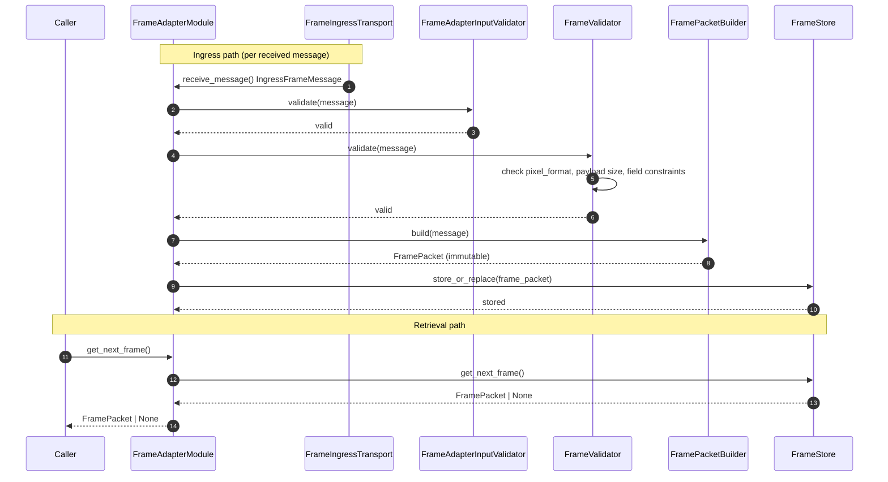
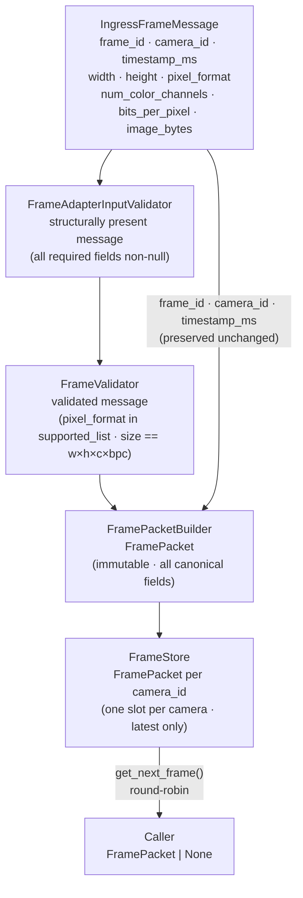

# Frame Adapter Module Specification

## 1. Scope

### Purpose

The Frame Adapter module is responsible for receiving raw ingress frame messages over a configured transport, validating all required fields and payload integrity, constructing immutable FramePacket objects from accepted messages, and writing each accepted FramePacket to FrameStore. It exposes a pull-based retrieval interface for consumers to obtain the latest frame per camera in round-robin order.

### In Scope

- Receiving raw ingress frame messages over a configured transport connection
- Performing structural validation on all required fields of each ingress message
- Validating payload integrity: size consistency, pixel format acceptance, and field constraints
- Rejecting invalid frames internally — no rejection state is propagated outside the module
- Constructing immutable FramePacket objects from validated ingress messages
- Writing each accepted FramePacket to FrameStore (one slot per camera)
- Exposing `get_next_frame()` for round-robin pull-based retrieval of the latest frame per camera
- Managing transport endpoint lifecycle: `start()`, `stop()`, `configure(config)`, `health()`

### Out of Scope

The Frame Adapter Module does NOT:

- Decode, transcode, or decompress image payload — handled outside this module
- Apply any image transformation or preprocessing — handled outside this module
- Initiate outbound connections to frame sources — handled outside this module
- Manage reconnection policy for transport streams — handled outside this module
- Maintain frame history or multi-frame buffers per camera
- Expose raw ingress messages, transport metadata, or validation flags
- Perform any downstream processing or orchestrate any downstream component

---

## 2. Input

### 2.1 Input Responsibility Boundary

The module receives raw ingress frame messages from an external source over the configured transport. The following have already been applied before the message arrives:

- Frame capture at the originating source
- Stream initiation — the source manages outbound connection setup
- Transport-layer framing and delivery — the transport layer handles connection management

The Frame Adapter module does not perform any of the above. Only ingress reception, field validation, payload integrity validation, and FramePacket construction are performed inside this module.

### 2.2 Input Structure

```text
struct IngressFrameMessage {
    string frame_id;
    string camera_id;
    uint64 timestamp_ms;
    int32  width;
    int32  height;
    string pixel_format;
    int32  num_color_channels;
    int32  bits_per_pixel;
    bytes  image_bytes;
}
```

`image_bytes` is an opaque byte sequence. Its internal representation is not defined by this module. The module treats it strictly as raw unencoded pixel data. The contract it must satisfy is defined in Section 2.3.

### 2.3 Input Contract

`image_bytes` must satisfy the following preconditions before the frame is accepted:

- Must contain raw, unencoded pixel data only — JPEG, H264, and any other compressed or encoded formats are NOT supported and must be rejected
- Must not be null or empty
- Byte length must equal `width × height × num_color_channels × (bits_per_pixel / 8)`
- `pixel_format` must be one of the configured supported formats (e.g., `RGB`, `BGR`, `GRAY8`)
- `width`, `height`, `num_color_channels`, and `bits_per_pixel` must be positive integers consistent with `image_bytes` size

### 2.4 Validation Rules

`FrameValidator` must verify:

- `frame_id` must exist and be non-empty
- `camera_id` must exist and be non-empty
- `timestamp_ms` must exist
- `image_bytes` must exist, be non-null, and be non-empty
- `pixel_format` must be a value in the configured `supported_pixel_formats` list
- `width`, `height`, `num_color_channels`, and `bits_per_pixel` must all be positive integers
- Payload size must equal `width × height × num_color_channels × (bits_per_pixel / 8)`

### 2.5 Input Semantics

- `frame_id` — unique frame identifier assigned by the source; preserved unchanged for traceability
- `camera_id` — source camera identifier; used as the FrameStore slot key and preserved for traceability
- `timestamp_ms` — capture timestamp in milliseconds since epoch; preserved unchanged for traceability
- `width` — frame width in pixels; used for payload size validation
- `height` — frame height in pixels; used for payload size validation
- `pixel_format` — pixel color space and layout descriptor; validated against `supported_pixel_formats` and preserved in FramePacket
- `num_color_channels` — number of color channels per pixel; used for payload size validation
- `bits_per_pixel` — bit depth per pixel; used for payload size validation
- `image_bytes` — raw unencoded pixel data; the canonical payload field of the resulting FramePacket; not used for transport encoding identification

---

## 3. Output

### 3.1 Output Structure

```text
struct FramePacket {
    string frame_id;
    string camera_id;
    uint64 timestamp_ms;
    int32  width;
    int32  height;
    string pixel_format;
    int32  num_color_channels;
    int32  bits_per_pixel;
    bytes  image_bytes;
}
```

FramePacket is immutable after construction. No field may be modified after `FramePacketBuilder.build()` returns.

### 3.2 Output Semantics

- `frame_id`, `camera_id`, `timestamp_ms` — copied unchanged from the validated IngressFrameMessage for traceability
- `width`, `height` — frame dimensions copied unchanged from the validated message
- `pixel_format` — pixel format descriptor copied unchanged; identifies the color space and layout of `image_bytes`
- `num_color_channels`, `bits_per_pixel` — pixel depth fields copied unchanged from the validated message
- `image_bytes` — raw unencoded pixel data copied unchanged from the validated message; no decoding or transformation is applied

### 3.3 Output Constraints

The output must NOT expose:

- Transport metadata or ingress envelope fields not part of the canonical frame definition
- Validation state, rejection flags, or validation error details
- Intermediate construction state or partial FramePacket instances
- Encoding hints, compression identifiers, or codec information
- Internal transport stream identifiers or connection state

All validation logic, transport parsing, and payload integrity checks are strictly internal. The only externally visible result is a fully validated, immutable `FramePacket`.

---

## 4. Public API

```text
FramePacket | None  get_next_frame()
void                configure(config: FrameAdapterConfig)
void                start()
void                stop()
AdapterHealth       health()
```

The API must remain stable regardless of which transport implementation is configured. `supported_pixel_formats`, `bind_address`, and all other configuration parameters are never arguments — they are immutable internal configuration state loaded at initialization.

---

## 5. Non-Functional Requirements

- **Stateless per ingress invocation** — each frame message is received, validated, and stored independently; no cross-frame memory is maintained in the ingress path
- **Single frame per `get_next_frame()` call** — the module returns exactly one `FramePacket` or `None` per retrieval call; the caller is responsible for its own pull loop
- **Real-time capable** — suitable for per-frame online ingestion and retrieval at camera-stream rates
- **Deterministic** — same ingress message and same configuration always produce the same FramePacket or the same rejection outcome
- **Transport-agnostic API** — the public output schema (`FramePacket`) and `get_next_frame()` signature are independent of the underlying transport implementation
- **Strict isolation** — no internal transport artifacts, stream identifiers, or ingress envelope data escape through the public API

---

## 6. Processing Engine

### 6.1 Engine Abstraction Interface

```text
interface FrameIngressTransport {
    void                bind_and_start(config: FrameAdapterConfig)
    void                stop()
    IngressFrameMessage receive_message()
}
```

### 6.2 Current Default Implementation

```text
class GrpcFrameIngressTransport implements FrameIngressTransport
```

`GrpcFrameIngressTransport` is a protocol-based transport engine (gRPC streaming). It hosts a server-side receiving endpoint, accepts inbound frame streams, and delivers `IngressFrameMessage` objects to the orchestrator.

### 6.3 Replaceability

The module depends on the `FrameIngressTransport` interface, not on `GrpcFrameIngressTransport` directly. Any transport implementation (gRPC, WebSocket, shared memory, etc.) may be substituted without changing `FramePacket`, `get_next_frame()`, or any other part of the public API. Replacing the transport does NOT affect the public API.

---

## 7. Acceptance / Filtering Logic

Frame acceptance is validation-based and exclusively managed by `FrameValidator`.

- `FrameIngressTransport` delivers a raw `IngressFrameMessage` to the orchestrator. It does not inspect field values or payload integrity.
- `FrameValidator` applies all acceptance rules:
  - If any required field is missing or empty → reject the frame; increment `invalid_frames_total`; continue to the next message
  - If `pixel_format` is not in the configured `supported_pixel_formats` list → reject; increment `ingress_rejected_total`; continue
  - If `len(image_bytes) ≠ width × height × num_color_channels × (bits_per_pixel / 8)` → reject; increment `invalid_frames_total`; continue
  - If `width`, `height`, `num_color_channels`, or `bits_per_pixel` is not a positive integer → reject; increment `invalid_frames_total`; continue
  - If all rules pass → frame is accepted and passed to `FramePacketBuilder`
- Validation rules are loaded from configuration at initialization. They are immutable and not adjustable per invocation.
- No rejection flags or validation reasons are returned to the caller.
- `FrameValidator` is the only place inside the module that makes accept or reject decisions.

---

## 8. Internal Pipeline

### 8.1 FrameAdapterModule

`FrameAdapterModule` is the orchestration layer only. It owns no ingress parsing, validation, packet construction, or storage logic.

Its responsibilities are:

- receive each `IngressFrameMessage` from `FrameIngressTransport`
- invoke internal subcomponents in the correct order
- pass results between components through the pipeline
- expose `get_next_frame()` by delegating to `FrameStore`
- return the final `FramePacket` or `None` to the caller

During initialization, `FrameAdapterModule` is responsible for loading the module configuration and wiring each internal subcomponent with its required settings, including injecting `supported_pixel_formats` into `FrameValidator`, transport configuration into `FrameIngressTransport`, and storage configuration into `FrameStore`.

`FrameAdapterModule` must not embed validation, payload inspection, packet construction, or storage logic directly. Each of those responsibilities belongs to a dedicated internal component.

### 8.2 FrameAdapterInputValidator

`FrameAdapterInputValidator` is responsible only for structural message presence validation. It verifies that the incoming `IngressFrameMessage` carries all required fields before deeper processing begins.

Validation rules:

- `frame_id` must exist and be non-empty
- `camera_id` must exist and be non-empty
- `timestamp_ms` must exist
- `image_bytes` must exist and be non-null

`FrameAdapterInputValidator` does not validate payload size, pixel format legality, or numeric field constraints. It does not make any acceptance decisions beyond field presence.

### 8.3 FrameIngressTransport

`FrameIngressTransport` is the internal transport reception abstraction used by the module.

Its responsibilities are:

- accept and maintain inbound transport connections from external frame sources
- receive raw frame messages from each accepted connection
- deliver `IngressFrameMessage` objects to the orchestrator

`FrameIngressTransport` does not validate field values, payload sizes, or pixel formats. It returns raw transport messages only.

`GrpcFrameIngressTransport` is the current default implementation of `FrameIngressTransport`. The module depends on the `FrameIngressTransport` abstraction, not on `GrpcFrameIngressTransport` directly, so a different transport can be substituted without changing `FramePacket`, `get_next_frame()`, or any other part of the public API.

### 8.4 FrameValidator

`FrameValidator` is responsible for payload integrity and format validation. It is the only component that makes accept or reject decisions.

Its responsibilities are:

- receive a structurally present `IngressFrameMessage` from the orchestrator
- verify `pixel_format` is in the configured `supported_pixel_formats` list
- verify `len(image_bytes) == width × height × num_color_channels × (bits_per_pixel / 8)`
- verify `width`, `height`, `num_color_channels`, and `bits_per_pixel` are all positive integers
- return `valid` or `invalid`; on `invalid`, increment the appropriate metric counter

`FrameValidator` must not build `FramePacket` objects, access `FrameStore`, or perform any transport operations.

### 8.5 FramePacketBuilder

`FramePacketBuilder` constructs an immutable `FramePacket` from a validated `IngressFrameMessage`.

Its responsibilities are:

- receive a validated `IngressFrameMessage`
- copy all canonical fields (`frame_id`, `camera_id`, `timestamp_ms`, `width`, `height`, `pixel_format`, `num_color_channels`, `bits_per_pixel`, `image_bytes`) without modification
- return an immutable `FramePacket`

`FramePacketBuilder` must not perform validation, apply any transformation to `image_bytes`, or write to `FrameStore`.

### 8.6 FrameStore

`FrameStore` provides exactly-one-latest-frame-per-camera storage and round-robin retrieval. It is the only component with knowledge of the frame storage state.

Its responsibilities are:

- maintain exactly one `FramePacket` slot per `camera_id`
- accept `store_or_replace(frame_packet)` calls and overwrite the previously stored frame for the same camera
- not maintain frame history; each stored frame is the latest frame only
- return the next available `FramePacket` in round-robin camera order on `get_next_frame()`, or `None` if all slots are empty
- advance the internal cursor after each returned frame; mark each returned slot as consumed until a new frame arrives
- not modify any `FramePacket` after it has been stored

`FrameStore` must not make validation or acceptance decisions, parse ingress messages, or perform transport operations.

**Round-robin retrieval semantics:**

- Camera traversal order is fixed by the configured camera list order
- If a camera slot has no new frame, that slot is skipped and the cursor advances
- Returning a frame marks that camera slot as consumed until a new frame arrives via `store_or_replace`
- If all configured camera slots are empty, `get_next_frame()` returns `None` immediately
- Storage capacity is bounded: one frame slot per configured camera; with N configured cameras, at most N frames are held in memory at any time

### 8.7 End-to-End Processing Flow

For each ingress message received, the internal pipeline follows this order:

**receive message → structural validation → payload validation → build FramePacket → store**

For retrieval:

**get_next_frame → round-robin select → return FramePacket or None**

**Ingress path (per received message):**

1. `FrameAdapterModule` receives `IngressFrameMessage` from `FrameIngressTransport.receive_message()`.
2. `FrameAdapterModule` calls `FrameAdapterInputValidator.validate(message)` → valid or invalid.
3. On invalid: `FrameAdapterModule` discards the message and continues to the next message. No output is produced.
4. On valid: `FrameAdapterModule` calls `FrameValidator.validate(message)` → valid or invalid.
5. On invalid: `FrameAdapterModule` discards the message, increments the appropriate metric counter, and continues.
6. On valid: `FrameAdapterModule` calls `FramePacketBuilder.build(message)` → `FramePacket`.
7. `FrameAdapterModule` calls `FrameStore.store_or_replace(frame_packet)`.

**Retrieval path:**

8. Caller calls `FrameAdapterModule.get_next_frame()`.
9. `FrameAdapterModule` calls `FrameStore.get_next_frame()` → `FramePacket | None`.
10. `FrameAdapterModule` returns `FramePacket | None` to the caller.

All intermediate data (`IngressFrameMessage`, validation state, construction intermediates) remain strictly internal to the module.

---

## 9. Configuration

### 9.1 Configuration Parameters

```text
struct FrameAdapterConfig {
    string         bind_address;              // transport receiving endpoint address; e.g., "0.0.0.0:50061"
    string         service_name;              // transport service identifier
    int32          max_concurrent_streams;    // maximum simultaneous ingress streams accepted
    int32          max_camera_slots;          // maximum number of cameras tracked by FrameStore
    string         camera_order_source;       // camera list ordering source for round-robin traversal
    vector<string> supported_pixel_formats;   // allowed pixel_format values; frames with other values are rejected
}
```

### 9.2 Loading Behavior

Configuration is loaded exactly once during module initialization. It is immutable after initialization and reused unchanged across all invocations. No configuration parameter is part of `IngressFrameMessage` or `FramePacket`.

Injection at construction time:

- `supported_pixel_formats` → `FrameValidator`
- `bind_address`, `service_name`, `max_concurrent_streams` → `FrameIngressTransport`
- `max_camera_slots`, `camera_order_source` → `FrameStore`
- `FrameIngressTransport` is injected as an abstract dependency, with `GrpcFrameIngressTransport` as the default implementation

---

## 10. Internal Data Structures

- **`IngressFrameMessage`** — raw transport message containing all frame fields and raw pixel bytes; produced by `FrameIngressTransport`, consumed by `FrameAdapterInputValidator`, `FrameValidator`, and `FramePacketBuilder`; lifecycle: per-call
- **`FramePacket`** — canonical immutable frame object containing all frame fields and `image_bytes`; produced by `FramePacketBuilder`, stored by `FrameStore`, returned by `get_next_frame()`; lifecycle: persistent (one per active camera slot)
- **`AdapterHealth`** — health status report containing transport state and store state; produced by `FrameAdapterModule.health()`; lifecycle: per-call
- **`StoreHealth`** — health status report for storage state; produced by `FrameStore.health()`; lifecycle: per-call

---

## 11. Error Handling

- **Structural validation failure** (missing `frame_id`, `camera_id`, `timestamp_ms`, or `image_bytes`) → discard `IngressFrameMessage`; increment `invalid_frames_total`; continue to next message; no output produced
- **Unsupported `pixel_format`** → discard message; increment `ingress_rejected_total`; continue
- **Payload size mismatch** (`len(image_bytes) ≠ width × height × num_color_channels × (bits_per_pixel / 8)`) → discard message; increment `invalid_frames_total`; continue
- **Non-positive dimension field** (`width`, `height`, `num_color_channels`, or `bits_per_pixel` ≤ 0) → discard message; increment `invalid_frames_total`; continue
- **Transport stream disconnect** → `FrameIngressTransport` handles stream teardown internally; `FrameAdapterModule` continues accepting new streams; no change to `FrameStore` state
- **Empty `FrameStore`** (no frame available for any camera) → `get_next_frame()` returns `None`; normal operation
- **Camera slot overwrite** → new frame for the same `camera_id` overwrites the previously stored frame; `frames_overwritten_total` incremented; normal operation

---

## 12. Metrics / Observability

**GrpcFrameIngressTransport metrics:**

- `frames_in_total` — total ingress frame messages received by the transport
- `ingest_latency_ms` — time from message receipt to `store_or_replace` completion
- `active_ingress_streams` — number of currently active inbound transport streams
- `ingress_rejected_total` — messages rejected due to unsupported `pixel_format`
- `invalid_frames_total` — messages rejected due to payload size mismatch, structural validation failure, or non-positive dimension fields
- `bytes_in_total` — total raw bytes received across all ingress messages

**FrameStore metrics:**

- `frames_overwritten_total` — number of times a new frame replaced an existing frame for the same camera
- `active_camera_slots` — number of camera slots currently holding a frame
- `frames_served_total` — number of `FramePacket` objects returned by `get_next_frame()`
- `frames_dropped_total` — number of frames discarded due to slot unavailability

Metrics are internal and operational. Not part of the public API.

---

## 13. Lifecycle

### 13.1 Initialization

- Load `FrameAdapterConfig` from the configuration source
- Initialize the configured `FrameIngressTransport` implementation with `bind_address`, `service_name`, `max_concurrent_streams`
- Initialize `FrameStore` with `max_camera_slots`, `camera_order_source`
- Initialize `FrameValidator` with `supported_pixel_formats`
- Wire all internal components with injected configuration values
- Call `FrameIngressTransport.bind_and_start()` to begin accepting inbound streams

### 13.2 Per Invocation

**Ingress path:** receive message → structural validation → payload validation → build FramePacket → store

**Retrieval path:** get_next_frame → round-robin select → return FramePacket or None

Stateless per ingress invocation. No ingress state carries between calls. One frame per `get_next_frame()` call.

### 13.3 Shutdown

- Call `FrameIngressTransport.stop()` to stop accepting streams and release transport resources
- Call `FrameStore.stop()` to release storage resources

---

## 14. Class Diagram

```mermaid
classDiagram
    class FrameAdapterModule {
        +configure(config: FrameAdapterConfig) void
        +start() void
        +stop() void
        +health() AdapterHealth
        +get_next_frame() FramePacket
    }

    class FrameAdapterInputValidator {
        +validate(message: IngressFrameMessage) void
    }

    class FrameIngressTransport {
        <<interface>>
        +bind_and_start(config: FrameAdapterConfig) void
        +stop() void
        +receive_message() IngressFrameMessage
    }

    class GrpcFrameIngressTransport {
        +bind_and_start(config: FrameAdapterConfig) void
        +stop() void
        +receive_message() IngressFrameMessage
    }

    class FrameValidator {
        +validate(message: IngressFrameMessage) bool
    }

    class FramePacketBuilder {
        +build(message: IngressFrameMessage) FramePacket
    }

    class FrameStore {
        +store_or_replace(frame_packet: FramePacket) void
        +get_next_frame() FramePacket
        +start() void
        +stop() void
        +health() StoreHealth
    }

    class IngressFrameMessage {
        +frame_id: string
        +camera_id: string
        +timestamp_ms: uint64
        +width: int32
        +height: int32
        +pixel_format: string
        +num_color_channels: int32
        +bits_per_pixel: int32
        +image_bytes: bytes
    }

    class FramePacket {
        +frame_id: string
        +camera_id: string
        +timestamp_ms: uint64
        +width: int32
        +height: int32
        +pixel_format: string
        +num_color_channels: int32
        +bits_per_pixel: int32
        +image_bytes: bytes
    }

    class FrameAdapterConfig {
        +bind_address: string
        +service_name: string
        +max_concurrent_streams: int32
        +max_camera_slots: int32
        +camera_order_source: string
        +supported_pixel_formats: vector~string~
    }

    FrameAdapterModule --> FrameAdapterInputValidator : orchestrates
    FrameAdapterModule --> FrameIngressTransport : orchestrates
    FrameAdapterModule --> FrameValidator : orchestrates
    FrameAdapterModule --> FramePacketBuilder : orchestrates
    FrameAdapterModule --> FrameStore : orchestrates
    GrpcFrameIngressTransport ..|> FrameIngressTransport : implements
    FrameAdapterModule --> IngressFrameMessage : consumes
    FrameAdapterModule --> FramePacket : returns
    FrameAdapterModule --> FrameAdapterConfig : configured by
```



---

## 15. Sequence Diagram



---

## 16. Data Flow Diagram



---

## 17. Extensibility

**What can change without breaking the public API:**

- Transport implementation (`GrpcFrameIngressTransport` → any implementation of `FrameIngressTransport`)
- Transport protocol or gRPC version — internal to the transport implementation
- `FrameStore` storage backend (in-memory → persistent store, via configuration)
- `supported_pixel_formats` list (configuration-only change)
- `max_camera_slots` and `camera_order_source` (configuration-only changes)

**What must remain stable:**

- `get_next_frame() -> FramePacket | None` signature
- Output schema: `{ frame_id, camera_id, timestamp_ms, width, height, pixel_format, num_color_channels, bits_per_pixel, image_bytes }`
- `None` semantics for the no-frame-available and all-failure scenarios

---

## 18. Module Compliance Checklist

- [ ] One frame per `get_next_frame()` call — module must not return batched frame output
- [ ] RAW payload enforced — `image_bytes` must contain only raw unencoded pixel data; JPEG, H264, and any encoded format must be rejected by `FrameValidator`
- [ ] No `metadata` field — `FramePacket` must not contain a `metadata` field or any transport envelope field
- [ ] FramePacket immutable after construction — no field may be modified after `FramePacketBuilder.build()` returns
- [ ] `FrameValidator` is the sole accept/reject decision maker — no other component may accept or discard frames based on content
- [ ] Payload size formula enforced — `len(image_bytes) == width × height × num_color_channels × (bits_per_pixel / 8)` must be verified before acceptance
- [ ] Transport abstraction respected — `FrameAdapterModule` depends on `FrameIngressTransport` interface, not on `GrpcFrameIngressTransport` directly
- [ ] No transport artifacts in `FramePacket` — stream identifiers, envelope fields, and transport metadata must not appear in output
- [ ] Field metadata preserved — `frame_id`, `camera_id`, `timestamp_ms` copied unchanged from input to `FramePacket`
- [ ] `None` returned for all no-frame scenarios — empty store and all-slots-consumed result in `None`; invalid ingress frames are silently discarded (ingress path produces no output)
