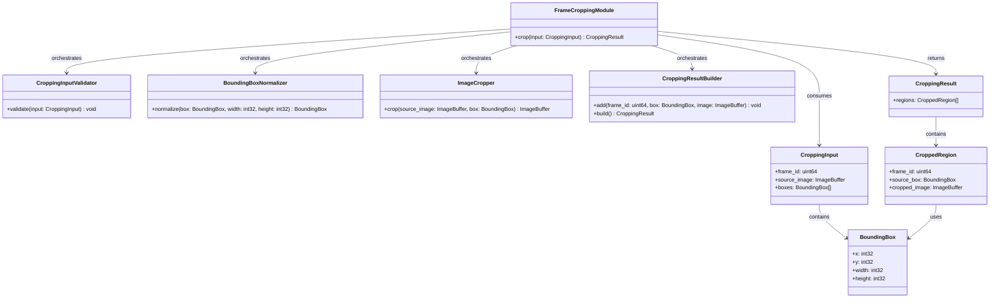
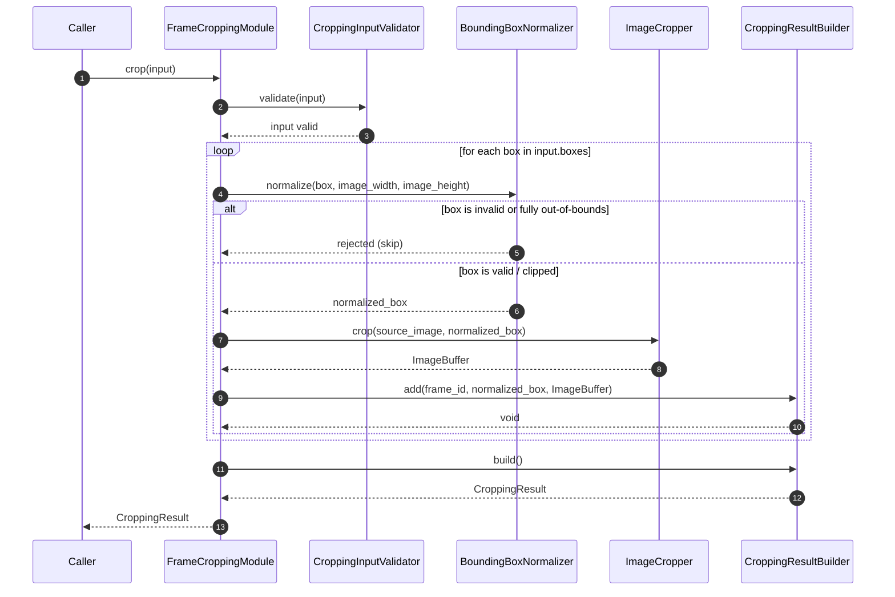

# Frame Cropping Module Specification

## 1. Overview

The Frame Cropping Module is responsible for extracting rectangular pixel regions from a source image based on a set of provided bounding boxes. Each valid bounding box produces one cropped image that contains only the pixel data within that region.

The module performs exclusively geometric cropping. It does not perform inference, preprocessing (no resize, normalization, color conversion, layout conversion, or dtype conversion), raw payload decoding, or any modification to the source image. It maintains no internal state and produces a fully deterministic result for any given input.

---

## 2. Input Definition

### 2.1 BoundingBox

```text
struct BoundingBox {
    int32 x;        // top-left x coordinate in pixels
    int32 y;        // top-left y coordinate in pixels
    int32 width;    // box width in pixels
    int32 height;   // box height in pixels
}
```

`(x, y)` is the top-left corner of the region. `width` and `height` define the extent of the region in pixels. All values are expressed relative to the coordinate space of `source_image`.

### 2.2 CroppingInput

```text
struct CroppingInput {
    uint64              frame_id;
    ImageBuffer         source_image;
    vector<BoundingBox> boxes;
}
```

- `frame_id` identifies the source frame for traceability and is preserved in each output region.
- `source_image` is a fully decoded image buffer. The module does not decode or prepare the image.
- `boxes` is the set of regions to extract. All coordinates in `boxes` are expressed relative to `source_image`. `boxes` may contain zero, one, or multiple entries.

---

## 3. Output Definition

### 3.1 CroppedRegion

```text
struct CroppedRegion {
    uint64      frame_id;
    BoundingBox source_box;
    ImageBuffer cropped_image;
}
```

- `frame_id` is copied from `CroppingInput.frame_id` for traceability.
- `source_box` is the normalized bounding box used to extract the region, expressed in `source_image` coordinates.
- `cropped_image` contains only the pixel data within `source_box`.

### 3.2 CroppingResult

```text
struct CroppingResult {
    vector<CroppedRegion> regions;
}
```

### 3.3 Output Semantics

- Each entry in `regions` corresponds to exactly one valid input bounding box.
- `regions.size()` ≤ `input.boxes.size()`. Invalid or fully out-of-bounds boxes do not produce output entries.
- Cropped images contain only the pixel data within the normalized bounding box region. No border, padding, or fill is added.
- `source_box` in each `CroppedRegion` reflects the final normalized or clipped box used for extraction, not the raw input box.
- No additional metadata, transformations, or preprocessing are applied to the cropped output.
- If `boxes` is empty, `regions` is empty. This is normal operation and not an error.

---

## 4. Module Responsibilities

### In Scope

- Validating `CroppingInput` structure and `source_image`
- Validating each `BoundingBox`
- Normalizing or clipping bounding boxes that partially extend beyond image boundaries
- Rejecting bounding boxes that are fully out-of-bounds or have zero area
- Extracting pixel regions from `source_image` using validated, normalized bounding boxes
- Constructing `CroppedRegion` and `CroppingResult` output structures

### Out of Scope

The Frame Cropping Module does NOT:

- Decode raw image payloads
- Perform image preprocessing (resize, normalization, color conversion, layout conversion, dtype conversion)
- Run inference
- Apply decision or filtering logic beyond bounding box geometric validation
- Maintain state across calls
- Modify `source_image` in any way

---

## 5. Internal Components

### 5.1 CroppingInputValidator

`CroppingInputValidator` is responsible for validating the `CroppingInput` structure before any processing begins.

Its responsibilities are:

- verify that `frame_id` is present
- verify that `source_image` is non-null and has positive width and height
- verify that `boxes` is present (may be empty; empty is valid)

`CroppingInputValidator` does not validate individual bounding boxes. It does not perform any image processing and makes no per-box decisions.

### 5.2 BoundingBoxNormalizer

`BoundingBoxNormalizer` is responsible for validating and normalizing each individual `BoundingBox` against the dimensions of `source_image`.

Its responsibilities are:

- reject any box where `width ≤ 0` or `height ≤ 0`
- reject any box whose region is entirely outside `source_image` bounds
- clip any box that partially extends beyond `source_image` boundaries so that the resulting box fits within the image
- reject any clipped box whose resulting area is zero
- return a valid, normalized `BoundingBox` ready for pixel extraction, or signal rejection

`BoundingBoxNormalizer` does not perform pixel operations and makes no decisions based on image content.

### 5.3 ImageCropper

`ImageCropper` is responsible for the pixel region extraction operation.

Its responsibilities are:

- accept a validated, normalized `BoundingBox` and `source_image`
- extract the rectangular pixel region defined by the box from `source_image`
- return an `ImageBuffer` containing only the extracted pixel data
- not modify `source_image`

`ImageCropper` does not perform bounding box validation or normalization. It operates only on boxes that have already been validated and normalized by `BoundingBoxNormalizer`.

### 5.4 CroppingResultBuilder

`CroppingResultBuilder` is responsible for assembling the final `CroppingResult` from individual cropped regions.

Its responsibilities are:

- accept each `ImageBuffer` produced by `ImageCropper` together with its corresponding normalized `BoundingBox` and the source `frame_id`
- construct a `CroppedRegion` for each valid extraction
- accumulate all `CroppedRegion` entries across the bounding box iteration
- assemble and return the completed `CroppingResult`

`CroppingResultBuilder` does not perform bounding box validation, image operations, or any preprocessing.

---

## 6. Internal Pipeline

For one invocation of `crop`, the internal pipeline follows this order:

**CroppingInputValidator → BoundingBoxNormalizer → ImageCropper → CroppingResultBuilder**

1. `FrameCroppingModule` receives `CroppingInput`.
2. `FrameCroppingModule` calls `CroppingInputValidator.validate(input)`. On failure, `ValidationError` is raised and processing stops immediately.
3. `FrameCroppingModule` iterates over `input.boxes`. For each box:
   - a. `FrameCroppingModule` calls `BoundingBoxNormalizer.normalize(box, image_width, image_height)`.
   - b. If the box is invalid or fully out-of-bounds, it is silently skipped. Processing continues with the next box.
   - c. If the box is valid and normalized, `FrameCroppingModule` calls `ImageCropper.crop(source_image, normalized_box)` → `ImageBuffer`.
   - d. If cropping fails, `CroppingError` is raised and processing stops immediately.
   - e. `FrameCroppingModule` calls `CroppingResultBuilder.add(frame_id, normalized_box, image_buffer)`.
4. `FrameCroppingModule` calls `CroppingResultBuilder.build()` → `CroppingResult`.
5. `FrameCroppingModule` returns `CroppingResult`.

All intermediate data remain strictly internal to the module.

---

## 7. Bounding Box Rules

The following rules are applied by `BoundingBoxNormalizer` for each input bounding box:

- `width` must be greater than zero. A box with `width ≤ 0` is rejected.
- `height` must be greater than zero. A box with `height ≤ 0` is rejected.
- `x` must be less than `source_image.width`. A box whose `x ≥ source_image.width` is fully outside the image and is rejected.
- `y` must be less than `source_image.height`. A box whose `y ≥ source_image.height` is fully outside the image and is rejected.
- A box with a negative `x` is clipped: the left edge is moved to `x = 0` and `width` is reduced by `abs(original_x)`.
- A box with a negative `y` is clipped: the top edge is moved to `y = 0` and `height` is reduced by `abs(original_y)`.
- A box whose right edge (`x + width`) extends beyond `source_image.width` is clipped so that `width = source_image.width - x`.
- A box whose bottom edge (`y + height`) extends beyond `source_image.height` is clipped so that `height = source_image.height - y`.
- After clipping, if the resulting `width ≤ 0` or `height ≤ 0`, the box is rejected.
- Any rejected box is silently skipped. It does not produce a `CroppedRegion` in the output.

---

## 8. Statelessness

The Frame Cropping Module is fully stateless.

- No data is retained between invocations.
- No previous `CroppingInput`, source images, or cropped results are stored.
- Each call to `crop` is fully independent of all prior and subsequent calls.
- The module holds no per-session, per-camera, or per-frame internal state.
- Multiple concurrent invocations with different inputs produce independent results without interference.

---

## 9. Error Handling

### 9.1 Error Types

```text
ValidationError   // raised when CroppingInput or source_image fails structural validation
CroppingError     // raised when pixel extraction fails for a valid, normalized bounding box
```

### 9.2 Error Rules

- **Invalid `source_image`** — if `source_image` is null, missing, or has non-positive dimensions, `CroppingInputValidator` raises `ValidationError`. Fatal. No output is produced.
- **Malformed `CroppingInput`** — if `CroppingInput` itself is null or structurally invalid, `CroppingInputValidator` raises `ValidationError`. Fatal. No output is produced.
- **Invalid individual bounding box** — boxes that fail bounding box rules (Section 7) are silently skipped. Non-fatal. Processing continues with remaining boxes.
- **Empty `boxes`** — not an error. `CroppingResult` is returned with an empty `regions` list.
- **All boxes rejected** — not an error. `CroppingResult` is returned with an empty `regions` list.
- **Pixel extraction failure** — if `ImageCropper.crop` fails for a validated, normalized box, `CroppingError` is raised. Fatal. No partial output is produced.

---

## 10. Class Diagram (Mermaid)



---

## 11. Sequence Diagram (Mermaid)



---

## 12. Design Principles

- **Deterministic behavior** — the same `CroppingInput` always produces the same `CroppingResult`. No randomness, timestamps, or external state influences the output.
- **No side effects** — the module does not modify `source_image`, does not write to external storage, and does not alter any external state during or after invocation.
- **Immutable input** — `source_image` and `boxes` are treated as read-only. The module never modifies any field of the input structures.
- **Single responsibility** — each internal component owns exactly one concern: input validation, bounding box normalization, pixel extraction, or result assembly. No component performs work outside its defined scope.
- **Separation of concerns** — bounding box geometry decisions (`BoundingBoxNormalizer`) are fully decoupled from pixel operations (`ImageCropper`) and output assembly (`CroppingResultBuilder`).
- **Fail-fast on structural errors** — invalid `source_image` or malformed `CroppingInput` terminates processing immediately via `ValidationError`. Per-box failures are handled locally without propagating a fatal error.
- **Graceful degradation** — invalid individual bounding boxes are silently skipped, allowing remaining valid boxes to produce output without interruption.
- **Output fidelity** — cropped images contain only the pixel data of the extracted region. No padding, fill, border, or scaling is applied.
