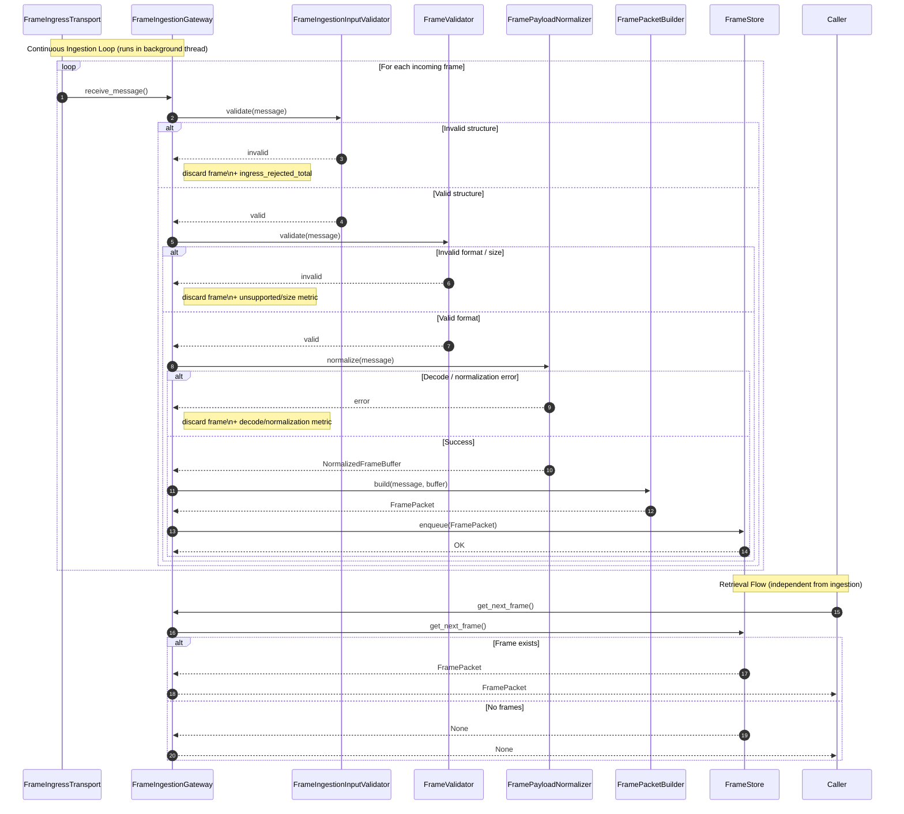
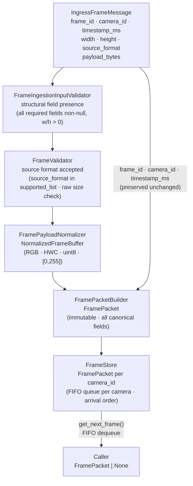

# Frame Ingestion Gateway Module Specification

## 1. Scope

### Purpose

The Frame Ingestion Gateway is responsible for receiving frame data from external camera sources, including webcams and home/IP cameras, normalizing the incoming payload into a unified raw pixel representation, constructing immutable FramePacket objects, and enqueueing accepted frames into per-camera FIFO queues.

It is the entry boundary between external camera streams and the internal frame-processing pipeline.

### In Scope

- Receiving raw ingress frame messages over a configured transport connection
- Performing structural validation on all required fields of each ingress message
- Validating source format acceptance and field constraints
- Decoding supported encoded camera formats (JPEG, MJPEG) when needed
- Interpreting raw pixel formats (RGB, BGR, GRAY8, YUV420, NV12, YUY2) using declared source metadata
- Normalizing every accepted frame into one unified output format: RGB, HWC, uint8, [0,255]
- Rejecting invalid frames internally — no rejection state is propagated outside the module
- Constructing immutable FramePacket objects from normalized frame data
- Enqueueing each accepted FramePacket into the per-camera FIFO queue in FrameStore
- Exposing `get_next_frame()` for pull-based retrieval of the next queued frame
- Managing transport endpoint lifecycle: `start()`, `stop()`, `configure(config)`, `health()`

### Out of Scope

The Frame Ingestion Gateway does NOT:

- Crop images — handled outside this module
- Resize images for model needs — handled outside this module
- Normalize pixel values to float ranges — handled outside this module
- Create model-ready inputs — handled outside this module
- Perform detection or inference — handled outside this module
- Manage current/previous frame relationships or cross-frame temporal state — handled outside this module
- Decide which processing stage uses the frame — handled outside this module
- Initiate outbound connections to frame sources — handled outside this module
- Manage reconnection policy for transport streams — handled outside this module
- Expose raw ingress messages, transport metadata, or validation flags
- Perform any downstream processing or orchestrate any downstream component

---

## 2. Input

### 2.1 Input Responsibility Boundary

The module receives raw ingress frame messages from an external source over the configured transport. The following have already been applied before the message arrives:

- Frame capture at the originating source
- Stream initiation — the source manages outbound connection setup
- Transport-layer framing and delivery — the transport layer handles connection management

The Frame Ingestion Gateway does not perform any of the above. Only ingress reception, field validation, payload normalization, and FramePacket construction are performed inside this module.

### 2.2 Input Structure

```text
struct IngressFrameMessage {
    string frame_id;
    string camera_id;
    uint64 timestamp_ms;
    int32  width;
    int32  height;
    string source_format;
    string source_layout             | optional;
    int32  source_num_color_channels | optional;
    int32  source_bits_per_channel   | optional;
    bytes  payload_bytes;
}
```

`payload_bytes` are the original incoming bytes from the camera source. The Gateway decodes or interprets them according to `source_format`.

`source_format` may be one of: `RGB`, `BGR`, `GRAY8`, `YUV420`, `NV12`, `YUY2`, `JPEG`, `MJPEG`.

### 2.3 Supported Source Formats

**Raw input formats** (pixel data already in memory):

| Format  | Description                        |
|---------|------------------------------------|
| RGB     | 3-channel, 8-bit per channel, HWC  |
| BGR     | 3-channel, 8-bit per channel, HWC  |
| GRAY8   | 1-channel, 8-bit grayscale         |
| YUV420  | Planar YUV, 4:2:0 subsampling      |
| NV12    | Semi-planar YUV 4:2:0 (Y + UV)     |
| YUY2    | Packed YUV 4:2:2                   |

**Encoded camera formats** (compressed, require decoding):

| Format | Description                              |
|--------|------------------------------------------|
| JPEG   | Single JPEG-encoded frame                |
| MJPEG  | Motion JPEG stream frame                 |

> **Note on H264:** H264 is not supported in the current version due to its stateful decoding requirements and incompatibility with the per-message processing model. Support for H264 may be introduced in a future version with a stateful decoder design.

> **Note on PNG:** PNG is not included. It is not required for live camera streams and must not be accepted unless explicitly configured for test image use.

### 2.4 Validation Rules

Validation is split into two levels applied sequentially.

#### A. Structural Validation (`FrameIngestionInputValidator`)

Verifies that all required fields are present before deeper processing begins:

- `frame_id` must exist and be non-empty
- `camera_id` must exist and be non-empty
- `timestamp_ms` must exist
- `width` must be a positive integer (`> 0`)
- `height` must be a positive integer (`> 0`)
- `source_format` must exist and be non-empty
- `payload_bytes` must exist and be non-empty

`FrameIngestionInputValidator` does not validate payload size, source format legality, or encoding-specific constraints.

#### B. Source Format Validation

Verifies format legality and, for raw formats, payload size consistency:

- `source_format` must be a value in the configured `supported_source_formats` list
- For raw formats (RGB, BGR, GRAY8, YUV420, NV12, YUY2): `payload_bytes` size must be consistent with the declared `width`, `height`, and `source_num_color_channels` / `source_bits_per_channel` metadata when present
- For encoded formats (JPEG, MJPEG): the raw byte-size formula is **not** applied before decoding; payload size is accepted as-is
- For encoded formats, decoded dimensions are **authoritative**. If declared `width`/`height` are present and differ from the decoded frame dimensions, a `FrameNormalizationError` is raised and the frame is discarded

#### Raw Format Byte-Size Formulas

For raw formats, `payload_bytes` size must exactly match the expected value from the table below. If `source_num_color_channels` or `source_bits_per_channel` are absent, use the format-default values from this table. If the actual size does not match the expected value, raise `PayloadSizeMismatchError`.

| Format  | Expected bytes formula           | Dimension constraint               | Default channels | Default bits/channel |
|---------|----------------------------------|------------------------------------|------------------|----------------------|
| RGB     | `width × height × 3`            | None                               | 3                | 8                    |
| BGR     | `width × height × 3`            | None                               | 3                | 8                    |
| GRAY8   | `width × height × 1`            | None                               | 1                | 8                    |
| YUV420  | `width × height × 3 / 2`        | width and height must both be even | —                | 8                    |
| NV12    | `width × height × 3 / 2`        | width and height must both be even | —                | 8                    |
| YUY2    | `width × height × 2`            | None                               | —                | 8                    |

For YUV420 and NV12, if `width` or `height` is odd, raise `PayloadSizeMismatchError`.

#### Source Format vs. Output Format Rule

> `source_format` describes the format of the **incoming camera payload**.
>
> `FramePacket.pixel_format` describes the **normalized output format** produced by the Gateway.
>
> After successful processing:
> - `FramePacket.pixel_format` is always `RGB`
> - `FramePacket.layout` is always `HWC`
> - `FramePacket.image_bytes` always contains raw unencoded RGB pixels

### 2.5 Input Semantics

- `frame_id` — unique frame identifier assigned by the source; preserved unchanged for traceability
- `camera_id` — source camera identifier; used as the FrameStore slot key and preserved for traceability
- `timestamp_ms` — capture timestamp in milliseconds since epoch; preserved unchanged for traceability
- `width` — declared frame width in pixels; used for validation and as the authoritative value for raw formats
- `height` — declared frame height in pixels; used for validation and as the authoritative value for raw formats
- `source_format` — pixel color space or encoding of the incoming `payload_bytes`; validated against `supported_source_formats`; determines how the Gateway decodes or interprets the payload
- `source_layout` — optional layout hint for raw formats (e.g., `HWC`, `CHW`)
- `source_num_color_channels` — optional channel count hint for raw format byte-size validation
- `source_bits_per_channel` — optional bit-depth hint for raw format byte-size validation
- `payload_bytes` — the original incoming bytes from the camera source; decoded or interpreted by `FramePayloadNormalizer` according to `source_format`

---

## 3. Output

### 3.1 Output Structure

```text
struct FramePacket {
    string frame_id;
    string camera_id;
    uint64 timestamp_ms;
    int32  width;
    int32  height;
    string pixel_format;        // always "RGB" after normalization
    string layout;              // always "HWC"
    int32  num_color_channels;  // always 3
    int32  bits_per_channel;    // always 8
    bytes  image_bytes;         // raw RGB pixels, HWC order, unencoded
}
```

FramePacket is immutable after construction. No field may be modified after `FramePacketBuilder.build()` returns.

FramePacket is the canonical frame representation of the module and must not be altered after construction.

### 3.2 Canonical FramePacket Image Format

Every FramePacket produced by the Gateway contains raw, unencoded RGB pixel data in the following canonical format:

| Field               | Value              |
|---------------------|--------------------|
| `pixel_format`      | `RGB`              |
| `layout`            | `HWC`              |
| `dtype`             | `uint8`            |
| `value_range`       | `[0, 255]`         |
| `num_color_channels`| `3`                |
| `bits_per_channel`  | `8`                |
| `image_bytes`       | raw RGB pixel bytes in HWC order |

### 3.3 Output Semantics

- `frame_id`, `camera_id`, `timestamp_ms` — copied unchanged from the validated IngressFrameMessage for traceability
- `width`, `height` — frame dimensions; for encoded formats, taken from the decoded output (authoritative); for raw formats, taken from the validated message
- `pixel_format` — always `RGB`; the Gateway normalizes all source formats to RGB before constructing the FramePacket
- `layout` — always `HWC`; the Gateway ensures the canonical layout before constructing the FramePacket
- `num_color_channels` — always `3`; RGB has three channels
- `bits_per_channel` — always `8`; uint8 representation with 8 bits per channel
- `image_bytes` — raw unencoded RGB pixel bytes in HWC order; the result of normalization, not a passthrough from the source payload

### 3.4 Output Constraints

The output must NOT expose:

- Transport metadata or ingress envelope fields not part of the canonical frame definition
- Validation state, rejection flags, or validation error details
- Intermediate construction state or partial FramePacket instances
- Encoding hints, compression identifiers, or codec information
- Internal transport stream identifiers or connection state
- Source-side format metadata (source_format, source_layout, source_num_color_channels, source_bits_per_channel)

All validation logic, transport parsing, payload decoding, and normalization are strictly internal. The only externally visible result is a fully validated, normalized, immutable `FramePacket`.

---

## 4. Public API

```text
FramePacket | None  get_next_frame()
void                configure(config: FrameIngestionGatewayConfig)
void                start()
void                stop()
GatewayHealth       health()
```

The API must remain stable regardless of which transport implementation is configured. Configuration is provided via `configure(config)` before `start()` and remains immutable afterward.

---

## 5. Non-Functional Requirements

- **FIFO ordering per camera** — frames are enqueued in arrival order and dequeued in the same order; no frame overtakes another within the same camera queue; frames for each `camera_id` are enqueued in arrival order, and arrival order must reflect capture order
- **Isolation between camera queues** — each `camera_id` has an independent queue; the state of one camera's queue does not affect any other camera's queue
- **Single frame per `get_next_frame()` call** — the module returns exactly one `FramePacket` or `None` per retrieval call; the caller is responsible for its own pull loop
- **Real-time capable** — suitable for per-frame online ingestion and retrieval at camera-stream rates
- **Deterministic** — same ingress message and same configuration always produce the same FramePacket or the same rejection outcome; enqueue and dequeue operations are deterministic and ordering-stable; determinism for pixel-format conversion (YUV, GRAY8) is guaranteed for a given implementation and library version
- **Transport-agnostic API** — the public output schema (`FramePacket`) and `get_next_frame()` signature are independent of the underlying transport implementation
- **Strict isolation** — no internal transport artifacts, stream identifiers, or ingress envelope data escape through the public API
- **Concurrency Model**:
  - Ingestion of ingress messages is continuous and asynchronous.
  - Retrieval via `get_next_frame()` may occur concurrently with ingestion.
  - `FrameStore` must be thread-safe for concurrent enqueue and dequeue operations.
  - Enqueue operations must be visible to subsequent dequeue operations across threads.

---

## 6. Processing Engine

### 6.1 Engine Abstraction Interface

```text
interface FrameIngressTransport {
    void                bind_and_start(config: FrameIngestionGatewayConfig)
    void                stop()
    IngressFrameMessage receive_message()    // blocking; waits for the next available IngressFrameMessage
}
```

### 6.2 Current Default Implementation

```text
class GrpcFrameIngressTransport implements FrameIngressTransport
```

`GrpcFrameIngressTransport` is a protocol-based transport engine (gRPC streaming). It hosts a server-side receiving endpoint, accepts inbound frame streams, and delivers `IngressFrameMessage` objects to the orchestrator.

### 6.3 Replaceability

The module depends on the `FrameIngressTransport` interface, not on `GrpcFrameIngressTransport` directly. Any transport implementation (gRPC, WebSocket, shared memory, etc.) may be substituted without changing `FramePacket`, `get_next_frame()`, or any other part of the public API. Replacing the transport does NOT affect the public API.

---

## 7. Acceptance / Filtering Logic

Frame acceptance is managed by the two-level validation pipeline followed by normalization. `FrameIngestionInputValidator` and the source-format validation step are the exclusive decision makers.

- `FrameIngressTransport` delivers a raw `IngressFrameMessage` to the orchestrator. It does not inspect field values or payload integrity.
- `FrameIngestionInputValidator` applies structural validation:
  - If any required field is missing, empty, or has a non-positive dimension → reject the frame; increment `ingress_rejected_total`; continue to the next message
- Source format validation applies format legality and payload consistency:
  - If `source_format` is not in the configured `supported_source_formats` list → reject; increment `unsupported_source_format_total`; continue
  - For raw formats: if payload size is inconsistent with declared metadata → reject; increment `ingress_rejected_total`; continue
  - For encoded formats: no byte-size check before decoding
- `FramePayloadNormalizer` decodes or interprets the payload and normalizes to RGB/HWC/uint8/[0,255]:
  - If decoding fails → discard; increment `decode_failed_total`; continue
  - If normalization fails or decoded dimensions differ from declared width/height → discard; increment `normalization_failed_total`; continue
- On success: pass `NormalizedFrameBuffer` to `FramePacketBuilder`
- Validation rules are loaded from configuration at initialization. They are immutable and not adjustable per invocation.
- No rejection flags or validation reasons are returned to the caller.

---

## 8. Internal Pipeline

### 8.1 FrameIngestionGateway

`FrameIngestionGateway` is the orchestration layer only. It owns no ingress parsing, validation, normalization, packet construction, or storage logic.

Its responsibilities are:

- receive each `IngressFrameMessage` from `FrameIngressTransport`
- invoke internal subcomponents in the correct order
- pass results between components through the pipeline
- expose `get_next_frame()` by delegating to `FrameStore`
- return the final `FramePacket` or `None` to the caller

During initialization, `FrameIngestionGateway` is responsible for loading the module configuration and wiring each internal subcomponent with its required settings, including injecting `supported_source_formats` into `FrameValidator`, transport configuration into `FrameIngressTransport`, and storage configuration into `FrameStore`.

`FrameIngestionGateway` must not embed validation, payload inspection, normalization, packet construction, or storage logic directly. Each of those responsibilities belongs to a dedicated internal component.

**Ingestion loop:** `FrameIngestionGateway` owns the ingestion loop. On `start()`, it launches a dedicated background thread that continuously calls `FrameIngressTransport.receive_message()` (a blocking call) and processes each returned `IngressFrameMessage` through the validation/normalization/enqueue pipeline. The ingestion thread is stopped when `stop()` is called.

### 8.2 FrameIngestionInputValidator

`FrameIngestionInputValidator` is responsible only for structural message presence validation. It verifies that the incoming `IngressFrameMessage` carries all required fields before deeper processing begins.

Validation rules:

- `frame_id` must exist and be non-empty
- `camera_id` must exist and be non-empty
- `timestamp_ms` must exist
- `width` must be a positive integer
- `height` must be a positive integer
- `source_format` must exist and be non-empty
- `payload_bytes` must exist and be non-null and non-empty

`FrameIngestionInputValidator` does not validate source format legality, payload size, or encoding-specific constraints. It does not make any acceptance decisions beyond field presence and basic dimension checks.

### 8.3 FrameIngressTransport

`FrameIngressTransport` is the internal transport reception abstraction used by the module.

Its responsibilities are:

- accept and maintain inbound transport connections from external frame sources
- receive raw frame messages from each accepted connection
- deliver `IngressFrameMessage` objects to the orchestrator

`FrameIngressTransport` does not validate field values, payload sizes, or source formats. It returns raw transport messages only.

`GrpcFrameIngressTransport` is the current default implementation of `FrameIngressTransport`. The module depends on the `FrameIngressTransport` abstraction, not on `GrpcFrameIngressTransport` directly, so a different transport can be substituted without changing `FramePacket`, `get_next_frame()`, or any other part of the public API.

### 8.4 FrameValidator

`FrameValidator` is responsible for source format validation and, for raw formats, payload size consistency. It is applied after structural validation and before normalization.

Its responsibilities are:

- receive a structurally valid `IngressFrameMessage` from the orchestrator
- verify `source_format` is in the configured `supported_source_formats` list
- for raw formats: verify payload size consistency using the per-format byte-size formulas defined in Section 2.4B; use format-default values when `source_num_color_channels` or `source_bits_per_channel` are absent
- for encoded formats: skip raw byte-size formula; the payload is accepted as-is pending decode
- return `valid` or `invalid`; on `invalid`, increment the appropriate metric counter

`FrameValidator` must not build `FramePacket` objects, access `FrameStore`, normalize payloads, or perform any transport operations.

### 8.5 FramePayloadNormalizer

`FramePayloadNormalizer` normalizes an `IngressFrameMessage` payload into a canonical `NormalizedFrameBuffer`.

Its responsibilities are:

- receive a validated `IngressFrameMessage`
- if `source_format` is an encoded format (JPEG, MJPEG): decode `payload_bytes` into raw pixel data
- if `source_format` is a raw format (RGB, BGR, GRAY8, YUV420, NV12, YUY2): interpret `payload_bytes` using `source_format` and declared source metadata
- if `source_layout` is `CHW`: transpose the array to HWC before further processing; if absent or `HWC`: no transposition required
- convert the result to RGB color space
- ensure layout is HWC
- ensure dtype is uint8
- ensure value range is [0, 255]
- return a `NormalizedFrameBuffer`

On failure (decode error, format conversion error, or decoded dimensions mismatching declared dimensions), raise the appropriate error and let the orchestrator discard the frame.

**Per-format normalization rules:**

**GRAY8 → RGB:** GRAY8 payloads are expanded to RGB by replicating the grayscale value across all three channels: `R = G = B = pixel_value`.

**YUV420, NV12, YUY2 → RGB:**
- Assume full-range YUV (0–255 for all components).
- Use BT.601 conversion matrix.
- Conversion must be deterministic within a given implementation and library version. Exact pixel values may vary slightly across libraries but must be stable within a single deployment.

**JPEG and MJPEG decode rules:**
- MJPEG frames are decoded identically to JPEG. Each `IngressFrameMessage` carrying an MJPEG payload contains exactly one JPEG-encoded frame; the format label is a semantic distinction for the source stream type only.
- EXIF orientation metadata is ignored; no auto-rotation is applied.
- If a decoded JPEG produces a 1-channel (grayscale) image, it is expanded to RGB using the GRAY8 rule: `R = G = B = pixel_value`.
- If a decoder returns a 4-channel (RGBA) image, the alpha channel is discarded and only the RGB channels are retained.

**Method:**

```text
normalize(message: IngressFrameMessage) -> NormalizedFrameBuffer
```

`FramePayloadNormalizer` must not validate field presence, access `FrameStore`, build `FramePacket` objects, or perform any transport operations.

### 8.6 FramePacketBuilder

`FramePacketBuilder` constructs an immutable `FramePacket` from a validated `IngressFrameMessage` and a `NormalizedFrameBuffer`.

Its responsibilities are:

- receive a validated `IngressFrameMessage` and a `NormalizedFrameBuffer`
- copy identity fields from `IngressFrameMessage`: `frame_id`, `camera_id`, `timestamp_ms`
- take all image fields from `NormalizedFrameBuffer`:
  - `width`, `height`
  - `pixel_format` = `RGB`
  - `layout` = `HWC`
  - `num_color_channels` = `3`
  - `bits_per_channel` = `8`
  - `image_bytes` = normalized RGB pixels
- return an immutable `FramePacket`

`FramePacketBuilder` must not perform validation, normalize payloads, or write to `FrameStore`.

### 8.7 FrameStore

`FrameStore` provides per-camera FIFO queue storage and ordered retrieval. It is the only component with knowledge of the frame storage state.

Its responsibilities are:

- maintain one FIFO queue per `camera_id`
- accept `enqueue(frame_packet)` calls and append the given `FramePacket` to the tail of the queue for the corresponding `camera_id`
- preserve enqueue order within each camera's queue; no frame overtakes another within the same queue
- return the next available `FramePacket` on `get_next_frame()` by dequeuing the head of the next non-empty camera queue using round-robin over the fixed and stable camera ordering defined by `camera_order`; return `None` if all queues are empty; empty queues must be skipped during selection
- if the maximum number of camera queues (`max_camera_slots`) is reached, new `camera_id` values must be rejected; no additional cameras are tracked beyond this limit; rejected frames must be discarded and must not be enqueued; `camera_slot_rejected_total` is incremented for each discarded frame
- per-camera queues are unbounded unless otherwise specified by configuration
- `FrameStore` must not mutate any `FramePacket` after it has been enqueued; this is a strict invariant
- `FramePacket` objects are immutable after enqueue; queues store only normalized FramePacket objects
- `start()` initializes internal queue state; `stop()` releases resources without clearing enqueued frames — frames already in queues remain retrievable via `get_next_frame()` after `stop()`; `health()` returns a `StoreHealth` report containing current queue state

`FrameStore` must not make validation or acceptance decisions, parse ingress messages, or perform transport operations.

**Unknown `camera_id` behavior:** If a frame arrives with a `camera_id` not present in `camera_order` and `max_camera_slots` has not been reached, the new `camera_id` is appended to the end of `camera_order` and a queue is created for it. If `max_camera_slots` has been reached, the frame is discarded and `camera_slot_rejected_total` is incremented.

**Queue capacity policy:** Per-camera queues are unbounded by default. This is a deliberate design choice; callers are responsible for timely consumption via `get_next_frame()`.

### 8.8 End-to-End Processing Flow

For each ingress message received, the internal pipeline follows this order:

**receive message → structural validation → source format validation → normalize → build FramePacket → enqueue**

For retrieval:

**get_next_frame → select next non-empty camera queue → dequeue head frame → return FramePacket or None**

**Ingress path (per received message):**

1. `FrameIngestionGateway` receives `IngressFrameMessage` from `FrameIngressTransport.receive_message()`.
2. `FrameIngestionGateway` calls `FrameIngestionInputValidator.validate(message)` → valid or invalid.
3. On invalid: `FrameIngestionGateway` discards the message and continues to the next message. No output is produced.
4. On valid: `FrameIngestionGateway` calls `FrameValidator.validate(message)` → valid or invalid.
5. On invalid: `FrameIngestionGateway` discards the message, increments the appropriate metric counter, and continues.
6. On valid: `FrameIngestionGateway` calls `FramePayloadNormalizer.normalize(message)` → `NormalizedFrameBuffer`.
7. On normalization or decode error: `FrameIngestionGateway` discards the message, increments the appropriate metric counter, and continues.
8. On success: `FrameIngestionGateway` calls `FramePacketBuilder.build(message, buffer)` → `FramePacket`.
9. `FrameIngestionGateway` calls `FrameStore.enqueue(frame_packet)`.

**Retrieval path:**

10. Caller calls `FrameIngestionGateway.get_next_frame()`.
11. `FrameIngestionGateway` calls `FrameStore.get_next_frame()` → `FramePacket | None`.
12. `FrameStore` selects the next non-empty camera queue using round-robin over the fixed camera ordering defined by `camera_order`, dequeues the head frame, and returns it; returns `None` if all queues are empty.
13. `FrameIngestionGateway` returns `FramePacket | None` to the caller.

All intermediate data (`IngressFrameMessage`, `NormalizedFrameBuffer`, validation state, construction intermediates) remain strictly internal to the module.

---

## 9. Configuration

### 9.1 Configuration Parameters

```text
struct FrameIngestionGatewayConfig {
    string         bind_address;             // transport receiving endpoint address; e.g., "0.0.0.0:50061"
    string         service_name;             // transport service identifier
    int32          max_concurrent_streams;   // maximum simultaneous ingress streams accepted
    int32          max_camera_slots;         // maximum number of cameras tracked by FrameStore; limits how many per-camera queues are maintained
    vector<string> camera_order;             // defines the deterministic ordering of camera_id values used by FrameStore when selecting the next queue during retrieval
    vector<string> supported_source_formats; // allowed source_format values; e.g., ["RGB","BGR","GRAY8","YUV420","NV12","YUY2","JPEG","MJPEG"]
}
```

### 9.2 Loading Behavior

Configuration is loaded exactly once during module initialization. It is immutable after initialization and reused unchanged across all invocations. No configuration parameter is part of `IngressFrameMessage` or `FramePacket`.

Injection at construction time:

- `supported_source_formats` → `FrameValidator`
- `bind_address`, `service_name`, `max_concurrent_streams` → `FrameIngressTransport`
- `max_camera_slots`, `camera_order` → `FrameStore`; `camera_order` defines the deterministic ordering of `camera_id` values used by `FrameStore` when selecting the next queue during retrieval
- `FrameIngressTransport` is injected as an abstract dependency, with `GrpcFrameIngressTransport` as the default implementation

---

## 10. Internal Data Structures

- **`IngressFrameMessage`** — raw transport message containing all frame fields and the camera payload bytes; produced by `FrameIngressTransport`, consumed by `FrameIngestionInputValidator`, `FrameValidator`, `FramePayloadNormalizer`, and `FramePacketBuilder`; lifecycle: per-call
- **`NormalizedFrameBuffer`** — intermediate structure containing normalized RGB pixel data; produced by `FramePayloadNormalizer`, consumed by `FramePacketBuilder`; lifecycle: per-call

```text
struct NormalizedFrameBuffer {
    int32  width;
    int32  height;
    string color_format;        // RGB
    string layout;              // HWC
    string dtype;               // uint8
    string value_range;         // [0,255]
    int32  num_color_channels;  // 3
    int32  bits_per_channel;    // 8
    bytes  image_bytes;         // raw RGB pixels
}
```

- **`FramePacket`** — canonical immutable frame object containing all frame fields and `image_bytes`; produced by `FramePacketBuilder`, enqueued by `FrameStore`, returned by `get_next_frame()`; lifecycle: persistent until dequeued
- **`GatewayHealth`** — health status report containing transport state and store state; produced by `FrameIngestionGateway.health()`; lifecycle: per-call

```text
struct GatewayHealth {
    string transport_state;   // "RUNNING" | "STOPPED" | "ERROR"
    string store_state;       // "READY" | "STOPPED"
}
```

- **`StoreHealth`** — health status report for storage state; produced by `FrameStore.health()`; lifecycle: per-call

```text
struct StoreHealth {
    string            state;                    // "READY" | "STOPPED"
    int32             active_cameras;           // number of camera_id slots currently tracked
    int32             total_queued_frames;      // sum of all frames across all queues
    map<string,int32> queue_depth_per_camera;   // per-camera_id current queue depth
}
```

---

## 11. Error Handling

| Error                       | Trigger                                                                                  | Action                                                        |
|-----------------------------|------------------------------------------------------------------------------------------|---------------------------------------------------------------|
| `StructuralValidationError` | Missing/empty required field or non-positive dimension in `IngressFrameMessage`          | Discard message; increment `ingress_rejected_total`; continue |
| `UnsupportedSourceFormatError` | `source_format` not in `supported_source_formats`                                    | Discard message; increment `unsupported_source_format_total`; continue |
| `PayloadSizeMismatchError`  | Raw format: `payload_bytes` size inconsistent with declared metadata                     | Discard message; increment `ingress_rejected_total`; continue |
| `FrameDecodeError`          | Encoded format: `payload_bytes` cannot be decoded (corrupt/unsupported encoding)         | Discard message; increment `decode_failed_total`; continue    |
| `FrameNormalizationError`   | Normalization failure; decoded dimensions differ from declared `width`/`height`          | Discard message; increment `normalization_failed_total`; continue |
| `FrameStoreError`              | `FrameStore` internal failure during enqueue                                          | Discard frame; increment `store_error_total`; continue        |
| `CameraSlotExhaustedError`     | Frame arrives for a new `camera_id` when `max_camera_slots` is already reached        | Discard frame; increment `camera_slot_rejected_total`; continue |

Additional behaviors:
- No partial `FramePacket` is ever returned
- Processing always continues to the next message
- Transport stream disconnect is handled internally by `FrameIngressTransport`; no change to `FrameStore` state
- Empty `FrameStore` (no frame available in any camera queue) → `get_next_frame()` returns `None`; normal operation

---

## 12. Metrics / Observability

**Ingress / transport metrics:**

- `frames_in_total` — total ingress frame messages received by the transport
- `bytes_in_total` — total raw bytes received across all ingress messages
- `active_ingress_streams` — number of currently active inbound transport streams
- `ingest_latency_ms` — time from message receipt to `enqueue` completion

**Validation / normalization metrics:**

- `ingress_rejected_total` — messages rejected due to structural validation failure or payload size mismatch
- `unsupported_source_format_total` — messages rejected due to unsupported `source_format`
- `decode_failed_total` — encoded messages that failed to decode
- `normalization_failed_total` — messages where normalization failed (color conversion, dimension mismatch, etc.)
- `frames_normalized_total` — total frames successfully normalized to RGB/HWC/uint8/[0,255]

**FrameStore metrics:**

- `frames_enqueued_total` — total `FramePacket` objects enqueued across all camera queues
- `frames_dequeued_total` — total `FramePacket` objects returned by `get_next_frame()`
- `queue_depth_per_camera` — current number of queued frames per `camera_id` (labeled per camera)
- `camera_slot_rejected_total` — frames discarded because `max_camera_slots` was already reached when the `camera_id` arrived
- `store_error_total` — `FrameStore` internal failures during enqueue

Metrics are internal and operational. Not part of the public API.

---

## 13. Lifecycle

### 13.1 Initialization

- `configure(config)` must be called before `start()`; it provides the `FrameIngestionGatewayConfig` and wires all internal components; calling `configure()` after `start()` raises `GatewayLifecycleError`
- Initialize the configured `FrameIngressTransport` implementation with `bind_address`, `service_name`, `max_concurrent_streams`
- Initialize `FrameStore` with `max_camera_slots`, `camera_order`
- Initialize `FrameIngestionInputValidator`
- Initialize `FrameValidator` with `supported_source_formats`
- Initialize `FramePayloadNormalizer`
- Initialize `FramePacketBuilder`
- Wire all internal components with injected configuration values
- Call `FrameIngressTransport.bind_and_start()` to begin accepting inbound streams

### 13.2 Per Invocation

**Ingress path:** receive message → structural validation → source format validation → normalize → build FramePacket → enqueue

**Retrieval path:** get_next_frame → select next non-empty camera queue → dequeue head frame → return FramePacket or None

One frame per `get_next_frame()` call.

### 13.3 Shutdown

- Call `FrameIngressTransport.stop()` to stop accepting streams and release transport resources
- Stop the ingestion background thread; no new messages are processed after this point
- Call `FrameStore.stop()` to release internal resources; queued frames are **not** cleared — frames already enqueued remain retrievable via `get_next_frame()` after shutdown

### 13.4 Lifecycle Edge Cases

| Scenario | Behavior |
|----------|----------|
| `get_next_frame()` called before `start()` | Returns `None`; normal operation |
| `start()` called twice | No-op (idempotent); second call is ignored |
| `configure()` called after `start()` | Raises `GatewayLifecycleError` |
| `stop()` called while frames remain queued | Frames are preserved; `get_next_frame()` continues to drain the queues |
| `start()` synchronicity | `start()` returns only after the transport endpoint is successfully bound and the ingestion thread is running |

---

## 14. Class Diagram

```mermaid
classDiagram
    class FrameIngestionGateway {
        +configure(config: FrameIngestionGatewayConfig) void
        +start() void
        +stop() void
        +health() GatewayHealth
        +get_next_frame() FramePacket | None
    }

    class FrameIngestionInputValidator {
        +validate(message: IngressFrameMessage) void
    }

    class FrameIngressTransport {
        <<interface>>
        +bind_and_start(config: FrameIngestionGatewayConfig) void
        +stop() void
        +receive_message() IngressFrameMessage
    }

    class GrpcFrameIngressTransport {
        +bind_and_start(config: FrameIngestionGatewayConfig) void
        +stop() void
        +receive_message() IngressFrameMessage
    }

    class FrameValidator {
        +validate(message: IngressFrameMessage) bool
    }

    class FramePayloadNormalizer {
        +normalize(message: IngressFrameMessage) NormalizedFrameBuffer
    }

    class NormalizedFrameBuffer {
        +width: int32
        +height: int32
        +color_format: string
        +layout: string
        +dtype: string
        +value_range: string
        +num_color_channels: int32
        +bits_per_channel: int32
        +image_bytes: bytes
    }

    class FramePacketBuilder {
        +build(message: IngressFrameMessage, buffer: NormalizedFrameBuffer) FramePacket
    }

    class FrameStore {
        +enqueue(frame_packet: FramePacket) void
        +get_next_frame() FramePacket | None
        +start() void
        +stop() void
        +health() StoreHealth
    }

    class IngressFrameMessage {
        +frame_id: string
        +camera_id: string
        +timestamp_ms: uint64
        +width: int32
        +height: int32
        +source_format: string
        +source_layout: string
        +source_num_color_channels: int32
        +source_bits_per_channel: int32
        +payload_bytes: bytes
    }

    class FramePacket {
        +frame_id: string
        +camera_id: string
        +timestamp_ms: uint64
        +width: int32
        +height: int32
        +pixel_format: string
        +layout: string
        +num_color_channels: int32
        +bits_per_channel: int32
        +image_bytes: bytes
    }

    class FrameIngestionGatewayConfig {
        +bind_address: string
        +service_name: string
        +max_concurrent_streams: int32
        +max_camera_slots: int32
        +camera_order: vector~string~
        +supported_source_formats: vector~string~
    }

    class GatewayHealth {
        +transport_state: string
        +store_state: string
    }

    class StoreHealth {
        +state: string
        +active_cameras: int32
        +total_queued_frames: int32
        +queue_depth_per_camera: map~string_int32~
    }

    FrameIngestionGateway --> FrameIngestionInputValidator : orchestrates
    FrameIngestionGateway --> FrameIngressTransport : orchestrates
    FrameIngestionGateway --> FrameValidator : orchestrates
    FrameIngestionGateway --> FramePayloadNormalizer : orchestrates
    FrameIngestionGateway --> FramePacketBuilder : orchestrates
    FrameIngestionGateway --> FrameStore : orchestrates
    GrpcFrameIngressTransport ..|> FrameIngressTransport : implements
    FramePayloadNormalizer --> NormalizedFrameBuffer : produces
    FramePacketBuilder --> FramePacket : produces
    FrameIngestionGateway --> IngressFrameMessage : consumes
    FrameIngestionGateway --> FramePacket : returns
    FrameIngestionGateway --> FrameIngestionGatewayConfig : configured by
    FrameStore --> StoreHealth : produces
```



---

## 15. Sequence Diagram



---

## 16. Data Flow Diagram



---

## 17. Extensibility

**What can change without breaking the public API:**

- Transport implementation (`GrpcFrameIngressTransport` → any implementation of `FrameIngressTransport`)
- Transport protocol or gRPC version — internal to the transport implementation
- `FrameStore` storage backend (in-memory → persistent store, via configuration)
- `supported_source_formats` list (configuration-only change)
- `max_camera_slots` and `camera_order` (configuration-only changes)
- Normalization internals inside `FramePayloadNormalizer` (e.g., hardware-accelerated decode libraries)

**What must remain stable:**

- `get_next_frame() -> FramePacket | None` signature
- Output schema: `{ frame_id, camera_id, timestamp_ms, width, height, pixel_format="RGB", layout="HWC", num_color_channels=3, bits_per_channel=8, image_bytes }`
- `None` semantics for the no-frame-available and all-failure scenarios
- Canonical format invariants: FramePacket always RGB, HWC, uint8, [0,255]

---

## 18. Relationship to FTL

The Frame Ingestion Gateway produces immutable FramePacket objects in a canonical raw image format: RGB, HWC, uint8, [0,255].

The Frame Transformation Layer (FTL) consumes these FramePacket objects as its input.

- The FTL does **not** communicate with cameras.
- The FTL does **not** decode external camera streams.
- The FTL starts from `FramePacket` and performs storage, cropping, and output conversion according to `OutputImageType`.

The Gateway and the FTL are cleanly separated: the Gateway owns everything up to and including normalization into canonical FramePacket; the FTL owns all downstream transformations.

---

## 19. Module Compliance Checklist

- [ ] One frame per `get_next_frame()` call — module must not return batched frame output
- [ ] Encoded formats decoded internally — JPEG and MJPEG are decoded inside the Gateway; FramePacket always contains raw unencoded RGB pixels
- [ ] FramePacket always canonical — `pixel_format` is always `RGB`, `layout` is always `HWC`, `bits_per_channel` is always `8`, `num_color_channels` is always `3`, `image_bytes` are always raw uint8 RGB in HWC order
- [ ] `FramePayloadNormalizer` is the sole normalization step — no other component may alter `image_bytes` or perform format conversion
- [ ] `source_format` and `FramePacket.pixel_format` are always distinct fields — `source_format` describes the incoming camera payload; `FramePacket.pixel_format` is always `RGB`
- [ ] No `metadata` field — `FramePacket` must not contain a `metadata` field or any transport envelope field
- [ ] FramePacket immutable after construction — no field may be modified after `FramePacketBuilder.build()` returns
- [ ] `FrameIngestionInputValidator` and `FrameValidator` are the exclusive accept/reject decision makers — no other component may accept or discard frames based on content
- [ ] Transport abstraction respected — `FrameIngestionGateway` depends on `FrameIngressTransport` interface, not on `GrpcFrameIngressTransport` directly
- [ ] No transport artifacts in `FramePacket` — stream identifiers, envelope fields, and transport metadata must not appear in output
- [ ] Field metadata preserved — `frame_id`, `camera_id`, `timestamp_ms` copied unchanged from `IngressFrameMessage` to `FramePacket`
- [ ] `None` returned for all no-frame scenarios — empty store and all-slots-consumed result in `None`; invalid ingress frames are silently discarded (ingress path produces no output)
- [ ] Out-of-scope operations excluded — no crop, resize, float normalization, model preprocessing, inference, or cross-frame temporal state logic present
