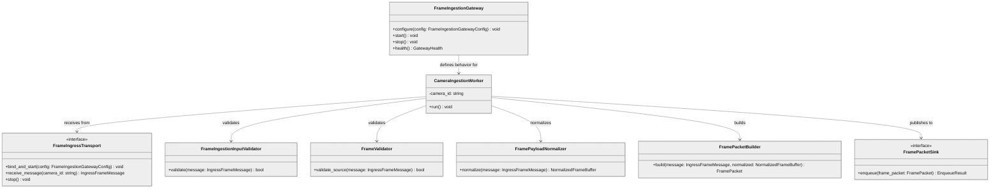
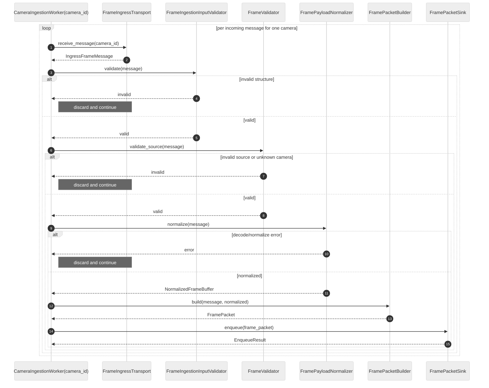
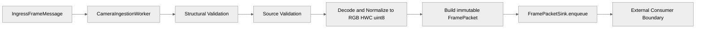

# Frame Ingestion Gateway Module Specification

## Canonical Source Notice

This is the canonical specification for Frame Ingestion Gateway behavior and ownership boundaries.
Any duplicate Gateway spec artifact (including historical `FrameIngressTransport.java` references) is non-canonical and must defer to this document.

## 1. Scope

### Purpose

The Frame Ingestion Gateway receives external ingress frame messages, validates them, decodes or interprets source payloads, normalizes accepted frames into canonical RGB/HWC/uint8/[0,255], constructs immutable shared FramePacket objects, and publishes accepted packets through a configured FramePacketSink.

Frame Ingestion Gateway is a managed ingestion component inside the Image Processing Service runtime.
Frame Ingestion Gateway owns ingestion logic only.
Frame Ingestion Gateway does not own runtime lifecycle or runtime threads.
Ingestion execution lifecycle is managed by Image Processing Service.
Only Image Processing Service creates, owns, starts, stops, and supervises runtime threads.
Gateway health is local-only symptom reporting; service-wide DEGRADED and ERROR transitions are owned by Image Processing Service.

### In Scope

- Receiving ingress frame messages
- Structural validation
- Source format validation
- Decoding encoded formats
- Normalizing accepted frames to canonical RGB/HWC/uint8/[0,255]
- Constructing immutable shared FramePacket objects
- Publishing accepted FramePacket objects through FramePacketSink
- Defining transport behavior used by Image Processing Service-managed ingestion execution workers
- Exposing ingestion health and metrics

### Out of Scope

The Gateway does not:

- Own the main processing queue
- Own runtime queues between ingestion and RPM processing
- Manipulate runtime queues directly
- Own downstream worker scheduling
- Create, own, or manage ingestion execution worker lifecycle
- Own runtime thread lifecycle
- Consume FramePacket objects
- Decide downstream processing paths
- Perform crop, resize, model preprocessing, inference, recognition, temporal frame management, or downstream orchestration
- Expose transport metadata or validation errors in FramePacket

---

## 2. Input

### 2.1 Input Structure

```text
struct IngressFrameMessage {
    string frame_id;
    string camera_id;
    uint64 timestamp_ms;
    int32  width;
    int32  height;
    string source_format;
    string source_layout             | optional;
    int32  source_num_color_channels | optional;
    int32  source_bits_per_channel   | optional;
    bytes  payload_bytes;
}
```

### 2.2 Supported Source Formats

Raw formats: RGB, BGR, GRAY8, YUV420, NV12, YUY2

Encoded formats: JPEG, MJPEG

### 2.3 Validation Rules

Structural validation:

- frame_id present and non-empty
- camera_id present and non-empty
- timestamp_ms present
- width > 0 and height > 0
- source_format present and non-empty
- payload_bytes present and non-empty

Source format and source metadata validation:

- source_format must be an uppercase canonical value and must exist in supported_source_formats
- source_layout applies only to raw formats
- source_layout, when present for raw formats, must be HWC or CHW
- source_layout must be absent for encoded formats
- source_bits_per_channel, when present, must be 8 in v1
- Non-8-bit raw formats are rejected in v1
- timestamp_ms is source-provided and preserved unchanged
- timestamp_ms is not used for queue ordering
- Duplicate frame_id values are not rejected in v1 unless explicitly configured later

Raw payload size and dimensional constraints are validated before normalization. Encoded payloads are decoded first; decoded dimensions are authoritative.

---

## 3. Output

### 3.1 Shared Output Contract

FramePacket is defined once in shared contracts: see shared_contracts.md Section 7.

The Gateway does not redefine FramePacket locally.

### 3.2 Canonical Output Requirements

Every published FramePacket satisfies:

- pixel_format = RGB
- layout = HWC
- dtype = uint8
- value_range = [0,255]
- num_color_channels = 3
- bits_per_channel = 8
- packing = tightly_packed
- image_bytes = raw unencoded RGB pixels

### 3.3 Output Constraints

FramePacket output never includes transport metadata, validation flags, rejection reasons, source format metadata, or codec hints.

---

## 4. Public API

```text
void          configure(config: FrameIngestionGatewayConfig)
void          start()
void          stop()
GatewayHealth health()
```

- configure() may be called exactly once and only before start().
- start() binds transport and enables Gateway ingestion behavior under Image Processing Service lifecycle authority.
- A second start() call is a no-op.
- stop() stops transport, interrupts or unblocks receive_message(), and disables Gateway ingestion behavior under Image Processing Service lifecycle authority.
- stop() must honor stop_timeout_ms from config.
- If Image Processing Service-managed ingestion execution workers do not stop within stop_timeout_ms, Gateway records a local timeout symptom and increments stop-timeout metrics; Image Processing Service maps that symptom into service-level health.
- health() reports Gateway-local ingest symptoms only and does not own service-wide health transitions.

---

## 5. Dependencies and Abstractions

### 5.1 Transport

```text
interface FrameIngressTransport {
    void                bind_and_start(config: FrameIngestionGatewayConfig)
    void                stop()
    IngressFrameMessage receive_message(camera_id: string)
}
```

### 5.2 Sink Boundary

FramePacketSink is defined in shared_contracts.md Section 8.

The Gateway calls:

```text
enqueue_result = sink.enqueue(frame_packet)
```

The Gateway does not know how the sink stores, schedules, or consumes frames.
The Gateway and Image Processing Service use the same canonical enqueue rejection taxonomy so metrics and health remain aligned.

### 5.3 Per-Camera Receive Adaptation

If a concrete transport cannot natively provide per-camera receive streams,
the Gateway must use an ingress-only adapter or dispatcher that routes each
received message to the matching configured camera worker by camera_id.

Rules:

- The adapter remains downstream-agnostic.
- The adapter must not expose downstream queue internals.
- Unknown camera_id values are rejected in v1.
- Per-camera FIFO arrival order is preserved after routing.

### 5.4 Transport Ownership Boundary

The Gateway defines ingress transport behavior only.

Runtime execution ownership boundary:

- Image Processing Service owns ingestion execution lifecycle (startup, supervision, shutdown, per-camera execution management).
- Gateway defines ingestion behavior and transport boundary logic.
- Gateway owns no runtime threads, worker lifecycle, or execution scheduling.
- Gateway health is local-only symptom reporting.
- Image Processing Service maps Gateway symptom signals into lane-level and service-level health.

The transport adapter is responsible only for ingress frame reception and dispatch into CameraIngestionWorkers.

Transport and adapter ownership rules:

- The transport adapter must not create or manage downstream processing workers.
- The transport adapter must not own processing queues.
- The transport adapter must not maintain pipeline state.
- The transport adapter must remain downstream-agnostic.
- The adapter must dispatch each accepted IngressFrameMessage only to the CameraIngestionWorker matching message.camera_id.
- Unknown camera_id messages are rejected before worker dispatch.
- Per-camera arrival order is preserved.
- The adapter must not reorder messages by timestamp.
- The adapter must not duplicate dispatch.
- The adapter must be safe under concurrent ingress.
- Unknown camera_id messages are rejected before worker dispatch using canonical UNKNOWN_CAMERA / BOUNDARY_VIOLATION semantics.

Boundary endpoint:

- Transport responsibilities end at validated FramePacket publication into FramePacketSink.
- Downstream processing ownership belongs outside the Gateway.

---

## 6. Internal Components

### 6.1 FrameIngestionGateway

Orchestration component that wires validation, decode/normalize, packet build, and sink publication.

### 6.2 CameraIngestionWorker

Image Processing Service-managed ingestion execution worker, one per configured camera_id.

Responsibilities per worker:

- Receive frames for exactly one configured camera_id
- Validate structure and source metadata
- Decode or interpret payload
- Normalize to canonical RGB/HWC/uint8/[0,255]
- Build immutable FramePacket
- Publish to FramePacketSink

Worker ownership rules:

- Each CameraIngestionWorker executes exactly one ingress loop under Image Processing Service lifecycle control.
- Each CameraIngestionWorker processes frames for exactly one configured camera_id.
- A CameraIngestionWorker must never process frames belonging to another camera_id.
- Cross-camera worker reuse is not allowed in v1.
- Per-camera worker isolation prevents slow decode or normalization in one camera from blocking ingress for another camera.

Ordering and isolation guarantees:

- FIFO arrival order preserved per camera
- Per-camera arrival order only (no global ordering)
- No timestamp-based reordering
- Slow or heavy frames from one camera must not block ingestion for other cameras

### 6.3 FrameIngestionInputValidator

Per-message structural validation only.

### 6.4 FrameValidator

Source format and source metadata validation only.

### 6.5 FramePayloadNormalizer

Decode and normalize payload to canonical raw RGB frame buffer.

### 6.6 FramePacketBuilder

Construct immutable shared FramePacket and transfer ownership of normalized RGB buffer when possible to avoid extra full-frame copies.

### 6.7 Temporal Ownership Boundary

- The Gateway does not maintain CURRENT/PREVIOUS temporal frame relationships.
- The Gateway does not maintain temporal frame history.
- The Gateway does not perform temporal pairing or temporal synchronization.
- Temporal ownership belongs outside the Gateway boundary.

---

## 7. Processing Behavior

For each message received by a camera worker:

1. Receive message from transport.
2. Structural validation.
3. Reject unknown camera_id by default in v1.
4. Source format and metadata validation.
5. Decode (if encoded) and normalize.
6. Build immutable FramePacket.
7. Call FramePacketSink.enqueue(frame_packet).
8. If enqueue accepted: increment frames_published_total.
9. If enqueue rejected: discard frame, increment sink_enqueue_rejected_total, continue.

Unknown camera behavior in v1:

- Production mode uses a fixed configured camera set.
- Unknown camera_id is rejected by default.
- Frame Ingestion Gateway is the canonical owner of unknown-camera rejection policy and unknown_camera_rejected_total metrics.
- Unknown camera frame is discarded and unknown_camera_rejected_total is incremented.
- Dynamic registration of unknown camera_id is not supported in v1.

---

## 8. Configuration

```text
struct FrameIngestionGatewayConfig {
    string         bind_address;
    string         service_name;
    int32          max_concurrent_streams;
    int32          max_frame_width;      // default 1920
    int32          max_frame_height;     // default 1080
    int32          max_payload_bytes;    // default 10485760
    int32          stop_timeout_ms;
    vector<string> configured_camera_ids;
    vector<string> supported_source_formats;
    FramePacketSink sink;
}
```

Configuration constraints:

- configured_camera_ids is the fixed accepted camera set in v1.
- sink must be configured before start().
- receive_message() must exit within stop_timeout_ms after stop() is called.

---

## 9. Health

```text
struct GatewayHealth {
    string state;                       // RUNNING | STOPPED | DEGRADED | ERROR
    string transport_state;
    bool   accepting_frames;
    bool   degraded;
    string last_error_code;
    string last_error_message;
    uint64 last_error_timestamp_ms;
    int32  active_ingress_workers;
    int32  configured_camera_count;

    uint64 frames_in_total;
    uint64 frames_accepted_total;
    uint64 frames_rejected_total;
    uint64 frames_published_total;
    uint64 sink_enqueue_rejected_total;
    uint64 decode_failed_total;
    uint64 normalization_failed_total;
    uint64 unsupported_source_format_total;
    uint64 unknown_camera_rejected_total;

    float ingest_latency_ms_avg;
    float decode_latency_ms_avg;
    float normalize_latency_ms_avg;
}
```

GatewayHealth does not include downstream queue internals.
GatewayHealth does not imply queue ownership or runtime thread ownership.

---

## 10. Metrics

Stage-level metrics:

- receive_latency_ms
- structural_validation_latency_ms
- format_validation_latency_ms
- decode_latency_ms
- normalize_latency_ms
- build_packet_latency_ms
- sink_enqueue_latency_ms
- total_ingest_latency_ms

Operational counters include frames_in_total, frames_accepted_total, frames_rejected_total, frames_published_total, sink_enqueue_rejected_total, decode_failed_total, normalization_failed_total, unsupported_source_format_total, and unknown_camera_rejected_total.

Metrics collection must avoid expensive hot-path work. Heavy per-frame logs must be rate-limited.

---

## 11. Error Handling

| Error | Trigger | Behavior |
|-------|---------|----------|
| StructuralValidationError | Missing required field or invalid dimensions | Discard frame, increment rejection metric, continue |
| UnsupportedSourceFormatError | Unsupported or non-canonical source_format | Discard frame, increment unsupported_source_format_total, continue |
| PayloadSizeMismatchError | Raw payload bytes inconsistent with declared metadata | Discard frame, increment rejection metric, continue |
| FrameDecodeError | Encoded payload decode failure | Discard frame, increment decode_failed_total, continue |
| FrameNormalizationError | Normalization failure | Discard frame, increment normalization_failed_total, continue |
| SinkEnqueueRejectedError | sink.enqueue returned accepted=false | Discard frame, increment sink_enqueue_rejected_total, continue |
| SinkUnavailableError | Sink unavailable at publication time | Discard frame, increment sink_enqueue_rejected_total, continue |
| SinkBackpressureError | Sink cannot accept due to backpressure | Discard frame, increment sink_enqueue_rejected_total, continue |
| WorkerStopTimeoutError | One or more Image Processing Service-managed ingestion execution workers failed to stop within stop_timeout_ms | Mark health DEGRADED or ERROR, set last_error fields, increment stop_timeout_total |

No frame-level failure stops ingestion globally unless lifecycle state transitions to STOPPING/STOPPED.

---

## 12. Non-Functional Requirements

- Real-time capable ingestion at camera-stream rates
- Deterministic behavior for a given message and configuration
- Transport-agnostic gateway API
- Per-camera ingress isolation via per-camera workers
- Avoid unnecessary full-frame memory copies
- Publication path does not expose sink internals
- Realtime freshness takes precedence over frame completeness in realtime mode.
- The Gateway prioritizes recent frames over exhaustive retention in realtime mode.
- Realtime mode intentionally permits frame dropping under pressure.

---

## 13. Diagrams

Note: Mermaid blocks below include an explicit neutral theme init to keep text and edges readable in VS Code Markdown Preview on light themes.

### 13.1 Class Diagram



### 13.2 Sequence Diagram



### 13.3 Data Flow Diagram



---

## 14. Module Compliance Checklist

- [ ] Uses shared FramePacket from shared_contracts.md only
- [ ] Does not define a local FramePacket schema
- [ ] Publishes accepted frames through FramePacketSink
- [ ] Does not own main processing queues
- [ ] Does not own runtime queues between ingestion and RPM processing
- [ ] Does not own runtime lifecycle or runtime threads
- [ ] Does not provide get_next_frame() pull API
- [ ] Uses one CameraIngestionWorker per configured camera_id
- [ ] Preserves FIFO order per camera only
- [ ] Rejects unknown camera_id by default in v1
- [ ] Unknown-camera rejection policy and metrics are owned by Gateway
- [ ] Does not dynamically register unknown cameras in v1
- [ ] stop() unblocks receive_message() and respects stop_timeout_ms
- [ ] GatewayHealth excludes downstream queue internals
- [ ] Sink reject/backpressure/unavailable paths discard and continue

---

## 15. Test Plan Recommendations

Gateway-focused test plan recommendations for future implementation:

- Validate publish path: accepted FramePacket is published through FramePacketSink.
- Validate sink rejection path: enqueue accepted=false discards frame and increments sink_enqueue_rejected_total.
- Validate unknown camera handling: unknown camera_id rejected; no dynamic registration in v1.
- Validate per-camera isolation: slow camera traffic does not block another camera worker.
- Validate stop cancellation behavior: stop() unblocks receive_message and enforces stop_timeout_ms.
- Validate lifecycle failure reporting: stop timeout transitions health to DEGRADED or ERROR.
- Validate validation matrix: max_frame_width/max_frame_height/max_payload_bytes and source format/layout rules.
- Validate canonical output: published FramePacket always matches shared canonical constraints.
