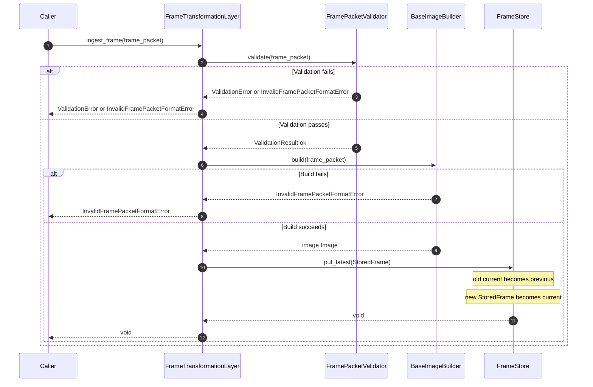
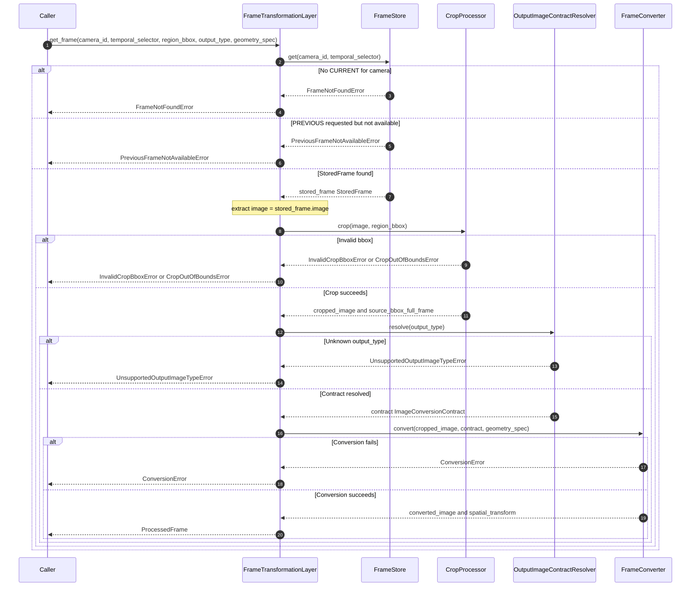
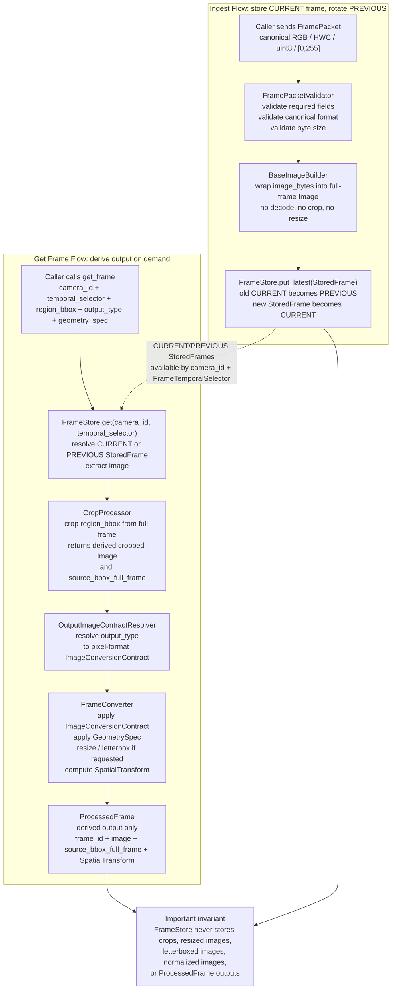

# Frame Transformation Layer

## Shared Contract Types

The following types used by the FTL are defined in [shared_contracts.md](shared_contracts.md) and must not be duplicated here:

- `BoundingBox` — the single shared bounding-box type (§1)
- `ResizePolicy` — the resize behavior enum (§2)
- `GeometrySpec` — the geometry transformation struct (§3)
- `OutputImageType` — the pixel representation enum (§4)
- `PipelineStageInputContract` — the stage initialization contract (§5)
- `Image` — the canonical shared public image struct (§6); carries `data`, `width`, `height`, `color_format`, `layout`, `dtype`, and `value_range`; pixel format is described by `OutputImageType`

---

## Purpose

The Frame Transformation Layer (FTL) is an internal frame processing layer that ingests `FramePacket` objects containing canonical raw RGB pixel data in bytes, converts them to `np.ndarray` immediately during ingest, wraps them into full-frame shared `Image` structs, maintains exactly two frames per camera (CURRENT and PREVIOUS) in `FrameStore`, and returns prepared `ProcessedFrame` outputs on demand. Cropping, resizing, letterboxing, and pixel-format conversion are derived operations performed only during `get_frame`; they never mutate or replace the stored full-frame `Image`.

The FTL receives `FramePacket` objects provided by a caller. These packets must always contain raw, unencoded canonical RGB pixel bytes in HWC layout. The FTL converts bytes → `np.ndarray` exactly once during ingest, then operates exclusively on ndarray data from that point forward.

The layer has exactly three responsibilities:

1. **Ingest** — validate an incoming `FramePacket` canonical format, convert its pixel bytes to `np.ndarray` immediately, wrap it into a full-frame shared `Image` (with canonical RGB/HWC/uint8/[0,255] metadata), and store it as the new CURRENT frame for that camera in `FrameStore`, rotating the previous CURRENT to PREVIOUS. No crop, resize, letterbox, normalization, or output conversion occurs during ingest. The bytes → ndarray conversion happens exactly once here.
2. **Store** — maintain exactly two full-frame `StoredFrame` instances per camera: CURRENT and PREVIOUS. CURRENT is updated only after successful validation, conversion, and build; PREVIOUS is the frame that was CURRENT before the latest successful ingest. Only full-frame shared `Image` instances (wrapped in `StoredFrame` with ndarray data) are ever stored; cropped, resized, letterboxed, normalized, or otherwise derived images are never stored.
3. **Prepare on demand** — given a `camera_id`, a `FrameTemporalSelector` (CURRENT or PREVIOUS), a `region_bbox`, an `OutputImageType`, and a `GeometrySpec`, resolve the stored full-frame shared `Image` for that camera and temporal position, crop the requested region (ndarray slicing), apply the hardcoded pixel-format `ImageConversionContract` for that `OutputImageType`, and apply the spatial transformation defined by `GeometrySpec`. All outputs are derived and temporary; they are never written back to `FrameStore`.

The FTL does not know why a frame is requested. It does not know which consumer will use the returned image. It receives an `OutputImageType` and a `GeometrySpec`, and returns one `ProcessedFrame` whose `image` field is a shared `Image` struct whose metadata fields (`color_format`, `layout`, `dtype`, `value_range`) match the hardcoded `ImageConversionContract` for that `OutputImageType` and whose spatial transformation is defined by `GeometrySpec`. `OutputImageType` defines pixel representation only. `GeometrySpec` defines spatial transformation.

The layer does not perform inference and does not decode or convert pixel formats.

## Architectural Role

The Frame Transformation Layer is an internal frame processing layer.

Normative role:

- Accept an immutable `FramePacket` and validate all required fields.
- Convert `FramePacket.image_bytes` (canonical RGB/HWC/uint8/[0,255]) to `np.ndarray` immediately (exactly once during ingest).
- Wrap the ndarray in a full-frame shared `Image` struct with canonical metadata.
- Store `StoredFrame` (containing full-frame shared `Image` with ndarray data) in `FrameStore` as CURRENT for the camera; rotate old CURRENT to PREVIOUS.
- On `get_frame`, resolve the `StoredFrame` for the given `camera_id` and `FrameTemporalSelector`, retrieve the stored full-frame shared `Image` (which contains ndarray data), crop the requested region (ndarray slicing), resolve the hardcoded pixel-format `ImageConversionContract` from `OutputImageType`, apply spatial transformation from `GeometrySpec`, and return `ProcessedFrame`.
- Return `source_bbox_full_frame` and `SpatialTransform` as spatial references on every `ProcessedFrame`.

Non-goals:

- No inference or detection of any kind.
- No pixel format conversion (input must already be canonical RGB/HWC/uint8/[0,255]).
- No caller-supplied conversion contracts.
- No caching of derived transformation outputs.
- No decision logic.
- No knowledge of why a frame is requested.

## Transparency Rule

The FTL does not know why a frame is requested.
The FTL does not know which consumer will use the returned image.
The FTL receives `camera_id`, `FrameTemporalSelector`, `BoundingBox`, `OutputImageType`, and `GeometrySpec`.
It returns one `ProcessedFrame` whose pixel format matches the hardcoded `ImageConversionContract` for that `OutputImageType`, with spatial transformation applied per `GeometrySpec`.

## Responsibility Boundary

### In Scope

- Validate `FramePacket` — all required fields including canonical format and byte-size consistency.
- Convert `FramePacket.image_bytes` (canonical RGB/HWC/uint8/[0,255]) to `np.ndarray` eagerly during ingest.
- Wrap ndarray in full-frame shared `Image` struct with canonical metadata.
- Store `StoredFrame` (containing full-frame shared `Image` with ndarray data) in `FrameStore`; rotate old CURRENT to PREVIOUS.
- Resolve `StoredFrame` by `camera_id` and `FrameTemporalSelector` on `get_frame`; extract stored full-frame shared `Image`.
- Crop the requested region (ndarray slicing) via `CropProcessor`.
- Resolve the hardcoded pixel-format `ImageConversionContract` from `OutputImageType` via `OutputImageContractResolver`.
- Convert the cropped image via `FrameConverter`.
- Return `source_bbox_full_frame` and `SpatialTransform` as spatial references on every `ProcessedFrame`.

### Out of Scope

The Frame Transformation Layer does not:

- Decode compressed image formats (e.g., JPEG, PNG) — input must already be unencoded canonical RGB/HWC/uint8/[0,255] bytes.
- Create `FramePacket` objects.
- Perform inference or detection of any kind.
- Accept caller-supplied conversion contracts.
- Load conversion contracts from configuration.
- Expose configurable contract repositories.
- Apply decision logic.
- Orchestrate any external processing pipeline.
- Know what consumer uses the output or why the frame was requested.
- Store cropped, resized, letterboxed, normalized, or any other derived output in `FrameStore`.
- Modify a stored full-frame `Image` in place.

## Canonical Input Format

The FTL accepts only `FramePacket` objects whose pixel data is already in canonical format. No pixel format conversion or decoding is performed.

| Field | Required value |
|-------|----------------|
| `pixel_format` | `RGB` |
| `layout` | `HWC` |
| `dtype` | `uint8` |
| `value_range` | `[0,255]` |
| `num_color_channels` | `3` |
| `bits_per_channel` | `8` |
| `packing` | tightly packed, no stride or row padding |

Any `FramePacket` that does not satisfy all of these requirements is rejected with `InvalidFramePacketFormatError`.

`pixel_format` describes the raw pixel layout of `image_bytes` in the `FramePacket`. It is not an output format. `OutputImageType` describes the prepared in-memory image representation returned by `get_frame`.

## Internal Data Flow and Image Conversion

**Bytes → ndarray conversion happens exactly once during ingest.**

During `ingest_frame`:

1. Validate `FramePacket` canonical format (all required fields)
2. Convert `FramePacket.image_bytes` → `np.ndarray` via `np.frombuffer(...).reshape(...).copy()`
3. Wrap ndarray in shared `Image` TypedDict with canonical RGB/HWC/uint8/[0,255] metadata
4. Store `StoredFrame` (containing shared `Image` with ndarray `data` field) in `FrameStore`

During `get_frame`:

1. Retrieve `StoredFrame` containing shared `Image` with ndarray `data`
2. Crop: `data[y:y+h, x:x+w].copy()` (ndarray slicing)
3. Convert: pixel-format conversion via PIL (RGB ↔ GRAY), output as shared `Image`
4. Return `ProcessedFrame` with shared `Image`

Rules:

- Bytes → ndarray conversion is performed exactly once, eagerly, during ingest in `BaseImageBuilder`
- After ingest, all internal image data is ndarray-based
- `FrameStore` stores only full-frame shared `Image` instances with ndarray `data` — never raw bytes, ROIs, or converted outputs
- All on-demand transformations operate exclusively on the stored full-frame `Image` ndarray
- `Image.width` and `Image.height` are set from `FramePacket.width` and `FramePacket.height` explicitly — they are not inferred from `Image.data.shape`
- Full-frame `Image` is never modified in place; all cropping, resizing, and format conversion produce temporary derived images

## OutputImageType Enum

`OutputImageType` is defined in [shared_contracts.md §4](shared_contracts.md). The FTL maps each `OutputImageType` value to exactly one hardcoded `ImageConversionContract` inside `OutputImageContractResolver`. The mapping is fixed — there is no dynamic behavior and no additional parameters are required from the caller.

### Hardcoded Contract per OutputImageType

Each `OutputImageType` maps to exactly one hardcoded `ImageConversionContract` covering pixel format only. The full mapping is:

| OutputImageType | color_format | layout | dtype | value_range |
|----------------|--------------|--------|-------|-------------|
| `GRAYSCALE_UINT8_HWC` | GRAY | HWC | uint8 | [0,255] |
| `RGB_UINT8_HWC` | RGB | HWC | uint8 | [0,255] |

Rules:

- One `OutputImageType` resolves to exactly one contract. There is no dynamic mapping.
- `ImageConversionContract` covers pixel representation only (`color_format`, `layout`, `dtype`, `value_range`). Geometry is not part of the contract.
- No contract is loaded from configuration.
- Runtime callers choose only `OutputImageType` and do not provide raw conversion fields.

## GeometrySpec

`GeometrySpec` is defined in [shared_contracts.md §3](shared_contracts.md). It defines the spatial transformation applied during `get_frame`. It is provided by the caller as an explicit parameter, separate from `OutputImageType`.

Fields: `width: int`, `height: int`, `resize_policy: ResizePolicy` — see [shared_contracts.md §2](shared_contracts.md) for supported `ResizePolicy` values (`NONE`, `LETTERBOX`).

**FTL extension for LETTERBOX:** When `resize_policy = LETTERBOX`, the FTL internally supports an optional `padding_color` parameter (`RGBColor{r, g, b}`). This is an FTL implementation detail and is not part of the shared `GeometrySpec`. When not specified, padding defaults to black (`{0, 0, 0}`).

Rules:

- When `resize_policy = NONE`: `width` and `height` are ignored. `width = 0` and `height = 0` are valid placeholders. No resize or padding is applied.
- When `resize_policy = LETTERBOX`: `width` and `height` must be `> 0`; output is exactly `(width, height)` with aspect-preserving resize plus padding.
- `GeometrySpec` is provided externally by the caller. It is not embedded in `OutputImageType` or `ImageConversionContract`.

`FrameTemporalSelector` is the value passed to `get_frame` to select which frame to retrieve for a given camera.

```text
enum FrameTemporalSelector {
    CURRENT,
    PREVIOUS
}
```

Semantics:

- `CURRENT` — the latest successfully ingested frame for that camera.
- `PREVIOUS` — the frame that was CURRENT before the latest successfully ingested frame.
- Requesting `PREVIOUS` before two successful ingests have been completed for that camera raises `PreviousFrameNotAvailableError`.
- Requesting `CURRENT` before any successful ingest has been completed for that camera raises `FrameNotFoundError`.

## StoredFrame and CameraFrameState

`StoredFrame` is the wrapper stored in `FrameStore`. It holds the full-frame `Image` (canonical RGB/HWC/uint8/[0,255]) together with its identifying metadata.

```text
struct StoredFrame {
    string    frame_id;
    string    camera_id;
    uint64    timestamp_ms;
    Image     image;       // shared Image struct; always canonical RGB/HWC/uint8/[0,255] as ingested
}
```

`CameraFrameState` holds the per-camera CURRENT and PREVIOUS entries.

```text
struct CameraFrameState {
    StoredFrame | None  current;
    StoredFrame | None  previous;
}
```

Rules:

- On successful ingest, old `current` becomes `previous`; new frame becomes `current`.
- On failed validation or build, neither `current` nor `previous` is updated.
- `CameraFrameState` is mutable — it is updated in place by `FrameStore.put_latest`.

## FrameTemporalSelector (Public) / FrameReference (Removed)

`FrameReference` has been removed from the public retrieval API. Callers must never pass a `FrameReference` to `get_frame`. Frame lookup is performed exclusively using `camera_id` and `FrameTemporalSelector`.

## Stream Processing Model

- The FTL processes one `FramePacket` at a time.
- A video stream is treated as a sequence of `FramePacket` objects per camera.
- On each successful ingest, the new frame becomes CURRENT for that camera; the previous CURRENT becomes PREVIOUS.
- The FTL does not batch frames or perform temporal aggregation beyond the two-frame CURRENT/PREVIOUS state per camera.
- `FrameStore` maintains exactly two `StoredFrame` instances per camera: CURRENT and PREVIOUS.
- Only the two most recent successfully ingested frames are accessible; earlier frames are not retained.

## Input Contract

The layer consumes:

- `FramePacket` (immutable raw pixel container) — the only input for `ingest_frame`.

`FramePacket` is immutable. The FTL derives internal state from it but does not modify it.

```text
struct FramePacket {
    string frame_id;
    string camera_id;
    uint64 timestamp_ms;
    int32  width;
    int32  height;
    string pixel_format;        // must be RGB
    string layout;              // must be HWC
    int32  num_color_channels;  // must be 3
    int32  bits_per_channel;    // must be 8
    bytes  image_bytes;         // tightly packed raw RGB pixels in HWC order
}
```

Rules:

- `FramePacket` is immutable.
- `image_bytes` contains raw, unencoded canonical RGB pixel data only.
- `pixel_format` must be `RGB`.
- `layout` must be `HWC`.
- `num_color_channels` must be `3`.
- `bits_per_channel` must be `8`.
- `image_bytes` must be tightly packed — stride, row padding, and alignment padding are not supported.
- `len(image_bytes)` must equal `width × height × 3 × 1`.
- Missing or inconsistent required fields must produce controlled validation errors.

## Output Contract

The layer returns `ProcessedFrame` from `get_frame`.

`BoundingBox` is defined in [shared_contracts.md §1](shared_contracts.md) and must not be duplicated here.

**BoundingBox convention:** origin is top-left of the image. `(x, y)` is the top-left corner. Coverage is pixel-inclusive on the left/top and exclusive on the right/bottom: pixels `x ≤ px < x+width`, `y ≤ py < y+height`.

BoundingBox validation rules:

- `x >= 0`
- `y >= 0`
- `width > 0`
- `height > 0`
- `x + width <= frame_width`
- `y + height <= frame_height`

```text
struct SpatialTransform {
    float  scale_x;        // x scale factor applied during geometry transform
    float  scale_y;        // y scale factor applied during geometry transform
    int32  pad_left;       // pixels of padding added on the left (letterbox only)
    int32  pad_top;        // pixels of padding added on the top (letterbox only)
    int32  output_width;   // final output image width in pixels
    int32  output_height;  // final output image height in pixels
}

struct ProcessedFrame {
    string           frame_id;               // copied unchanged from the source FramePacket.frame_id; traceability metadata — not modified by FTL operations (crop, resize, letterbox, pixel-format conversion)
  uint64           timestamp_ms;           // copied unchanged from the source FramePacket.timestamp_ms through StoredFrame.timestamp_ms; traceability metadata — not modified by FTL operations
    Image            image;                   // See shared_contracts.md §6 — shared Image struct; metadata fields match the OutputImageType passed to get_frame; image.width and image.height reflect the output dimensions after geometry transformation
    BoundingBox      source_bbox_full_frame;
    SpatialTransform spatial_transform;
}
```

`Image` is defined in [shared_contracts.md §6](shared_contracts.md) — a shared `Image` struct whose metadata fields (`color_format`, `layout`, `dtype`, `value_range`) match the `OutputImageType` passed to `get_frame`, and whose `width`/`height` reflect the output dimensions after geometry transformation. `BoundingBox` is defined in [shared_contracts.md §1](shared_contracts.md). `SpatialTransform` is a fully typed canonical struct defined above.

Output rules:

- `frame_id` is copied unchanged from `StoredFrame.frame_id`, which was copied from the ingested `FramePacket.frame_id`. FTL NONEs `frame_id` through all operations (crop, resize, letterbox, and pixel-format conversion). `frame_id` is traceability metadata and must not be generated, synthesized, or modified by FTL.
- `timestamp_ms` is copied unchanged from `StoredFrame.timestamp_ms`, which was copied from the ingested `FramePacket.timestamp_ms`. `timestamp_ms` is traceability metadata and must not be generated, synthesized, or modified by FTL operations.
- The `image` field carries a fully populated `Image` struct: `data`, `width`, `height`, `color_format`, `layout`, `dtype`, and `value_range` all reflect the resolved `ImageConversionContract` and applied geometry transformation.
- `source_bbox_full_frame` ALWAYS refers to the original full-frame coordinate system.
- `source_bbox_full_frame` enables callers to project locally computed coordinates back to full-frame coordinates.
- If no crop is applied, `source_bbox_full_frame` equals the full frame dimensions.
- `spatial_transform` carries the scale factors and padding offsets applied during geometry transformation.
- For `geometry_spec.resize_policy=NONE`, `scale_x=scale_y=1.0`, `pad_left=pad_top=0`, output dimensions equal crop dimensions.
- For `geometry_spec.resize_policy=LETTERBOX`, `scale_x=scale_y=min(target_width/cropped_width, target_height/cropped_height)`, output dimensions equal target dimensions, and padding offsets are reflected in `pad_left`/`pad_top`.
- The FTL returns only `ProcessedFrame`. `ProcessedFrame` is a derived output created on demand from the stored full-frame `Image`; it is never stored in `FrameStore`. Depending on request parameters, the `image` field may contain a cropped, resized, letterboxed, or pixel-format-converted image.
- Returned output is a derived artifact; the FTL never mutates `FramePacket` or any stored full-frame `Image`.
- `ProcessedFrame.image.data` must be treated as read-only by consumers. Mutation by downstream modules is forbidden by contract.
- The FTL may return either copies or references for `ProcessedFrame.image.data`; this is an implementation detail and callers must not rely on mutability behavior.

## SpatialTransform Formulas

The FTL applies spatial transforms deterministically based on `geometry_spec.resize_policy`. `SpatialTransform` is derived from `GeometrySpec`, not from `OutputImageType`.

### geometry_spec.resize_policy = NONE

```
scale_x       = 1.0
scale_y       = 1.0
pad_left      = 0
pad_top       = 0
output_width  = cropped_width
output_height = cropped_height
```

### geometry_spec.resize_policy = LETTERBOX

```
scale         = min(width / cropped_width, height / cropped_height)
resized_width = round(cropped_width × scale)
resized_height= round(cropped_height × scale)
pad_left      = floor((width  - resized_width)  / 2)
pad_top       = floor((height - resized_height) / 2)
scale_x       = scale
scale_y       = scale
output_width  = width
output_height = height
```

`width` and `height` are provided by `GeometrySpec` (supplied by the caller; not embedded in `OutputImageType` or `ImageConversionContract`).

All rounding operations used during letterbox resize must be deterministic and platform-independent. The implementation must use the same rounding policy consistently:

- `resized_width = round(cropped_width × scale)`
- `resized_height = round(cropped_height × scale)`
- `pad_left = floor((width - resized_width) / 2)`
- `pad_top = floor((height - resized_height) / 2)`

## Crop and Geometry Coordinate Mapping

When a region is cropped and then transformed by NONE or LETTERBOX:

- `source_bbox_full_frame` identifies the crop location in the original full-frame coordinate system.
- `SpatialTransform` describes the transform from cropped-image coordinates to output-image coordinates.

To map a point `(ox, oy)` from output-image coordinates back to full-frame coordinates:

```
1. Remove padding:   cx = ox - pad_left
                     cy = oy - pad_top
2. Divide by scale:  rx = cx / scale_x
                     ry = cy / scale_y
3. Add crop origin:  fx = rx + source_bbox_full_frame.x
                     fy = ry + source_bbox_full_frame.y
```

For `NONE`, this reduces to identity-plus-offset because `pad_left=pad_top=0` and `scale_x=scale_y=1.0`.

The result `(fx, fy)` is the corresponding point in the original full-frame coordinate system.

## Concurrency Expectations

- `FrameStore` must be safe for concurrent `ingest_frame` and `get_frame` calls across multiple cameras.
- CURRENT/PREVIOUS state is isolated per `camera_id`; operations for one camera must not mutate another camera state.
- `get_frame` outputs are derived snapshots; no derived output may mutate stored full-frame image state.

## Internal Components

This section defines the minimal, language-agnostic public APIs and essential internal methods for each class in the Frame Transformation Layer.

### Class: FramePacket

**Responsibilities**

- Hold immutable canonical raw RGB pixel frame data and required fields.
- Serve as a stable identity source via `frame_id` and `camera_id`.
- Enable validation of required field consistency.

**Attributes**

- `frame_id: string` — Unique frame identifier.
- `camera_id: string` — Source identifier.
- `timestamp_ms: uint64` — Epoch millisecond timestamp.
- `width: int32` — Frame width in pixels.
- `height: int32` — Frame height in pixels.
- `pixel_format: string` — Must be `RGB`.
- `layout: string` — Must be `HWC`.
- `num_color_channels: int32` — Must be `3`.
- `bits_per_channel: int32` — Must be `8`.
- `image_bytes: bytes` — Raw, tightly packed unencoded RGB pixel data in HWC order.

---

### Class: FramePacketValidator

**Responsibilities**

- Validate all `FramePacket` fields required for canonical input acceptance.
- Reject packets with missing, inconsistent, or non-canonical fields before `BaseImageBuilder` is invoked.

**Methods**

- `validate(frame_packet: FramePacket) -> ValidationResult`
  - **Purpose:** Verify that all required fields are present, consistent, and conform to the canonical input format.
  - **Return:** `ValidationResult` indicating success or listing missing/invalid fields.
  - **Error:** Raises `ValidationError` if required fields are absent or values are inconsistent. Raises `InvalidFramePacketFormatError` if any canonical format constraint (`pixel_format`, `layout`, `num_color_channels`, `bits_per_channel`, byte-size, or packing) is violated.

---

### Class: BaseImageBuilder

**Responsibilities**

- Validate that `FramePacket` already matches the canonical input format.
- Wrap or copy `FramePacket.image_bytes` into a `Image`.
- Never decode compressed formats.
- Never convert source formats.
- Never infer missing metadata.

**Methods**

- `build(frame_packet: FramePacket) -> Image`
  - **Purpose:** Wrap canonical `image_bytes` from `frame_packet` into a `Image`.
  - **Parameters:** `frame_packet` — Immutable frame packet containing `image_bytes`, `pixel_format`, `layout`, `num_color_channels`, `bits_per_channel`, `width`, `height`.
  - **Return:** `Image` ready for storage and subsequent transformations.
  - **Semantics:** Deterministic; same packet input always yields the same `Image` output. Does not modify `frame_packet`.
  - **Error:** Raises `InvalidFramePacketFormatError` if `FramePacket` does not satisfy the canonical input format.

---

### Class: Image

**Responsibilities**

- Represent the canonical internal image produced by `BaseImageBuilder`.
- Serve as the sole input to all crop, resize, and conversion operations.
- Stored `Image` instances are immutable. No transformation is allowed to modify a stored `Image` in place. All crop, resize, and conversion operations produce new derived `Image` objects.

**Attributes**

- `data: np.ndarray` — Pixel buffer in HWC layout (RGB for stored full-frame images).
- `color_format: string` — Always `RGB`.
- `layout: string` — Always `HWC`.
- `dtype: string` — Always `uint8`.
- `value_range: string` — Always `[0,255]`.
- `width: integer` — Image width in pixels.
- `height: integer` — Image height in pixels.

---

### Class: StoredFrame

**Responsibilities**

- Wrap a full-frame `Image` together with its identifying metadata for storage in `FrameStore`.
- Serve as the unit of CURRENT/PREVIOUS state in `CameraFrameState`.

**Attributes**

- `frame_id: string` — Unique frame identifier, matching `FramePacket.frame_id`.
- `camera_id: string` — Source identifier, matching `FramePacket.camera_id`.
- `timestamp_ms: uint64` — Epoch millisecond timestamp, matching `FramePacket.timestamp_ms`.
- `image: Image` — The canonical full-frame shared `Image` struct (always RGB/HWC/uint8/[0,255] as ingested).

---

### Class: CameraFrameState

**Responsibilities**

- Hold the CURRENT and PREVIOUS `StoredFrame` for one camera.
- Be mutated in place by `FrameStore.put_latest`.

**Attributes**

- `current: StoredFrame | None` — The latest successfully ingested frame for this camera. `None` until the first successful ingest.
- `previous: StoredFrame | None` — The frame that was CURRENT before the latest ingest. `None` until the second successful ingest.

---

### Class: FrameStore

**Responsibilities**

- Maintain per-camera CURRENT and PREVIOUS `StoredFrame` instances.
- Rotate temporal state on `put_latest`: old CURRENT becomes PREVIOUS, new frame becomes CURRENT.
- Retrieve `StoredFrame` by `camera_id` and `FrameTemporalSelector`.
- Never store derived outputs: not cropped images, resized images, letterboxed images, normalized images, `ProcessedFrame` outputs, or any other derived transformation result.

Storage model:

```text
FrameStore:
    map<string, CameraFrameState>  _frames_by_camera

CameraFrameState:
    current:  StoredFrame | None
    previous: StoredFrame | None
```

Rules:

- Exactly two frames are stored per camera: CURRENT and PREVIOUS.
- On `put_latest`: old `current` becomes `previous`; new `StoredFrame` becomes `current`.
- On failed validation or build: `put_latest` must not be called; neither `current` nor `previous` is updated.
- Stored full-frame `Image` instances inside `StoredFrame` are immutable after `put_latest`.
- `FrameStore` is thread-safe for concurrent `put_latest` and `get` calls.

**Methods**

- `put_latest(stored_frame: StoredFrame) -> void`
  - **Purpose:** Rotate temporal state for the camera and store the new frame as CURRENT.
  - **Parameters:** `stored_frame` — The new `StoredFrame` to store as CURRENT.
  - **Semantics:** `state.previous = state.current; state.current = stored_frame`.

- `get(camera_id: str, temporal_selector: FrameTemporalSelector) -> StoredFrame`
  - **Purpose:** Retrieve the CURRENT or PREVIOUS `StoredFrame` for the given camera.
  - **Return:** `StoredFrame` for the requested temporal position.
  - **Error:** Raises `FrameNotFoundError` if no CURRENT exists for the camera. Raises `PreviousFrameNotAvailableError` if `PREVIOUS` is requested but not yet available.

---

### Class: CropProcessor

**Responsibilities**

- Crop a rectangular region from a full-frame `Image`.
- Return the cropped image and `source_bbox_full_frame` in original full-frame coordinates.
- Extracts a derived region from the full-frame `Image` without modifying it. The returned cropped `Image` is a new derived object; the source `Image` is unchanged.

**Methods**

- `crop(image: Image, region_bbox: BoundingBox) -> (np.ndarray, BoundingBox)`
  - **Purpose:** Extract the region defined by `region_bbox` from `image`.
  - **Parameters:** `image` — Full canonical shared image. `region_bbox` — Region to extract in full-frame coordinates.
  - **Return:** Tuple of cropped ndarray (`image["data"][y:y+h, x:x+w].copy()`) and `source_bbox_full_frame` (equals `region_bbox`).
  - **Semantics:** Deterministic; same inputs always produce the same output. `region_bbox` must be expressed in full-frame coordinates. `source_bbox_full_frame` always refers to full-frame coordinates. Does not modify `image`; returns a new derived ndarray.
  - **Error:** Raises `InvalidCropBboxError` if `region_bbox` has invalid dimensions. Raises `CropOutOfBoundsError` if `region_bbox` extends outside the full frame boundaries.

**Memory behavior:** `CropProcessor` may return either a copied image buffer or a view/slice depending on implementation. In both cases, the stored `Image` must remain immutable and must never be modified in place.

---

### Class: OutputImageContractResolver

**Responsibilities**

- Receive an `OutputImageType` and return the hardcoded internal `ImageConversionContract`.
- Resolve pixel representation properties only: `color_format`, `layout`, `dtype`, `value_range`.
- Encapsulate all knowledge of pixel format mappings so callers never supply conversion details directly.
- Reject unknown `OutputImageType` values.

`OutputImageContractResolver` resolves pixel representation only. `GeometrySpec` is provided externally by the caller and is not part of `OutputImageType`.

Rules:

- Contracts are hardcoded. They are not loaded from configuration and cannot be changed at runtime.
- One `OutputImageType` maps to exactly one hardcoded `ImageConversionContract`. There is no dynamic mapping.
- Runtime callers choose only `OutputImageType`, not raw conversion details.

**Methods**

- `resolve(output_type: OutputImageType) -> ImageConversionContract`
  - **Purpose:** Return the hardcoded `ImageConversionContract` corresponding to `output_type`.
  - **Parameters:** `output_type` — One of the defined `OutputImageType` enum values.
  - **Return:** `ImageConversionContract` for that output type.
  - **Error:** Raises `UnsupportedOutputImageTypeError` if `output_type` is not a recognized enum value.

---

### Class: ImageConversionContract

**Responsibilities**

- Represent the pixel format specification for a prepared output image.
- Used internally by `FrameConverter` to apply the correct pixel format conversion.

`ImageConversionContract` covers pixel representation only. Spatial transformation is determined by `GeometrySpec`, which is provided externally and is not part of `ImageConversionContract`.

**Attributes**

- `color_format: string` — Target color format: `RGB` or `GRAY`.
- `layout: string` — Target data layout: `HWC`.
- `dtype: string` — Target data type: `uint8` or `float32`.
- `value_range: string` — Target value range: `[0,255]` or `[-1,1]`.

Note: `ImageConversionContract` does not contain module names. The mapping between `OutputImageType` and `ImageConversionContract` is owned by `OutputImageContractResolver`.

---

### Class: FrameConverter

**Responsibilities**

- Apply an `ImageConversionContract` to an image: color format, layout, dtype, and value range.
- Apply spatial transformation based on `GeometrySpec`: resize and padding.
- Ensure conversion is deterministic.
- Receives a derived `Image` and returns a new derived `Image`. Never writes back to `FrameStore`. Never mutates a stored `Image`.
- All transformations are pure derived operations. They must not mutate `FramePacket`, `Image`, or `FrameStore` state. They may only return new derived `Image`, `SpatialTransform`, or `ProcessedFrame` outputs.

**Methods**

- `convert(image: Image, contract: ImageConversionContract, geometry_spec: GeometrySpec) -> (Image, SpatialTransform)`
  - **Purpose:** Apply pixel format conversion from `contract` and spatial transformation from `geometry_spec`, and return the result with spatial metadata.
  - **Parameters:** `image` — Source image ndarray payload and metadata. `contract` — Pixel format contract specifying `color_format`, `layout`, `dtype`, and `value_range`. `geometry_spec` — Spatial transformation spec specifying `resize_policy`, `width`, `height`, and `padding_color` (`RGBColor`).
  - **Return:** Tuple of converted `Image` and `SpatialTransform` carrying scale factors and padding offsets.
  - **Semantics:** Deterministic; same `image`, same `contract`, and same `geometry_spec` always produce the same output and the same `SpatialTransform`. If `geometry_spec.resize_policy = NONE`: no resize, no padding, `spatial_transform = identity`. If `geometry_spec.resize_policy = LETTERBOX`: resize with aspect ratio preserved, pad to `width × height`, compute `SpatialTransform` accordingly.
  - **Error:** Raises `ConversionError` if the conversion fails.

---

### Class: FrameTransformationLayer

**Responsibilities**

- Primary entry point and orchestration facade for the frame processing layer.
- Coordinate `ingest_frame` and `get_frame` operations.
- Wire and invoke `FramePacketValidator`, `BaseImageBuilder`, `FrameStore`, `CropProcessor`, `OutputImageContractResolver`, and `FrameConverter` in the correct order per operation.

**Methods**

- `ingest_frame(frame_packet: FramePacket) -> void`
  - **Purpose:** Validate canonical format, build `Image`, and store as the new CURRENT frame for the camera in `FrameStore`.
  - **Parameters:** `frame_packet` — Immutable canonical raw RGB frame.
  - **Semantics:** Orchestrates: validate → build full-frame `Image` via `BaseImageBuilder` → wrap as `StoredFrame(frame_id, camera_id, timestamp_ms, image)` → call `FrameStore.put_latest`. Old CURRENT becomes PREVIOUS; new frame becomes CURRENT. Does not return a value. `put_latest` is called only after successful validation and build.
  - **Error:** Raises `ValidationError` or `InvalidFramePacketFormatError`. Does not update the store on any error.

- `get_frame(camera_id: str, temporal_selector: FrameTemporalSelector, region_bbox: BoundingBox, output_type: OutputImageType, geometry_spec: GeometrySpec) -> ProcessedFrame`
  - **Purpose:** Resolve the stored frame for `camera_id` and `temporal_selector`, crop the requested region, apply the hardcoded pixel-format contract for `output_type` and the spatial transformation for `geometry_spec`, and return a `ProcessedFrame`.
  - **Parameters:** `camera_id` — Identifies the source camera. `temporal_selector` — CURRENT or PREVIOUS. `region_bbox` — Region to extract (full-frame coordinates required). `output_type` — Defines the pixel representation of the output image. `geometry_spec` — Defines the spatial transformation (NONE or LETTERBOX).
  - **Return:** `ProcessedFrame` containing `frame_id` (copied from the source `StoredFrame.frame_id`), `timestamp_ms` (copied from the source `StoredFrame.timestamp_ms`), the converted image, `source_bbox_full_frame`, and `SpatialTransform`.
  - **Semantics:** Orchestrates: resolve `StoredFrame` via `FrameStore.get(camera_id, temporal_selector)` → extract `image` → crop → resolve pixel-format contract → `convert(contract, geometry_spec)` → return. Deterministic.
  - **Error:** Raises `ValidationError` (invalid `GeometrySpec`), `FrameNotFoundError` (no CURRENT for camera), `PreviousFrameNotAvailableError` (PREVIOUS requested before two successful ingests), `InvalidCropBboxError`, `CropOutOfBoundsError`, `UnsupportedOutputImageTypeError`, or `ConversionError`.

---

## Validation

The FTL validates the following before `BaseImageBuilder` is invoked:

| Field | Rule |
|-------|------|
| `frame_id` | Must exist and be non-empty |
| `camera_id` | Must exist and be non-empty |
| `timestamp_ms` | Must exist |
| `width` | Must be `> 0` |
| `height` | Must be `> 0` |
| `pixel_format` | Must equal `RGB` |
| `layout` | Must equal `HWC` |
| `num_color_channels` | Must equal `3` |
| `bits_per_channel` | Must equal `8` |
| `image_bytes` | Must be present and non-empty |
| `image_bytes` byte size | Must equal `width × height × 3 × 1` |
| packing | Data must be tightly packed. Stride, row padding, and alignment padding are not supported. |
| `region_bbox` (on `get_frame`) | Must have positive dimensions and lie within full frame boundaries |

If any rule fails, raises `ValidationError` or `InvalidFramePacketFormatError`.

## Non-Responsibilities

The FTL does NOT:

- Convert or decode any pixel format — input must already be canonical RGB/HWC/uint8/[0,255].
- Perform inference or detection of any kind.
- Accept caller-supplied conversion contracts.
- Load conversion contracts from configuration.
- Know why a frame is requested.
- Make any inference-based decisions.
- Store any derived output (cropped, resized, letterboxed, or normalized images).

## Internal Flow / Pipeline

The FTL supports exactly two flows.

### Ingest Flow — `ingest_frame(frame_packet)`

1. Caller passes `FramePacket` to `ingest_frame`.
2. `FramePacketValidator` validates all required fields and canonical format constraints.
3. On validation failure, raises `ValidationError` or `InvalidFramePacketFormatError`; processing stops.
4. `BaseImageBuilder` validates canonical format and wraps `FramePacket.image_bytes` into a full-frame `Image` (shared `Image` struct with canonical RGB/HWC/uint8/[0,255] metadata).
5. On build failure, raises `InvalidFramePacketFormatError`; `FrameStore` is not updated.
6. Wrap into `StoredFrame(frame_id=frame_packet.frame_id, camera_id=frame_packet.camera_id, timestamp_ms=frame_packet.timestamp_ms, image=image)` and call `FrameStore.put_latest(stored_frame)`. Old CURRENT becomes PREVIOUS; new frame becomes CURRENT.

Note: No crop, resize, letterbox, normalization, or output conversion is performed during `ingest_frame`. Only the full-frame `Image` (inside `StoredFrame`) is stored.

### Get Frame Flow — `get_frame(camera_id, temporal_selector, region_bbox, output_type, geometry_spec) -> ProcessedFrame`

1. Caller passes `camera_id`, `FrameTemporalSelector`, `region_bbox`, `OutputImageType`, and `GeometrySpec` to `get_frame`.
2. FTL validates `GeometrySpec`. If `resize_policy = LETTERBOX` and `width` or `height` is missing or `<= 0`, raises `ValidationError`.
3. FTL calls `FrameStore.get(camera_id, temporal_selector)` to retrieve the stored `StoredFrame`.
4. If no CURRENT exists for the camera, raises `FrameNotFoundError`. If `temporal_selector = PREVIOUS` and no PREVIOUS exists, raises `PreviousFrameNotAvailableError`.
5. Extract `image = stored_frame.image`.
6. `CropProcessor` crops the requested region from the full-frame `Image` using `region_bbox`.
7. `CropProcessor` returns a new derived cropped ndarray and `source_bbox_full_frame` (full-frame coordinates). The stored full-frame `Image` is not modified.
8. `OutputImageContractResolver.resolve(output_type)` returns the hardcoded pixel-format `ImageConversionContract`.
9. `FrameConverter.convert(cropped_data, cropped_width, cropped_height, contract, geometry_spec)` produces a new derived converted `Image` and `SpatialTransform`. The stored full-frame `Image` is not modified.
10. FTL returns `ProcessedFrame` containing `frame_id` (copied from `stored_frame.frame_id`), `timestamp_ms` (copied from `stored_frame.timestamp_ms`), the converted image, `source_bbox_full_frame`, and `SpatialTransform`.

Note: All intermediate and final outputs (`cropped_image`, `converted_image`, `ProcessedFrame`) are derived in-memory objects created on demand. None are stored in `FrameStore`. The stored full-frame `Image` is not modified.

## Class Diagram

```mermaid
classDiagram
  class FramePacket {
    +frame_id: string
    +camera_id: string
    +timestamp_ms: uint64
    +width: int32
    +height: int32
    +pixel_format: string
    +layout: string
    +num_color_channels: int32
    +bits_per_channel: int32
    +image_bytes: bytes
  }

  class FrameTemporalSelector {
    <<enum>>
    CURRENT
    PREVIOUS
  }

  class StoredFrame {
    +frame_id: string
    +camera_id: string
    +timestamp_ms: uint64
    +image: Image  }

  class CameraFrameState {
    +current: StoredFrame | None
    +previous: StoredFrame | None
  }

  class Image {
    +data: np.ndarray
    +width: int32
    +height: int32
    +color_format: string
    +layout: string
    +dtype: string
    +value_range: string
  }

  class SpatialTransform {
    +scale_x: float
    +scale_y: float
    +pad_left: int32
    +pad_top: int32
    +output_width: int32
    +output_height: int32
  }

  class BoundingBox {
    +x: int32
    +y: int32
    +width: int32
    +height: int32
  }

  class ProcessedFrame {
    +frame_id: string
    +timestamp_ms: uint64
    +image: Image
    +source_bbox_full_frame: BoundingBox
    +spatial_transform: SpatialTransform
  }

  class OutputImageType {
    <<enum>>
    GRAYSCALE_UINT8_HWC
    RGB_UINT8_HWC
  }

  class ResizePolicy {
    <<enum>>
    NONE
    LETTERBOX
  }

  class GeometrySpec {
    +resize_policy: ResizePolicy
    +width: int32
    +height: int32
    +padding_color: RGBColor
  }

  class RGBColor {
    +r: uint8
    +g: uint8
    +b: uint8
  }

  class ImageConversionContract {
    +color_format: string
    +layout: string
    +dtype: string
    +value_range: string
  }

  class FramePacketValidator {
    +validate(frame_packet: FramePacket) ValidationResult
  }

  class BaseImageBuilder {
    +build(frame_packet: FramePacket) Image
  }

  class FrameStore {
    +put_latest(stored_frame: StoredFrame) void
    +get(camera_id: str, temporal_selector: FrameTemporalSelector) StoredFrame
  }

  class CropProcessor {
    +crop(image: Image, region_bbox: BoundingBox) tuple
  }

  class OutputImageContractResolver {
    +resolve(output_type: OutputImageType) ImageConversionContract
  }

  class FrameConverter {
    +convert(image: Image, contract: ImageConversionContract, geometry_spec: GeometrySpec) tuple
  }

  class FrameTransformationLayer {
    +ingest_frame(frame_packet: FramePacket) void
    +get_frame(camera_id: str, temporal_selector: FrameTemporalSelector, region_bbox: BoundingBox, output_type: OutputImageType, geometry_spec: GeometrySpec) ProcessedFrame
  }

  FrameTransformationLayer --> FramePacketValidator : validate()
  FrameTransformationLayer --> BaseImageBuilder : build()
  FrameTransformationLayer --> FrameStore : put_latest() / get()
  FrameTransformationLayer --> CropProcessor : crop()
  FrameTransformationLayer --> OutputImageContractResolver : resolve()
  FrameTransformationLayer --> FrameConverter : convert()
  FrameTransformationLayer ..> FramePacket : consumes (immutable)
  FrameTransformationLayer --> ProcessedFrame : returns
  FrameTransformationLayer ..> FrameTemporalSelector : receives
  FrameTransformationLayer ..> OutputImageType : receives
  FrameTransformationLayer ..> GeometrySpec : receives
  BaseImageBuilder --> Image : produces
  StoredFrame --> Image : wraps
  CameraFrameState --> StoredFrame : holds current / previous
  FrameStore --> CameraFrameState : stores per camera
  FrameStore ..> FrameTemporalSelector : resolves by
  OutputImageContractResolver --> ImageConversionContract : produces
  OutputImageContractResolver ..> OutputImageType : receives
  ProcessedFrame --> BoundingBox : source_bbox_full_frame
  ProcessedFrame --> SpatialTransform : spatial_transform
  CropProcessor --> BoundingBox : emits source_bbox_full_frame
```



## Sequence Diagrams

### Ingest Flow



### Get Frame Flow



## Flow Diagram



## Error Handling

Controlled error classes:

- `ValidationError`: missing or inconsistent required field metadata in `FramePacket`; or invalid `GeometrySpec` (see rules below).
- `InvalidFramePacketFormatError`: `FramePacket` does not satisfy the canonical input format (wrong `pixel_format`, `layout`, `num_color_channels`, `bits_per_channel`, byte-size mismatch, or unsupported packing).
- `FrameNotFoundError`: `get_frame` called for a `camera_id` with no CURRENT frame (no successful ingest yet for that camera).
- `PreviousFrameNotAvailableError`: `get_frame(camera_id, PREVIOUS, ...)` called before two successful ingests have been completed for that camera.
- `InvalidCropBboxError`: `region_bbox` has invalid dimensions (zero or negative width/height).
- `CropOutOfBoundsError`: `region_bbox` extends outside the full frame boundaries.
- `UnsupportedOutputImageTypeError`: `output_type` is not a recognized `OutputImageType` enum value.
- `ConversionError`: `FrameConverter` failed to apply the `ImageConversionContract`.

GeometrySpec validation rules (raise `ValidationError`):

- If `resize_policy = LETTERBOX` and `width` or `height` is missing → `ValidationError`.
- If `width <= 0` or `height <= 0` → `ValidationError`.

Error policy:

- Errors are explicit and caller-visible.
- Failed validation or build attempts must not result in a `FrameStore.put_latest` call or any stored state change.

## Determinism / Non-Functional Requirements

### Determinism Requirements

- `BaseImageBuilder` output is determined solely by the canonical `image_bytes` and fields of `FramePacket`; no hidden heuristics are allowed.
- Same `FramePacket` input always yields the same `Image` output.
- `FrameStore` maintains deterministic CURRENT/PREVIOUS state per camera — same sequence of successful `put_latest` calls with the same `StoredFrame` inputs always yields the same state.
- Crop is deterministic — same `region_bbox` applied to the same `Image` always produces the same cropped image and the same `source_bbox_full_frame`.
- Contract resolution is deterministic — same `OutputImageType` always returns the same `ImageConversionContract`.
- Conversion is deterministic — same image input with the same `ImageConversionContract` and same `GeometrySpec` always produces the same output and the same `SpatialTransform`.

### Performance / Caching

- The FTL does not cache converted outputs.
- Only `StoredFrame` instances (each containing one full-frame `Image`) are stored in `FrameStore`.
- All cropped and converted `ProcessedFrame` outputs are generated on demand and discarded after return.

### Spatial Consistency Rules

The FTL guarantees that all coordinate systems remain consistent with the original full frame throughout the Store to Crop to Convert pipeline.

Rules:

- `source_bbox_full_frame` is always expressed in original full-frame coordinates. It is never relative to a previously cropped region.
- Every `region_bbox` must be expressed relative to the original full frame. The FTL does not accept region definitions relative to intermediate ROI outputs.
- `region_bbox` is always required for `get_frame`. Full-frame retrieval must be expressed as a `BoundingBox` with `x=0, y=0, width=frame_width, height=frame_height`. There is no implicit full-frame shortcut.
- Pixel-format conversions (color, layout, dtype, value range) do not affect spatial coordinates.
- Resize and letterbox operations change spatial scale; `source_bbox_full_frame` is always returned to allow callers to project output coordinates back to full-frame space.
- `FrameStore` always stores full `Image` instances (inside `StoredFrame`). It never stores ROIs or derived outputs. Spatial integrity of the stored data is unconditional.


