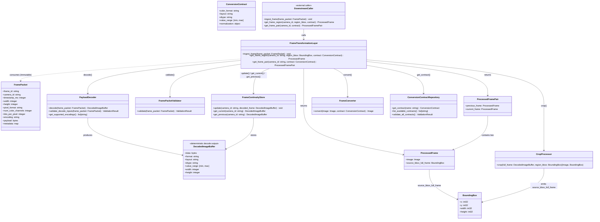
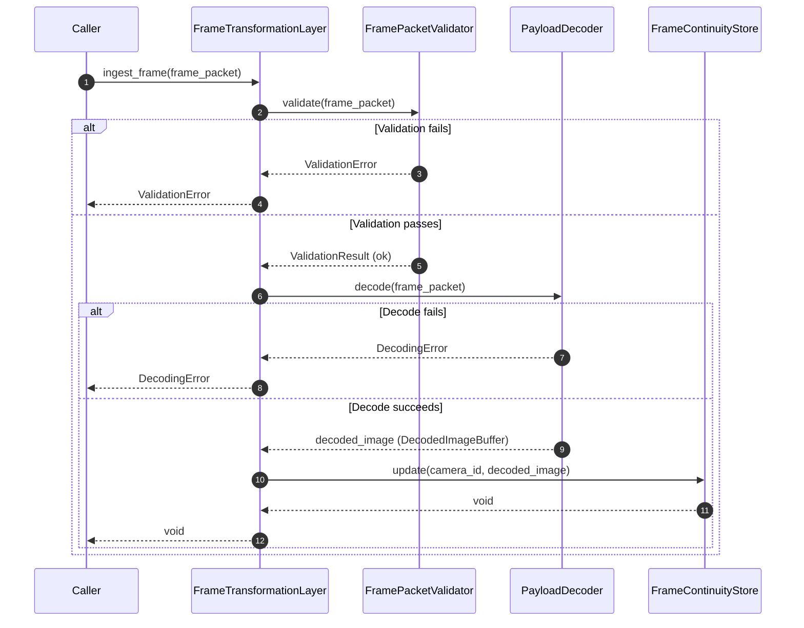
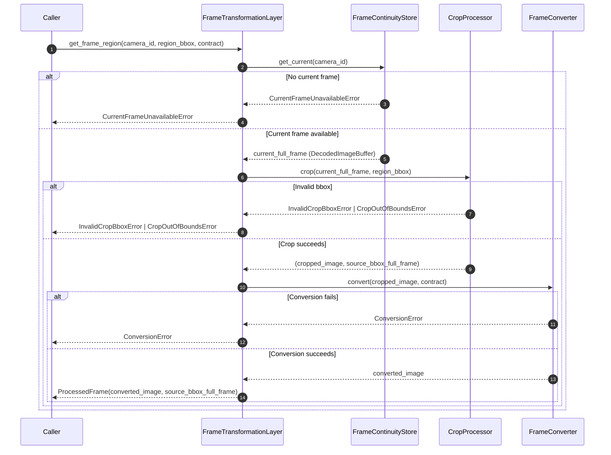
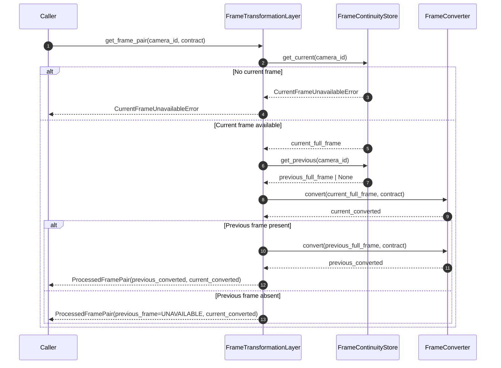
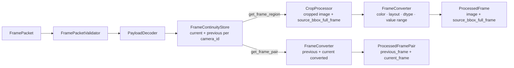

# Frame Transformation Layer

## Purpose

The Frame Transformation Layer is an internal frame processing layer that prepares frame data for downstream modules.

The layer has exactly three responsibilities:

1. **Store** — maintain current and previous full frames per `camera_id` in `FrameContinuityStore`.
2. **Crop** — extract regions of interest (ROI) from full frames using `CropProcessor`.
3. **Convert** — transform frames to the required format (color, layout, dtype, value range) using `FrameConverter`.

The layer does not run inference, does not construct model-specific input structures, does not perform decision logic, and does not contain named representations. It returns processed frame data only.

## Architectural Role

The Frame Transformation Layer is an internal frame processing layer inside IPS.

It has exactly three architectural responsibilities: store full frames, crop frame regions, and convert frame formats.

Normative role:

- Accept immutable `FramePacket` and validate required fields for decoding and continuity only.
- Decode `FramePacket.payload` through a dedicated `PayloadDecoder` component.
- Update `FrameContinuityStore` with the current and previous full frames per `camera_id`.
- Return cropped and converted frames as `ProcessedFrame` or `ProcessedFramePair`.
- Apply deterministic crop and conversion per caller-supplied `ConversionContract`.

Non-goals:

- No model-specific input construction.
- No named representation system or representation names.
- No caching of transformation outputs per representation.
- No inference and no decision logic.
- No spatial coordinate projection for downstream modules.
- No knowledge of which downstream module will use the output.

## Responsibility Boundary

### In Scope

- Validate `FramePacket` — only required fields for decoding and continuity.
- Decode payload bytes through `PayloadDecoder` into deterministic internal image buffers.
- Maintain `current_full_frame` and `previous_full_frame` per `camera_id` in `FrameContinuityStore`.
- Return processed frame regions (`ProcessedFrame`) on demand via `get_frame_region`.
- Perform deterministic cropping via `CropProcessor`.
- Perform deterministic format conversion via `FrameConverter`.
- Return `source_bbox_full_frame` as spatial reference on every `ProcessedFrame` output.

### Out of Scope

The Frame Transformation Layer does not:

- Perform inference — handled outside this module.
- Apply decision logic — handled outside this module.
- Orchestrate the processing pipeline — handled outside this module.
- Construct model-specific input structures.
- Maintain or resolve a named representation system.
- Project spatial coordinates for downstream module detections.
- Know what module uses the output.
- Ingest camera streams or create `FramePacket`.
- Perform model execution — handled outside this module.
- Package frames into model-specific structures — handled outside this module.

## Input

The layer receives:

- An immutable `FramePacket` (canonical frame metadata and payload contract) for ingestion.
- A `camera_id`, `region_bbox` (always required), and `ConversionContract` for `get_frame_region` — full-frame retrieval must be expressed as a `BoundingBox` covering the entire frame.
- A `camera_id` and `ConversionContract` for `get_frame_pair`.

## Input Contract

The layer consumes:

- `FramePacket` (canonical metadata container, immutable) — the only input for `ingest_frame`.

`FramePacket` is immutable. The FTL derives internal state from it but does not modify it.

Expected canonical fields validated for decoding and continuity:

- `frame_id`
- `camera_id`
- `timestamp_ms`
- `width`
- `height`
- `pixel_format`
- `num_color_channels`
- `bits_per_pixel`
- `encoding` (optional if payload is already raw)
- payload bytes
- metadata map

Rules:

- `FramePacket` is immutable.
- Payload decoding must be deterministic.
- Missing or inconsistent required metadata must produce controlled validation errors.

## Output

The layer returns processed frame data. There are two output types: `ProcessedFrame` and `ProcessedFramePair`.

## Output Contract

The layer returns processed frame data. There are two output types.

```text
struct BoundingBox {
    int32 x;
    int32 y;
    int32 width;
    int32 height;
}

struct ProcessedFrame {
    Image       image;
    BoundingBox source_bbox_full_frame;
}

struct ProcessedFramePair {
    ProcessedFrame previous_frame;
    ProcessedFrame current_frame;
}
```

`Image` is an opaque type. Its internal representation is not defined by this module. `BoundingBox` is a fully typed canonical struct defined above.

Output rules:

- `source_bbox_full_frame` ALWAYS refers to the original full frame coordinate system.
- `source_bbox_full_frame` enables downstream modules to project locally computed coordinates (for example, detections relative to the cropped image) back to full-frame coordinates.
- Any bounding box produced relative to a processed frame can be mapped back to full-frame coordinates by applying the offset defined in `source_bbox_full_frame`. This preserves spatial consistency across multiple processing stages.
- If no crop is applied, `source_bbox_full_frame` equals the full frame dimensions.
- `get_frame_region` returns `ProcessedFrame`.
- `get_frame_pair` returns `ProcessedFramePair`. When both frames are available, both `previous_frame` and `current_frame` carry `source_bbox_full_frame` equal to the full frame dimensions. If `previous_frame` is unavailable, it does not carry a valid image or bounding box; `source_bbox_full_frame` is defined only for available frames.
- The FTL returns only processed frame data — never model input structures.
- Returned output is a derived artifact; the FTL never mutates `FramePacket`.

## Internal Components

This section defines the minimal, language-agnostic public APIs and essential internal methods for each class in the Frame Transformation Layer. Each class is specified with its responsibilities, required methods, parameter contracts, and return types to guide implementation.

### Class: FramePacket

**Responsibilities**

- Hold immutable canonical frame metadata and payload.
- Serve as a stable identity source via `frame_id` and `camera_id`.
- Enable validation of required metadata consistency.

**Attributes**

- `frame_id: string` — Unique frame identifier.
- `camera_id: string` — Source camera identifier.
- `timestamp_ms: integer` — Epoch millisecond timestamp for frame ordering.
- `width: integer` — Frame width in pixels.
- `height: integer` — Frame height in pixels.
- `pixel_format: string` — Declared pixel format (e.g., `RGB`, `BGR`, `GRAYSCALE`).
- `num_color_channels: integer` — Number of color channels.
- `bits_per_pixel: integer` — Bit depth per pixel.
- `encoding: string` (optional) — Encoding type if payload is not raw (e.g., `JPEG`, `H264`).
- `payload: bytes` — Raw or encoded frame data.
- `metadata: map[string, any]` — Arbitrary metadata key-value pairs.

---

### Class: FramePacketValidator

**Responsibilities**

- Validate `FramePacket` fields required for decoding and continuity.
- Reject packets with missing or inconsistent fields before any decode attempt.

**Methods**

- `validate(frame_packet: FramePacket) -> ValidationResult`
  - **Purpose:** Verify that all fields required for decoding and continuity are present and consistent.
  - **Return:** `ValidationResult` indicating success or listing missing/invalid fields.
  - **Error:** Raises `ValidationError` if required fields are absent or values are inconsistent.

---

### Class: PayloadDecoder

**Responsibilities**

- Decode immutable `FramePacket.payload` into a deterministic internal image buffer.
- Normalize decode output metadata needed by downstream components.
- Enforce supported encoding and format rules.

**Methods**

- `decode(frame_packet: FramePacket) -> DecodedImageBuffer`
  - **Purpose:** Decode payload bytes into a deterministic working image buffer.
  - **Parameters:** `frame_packet` — Canonical frame packet containing payload bytes and metadata.
  - **Return:** `DecodedImageBuffer` ready for crop and conversion steps.
  - **Semantics:** Deterministic; same packet input yields the same decoded output.
  - **Error:** Raises `DecodingError` when payload bytes cannot be decoded or encoding is unsupported.

- `validate_decode_inputs(frame_packet: FramePacket) -> ValidationResult`
  - **Purpose:** Validate metadata required for decoding before attempting decode.
  - **Parameters:** `frame_packet` — Canonical frame packet.
  - **Return:** `ValidationResult` indicating decode-readiness.
  - **Error:** Raises `ValidationError` on missing or inconsistent decode-critical fields.

- `get_supported_encodings() -> list[string]`
  - **Purpose:** Return supported payload encodings for diagnostics and startup validation.
  - **Return:** List of supported encoding names (e.g., `['RAW', 'JPEG']`).

---

### Class: DecodedImageBuffer

**Responsibilities**

- Represent deterministic decode output stored by `FrameContinuityStore` and passed into crop and conversion steps.
- Carry normalized buffer metadata needed by `CropProcessor` and `FrameConverter`.

**Attributes**

- `data: bytes` — Decoded image bytes.
- `format: string` — Color format in normalized form (e.g., `RGB`, `BGR`, `GRAYSCALE`).
- `layout: string` — Data layout: `HWC` or `CHW`.
- `dtype: string` — Data type descriptor (e.g., `uint8`, `float32`).
- `value_range: [min, max]` — Value range in the decoded buffer.
- `width: integer` — Image width in pixels.
- `height: integer` — Image height in pixels.

---

### Class: FrameContinuityStore

**Responsibilities**

- Maintain `current_full_frame` and `previous_full_frame` per `camera_id`.
- Apply the frame continuity update rule on every successful ingest.
- Provide retrieval of current and previous full frames to the FTL orchestrator.

Rules:

- Stores exactly one `current_full_frame` and one `previous_full_frame` per `camera_id`.
- Update rule: `previous_full_frame ← old current_full_frame`, then `current_full_frame ← new decoded frame`.
- On first frame for a `camera_id`: `current_full_frame` is set, `previous_full_frame` remains absent.
- Always stores full decoded frames — never ROIs or converted outputs.
- No transformation logic exists inside the store.
- State is keyed by `camera_id`. Each camera has an independent continuity slot.
- A failed decode must not update the store.

**Methods**

- `update(camera_id: string, decoded_frame: DecodedImageBuffer) -> void`
  - **Purpose:** Apply the continuity update rule: `previous_full_frame ← old current_full_frame`, `current_full_frame ← decoded_frame`.
  - **Parameters:** `camera_id` — Camera identifier. `decoded_frame` — New full frame to store.
  - **Semantics:** Deterministic per camera slot. On first call for a `camera_id`, `previous_full_frame` remains absent.

- `get_current(camera_id: string) -> DecodedImageBuffer`
  - **Purpose:** Retrieve the current full frame for the given camera.
  - **Return:** `DecodedImageBuffer` for the most recently ingested frame.
  - **Error:** Raises `CurrentFrameUnavailableError` if no frame has been ingested for `camera_id`.

- `get_previous(camera_id: string) -> DecodedImageBuffer | None`
  - **Purpose:** Retrieve the previous full frame for the given camera.
  - **Return:** `DecodedImageBuffer` if a previous frame exists; `None` if only one frame has been ingested.

---

### Class: CropProcessor

**Responsibilities**

- Crop a rectangular region from a full decoded image buffer.
- Return the cropped image and the `source_bbox_full_frame` in original full-frame coordinates.

**Methods**

- `crop(full_frame: DecodedImageBuffer, region_bbox: BoundingBox) -> (Image, BoundingBox)`
  - **Purpose:** Extract the region defined by `region_bbox` from `full_frame`.
  - **Parameters:** `full_frame` — Full decoded image buffer. `region_bbox` — Region to extract in full-frame coordinates.
  - **Return:** Tuple of cropped `Image` and `source_bbox_full_frame` (equals `region_bbox`).
  - **Semantics:** Deterministic; same inputs always produce same output. The FTL assumes that `region_bbox` is already expressed in full-frame coordinates and does not perform any coordinate transformation or normalization. `source_bbox_full_frame` always refers to full-frame coordinates.
  - **Error:** Raises `InvalidCropBboxError` if `region_bbox` has invalid dimensions. Raises `CropOutOfBoundsError` if `region_bbox` extends outside the full frame boundaries.

---

### Class: FrameConverter

**Responsibilities**

- Apply a `ConversionContract` to an image: color format, layout, dtype, value range, and optional normalization.
- Ensure conversion is deterministic and does not change spatial coordinates.

**Methods**

- `convert(image: Image, contract: ConversionContract) -> Image`
  - **Purpose:** Transform `image` to match every property specified in `contract`.
  - **Parameters:** `image` — Source image. `contract` — Conversion contract specifying target properties.
  - **Return:** Converted `Image` matching `contract.color_format`, `contract.layout`, `contract.dtype`, and `contract.value_range`.
  - **Semantics:** Deterministic; same image and same contract always produce the same output. Must NOT change spatial coordinates or dimensions unless explicitly included in the contract (not supported in base contract).
  - **Error:** Raises `ConversionError` if the conversion fails.

---

### Class: ConversionContractRepository

**Responsibilities**

- Load and provide access to named conversion contracts from configuration.
- Serve as an optional config-backed source of contracts for callers who prefer not to construct contracts inline.

**Methods**

- `get_contract(name: string) -> ConversionContract`
  - **Purpose:** Retrieve a named conversion contract by name.
  - **Parameters:** `name` — Contract name as defined in configuration.
  - **Return:** `ConversionContract` corresponding to the name.
  - **Error:** Raises `UnknownContractError` if name is not found in configuration.

- `list_available_contracts() -> list[string]`
  - **Purpose:** Return all available contract names.
  - **Return:** List of contract name strings.

- `validate_all_contracts() -> ValidationResult`
  - **Purpose:** Verify that all loaded contracts are internally consistent.
  - **Return:** `ValidationResult` indicating success or listing invalid contracts.

---

### Class: FrameTransformationLayer

**Responsibilities**

- Primary entry point and orchestration facade for the frame processing layer.
- Coordinate `ingest_frame`, `get_frame_region`, and `get_frame_pair` operations.
- Wire and invoke `FramePacketValidator`, `PayloadDecoder`, `FrameContinuityStore`, `CropProcessor`, and `FrameConverter` in the correct order per operation.

**Methods**

- `ingest_frame(frame_packet: FramePacket) -> void`
  - **Purpose:** Validate, decode, and store a new full frame in `FrameContinuityStore`.
  - **Parameters:** `frame_packet` — Immutable canonical frame.
  - **Semantics:** Orchestrates: validate → decode → update store. Does not return a value.
  - **Error:** Raises `ValidationError` (invalid frame) or `DecodingError` (payload decode failure). Does not update the store on any error.

- `get_frame_region(camera_id: string, region_bbox: BoundingBox, contract: ConversionContract) -> ProcessedFrame`
  - **Purpose:** Return a cropped and converted region of the current full frame.
  - **Parameters:** `camera_id` — Camera identifier. `region_bbox` — Region to extract. `contract` — Conversion contract.
  - **Return:** `ProcessedFrame` containing the converted image and `source_bbox_full_frame`.
  - **Semantics:** Orchestrates: retrieve current frame → crop → convert → return. Deterministic.
  - **Error:** Raises `CurrentFrameUnavailableError`, `InvalidCropBboxError`, `CropOutOfBoundsError`, or `ConversionError`.

- `get_frame_pair(camera_id: string, contract: ConversionContract) -> ProcessedFramePair`
  - **Purpose:** Return both the current and previous full frames converted according to the contract.
  - **Parameters:** `camera_id` — Camera identifier. `contract` — Conversion contract applied identically to both frames.
  - **Return:** `ProcessedFramePair`. If `previous_full_frame` is absent, `previous_frame` carries an explicit unavailable state.
  - **Semantics:** Orchestrates: retrieve previous + current → convert both → return. Deterministic.
  - **Error:** Raises `CurrentFrameUnavailableError` or `ConversionError`.

---

## Internal Flow / Pipeline

The FTL supports three distinct flows. Each is independent.

### Ingest Flow — `ingest_frame(frame_packet)`

1. Caller passes `FramePacket` to `ingest_frame`.
2. `FramePacketValidator` validates required fields.
3. On validation failure, raises `ValidationError`; processing stops.
4. `PayloadDecoder` decodes `FramePacket.payload` into `DecodedImageBuffer`.
5. On decode failure, raises `DecodingError`; `FrameContinuityStore` is not updated.
6. `FrameContinuityStore` updates: `previous_full_frame ← old current_full_frame`, `current_full_frame ← new decoded frame`.

### Region Flow — `get_frame_region(camera_id, region_bbox, conversion_contract) → ProcessedFrame`

1. Caller passes `camera_id`, `region_bbox`, and `conversion_contract`. `region_bbox` is always required — a full-frame request must supply a `BoundingBox` with `x=0, y=0` and dimensions equal to the full frame. There is no implicit full-frame shortcut.
2. FTL retrieves `current_full_frame` from `FrameContinuityStore` for `camera_id`.
3. If no current frame exists, raises `CurrentFrameUnavailableError`.
4. `CropProcessor` crops the region from `current_full_frame` using `region_bbox`.
5. `CropProcessor` returns cropped image and `source_bbox_full_frame` (full-frame coordinates).
6. `FrameConverter` converts the cropped image according to `conversion_contract`.
7. FTL returns `ProcessedFrame` containing the converted image and `source_bbox_full_frame`.

### Pair Flow — `get_frame_pair(camera_id, conversion_contract) → ProcessedFramePair`

1. Caller passes `camera_id` and `conversion_contract`.
2. FTL retrieves `previous_full_frame` and `current_full_frame` from `FrameContinuityStore`.
3. If `current_full_frame` is absent, raises `CurrentFrameUnavailableError`.
4. If `previous_full_frame` is absent, returns explicit unavailable state for `previous_frame`.
5. `FrameConverter` converts both frames according to the same `conversion_contract`.
6. FTL returns `ProcessedFramePair` with `previous_frame` and `current_frame`. When both frames are available, both carry `source_bbox_full_frame` equal to the full frame dimensions. If `previous_frame` is unavailable, it does not carry a valid image or bounding box; `source_bbox_full_frame` is defined only for available frames.

### Example: Object Detection — ROI-Based Input

Object Detection supplies a `roi_bbox` derived from a person detection result.

1. Object Detection calls `get_frame_region(camera_id, roi_bbox, conversion_contract)`.
2. `conversion_contract` specifies: color `RGB`, layout `CHW`, dtype `float32`, value range `[0, 1]`.
3. FTL retrieves the current full frame from `FrameContinuityStore`.
4. `CropProcessor` crops the ROI and records `source_bbox_full_frame = roi_bbox`.
5. `FrameConverter` converts the cropped image according to the contract.
6. FTL returns `ProcessedFrame` containing the converted image and `source_bbox_full_frame`.

Object Detection receives only the ROI-sized image. It does NOT receive the full frame. It must use `get_frame_region` exclusively.

### Example: Motion Detection — Frame Pair Input

Motion Detection requires the current frame and the previous frame for comparison.

1. Motion Detection calls `get_frame_pair(camera_id, conversion_contract)`.
2. `conversion_contract` specifies: color `GRAYSCALE`, layout `HWC`, dtype `uint8`, value range `[0, 255]`.
3. FTL retrieves `previous_full_frame` and `current_full_frame` from `FrameContinuityStore`.
4. `FrameConverter` converts both frames according to the same contract.
5. FTL returns `ProcessedFramePair` with `previous_frame` and `current_frame`.

## Class Diagram



## Sequence Diagram

### Ingest Flow



### Region Flow



### Pair Flow



## Flow Diagram



## Configuration / Parameters

All conversion contracts are loaded from configuration through `ConversionContractRepository`.

### ConversionContract

Downstream modules do not request named representations. They supply a `ConversionContract` directly, or retrieve one from `ConversionContractRepository`.

A `ConversionContract` is an explicit, immutable contract specifying exactly how the FTL must convert a frame:

- Required color format (for example: `RGB`, `BGR`, `GRAYSCALE`).
- Data layout (`HWC` or `CHW`).
- Data type (`uint8`, `float32`).
- Value range (for example: `[0, 255]`, `[0, 1]`, `[-1, 1]`).
- Optional normalization rules (mean/std standardization).

A `ConversionContract` is an explicit contract, not an implicit behavior. The FTL applies it exactly as specified. Conversion does not change spatial coordinates.

Geometric transformations (resize, letterbox, or warp) are not supported in the base `ConversionContract`. If introduced in future revisions, the FTL must also return explicit spatial transform metadata sufficient to map output coordinates back to the original full frame. Without this metadata, spatial consistency between the converted image and the original full frame cannot be guaranteed.

### Configuration Rules

Mandatory constraints:

- The Frame Transformation Layer must not hardcode conversion logic.
- Contract changes must be possible through configuration only.
- `ConversionContractRepository` is the config-backed source of named contracts. It is optional — callers may also pass a `ConversionContract` directly without using the repository.

Contract fields:

- `color_format` — target color format after conversion.
- `layout` — target data layout: `HWC` or `CHW`.
- `dtype` — target data type: `uint8`, `float32`.
- `value_range` — target value range: `[0, 255]`, `[0, 1]`, or `[-1, 1]`.
- `normalization` — optional mean/std normalization applied after range scaling.

## Error Handling

Controlled error classes:

- `ValidationError`: missing or inconsistent required frame metadata in `FramePacket`.
- `DecodingError`: payload decode failed due to unsupported encoding or malformed payload bytes. The `FrameContinuityStore` is not updated on decode failure.
- `CurrentFrameUnavailableError`: `get_frame_region` or `get_frame_pair` called before any frame has been ingested for `camera_id`.
- `PreviousFrameUnavailableError`: `get_frame_pair` called but `previous_full_frame` is absent for `camera_id` (first frame only); the FTL returns an explicit unavailable state for `previous_frame` rather than raising an error.
- `InvalidCropBboxError`: `region_bbox` has invalid dimensions (zero or negative width/height).
- `CropOutOfBoundsError`: `region_bbox` extends outside the full frame boundaries.
- `ConversionError`: `FrameConverter` failed to apply the `ConversionContract`.

Error policy:

- Errors are explicit and caller-visible.
- Failed decodes or failed conversions must not be cached or stored as valid state.
- The FTL does not return model-level outputs (for example: `detected=false`).

## Determinism / Non-Functional Requirements

### Determinism Requirements

- Decoding order and rules must follow `PayloadDecoder` contract exactly.
- Same `FramePacket` input always yields the same decoded output.
- Frame continuity update is deterministic per `camera_id` — same sequence of ingests produces the same continuity state.
- Crop is deterministic — same `region_bbox` applied to the same full frame always produces the same cropped image and the same `source_bbox_full_frame`.
- Conversion is deterministic — same image input with the same `ConversionContract` always produces the same output.
- No hidden heuristics are allowed.

### Spatial Consistency Rules

The FTL guarantees that all coordinate systems remain consistent with the original full frame throughout the Store → Crop → Convert pipeline.

Rules:

- `source_bbox_full_frame` is always expressed in original full-frame coordinates. It is never relative to a previously cropped region.
- Nested cropping is supported at the logical level, but every `region_bbox` must always be expressed relative to the original full frame. The FTL does not accept region definitions relative to intermediate ROI outputs. This allows multi-stage ROI pipelines while preserving one stable coordinate system. This guarantees that multi-stage ROI pipelines (ROI → ROI → ROI) remain spatially consistent without accumulating coordinate errors.
- `region_bbox` is always required for `get_frame_region`. Full-frame retrieval must be expressed as a `BoundingBox` with `x=0, y=0, width=frame_width, height=frame_height`. There is no implicit full-frame shortcut.
- Geometric transformations (resize, letterbox, or warp) are not supported in the base `ConversionContract`. If introduced in future revisions, the FTL must also return explicit spatial transform metadata. Pixel-format conversions (color format, layout, dtype, value range) do not affect spatial coordinates.
- `FrameContinuityStore` always stores full decoded frames. It never stores ROIs or converted outputs. Spatial integrity of the stored data is unconditional.
- For `get_frame_pair`, when both frames are available, both `previous_frame` and `current_frame` carry `source_bbox_full_frame` equal to the full frame dimensions, enabling consistent coordinate comparison between frames. If `previous_frame` is unavailable, it does not carry a valid image or bounding box; `source_bbox_full_frame` is defined only for available frames.
