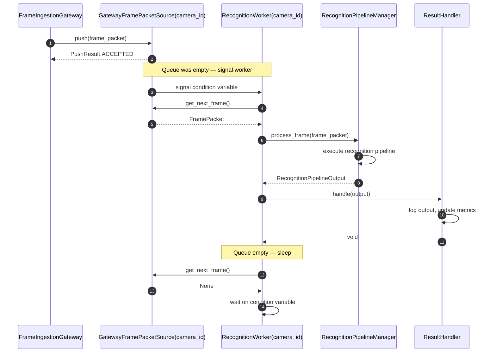
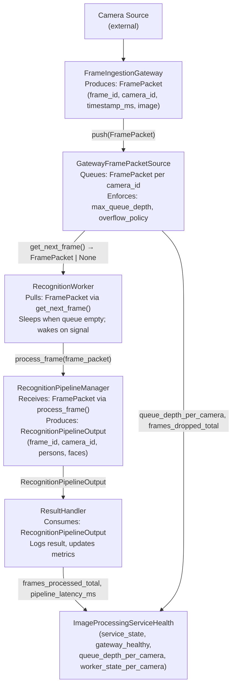

# Image Processing Service Module Specification

## 1. Scope

### Purpose

The Image Processing Service is responsible for owning the runtime machinery that connects frame ingestion to recognition. It owns all worker threads, all per-camera queues, all worker lifecycle, and all service state transitions. It configures and wires the `FrameIngestionGateway`, one `GatewayFramePacketSource` per camera, a `FramePacketSourceRegistry`, the `RecognitionPipelineManager`, one `RecognitionWorker` per camera, and the `ResultHandler`. It starts, coordinates, and stops all owned components in the defined order.

The Image Processing Service does not implement detection, recognition, or image preprocessing. All pipeline execution is delegated to `RecognitionPipelineManager`.

### In Scope

- Loading and validating service configuration at startup
- Configuring the `FrameIngestionGateway`
- Creating one `GatewayFramePacketSource` per configured `camera_id`
- Creating and owning the `FramePacketSourceRegistry`
- Initializing `RecognitionPipelineManager` with pipeline stage engines
- Creating and owning one `RecognitionWorker` per configured `camera_id`
- Creating and owning the `ResultHandler`
- Starting and stopping the `FrameIngestionGateway`
- Starting and stopping all `RecognitionWorker` threads
- Managing service state transitions: `CREATED → RUNNING → STOPPING → STOPPED`
- Enforcing the per-camera `GatewayFramePacketSource` queue overflow policy
- Exposing service health via `health()`
- Reporting service-level metrics

### Out of Scope

The Image Processing Service does NOT:

- Implement motion detection, object detection, face detection, or face recognition — handled outside this module
- Perform image preprocessing (color conversion, resize, normalization, dtype conversion) — handled outside this module
- Execute the recognition pipeline — handled outside this module
- Access raw pixel data or `BaseImage` contents — handled outside this module
- Manage the `FrameIngestionGateway` ingestion thread — the Gateway owns and manages its own ingestion thread
- Maintain frame identity state across calls — handled outside this module
- Implement transport connections or camera protocols — handled outside this module
- Manage identity enrollment or gallery updates — handled outside this module
- Access the filesystem after initialization

---

## 2. Input

### 2.1 Input Responsibility Boundary

The service does not receive frames through a public method. Frames are produced by the `FrameIngestionGateway` on its own ingestion thread. Each produced `FramePacket` is pushed into the `GatewayFramePacketSource` registered for that `camera_id`. The service does not call the Gateway to fetch frames — the Gateway pushes, and `RecognitionWorker` threads pull directly via the `FramePacketSource` interface.

The following have already been applied before a `FramePacket` enters the service's internal queues:

- Frame capture at the originating camera source
- Transport framing and delivery
- Field validation by `FrameIngestionGateway`
- Normalization to canonical RGB, HWC, uint8, [0,255] by `FrameIngestionGateway`
- `FramePacket` construction by `FrameIngestionGateway`

The Image Processing Service does not perform any of the above. Only queue management, worker dispatch, and lifecycle coordination are performed inside this module.

### 2.2 Input Structure

The service receives `FramePacket` objects into its internal queues. `FramePacket` is defined by the `FrameIngestionGateway`:

```text
struct Image {
    uint32 width;
    uint32 height;
    string color_format;   // always "RGB"
    string layout;         // always "HWC"
    string dtype;          // always "uint8"
    bytes  pixels;
}

struct FramePacket {
    string frame_id;
    string camera_id;
    uint64 timestamp_ms;
    int32  width;
    int32  height;
    string pixel_format;   // always "RGB"
    Image  image;
}
```

`FramePacket` is opaque to the Image Processing Service. The service does not access, inspect, or modify pixel data. It routes `FramePacket` objects by `camera_id` into the corresponding `GatewayFramePacketSource` queue.

### 2.3 Input Contract

A `FramePacket` pushed into a `GatewayFramePacketSource` must satisfy:

- `frame_id` must be present and non-empty
- `camera_id` must be present, non-empty, and correspond to a configured camera
- `timestamp_ms` must be present
- `image` must be present and non-null
- `image.pixels` must be non-empty
- `pixel_format` must be `"RGB"` (canonical normalized form from the Gateway)

The Image Processing Service does not re-validate `FramePacket` fields. Field validation is the responsibility of the `FrameIngestionGateway`. The service enforces only that `camera_id` corresponds to a registered `GatewayFramePacketSource` before pushing.

### 2.4 Validation Rules

`ServiceConfigValidator` validates the service configuration at startup:

- `camera_ids` must be non-empty
- All entries in `camera_ids` must be non-empty strings
- All entries in `camera_ids` must be unique
- `max_queue_depth_per_camera` must be a positive integer (`> 0`)
- `overflow_policy` must be a valid `OverflowPolicy` enum value
- `drain_queues_on_shutdown` must be present (bool)

`GatewayFramePacketSource` validates push operations at runtime:

- `frame_packet.camera_id` must match the source's configured `camera_id`
- If `camera_id` does not match, the frame is discarded and `PushResult.REJECTED` is returned

### 2.5 Input Semantics

- `frame_id` — unique identifier for the frame; not interpreted by the service; passed through unchanged to `RecognitionPipelineManager`
- `camera_id` — identifies the source camera; used to route the frame to the correct `GatewayFramePacketSource` queue
- `timestamp_ms` — capture timestamp; not interpreted by the service; passed through unchanged to `RecognitionPipelineManager`
- `image` — the normalized frame image; not accessed by the service; passed through unchanged to `RecognitionPipelineManager`

---

## 3. Output

### 3.1 Output Structure

The service does not return output to callers on a per-frame basis. Per-frame recognition results are handled by the `ResultHandler`. The service exposes only health state and lifecycle control via its public API.

```text
enum ServiceState {
    CREATED,
    RUNNING,
    STOPPING,
    STOPPED
}

enum WorkerState {
    IDLE,
    RUNNING,
    STOPPED,
    FAILED
}

struct PerCameraHealth {
    string      camera_id;
    WorkerState worker_state;
    int32       queue_depth;
    uint64      last_frame_timestamp_ms;
}

struct ImageProcessingServiceHealth {
    ServiceState            service_state;
    bool                    gateway_healthy;
    vector<PerCameraHealth> cameras;
}
```

Per-frame recognition output is defined by `RecognitionPipelineManager` and consumed exclusively by `ResultHandler`. It is not part of the Image Processing Service public API.

### 3.2 Output Semantics

- `service_state` — current lifecycle state of the service
- `gateway_healthy` — `true` when the `FrameIngestionGateway` reports healthy status
- `cameras` — one `PerCameraHealth` entry per configured `camera_id`
- `PerCameraHealth.camera_id` — the camera identifier this entry covers
- `PerCameraHealth.worker_state` — current state of the `RecognitionWorker` for this camera
- `PerCameraHealth.queue_depth` — number of frames currently enqueued in the `GatewayFramePacketSource` for this camera
- `PerCameraHealth.last_frame_timestamp_ms` — `timestamp_ms` of the most recently pushed `FramePacket` for this camera; `0` if no frame has been pushed yet

### 3.3 Output Constraints

The output must NOT expose:

- Detection confidence scores, similarity scores, or face embeddings
- Raw pixel data or any intermediate image representation
- Internal queue implementation details
- Pipeline routing decisions or skip flags
- `RecognitionPipelineManager` internal state

---

## 4. Public API

```text
void                         configure(config: ImageProcessingServiceConfig)
void                         start()
void                         stop(drain: bool)
ImageProcessingServiceHealth health()
```

- `configure(config)` must be called before `start()`. Configuration is validated and stored. It must not be called after `start()`.
- `start()` executes the full startup sequence and transitions service state to `RUNNING`. Calling `start()` more than once is an error.
- `stop(drain)` initiates the shutdown sequence. `drain = true` is reserved for future use. In MVP, `drain_queues_on_shutdown` is always `false` — queues are discarded. Calling `stop()` before `start()` is a no-op.
- `health()` returns the current `ImageProcessingServiceHealth` snapshot. It is safe to call at any service state.

The API must remain stable regardless of which `RecognitionPipelineManager` implementation or `ResultHandler` implementation is configured.

---

## 5. Non-Functional Requirements

- **Owns worker threads** — the service creates, starts, and stops one `RecognitionWorker` thread per camera; thread ownership is not shared with any downstream component
- **Per-camera concurrency** — different cameras run concurrently on independent worker threads
- **Per-camera sequential ordering** — frames from the same `camera_id` are processed in FIFO order; exactly one `RecognitionWorker` per camera enforces this invariant
- **No pipeline implementation** — the service does not implement recognition, detection, or preprocessing; all pipeline execution is delegated to `RecognitionPipelineManager`
- **No direct pixel access** — the service never accesses `image.pixels` or any pixel representation
- **Queue-bounded** — each per-camera queue is bounded by `max_queue_depth_per_camera`; overflow is handled by the configured `overflow_policy`
- **DROP_OLDEST in MVP** — when the queue is full, the oldest frame is removed before inserting the newest; no frames are silently lost without updating metrics
- **Real-time capable** — the service is designed for continuous, live per-frame processing; it must not accumulate unbounded memory
- **Service state is authoritative** — all components check `service_state` before acting; no component runs outside the `RUNNING` state
- **ResultHandler failure must not crash the service** — errors in `ResultHandler.handle()` are caught per worker; the worker loop continues
- **Model-agnostic service boundary** — the service is independent of which pipeline stage implementations are loaded into `RecognitionPipelineManager`

---

## 6. Processing Engine

### 6.1 Engine Abstraction Interfaces

`RecognitionPipelineManager` is the processing engine of the Image Processing Service. It is abstracted behind an interface:

```text
interface RecognitionPipelineManagerInterface {
    process_frame(frame_packet: FramePacket) -> RecognitionPipelineOutput
}
```

`GatewayFramePacketSource` is abstracted behind the `FramePacketSource` interface, which is defined and consumed by `RecognitionPipelineManager`:

```text
interface FramePacketSource {
    push(frame_packet: FramePacket) -> PushResult
    get_next_frame()               -> FramePacket | None
}
```

`push` is called by the `FrameIngestionGateway` on its ingestion thread. `get_next_frame` is called by `RecognitionWorker` threads.

`ResultHandler` is abstracted behind an interface:

```text
interface ResultHandlerInterface {
    handle(output: RecognitionPipelineOutput) -> void
}
```

### 6.2 Current Default Implementations

```text
class RecognitionPipelineManager implements RecognitionPipelineManagerInterface
class GatewayFramePacketSource    implements FramePacketSource
class LoggingResultHandler        implements ResultHandlerInterface
```

`RecognitionPipelineManager` is an orchestration engine. It executes the motion detection → object detection → face detection → face recognition pipeline for one `FramePacket` per call. It is not AI-based — it delegates AI execution to downstream pipeline stage implementations.

`GatewayFramePacketSource` is an algorithmic component. It implements a bounded FIFO queue with the configured `overflow_policy`. It is thread-safe for concurrent `push` (ingestion thread) and `get_next_frame` (worker thread) access.

`LoggingResultHandler` is the MVP implementation. It logs every `RecognitionPipelineOutput` and updates metrics. It does not publish to external systems.

### 6.3 Replaceability

The Image Processing Service depends on `RecognitionPipelineManagerInterface`, `FramePacketSource`, and `ResultHandlerInterface` — not on their concrete implementations. Any compliant implementation of any interface may be substituted without changing the public API or calling code. Replacing `RecognitionPipelineManager`, the queue implementation, or the result handler does NOT affect the service's public API.

### 6.4 Architecture Decision

The system uses RecognitionPipelineManager` is intentionally kept as a pure frame processor.

- `RecognitionPipelineManager` public API is `process_frame(frame_packet: FramePacket) -> RecognitionPipelineOutput`. It always receives a valid `FramePacket` and always returns `RecognitionPipelineOutput`. It never returns `None`.
- Queue polling, empty-queue handling, sleep/backoff, and all threading belong exclusively to `RecognitionWorker`.
- `RecognitionPipelineManager` must not know about queues, `FramePacketSourceRegistry`, `GatewayFramePacketSource`, threading, or sleep/retry behavior.
- This keeps queue and threading concerns inside the Image Processing Service and avoids coupling `RecognitionPipelineManager` to ingestion infrastructure.

---

## 7. Acceptance / Filtering Logic

Queue admission and overflow are exclusively managed by `GatewayFramePacketSource`.

- `FrameIngestionGateway` pushes each constructed `FramePacket` via `FramePacketSource.push(frame_packet)`. The `GatewayFramePacketSource` inspects the current queue depth before admission.
- If `queue_depth < max_queue_depth_per_camera`, the frame is enqueued unconditionally and `PushResult.ACCEPTED` is returned.
- If `queue_depth == max_queue_depth_per_camera`, the configured `overflow_policy` is applied.
- In MVP, `overflow_policy = DROP_OLDEST`. The oldest frame is removed from the head of the queue, the new frame is appended to the tail, and `PushResult.OVERFLOW_DROP_OLDEST` is returned. The `frames_dropped_total` metric for that `camera_id` is incremented.
- No overflow signal is propagated outside `GatewayFramePacketSource`. The `FrameIngestionGateway` receives only a `PushResult` enum value and does not know the queue state.
- `GatewayFramePacketSource` is the ONLY component that applies overflow decisions. No other component evaluates queue depth for admission control.

---

## 8. Internal Pipeline

### 8.1 ImageProcessingService

`ImageProcessingService` is the service lifecycle manager only. It owns no recognition logic, image processing logic, or queue contents.

Its responsibilities are:

- Load and validate `ImageProcessingServiceConfig` via `ServiceConfigValidator` during `configure()`
- Wire all owned components: configure `FrameIngestionGateway`, create one `GatewayFramePacketSource` per `camera_id`, populate `FramePacketSourceRegistry`, initialize `RecognitionPipelineManager`, create one `RecognitionWorker` per `camera_id` each wired to its per-camera `FramePacketSource`, create `ResultHandler`
- Execute the startup sequence during `start()` in the defined order (see §13.2)
- Execute the shutdown sequence during `stop()` in the defined order (see §13.4)
- Transition service state: `CREATED → RUNNING → STOPPING → STOPPED`
- Return `ImageProcessingServiceHealth` snapshots via `health()`
- Update service-level metrics

`ImageProcessingService` must not invoke pipeline stages directly, access pixel data, or manage the `FrameIngestionGateway` ingestion thread.

### 8.2 ServiceConfigValidator

`ServiceConfigValidator` is responsible only for validating the `ImageProcessingServiceConfig` at startup.

Its responsibilities are:

- Verify all required configuration fields are present and valid (see §2.4)
- Raise `ServiceConfigurationError` if any required field is invalid or missing

`ServiceConfigValidator` must not create components, start threads, or modify service state.

### 8.3 GatewayFramePacketSource

`GatewayFramePacketSource` is responsible for owning the per-camera bounded queue and enforcing the configured overflow policy.

Its responsibilities are:

- Maintain a bounded FIFO queue of `FramePacket` objects for exactly one `camera_id`
- Accept `FramePacket` push calls from the `FrameIngestionGateway` ingestion thread
- Enforce `max_queue_depth_per_camera` and `overflow_policy` on every push
- When `overflow_policy = DROP_OLDEST` and the queue is full: remove the oldest frame from the head, insert the new frame at the tail, return `PushResult.OVERFLOW_DROP_OLDEST`, and increment `frames_dropped_total`
- Expose `get_next_frame()` for the `RecognitionWorker` thread to pull the next available frame
- Wake the registered worker condition variable when a frame is pushed into a previously empty queue
- Be thread-safe for concurrent `push` and `get_next_frame` access

`GatewayFramePacketSource` must not invoke pipeline stages, manage worker thread lifecycle, or access pixel data beyond routing the `FramePacket` struct.

### 8.4 FramePacketSourceRegistry

`FramePacketSourceRegistry` is responsible for maintaining the mapping from `camera_id` to `FramePacketSource`.

Its responsibilities are:

- Store one `FramePacketSource` per configured `camera_id`, populated at initialization
- Expose `get(camera_id: string) -> FramePacketSource | None` for lookup
- Be read-only after initialization; the registry is immutable once populated

`FramePacketSourceRegistry` must not create, start, or manage sources, threads, or service state.

### 8.5 RecognitionWorker

`RecognitionWorker` is responsible for the per-camera worker loop only.

Its responsibilities are:

- Run the worker loop for exactly one `camera_id`
- Repeatedly call `source.get_next_frame()` via the `FramePacketSource` interface to pull the next available `FramePacket` while the service is in `RUNNING` state
- Sleep on its condition variable when `get_next_frame()` returns `None` (no frame available); wake when `GatewayFramePacketSource` signals a new frame arrival
- Pass the pulled `FramePacket` to `recognition_manager.process_frame(frame_packet)` → `RecognitionPipelineOutput`
- Pass the returned `RecognitionPipelineOutput` to `result_handler.handle(output)`
- Catch and log exceptions from `source.get_next_frame`, from `recognition_manager.process_frame`, and from `result_handler.handle` without crashing the worker loop
- Increment `worker_error_count` on each caught exception
- Set its `WorkerState` to `FAILED` on unrecoverable errors and notify `ImageProcessingService`
- Set its `WorkerState` to `STOPPED` when the service transitions to `STOPPING` and the loop exits normally

`RecognitionWorker` must not know pipeline internals, access queue internals directly (bypassing the `FramePacketSource` interface), modify `FramePacket` contents, or manage the `FrameIngestionGateway`.

### 8.6 ResultHandler

`ResultHandler` is responsible for handling every `RecognitionPipelineOutput` produced by a `RecognitionWorker`.

Its responsibilities are:

- Receive one `RecognitionPipelineOutput` per call
- In MVP: log the output (frame identity, camera, timestamp, persons detected, faces recognized)
- Increment `frames_processed_total` for the `camera_id`
- Update `pipeline_latency_ms` using the output's `timestamp_ms` and current wall-clock time

`ResultHandler` must not invoke pipeline stages, manage worker lifecycle, or modify `RecognitionPipelineOutput`.

### 8.7 End-to-End Processing Flow

**frame push → queue admission → worker wake → pipeline execution → result handling**

1. `FrameIngestionGateway` constructs a `FramePacket` and calls `FramePacketSourceRegistry.get(camera_id)` to retrieve the `GatewayFramePacketSource` for that camera.
2. `FrameIngestionGateway` calls `GatewayFramePacketSource.push(frame_packet)` → `PushResult`. If `PushResult == OVERFLOW_DROP_OLDEST`, `frames_dropped_total` is incremented.
3. `GatewayFramePacketSource` wakes the `RecognitionWorker` condition variable if the queue was empty before the push.
4. `RecognitionWorker` wakes and calls `GatewayFramePacketSource.get_next_frame()` via the `FramePacketSource` interface → `FramePacket | None`. If `None`, the worker returns to sleep on its condition variable.
5. `RecognitionWorker` calls `RecognitionPipelineManager.process_frame(frame_packet)`, which executes the recognition pipeline and returns `RecognitionPipelineOutput`.
6. `RecognitionWorker` calls `ResultHandler.handle(output)`.
7. `ResultHandler` logs the result and updates metrics.
8. `RecognitionWorker` loops and calls `source.get_next_frame()` again.

All intermediate pipeline data (embeddings, ROI images, detection scores, motion regions) remain strictly internal to `RecognitionPipelineManager`. The Image Processing Service never accesses them.

---

## 9. Configuration

### 9.1 Configuration Parameters

```text
struct ImageProcessingServiceConfig {
    vector<string>  camera_ids;                      // configured camera identifiers; must be non-empty and unique
    int32           max_queue_depth_per_camera;       // maximum number of FramePackets buffered per camera queue
    OverflowPolicy  overflow_policy;                  // action taken when a camera queue is full (MVP: DROP_OLDEST)
    bool            drain_queues_on_shutdown;         // if true, workers process remaining frames before stopping (MVP: always false)
}

enum OverflowPolicy {
    DROP_OLDEST,      // remove oldest frame from queue head, insert new frame at tail
    DROP_NEWEST,      // discard the incoming frame; queue contents unchanged (reserved)
    BLOCK_INGESTION   // block the push call until space is available (reserved)
}
```

### 9.2 Loading Behavior

Configuration is loaded exactly once during `configure()`. It is immutable after `configure()` returns and is reused unchanged across the entire service lifetime. No configuration parameter is part of the `start()`, `stop()`, or `health()` call signatures.

Injection at construction time:

- `camera_ids` → used by `ImageProcessingService` to create one `GatewayFramePacketSource` and one `RecognitionWorker` per identifier
- `max_queue_depth_per_camera` → injected into each `GatewayFramePacketSource` as the queue capacity bound
- `overflow_policy` → injected into each `GatewayFramePacketSource` as the admitted overflow strategy
- `drain_queues_on_shutdown` → stored by `ImageProcessingService`; governs queue flushing behavior during `stop()`
- `RecognitionPipelineManagerInterface` implementation → injected into `ImageProcessingService` at construction; passed to each `RecognitionWorker`
- `ResultHandlerInterface` implementation → injected into `ImageProcessingService` at construction; passed to each `RecognitionWorker`
- `FrameIngestionGateway` instance → injected into `ImageProcessingService` at construction; configured during `configure()`

---

## 10. Internal Data Structures

- **`FramePacket`** — canonical frame container produced by the `FrameIngestionGateway`; queued in `GatewayFramePacketSource`; pulled by `RecognitionWorker`; the service does not access pixel data; lifecycle: per-frame, from push to `RecognitionPipelineManager` consumption
- **`GatewayFramePacketSource`** — bounded FIFO queue with `push` / `get_next_frame` interface; one instance per `camera_id`; owns overflow enforcement; thread-safe; lifecycle: persistent across service lifetime
- **`FramePacketSourceRegistry`** — immutable `map<string, FramePacketSource>`; populated during `configure()`; read-only at runtime; lifecycle: persistent
- **`RecognitionPipelineOutput`** — structured recognition result for one frame; returned by `RecognitionPipelineManager.process_frame`; passed to `ResultHandler.handle`; not stored by the service; lifecycle: per-frame
- **`PushResult`** — enum returned by `GatewayFramePacketSource.push`; values: `ACCEPTED`, `OVERFLOW_DROP_OLDEST`, `REJECTED`; used only to update metrics; lifecycle: per push call
- **`ImageProcessingServiceConfig`** — validated service configuration struct; stored immutably after `configure()`; lifecycle: persistent
- **`ImageProcessingServiceHealth`** — health snapshot assembled on demand by `health()`; contains `service_state`, `gateway_healthy`, and one `PerCameraHealth` per camera; lifecycle: per `health()` call
- **`PerCameraHealth`** — per-camera health sub-struct; contains `camera_id`, `worker_state`, `queue_depth`, `last_frame_timestamp_ms`; lifecycle: per `health()` call
- **`WorkerState`** — enum per `RecognitionWorker`; values: `IDLE`, `RUNNING`, `STOPPED`, `FAILED`; updated by each worker; read by `health()`; lifecycle: persistent per worker

---

## 11. Error Handling

- **`ServiceConfigurationError` during `configure()`** → `ServiceConfigValidator` raises the error; `configure()` propagates it to the caller; service state remains `CREATED`; `start()` must not be called
- **`FrameIngestionGateway` failure after `start()`** → `ImageProcessingService` records `gateway_healthy = false` in `ImageProcessingServiceHealth`; workers continue draining existing queue contents; service does not self-stop
- **`GatewayFramePacketSource.push()` returns `OVERFLOW_DROP_OLDEST`** → oldest frame discarded; new frame enqueued; `frames_dropped_total[camera_id]` incremented; no error propagated to the Gateway
- **`RecognitionPipelineManager.process_frame()` raises runtime exception** → `RecognitionWorker` catches the exception; logs the error; increments `worker_error_count[camera_id]`; worker loop continues on the next iteration; service state is not changed
- **`ResultHandler.handle()` raises exception** → `RecognitionWorker` catches the exception; logs the error; increments `worker_error_count[camera_id]`; worker loop continues; service state is not changed
- **Unknown `camera_id` at push time** → `GatewayFramePacketSource` returns `PushResult.REJECTED`; frame is discarded; `frames_dropped_total` is incremented; no exception is raised
- **`RecognitionWorker` unrecoverable failure** → worker sets `WorkerState = FAILED`; notifies `ImageProcessingService`; `ImageProcessingService` records the failure in health state; remaining workers continue; service does not self-stop in MVP

Workers must never crash the service process. All failure paths in `RecognitionWorker` are caught within the worker loop and resolve to a safe continue or a `FAILED` state notification.

---

## 12. Metrics / Observability

All per-camera metrics are scoped by `camera_id`. Service-level metrics cover all cameras combined.

- `frames_ingested_total` — total `FramePacket` objects pushed into `GatewayFramePacketSource.push()`, per `camera_id`; incremented on every push call regardless of `PushResult`
- `frames_processed_total` — total `RecognitionPipelineOutput` objects delivered to `ResultHandler.handle()`, per `camera_id`; incremented by `ResultHandler` on each successful handle call
- `frames_dropped_total` — total frames discarded due to queue overflow, per `camera_id`; incremented by `GatewayFramePacketSource` on `OVERFLOW_DROP_OLDEST`
- `queue_depth_per_camera` — current number of frames in the `GatewayFramePacketSource` queue, per `camera_id`; sampled on `health()` and updated in real time within the source
- `worker_idle_count` — number of times a `RecognitionWorker` entered the sleep/wait state due to an empty queue, per `camera_id`
- `worker_error_count` — number of exceptions caught by a `RecognitionWorker` during `source.get_next_frame`, `recognition_manager.process_frame`, or `result_handler.handle`, per `camera_id`
- `pipeline_latency_ms` — elapsed time from `FramePacket.timestamp_ms` to `ResultHandler.handle()` completion, per `camera_id`; updated by `ResultHandler` on each call

Metrics are internal and operational. Not part of the public API.

---

## 13. Lifecycle

### 13.1 Initialization (configure())

- Receive `ImageProcessingServiceConfig`
- `ServiceConfigValidator` validates all fields; raises `ServiceConfigurationError` on failure
- `FrameIngestionGateway` is configured with the supplied camera list and transport settings
- One `GatewayFramePacketSource` is created per `camera_id` with `max_queue_depth_per_camera` and `overflow_policy`
- `FramePacketSourceRegistry` is populated with all per-camera sources
- `RecognitionPipelineManager` is initialized with pipeline stage engines; it has no dependency on queues or the registry
- `ResultHandler` is created
- One `RecognitionWorker` is created per `camera_id`, each holding a reference to its per-camera `FramePacketSource`, `RecognitionPipelineManager`, and `ResultHandler`
- No threads are started during `configure()`; service state remains `CREATED`

### 13.2 Startup (start())

1. Validate service state is `CREATED`
2. Validate all `camera_ids` have corresponding entries in `FramePacketSourceRegistry`
3. Apply final `FrameIngestionGateway` configuration
4. Confirm all `GatewayFramePacketSource` instances are ready
5. Confirm `FramePacketSourceRegistry` is complete
6. Initialize `RecognitionPipelineManager` (load pipeline stage engines)
7. Initialize `ResultHandler`
8. Create and start one `RecognitionWorker` thread per `camera_id`, each wired to its per-camera `FramePacketSource`, `RecognitionPipelineManager`, and `ResultHandler`
9. Start `FrameIngestionGateway` (begins ingestion thread)
10. Set `service_state = RUNNING`

### 13.3 Per-Frame Execution

**frame push → queue admission → worker wake → pipeline execution → result handling**

The `FrameIngestionGateway` pushes `FramePacket` objects into per-camera `GatewayFramePacketSource` queues. Each `RecognitionWorker` pulls frames directly via `FramePacketSource.get_next_frame()` and passes each `FramePacket` to `RecognitionPipelineManager.process_frame(frame_packet)`, receives a `RecognitionPipelineOutput`, and passes it to `ResultHandler.handle()`. Workers sleep when no frames are available and wake when `GatewayFramePacketSource` signals a new frame. Frames from the same `camera_id` are processed sequentially in FIFO order. Frames from different cameras are processed concurrently on independent worker threads.

### 13.4 Shutdown (stop())

1. Set `service_state = STOPPING`
2. Stop `FrameIngestionGateway` ingestion thread (no new frames are pushed after this point)
3. If `drain_queues_on_shutdown = false` (MVP): discard all pending frames in all per-camera queues
4. Wake all sleeping `RecognitionWorker` threads via their condition variables
5. Join all `RecognitionWorker` threads (workers exit their loops on `service_state != RUNNING` check)
6. Shut down `RecognitionPipelineManager` and release pipeline stage engine resources
7. Shut down `FrameIngestionGateway` and release transport resources
8. Set `service_state = STOPPED`

---

## 14. Class Diagram

```mermaid
classDiagram
    class ImageProcessingService {
        -service_state: ServiceState
        -config: ImageProcessingServiceConfig
        -gateway: FrameIngestionGateway
        -registry: FramePacketSourceRegistry
        -recognition_manager: RecognitionPipelineManagerInterface
        -workers: map~string, RecognitionWorker~
        -result_handler: ResultHandlerInterface
        +configure(config: ImageProcessingServiceConfig) void
        +start() void
        +stop(drain: bool) void
        +health() ImageProcessingServiceHealth
    }

    class ServiceConfigValidator {
        +validate(config: ImageProcessingServiceConfig) void
    }

    class FrameIngestionGateway {
        +configure(camera_ids: vector~string~) void
        +start() void
        +stop() void
        +health() bool
    }

    class FramePacketSourceRegistry {
        -sources: map~string, FramePacketSource~
        +register(camera_id: string, source: FramePacketSource) void
        +get(camera_id: string) FramePacketSource | None
    }

    class FramePacketSource {
        <<interface>>
        +push(frame_packet: FramePacket) PushResult
        +get_next_frame() FramePacket | None
    }

    class GatewayFramePacketSource {
        -camera_id: string
        -queue: bounded_fifo~FramePacket~
        -max_depth: int32
        -overflow_policy: OverflowPolicy
        +push(frame_packet: FramePacket) PushResult
        +get_next_frame() FramePacket | None
    }

    class RecognitionPipelineManagerInterface {
        <<interface>>
        +process_frame(frame_packet: FramePacket) RecognitionPipelineOutput
    }

    class RecognitionPipelineManager {
        +process_frame(frame_packet: FramePacket) RecognitionPipelineOutput
    }

    class RecognitionWorker {
        -camera_id: string
        -worker_state: WorkerState
        +run() void
    }

    class ResultHandlerInterface {
        <<interface>>
        +handle(output: RecognitionPipelineOutput) void
    }

    class LoggingResultHandler {
        +handle(output: RecognitionPipelineOutput) void
    }

    class ImageProcessingServiceHealth {
        +service_state: ServiceState
        +gateway_healthy: bool
        +cameras: vector~PerCameraHealth~
    }

    class PerCameraHealth {
        +camera_id: string
        +worker_state: WorkerState
        +queue_depth: int32
        +last_frame_timestamp_ms: uint64
    }

    class ImageProcessingServiceConfig {
        +camera_ids: vector~string~
        +max_queue_depth_per_camera: int32
        +overflow_policy: OverflowPolicy
        +drain_queues_on_shutdown: bool
    }

    ImageProcessingService --> ServiceConfigValidator : validates config via
    ImageProcessingService --> FrameIngestionGateway : configures and owns
    ImageProcessingService --> FramePacketSourceRegistry : owns
    ImageProcessingService --> RecognitionPipelineManagerInterface : delegates pipeline via
    ImageProcessingService "1" --> "many" RecognitionWorker : owns one per camera_id
    ImageProcessingService --> ResultHandlerInterface : wires into workers
    FramePacketSourceRegistry "1" --> "many" FramePacketSource : maps camera_id to
    GatewayFramePacketSource ..|> FramePacketSource : implements
    RecognitionPipelineManager ..|> RecognitionPipelineManagerInterface : implements
    LoggingResultHandler ..|> ResultHandlerInterface : implements
    RecognitionWorker --> FramePacketSource : pulls frames via
    RecognitionWorker --> RecognitionPipelineManagerInterface : submits frames via
    RecognitionWorker --> ResultHandlerInterface : delivers output via
    ImageProcessingService --> ImageProcessingServiceHealth : returns from health()
    ImageProcessingServiceHealth --> PerCameraHealth : contains
```



---

## 15. Sequence Diagram



---

## 16. Data Flow Diagram



---

## 17. Extensibility

**What can change without breaking the public API:**

- `RecognitionPipelineManager` may be replaced with any implementation satisfying `RecognitionPipelineManagerInterface`; no change to `ImageProcessingService` public API or worker logic is required
- `ResultHandler` may be replaced with any implementation satisfying `ResultHandlerInterface` (e.g., event bus publisher, gRPC emitter, metrics sink); no change to worker logic is required
- `GatewayFramePacketSource` may be replaced with any `FramePacketSource` implementation (e.g., ring buffer, lock-free queue); no change to `RecognitionWorker` or `RecognitionPipelineManager` is required
- `overflow_policy` may be changed from `DROP_OLDEST` to `DROP_NEWEST` or `BLOCK_INGESTION` without changing the public API; only `GatewayFramePacketSource` behavior changes
- The number of cameras may be changed via configuration; the worker count and source count scale accordingly without changing any component interface
- `drain_queues_on_shutdown` may be enabled in a future version without changing the public API; only shutdown sequencing changes

**What must remain stable:**

- Public API function signatures: `configure(config)`, `start()`, `stop(drain)`, `health() -> ImageProcessingServiceHealth`
- `ImageProcessingServiceHealth` output schema: `service_state`, `gateway_healthy`, `cameras` with typed `PerCameraHealth` fields
- `FramePacketSource` interface: `push(frame_packet) -> PushResult`, `get_next_frame() -> FramePacket | None`
- `RecognitionPipelineManagerInterface`: `process_frame(frame_packet: FramePacket) -> RecognitionPipelineOutput`
- `ResultHandlerInterface`: `handle(output: RecognitionPipelineOutput) -> void`
- Per-camera FIFO ordering guarantee: exactly one `RecognitionWorker` per camera
- Ownership boundaries: `ImageProcessingService` owns threads, workers, queues, and lifecycle; `FrameIngestionGateway` owns its ingestion thread

---

## 18. Module Compliance Checklist

- [ ] One `RecognitionWorker` per `camera_id` — enforces sequential, FIFO per-camera processing
- [ ] Queue overflow threshold (`max_queue_depth_per_camera`) is applied internally only — not exposed in any public API call signature
- [ ] No internal pipeline data (embeddings, scores, raw detections, ROI images) is accessible through the public API
- [ ] `RecognitionPipelineManagerInterface` is respected — the service depends on the interface, not the concrete `RecognitionPipelineManager` class
- [ ] `FrameIngestionGateway` ingestion thread is owned exclusively by the Gateway — the service does not manage it
- [ ] `FramePacket` pixel data is never accessed by `ImageProcessingService`, `GatewayFramePacketSource`, `FramePacketSourceRegistry`, or `RecognitionWorker`
- [ ] `PushResult` enum is used for overflow signaling — no exception is raised on queue overflow
- [ ] Service state transitions are strictly ordered: `CREATED → RUNNING → STOPPING → STOPPED`
- [ ] Worker exceptions are caught within each `RecognitionWorker` loop — they must not terminate the service process
- [ ] `drain_queues_on_shutdown = false` in MVP — queues are discarded at shutdown without waiting
- [ ] `ImageProcessingServiceHealth` is always constructable — `health()` must not throw at any service state
- [ ] Configuration is loaded exactly once during `configure()` and is immutable thereafter
