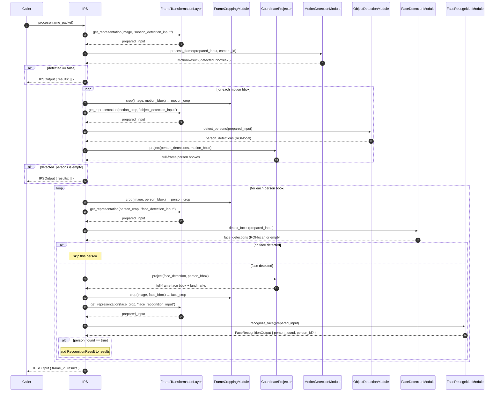

# Image Processing Service Module Specification

## 1. Overview

### Purpose

The Image Processing Service (IPS) module is responsible for executing a deterministic internal processing pipeline over a single `FramePacket`. It receives a prepared `FramePacket`, orchestrates all internal detection and recognition stages, and returns a structured `IPSOutput` containing the set of recognized faces found in the frame.

IPS owns orchestration only. It does not implement detection algorithms, embedding logic, or preprocessing. Each processing responsibility belongs to a dedicated internal module. IPS wires those modules together, controls execution order, applies routing decisions, performs region cropping, and projects coordinates between stages.

### In Scope

- Executing the per-frame detection and recognition pipeline
- Invoking internal modules in the defined execution order
- Applying routing logic (stop conditions and per-person skip logic)
- Cropping region-of-interest images at each pipeline stage via `FrameCroppingModule`
- Projecting ROI-local detections to full-frame coordinates via `CoordinateProjector`
- Requesting prepared input representations from `FrameTransformationLayer` before each module
- Accumulating projected person bounding boxes and face detections into `FramePacket`
- Aggregating all recognition results into a single `IPSOutput`

### Out of Scope

The Image Processing Service does NOT:

- Implement motion detection, object detection, face detection, or face recognition algorithms
- Perform any image preprocessing — color conversion, resizing, normalization, layout conversion, or dtype conversion
- Manage identity enrollment or gallery updates
- Access the filesystem after initialization
- Process multiple `FramePacket` instances concurrently within one pipeline execution
- Accept batched input — one `FramePacket` per invocation

---

## 2. Input Definition

### 2.1 Public API

```text
process(frame_packet: FramePacket) -> IPSOutput
```

IPS receives a single `FramePacket` per invocation and returns a single `IPSOutput`.

### 2.2 Input Structure

```text
struct Image {
    uint32 width;
    uint32 height;
    string color_format;
    string layout;
    string dtype;
    bytes  pixels;
}

struct FramePacket {
    string frame_id;
    string camera_id;
    int64  timestamp_ms;
    int32  width;
    int32  height;
    string pixel_format;
    Image  image;
}
```

### 2.3 Input Contract

`FramePacket` must satisfy the following before `process` is called:

- `frame_id` must be present and non-empty
- `camera_id` must be present and non-empty
- `timestamp_ms` must be present
- `image` must be present and non-null
- `image.width` and `image.height` must be greater than zero
- `image.pixels` must be non-empty

The input `FramePacket` carries only ingress fields at the call boundary. IPS enriches the packet with detection and recognition results during pipeline execution.

### 2.4 Input Semantics

- `frame_id` — unique identifier for the source frame; preserved for traceability throughout the pipeline
- `camera_id` — identifies the source camera; used by `MotionDetectionModule` to scope per-camera state
- `timestamp_ms` — capture timestamp in milliseconds; preserved for traceability
- `image` — the decoded frame image; used by `FrameCroppingModule` and `FrameTransformationLayer`

---

## 3. Output Definition

### 3.1 Output Structure

```text
struct CanonicalBoundingBox {
    int32 x;
    int32 y;
    int32 width;
    int32 height;
}

struct RecognitionResult {
    string               person_id;
    CanonicalBoundingBox face_bbox;
}

struct IPSOutput {
    string                    frame_id;
    vector<RecognitionResult> results;
}
```

### 3.2 Output Semantics

- `frame_id` — copied from `FramePacket.frame_id` for traceability
- `results` — the set of recognized faces found in the frame; may be empty; each entry corresponds to one accepted face recognition result
- `RecognitionResult.person_id` — the identity of the recognized person; present for every entry in `results`
- `RecognitionResult.face_bbox` — the full-frame bounding box of the recognized face; coordinates are expressed relative to the full input frame with origin at the top-left corner

### 3.3 Output Constraints

- `results` is always present; it is empty when no persons were detected, no faces were detected, or no faces were recognized
- Each entry in `results` corresponds to exactly one accepted face recognition result from one face-region crop
- The output must not expose detection confidence scores, embeddings, rejected candidates, intermediate bounding boxes, or per-stage routing decisions
- `IPSOutput` is always structurally valid; IPS never returns a partial or inconsistent output

---

## 4. Module Responsibilities

IPS is a pipeline orchestration module. Its exclusive responsibilities are:

- **Execution order** — invoke internal modules in the defined deterministic sequence
- **Stage routing** — inspect results at each routing point and apply stop or skip conditions
- **Region cropping** — invoke `FrameCroppingModule` at each crop stage to produce region-of-interest images
- **Coordinate projection** — invoke `CoordinateProjector` after object detection and face detection to map ROI-local detections to full-frame coordinates
- **Representation requests** — invoke `FrameTransformationLayer` before each module to obtain module-ready input representations
- **Accumulation** — collect projected person bounding boxes and projected face detections into `FramePacket` enrichment fields
- **Result aggregation** — collect all `person_found = true` recognition results and assemble the final `IPSOutput`

IPS must not implement any detection, embedding, matching, preprocessing, or media handling logic. All such logic belongs to dedicated internal modules.

---

## 5. Internal Components

### 5.1 PipelineOrchestrator

`PipelineOrchestrator` is the internal execution controller. It owns no detection or processing logic.

Its responsibilities are:

- receive the incoming `FramePacket`
- invoke internal modules in the defined order
- invoke `FrameTransformationLayer` before each module requiring a prepared input
- invoke `FrameCroppingModule` at each crop stage
- invoke `CoordinateProjector` after object detection and face detection
- apply routing decisions at each stage gate
- accumulate projected person and face detections into `FramePacket` enrichment fields
- collect accepted recognition results
- construct and return `IPSOutput`

`PipelineOrchestrator` must not embed detection algorithms, preprocessing logic, or coordinate arithmetic directly. It delegates all non-orchestration responsibilities to the appropriate internal module.

### 5.2 FrameTransformationLayer

`FrameTransformationLayer` is a request-driven internal representation service.

Its responsibilities are:

- accept a source image and a representation name
- apply the transformation contract associated with that representation name
- return a module-ready input representation

Transformation contracts are configuration-defined and specify color format, layout, dtype, value range, and dimensions. `FrameTransformationLayer` applies all preprocessing: resizing, normalization, color format conversion, layout conversion, dtype conversion, and payload decoding. No module performs any of these operations independently.

Representation names used by IPS:

| Representation name        | Consumed by               |
|----------------------------|---------------------------|
| `motion_detection_input`   | MotionDetectionModule     |
| `object_detection_input`   | ObjectDetectionModule     |
| `face_detection_input`     | FaceDetectionModule       |
| `face_recognition_input`   | FaceRecognitionModule     |

### 5.3 FrameCroppingModule

`FrameCroppingModule` is a stateless internal component that crops a rectangular region from the decoded frame image.

Its responsibilities are:

- accept a decoded frame image and a `CanonicalBoundingBox`
- return the cropped region as an in-memory image

`FrameCroppingModule` does not decode raw bytes and does not perform any pixel transformation. Cropped images exist only within the current frame-processing lifecycle.

### 5.4 CoordinateProjector

`CoordinateProjector` is a stateless internal component that translates ROI-local detections into full-frame coordinates.

Its responsibilities are:

- accept an array of ROI-local detections and the source ROI bounding box
- add the ROI origin `(roi.x, roi.y)` to all coordinate fields of each detection
- return the projected detections in full-frame coordinates

`CoordinateProjector` does not apply any acceptance logic and does not modify detection content beyond coordinate offset.

### 5.5 MotionDetectionModule

`MotionDetectionModule` determines whether the frame contains motion relative to the previously processed frame for the same `camera_id`.

Its responsibilities are:

- receive a prepared `motion_detection_input` representation
- compare against the previously stored frame for the given `camera_id`
- produce a `MotionResult` containing a `detected` flag and, when `detected = true`, bounding boxes of motion regions in frame coordinates

This module is stateful: it retains exactly one previous frame per `camera_id`. All other state is per-invocation.

### 5.6 ObjectDetectionModule

`ObjectDetectionModule` detects persons within a single motion-region crop.

Its responsibilities are:

- receive a prepared `object_detection_input` representation from a motion-region crop
- detect persons within that region
- return person bounding boxes in ROI-local coordinates

It does not detect other object classes and does not perform coordinate projection.

### 5.7 FaceDetectionModule

`FaceDetectionModule` detects faces within a single person-region crop.

Its responsibilities are:

- receive a prepared `face_detection_input` representation from a person-region crop
- detect faces within that region
- return face bounding boxes and canonical 5-point landmarks in ROI-local coordinates

One crop per invocation. The module is stateless per invocation.

### 5.8 FaceRecognitionModule

`FaceRecognitionModule` identifies a single detected face against the in-memory gallery.

Its responsibilities are:

- receive a prepared `face_recognition_input` representation from a face-region crop
- extract a face embedding
- compare the embedding against the loaded gallery
- return `person_found` and, when a match is accepted, `person_id`

The module does not access disk during recognition. It reads exclusively from the in-memory gallery loaded at initialization.

### 5.9 FaceGalleryLoader

`FaceGalleryLoader` is an initialization-only component.

Its responsibilities are:

- load precomputed face embeddings from the gallery directory at startup
- validate embedding files (dimension, dtype, structure)
- build the in-memory gallery cache used by `FaceRecognitionModule`

`FaceGalleryLoader` does not participate in per-frame processing. After a successful load, the gallery is immutable for the IPS lifecycle.

---

## 6. Internal Pipeline

For each `FramePacket` received by `process`, `PipelineOrchestrator` executes the following sequence.

### 6.1 Execution Steps

```
1.  Request `motion_detection_input` from FrameTransformationLayer
2.  Invoke MotionDetectionModule
3.  MotionDetectionModule writes FramePacket.motion { detected, bboxes? }
4.  If motion.detected == false → stop; return IPSOutput with empty results

5.  For each bbox in FramePacket.motion.bboxes:
    a. Invoke FrameCroppingModule → produce motion-region crop

6.  For each motion-region crop:
    a. Request `object_detection_input` from FrameTransformationLayer (scoped to this crop)
    b. Invoke ObjectDetectionModule
    c. Collect person detections in ROI-local coordinates
    d. Invoke CoordinateProjector with motion-region bbox → project to full-frame coordinates
    e. Accumulate projected person bboxes

7.  Write accumulated person bboxes to FramePacket.detected_persons
8.  If FramePacket.detected_persons is empty → stop; return IPSOutput with empty results

9.  For each bbox in FramePacket.detected_persons:
    a. Invoke FrameCroppingModule → produce person-region crop
    b. Request `face_detection_input` from FrameTransformationLayer (scoped to this crop)
    c. Invoke FaceDetectionModule (one crop per invocation)
    d. If no face detected → skip this person; continue to next
    e. Invoke CoordinateProjector with person-region bbox → project face bbox and landmarks to full-frame
    f. Write projected DetectedFace to FramePacket.detected_faces
    g. Invoke FrameCroppingModule on face bbox → produce face-region crop
    h. Request `face_recognition_input` from FrameTransformationLayer (scoped to face crop)
    i. Invoke FaceRecognitionModule
    j. If person_found == true → add RecognitionResult { person_id, face_bbox } to results

10. Construct and return IPSOutput { frame_id, results }
```

### 6.2 Routing Invariants

- Object Detection is invoked once per motion-region crop; never on the full frame
- Face Detection is invoked once per person-region crop; never on the full frame or multiple crops in one call
- Face Recognition is invoked once per face-region crop
- All coordinate projection is performed exclusively by `CoordinateProjector`; modules produce only ROI-local detections
- `FrameTransformationLayer` is called by `PipelineOrchestrator` between stages; it is never called by a module directly

---

## 7. Data Structures

### 7.1 FramePacket Enrichment Fields

`FramePacket` carries enrichment fields written by IPS during pipeline execution. Each enrichment field is immutable once the stage responsible for it completes. Subsequent stages read these fields and do not rewrite them.

```text
struct FramePacket {
    // Ingress fields — immutable throughout the pipeline
    string frame_id;
    string camera_id;
    int64  timestamp_ms;
    int32  width;
    int32  height;
    string pixel_format;
    Image  image;

    // Enrichment fields — written by the named stage; immutable after that stage completes
    MotionResult             motion;            // written after Motion Detection
    CanonicalBoundingBox[]   detected_persons;  // written after Object Detection + projection
    DetectedFace[]           detected_faces;    // written after Face Detection + projection
}
```

### 7.2 MotionResult

```text
struct MotionResult {
    bool                   detected;
    CanonicalBoundingBox[] bboxes;   // present only when detected = true; at least one entry
}
```

- `detected` — always present; `true` when motion was identified, `false` otherwise
- `bboxes` — present only when `detected = true`; each entry is an axis-aligned bounding box of a contiguous motion region in full-frame coordinates

### 7.3 DetectedFace

```text
struct DetectedFace {
    CanonicalBoundingBox face_bbox;   // in full-frame coordinates
    FaceLandmarks        landmarks;  // canonical 5-point landmarks in full-frame coordinates
}

struct FaceLandmarks {
    Point left_eye;
    Point right_eye;
    Point nose;
    Point mouth_left;
    Point mouth_right;
}

struct Point {
    int32 x;
    int32 y;
}
```

### 7.4 CanonicalBoundingBox

```text
struct CanonicalBoundingBox {
    int32 x;       // left edge in pixel coordinates; origin at top-left of the full frame
    int32 y;       // top edge in pixel coordinates
    int32 width;   // region width in pixels; strictly positive
    int32 height;  // region height in pixels; strictly positive
}
```

All bounding boxes produced by pipeline modules and projected by `CoordinateProjector` are expressed as `CanonicalBoundingBox`. Module-internal coordinate formats are converted before being stored in `FramePacket` or passed to `FrameCroppingModule`.

---

## 8. State Management

- **IPS is stateless per frame.** Each invocation of `process` is independent. No data from one invocation carries to the next except as described below.
- **MotionDetectionModule is stateful.** It retains exactly one previous frame per `camera_id` across invocations. This state is internal to `MotionDetectionModule` and is not exposed to `PipelineOrchestrator` or any other component.
- **FaceRecognitionModule reads from an immutable in-memory gallery.** The gallery is loaded once at initialization by `FaceGalleryLoader`. It is read-only during frame processing. No disk access occurs during recognition.
- **FramePacket enrichment fields are write-once.** Each field is written exactly once by the stage responsible for it and is immutable after that stage completes.
- **Cropped images are transient.** Cropped images produced by `FrameCroppingModule` exist only within the current frame-processing lifecycle. They are not retained across invocations.

---

## 9. Error Handling

All error states produce a structurally valid `IPSOutput`. IPS never returns a partial output.

| Failure scenario | Behavior |
|---|---|
| Invalid `FramePacket` (missing fields, zero dimensions) | Return `IPSOutput` with empty `results`; stop processing |
| `MotionDetectionModule` runtime failure | Return `IPSOutput` with empty `results`; stop processing |
| `motion.detected = false` | Return `IPSOutput` with empty `results`; normal stop condition |
| `ObjectDetectionModule` runtime failure for a motion-region crop | Skip that crop; continue with remaining motion-region crops |
| No person detections across all motion regions | Return `IPSOutput` with empty `results`; normal stop condition |
| `FaceDetectionModule` returns no face for a person-region crop | Skip that person; continue with remaining persons |
| `FaceDetectionModule` runtime failure for a person-region crop | Skip that person; continue with remaining persons |
| `FaceRecognitionModule` runtime failure for a face-region crop | Skip that face; continue with remaining faces |
| `FaceRecognitionModule` returns `person_found = false` | Skip that face; normal operation |

**Skip vs stop rules:**
- A failure at the Motion Detection or person accumulation stage stops the entire pipeline for the current frame.
- A failure at the per-person or per-face level skips only that person or face. The pipeline continues processing remaining items.
- IPS never returns a partial `FramePacket`. The returned value is always a complete `IPSOutput`.

---

## 10. Class Diagram

```mermaid
classDiagram
    class IPS {
        +process(frame_packet: FramePacket) IPSOutput
    }

    class PipelineOrchestrator {
        +run(frame_packet: FramePacket) IPSOutput
    }

    class FrameTransformationLayer {
        +get_representation(image: Image, name: string) PreparedInput
    }

    class FrameCroppingModule {
        +crop(image: Image, region: CanonicalBoundingBox) CroppedImage
    }

    class CoordinateProjector {
        +project(detections: LocalDetection[], roi: CanonicalBoundingBox) FullFrameDetection[]
    }

    class MotionDetectionModule {
        +process_frame(input: PreparedInput, camera_id: string) MotionResult
    }

    class ObjectDetectionModule {
        +detect_persons(input: PreparedInput) PersonDetection[]
    }

    class FaceDetectionModule {
        +detect_faces(input: PreparedInput) FaceDetection[]
    }

    class FaceRecognitionModule {
        +recognize_face(input: PreparedInput) FaceRecognitionOutput
    }

    class FaceGalleryLoader {
        +load_gallery(gallery_root_path: string) void
    }

    IPS --> PipelineOrchestrator : delegates to
    PipelineOrchestrator --> FrameTransformationLayer : requests representations
    PipelineOrchestrator --> FrameCroppingModule : crops regions
    PipelineOrchestrator --> CoordinateProjector : projects detections
    PipelineOrchestrator --> MotionDetectionModule : invokes
    PipelineOrchestrator --> ObjectDetectionModule : invokes per motion-region
    PipelineOrchestrator --> FaceDetectionModule : invokes per person-region
    PipelineOrchestrator --> FaceRecognitionModule : invokes per face-region
    FaceGalleryLoader ..> FaceRecognitionModule : loads gallery at startup
```



---

## 11. Sequence Diagram



---

## 12. Design Principles

- **Deterministic pipeline.** The execution sequence is fixed. Given the same input, the same stored motion state, and the same gallery, IPS produces identical results.

- **Strict separation of concerns.** Each internal component owns exactly one responsibility. `PipelineOrchestrator` orchestrates and routes. `FrameCroppingModule` crops. `CoordinateProjector` projects. Detection and recognition modules compute. No component duplicates another's responsibility.

- **No preprocessing inside modules.** All image preprocessing — resizing, normalization, color format conversion, layout conversion, dtype conversion — is the exclusive responsibility of `FrameTransformationLayer`. Modules receive fully prepared representations and send them directly to their processing engines without modification.

- **Geometric consistency.** All detections produced by modules are in ROI-local coordinates. `CoordinateProjector` is the single point of responsibility for translating ROI-local coordinates to full-frame coordinates. No coordinate arithmetic is performed outside `CoordinateProjector`.

- **Write-once enrichment.** Each `FramePacket` enrichment field is written exactly once by the stage responsible for it and is treated as immutable by all subsequent stages.

- **No external side effects.** IPS produces only a structured `IPSOutput`. It does not access the filesystem during frame processing, does not write to shared stores, and does not communicate with external systems.

- **Fail safe.** Any stage failure produces a structurally valid `IPSOutput`. Failures at the per-person or per-face level skip only that item. No partial or inconsistent output is ever returned.

- **Algorithm-agnostic API.** The `process(frame_packet) -> IPSOutput` contract is stable regardless of which detection or recognition engines are configured internally. Replacing an internal engine does not change the public API.