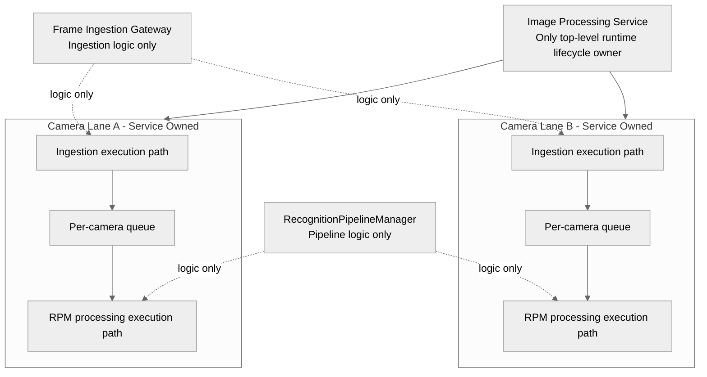
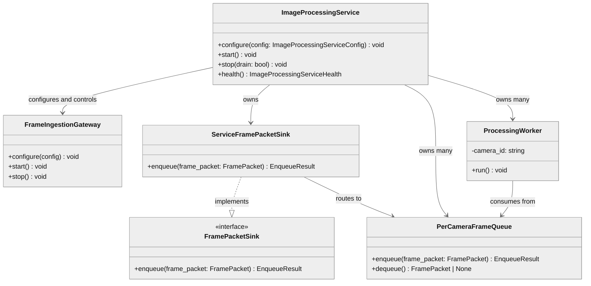
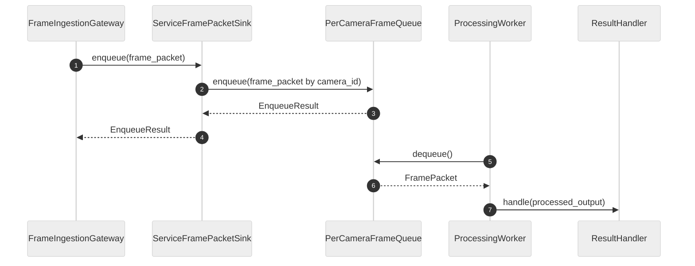
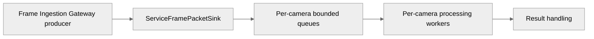

# Image Processing Service Module Specification

## 1. Scope

### Purpose

The Image Processing Service is the only top-level runtime lifecycle owner. It owns runtime queueing and worker scheduling between ingress publication and downstream frame processing. It owns bounded per-camera FramePacket queues, queue overflow behavior, ingestion execution workers, RPM processing execution workers, and end-to-end dispatch. It provides a FramePacketSink implementation to the Frame Ingestion Gateway and treats the Gateway as a producer boundary. It also owns the authoritative STOPPING gate and service-level health escalation.

Only Image Processing Service creates, owns, starts, stops, and supervises runtime threads.

### In Scope

- Loading and validating service configuration
- Creating bounded per-camera FramePacket queues
- Creating and owning ServiceFramePacketSink
- Routing incoming FramePacket objects to per-camera queues
- Owning queue capacity and overflow policy
- Owning ingestion execution worker scheduling and lifecycle
- Owning processing worker scheduling and lifecycle
- Owning frame consumption loops
- Starting and stopping the Gateway as part of service lifecycle
- Exposing service health and service metrics
- Exposing lane-level and service-level health mappings

### Out of Scope

The service does not:

- Redefine shared FramePacket
- Re-implement Gateway validation, decode, or normalization internals
- Perform frame ingestion transport handling
- Expose raw pixel data in service API

---

## 2. Shared Contracts and Input Boundary

### 2.1 Shared FramePacket Contract

FramePacket is defined once in shared_contracts.md Section 7 and is the authoritative ingestion-boundary raw frame container.

This service does not define or override FramePacket.

### 2.2 Sink Boundary

The service provides a sink implementation to the Gateway:

```text
class ServiceFramePacketSink implements FramePacketSink
```

Gateway publishes accepted frames via FramePacketSink.enqueue(frame_packet). The service consumes that callback and routes packets into service-owned queues.

### 2.3 ServiceFramePacketSink Behavior

```text
enqueue(frame_packet: FramePacket) -> EnqueueResult
```

Behavior:

- Validate frame_packet.camera_id is in configured camera_ids
- Route packet to the matching bounded queue
- Reject enqueue when service state is STOPPING or STOPPED using canonical STOPPING rejection
- If queue has capacity, enqueue and return accepted=true
- If queue is full, apply overflow_policy
- Return EnqueueResult

Unknown camera behavior:

- Unknown camera_id at this boundary is treated as a canonical UNKNOWN_CAMERA / BOUNDARY_VIOLATION rejection
- Frame Ingestion Gateway should reject unknown cameras before sink publication when possible; if one reaches this boundary, the service records the defensive rejection using the same canonical code family
- defensive_unknown_camera_rejected_total is incremented
- No dynamic queue creation in v1

### 2.4 Shutdown, Drain, and Freshness Semantics

STOPPING is the authoritative atomic enqueue gate.

Rules:

- Image Processing Service transitions atomically into STOPPING
- enqueue_accepting=false is set immediately at the STOPPING transition
- all new enqueue operations reject with canonical STOPPING
- in-flight enqueue behavior is deterministic; a call either completes before STOPPING takes effect or returns STOPPING without partial queue or accounting mutation
- no partial queue mutation or byte-accounting mutation is allowed during STOPPING

`stop(drain: bool)` semantics:

- `stop(drain=false)` drops all queued frames immediately
- `stop(drain=true)` keeps processing remaining fresh queued frames until `max_drain_timeout_ms` expires
- stale policy remains active during drain
- stale queued frames are dropped and counted during drain
- in-flight processing may complete normally during drain
- when drain timeout expires, remaining queued frames are dropped and counted as `shutdown_dropped_frames_total`
- `worker_shutdown_timeout_ms` bounds worker teardown after queue handling completes

Freshness checkpoints:

1. dequeue-time validation
2. post-dequeue pre-processing validation
3. shutdown-drain validation

Freshness rules:

- stale frames are dropped and counted at every freshness checkpoint
- `stale_preprocessing_drop_total` counts frames that become stale after dequeue but before downstream processing begins
- `stale_shutdown_drop_total` counts frames dropped during shutdown drain because they are stale at drain time
- `stale_completed_processing_total` counts frames that complete normally after becoming stale while already in flight
- cold-start frames initialize temporal state, count as dequeued runtime work, and do not count as completed detection processing

### 2.5 Canonical Rejection Taxonomy

All gateway and IPS enqueue/health/logging paths use the same canonical rejection taxonomy.

```text
enum EnqueueRejectReason {
    STOPPING,
    QUEUE_FULL_DROP_NEWEST,
    QUEUE_FULL_REJECT,
    GLOBAL_MEMORY_LIMIT,
    SINK_UNAVAILABLE,
    UNKNOWN_CAMERA,
    BOUNDARY_VIOLATION,
    INTERNAL_ERROR
}
```

Rules:

- `STOPPING` is the canonical rejection for shutdown gating
- `QUEUE_FULL_DROP_NEWEST` and `QUEUE_FULL_REJECT` distinguish the configured queue overflow response
- `GLOBAL_MEMORY_LIMIT` is used when global queue-memory pressure prevents acceptance even though the local camera queue is within its own limit
- `SINK_UNAVAILABLE` is used when the downstream sink boundary cannot accept work
- `UNKNOWN_CAMERA` is used when a frame arrives for an unconfigured camera_id
- `BOUNDARY_VIOLATION` is used when an input violates an ownership or contract boundary other than unknown camera
- `INTERNAL_ERROR` is used for unexpected runtime failures that are not boundary, capacity, or shutdown conditions
- metrics, logs, and health summaries must use these canonical codes consistently

---

## 3. Queue Ownership and Policy

### 3.1 Per-Camera Queue Model

- Exactly one queue per configured camera_id
- Queues are bounded
- Queues are thread-safe
- FIFO order is preserved per camera
- Queue ownership belongs to Image Processing Service
- Queues are internal runtime structures of Image Processing Service
- Queues are not externally exposed
- Queues are not directly owned, exposed, or manipulated by Frame Ingestion Gateway
- Queues are not directly owned, exposed, or manipulated by RecognitionPipelineManager
- Queues store FramePacket objects as immutable shared references
- Queue enqueue and dequeue operations must not mutate FramePacket.image_bytes
- Each camera queue must enforce an independent per-camera memory limit
- Queue memory is officially bounded
- Queue accounting includes queued FramePacket bytes only; it does not include derived processing buffers
- FTL and RPM working memory are deployment-bounded outside queue accounting
- Queue retention is bounded to CURRENT/PREVIOUS temporal needs only; deep frame history retention is prohibited

Immutable-reference semantics:

- FramePacket.image_bytes ownership is immutable after construction.
- Workers must never mutate FramePacket contents.
- Processing stages requiring derived buffers must allocate derived representations instead of mutating FramePacket.
- Immutable FramePacket behavior applies across queue boundaries and worker boundaries.

### 3.2 Realtime Queue Configuration

```text
struct QueuePolicyConfig {
    int32 max_queue_size_per_camera;
    int64 max_queue_bytes_per_camera;
    int64 reserved_queue_bytes_per_camera;
    int64 max_total_queued_bytes;
    int32 max_frame_age_ms;
    OverflowPolicy overflow_policy; // default DROP_OLDEST
}

struct ShutdownPolicyConfig {
    int64 max_drain_timeout_ms;
    int64 worker_shutdown_timeout_ms;
}

struct ProcessingBudgetConfig {
    int32 max_motion_regions_per_frame;
    int32 max_person_rois_per_frame;
    int32 max_face_rois_per_frame;
}

enum OverflowPolicy {
    DROP_OLDEST,
    DROP_NEWEST,
    REJECT
}
```

### 3.3 Overflow Behavior

DROP_OLDEST:

- Remove oldest frame from that camera queue first
- Enqueue incoming newest frame second
- The remove-then-enqueue operation must occur atomically inside a single synchronized queue mutation
- Queue byte accounting updates for remove-then-enqueue must be atomic and consistent with queue mutation state
- If queue mutation or accounting fails, rollback must restore both queue state and byte counters before returning rejection
- Increment frames_dropped_oldest_total

DROP_NEWEST:

- Reject incoming frame
- Existing queue contents remain unchanged
- Increment frames_dropped_newest_total

REJECT:

- Reject incoming frame
- Reject enqueue without modifying queue state
- Return EnqueueResult accepted=false

Deterministic ordering rule:

- Overflow handling must preserve per-camera FIFO semantics for retained frames.

### 3.4 Queue Limit Precedence and Fairness

Deterministic limit precedence on enqueue:

1. Evaluate per-camera queue limits first.
2. Preserve each camera's reserved queue bytes during global pressure.
3. Evaluate global queued-byte limits second.

Global fairness rule:

- Global queued-byte limits must not allow one camera to starve other cameras.
- `reserved_queue_bytes_per_camera` protects each lane from cross-camera starvation.
- Shared downstream components must avoid coarse global locks that serialize cameras.

Per-frame fairness rules:

- excess ROI fan-out must be dropped deterministically when per-frame caps are reached
- realtime freshness takes precedence over exhaustive completeness

### 3.5 Realtime Freshness Priority

- Realtime freshness takes precedence over frame completeness in realtime mode.
- The service prioritizes recent frames over exhaustive retention.
- Overflow policies, stale-frame dropping, bounded queues, and queue freshness limits are designed around realtime freshness guarantees.
- Realtime mode intentionally permits frame dropping under pressure.
- freshness checks apply at dequeue, post-dequeue pre-processing, and shutdown drain

---

## 4. Worker Model and Scheduling

The service owns frame-consuming worker threads and dispatch policy.
Only Image Processing Service creates, owns, starts, stops, and supervises runtime threads.

Recommended v1 model:

- One IPS-managed ingestion execution worker per configured camera_id
- One IPS-managed RPM processing execution worker per configured camera_id
- Each RPM processing worker consumes from its matching per-camera queue
- Per-camera execution lanes preserve FIFO and avoid one camera blocking another

Worker constraints:

- Workers must not mutate FramePacket
- Scheduling policy must preserve fairness across cameras at service level
- Workers requiring transformed image memory must allocate derived buffers and leave FramePacket unchanged
- Short queue synchronization, atomic counters, and bounded internal synchronization are allowed
- Coarse global locks, cross-camera serialization, and long shared blocking hot-path operations are prohibited
- One camera lane must not block unrelated lanes

### 4.2 Per-Frame Budgeting

- Per-frame processing must remain bounded
- ROI fan-out is capped by `max_motion_regions_per_frame`, `max_person_rois_per_frame`, and `max_face_rois_per_frame`
- Excess ROIs are dropped deterministically before downstream fan-out continues
- Realtime freshness is prioritized over exhaustive completeness
- `frame_processing_duration_ms`, `roi_dropped_total`, and `over_budget_frame_total` capture per-frame budget pressure
- No force-kill or mid-frame cancellation is supported in v1

### 4.3 Freshness Validation During Execution

- Dequeue-time validation rejects stale frames before downstream work begins
- Post-dequeue pre-processing validation rejects frames that become stale after dequeue but before processing starts
- Shutdown-drain validation rejects frames that are stale when drain begins or when they age out during drain
- Stale frames are dropped and counted, but in-flight processing may complete normally
- `stale_preprocessing_drop_total`, `stale_shutdown_drop_total`, and `stale_completed_processing_total` are the canonical freshness counters

### 4.4 Per-Camera Lane Model

Each configured camera has one Image Processing Service-owned runtime lane containing:

- ingestion execution path
- queue
- RPM processing execution path

Frame Ingestion Gateway contributes ingestion logic in the lane but does not own runtime lifecycle. RecognitionPipelineManager contributes processing logic in the lane but does not own queue or runtime lifecycle.

Reference lane structure:

```text
Image Processing Service
 ├── Camera A Lane
 │    ├── Ingestion Execution
 │    ├── Queue
 │    └── RPM Execution
 └── Camera B Lane
    ├── Ingestion Execution
    ├── Queue
    └── RPM Execution
```

---

## 5. Public API

```text
void                         configure(config: ImageProcessingServiceConfig)
void                         start()
void                         stop(drain: bool)
ImageProcessingServiceHealth health()
```

- configure() loads config and prepares queues/sink.
- start() starts Gateway behavior and service-managed ingestion/RPM execution workers.
- stop(drain) enforces shutdown policy.

---

## 6. Internal Components

### 6.1 ImageProcessingService

Lifecycle owner and orchestrator for queues, sink, ingestion execution workers, RPM processing execution workers, and processing engine integration.

### 6.2 ServiceConfigValidator

Validates ImageProcessingServiceConfig and queue policy constraints.

### 6.3 ServiceFramePacketSink

Service-owned sink implementation of FramePacketSink that routes FramePacket to per-camera queues.

### 6.4 PerCameraFrameQueue

Bounded thread-safe FIFO queue for one configured camera_id.

### 6.5 FrameQueueRegistry

Read-mostly mapping camera_id -> PerCameraFrameQueue.

### 6.6 ProcessingWorker

Consumes from a single per-camera queue and dispatches frames to configured processing engine.

### 6.7 Runtime Ownership Contract

- Image Processing Service is the only top-level runtime lifecycle owner.
- Only Image Processing Service creates, owns, starts, stops, and supervises runtime threads.
- Frame Ingestion Gateway owns ingestion logic only.
- RecognitionPipelineManager owns recognition pipeline logic only.
- Frame Ingestion Gateway and RecognitionPipelineManager do not own runtime lifecycle or runtime threads.
- RecognitionPipelineManager does not own queues, queue pulling, or queue lifecycle management.
- RecognitionPipelineManager executes under Image Processing Service-managed lifecycle ownership.

### 6.8 Runtime Health and Observability Contract

IPS owns runtime DEGRADED and ERROR transitions.

Rules:

- Gateway and RPM expose local symptoms only
- IPS maps local symptoms into lane-level health and service-level health
- `lane_health_by_camera_id`, `degraded_reason_code`, and `degraded_reason_message` are the canonical health detail fields
- `health()` must return service-level health with lane-level detail when available
- repeated failures remain lane-local first
- local backoff and cooldown behavior is allowed
- lane-local DEGRADED state is allowed
- service-wide DEGRADED is emitted only when shared runtime stability is impacted
- metrics emission must be non-blocking
- logging must be rate-limited
- blocking metrics flushes, synchronous hot-path remote logging, and global logging serialization are prohibited
- `cold_start_frame_total`, `camera_warmup_state`, and `warmup_completed_at_ms` provide cold-start observability
- cold-start frames initialize temporal state, count as dequeued runtime work, and do not count as completed detection processing

### 6.9 ResultHandler

Handles processing outputs and updates processing-facing metrics.

---

## 7. Lifecycle

### 7.0 Lifecycle States

- INITIALIZING
- RUNNING
- STOPPING
- STOPPED
- DEGRADED

State transitions are owned by Image Processing Service.

### 7.0.1 Worker Timeout and DEGRADED Behavior

- Long processing duration in a service-managed worker marks service state DEGRADED.
- Worker timeout transitions increment worker_timeout_total.
- DEGRADED state includes structured reason fields in health for operational diagnostics.
- This specification does not define force-kill thread behavior.

### 7.1 Initialization (configure)

1. Validate ImageProcessingServiceConfig.
2. Create one bounded PerCameraFrameQueue per camera_id.
3. Build FrameQueueRegistry.
4. Create ServiceFramePacketSink bound to registry and overflow policy.
5. Configure Gateway with:
   - sink = ServiceFramePacketSink
   - configured camera set derived from service camera_ids
6. Create service-managed ingestion execution workers.
7. Create service-managed RPM execution workers and bind each worker to its queue.

### 7.2 Startup (start)

1. Transition state to INITIALIZING.
2. Start Gateway behavior under Image Processing Service lifecycle authority.
3. Start service-managed ingestion execution workers.
4. Start service-managed RPM processing workers.
5. Transition state to RUNNING.

### 7.3 Steady State

1. Gateway publishes FramePacket to ServiceFramePacketSink.enqueue.
2. ServiceFramePacketSink routes to per-camera queue.
3. RPM processing worker dequeues frame.
4. Validate stale-frame policy before processing:
    - frame_age_ms = current_time_ms - frame.timestamp_ms
    - If frame_age_ms > max_frame_age_ms, drop frame and increment stale_frames_dropped_total.
5. Process non-stale frame.
6. ResultHandler handles output.

### 7.4 Shutdown (stop)

Shutdown is fully initiated and coordinated by Image Processing Service.

Required shutdown order:

1. Stop ingestion execution.
2. Close enqueue acceptance.
3. Drain/drop queues according to policy.
4. Stop RPM processing workers.
5. Release queue resources.
6. Transition state to STOPPED.

Enqueue shutdown gate:

- Once service state becomes STOPPING, new enqueue requests must be rejected.

---

## 8. Health

```text
struct ImageProcessingServiceHealth {
    string state; // INITIALIZING | RUNNING | STOPPING | STOPPED | DEGRADED
    int32  configured_camera_count;
    int32  active_processing_workers;

    int64  total_queued_frames;
    int64  total_queued_bytes;
    map<string,int32> queue_depth_per_camera;
    map<string,int64> queue_bytes_per_camera;

    uint64 frames_dropped_oldest_total;
    uint64 frames_dropped_newest_total;
    uint64 defensive_unknown_camera_rejected_total;
    uint64 stale_frames_dropped_total;
    uint64 worker_error_total;
    uint64 worker_timeout_total;

    float average_queue_wait_ms;
    float max_queue_wait_ms;
    map<string,float> queue_age_p95_per_camera;
    map<string,int64> oldest_frame_age_ms_per_camera;

    map<string,uint64> accepted_per_camera;
    map<string,uint64> dropped_per_camera;
    map<string,uint64> dequeued_per_camera;
    map<string,uint64> processed_per_camera;

    map<string,bool> worker_alive;
    map<string,uint64> last_frame_started_at_ms;
    map<string,uint64> last_frame_completed_at_ms;
    map<string,string> last_error_code;

    string degraded_reason_code;
    string degraded_reason_message;
}
```

Service health includes queue and worker state. It does not expose Gateway ingestion internals.

---

## 9. Service Metrics

- queue_enqueue_latency_ms
- queue_dequeue_latency_ms
- queue_wait_ms (queue_wait_ms = dequeue_time - enqueue_time; processing time excluded)
- frames_enqueued_total
- frames_dequeued_total
- frames_dropped_total
- frames_dropped_oldest_total
- frames_dropped_newest_total
- stale_frames_dropped_total
- processing_worker_latency_ms
- queue_age_p95_per_camera
- worker_timeout_total
- degraded_reason_code
- degraded_reason_message
- accepted_per_camera
- dropped_per_camera
- dequeued_per_camera
- processed_per_camera

Observability performance requirements:

- Metrics emission must be non-blocking.
- Burst logging must be rate-limited.

---

## 10. Error Handling

| Error | Trigger | Behavior |
|-------|---------|----------|
| ServiceConfigurationError | Invalid service config | Fail configure() |
| EnqueueRejectedServiceStopping | enqueue while service state is STOPPING or STOPPED | Return EnqueueResult accepted=false |
| UnknownCameraBoundaryViolation | enqueue for unknown camera_id at service sink boundary | Return EnqueueResult accepted=false, increment defensive_unknown_camera_rejected_total |
| QueueOverflowDropOldest | Queue full and overflow policy DROP_OLDEST | Drop oldest, enqueue new frame, increment frames_dropped_oldest_total |
| QueueMutationRollback | Queue mutation or accounting operation fails during enqueue | Rollback queue mutation and accounting atomically, return EnqueueResult accepted=false |
| QueueOverflowDropNewest | Queue full and overflow policy DROP_NEWEST | Reject incoming frame, increment frames_dropped_newest_total |
| QueueOverflowReject | Queue full and overflow policy REJECT | Return EnqueueResult accepted=false |
| StaleFrameDropped | frame_age_ms > max_frame_age_ms at dequeue | Drop frame, increment stale_frames_dropped_total |
| WorkerProcessingTimeout | Long processing duration exceeds watchdog threshold | Mark service DEGRADED, increment worker_timeout_total, continue per policy |
| WorkerProcessingError | Processing worker exception | Increment worker_error_total, continue worker loop per policy |

---

## 11. Diagrams

Note: Mermaid blocks below include an explicit neutral theme init to keep text and edges readable in VS Code Markdown Preview on light themes.

### 11.0 Runtime Ownership Diagram



### 11.1 Class Diagram



### 11.2 Sequence Diagram



### 11.3 Data Flow Diagram



---

## 12. Configuration

```text
struct ImageProcessingServiceConfig {
    vector<string> camera_ids;
    int32          max_queue_size_per_camera;
    int64          max_total_queued_bytes;
    int32          max_frame_age_ms;
    OverflowPolicy overflow_policy;     // default DROP_OLDEST
    bool           drain_on_shutdown;
}
```

Rules:

- camera_ids must be non-empty, unique, and fixed in v1.
- Dynamic camera registration is not supported in v1.

---

## 13. Boundary Rules

- This module references shared FramePacket and FramePacketSink contracts from shared_contracts.md.
- This module does not redefine Gateway internals.
- frame_ingestion_gateway.md is the sole canonical Gateway specification source.
- Duplicate Gateway spec artifact was intentionally removed to prevent documentation drift.
- Gateway is treated as an external producer through FramePacketSink only.
- Frame Ingestion Gateway owns unknown-camera rejection policy and unknown_camera_rejected_total metrics in normal operation.
- Service-side unknown camera handling is defensive boundary-violation handling only.
- Queue ownership, overflow policy, and worker scheduling belong exclusively to this service.

---

## 14. Test Plan Recommendations

Service-focused test plan recommendations for future implementation:

- Validate ServiceFramePacketSink routes each frame to the matching camera queue.
- Validate STOPPING enqueue gate rejects new enqueue requests.
- Validate service defensive unknown camera rejection path increments defensive_unknown_camera_rejected_total.
- Validate bounded queue behavior at capacity for each overflow policy.
- Validate DROP_OLDEST removes oldest then accepts newest.
- Validate DROP_OLDEST replacement occurs inside one synchronized queue mutation.
- Validate DROP_NEWEST rejects incoming frame and preserves existing queue.
- Validate REJECT returns accepted=false without queue mutation.
- Validate queue limit precedence applies per-camera limits before global queued-byte limits.
- Validate per-camera memory isolation and global fairness under contention.
- Validate per-camera FIFO ordering is preserved.
- Validate one worker consumes only from its matching camera queue.
- Validate workers treat FramePacket as immutable.
- Validate stale frame dropping occurs at dequeue using frame_age_ms formula.
- Validate enqueue during STOPPING state-transition race rejects new enqueues.
- Validate queue byte accounting remains consistent under DROP_OLDEST with concurrent load.
- Validate rollback semantics restore queue and accounting state on failed queue mutation.
- Validate worker timeout transitions service health to DEGRADED and increments timeout metrics.

---

## 15. Module Compliance Checklist

- [ ] Shared FramePacket is referenced from shared_contracts.md only
- [ ] No local divergent FramePacket struct exists
- [ ] ServiceFramePacketSink implements FramePacketSink and returns EnqueueResult
- [ ] Service owns bounded per-camera queues and queue capacities
- [ ] Unknown camera policy ownership is Gateway-owned in normal path
- [ ] Service unknown camera handling is defensive boundary handling only
- [ ] No dynamic queue creation for unknown cameras in v1
- [ ] Overflow policy is explicit and bounded (default DROP_OLDEST)
- [ ] Queue limit precedence is deterministic: per-camera first, global second
- [ ] Per-camera queue memory limits are isolated and independent
- [ ] Global queued-byte fairness prevents one camera starving others
- [ ] Worker scheduling and lifecycle are service-owned
- [ ] Only Image Processing Service creates, owns, starts, stops, and supervises runtime threads
- [ ] Lifecycle states include INITIALIZING, RUNNING, STOPPING, STOPPED, DEGRADED
- [ ] Shutdown order is: stop ingestion execution, close enqueue acceptance, drain/drop queues, stop RPM processing workers
- [ ] Enqueue is rejected once service state is STOPPING
- [ ] Stale-frame validation occurs at dequeue before processing
- [ ] frame_age_ms = current_time_ms - frame.timestamp_ms
- [ ] Service health contains queue/worker metrics only, not Gateway ingestion internals
- [ ] DROP_OLDEST replacement and queue byte accounting updates are atomic and rollback-safe
- [ ] Metrics emission is non-blocking and burst logging is rate-limited
- [ ] Worker timeout can mark service DEGRADED without force-kill behavior requirements
- [ ] frame_ingestion_gateway.md is treated as sole canonical Gateway specification source
