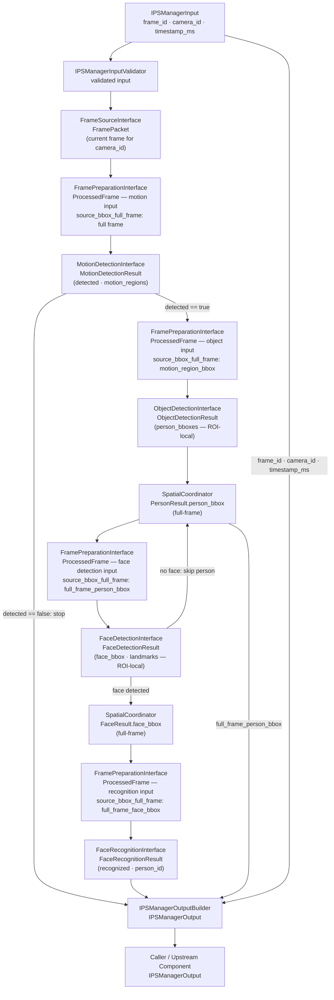

# IPS Manager Module Specification

## 1. Scope

### Purpose

The IPS Manager module is responsible for orchestrating the internal processing pipeline within IPS. It receives a per-camera invocation descriptor, retrieves the current frame for the identified camera, executes the multi-stage detection and recognition pipeline in a deterministic order, projects all ROI-local detection coordinates to full-frame coordinates, and returns a structured `IPSManagerOutput` containing all detected persons, faces, and recognition results for the frame. IPS Manager is the top-level internal execution coordinator for per-camera frame processing.

### In Scope

- Validating the incoming `IPSManagerInput`
- Retrieving the current frame for the identified camera from the configured frame source component
- Creating and maintaining isolated per-camera execution lanes
- Executing the pipeline stages in the defined deterministic order: motion detection → object detection → face detection → face recognition
- Applying routing gate decisions at each pipeline stage boundary
- Requesting prepared frame regions from the configured frame preparation component at each pipeline stage
- Converting all ROI-local detection coordinates to full-frame coordinates via `SpatialCoordinator`
- Assembling a structured `IPSManagerOutput` from all projected person and face results
- Ensuring that execution of one camera's pipeline does not block execution of another camera's pipeline

### Out of Scope

The IPS Manager Module does NOT:

- Perform motion detection, object detection, face detection, or face recognition — handled outside this module
- Perform any image preprocessing (color conversion, resize, normalization, layout conversion, dtype conversion) — handled outside this module
- Decode or access raw pixel data within `IPSManagerInput`
- Implement model inference, embedding extraction, or similarity matching — handled outside this module
- Manage face identity enrollment or gallery updates — handled outside this module
- Access the filesystem after initialization
- Process more than one `IPSManagerInput` per invocation
- Expose raw detection scores, embeddings, landmarks, or intermediate bounding boxes in `IPSManagerOutput`

---

## 2. Input

### 2.1 Input Responsibility Boundary

The module receives a per-camera invocation descriptor containing only scalar metadata fields. The current frame for the identified camera has already been ingested and made available by the upstream frame source component before `process_frame` is called. The following have already been applied:

- Frame capture at the originating source
- Transport-level reception and validation
- FramePacket construction from the validated ingress message
- Storage of the current frame per camera in the upstream frame store

The IPS Manager module does not perform any of the above. Only pipeline orchestration and coordinate projection are performed inside this module.

### 2.2 Input Structure

```text
struct IPSManagerInput {
    uint64 frame_id;
    string camera_id;
    uint64 timestamp_ms;
}
```

`IPSManagerInput` contains only scalar metadata fields. No image or pixel data is part of the public input. The current frame is obtained internally from the configured frame source component using `camera_id`.

### 2.3 Input Contract

`IPSManagerInput` must satisfy the following before `process_frame` is called:

- `frame_id` must be non-zero
- `camera_id` must be present and non-empty
- `timestamp_ms` must be present
- `camera_id` must correspond to a configured and active camera lane

### 2.4 Validation Rules

`IPSManagerInputValidator` must verify:

- `frame_id` must be non-zero
- `camera_id` must exist and be non-empty
- `timestamp_ms` must exist
- `camera_id` must correspond to a configured active `CameraProcessingLane`

### 2.5 Input Semantics

- `frame_id` — unique identifier for the frame to process; used for consistency verification against the retrieved frame and preserved unchanged for traceability throughout the pipeline
- `camera_id` — identifies the source camera; used to route the invocation to the correct `CameraProcessingLane` and to retrieve the current frame from the upstream frame source
- `timestamp_ms` — capture timestamp in milliseconds; preserved unchanged for traceability throughout the pipeline

---

## 3. Output

### 3.1 Output Structure

```text
struct CanonicalBoundingBox {
    int32 x;
    int32 y;
    int32 width;
    int32 height;
}

struct PersonResult {
    CanonicalBoundingBox person_bbox;
}

struct FaceResult {
    CanonicalBoundingBox face_bbox;
    bool                 recognized;
    string               person_id;    // populated only when recognized = true
}

struct IPSManagerOutput {
    uint64               frame_id;
    string               camera_id;
    uint64               timestamp_ms;
    vector<PersonResult> persons;
    vector<FaceResult>   faces;
}
```

### 3.2 Output Semantics

- `frame_id` — copied unchanged from `IPSManagerInput.frame_id` for traceability
- `camera_id` — copied unchanged from `IPSManagerInput.camera_id` for traceability
- `timestamp_ms` — copied unchanged from `IPSManagerInput.timestamp_ms` for traceability
- `persons` — set of all detected persons in the frame; may be empty; each entry is a single detected person bounding box in full-frame coordinates
- `PersonResult.person_bbox` — full-frame bounding box of the detected person; coordinates are expressed relative to the full input frame with origin at the top-left corner
- `faces` — set of all detected faces in the frame with recognition outcomes; may be empty; each entry corresponds to one face detection result
- `FaceResult.face_bbox` — full-frame bounding box of the detected face; coordinates are expressed relative to the full input frame with origin at the top-left corner
- `FaceResult.recognized` — `true` when a valid identity was accepted for this face; `false` when no valid identity was found
- `FaceResult.person_id` — the unique identifier of the recognized identity; populated only when `recognized = true`

### 3.3 Output Constraints

The output must NOT expose:

- Detection confidence scores or similarity scores from any pipeline stage
- Face embeddings or feature vectors
- Facial landmarks or geometric alignment data
- ROI-local bounding boxes or intermediate-stage bounding boxes not projected to full-frame coordinates
- Motion region bounding boxes or intermediate motion detection results
- Routing decisions, skip flags, or pipeline gate outcomes
- Raw pixel data or any intermediate image representation

All pipeline-internal data, intermediate coordinates, and detection artifacts remain strictly internal. The only externally visible results are projected full-frame bounding boxes, recognized identity identifiers, and traceability metadata.

---

## 4. Public API

```text
IPSManagerOutput process_frame(input: IPSManagerInput)
```

The API must remain stable regardless of which pipeline stage implementations are configured. No threshold, conversion contract, or configuration parameter is a parameter of `process_frame` — all such values are immutable internal configuration state loaded at initialization.

---

## 5. Non-Functional Requirements

- **Stateless per invocation** — no cross-frame memory, with the sole exception of `CameraProcessingLane`, which retains per-camera scoped state required for motion continuity detection; this state is isolated per `camera_id` and is never exposed in the public output
- **Single frame per invocation** — upstream callers are responsible for dispatching individual frames; the module must not accept batched input
- **Real-time capable** — suitable for per-frame online processing
- **Deterministic** — same `IPSManagerInput` + same configuration + same frame content + same per-camera state produce the same `IPSManagerOutput`
- **Model-agnostic API** — the public output schema is independent of the underlying pipeline stage implementations
- **Strict isolation** — no internal AI data (detection scores, embeddings, raw tensors, landmarks) escapes the public API
- **Per-camera execution isolation** — processing of one `camera_id` must not block or affect processing of another `camera_id`; camera lanes execute independently

---

## 6. Processing Engine

### 6.1 Engine Abstraction Interfaces

IPS Manager depends on four pipeline stage interfaces, one per processing stage, and two infrastructure abstraction interfaces for frame access and frame preparation:

```text
interface MotionDetectionInterface {
    detect(input: ProcessedFrame, camera_id: string) -> MotionDetectionResult
}

interface ObjectDetectionInterface {
    detect(input: ProcessedFrame) -> ObjectDetectionResult
}

interface FaceDetectionInterface {
    detect(input: ProcessedFrame) -> FaceDetectionResult
}

interface FaceRecognitionInterface {
    recognize(input: ProcessedFrame) -> FaceRecognitionResult
}

interface FrameSourceInterface {
    get_current_frame(camera_id: string) -> FramePacket | None
}

interface FramePreparationInterface {
    get_frame_region(camera_id: string, region_bbox: CanonicalBoundingBox, contract: ConversionContract) -> ProcessedFrame
}
```

`FramePacket` and `ProcessedFrame` are opaque types provided by the respective upstream infrastructure components. Their internal representations are not defined by this module. `ConversionContract` specifies the color format, layout, dtype, and value range required by the receiving pipeline stage and is configuration-defined.

### 6.2 Current Default Implementations

```text
class MotionDetectionModule implements MotionDetectionInterface
class ObjectDetectionModule implements ObjectDetectionInterface
class FaceDetectionModule implements FaceDetectionInterface
class FaceRecognitionModule implements FaceRecognitionInterface
```

`MotionDetectionModule` is an algorithmic engine. `ObjectDetectionModule`, `FaceDetectionModule`, and `FaceRecognitionModule` are AI-based engines (neural network inference). Each pipeline stage module produces detection results in ROI-local coordinates. The upstream frame source and frame preparation components are supplied at construction time as concrete implementations of `FrameSourceInterface` and `FramePreparationInterface` respectively.

### 6.3 Replaceability

The module depends on `MotionDetectionInterface`, `ObjectDetectionInterface`, `FaceDetectionInterface`, `FaceRecognitionInterface`, `FrameSourceInterface`, and `FramePreparationInterface` — not on their concrete implementations directly. Any compliant implementation of any interface may be substituted without changing `IPSManagerInput`, `IPSManagerOutput`, or calling code. Replacing any pipeline stage engine or infrastructure component does NOT affect the public API.

---

## 7. Acceptance / Filtering Logic

Pipeline routing is gate-based and exclusively managed by `PipelineOrchestrator`.

- `MotionDetectionInterface` returns a `MotionDetectionResult` containing a `detected` flag and, when `detected = true`, bounding boxes of motion regions in the frame. If `detected = false`, no motion regions are returned.
- `PipelineOrchestrator` applies the motion gate: if `MotionDetectionResult.detected = false`, no further pipeline stages are invoked and an empty `PipelineResult` is returned immediately.
- `ObjectDetectionInterface` returns an `ObjectDetectionResult` containing zero or more person bounding boxes in ROI-local coordinates for one motion-region crop.
- `PipelineOrchestrator` applies the person gate: if no person bounding boxes are returned across all motion-region crops, face detection and recognition are not invoked and an empty `PipelineResult` is returned.
- `FaceDetectionInterface` returns a `FaceDetectionResult` per person-region crop. If no face is detected for a given person crop, `PipelineOrchestrator` skips face recognition for that person and continues to the next.
- No detection scores, similarity scores, or internal routing flags are returned to the caller.
- `PipelineOrchestrator` is the only component inside the module that makes routing gate decisions.

---

## 8. Internal Pipeline

### 8.1 IPSManager

`IPSManager` is the orchestration layer only. It owns no detection, recognition, or projection logic.

Its responsibilities are:

- receive `IPSManagerInput`
- invoke `IPSManagerInputValidator` to validate all input fields
- route the validated input to the correct `CameraProcessingLane` based on `camera_id`
- return the `IPSManagerOutput` produced by `CameraProcessingLane` to the caller

During initialization, `IPSManager` is responsible for loading the module configuration, creating one `CameraProcessingLane` per configured `camera_id`, and wiring each lane with its required component dependencies including the configured pipeline stage implementations and infrastructure components.

`IPSManager` must not embed validation logic, detection logic, projection logic, or frame retrieval logic directly. Each of those responsibilities belongs to a dedicated internal component.

### 8.2 IPSManagerInputValidator

`IPSManagerInputValidator` is responsible only for input validation. It validates all input fields before processing begins.

Its responsibilities are:

- verify `frame_id` is non-zero
- verify `camera_id` is present and non-empty
- verify `timestamp_ms` is present
- verify `camera_id` corresponds to a configured active `CameraProcessingLane`

`IPSManagerInputValidator` must not retrieve frames, invoke pipeline stages, or make routing decisions.

### 8.3 CameraProcessingLane

`CameraProcessingLane` handles all processing for a single `camera_id` and ensures isolation between cameras.

Its responsibilities are:

- own the per-camera processing context for exactly one `camera_id`
- retrieve the current `FramePacket` for `camera_id` from the configured `FrameSourceInterface` implementation
- verify that the retrieved `FramePacket.frame_id` matches `IPSManagerInput.frame_id`
- delegate pipeline execution to `PipelineOrchestrator`
- pass the `PipelineResult` and input metadata to `IPSManagerOutputBuilder`
- return the constructed `IPSManagerOutput`

`CameraProcessingLane` must not share any mutable state with lanes for other camera identifiers, invoke pipeline stages directly, or perform coordinate projection.

### 8.4 PipelineOrchestrator

`PipelineOrchestrator` controls the execution flow of the four-stage detection and recognition pipeline for one frame.

Its responsibilities are:

- receive a `FramePacket` from `CameraProcessingLane`
- invoke the configured `FramePreparationInterface` implementation to obtain a prepared frame region before each pipeline stage invocation
- invoke each pipeline stage interface in the defined order
- apply routing gate decisions at each stage boundary
- invoke `SpatialCoordinator.project_bbox_to_full_frame` after object detection (for each person bbox) and after face detection (for each face bbox)
- accumulate all projected person bounding boxes and face recognition results into `PipelineResult`
- return `PipelineResult` to `CameraProcessingLane`

`PipelineOrchestrator` must not perform coordinate arithmetic directly, perform image preprocessing, or access the upstream frame source outside of delegating to the configured `FramePreparationInterface` implementation.

### 8.5 SpatialCoordinator

`SpatialCoordinator` converts ROI-local detection coordinates to full-frame coordinates.

Its responsibilities are:

- receive a ROI-local `CanonicalBoundingBox` (`local_bbox`) and the source region bounding box in full-frame coordinates (`source_bbox_full_frame`)
- compute the full-frame bounding box by applying the projection formula:
  `x_full = source_bbox_full_frame.x + local_bbox.x`
  `y_full = source_bbox_full_frame.y + local_bbox.y`
  `width  = local_bbox.width`
  `height = local_bbox.height`
- return the projected `CanonicalBoundingBox` in full-frame coordinates

`SpatialCoordinator` must not apply detection logic, make routing decisions, or modify any detection result field beyond the projected coordinate values.

### 8.6 IPSManagerOutputBuilder

`IPSManagerOutputBuilder` is responsible for constructing the final `IPSManagerOutput` from projected pipeline results and preserved input metadata.

Its responsibilities are:

- receive `frame_id`, `camera_id`, and `timestamp_ms` from `IPSManagerInput`
- receive the `PipelineResult` containing all projected `PersonResult` and `FaceResult` records
- copy traceability metadata unchanged from input
- assemble and return the final `IPSManagerOutput`

`IPSManagerOutputBuilder` must not invoke pipeline stages, apply projection logic, or make routing decisions.

### 8.7 End-to-End Processing Flow

For one invocation of `process_frame`, the internal pipeline follows this order:

**validation → frame acquisition → motion detection → object detection → face detection → face recognition → coordinate projection → output construction**

1. `IPSManager` receives `IPSManagerInput`.
2. `IPSManager` calls `IPSManagerInputValidator.validate(input)`.
3. `IPSManager` calls `CameraProcessingLane[camera_id].process(input)` → `IPSManagerOutput`.
4. `CameraProcessingLane` calls `FrameSourceInterface.get_current_frame(camera_id)` → `FramePacket`.
5. `CameraProcessingLane` calls `PipelineOrchestrator.execute(FramePacket)` → `PipelineResult`.
6. `PipelineOrchestrator` calls `FramePreparationInterface.get_frame_region(full_frame_bbox, motion_contract)` → `ProcessedFrame` (motion input).
7. `PipelineOrchestrator` calls `MotionDetectionInterface.detect(ProcessedFrame, camera_id)` → `MotionDetectionResult`. If `detected == false` → return empty `PipelineResult`; skip to step 13.
8. For each `motion_region_bbox` in `MotionDetectionResult.motion_regions`: `PipelineOrchestrator` calls `FramePreparationInterface.get_frame_region(motion_region_bbox, object_detection_contract)` → `ProcessedFrame` (object input); calls `ObjectDetectionInterface.detect(ProcessedFrame)` → `ObjectDetectionResult` (ROI-local person bboxes).
9. For each `person_bbox` in `ObjectDetectionResult.person_bboxes`: `PipelineOrchestrator` calls `SpatialCoordinator.project_bbox_to_full_frame(person_bbox, motion_region_source_bbox)` → projected `CanonicalBoundingBox` (full-frame person bbox). Accumulates into `PipelineResult.persons`.
10. For each projected `full_frame_person_bbox` in `PipelineResult.persons`: `PipelineOrchestrator` calls `FramePreparationInterface.get_frame_region(full_frame_person_bbox, face_detection_contract)` → `ProcessedFrame` (face detection input); calls `FaceDetectionInterface.detect(ProcessedFrame)` → `FaceDetectionResult`. If no face detected → skip this person; continue to next.
11. For each detected face: `PipelineOrchestrator` calls `SpatialCoordinator.project_bbox_to_full_frame(face_local_bbox, full_frame_person_bbox)` → projected `CanonicalBoundingBox` (full-frame face bbox).
12. `PipelineOrchestrator` calls `FramePreparationInterface.get_frame_region(full_frame_face_bbox, face_recognition_contract)` → `ProcessedFrame` (recognition input); calls `FaceRecognitionInterface.recognize(ProcessedFrame)` → `FaceRecognitionResult` (`recognized` + optional `person_id`). Accumulates `FaceResult` into `PipelineResult.faces`.
13. `PipelineOrchestrator` returns `PipelineResult` to `CameraProcessingLane`.
14. `CameraProcessingLane` calls `IPSManagerOutputBuilder.build(frame_id, camera_id, timestamp_ms, PipelineResult)` → `IPSManagerOutput`.
15. `IPSManager` returns `IPSManagerOutput` to the caller.

All intermediate data (raw detection results, ROI-local bounding boxes, face embeddings, motion region data, pipeline routing flags, `FramePacket`, `ProcessedFrame`) remain strictly internal to the module.

---

## 9. Configuration

### 9.1 Configuration Parameters

```text
struct IPSManagerConfig {
    vector<string>     camera_ids;                   // identifiers of all cameras managed by this module
    ConversionContract motion_contract;              // frame preparation contract for motion detection stage
    ConversionContract object_detection_contract;   // frame preparation contract for object detection stage
    ConversionContract face_detection_contract;     // frame preparation contract for face detection stage
    ConversionContract face_recognition_contract;   // frame preparation contract for face recognition stage
}
```

### 9.2 Loading Behavior

Configuration is loaded exactly once during module initialization. It is immutable after initialization and reused unchanged across all invocations. No configuration parameter is part of `IPSManagerInput`.

Injection at construction time:

- `camera_ids` → used by `IPSManager` to create one `CameraProcessingLane` per camera identifier at startup
- `FrameSourceInterface` implementation → injected into each `CameraProcessingLane` at construction
- `FramePreparationInterface` implementation → injected into `PipelineOrchestrator` at construction
- `motion_contract` → injected into `PipelineOrchestrator` for motion detection stage frame preparation
- `object_detection_contract` → injected into `PipelineOrchestrator` for object detection stage frame preparation
- `face_detection_contract` → injected into `PipelineOrchestrator` for face detection stage frame preparation
- `face_recognition_contract` → injected into `PipelineOrchestrator` for face recognition stage frame preparation
- `MotionDetectionInterface` implementation → injected into `PipelineOrchestrator` as the motion detection engine
- `ObjectDetectionInterface` implementation → injected into `PipelineOrchestrator` as the object detection engine
- `FaceDetectionInterface` implementation → injected into `PipelineOrchestrator` as the face detection engine
- `FaceRecognitionInterface` implementation → injected into `PipelineOrchestrator` as the face recognition engine
- `SpatialCoordinator` → injected into `PipelineOrchestrator` for all coordinate projection operations

---

## 10. Internal Data Structures

- **`FramePacket`** — immutable frame container retrieved from the upstream frame source; opaque type; carries frame metadata and pixel data; produced by `FrameSourceInterface`, consumed by `PipelineOrchestrator` via `FramePreparationInterface`; lifecycle: per-call
- **`ProcessedFrame`** — prepared frame region returned by the upstream frame preparation component; opaque type; carries the converted image and the source region bounding box in full-frame coordinates; produced by `FramePreparationInterface`, consumed by pipeline stage interfaces; lifecycle: per-call
- **`MotionDetectionResult`** — result of the motion detection stage; contains a `detected` flag and, when `detected = true`, motion region bounding boxes in full-frame coordinates; produced by `MotionDetectionInterface`, consumed by `PipelineOrchestrator`; lifecycle: per-call
- **`ObjectDetectionResult`** — result of object detection for one motion-region crop; contains zero or more person bounding boxes in ROI-local coordinates; produced by `ObjectDetectionInterface`, consumed by `PipelineOrchestrator`; lifecycle: per-call
- **`FaceDetectionResult`** — result of face detection for one person-region crop; contains zero or one face bounding box and 5-point landmarks in ROI-local coordinates; produced by `FaceDetectionInterface`, consumed by `PipelineOrchestrator`; lifecycle: per-call
- **`FaceRecognitionResult`** — result of face recognition for one face-region crop; contains `recognized` flag and, when `recognized = true`, `person_id`; produced by `FaceRecognitionInterface`, consumed by `PipelineOrchestrator`; lifecycle: per-call
- **`PipelineResult`** — accumulated pipeline output for one frame; contains all projected `PersonResult` and `FaceResult` records after coordinate projection; produced by `PipelineOrchestrator`, consumed by `IPSManagerOutputBuilder`; lifecycle: per-call

---

## 11. Error Handling

- **Validation failure** (missing or invalid `IPSManagerInput` fields, unrecognized `camera_id`) → return `IPSManagerOutput` with `persons = []` and `faces = []`
- **Frame not found** (upstream frame source returns no frame for `camera_id`) → return `IPSManagerOutput` with `persons = []` and `faces = []`
- **Frame ID mismatch** (retrieved `FramePacket.frame_id` does not match `IPSManagerInput.frame_id`) → return `IPSManagerOutput` with `persons = []` and `faces = []`
- **Missing previous frame — cold-start** (`MotionDetectionInterface` cannot compare without a previous frame for `camera_id` on first invocation) → motion detection returns `detected = false`; `PipelineOrchestrator` applies the motion gate; return `IPSManagerOutput` with `persons = []` and `faces = []`; normal operation
- **Invalid projection bbox** (source or local bounding box has zero or negative dimensions) → `SpatialCoordinator` discards the affected result; the corresponding `PersonResult` or `FaceResult` is omitted from `PipelineResult`; remaining projected results are returned normally
- **Pipeline stage runtime failure** (any pipeline stage interface raises a runtime exception) → catch internally within `PipelineOrchestrator`; return `IPSManagerOutput` with `persons = []` and `faces = []`

---

## 12. Metrics / Observability

- `motion_detection_time_ms` — `MotionDetectionInterface.detect()` duration per invocation
- `object_detection_time_ms` — `ObjectDetectionInterface.detect()` cumulative duration across all motion-region crops per invocation
- `face_detection_time_ms` — `FaceDetectionInterface.detect()` cumulative duration across all person-region crops per invocation
- `face_recognition_time_ms` — `FaceRecognitionInterface.recognize()` cumulative duration across all face-region crops per invocation
- `total_pipeline_time_ms` — full `process_frame()` duration per invocation
- `motion_detected_count` — invocations where `MotionDetectionResult.detected = true`
- `persons_detected_count` — total projected person bboxes accumulated into `PipelineResult` per invocation
- `faces_detected_count` — total projected face bboxes accumulated into `PipelineResult` per invocation
- `faces_recognized_count` — total `FaceResult` entries with `recognized = true` per invocation
- `projection_error_count` — bounding boxes discarded due to invalid projection parameters
- `validation_failure_count` — inputs rejected by `IPSManagerInputValidator`

Metrics are internal and operational. Not part of the public API.

---

## 13. Lifecycle

### 13.1 Initialization

- Load `IPSManagerConfig` from the configuration source
- Initialize all configured pipeline stage interface implementations (`MotionDetectionInterface`, `ObjectDetectionInterface`, `FaceDetectionInterface`, `FaceRecognitionInterface`)
- Initialize the configured `FrameSourceInterface` and `FramePreparationInterface` implementations
- Create `SpatialCoordinator` (stateless; no initialization parameters required)
- Create `PipelineOrchestrator`; inject all four stage interface implementations, `FramePreparationInterface`, all four `ConversionContract` values, and `SpatialCoordinator`
- Create one `CameraProcessingLane` per `camera_id` in `IPSManagerConfig.camera_ids`; inject `FrameSourceInterface` and `PipelineOrchestrator` into each lane
- Wire all internal components

### 13.2 Per Invocation

**validation → frame acquisition → motion detection → object detection → face detection → face recognition → coordinate projection → output construction**

Stateless per invocation with the exception of per-camera state retained in `CameraProcessingLane` for motion continuity. One `IPSManagerInput` per call. Camera lanes execute independently per `camera_id`.

### 13.3 Shutdown

- Release resources held by `MotionDetectionInterface`, `ObjectDetectionInterface`, `FaceDetectionInterface`, and `FaceRecognitionInterface` implementations
- Release resources held by `FrameSourceInterface` and `FramePreparationInterface` implementations
- Flush all `CameraProcessingLane` state

---

## 14. Class Diagram

```mermaid
classDiagram
    class IPSManager {
        +process_frame(input: IPSManagerInput) IPSManagerOutput
    }

    class IPSManagerInputValidator {
        +validate(input: IPSManagerInput) void
    }

    class CameraProcessingLane {
        -camera_id: string
        +process(input: IPSManagerInput) IPSManagerOutput
    }

    class PipelineOrchestrator {
        +execute(frame_packet: FramePacket) PipelineResult
    }

    class SpatialCoordinator {
        +project_bbox_to_full_frame(local_bbox: CanonicalBoundingBox, source_bbox_full_frame: CanonicalBoundingBox) CanonicalBoundingBox
    }

    class IPSManagerOutputBuilder {
        +build(frame_id: uint64, camera_id: string, timestamp_ms: uint64, result: PipelineResult) IPSManagerOutput
    }

    class MotionDetectionInterface {
        <<interface>>
        +detect(input: ProcessedFrame, camera_id: string) MotionDetectionResult
    }

    class ObjectDetectionInterface {
        <<interface>>
        +detect(input: ProcessedFrame) ObjectDetectionResult
    }

    class FaceDetectionInterface {
        <<interface>>
        +detect(input: ProcessedFrame) FaceDetectionResult
    }

    class FaceRecognitionInterface {
        <<interface>>
        +recognize(input: ProcessedFrame) FaceRecognitionResult
    }

    class FrameSourceInterface {
        <<interface>>
        +get_current_frame(camera_id: string) FramePacket
    }

    class FramePreparationInterface {
        <<interface>>
        +get_frame_region(camera_id: string, region_bbox: CanonicalBoundingBox, contract: ConversionContract) ProcessedFrame
    }

    class MotionDetectionModule {
        +detect(input: ProcessedFrame, camera_id: string) MotionDetectionResult
    }

    class ObjectDetectionModule {
        +detect(input: ProcessedFrame) ObjectDetectionResult
    }

    class FaceDetectionModule {
        +detect(input: ProcessedFrame) FaceDetectionResult
    }

    class FaceRecognitionModule {
        +recognize(input: ProcessedFrame) FaceRecognitionResult
    }

    class IPSManagerInput {
        +frame_id: uint64
        +camera_id: string
        +timestamp_ms: uint64
    }

    class IPSManagerOutput {
        +frame_id: uint64
        +camera_id: string
        +timestamp_ms: uint64
        +persons: vector~PersonResult~
        +faces: vector~FaceResult~
    }

    class PersonResult {
        +person_bbox: CanonicalBoundingBox
    }

    class FaceResult {
        +face_bbox: CanonicalBoundingBox
        +recognized: bool
        +person_id: string
    }

    class CanonicalBoundingBox {
        +x: int32
        +y: int32
        +width: int32
        +height: int32
    }

    IPSManager --> IPSManagerInputValidator : orchestrates
    IPSManager --> CameraProcessingLane : routes to
    CameraProcessingLane --> FrameSourceInterface : retrieves frame via
    CameraProcessingLane --> PipelineOrchestrator : orchestrates
    CameraProcessingLane --> IPSManagerOutputBuilder : orchestrates
    PipelineOrchestrator --> FramePreparationInterface : requests frames via
    PipelineOrchestrator --> MotionDetectionInterface : orchestrates
    PipelineOrchestrator --> ObjectDetectionInterface : orchestrates
    PipelineOrchestrator --> FaceDetectionInterface : orchestrates
    PipelineOrchestrator --> FaceRecognitionInterface : orchestrates
    PipelineOrchestrator --> SpatialCoordinator : orchestrates
    MotionDetectionModule ..|> MotionDetectionInterface : implements
    ObjectDetectionModule ..|> ObjectDetectionInterface : implements
    FaceDetectionModule ..|> FaceDetectionInterface : implements
    FaceRecognitionModule ..|> FaceRecognitionInterface : implements
    IPSManager --> IPSManagerInput : consumes
    IPSManager --> IPSManagerOutput : returns
    IPSManagerOutput --> PersonResult : contains
    IPSManagerOutput --> FaceResult : contains
    PersonResult --> CanonicalBoundingBox : uses
    FaceResult --> CanonicalBoundingBox : uses
```



---

## 15. Sequence Diagram

```mermaid
sequenceDiagram
    autonumber
    participant Caller
    participant IPSManager
    participant IPSManagerInputValidator
    participant CameraProcessingLane
    participant FrameSource as FrameSourceInterface
    participant FramePrep as FramePreparationInterface
    participant PipelineOrchestrator
    participant MotionDetection as MotionDetectionInterface
    participant ObjectDetection as ObjectDetectionInterface
    participant FaceDetection as FaceDetectionInterface
    participant FaceRecognition as FaceRecognitionInterface
    participant SpatialCoordinator
    participant IPSManagerOutputBuilder

    Caller->>IPSManager: process_frame(input)
    IPSManager->>IPSManagerInputValidator: validate(input)
    IPSManagerInputValidator-->>IPSManager: input valid
    IPSManager->>CameraProcessingLane: process(input)
    CameraProcessingLane->>FrameSource: get_current_frame(camera_id)
    FrameSource-->>CameraProcessingLane: FramePacket
    CameraProcessingLane->>PipelineOrchestrator: execute(FramePacket)
    PipelineOrchestrator->>FramePrep: get_frame_region(full_frame_bbox, motion_contract)
    FramePrep-->>PipelineOrchestrator: ProcessedFrame (motion input)
    PipelineOrchestrator->>MotionDetection: detect(ProcessedFrame, camera_id)
    MotionDetection-->>PipelineOrchestrator: MotionDetectionResult
    alt MotionDetectionResult.detected == false
        PipelineOrchestrator-->>CameraProcessingLane: PipelineResult (empty)
    else MotionDetectionResult.detected == true
        loop for each motion_region_bbox
            PipelineOrchestrator->>FramePrep: get_frame_region(motion_region_bbox, object_detection_contract)
            FramePrep-->>PipelineOrchestrator: ProcessedFrame (object input)
            PipelineOrchestrator->>ObjectDetection: detect(ProcessedFrame)
            ObjectDetection-->>PipelineOrchestrator: ObjectDetectionResult (ROI-local person bboxes)
            loop for each person_bbox
                PipelineOrchestrator->>SpatialCoordinator: project_bbox_to_full_frame(person_bbox, motion_region_source_bbox)
                SpatialCoordinator-->>PipelineOrchestrator: full_frame_person_bbox
            end
        end
        loop for each full_frame_person_bbox
            PipelineOrchestrator->>FramePrep: get_frame_region(full_frame_person_bbox, face_detection_contract)
            FramePrep-->>PipelineOrchestrator: ProcessedFrame (face detection input)
            PipelineOrchestrator->>FaceDetection: detect(ProcessedFrame)
            FaceDetection-->>PipelineOrchestrator: FaceDetectionResult (ROI-local face bbox + landmarks)
            alt no face detected
                Note over PipelineOrchestrator: skip this person; continue to next
            else face detected
                PipelineOrchestrator->>SpatialCoordinator: project_bbox_to_full_frame(face_local_bbox, full_frame_person_bbox)
                SpatialCoordinator-->>PipelineOrchestrator: full_frame_face_bbox
                PipelineOrchestrator->>FramePrep: get_frame_region(full_frame_face_bbox, face_recognition_contract)
                FramePrep-->>PipelineOrchestrator: ProcessedFrame (recognition input)
                PipelineOrchestrator->>FaceRecognition: recognize(ProcessedFrame)
                FaceRecognition-->>PipelineOrchestrator: FaceRecognitionResult (recognized + person_id)
            end
        end
        PipelineOrchestrator-->>CameraProcessingLane: PipelineResult (projected persons + faces)
    end
    CameraProcessingLane->>IPSManagerOutputBuilder: build(frame_id, camera_id, timestamp_ms, PipelineResult)
    IPSManagerOutputBuilder-->>CameraProcessingLane: IPSManagerOutput
    CameraProcessingLane-->>IPSManager: IPSManagerOutput
    IPSManager-->>Caller: IPSManagerOutput
```

---

## 16. Data Flow Diagram



---

## 17. Extensibility

**What can change without breaking the public API:**

- Any pipeline stage implementation (`MotionDetectionModule`, `ObjectDetectionModule`, `FaceDetectionModule`, `FaceRecognitionModule` → any compliant implementation of the corresponding interface)
- The upstream frame source implementation — any component implementing `FrameSourceInterface` may be substituted
- The upstream frame preparation implementation — any component implementing `FramePreparationInterface` may be substituted
- Per-stage `ConversionContract` values (configuration-only change)
- The projection algorithm inside `SpatialCoordinator` — provided the full-frame coordinate guarantee is preserved
- The set of configured `camera_ids` (configuration-only change)

**What must remain stable:**

- `process_frame(input: IPSManagerInput) -> IPSManagerOutput` signature
- Output schema: `{ frame_id, camera_id, timestamp_ms, persons: PersonResult[], faces: FaceResult[] }` with field names and types
- All bounding boxes in `IPSManagerOutput` are in full-frame coordinates — this guarantee must never be broken by any internal change
- `FaceResult.recognized` semantics: `true` → valid identity accepted; `false` → no valid identity found
- `FaceResult.person_id` is populated only when `recognized = true`
- `IPSManagerOutput` is always structurally valid; the module never returns a partial or inconsistent output

---

## 18. Module Compliance Checklist

- [ ] One `IPSManagerInput` per invocation — the module must not accept or process batched input
- [ ] No raw image or pixel data in `IPSManagerInput` — input contains only scalar metadata fields
- [ ] All bounding boxes in `IPSManagerOutput` are in full-frame coordinates — no ROI-local coordinates may appear in the output
- [ ] Coordinate projection exclusively by `SpatialCoordinator` — `PipelineOrchestrator` must not perform coordinate arithmetic directly
- [ ] No detection score or similarity score exposure — no score or confidence value from any pipeline stage may appear in `IPSManagerOutput`
- [ ] No embedding exposure — no face embedding or feature vector from any pipeline stage may appear in `IPSManagerOutput`
- [ ] No landmark exposure — `FaceDetectionResult` landmarks are internal; they must not appear in `IPSManagerOutput`
- [ ] Per-camera execution isolation — `CameraProcessingLane` instances must not share mutable state; execution of one lane must not block execution of another
- [ ] Engine abstraction respected — `PipelineOrchestrator` depends on stage interfaces, not on concrete module implementations directly
- [ ] No preprocessing inside the module — image color conversion, resize, normalization, and layout conversion are not performed by any internal component
- [ ] Metadata preserved — `frame_id`, `camera_id`, `timestamp_ms` are copied unchanged from `IPSManagerInput` to `IPSManagerOutput`
- [ ] Valid empty output returned for all failure scenarios — `persons = []` and `faces = []` returned for validation failure, frame not found, frame ID mismatch, cold-start, projection error, and stage runtime failure
- [ ] `person_id` populated only when `recognized = true` — `FaceResult.person_id` must not carry a valid identity identifier when `recognized = false`
