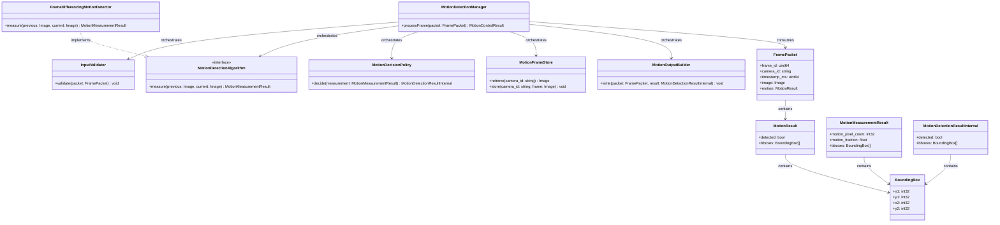
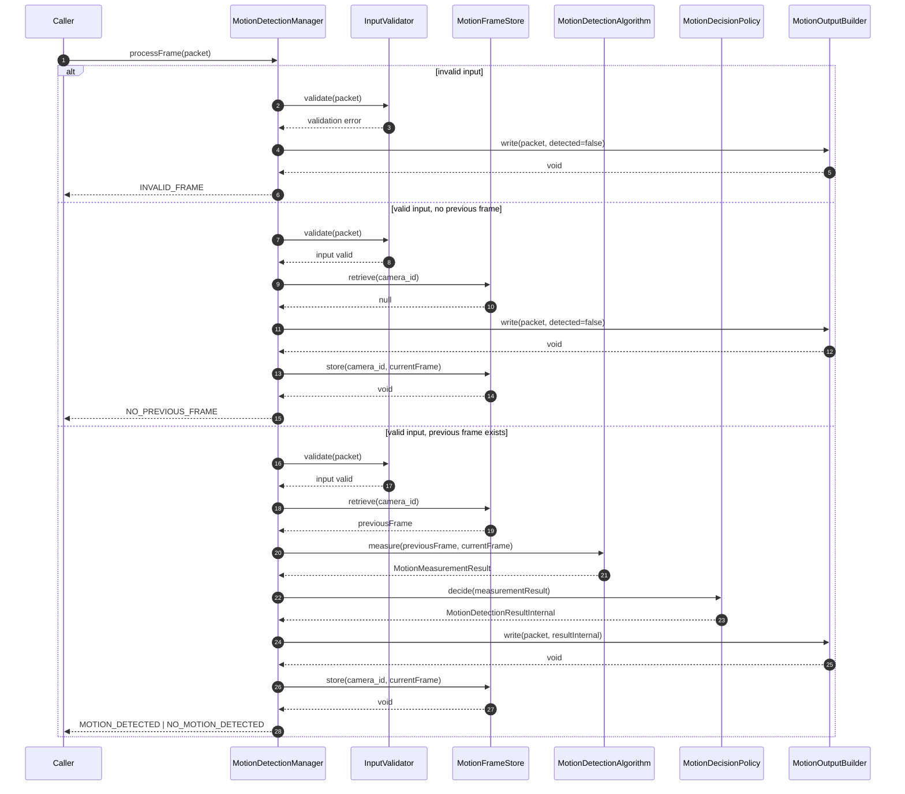
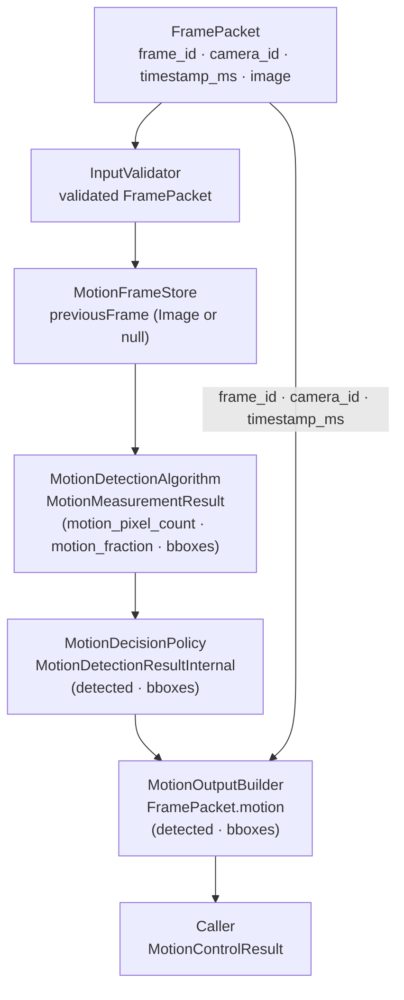

# Motion Detection Module Specification

## 1. Scope

### Purpose

The Motion Detection module is responsible for detecting motion between consecutive frames from the same camera. It receives a `FramePacket`, compares the current frame against the previously stored frame for that `camera_id`, applies threshold-based decision logic, and writes the detection result into `FramePacket.motion`. The module is stateful: it stores exactly one previous frame per `camera_id`.

### In Scope

- Validating the incoming `FramePacket`
- Retrieving and updating exactly one stored frame per `camera_id`
- Computing motion measurements using a configurable motion detection algorithm
- Filtering candidate bounding boxes by minimum area
- Applying threshold-based decision logic to produce a binary `detected` result
- Writing the result into `FramePacket.motion`

### Out of Scope

The Motion Detection Module does NOT:

- Perform image format conversion, color space conversion, layout conversion, dtype conversion, or normalization — handled outside this module
- Detect specific objects, faces, or persons — handled outside this module
- Perform identity matching or recognition
- Maintain shared state across different `camera_id` values
- Expose raw pixel difference values, motion fractions, or pixel counts in any output
- Make downstream processing decisions based on the detection result

---

## 2. Input

### 2.1 Input Responsibility Boundary

The module receives a fully prepared `FramePacket`. The `image` inside that packet already conforms to the module's expected image contract before `processFrame` is called. The following preparations have already been applied outside this module:

- Image format conversion (color space, layout, dtype)
- Value range normalization
- Frame-level preprocessing

The Motion Detection module does not perform any of the above. Only motion measurement computation, decision policy application, and result writing are performed inside this module.

The module processes exactly one `FramePacket` per invocation.

### 2.2 Input Structure

```text
struct Image {
    uint32 width;
    uint32 height;
    string color_format;
    string layout;
    string dtype;
    bytes  pixels;
}

struct FramePacket {
    uint64 frame_id;
    string camera_id;
    uint64 timestamp_ms;
    Image  image;
}
```

`Image` is an opaque type. Its internal pixel representation is not defined by this module. The module depends only on the stated contract in Section 2.3.

### 2.3 Input Contract

`image` must already satisfy the following contract when the module receives the packet:

- `color_format`: `GRAY`
- `layout`: `HWC`
- `dtype`: `uint8`
- `value_range`: `[0, 255]`

The module does not perform any image preprocessing. It depends on the upstream component to guarantee this contract.

### 2.4 Validation Rules

`InputValidator` must verify:

- `frame_id` must exist
- `camera_id` must exist and be non-empty
- `timestamp_ms` must exist
- `image` must exist and be non-null
- `image.color_format` must be `GRAY`
- `image.layout` must be `HWC`
- `image.dtype` must be `uint8`
- `image.width` and `image.height` must be greater than zero

### 2.5 Input Semantics

- `frame_id` — source frame identifier; preserved for traceability; not used in motion computation
- `camera_id` — source camera identifier; used to scope stored frame state in `MotionFrameStore`
- `timestamp_ms` — capture timestamp in milliseconds; preserved for traceability
- `image` — the prepared grayscale frame; used as the current frame in motion measurement

---

## 3. Output

### 3.1 Output Structure

```text
enum MotionControlResult {
    MOTION_DETECTED,
    NO_MOTION_DETECTED,
    NO_PREVIOUS_FRAME,
    INVALID_FRAME,
    PROCESSING_ERROR
}

struct BoundingBox {
    int32 x1;
    int32 y1;
    int32 x2;
    int32 y2;
}

struct MotionResult {
    bool                detected;
    vector<BoundingBox> bboxes;
}
```

The module writes `MotionResult` into `FramePacket.motion` before `processFrame` returns. `FramePacket.motion` is set atomically and is considered immutable after the call returns. `processFrame` returns a `MotionControlResult` for caller control flow.

### 3.2 Output Semantics

- `detected` — always present; `true` when motion was identified, `false` otherwise
- `bboxes` — present only when `detected = true`; each entry is a bounding box in full-frame pixel coordinates; absent when `detected = false`; contains at least one entry when `detected = true`

### 3.3 Output Constraints

The output must NOT expose:

- Raw pixel difference values or diff masks
- `motion_pixel_count` or `motion_fraction` measurements
- Per-pixel threshold results or binary motion masks
- Internal state from `MotionFrameStore`
- Algorithm-specific intermediate data or flags

All motion measurement computations and intermediate results remain strictly internal. The only externally visible result is `FramePacket.motion`.

---

## 4. Public API

```text
MotionControlResult processFrame(packet: FramePacket)
```

The API must remain stable regardless of which motion detection algorithm is configured. `motion_fraction_threshold`, `motion_pixel_count_threshold`, `motion_threshold`, and `min_bbox_area` are never parameters — they are immutable internal configuration state loaded at initialization.

---

## 5. Non-Functional Requirements

- **Stateful** — `MotionFrameStore` retains exactly one previous frame per `camera_id` across invocations; all other processing is per-call with no cross-frame state
- **Single frame per invocation** — the upstream component is responsible for dispatching individual `FramePacket` items; the module must not accept batched input
- **Real-time capable** — suitable for per-frame online processing
- **Deterministic** — same input, same configuration, and same stored previous frame produce the same output
- **Algorithm-agnostic API** — the public output schema is independent of the underlying motion detection algorithm
- **Strict isolation** — no internal data (`MotionMeasurementResult`, motion fractions, pixel counts) escapes the public API

---

## 6. Processing Engine

### 6.1 Engine Abstraction Interface

```text
interface MotionDetectionAlgorithm {
    measure(previous: Image, current: Image) -> MotionMeasurementResult
}
```

### 6.2 Current Default Implementation

```text
class FrameDifferencingMotionDetector implements MotionDetectionAlgorithm
```

`FrameDifferencingMotionDetector` is an algorithmic engine (classical image processing). It computes per-pixel absolute frame differences, produces a binary motion mask, counts changed pixels, computes a motion fraction, and extracts contour bounding boxes filtered by `min_bbox_area`. It returns a `MotionMeasurementResult` containing only measurements — it does not decide whether motion occurred.

### 6.3 Replaceability

The module depends on the `MotionDetectionAlgorithm` interface, not on `FrameDifferencingMotionDetector` directly. Any algorithm that implements `MotionDetectionAlgorithm` may be substituted without changing the `FramePacket` input structure, `MotionResult` output structure, or calling code. Replacing the engine does NOT affect the public API.

---

## 7. Acceptance / Filtering Logic

Detection acceptance is threshold-based and exclusively managed by `MotionDecisionPolicy`.

- `MotionDetectionAlgorithm` returns a `MotionMeasurementResult` containing `motion_pixel_count`, `motion_fraction`, and candidate `bboxes` already filtered by `min_bbox_area`. It does not decide whether motion occurred.
- `MotionDecisionPolicy` applies `motion_fraction_threshold` and `motion_pixel_count_threshold`. If `motion_fraction >= motion_fraction_threshold` OR `motion_pixel_count >= motion_pixel_count_threshold`, the bboxes from `MotionMeasurementResult` are evaluated. If at least one bbox remains, `detected` is set to `true`.
- If no bboxes remain in `MotionMeasurementResult.bboxes` after `min_bbox_area` filtering — regardless of whether pixel-count or fraction thresholds were met — `detected` MUST be set to `false`.
- The thresholds are loaded from configuration at initialization. They are immutable and not adjustable per invocation.
- No scores, fractions, or raw measurements are returned to the caller.
- `MotionDecisionPolicy` is the only place inside the module that sets `detected`.

---

## 8. Internal Pipeline

### 8.1 MotionDetectionManager

`MotionDetectionManager` is the orchestration layer only. It owns no detection or measurement logic.

Its responsibilities are:

- receive the incoming `FramePacket`
- invoke internal components in the correct pipeline order
- pass results between components
- write the final result into `FramePacket.motion` via `MotionOutputBuilder`
- return a `MotionControlResult` to the caller

During initialization, `MotionDetectionManager` is responsible for loading the module configuration and wiring each internal component with its required settings, including injecting `motion_threshold` and `min_bbox_area` into `FrameDifferencingMotionDetector`, and `motion_fraction_threshold` and `motion_pixel_count_threshold` into `MotionDecisionPolicy`.

`MotionDetectionManager` must not compute pixel differences, apply thresholds, perform acceptance logic, or access frame pixel data directly.

### 8.2 InputValidator

`InputValidator` is responsible only for input validation. It validates all fields of the incoming `FramePacket` before any processing begins.

Its responsibilities are:

- verify that `frame_id`, `camera_id`, `timestamp_ms`, and `image` are present
- verify that `camera_id` is non-empty
- verify that `image` conforms to the input contract (`color_format = GRAY`, `layout = HWC`, `dtype = uint8`, positive dimensions)

`InputValidator` must not perform image preprocessing, access `MotionFrameStore`, or make any acceptance decisions.

### 8.3 MotionDetectionAlgorithm

`MotionDetectionAlgorithm` is the internal motion measurement abstraction used by the module.

Its responsibilities are:

- accept a previous frame and a current frame from the orchestrator
- compute motion measurements over the frame pair
- return a `MotionMeasurementResult` containing `motion_pixel_count`, `motion_fraction`, and candidate `bboxes` filtered by `min_bbox_area`

`MotionDetectionAlgorithm` must not decide whether motion occurred, write to `FramePacket.motion`, or access `MotionFrameStore`.

`FrameDifferencingMotionDetector` is the current default implementation of `MotionDetectionAlgorithm`. The module depends on the `MotionDetectionAlgorithm` abstraction, not on `FrameDifferencingMotionDetector` directly, so a different algorithm can be substituted without changing the public API.

### 8.4 MotionDecisionPolicy

`MotionDecisionPolicy` is responsible for deciding whether motion occurred based on the measurements provided.

Its responsibilities are:

- receive a `MotionMeasurementResult`
- apply `motion_fraction_threshold` and `motion_pixel_count_threshold`
- set `detected = true` only when at least one threshold condition is met AND at least one bbox remains in `MotionMeasurementResult.bboxes`
- set `detected = false` when no bboxes remain, regardless of threshold conditions
- return a `MotionDetectionResultInternal` containing `detected` and the accepted `bboxes`

`MotionDecisionPolicy` must not compute raw pixel measurements, access frame data, or access `MotionFrameStore`. It is the only component that sets `detected`.

### 8.5 MotionFrameStore

`MotionFrameStore` is responsible for maintaining the previous frame for each active `camera_id`.

Its responsibilities are:

- store the current frame for a given `camera_id`, replacing any previously stored frame
- retrieve the previously stored frame for a given `camera_id`, returning null if none exists
- scope all state and synchronization per `camera_id` to avoid blocking across unrelated cameras

`MotionFrameStore` must not share state across `camera_id` values, block processing for one camera due to another camera's lock, or make any motion detection decisions.

### 8.6 MotionOutputBuilder

`MotionOutputBuilder` is responsible for writing the final result into `FramePacket.motion`.

Its responsibilities are:

- accept a `MotionDetectionResultInternal`
- write `detected` and, when `detected = true`, `bboxes` into `FramePacket.motion`
- ensure `bboxes` is absent when `detected = false`

`MotionOutputBuilder` must not contain threshold logic, measurement computation, or coordinate transformation. It must not write any internal diagnostic fields to `FramePacket.motion`.

### 8.7 End-to-End Processing Flow

For one invocation of `processFrame`, the internal pipeline follows this order:

**InputValidator → MotionFrameStore → MotionDetectionAlgorithm → MotionDecisionPolicy → MotionOutputBuilder**

1. `MotionDetectionManager` receives `FramePacket`.
2. `MotionDetectionManager` calls `InputValidator.validate(packet)` → void. On failure: calls `MotionOutputBuilder.write(packet, detected=false)` and returns `INVALID_FRAME`; current frame is not stored.
3. `MotionDetectionManager` calls `MotionFrameStore.retrieve(camera_id)` → `Image` or null.
4. If retrieve returns null: calls `MotionOutputBuilder.write(packet, detected=false)`, then `MotionFrameStore.store(camera_id, currentFrame)`, and returns `NO_PREVIOUS_FRAME`.
5. `MotionDetectionManager` calls `MotionDetectionAlgorithm.measure(previousFrame, currentFrame)` → `MotionMeasurementResult`.
6. `MotionDetectionManager` calls `MotionDecisionPolicy.decide(measurementResult)` → `MotionDetectionResultInternal`.
7. `MotionDetectionManager` calls `MotionOutputBuilder.write(packet, resultInternal)` → void.
8. `MotionDetectionManager` calls `MotionFrameStore.store(camera_id, currentFrame)` → void.
9. `MotionDetectionManager` returns `MOTION_DETECTED` or `NO_MOTION_DETECTED` to the caller.

All intermediate data (`MotionMeasurementResult`, `MotionDetectionResultInternal`) remain strictly internal to the module.

---

## 9. Configuration

### 9.1 Configuration Parameters

```text
struct MotionDetectionConfig {
    int32  motion_threshold;               // per-pixel intensity difference to classify a pixel as changed
    float  motion_fraction_threshold;      // fraction of frame pixels that must change to trigger detection
    int32  motion_pixel_count_threshold;   // absolute pixel count that must change to trigger detection
    int32  min_bbox_area;                  // minimum bounding box area in pixels; smaller boxes are discarded
}
```

### 9.2 Loading Behavior

Configuration is loaded exactly once during module initialization. It is immutable after initialization and reused unchanged across all invocations. No configuration parameter is part of `FramePacket` or any per-call runtime input.

Injection at construction time:

- `motion_threshold` and `min_bbox_area` → `FrameDifferencingMotionDetector`
- `motion_fraction_threshold` and `motion_pixel_count_threshold` → `MotionDecisionPolicy`
- `MotionDetectionAlgorithm` is injected as an abstract dependency, with `FrameDifferencingMotionDetector` as the default implementation

---

## 10. Internal Data Structures

- **`MotionMeasurementResult`** — raw motion measurements; contains `motion_pixel_count: int32`, `motion_fraction: float`, and candidate `bboxes: vector<BoundingBox>` filtered by `min_bbox_area`; produced by `MotionDetectionAlgorithm`, consumed by `MotionDecisionPolicy`; lifecycle: per-call
- **`MotionDetectionResultInternal`** — binary detection decision; contains `detected: bool` and accepted `bboxes: vector<BoundingBox>`; produced by `MotionDecisionPolicy`, consumed by `MotionOutputBuilder`; lifecycle: per-call
- **`BoundingBox`** — axis-aligned rectangle in full-frame pixel coordinates; fields: `x1: int32`, `y1: int32`, `x2: int32`, `y2: int32`; used in `MotionMeasurementResult` and `MotionDetectionResultInternal`; lifecycle: per-call

---

## 11. Error Handling

- **Validation failure** (missing fields, contract mismatch, zero dimensions) → write `detected = false` to `FramePacket.motion`, return `INVALID_FRAME`; current frame is not stored
- **Algorithm runtime failure** (`MotionDetectionAlgorithm.measure` error) → catch internally, write `detected = false` to `FramePacket.motion`, return `PROCESSING_ERROR`; current frame is not stored
- **No previous frame** (`MotionFrameStore.retrieve` returns null) → write `detected = false`, store current frame, return `NO_PREVIOUS_FRAME`; normal first-frame operation
- **No bboxes after filtering** (all contours below `min_bbox_area`) → `MotionDecisionPolicy` sets `detected = false`; normal operation

---

## 12. Metrics / Observability

- `processing_time_ms` — total duration of `processFrame` per invocation
- `algorithm_time_ms` — duration of `MotionDetectionAlgorithm.measure` per invocation
- `motion_detected_count` — invocations that returned `MOTION_DETECTED`
- `no_previous_frame_count` — invocations that returned `NO_PREVIOUS_FRAME`
- `invalid_frame_count` — invocations rejected by `InputValidator`
- `processing_error_count` — invocations terminated by an algorithm runtime failure

Metrics are internal and operational. Not part of the public API.

---

## 13. Lifecycle

### 13.1 Initialization

- Load `MotionDetectionConfig` from the configuration source
- Construct `FrameDifferencingMotionDetector` with `motion_threshold` and `min_bbox_area`
- Construct `MotionDecisionPolicy` with `motion_fraction_threshold` and `motion_pixel_count_threshold`
- Construct `MotionFrameStore` (empty; no frames stored at startup)
- Construct `MotionOutputBuilder`
- Wire all components into `MotionDetectionManager`

### 13.2 Per Invocation

**InputValidator → MotionFrameStore → MotionDetectionAlgorithm → MotionDecisionPolicy → MotionOutputBuilder**

The module is stateful. `MotionFrameStore` retains one frame per `camera_id` across invocations. All other intermediate data is per-call.

### 13.3 Shutdown

- `MotionFrameStore` releases all stored frames
- No pending writes; each `processFrame` call is synchronous and complete before return

---

## 14. Class Diagram (Mermaid)



---

## 15. Sequence Diagram (Mermaid)



---

## 16. Data Flow Diagram (Mermaid)



---

## 17. Extensibility

**What can change without breaking the public API:**

- Motion detection algorithm (`FrameDifferencingMotionDetector` → any class implementing `MotionDetectionAlgorithm`)
- Internal algorithm parameters and processing approach — internal to the algorithm implementation
- Detection thresholds (`motion_fraction_threshold`, `motion_pixel_count_threshold`, `motion_threshold`, `min_bbox_area`) — configuration-only changes

**What must remain stable:**

- `processFrame(packet: FramePacket) -> MotionControlResult` signature
- Output schema written to `FramePacket.motion`: `{ detected, bboxes }`
- `detected = false` semantics for invalid input, no previous frame, and no-motion scenarios

---

## 18. Module Compliance Checklist

- [ ] One frame per invocation — the module must not accept or process batched `FramePacket` input
- [ ] Thresholds applied internally — `motion_fraction_threshold`, `motion_pixel_count_threshold`, `motion_threshold`, and `min_bbox_area` must never appear in `FramePacket` or `FramePacket.motion`
- [ ] No `MotionMeasurementResult` exposure — `motion_pixel_count`, `motion_fraction`, and raw intermediate `bboxes` must never appear in `FramePacket.motion`
- [ ] No algorithm-specific data exposure — diff masks, binary masks, and internal algorithm artifacts must never appear in `FramePacket.motion`
- [ ] Engine abstraction respected — `MotionDetectionManager` depends on the `MotionDetectionAlgorithm` interface, not on `FrameDifferencingMotionDetector` directly
- [ ] `detected = false` when no bboxes remain — `MotionDecisionPolicy` must set `detected = false` when all bboxes are filtered by `min_bbox_area`, regardless of threshold conditions
- [ ] Preprocessing boundary enforced — module performs no image format conversion, color conversion, layout conversion, dtype conversion, or normalization
- [ ] State scoped per `camera_id` — `MotionFrameStore` must not share state or locks across different `camera_id` values
- [ ] `detected = false` returned for all non-detection scenarios — including invalid input, no previous frame, threshold miss, empty bbox list, and runtime failure