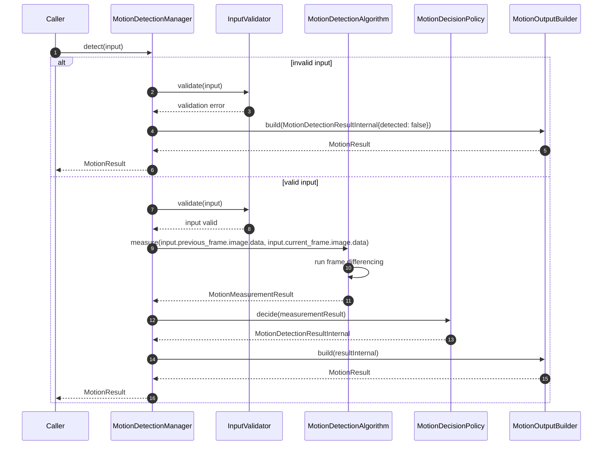
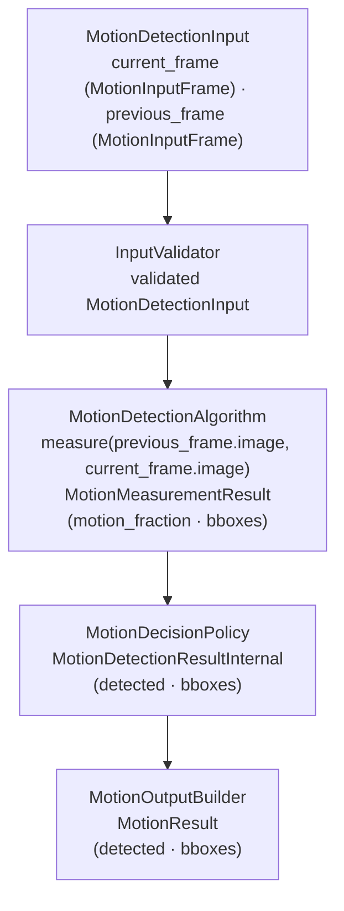

# Motion Detection Module Specification

## Shared Contract Types

The following types used by this module are defined in [shared_contracts.md](shared_contracts.md) and must not be duplicated here:

- `BoundingBox` — the single shared bounding-box type (§1); coordinate space must be stated at the usage site
- `Image` — the canonical shared public image struct; carries `data`, `width`, `height`, `color_format`, `layout`, `dtype`, and `value_range`; pixel format is described by `OutputImageType` (§4)

---

## 1. Scope

### Purpose

The Motion Detection module is responsible for detecting motion between two frames provided per invocation. It receives a `MotionDetectionInput` containing `current_frame` and `previous_frame`, compares them, applies bbox filtering/merging and threshold-based decision logic, and returns a `MotionResult`. The module does not store frame pixels, but may keep short per-camera motion bbox history for temporal persistence gating.

### In Scope

- Validating the incoming `MotionDetectionInput`
- Computing motion measurements using a configurable motion detection algorithm
- Filtering candidate bounding boxes by minimum area
- Merging overlapping and nearby bounding boxes when enabled
- Applying temporal persistence gating using per-camera bbox history when enabled
- Applying threshold-based decision logic to produce a binary `detected` result
- Returning `MotionResult` to the caller

### Out of Scope

The Motion Detection Module does NOT:

- Perform image format conversion, color space conversion, layout conversion, dtype conversion, or normalization
- Detect specific objects, faces, or persons
- Perform identity matching or recognition
- Store frame pixels internally
- Expose raw pixel difference values, motion fractions, or pixel counts in any output

---

## 2. Input

### 2.1 Input Responsibility Boundary

The module expects the input `MotionDetectionInput` to already conform to the required image contract before `detect` is called. Image format conversion, layout conversion, dtype conversion, and normalization are applied to both `current_frame.image` and `previous_frame.image` outside this module. The Motion Detection module does not perform any preprocessing. The module enforces the image contract at the boundary via `InputValidator`.

The module processes exactly one `MotionDetectionInput` per invocation.

### 2.2 Input Structure

`Image` is defined in [shared_contracts.md §6](shared_contracts.md) — the canonical shared public image struct carrying explicit metadata fields.

```text
struct MotionInputFrame {
    string frame_id;
    string camera_id;
    uint64 timestamp_ms;
    Image  image;   // See shared_contracts.md §6 — shared Image struct; metadata fields must be compatible with GRAYSCALE_UINT8_HWC
}

struct MotionDetectionInput {
    MotionInputFrame current_frame;
    MotionInputFrame previous_frame;
}
```

> **Note on naming.** This module uses `MotionInputFrame` instead of `FramePacket` to avoid ambiguity with the `FramePacket` type defined by the Frame Transformation Layer (which carries raw `image_bytes` as bytes, not a shared `Image` struct). `MotionInputFrame` is a motion-detection-specific input container carrying a fully prepared shared `Image`.

- `frame_id` identifies the source frame for traceability. Must be non-empty and non-null; Motion Detection validates its presence.
- `camera_id` identifies the source camera; preserved unchanged for traceability.
- `timestamp_ms` is the capture timestamp in milliseconds.
- `image` is the prepared grayscale image for the frame (`Image` — see [shared_contracts.md §6](shared_contracts.md)).
- `current_frame` is the `MotionInputFrame` representing the latest frame to be tested for motion.
- `previous_frame` is the `MotionInputFrame` representing the reference frame; provided as part of the input.

### 2.3 Input Contract

`current_frame.image` and `previous_frame.image` must already satisfy the following contract when the module receives the input:

- `current_frame.image.color_format` must be `GRAY`, `current_frame.image.layout` must be `HWC`, `current_frame.image.dtype` must be `uint8`, and `current_frame.image.value_range` must be `[0,255]` — consistent with `GRAYSCALE_UINT8_HWC` (see [shared_contracts.md §4](shared_contracts.md)).
- `previous_frame.image` must satisfy the same `GRAYSCALE_UINT8_HWC` metadata contract.
- `current_frame.image.width` must equal `previous_frame.image.width` and `current_frame.image.height` must equal `previous_frame.image.height` (identical spatial dimensions).
- `current_frame.image.data.shape` must be consistent with `current_frame.image.width`, `current_frame.image.height`, `current_frame.image.layout`, and `current_frame.image.color_format`.
- `current_frame.camera_id` and `previous_frame.camera_id` must be identical.
- `previous_frame` must precede or be simultaneous with `current_frame`: `previous_frame.timestamp_ms ≤ current_frame.timestamp_ms`.

The module does not perform any image preprocessing. `InputValidator` enforces this contract and rejects any input that does not satisfy it.

### 2.4 Validation Rules

`InputValidator` must verify:

- `current_frame` must exist and be non-null
- `previous_frame` must exist and be non-null
- `current_frame.frame_id` must exist
- `current_frame.camera_id` must exist and be non-empty
- `current_frame.timestamp_ms` must exist
- `current_frame.image` must exist and be non-null
- `current_frame.image.data` must be non-null and contain valid pixel data
- `current_frame.image.color_format` must be `GRAY`, `current_frame.image.layout` must be `HWC`, `current_frame.image.dtype` must be `uint8`, and `current_frame.image.value_range` must be `[0,255]`
- `current_frame.image.width` must be > 0 and `current_frame.image.height` must be > 0
- `current_frame.image.data.shape` must be consistent with `current_frame.image.width`, `current_frame.image.height`, `current_frame.image.layout`, and `current_frame.image.color_format`
- `previous_frame.frame_id` must exist
- `previous_frame.camera_id` must exist and be non-empty
- `previous_frame.timestamp_ms` must exist
- `previous_frame.image` must exist and be non-null
- `previous_frame.image.data` must be non-null and contain valid pixel data
- `previous_frame.image.color_format` must be `GRAY`, `previous_frame.image.layout` must be `HWC`, `previous_frame.image.dtype` must be `uint8`, and `previous_frame.image.value_range` must be `[0,255]`
- `previous_frame.image.width` must equal `current_frame.image.width` and `previous_frame.image.height` must equal `current_frame.image.height`
- `previous_frame.image.data.shape` must be consistent with `previous_frame.image.width`, `previous_frame.image.height`, `previous_frame.image.layout`, and `previous_frame.image.color_format`
- `current_frame.camera_id` must equal `previous_frame.camera_id`
- `previous_frame.timestamp_ms` must be less than or equal to `current_frame.timestamp_ms` (temporal ordering consistency)

---

## 3. Output

### 3.1 Output Structure

`BoundingBox` is defined in [shared_contracts.md §1](shared_contracts.md). All `BoundingBox` coordinates in this output are ROI-local relative to `current_frame.image`.

```text
struct MotionResult {
    bool                detected;
    vector<BoundingBox> bboxes;   // ROI-local, relative to current_frame.image
}
```

`MotionResult` is the return value of the module. All coordinates are expressed in the coordinate system of `current_frame.image` — the image actually used for motion measurement. The module does not map coordinates to any original source frame. `MotionResult` is the ONLY external output of the module. All internal processing states are not exposed.

### 3.2 Output Semantics

- `detected` — always present; `true` when motion was identified, `false` otherwise
- `bboxes` — the module's authoritative spatial output for detected motion regions; each bounding box fully defines the spatial extent of a contiguous rectangular motion region; bounding boxes are axis-aligned and non-rotated; bounding boxes are the ONLY spatial output of the module; no masks, contours, or alternative spatial representations are exposed; all coordinates are expressed relative to `current_frame.image` (the image actually used for motion measurement), with the origin at the top-left corner of that image; present only when `detected = true`, empty when `detected = false`; at least one entry is always present when `detected = true`

### 3.3 Output Constraints

The output must NOT expose:

- Raw pixel difference values or diff masks
- `motion_fraction` measurements or any other internal measurement
- Per-pixel threshold results or binary motion masks
- Algorithm-specific intermediate data or flags
- Spatial artifacts other than `bboxes` — no contours, region maps, or other spatial representations are exposed
- Bounding boxes must have strictly positive width and height

`bboxes` are the module's only spatial output. No other spatial artifacts, masks, contours, or region maps cross the module boundary.

All motion measurement computations and intermediate results remain strictly internal. The only externally visible result is `MotionResult`.

---

## 4. Public API

```text
MotionResult detect(input: MotionDetectionInput)
PipelineStageInputContract get_input_contract()
```

`detect()` is the single RPM-facing public stage API. It accepts one `MotionDetectionInput` per invocation and returns a `MotionResult`. It does not return a status enum. The result of the module is fully expressed through `MotionResult`.

`get_input_contract()` is called by RPM at initialization to determine the image format and geometry this stage requires. It returns a `PipelineStageInputContract` (see [shared_contracts.md §5](shared_contracts.md)) with:
- `output_image_type = OutputImageType.GRAYSCALE_UINT8_HWC`
- `geometry_spec = GeometrySpec(width=0, height=0, resize_policy=ResizePolicy.NONE)` — the FTL returns the full frame at its natural size

The API must remain stable regardless of which motion detection algorithm is configured. `motion_fraction_threshold`, `motion_threshold`, and `min_bbox_area` are never parameters — they are immutable internal configuration state loaded at initialization.

---

## 5. Non-Functional Requirements

- **No frame-pixel storage** — frame pixel buffers are provided by input and are not retained after return
- **Optional per-camera bbox history** — when temporal persistence is enabled, only lightweight bbox history is retained per `camera_id`
- **Single input per invocation** — the module processes exactly one `MotionDetectionInput` per invocation and must not accept batched input
- **Real-time capable** — suitable for per-frame online processing
- **Deterministic** — same `MotionDetectionInput` and same configuration produce the same output
- **Algorithm-agnostic API** — the public output schema is independent of the underlying motion detection algorithm
- **Strict isolation** — no internal data (`MotionMeasurementResult`, motion fractions, pixel counts) escapes the public API

---

## 6. Processing Engine

### 6.1 Engine Abstraction Interface

```text
interface MotionDetectionAlgorithm {
    measure(previous: Image, current: Image) -> MotionMeasurementResult
}
```

### 6.2 Current Default Implementation

```text
class FrameDifferencingMotionDetector implements MotionDetectionAlgorithm
```

`FrameDifferencingMotionDetector` is an algorithmic engine (classical image processing). Its internal pipeline performs the following steps in order:

1. Compute per-pixel absolute difference between `previous` and `current` frames.
2. Apply `motion_threshold` to the difference to produce a binary motion mask.
3. Run contour or connected-component analysis on the binary mask to extract candidate motion regions.
4. Convert each candidate region to a `BoundingBox` with fields `(x, y, width, height)` relative to `current_frame.image` (the image actually used for motion measurement), where `(x, y)` is the top-left corner.
5. Discard any `BoundingBox` whose area (`width * height`) is less than `min_bbox_area`.
6. Optionally merge overlapping and nearby boxes (IoU and distance thresholds).
7. Optionally apply temporal persistence gating so one-frame transients are suppressed.
8. Return all surviving boxes together with `motion_fraction` in a `MotionMeasurementResult`.

It does not decide whether motion occurred.

### 6.3 Replaceability

The module depends on the `MotionDetectionAlgorithm` interface, not on `FrameDifferencingMotionDetector` directly. Any algorithm that implements `MotionDetectionAlgorithm` may be substituted without changing the `MotionDetectionInput` input structure, `MotionResult` output structure, or calling code. Replacing the engine does NOT affect the public API. The module depends on the MotionDetectionAlgorithm abstraction and is not coupled to any specific implementation.

---

## 7. Acceptance / Filtering Logic

Detection acceptance is threshold-based and exclusively managed by `MotionDecisionPolicy`.

- `MotionDetectionAlgorithm` returns a `MotionMeasurementResult` containing `motion_fraction` and candidate `bboxes` already filtered by `min_bbox_area`. It does not decide whether motion occurred.
- `MotionDecisionPolicy` applies `motion_fraction_threshold`. If `motion_fraction >= motion_fraction_threshold` AND at least one bbox remains in `MotionMeasurementResult.bboxes`, `detected` is set to `true`. Otherwise, `detected` is set to `false`.
- If no bboxes remain in `MotionMeasurementResult.bboxes` after `min_bbox_area` filtering — regardless of whether the fraction threshold was met — `detected` MUST be set to `false`.
- The thresholds are loaded from configuration at initialization. They are immutable and not adjustable per invocation.
- The decision rule is deterministic and evaluated independently for each invocation.
- No scores, fractions, or raw measurements are returned.
- The decision is strictly binary and does not produce confidence scores or probabilistic outputs.
- `MotionDecisionPolicy` is the only place inside the module that sets `detected`.

---

## 8. Internal Pipeline

### 8.1 MotionDetectionManager

`MotionDetectionManager` is the orchestration layer only. It owns no detection or measurement logic.

Its responsibilities are:

- receive the incoming `MotionDetectionInput`
- invoke internal components in the correct pipeline order
- pass results between components
- obtain the final result from `MotionOutputBuilder`
- return `MotionResult` to the caller

During initialization, `MotionDetectionManager` is responsible for loading the module configuration and wiring each internal component with its required settings, including injecting `motion_threshold` and `min_bbox_area` into `FrameDifferencingMotionDetector`, and `motion_fraction_threshold` into `MotionDecisionPolicy`.

`MotionDetectionManager` must not compute pixel differences, apply thresholds, perform acceptance logic, or access frame pixel data directly.

### 8.2 InputValidator

`InputValidator` is responsible only for input validation. It validates all fields of the incoming `MotionDetectionInput` before any processing begins.

Its responsibilities are:

- verify that `current_frame` and `previous_frame` are present and non-null
- verify that `current_frame.frame_id`, `current_frame.camera_id`, and `current_frame.timestamp_ms` are present
- verify that `current_frame.camera_id` is non-empty
- verify that `current_frame.image` is a non-null `Image` whose metadata fields (`color_format`, `layout`, `dtype`, `value_range`) are compatible with `GRAYSCALE_UINT8_HWC`, with positive `width` and `height`, and consistent `data.shape`
- verify that `previous_frame.frame_id`, `previous_frame.camera_id`, and `previous_frame.timestamp_ms` are present
- verify that `previous_frame.camera_id` is non-empty
- verify that `previous_frame.image` is a non-null `Image` whose metadata fields (`color_format`, `layout`, `dtype`, `value_range`) are compatible with `GRAYSCALE_UINT8_HWC`, with positive `width` and `height`, and consistent `data.shape`
- verify that `previous_frame.image.width` equals `current_frame.image.width` and `previous_frame.image.height` equals `current_frame.image.height`
- verify that `current_frame.camera_id` equals `previous_frame.camera_id`
- verify that `previous_frame.timestamp_ms` is less than or equal to `current_frame.timestamp_ms`

`InputValidator` must not perform image preprocessing or make any acceptance decisions. `InputValidator` must not modify the input `MotionDetectionInput`.

### 8.3 MotionDetectionAlgorithm

`MotionDetectionAlgorithm` is the internal motion measurement abstraction used by the module.

Its responsibilities are:

- accept `previous_frame.image` and `current_frame.image` from the input, as passed by the orchestrator
- compute per-pixel absolute frame differences and apply `motion_threshold` to produce a binary motion mask
- extract candidate motion regions from the mask via contour or connected-component analysis
- convert each candidate region to a `BoundingBox` `(x, y, width, height)` relative to `current_frame.image` (the image actually used for motion measurement), where `(x, y)` is the top-left corner
- discard any box whose area (`width * height`) is less than `min_bbox_area`
- return a `MotionMeasurementResult` containing `motion_fraction` and the surviving `bboxes`

`MotionDetectionAlgorithm` must not decide whether motion occurred or write to any output structure directly.

`FrameDifferencingMotionDetector` is the current default implementation of `MotionDetectionAlgorithm`. The module depends on the `MotionDetectionAlgorithm` abstraction, not on `FrameDifferencingMotionDetector` directly, so a different algorithm can be substituted without changing the public API.

### 8.4 MotionDecisionPolicy

`MotionDecisionPolicy` is responsible for deciding whether motion occurred based on the measurements provided.

Its responsibilities are:

- receive a `MotionMeasurementResult`
- apply `motion_fraction_threshold`
- set `detected = true` only when `motion_fraction >= motion_fraction_threshold` AND at least one bbox remains in `MotionMeasurementResult.bboxes`
- set `detected = false` when the fraction threshold is not met or no bboxes remain
- return a `MotionDetectionResultInternal` containing `detected` and the accepted `bboxes`

`MotionDecisionPolicy` must not compute raw pixel measurements or access frame data directly. It is the only component that sets `detected`. The decision is strictly binary and does not produce confidence scores or probabilistic outputs.

### 8.5 MotionOutputBuilder

`MotionOutputBuilder` is responsible for building the final `MotionResult` from the internal detection result.

Its responsibilities are:

- accept a `MotionDetectionResultInternal`
- build and return a `MotionResult` containing `detected` and, when `detected = true`, `bboxes`
- ensure `bboxes` is empty when `detected = false`

`MotionOutputBuilder` must not contain threshold logic, measurement computation, or coordinate transformation. It must not write into any input structure. It must not expose any internal diagnostic fields in the returned `MotionResult`.

### 8.6 End-to-End Processing Flow

For one invocation of `detect`, the internal pipeline follows this order:

**InputValidator → MotionDetectionAlgorithm → BBoxMerge (optional) → TemporalPersistence (optional) → MotionDecisionPolicy → MotionOutputBuilder**

1. `MotionDetectionManager` receives `MotionDetectionInput` via `detect(input)`.
2. `MotionDetectionManager` calls `InputValidator.validate(input)` → void. On failure: constructs `MotionDetectionResultInternal{detected: false}`, calls `MotionOutputBuilder.build(resultInternal)` → `MotionResult`, and terminates processing.
3. `MotionDetectionManager` calls `MotionDetectionAlgorithm.measure(input.previous_frame.image.data, input.current_frame.image.data)` → `MotionMeasurementResult`. (The raw numpy arrays are extracted from the `Image` struct internally; the algorithm layer operates on `np.ndarray`.)
4. `MotionDetectionManager` optionally merges candidate bboxes using configured IoU and distance thresholds.
5. `MotionDetectionManager` optionally applies temporal persistence per `camera_id` before final decision.
6. `MotionDetectionManager` calls `MotionDecisionPolicy.decide(measurementResult)` → `MotionDetectionResultInternal`.
7. `MotionDetectionManager` calls `MotionOutputBuilder.build(resultInternal)` → `MotionResult`.
8. `MotionDetectionManager` returns `MotionResult`.

All intermediate data (`MotionMeasurementResult`, `MotionDetectionResultInternal`, raw bboxes, motion fractions, pixel counts) remain strictly internal to the module.

---

## 9. Configuration

### 9.1 Configuration Parameters

```text
struct MotionDetectionConfig {
    int32  motion_threshold;               // per-pixel intensity difference to classify a pixel as changed
    float  motion_fraction_threshold;      // fraction of frame pixels that must change to trigger detection
    int32  min_bbox_area;                  // minimum bounding box area in pixels; smaller boxes are discarded
    bool   enable_bbox_merging;
    float  bbox_merge_iou_threshold;
    float  bbox_merge_distance_threshold;
    bool   enable_temporal_persistence;
    int32  min_persistence_frames;
    float  persistence_iou_threshold;
    int32  max_history_frames;
}
```

### 9.2 Loading Behavior

Configuration is loaded exactly once during module initialization. It is immutable after initialization and reused unchanged across all invocations. No configuration parameter is part of `MotionInputFrame` or any per-call runtime input.

Injection at construction time:

- `motion_threshold` and `min_bbox_area` → `FrameDifferencingMotionDetector`
- `motion_fraction_threshold` → `MotionDecisionPolicy`
- bbox merging and temporal persistence fields → `MotionDetectionManager` post-measurement pipeline
- `MotionDetectionAlgorithm` is injected as an abstract dependency, with `FrameDifferencingMotionDetector` as the default implementation

---

## 10. Internal Data Structures

- **`MotionMeasurementResult`** — raw motion measurements; contains `motion_fraction: float` and candidate `bboxes: vector<BoundingBox>` filtered by `min_bbox_area`; produced by `MotionDetectionAlgorithm`, consumed by `MotionDecisionPolicy`; strictly internal to the module; must never cross the module boundary; must never be exposed in `MotionResult`; lifecycle: per-call
- **`MotionDetectionResultInternal`** — binary detection decision; contains `detected: bool` and accepted `bboxes: vector<BoundingBox>`; produced by `MotionDecisionPolicy`, consumed by `MotionOutputBuilder`; lifecycle: per-call
- **`BoundingBox`** — defined in [shared_contracts.md §1](shared_contracts.md); all coordinates in this module are expressed in the coordinate system of `current_frame.image` (the image actually used for motion measurement); the module does not map coordinates to any original source frame; used in `MotionMeasurementResult` and `MotionDetectionResultInternal`; lifecycle: per-call

---

## 11. Error Handling

- **Validation failure** (missing or null `current_frame` or `previous_frame`, missing fields, image contract violations, zero dimensions, dimension mismatch, `camera_id` mismatch, timestamp ordering violation) → return `MotionResult` with `detected = false`; error tracked via metrics/logs
- **Algorithm runtime failure** (`MotionDetectionAlgorithm.measure` error) → catch internally, return `MotionResult` with `detected = false`; error tracked via metrics/logs
- **No bboxes after filtering** (all contours below `min_bbox_area`) → `MotionDecisionPolicy` sets `detected = false`; normal operation

All error and non-detection states result in `MotionResult` with `detected = false` being returned. In all error scenarios, no partial or intermediate results are exposed; returning `MotionResult` with `detected = false` is the only output. Error conditions are tracked via metrics and logs, not via API return values.

---

## 12. Metrics / Observability

- `processing_time_ms` — total duration of `process` per invocation
- `algorithm_time_ms` — duration of `MotionDetectionAlgorithm.measure` per invocation
- `motion_detected_count` — invocations where motion was detected
- `invalid_frame_count` — invocations rejected by `InputValidator`
- `previous_frame_validation_failure_count` — invocations where `previous_frame` failed validation (null, contract violation, dimension mismatch, `camera_id` mismatch, or timestamp ordering violation)
- `processing_error_count` — invocations terminated by an algorithm runtime failure

Metrics are internal and operational. Not part of the public API. These counters replace the need for exposing control-flow enums via the public API.

---

## 13. Lifecycle

### 13.1 Initialization

- Load `MotionDetectionConfig` from the configuration source
- Construct `FrameDifferencingMotionDetector` with `motion_threshold` and `min_bbox_area`
- Construct `MotionDecisionPolicy` with `motion_fraction_threshold`
- Construct `MotionOutputBuilder`
- Wire all components into `MotionDetectionManager`

### 13.2 Per Invocation

**InputValidator → MotionDetectionAlgorithm → MotionDecisionPolicy → MotionOutputBuilder**

Stateless — the module does not store or reuse any frame data across invocations. No frame state carries between calls. One `MotionDetectionInput` per call.

### 13.3 Shutdown

- No pending writes; each `process` call is synchronous and complete before return

---

## 14. Class Diagram (Mermaid)

```mermaid
classDiagram
    class MotionDetectionInterface {
        <<Protocol>>
        +detect(input: MotionDetectionInput) MotionResult
        +get_input_contract() PipelineStageInputContract
    }

    class MotionDetectionManager {
        +detect(input: MotionDetectionInput) MotionResult
        +get_input_contract() PipelineStageInputContract
    }

    class InputValidator {
        +validate(input: MotionDetectionInput) void
    }

    class MotionDetectionAlgorithm {
        <<interface>>
        +measure(previous: np.ndarray, current: np.ndarray) MotionMeasurementResult
    }

    class FrameDifferencingMotionDetector {
        +measure(previous: np.ndarray, current: np.ndarray) MotionMeasurementResult
    }

    class MotionDecisionPolicy {
        +decide(measurement: MotionMeasurementResult) MotionDetectionResultInternal
    }

    class MotionOutputBuilder {
        +build(result: MotionDetectionResultInternal) MotionResult
    }

    class MotionInputFrame {
        +frame_id: string
        +camera_id: string
        +timestamp_ms: uint64
        +image: Image
    }

    class MotionDetectionInput {
        +current_frame: MotionInputFrame
        +previous_frame: MotionInputFrame
    }

    class MotionResult {
        +detected: bool
        +bboxes: BoundingBox[]
    }

    class MotionMeasurementResult {
        +motion_fraction: float
        +bboxes: BoundingBox[]
    }

    class MotionDetectionResultInternal {
        +detected: bool
        +bboxes: BoundingBox[]
    }

    class BoundingBox {
        +x: int32
        +y: int32
        +width: int32
        +height: int32
    }

    MotionDetectionManager ..|> MotionDetectionInterface : implements
    MotionDetectionManager --> InputValidator : orchestrates
    MotionDetectionManager --> MotionDetectionAlgorithm : orchestrates
    MotionDetectionManager --> MotionDecisionPolicy : orchestrates
    MotionDetectionManager --> MotionOutputBuilder : orchestrates
    FrameDifferencingMotionDetector ..|> MotionDetectionAlgorithm : implements
    MotionDetectionManager --> MotionDetectionInput : consumes
    MotionDetectionInput --> MotionInputFrame : contains
    MotionResult --> BoundingBox : contains
    MotionMeasurementResult --> BoundingBox : contains
    MotionDetectionResultInternal --> BoundingBox : contains
```



---

## 15. Sequence Diagram (Mermaid)



---

## 16. Data Flow Diagram (Mermaid)



---

## 17. Extensibility

**What can change without breaking the public API:**

- Motion detection algorithm (`FrameDifferencingMotionDetector` → any class implementing `MotionDetectionAlgorithm`)
- Internal algorithm parameters and processing approach — internal to the algorithm implementation
- Detection thresholds (`motion_fraction_threshold`, `motion_threshold`, `min_bbox_area`) — configuration-only changes
- MotionDecisionPolicy can be replaced independently of the motion detection algorithm.

**What must remain stable:**

- `detect(input: MotionDetectionInput) -> MotionResult` signature — the single RPM-facing public stage API
- `get_input_contract() -> PipelineStageInputContract` signature
- `detected = false` semantics for invalid input, missing or invalid `previous_frame`, and no-motion scenarios
- The module produces spatial motion regions valid for direct geometric use without further normalization; the `bboxes` output is fully defined, axis-aligned, and coordinate-stable relative to `current_frame.image` (the image actually used for motion measurement); all coordinates remain within the input image space and are never projected outside it

---

## 18. Module Compliance Checklist

- [ ] One invocation per input — the module must not accept or process batched `MotionDetectionInput`
- [ ] Thresholds applied internally — `motion_fraction_threshold`, `motion_threshold`, and `min_bbox_area` must never appear in `MotionDetectionInput` or `MotionResult`
- [ ] No `MotionMeasurementResult` exposure — `motion_fraction` and raw intermediate `bboxes` must never appear in `MotionResult`
- [ ] No algorithm-specific data exposure — diff masks, binary masks, and internal algorithm artifacts must never appear in `MotionResult`
- [ ] Engine abstraction respected — `MotionDetectionManager` depends on the `MotionDetectionAlgorithm` interface, not on `FrameDifferencingMotionDetector` directly
- [ ] `detected = false` when no bboxes remain — `MotionDecisionPolicy` must set `detected = false` when all bboxes are filtered by `min_bbox_area`, regardless of threshold conditions
- [ ] Preprocessing boundary enforced — module performs no image format conversion, color conversion, layout conversion, dtype conversion, or normalization
- [ ] Stateless — the module must not retain any frame data between invocations; no internal frame storage
- [ ] No `MotionInputFrame` mutation — the module must not write to any field of the input structures
- [ ] `detected = false` returned for all non-detection scenarios — including invalid input, missing or invalid `previous_frame`, threshold miss, empty bbox list, and runtime failure
- [ ] Module does not expose control-flow enums via public API
- [ ] All outcomes are expressed via `MotionResult` return value only
- [ ] MotionDecisionPolicy is the only component that sets detected
- [ ] `detect()` is the only RPM-facing public stage API; `get_input_contract()` is the only initialization-time contract method