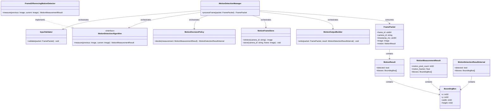
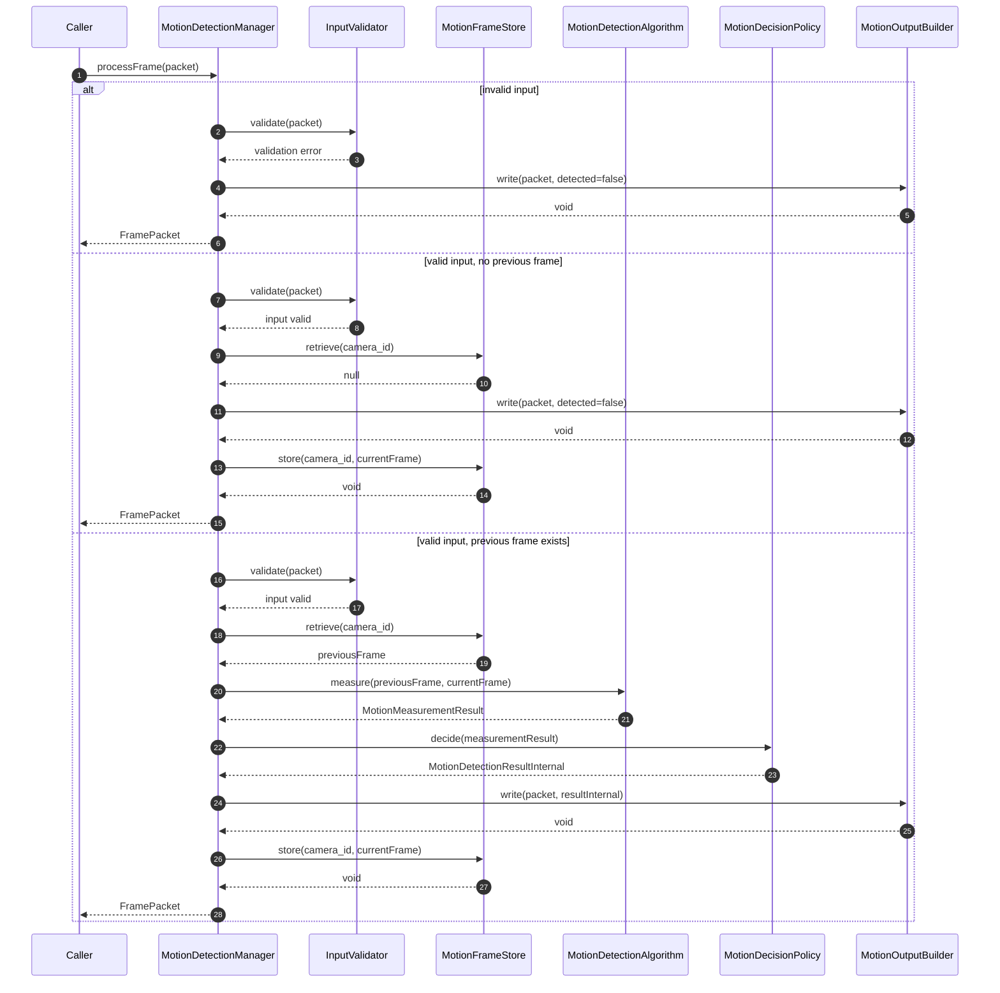
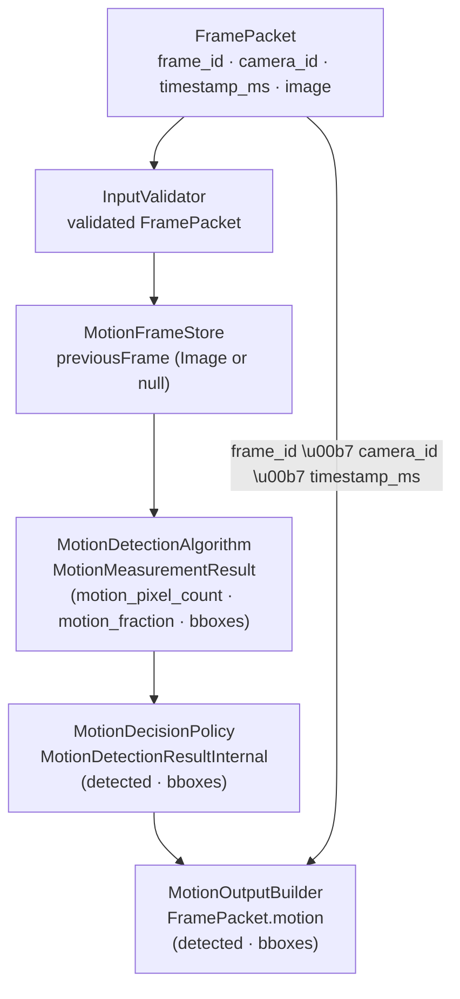

# Motion Detection Module Specification

## 1. Scope

### Purpose

The Motion Detection module is responsible for detecting motion between consecutive frames from the same camera. It receives a `FramePacket`, compares the current frame against the previously stored frame for that `camera_id`, applies threshold-based decision logic, and writes the detection result into `FramePacket.motion`. The module is stateful: it stores exactly one previous frame per `camera_id`.

### In Scope

- Validating the incoming `FramePacket`
- Retrieving and updating exactly one stored frame per `camera_id`
- Computing motion measurements using a configurable motion detection algorithm
- Filtering candidate bounding boxes by minimum area
- Applying threshold-based decision logic to produce a binary `detected` result
- Writing the result into `FramePacket.motion`

### Out of Scope

The Motion Detection Module does NOT:

- Perform image format conversion, color space conversion, layout conversion, dtype conversion, or normalization
- Detect specific objects, faces, or persons
- Perform identity matching or recognition
- Maintain shared state across different `camera_id` values
- Expose raw pixel difference values, motion fractions, or pixel counts in any output

---

## 2. Input

### 2.1 Input Responsibility Boundary

The module expects the input `FramePacket` to already conform to the required image contract before `processFrame` is called. Image format conversion, layout conversion, dtype conversion, and normalization are performed upstream. The Motion Detection module does not perform any preprocessing. The module enforces the image contract at the boundary via `InputValidator`.

The module processes exactly one `FramePacket` per invocation.

### 2.2 Input Structure

```text
struct FramePacket {
    uint64 frame_id;
    string camera_id;
    uint64 timestamp_ms;
    Image  image;
}
```

- `frame_id` identifies the source frame for traceability.
- `camera_id` identifies the source camera and is used to scope stored previous-frame state in `MotionFrameStore`.
- `timestamp_ms` is the capture timestamp in milliseconds.
- `image` is the prepared grayscale frame used as the current image for motion measurement.

### 2.3 Input Contract

`image` must already satisfy the following contract when the module receives the packet:

- `color_format`: `GRAY`
- `layout`: `HWC`
- `dtype`: `uint8`
- `value_range`: `[0, 255]`

The module does not perform any image preprocessing. `InputValidator` enforces this contract and rejects any packet that does not satisfy it.

### 2.4 Validation Rules

`InputValidator` must verify:

- `frame_id` must exist
- `camera_id` must exist and be non-empty
- `timestamp_ms` must exist
- `image` must exist and be non-null
- `image.color_format` must be `GRAY`
- `image.layout` must be `HWC`
- `image.dtype` must be `uint8`
- `image.width` and `image.height` must be greater than zero

---

## 3. Output

### 3.1 Output Structure

```text
struct BoundingBox {
    int32 x;       // x coordinate of the top-left corner, in full-frame pixel space
    int32 y;       // y coordinate of the top-left corner, in full-frame pixel space
    int32 width;   // width of the bounding box in pixels
    int32 height;  // height of the bounding box in pixels
}

struct MotionResult {
    bool                detected;
    vector<BoundingBox> bboxes;
}
```

The module writes `MotionResult` into `FramePacket.motion` before `processFrame` returns. `FramePacket.motion` is set atomically and is considered immutable after the call returns. `FramePacket.motion` is the ONLY external output of the module. All internal processing states are not exposed.

### 3.2 Output Semantics

- `detected` — always present; `true` when motion was identified, `false` otherwise
- `bboxes` — the module's authoritative spatial output for detected motion regions; each bounding box fully defines the spatial extent of a contiguous rectangular motion region; bounding boxes are axis-aligned and non-rotated; bounding boxes are the ONLY spatial output of the module; no masks, contours, or alternative spatial representations are exposed; all coordinates are expressed relative to the input image coordinate system, with the origin at the top-left corner of the image; present only when `detected = true`, absent when `detected = false`; at least one entry is always present when `detected = true`

### 3.3 Output Constraints

The output must NOT expose:

- Raw pixel difference values or diff masks
- `motion_pixel_count` or `motion_fraction` measurements
- Per-pixel threshold results or binary motion masks
- Internal state from `MotionFrameStore`
- Algorithm-specific intermediate data or flags
- Spatial artifacts other than `bboxes` — no contours, region maps, or other spatial representations are exposed
- Bounding boxes must have strictly positive width and height

`bboxes` are the module's only spatial output. No other spatial artifacts, masks, contours, or region maps cross the module boundary.

All motion measurement computations and intermediate results remain strictly internal. The only externally visible result is `FramePacket.motion`.

---

## 4. Public API

```text
FramePacket processFrame(packet: FramePacket)
```

The method does not return a status enum. The result of the module is fully expressed through `FramePacket.motion`.

The API must remain stable regardless of which motion detection algorithm is configured. `motion_fraction_threshold`, `motion_pixel_count_threshold`, `motion_threshold`, and `min_bbox_area` are never parameters — they are immutable internal configuration state loaded at initialization.

---

## 5. Non-Functional Requirements

- **Stateful** — `MotionFrameStore` retains exactly one previous frame per `camera_id` across invocations; all other processing is per-call with no cross-frame state
- **Single frame per invocation** — the module processes exactly one `FramePacket` per invocation and must not accept batched input
- **Real-time capable** — suitable for per-frame online processing
- **Deterministic** — same input, same configuration, and same stored previous frame produce the same output
- **Algorithm-agnostic API** — the public output schema is independent of the underlying motion detection algorithm
- **Strict isolation** — no internal data (`MotionMeasurementResult`, motion fractions, pixel counts) escapes the public API

---

## 6. Processing Engine

### 6.1 Engine Abstraction Interface

```text
interface MotionDetectionAlgorithm {
    measure(previous: Image, current: Image) -> MotionMeasurementResult
}
```

### 6.2 Current Default Implementation

```text
class FrameDifferencingMotionDetector implements MotionDetectionAlgorithm
```

`FrameDifferencingMotionDetector` is an algorithmic engine (classical image processing). Its internal pipeline performs the following steps in order:

1. Compute per-pixel absolute difference between `previous` and `current` frames.
2. Apply `motion_threshold` to the difference to produce a binary motion mask.
3. Run contour or connected-component analysis on the binary mask to extract candidate motion regions.
4. Convert each candidate region to a `BoundingBox` with fields `(x, y, width, height)` in full-frame pixel coordinates, where `(x, y)` is the top-left corner.
5. Discard any `BoundingBox` whose area (`width * height`) is less than `min_bbox_area`.
6. Return all surviving boxes together with `motion_pixel_count` and `motion_fraction` in a `MotionMeasurementResult`.

It does not decide whether motion occurred.

### 6.3 Replaceability

The module depends on the `MotionDetectionAlgorithm` interface, not on `FrameDifferencingMotionDetector` directly. Any algorithm that implements `MotionDetectionAlgorithm` may be substituted without changing the `FramePacket` input structure, `MotionResult` output structure, or calling code. Replacing the engine does NOT affect the public API. The module depends on the MotionDetectionAlgorithm abstraction and is not coupled to any specific implementation.

---

## 7. Acceptance / Filtering Logic

Detection acceptance is threshold-based and exclusively managed by `MotionDecisionPolicy`.

- `MotionDetectionAlgorithm` returns a `MotionMeasurementResult` containing `motion_pixel_count`, `motion_fraction`, and candidate `bboxes` already filtered by `min_bbox_area`. It does not decide whether motion occurred.
- `MotionDecisionPolicy` applies `motion_fraction_threshold` and `motion_pixel_count_threshold`. If `motion_fraction >= motion_fraction_threshold` OR `motion_pixel_count >= motion_pixel_count_threshold`, the bboxes from `MotionMeasurementResult` are evaluated. If at least one bbox remains, `detected` is set to `true`.
- If no bboxes remain in `MotionMeasurementResult.bboxes` after `min_bbox_area` filtering — regardless of whether pixel-count or fraction thresholds were met — `detected` MUST be set to `false`.
- The thresholds are loaded from configuration at initialization. They are immutable and not adjustable per invocation.
- The decision rule is deterministic and evaluated independently for each invocation.
- No scores, fractions, or raw measurements are returned.
- The decision is strictly binary and does not produce confidence scores or probabilistic outputs.
- `MotionDecisionPolicy` is the only place inside the module that sets `detected`.

---

## 8. Internal Pipeline

### 8.1 MotionDetectionManager

`MotionDetectionManager` is the orchestration layer only. It owns no detection or measurement logic.

Its responsibilities are:

- receive the incoming `FramePacket`
- invoke internal components in the correct pipeline order
- pass results between components
- write the final result into `FramePacket.motion` via `MotionOutputBuilder`
- return the updated `FramePacket`

During initialization, `MotionDetectionManager` is responsible for loading the module configuration and wiring each internal component with its required settings, including injecting `motion_threshold` and `min_bbox_area` into `FrameDifferencingMotionDetector`, and `motion_fraction_threshold` and `motion_pixel_count_threshold` into `MotionDecisionPolicy`.

`MotionDetectionManager` must not compute pixel differences, apply thresholds, perform acceptance logic, or access frame pixel data directly.

### 8.2 InputValidator

`InputValidator` is responsible only for input validation. It validates all fields of the incoming `FramePacket` before any processing begins.

Its responsibilities are:

- verify that `frame_id`, `camera_id`, `timestamp_ms`, and `image` are present
- verify that `camera_id` is non-empty
- verify that `image` conforms to the input contract (`color_format = GRAY`, `layout = HWC`, `dtype = uint8`, positive dimensions)

`InputValidator` must not perform image preprocessing, access `MotionFrameStore`, or make any acceptance decisions. `InputValidator` must not modify the input `FramePacket`.

### 8.3 MotionDetectionAlgorithm

`MotionDetectionAlgorithm` is the internal motion measurement abstraction used by the module.

Its responsibilities are:

- accept a previous frame and a current frame from the orchestrator
- compute per-pixel absolute frame differences and apply `motion_threshold` to produce a binary motion mask
- extract candidate motion regions from the mask via contour or connected-component analysis
- convert each candidate region to a `BoundingBox` `(x, y, width, height)` in full-frame pixel coordinates, where `(x, y)` is the top-left corner
- discard any box whose area (`width * height`) is less than `min_bbox_area`
- return a `MotionMeasurementResult` containing `motion_pixel_count`, `motion_fraction`, and the surviving `bboxes`

`MotionDetectionAlgorithm` must not decide whether motion occurred, write to `FramePacket.motion`, or access `MotionFrameStore`.

`FrameDifferencingMotionDetector` is the current default implementation of `MotionDetectionAlgorithm`. The module depends on the `MotionDetectionAlgorithm` abstraction, not on `FrameDifferencingMotionDetector` directly, so a different algorithm can be substituted without changing the public API.

### 8.4 MotionDecisionPolicy

`MotionDecisionPolicy` is responsible for deciding whether motion occurred based on the measurements provided.

Its responsibilities are:

- receive a `MotionMeasurementResult`
- apply `motion_fraction_threshold` and `motion_pixel_count_threshold`
- set `detected = true` only when at least one threshold condition is met AND at least one bbox remains in `MotionMeasurementResult.bboxes`
- set `detected = false` when no bboxes remain, regardless of threshold conditions
- return a `MotionDetectionResultInternal` containing `detected` and the accepted `bboxes`

`MotionDecisionPolicy` must not compute raw pixel measurements, access frame data, or access `MotionFrameStore`. It is the only component that sets `detected`. The decision is strictly binary and does not produce confidence scores or probabilistic outputs.

### 8.5 MotionFrameStore

`MotionFrameStore` is responsible for maintaining the previous frame for each active `camera_id`.

Its responsibilities are:

- store the current frame for a given `camera_id`, replacing any previously stored frame
- retrieve the previously stored frame for a given `camera_id`, returning null if none exists
- scope all state and synchronization per `camera_id` to avoid blocking across unrelated cameras

`MotionFrameStore` must not share state across `camera_id` values, block processing for one camera due to another camera's lock, or make any motion detection decisions.

The stored previous frame is strictly internal to the module. It must not be exposed outside the module boundary in any form.

### 8.6 MotionOutputBuilder

`MotionOutputBuilder` is responsible for writing the final result into `FramePacket.motion`.

Its responsibilities are:

- accept a `MotionDetectionResultInternal`
- write `detected` and, when `detected = true`, `bboxes` into `FramePacket.motion`
- ensure `bboxes` is absent when `detected = false`

`MotionOutputBuilder` must not contain threshold logic, measurement computation, or coordinate transformation. It must not write any internal diagnostic fields to `FramePacket.motion`.

### 8.7 End-to-End Processing Flow

For one invocation of `processFrame`, the internal pipeline follows this order:

**InputValidator → MotionFrameStore → MotionDetectionAlgorithm → MotionDecisionPolicy → MotionOutputBuilder**

1. `MotionDetectionManager` receives `FramePacket`.
2. `MotionDetectionManager` calls `InputValidator.validate(packet)` → void. On failure: calls `MotionOutputBuilder.write(packet, detected=false)`, writes `detected=false` and terminates processing; current frame is not stored.
3. `MotionDetectionManager` calls `MotionFrameStore.retrieve(camera_id)` → `Image` or null.
4. If retrieve returns null: calls `MotionOutputBuilder.write(packet, detected=false)`, then `MotionFrameStore.store(camera_id, currentFrame)`, writes `detected=false`, stores current frame, and terminates processing.
5. `MotionDetectionManager` calls `MotionDetectionAlgorithm.measure(previousFrame, currentFrame)` → `MotionMeasurementResult`.
6. `MotionDetectionManager` calls `MotionDecisionPolicy.decide(measurementResult)` → `MotionDetectionResultInternal`.
7. `MotionDetectionManager` calls `MotionOutputBuilder.write(packet, resultInternal)` → void.
8. `MotionDetectionManager` calls `MotionFrameStore.store(camera_id, currentFrame)` → void.
9. `MotionDetectionManager` returns the updated `FramePacket`.

All intermediate data remain strictly internal to the module.

---

## 9. Configuration

### 9.1 Configuration Parameters

```text
struct MotionDetectionConfig {
    int32  motion_threshold;               // per-pixel intensity difference to classify a pixel as changed
    float  motion_fraction_threshold;      // fraction of frame pixels that must change to trigger detection
    int32  motion_pixel_count_threshold;   // absolute pixel count that must change to trigger detection
    int32  min_bbox_area;                  // minimum bounding box area in pixels; smaller boxes are discarded
}
```

### 9.2 Loading Behavior

Configuration is loaded exactly once during module initialization. It is immutable after initialization and reused unchanged across all invocations. No configuration parameter is part of `FramePacket` or any per-call runtime input.

Injection at construction time:

- `motion_threshold` and `min_bbox_area` → `FrameDifferencingMotionDetector`
- `motion_fraction_threshold` and `motion_pixel_count_threshold` → `MotionDecisionPolicy`
- `MotionDetectionAlgorithm` is injected as an abstract dependency, with `FrameDifferencingMotionDetector` as the default implementation

---

## 10. Internal Data Structures

- **`MotionMeasurementResult`** — raw motion measurements; contains `motion_pixel_count: int32`, `motion_fraction: float`, and candidate `bboxes: vector<BoundingBox>` filtered by `min_bbox_area`; produced by `MotionDetectionAlgorithm`, consumed by `MotionDecisionPolicy`; strictly internal to the module; must never cross the module boundary; must never be written to `FramePacket.motion`; lifecycle: per-call
- **`MotionDetectionResultInternal`** — binary detection decision; contains `detected: bool` and accepted `bboxes: vector<BoundingBox>`; produced by `MotionDecisionPolicy`, consumed by `MotionOutputBuilder`; lifecycle: per-call
- **`BoundingBox`** — axis-aligned rectangle in full-frame pixel coordinates; fields: `x: int32`, `y: int32`, `width: int32`, `height: int32`; `(x, y)` is the top-left corner of the region; `width` and `height` are measured in pixels; all coordinates are expressed relative to the full input frame; used in `MotionMeasurementResult` and `MotionDetectionResultInternal`; lifecycle: per-call

---

## 11. Error Handling

- **Validation failure** (missing fields, contract mismatch, zero dimensions) → write `detected = false` to `FramePacket.motion`; current frame is not stored; error tracked via metrics/logs
- **Algorithm runtime failure** (`MotionDetectionAlgorithm.measure` error) → catch internally, write `detected = false` to `FramePacket.motion`; current frame is not stored; error tracked via metrics/logs
- **No previous frame** (`MotionFrameStore.retrieve` returns null) → write `detected = false`, store current frame; normal first-frame operation; tracked via metrics/logs
- **No bboxes after filtering** (all contours below `min_bbox_area`) → `MotionDecisionPolicy` sets `detected = false`; normal operation

All error states result in `detected = false` written to `FramePacket.motion`. In all error scenarios, no partial or intermediate results are exposed; `FramePacket.motion.detected = false` is the only output written. Error conditions are tracked via metrics and logs, not via API return values.

---

## 12. Metrics / Observability

- `processing_time_ms` — total duration of `processFrame` per invocation
- `algorithm_time_ms` — duration of `MotionDetectionAlgorithm.measure` per invocation
- `motion_detected_count` — invocations where motion was detected
- `no_previous_frame_count` — invocations where no previous frame was available for the given `camera_id`
- `invalid_frame_count` — invocations rejected by `InputValidator`
- `processing_error_count` — invocations terminated by an algorithm runtime failure

Metrics are internal and operational. Not part of the public API. These counters replace the need for exposing control-flow enums via the public API.

---

## 13. Lifecycle

### 13.1 Initialization

- Load `MotionDetectionConfig` from the configuration source
- Construct `FrameDifferencingMotionDetector` with `motion_threshold` and `min_bbox_area`
- Construct `MotionDecisionPolicy` with `motion_fraction_threshold` and `motion_pixel_count_threshold`
- Construct `MotionFrameStore` (empty; no frames stored at startup)
- Construct `MotionOutputBuilder`
- Wire all components into `MotionDetectionManager`

### 13.2 Per Invocation

**InputValidator → MotionFrameStore → MotionDetectionAlgorithm → MotionDecisionPolicy → MotionOutputBuilder**

The module is stateful. `MotionFrameStore` retains one frame per `camera_id` across invocations. All other intermediate data is per-call.

### 13.3 Shutdown

- `MotionFrameStore` releases all stored frames
- No pending writes; each `processFrame` call is synchronous and complete before return

---

## 14. Class Diagram (Mermaid)



---

## 15. Sequence Diagram (Mermaid)



---

## 16. Data Flow Diagram (Mermaid)



---

## 17. Extensibility

**What can change without breaking the public API:**

- Motion detection algorithm (`FrameDifferencingMotionDetector` → any class implementing `MotionDetectionAlgorithm`)
- Internal algorithm parameters and processing approach — internal to the algorithm implementation
- Detection thresholds (`motion_fraction_threshold`, `motion_pixel_count_threshold`, `motion_threshold`, `min_bbox_area`) — configuration-only changes
- MotionDecisionPolicy can be replaced independently of the motion detection algorithm.

**What must remain stable:**

- `processFrame(packet: FramePacket) -> FramePacket` signature
- The module's external contract is defined exclusively by `FramePacket.motion`.
- `detected = false` semantics for invalid input, no previous frame, and no-motion scenarios
- The module produces spatial motion regions valid for direct geometric use without further normalization; the `bboxes` output is fully defined, axis-aligned, and coordinate-stable relative to the input frame

---

## 18. Module Compliance Checklist

- [ ] One frame per invocation — the module must not accept or process batched `FramePacket` input
- [ ] Thresholds applied internally — `motion_fraction_threshold`, `motion_pixel_count_threshold`, `motion_threshold`, and `min_bbox_area` must never appear in `FramePacket` or `FramePacket.motion`
- [ ] No `MotionMeasurementResult` exposure — `motion_pixel_count`, `motion_fraction`, and raw intermediate `bboxes` must never appear in `FramePacket.motion`
- [ ] No algorithm-specific data exposure — diff masks, binary masks, and internal algorithm artifacts must never appear in `FramePacket.motion`
- [ ] Engine abstraction respected — `MotionDetectionManager` depends on the `MotionDetectionAlgorithm` interface, not on `FrameDifferencingMotionDetector` directly
- [ ] `detected = false` when no bboxes remain — `MotionDecisionPolicy` must set `detected = false` when all bboxes are filtered by `min_bbox_area`, regardless of threshold conditions
- [ ] Preprocessing boundary enforced — module performs no image format conversion, color conversion, layout conversion, dtype conversion, or normalization
- [ ] State scoped per `camera_id` — `MotionFrameStore` must not share state or locks across different `camera_id` values
- [ ] `detected = false` written for all non-detection scenarios — including invalid input, no previous frame, threshold miss, empty bbox list, and runtime failure
- [ ] Module does not expose control-flow enums via public API
- [ ] All outcomes are expressed via `FramePacket.motion` only
- [ ] MotionDecisionPolicy is the only component that sets detected