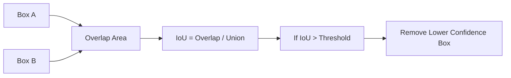
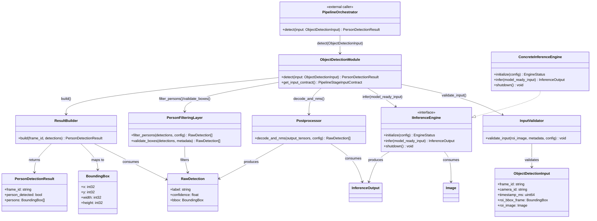
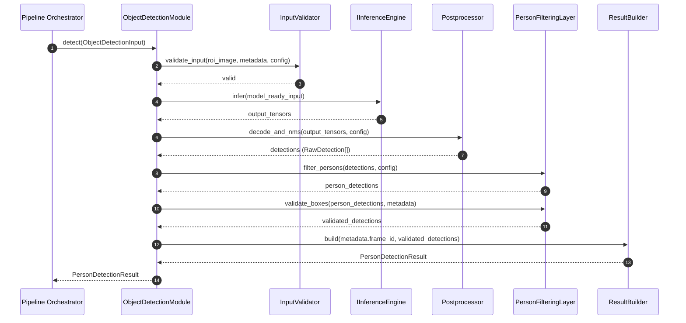
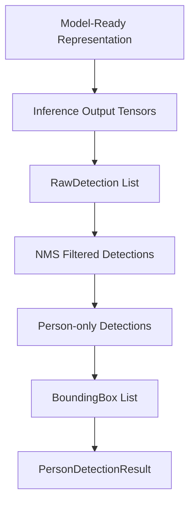

# Object Detection Module Specification (Person Detection Only)

## Shared Contract Types

The following types used by this module are defined in [shared_contracts.md](shared_contracts.md) and must not be duplicated here:

- `BoundingBox` — the single shared bounding-box type (§1)
- `OutputImageType` — the pixel representation enum (§4)
- `GeometrySpec` — the geometry transformation struct (§3)
- `ResizePolicy` — the resize behavior enum (§2)
- `PipelineStageInputContract` — the stage initialization contract (§5)
- `Image` — the canonical shared public image struct (§6); carries `data`, `width`, `height`, `color_format`, `layout`, `dtype`, and `value_range`; pixel format is described by `OutputImageType`

---

## 1. Scope

This document defines only the Object Detection Module responsible for person detection in video frames.

### In Scope
- Detect humans (person class only) per frame.
- Return person bounding boxes.
- Return a boolean indicating if at least one person is detected.
- Input validation, inference, postprocessing, and filtering required to produce module output.

### Out of Scope

The Object Detection Module does NOT:
- Interpret raw camera payloads.
- Decode encoded images.
- Convert pixel formats.
- Perform color conversion, normalization, resize, or tensor construction from raw bytes.

All frame preparation belongs to upstream components (IPS / Frame Transformation Layer).

## 2. YOLO Model Decision (Architectural)

- The module uses YOLO11m as the defined and default detection model.
- This is a fixed architectural decision for this module specification, not an optional behavior.
- The module does not implement object detection from scratch.
- YOLO11m is the actual detection engine used for inference.
- YOLO11s may be supported as a lighter non-default alternative through configuration.
- The architecture supports changing the YOLO variant (YOLO11m / YOLO11s / future models), the inference backend (ONNX / TensorRT / etc.), and the model input contract through configuration — without changing the public API.

## 3. Module Goals and Non-Functional Requirements

### Functional Goals
- Detect only persons in each input frame.
- Produce bounding boxes for detected persons.
- Expose whether one or more persons are present.

### Non-Functional Requirements
- Stateless: no cross-frame memory is required for correctness.
- Real-time capable: suitable for per-frame online processing.
- Deterministic behavior: same input and same configuration produce the same output.
- Isolated: module output contract is independent of external business logic.

## 4. Public API Contract

The primary public integration method is:

```text
detect(input: ObjectDetectionInput) -> PersonDetectionResult
```

All external callers (including `PipelineOrchestrator` inside `RecognitionPipelineManager`) must use `detect()`. This is the only supported integration entry point.

The initialization contract method is:

```text
get_input_contract() -> PipelineStageInputContract
```

`RecognitionPipelineManager` calls this once during initialization to determine the `OutputImageType` and `GeometrySpec` to pass to the Frame Transformation Layer when preparing images for this stage. The returned contract is stable across invocations.

For YOLO11m (the default model), the contract values are:
- `output_image_type`: `RGB_UINT8_HWC`
- `geometry_spec`: `{ width: 640, height: 640, resize_policy: LETTERBOX }`

The external API must expose only:
- `person_detected` (boolean)
- `persons` (list of `BoundingBox` — ROI-local coordinates)

The external API must NOT expose:
- labels
- confidence scores
- raw detections
- model outputs
- `DetectionStatus`
- runtime-specific metadata

The internal method `process(model_ready_input, metadata)` is an internal pipeline convenience method retained for backward compatibility. It must not be used as the primary integration entry point. External callers must use `detect()`.

The external API must not expose:
- labels
- confidence scores
- raw detections
- model outputs
- DetectionStatus
- runtime-specific metadata

## 5. Input Definition

### 5.1 Model-Ready Input Assumption

The Object Detection Module receives a frame that is already prepared for the YOLO model. This preparation is done upstream by IPS / Frame Transformation Layer.

The module MUST NOT:
- Convert image formats.
- Perform color conversion.
- Perform normalization.
- Perform resize.
- Construct tensors from raw bytes.

The module assumes the input is already compatible with the configured model.

### 5.2 Required Input

The module requires exactly:

**Metadata:**
- `camera_id` — non-empty identifier of frame source.
- `frame_id` — unique identifier for the frame; preserved unchanged for traceability.
- `timestamp_ms` — capture timestamp in milliseconds; preserved for tracing and debugging consistency across the pipeline.
- `roi_bbox_frame` — position of the ROI in the original (full) frame coordinate space, as a `BoundingBox`. Provided by the caller (`PipelineOrchestrator`) for validation purposes. `roi_bbox_frame` is **not** returned in `PersonDetectionResult` — coordinate projection is performed by the caller using spatial metadata from the Frame Transformation Layer.

**Processing input:**
- `roi_image` (`Image` — see [shared_contracts.md §6](shared_contracts.md)) — the model-ready image representation of the motion-region crop, already prepared for the configured YOLO model by the Frame Transformation Layer. Image pixel dimensions are owned exclusively by `roi_image.width` and `roi_image.height` inside the `Image` struct. No standalone `width` or `height` fields exist on `ObjectDetectionInput`. The `InputValidator` reads dimensions directly from `roi_image.width` and `roi_image.height` for shape consistency validation against `roi_image.data.shape`.

There is NO dependency on:
- `raw_buffer`
- `pixel_format`
- `num_color_channels`
- `bits_per_pixel`

### 5.3 Validation Rules

- `camera_id` must exist and be non-empty.
- `frame_id` must exist and be non-empty.
- `timestamp_ms` must exist.
- `roi_bbox_frame` must exist and have valid dimensions (width > 0, height > 0).
- `roi_image` must exist.
- `roi_image.width` must be > 0 and `roi_image.height` must be > 0.
- `roi_image.data` must be non-null and contain valid pixel data.
- `roi_image.color_format`, `roi_image.layout`, `roi_image.dtype`, and `roi_image.value_range` must match the expected `OutputImageType` for the configured model.
- `roi_image.data.shape` must be consistent with `roi_image.width`, `roi_image.height`, `roi_image.layout`, and `roi_image.color_format`.
- `roi_image` must match the expected model input contract.

### 5.4 Assumptions
- Input integrity is expected from the upstream producer, but this module performs strict validation before processing.
- The module rejects inputs that do not satisfy metadata or model-ready representation requirements.

## 6. Output Definition

### 6.1 BoundingBox

`BoundingBox` is defined in [shared_contracts.md §1](shared_contracts.md). Its coordinate space is always stated by context:

- `PersonDetectionResult.persons` contains **ROI-local** `BoundingBox` entries — coordinates relative to the input `roi_image`.
- Object Detection never projects boxes to full-frame coordinates. Full-frame projection is performed by the caller (`SpatialCoordinator` inside `PipelineOrchestrator`) using spatial metadata from the Frame Transformation Layer.

### 6.2 PersonDetectionResult

```text
struct PersonDetectionResult {
    string frame_id;
    bool person_detected;
    vector<BoundingBox> persons;
}
```

### 6.3 Output Semantics
- frame_id corresponds to the input frame_id to maintain traceability between input and output.
- person_detected is derived as persons.size() > 0.
- persons includes only valid person boxes after filtering and optional box validation.
- The persons list may contain zero, one, or multiple bounding boxes depending on the number of detected persons in the frame.

### 6.4 Why Confidence Is Hidden
- Confidence is model- and calibration-dependent and can change across model versions.
- Hiding confidence keeps the public contract stable and decoupled from detector internals.
- The module can update thresholds and model families without breaking consumers.

## 7. Internal Architecture (Module-Local)

The module is composed of internal components only:

- Input Validator
- Inference Engine (abstracted)
- Postprocessor
- Person Filtering Layer
- Result Builder

### 7.1 Internal Detection Structure (Internal Only)

```text
struct RawDetection {
    string label;        // class name from model output
    float confidence;    // score in [0.0, 1.0]
    BoundingBox bbox;    // decoded box in image coordinates
}
```

- RawDetection is strictly internal and must never be returned by the external API.
- `confidence` is used only internally for filtering. It is never exposed externally.

### 7.2 Component Responsibilities

#### Input Validator

The Input Validator MUST ONLY:
- Validate presence of required metadata fields (`camera_id`, `frame_id`, `timestamp_ms`, `roi_bbox_frame`).
- Validate that `roi_image` (model-ready input) exists.
- Validate compatibility with the expected model input contract.

The Input Validator MUST NOT:
- Convert raw buffers.
- Perform image preprocessing for YOLO.
- Create tensors from raw image data.

#### Inference Engine
- Loads and runs the configured YOLO model using the model-ready input directly.
- Returns raw detection outputs without applying person filtering or business-level filtering.

#### Postprocessor
- Decodes raw model tensors into RawDetection entries.
- Applies Non-Max Suppression.
- Non-Max Suppression (NMS) is applied using an IoU threshold to remove overlapping detections.
- IoU (Intersection over Union) is a metric that measures the overlap between two bounding boxes. It is calculated as the ratio between the area of intersection and the area of union of the boxes.
- During Non-Max Suppression (NMS), IoU is used to identify overlapping detections. If the IoU between two boxes exceeds a configured threshold, the lower-confidence detection is removed.
- Maps decoded detection boxes back to `roi_image` coordinate space (ROI-local coordinates, relative to the input ROI image). Full-frame coordinate projection is not the responsibility of this module.

All bounding boxes in the output are expressed in ROI-local coordinates relative to `roi_image`.

#### IoU and Non-Max Suppression Illustration



#### Person Filtering Layer
- Retains only detections where label equals person.
- Applies confidence threshold from configuration (PersonDetectionConfig). Filtering rule: keep detection ONLY if confidence >= configured threshold. The threshold must NOT be hardcoded.
- Performs optional bbox sanity checks (non-negative, in-frame, non-zero area).

#### Result Builder
- Converts filtered detections to list of BoundingBox.
- Computes person_detected from resulting list size.
- Constructs PersonDetectionResult.

### 7.3 Module Class Diagram



### 7.4 Module Sequence Diagram (Success Path)



## 8. How YOLO Is Used

- YOLO input preparation is handled upstream by IPS / Frame Transformation Layer.
- This module only:
  1. Validates the model-ready input and metadata.
  2. Runs inference on the model-ready input.
  3. Decodes model outputs into detections.
  4. Applies NMS.
  5. Filters persons (label == "person", confidence >= configured threshold).
  6. Builds PersonDetectionResult.

The module outputs only:
- person_detected
- persons (list of BoundingBox)

Implementation note:
- In the initial implementation, YOLO11m is expected to be executed using a Python-based runtime such as the Ultralytics YOLO library.
- The inference engine wraps this runtime and returns raw detection outputs to module-local postprocessing.

## 9. Inference Engine Design

### 9.1 Interface

```text
interface IInferenceEngine {
    EngineStatus initialize(PersonDetectionConfig config);
    InferenceOutput infer(ModelReadyFrame model_ready_input);
    void shutdown();
}
```

The inference engine abstraction is intentionally simple:
- The inference engine is an internal component responsible for loading and executing the configured YOLO model and returning raw detection outputs.
- The inference engine consumes the model-ready input directly — no tensor construction or image conversion is performed at this stage.
- The inference engine must remain flexible enough to load a different configured YOLO variant, model path, or backend in future revisions without external API changes.

### 9.2 Implementations

#### ONNX Runtime (Recommended)
- Recommended backend for this module.
- Selected as a production-oriented design choice.
- Provides balanced portability and runtime stability for deployment.

#### TensorRT (Optional)
- Optional future optimization for NVIDIA GPU environments.

Inference backend choice must not change the module public API.

## 10. Processing Pipeline

The module processes one frame at a time (batch size = 1).

1. Metadata validation (`camera_id`, `frame_id`, `width`, `height`).
2. Model-ready input validation.
3. Inference on the model-ready representation.
4. Output decoding.
5. Non-Max Suppression.
6. Person filtering:
   - label equals person
   - confidence >= configured threshold (from PersonDetectionConfig)
7. Bounding box validation (optional).
8. Result construction.

Determinism requirement: with fixed model, fixed thresholds, fixed NMS parameters, and identical model-ready input, output must be reproducible.

## 11. Module-Local Data Flow

Data transformations inside this module:

1. Model-ready representation -> inference output tensors.
2. Inference output tensors -> RawDetection list.
3. RawDetection list -> NMS-pruned detections.
4. NMS-pruned detections -> person-only filtered detections.
5. Filtered detections -> validated BoundingBox list.
6. BoundingBox list -> PersonDetectionResult.

No system-wide routing, orchestration, or external workflow behavior is defined here.

### Data Flow Diagram



## 12. Component Design

### 12.1 ObjectDetectionModule
- Owns processing pipeline orchestration for one frame at a time.
- Depends on IInferenceEngine abstraction.
- Receives model-ready input and minimal metadata.
- Exposes only PersonDetectionResult as public output.

### 12.2 Concrete Inference Engine
- Concrete class implementing IInferenceEngine using ONNX Runtime or TensorRT.
- Consumes the model-ready input directly.
- Responsible only for runtime interaction, not person filtering policy.

## 13. Performance Considerations

Module-level considerations only:

- Inference latency is the dominant cost in most deployments.
- The module is expected to operate within real-time constraints (for example, approximately 10-50 ms per frame depending on hardware).
- Input validation should be lightweight since all frame preparation is handled upstream.
- GPU path should reduce host-device copy overhead where runtime allows.
- Optional frame skipping may be configured to meet latency budgets under overload, but module remains stateless for each processed frame.

## 14. Metrics

The module emits only the following operational metrics:

- inference_time_ms
- validation_time_ms
- detected_people_count
- invalid_frames

Metric semantics:
- inference_time_ms: elapsed inference runtime per processed frame.
- validation_time_ms: elapsed input validation time per processed frame.
- detected_people_count: number of returned person boxes per frame.
- invalid_frames: count of frames rejected by validation.

## 15. Error Handling (Internal/Operational)

### 15.1 Internal DetectionStatus

```text
enum DetectionStatus {
    Success,
    InvalidInput,
    InferenceError
}
```

DetectionStatus is internal/operational and is not part of the external API contract.

### 15.2 Local Behavior
- Success: valid input processed; PersonDetectionResult returned.
- InvalidInput: validation failure (missing metadata or incompatible model-ready representation); empty persons and person_detected false are returned with InvalidInput status.
- InferenceError: inference runtime/model execution failure; empty persons and person_detected false are returned with InferenceError status.

The module does not define recovery behavior outside its own processing boundaries.

## 16. Extensibility (Module-Level)

This module can evolve without changing its external contract:

- Change the YOLO variant (YOLO11m / YOLO11s / future models) through configuration.
- Change the inference backend (ONNX / TensorRT / etc.) through IInferenceEngine.
- Change the model input contract by updating the upstream representation definition and the module's input validation rules.
- Replace model weights and change model_path without changing the public API contract.
- Tune confidence and NMS thresholds through configuration.
- Add additional detectable classes in future internal revisions while keeping current person-only API behavior by default.

Any extension must preserve current public API constraints unless a deliberate versioned API change is introduced.

## 17. Configuration Parameters (Module-Local)

```text
struct PersonDetectionConfig {
    string model_path;                  // default points to YOLO11m; can be updated for future model replacement
    float person_confidence_threshold;  // filtering rule: keep only if confidence >= this value; must NOT be hardcoded
    float nms_iou_threshold;
    string inference_backend;           // default: onnxruntime; backend is configurable for future evolution
    bool enable_bbox_validation;
    uint32 max_detections;
    uint32 optional_frame_skip;         // 0 means disabled
}
```

Configuration changes affect internal detection behavior but must not alter external response schema.
The combination of model_path and inference_backend enables dynamic model and runtime evolution while preserving the same public API.
The implemented default person confidence threshold is `0.35` (configurable).

## 18. Compliance Checklist

- Only person detection behavior is specified.
- Public output contains only person_detected and bounding boxes.
- Internal label/confidence/model outputs remain private.
- DetectionStatus is not part of the public API.
- YOLO11m is the defined and default detection engine.
- Module depends only on minimal metadata and model-ready input.
- Module is fully decoupled from raw image formats.
- Confidence threshold is configuration-driven.
- Architecture supports model and backend changes without public API changes.
- Aligned with IPS-driven transformation architecture.
- No tracking/event/recognition logic is defined.
- Module is stateless, deterministic, and real-time oriented.
- Specification is self-contained and implementation-ready for this single module.

The module acts as a clean abstraction layer over the YOLO11m detection model, ensuring stable external behavior while allowing internal model evolution.
