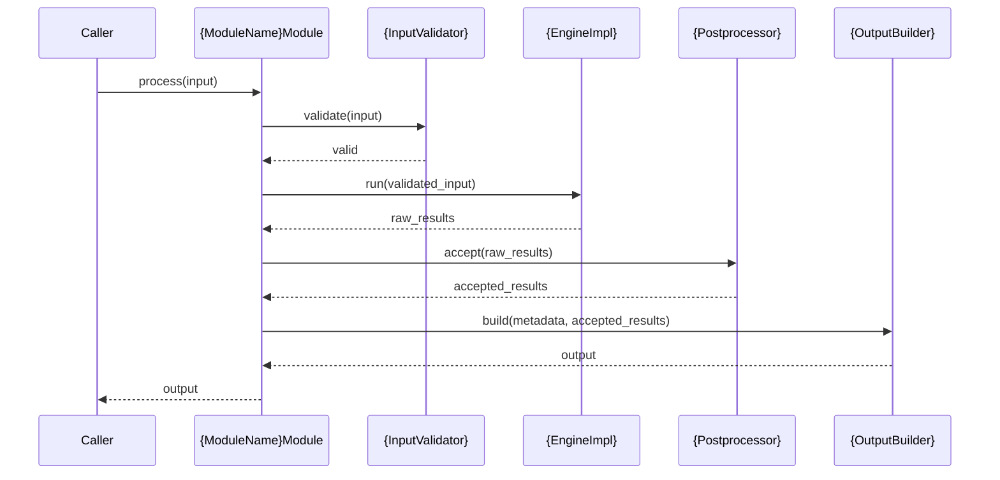
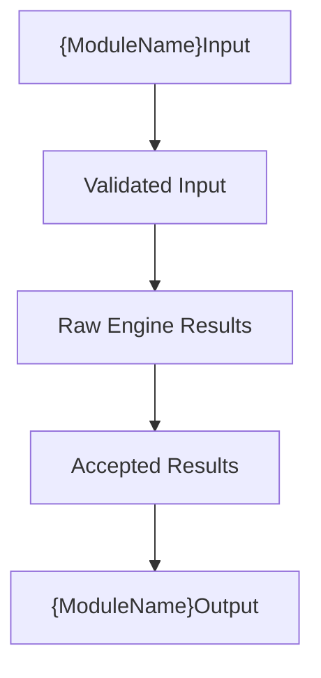

# Markdown Module Spec Skill

This skill defines a strict writing standard for creating Markdown specification documents for modules in a Camera Recognition / Image Processing Service (IPS) architecture.

This skill is NOT generic. It reflects a real production-level architecture approach where:

- Each document describes a single module only
- Modules are strictly isolated in responsibility
- Public API is stable and decoupled from implementation
- Internal implementation is separated from external contract
- Modules are composed of internal components
- Processing engines (AI models, algorithms, or backends) are replaceable without breaking the API

---

## 1. Purpose of the Skill

This skill is used to:

- Generate consistent, production-level module specification documents
- Enforce architectural boundaries between modules
- Maintain API stability across the system
- Ensure all modules follow the same structure and rules

This skill is the single source of truth for all module specifications in the project.

---

## 2. When to Use This Skill

This skill must be used when:

- Writing a new module specification
- Refactoring an existing module specification document
- Reviewing documentation for architectural correctness

---

## 3. Core Writing Principles (MANDATORY)

### 3.1 Module Isolation

- The document must describe ONLY what happens inside the module
- External systems must be referenced only as:
  - **upstream component**
  - **downstream component**
  - **external component**
- The document must NOT describe responsibilities of external systems
- The document must NOT describe system-wide orchestration

### 3.2 Responsibility Boundaries

Each internal component must explicitly define:

- What it is responsible for
- What it receives
- What it returns
- What it must NOT do

### 3.3 Public API Stability

- The public API must be clearly defined and stable
- The API must be model-agnostic and algorithm-agnostic
- The API must NOT expose:
  - Raw detections
  - Confidence scores
  - Raw tensors
  - Internal state
  - Model-specific or algorithm-specific outputs

### 3.4 Internal vs External Separation

- Raw outputs, intermediate data, confidence values, and backend artifacts must remain internal
- Public output must be minimal, clean, and stable
- No internal data may leak through the public API

### 3.5 Processing Engine Abstraction

- Any processing engine — AI model, classical algorithm, detector, or backend — must be abstracted behind an interface
- Prefer interface / engine abstraction pattern
- The document must explicitly state:
  - The current implementation
  - Whether the engine is AI-based or algorithmic
  - That it is replaceable
  - That replacing it does NOT affect the public API

### 3.6 Configuration-Driven Design

- All thresholds, model paths, runtime flags, and limits must come from configuration
- The document must specify:
  - Where configuration is used
  - When it is loaded (initialization vs runtime)
  - Whether it is immutable after initialization

### 3.7 Strong Typing

All input and output structures must include explicit types.

**Primitive types:**

- `string`
- `uint64`
- `int32`
- `float`
- `bool`

**Collection types:**

- `vector<T>`
- `map<K,V>`

**Enum types:**

- Must list all variants explicitly
- Example: `enum MotionResult { NO_PREVIOUS_FRAME, MOTION_DETECTED, NO_MOTION_DETECTED, INVALID_FRAME }`

**Custom struct types:**

- Must be fully defined with typed fields in the same document before first use
- Example: `struct BoundingBox { int32 x; int32 y; int32 width; int32 height; }`

**Opaque types:**

- Types whose internal representation is not defined in the module spec (e.g., `Image`, `ModelReadyFrame`, `PreparedROI`)
- Opaque types must state what contract they satisfy (format, layout, dtype, value range)
- The module must not depend on the internal structure of opaque types beyond the stated contract

### 3.8 Component-Based Internal Design

- The module must be composed of internal components
- Each component must define:
  - Responsibility
  - Inputs
  - Outputs
  - What it must NOT do

---

## 4. Required Document Structure (ENFORCED CONTENT, FLEXIBLE ORDER)

All sections listed below are mandatory unless explicitly marked as optional. The order below is the recommended default. The order may be adjusted per module if it improves readability, but all mandatory sections must be present.

1. **Scope**
   - **Purpose** — what this module is responsible for
   - **In Scope** — explicit list of responsibilities and behaviors this module owns
   - **Out of Scope** — explicit list of what this module does NOT do and does NOT own

2. **Input**
   - **Input Responsibility Boundary** — what the module receives vs. what is prepared outside the module by upstream components
   - **Input Structure** — typed struct definition of the module input
   - **Input Contract** — preconditions the input must satisfy before the module processes it (format, dtype, shape, value range)
   - **Validation Rules** — explicit checks the module performs on input before processing begins
   - **Input Semantics** — what each field means and how it is used during processing

3. **Output**
   - Output Structure
   - Output Semantics
   - Output Constraints

4. **Public API**
   - Must include function signature

5. **Non-Functional Requirements**
   - Stateless vs Stateful behavior
   - Real-time constraints
   - Determinism guarantees
   - Module isolation properties

6. **Processing Engine**
   - Abstraction interface
   - Current implementation
   - Whether the engine is AI-based (model inference) or algorithmic (classical processing)
   - Replaceability — replacing the engine must NOT affect the public API

7. **Acceptance / Filtering Logic** (mandatory for detection-style modules)
   - What constitutes a valid output entry
   - Thresholds applied (confidence, area, overlap)
   - Filtering and suppression rules (NMS, deduplication, sanity checks)
   - Where acceptance decisions are made (which internal component)

8. **Internal Architecture**
   - List of internal components

9. **Internal Pipeline**
   - Single-line processing flow
   - Step-by-step flow

10. **Configuration**
    - Parameters
    - Loading behavior

11. **Internal Data Structures**

12. **Error Handling**

13. **Metrics / Observability** (optional)

14. **Lifecycle**

15. **Class Diagram** (Mermaid)

16. **Sequence Diagram** (Mermaid)

17. **Data Flow Diagram** (Mermaid, optional but recommended)
    - Shows data transformations through the internal pipeline
    - Complements the sequence diagram by visualizing what data becomes at each step

18. **Extensibility** (optional)
    - What can change without breaking the public API (model, backend, thresholds, classes)
    - What must remain stable (public output schema, function signature)

19. **Module Compliance Checklist**
    - Module-specific invariants the implementation must satisfy

---

## 5. Writing Style Rules

- Use precise technical language
- Use:
  - "is responsible for"
  - "must"
  - "must not"
- Avoid:
  - "may"
  - "usually"
  - "sometimes"
- Explicitly mark:
  - Internal-only behavior
  - Configuration-defined behavior
  - Replaceable components

---

## 6. Conciseness Requirement (MANDATORY)

The following sections must be concise and significantly shorter than the rest of the document.

### Error Handling

- Cover only:
  - Invalid input
  - Inference / runtime failure
  - Empty result
- Short bullet points only

### Metrics / Observability

- Only key metrics:
  - Latency
  - Counts
  - Failures
- One line per metric

### Lifecycle

- Bullet points only:
  - Initialization
  - Per invocation
  - Shutdown (if applicable)

### Internal Data Structures

- List internal objects only
- Include:
  - Short purpose
  - Lifecycle (`per-call` / `persistent`)
- No deep explanations

---

## 7. Pre-Output Checklist (MANDATORY)

Before finalizing any module specification, the skill must verify:

- [ ] Module scope is clearly defined (Purpose, In Scope, Out of Scope)
- [ ] Input and output include explicit types (including enums, custom structs, opaque types with contracts)
- [ ] Public API is defined and clean
- [ ] Non-functional requirements are stated
- [ ] Internal components are clearly separated
- [ ] Pipeline is described step-by-step
- [ ] Configuration is defined
- [ ] Processing engine abstraction exists (AI or algorithmic)
- [ ] Acceptance / filtering logic is defined (for detection-style modules)
- [ ] No internal data leaks to the public API
- [ ] Class diagram exists (Mermaid)
- [ ] Sequence diagram exists (Mermaid)
- [ ] Module compliance checklist exists

---

## 8. Recommended Additions (Optional)

- Assumptions
- Invariants
- Thread-safety (if relevant)
- Decision Log (`YYYY-MM-DD: {decision and rationale}`)

---

## 9. Reusable Markdown Skeleton

````markdown
# {Module Name} Module Specification

## 1. Scope

### 1.1 Purpose

The {Module Name} module is responsible only for {primary responsibility}.

The module does not {explicit exclusion 1}, does not {explicit exclusion 2}, and does not {explicit exclusion 3}.

### 1.2 In Scope

- {Responsibility 1}
- {Responsibility 2}
- Input validation, processing, and output construction required to produce module output

### 1.3 Out of Scope

The {Module Name} module does NOT:

- Interpret raw camera payloads
- Decode encoded images
- Perform color conversion, normalization, resize, or tensor construction
- {Module-specific exclusion}

All frame preparation belongs to upstream components.

## 2. Input

### 2.1 Input Responsibility Boundary

The module receives {description of what arrives}. This input is produced outside the module by the upstream component.

The preparation done outside the module includes:

- {upstream step 1}
- {upstream step 2}

The module does not perform any of the above preparation steps.

### 2.2 Input Structure

```text
struct BoundingBox {
    int32 x;
    int32 y;
    int32 width;
    int32 height;
}

struct {ModuleName}Input {
    uint64 frame_id;
    string camera_id;
    uint64 timestamp_ms;
    Image input_image;
    // module-specific fields
}
```

### 2.3 Input Contract

The `input_image` must already match the configured processing engine input contract before processing starts.

- color format: `RGB`
- layout: `HWC`
- dtype: `uint8`
- value range: `[0, 255]`

The exact contract is configuration-defined. The module validates the incoming input against the contract before processing.

### 2.4 Validation Rules

- `frame_id` must exist
- `camera_id` must exist and be non-empty
- `timestamp_ms` must exist
- `input_image` must exist and be non-empty
- `input_image` must match the configured input contract (format, layout, dtype, value range)
- {Module-specific validation rules}

### 2.5 Input Semantics

- `frame_id` identifies the source frame for traceability
- `camera_id` identifies the source camera
- `timestamp_ms` is the capture timestamp in milliseconds
- `input_image` is the prepared input image matching the configured contract

## 3. Output

### 3.1 Output Structure

```text
struct {ModuleName}Output {
    uint64 frame_id;
    string camera_id;
    uint64 timestamp_ms;
    bool {result_flag};
    vector<{ResultType}> results;
}
```

### 3.2 Output Semantics

- `frame_id`, `camera_id`, and `timestamp_ms` are copied from the input for traceability
- `{result_flag}` is derived as `results.size() > 0`
- `results` contains only accepted entries after filtering

### 3.3 Output Constraints

The output must NOT contain:

- Raw detections or unfiltered results
- Confidence scores
- Internal state or intermediate data
- Model-specific or algorithm-specific outputs
- Backend artifacts

## 4. Public API

```text
{ModuleName}Output process({ModuleName}Input input);
```

The API is engine-agnostic. Replacing the internal processing engine does not change this signature. The caller receives the same output structure regardless of which engine implementation is active.

## 5. Non-Functional Requirements

- **Stateless:** the module retains no state between invocations. Each call is independent.
- **Real-time:** the module must be suitable for per-frame online processing within the system's latency budget.
- **Deterministic:** same input and same configuration must produce the same output.
- **Isolated:** module output contract is independent of external business logic. No cross-module side effects.

## 6. Processing Engine

### 6.1 Abstraction Interface

```text
interface {EngineInterface} {
    {ResultType} process(prepared_input: {InputType}) -> {RawResultType}
}
```

### 6.2 Current Implementation

The current implementation uses {engine/model/algorithm name}. It was selected because {rationale}.

Engine type: {AI-based (model inference) | Algorithmic (classical processing)}

### 6.3 Replaceability

The module depends on the `{EngineInterface}` abstraction, not on {current implementation} directly. A different processing engine can replace it without changing the public API, the input/output structures, or the responsibilities of internal components.

## 7. Acceptance / Filtering Logic

This section applies to detection-style modules. For non-detection modules, replace with the equivalent output validation logic.

- **Confidence threshold:** detections with confidence below the configured `confidence_threshold` are discarded. The threshold is loaded from configuration at initialization and is immutable.
- **Bounding box validation:** boxes with zero area, negative dimensions, or coordinates outside the frame are discarded.
- **Non-Max Suppression:** overlapping detections above the configured `nms_iou_threshold` are suppressed; only the highest-confidence box is retained.
- **Acceptance component:** `{PostprocessorName}` is the only internal component that decides which raw results become accepted output entries.

If no results survive filtering, the module returns a valid output with an empty results list.

## 8. Internal Architecture

| Component | Responsibility |
|-----------|---------------|
| {ModuleName}Module | Orchestration only. Owns no processing logic. Invokes subcomponents in order. |
| {InputValidator} | Validates input fields and contract compliance. Does not process data. |
| {EngineImpl} | Runs processing and returns raw results. Does not filter or validate. |
| {Postprocessor} | Applies acceptance rules. Does not project coordinates or build output. |
| {OutputBuilder} | Constructs final output from accepted results and input metadata. |

## 9. Internal Pipeline

**Single-line flow:**

Input → Validation → Engine Processing → Postprocessing/Acceptance → Output Construction → Output

**Step-by-step flow:**

1. `{ModuleName}Module` receives `{ModuleName}Input`
2. `{InputValidator}` validates input fields and contract compliance
3. `{ModuleName}Module` sends validated input to `{EngineImpl}`
4. `{EngineImpl}` runs processing and returns raw results
5. `{Postprocessor}` applies acceptance rules and returns only accepted results
6. `{OutputBuilder}` constructs the final `{ModuleName}Output` from accepted results and input metadata
7. `{ModuleName}Module` returns the output to the caller

## 10. Configuration

```text
struct {ModuleName}Config {
    float confidence_threshold;
    string engine_backend;
    string model_path;
    // module-specific configuration fields with types
}
```

- Loaded at: initialization
- Immutable after initialization: yes
- Configuration is not part of per-call input

## 11. Internal Data Structures

| Structure | Purpose | Lifecycle |
|-----------|---------|-----------|
| RawResults | Unfiltered engine output | per-call |
| AcceptedResults | Results that passed acceptance rules | per-call |

## 12. Error Handling

- **Invalid input** (missing fields, contract mismatch, zero-size input) → return structurally valid output with empty results
- **Engine failure** (runtime error, model load failure) → catch internally, return valid output with empty results
- **Empty result** (zero results or all rejected by acceptance rules) → return valid output with empty results; this is normal operation

## 13. Metrics / Observability (Optional)

- `{module}_inference_time_ms` — processing engine duration per invocation
- `{module}_validation_time_ms` — input validation duration per invocation
- `{module}_accepted_count` — accepted results per invocation
- `{module}_rejected_count` — results discarded by acceptance rules per invocation
- `{module}_failures` — failed invocations

## 14. Lifecycle

- **Initialization:** load configuration, wire subcomponents with configuration values, initialize processing engine
- **Per invocation:** validate → process → accept/filter → build output. Stateless. No state carries between calls.
- **Shutdown:** release engine resources (if applicable)

## 15. Class Diagram

```mermaid
classDiagram
    class {ModuleName}Module {
        +process(input) output
    }
    class {EngineInterface} {
        <<interface>>
        +run(data) raw_result
    }
    class {ConcreteEngine} {
        +run(data) raw_result
    }
    class {InputValidator} {
        +validate(input) void
    }
    class {Postprocessor} {
        +accept(raw_results) accepted_results
    }
    class {OutputBuilder} {
        +build(metadata, accepted) output
    }
    {ModuleName}Module --> {EngineInterface}
    {ConcreteEngine} ..|> {EngineInterface}
    {ModuleName}Module --> {InputValidator}
    {ModuleName}Module --> {Postprocessor}
    {ModuleName}Module --> {OutputBuilder}
```

## 16. Sequence Diagram



## 17. Data Flow Diagram (Optional, Recommended)



## 18. Extensibility (Optional)

This module can evolve without changing its external contract:

- Replace the processing engine (different model, algorithm, or backend) through configuration
- Tune thresholds (confidence, NMS IoU) through configuration
- Change model weights or model path without changing the public API
- Add internal processing steps without affecting output schema

The following must remain stable:

- Public API function signature
- Output structure and semantics
- Input structure and semantics

## 19. Module Compliance Checklist

- [ ] Output is engine-agnostic — no model-specific or algorithm-specific data in public output
- [ ] No internal data leaks — confidence scores, raw tensors, intermediate state are never exposed
- [ ] Deterministic behavior — same input and configuration produce the same output
- [ ] Filtering rules enforced — acceptance logic is applied before output construction
- [ ] Configuration-driven — all thresholds and runtime parameters come from configuration
- [ ] Engine is replaceable — swapping the processing engine does not affect the public API
- [ ] {Module-specific invariant}
````

---

## Quality Requirements

- This skill must be strict and enforceable
- The structure must be consistent across all modules
- The tone must match production-level architecture documentation
- The result must NOT be generic
- The result must reflect a real system design standard

This skill serves as the single source of truth for all module specifications in the project.
