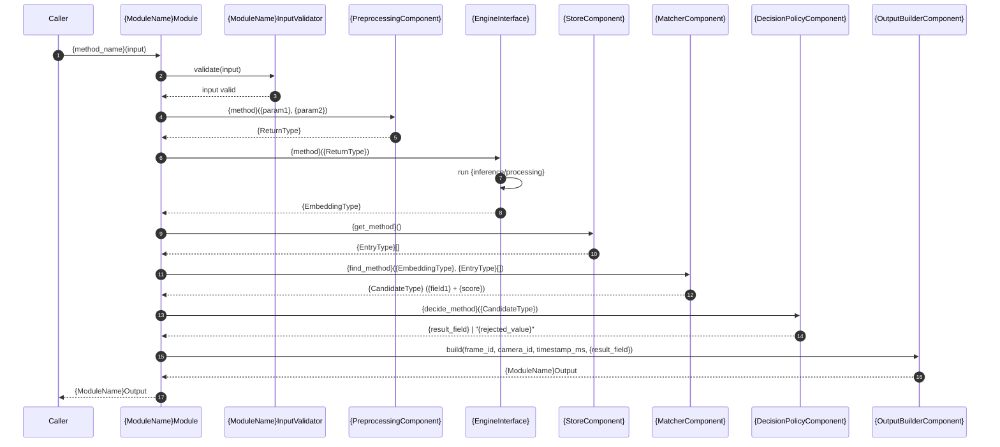
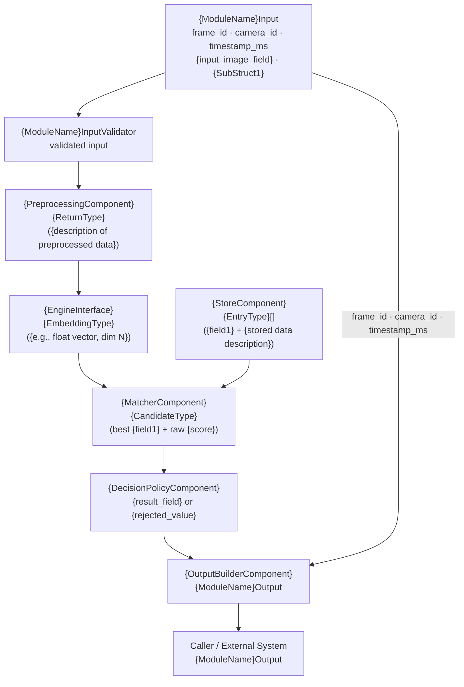

# Markdown Module Spec Skill

This skill defines the strict writing standard for creating Markdown specification documents for modules in the Camera Recognition / Image Processing Service (IPS) architecture.

This skill is NOT generic. It enforces a production-level architecture standard where:

- Each document describes a single module only
- Modules are strictly isolated in responsibility
- Public API is stable and decoupled from implementation
- Internal implementation is separated from external contract
- Modules are composed of named internal components with explicit responsibilities
- Processing engines (AI models, algorithms, or backends) are replaceable without breaking the API

The canonical reference for this skill is the structure, rules, and skeleton defined within this document. Every output produced by this skill must strictly follow the required 18-section structure, naming conventions, level of detail, and writing style defined here.

---

## 1. Purpose of the Skill

This skill is used to:

- Generate consistent, production-level module specification documents
- Enforce architectural boundaries between modules
- Maintain API stability across the system
- Ensure all modules follow the same structure, ordering, and rules

This skill is the single source of truth for all module specifications in the project.

---

## 2. When to Use This Skill

This skill must be used when:

- Writing a new module specification
- Rewriting or refactoring an existing module specification
- Reviewing documentation for architectural correctness

---

## 3. Core Writing Principles (MANDATORY)

### 3.1 Module Isolation

- The document must describe ONLY what happens inside the module
- External systems must be referenced generically:
  - "handled outside this module"
  - "upstream component"
  - "downstream component"
  - "external system"
- The document must NOT reference specific external module names
- The document must NOT describe responsibilities of external systems
- The document must NOT describe system-wide orchestration

### 3.2 Responsibility Boundaries

Each internal component section must explicitly define:

- What the component is responsible for
- What it receives
- What it returns
- What it must NOT do

The "must NOT do" constraint is mandatory for every component. It enforces strict separation of concerns.

### 3.3 Public API Stability

- The public API must be clearly defined and stable
- The API must be model-agnostic and algorithm-agnostic
- The API must NOT expose:
  - Raw detections or unfiltered results
  - Confidence scores or similarity scores
  - Raw tensors or embeddings
  - Internal state
  - Model-specific or algorithm-specific data

### 3.4 Internal vs External Separation

- Raw outputs, intermediate data, confidence values, scores, and backend artifacts must remain internal
- Public output must be minimal, clean, and stable
- No internal data may leak through the public API

### 3.5 Processing Engine Abstraction

- Any processing engine — AI model, classical algorithm, detector, or backend — must be abstracted behind an interface
- The document must explicitly state:
  - The abstraction interface definition
  - The current default implementation class
  - Whether the engine is AI-based or algorithmic
  - That the module depends on the interface, not the concrete class
  - That replacing the engine does NOT affect the public API

### 3.6 Configuration-Driven Design

- All thresholds, paths, runtime flags, and source references must come from configuration
- The document must specify:
  - Each configuration parameter with type and purpose
  - That configuration is loaded once at initialization and is immutable
  - Which internal component each configuration value is injected into

### 3.7 Strong Typing

All input, output, and internal structures must use explicit types.

**Primitive types:** `string`, `uint64`, `int32`, `float`, `bool`

**Collection types:** `vector<T>`, `map<K,V>`

**Enum types:**
- Must list all variants explicitly
- Example: `enum MotionResult { NO_PREVIOUS_FRAME, MOTION_DETECTED, NO_MOTION_DETECTED, INVALID_FRAME }`

**Custom struct types:**
- Must be fully defined with typed fields before first use in the document
- Example: `struct BoundingBox { int32 x; int32 y; int32 width; int32 height; }`

**Opaque types:**
- Types whose internal representation is not defined by this module (e.g., `Image`, `ModelReadyFrame`)
- Must state what contract they satisfy (format, layout, dtype, value range)
- The module must not depend on the internal structure of opaque types beyond the stated contract

### 3.8 Writing Style (ENFORCED)

- Use precise, declarative, implementation-ready language
- Use: "is responsible for", "must", "must not", "does not", "is the only component that"
- Do NOT use: "should", "can", "might", "may", "usually", "sometimes"
- No storytelling, motivational framing, or explanation outside the spec
- No redundancy between sections — each fact appears exactly once

---

## 4. Required Document Structure (STRICT ORDER — MANDATORY)

All 18 sections are mandatory. The order is fixed. No section may be omitted, reordered, or renamed.

### Section 1 — Scope

- **Purpose** — single paragraph stating what this module is responsible for and its role in the pipeline
- **In Scope** — explicit bullet list of responsibilities this module owns
- **Out of Scope** — explicit bullet list prefixed "The {Module Name} module does NOT:" listing exclusions; use "handled outside this module" for external responsibilities

### Section 2 — Input

- **2.1 Input Responsibility Boundary** — what the module receives, what preparation was done outside the module, and what the module does not do
- **2.2 Input Structure** — complete typed struct definitions in a `text` code block; define all sub-structs before use; state whether any type is opaque
- **2.3 Input Contract** — explicit preconditions: color format, layout, dtype, value range, dimension requirements, and any module-specific constraints
- **2.4 Validation Rules** — bullet list of checks the named validator component performs; one rule per bullet
- **2.5 Input Semantics** — one line per field: name — meaning and how it is used inside the module

### Section 3 — Output

- **3.1 Output Structure** — complete typed struct in a `text` code block
- **3.2 Output Semantics** — one line per field: name — meaning
- **3.3 Output Constraints** — explicit bullet list prefixed "The output must NOT expose:" listing every category of data forbidden from the output

### Section 4 — Public API

Single `text` code block with the function signature. The following sentence must be present: "The API must remain stable regardless of which [engine type] is configured."

### Section 5 — Non-Functional Requirements

Bullet list. Must include:
- Stateless / stateful behavior (and any named exception)
- Single-item vs batch behavior
- Real-time suitability
- Determinism
- Model-agnostic API
- Strict isolation from internal AI data

### Section 6 — Processing Engine

- **6.1 Engine Abstraction Interface** — `text` code block with the interface definition
- **6.2 Current Default Implementation** — `text` code block with the implementing class name; state whether AI-based or algorithmic; describe what it produces
- **6.3 Replaceability** — state what the module depends on (interface, not concrete class); confirm that substitution does NOT affect public API or calling code

### Section 7 — Acceptance / Filtering Logic

Prose paragraphs. Must state:
- Which component returns intermediate results and what those results contain
- Which component applies the threshold and how
- The threshold name, its source (configuration), and when it was loaded
- That no scores or flags are returned to the caller
- That the named decision component is the ONLY place that makes accept or reject decisions

### Section 8 — Internal Pipeline

One subsection per internal component (8.1, 8.2, …, 8.N), followed by 8.N+1 "End-to-End Processing Flow".

Each component subsection must follow this exact format:

```
### 8.X ComponentName

ComponentName is responsible for {single-sentence role description}.

Its responsibilities are:

- {responsibility 1}
- {responsibility 2}

ComponentName must not {explicit exclusion 1}, {exclusion 2}, or {exclusion 3}.
```

The orchestration module (8.1) must state it "owns no recognition/detection/processing logic". It must describe what it does during initialization (loading configuration, wiring components, injecting dependencies).

**End-to-End Processing Flow:**

The final subsection must include:
- A single-line summary: `step1 → step2 → … → output construction`
- A numbered step-by-step list: each step is `ModuleName calls ComponentName.method(args) → ReturnType`
- A closing sentence: "All intermediate data (…) remain strictly internal to the module."

### Section 9 — Configuration

- **9.1 Configuration Parameters** — `text` code block with the full config struct; each field has an inline comment explaining its purpose
- **9.2 Loading Behavior** — state that configuration is loaded exactly once at initialization, is immutable after initialization, and that no configuration parameter is part of input
- Injection at construction time — explicit bullet list mapping each config value to the internal component it is injected into; list the engine abstraction injection as a named dependency

### Section 10 — Internal Data Structures

Flat bullet list. Each entry: `**StructName**` — purpose; produced by X, consumed by Y; lifecycle: `per-call` or `persistent`

### Section 11 — Error Handling

Short bullet list only. Each entry covers one failure scenario: cause → action. All failure paths must resolve to a valid output. The fallback value (e.g., `"UNKNOWN"`, empty list) must be explicit in each entry.

### Section 12 — Metrics / Observability

Flat bullet list. One line per metric: `metric_name` — what it measures. Must end with: "Metrics are internal and operational. Not part of the public API."

### Section 13 — Lifecycle

Three sub-sections: **13.1 Initialization**, **13.2 Per Invocation**, **13.3 Shutdown**. Bullet points only. Per Invocation must include the single-line pipeline summary.

### Section 14 — Class Diagram (Mermaid)

`mermaid` code block. Must include:
- The main module class with the public API method signature
- All internal components as classes with their method signatures
- The engine interface with `<<interface>>` stereotype
- The concrete engine implementation with `implements` arrow
- All data struct classes (Input, Output, sub-structs) with typed fields
- Relationship arrows using `-->` (orchestrates) and `..|>` (implements)

### Section 15 — Sequence Diagram (Mermaid)

`mermaid` code block with `autonumber`. Must include:
- All internal components as participants
- Every internal method call in pipeline order
- Return arrows (`-->>`) for each call
- Self-calls (e.g., `Engine->>Engine: run inference`) where applicable
- The caller and the module as the outermost participants

### Section 16 — Data Flow Diagram (Mermaid)

`mermaid flowchart TD` block. Must include:
- One node per pipeline stage
- Node labels showing the component name and the data structure it produces (with key field names)
- Arrows for all data flows, including the metadata pass-through to the output builder
- The external caller as the final node

### Section 17 — Extensibility

Two explicit sub-lists:
- **What can change without breaking the public API:** engine implementation, inference backend, source/path, thresholds — each as a bullet
- **What must remain stable:** public API function signature, output schema with field names and types, fallback value semantics

### Section 18 — Module Compliance Checklist

Unchecked checkbox list `- [ ]`. Each item is a single, verifiable invariant about the module's behavior. Must include:
- Single-item-per-invocation constraint (if applicable)
- Threshold applied internally only (not exposed in input/output)
- No internal data type exposure in output (embeddings, scores, raw tensors, etc.)
- Engine abstraction respected (module depends on interface, not concrete class)
- Preprocessing/responsibility boundary enforced
- Metadata preserved unchanged from input to output
- Fallback value returned for all non-match / failure scenarios

---

## 5. Isolation Rules

- Every sentence that references an external system must use only generic terms: "handled outside this module", "upstream component", "downstream component", "external system"
- No specific module names from the broader system may appear in the document
- The input responsibility boundary section must clearly state what the module does NOT do and that those steps are performed outside the module
- No internal struct, score, embedding, or flag may appear in any public-facing type

---

## 6. Conciseness Rules (MANDATORY)

The following sections must be concise — bullet points only, no prose:

- **Section 10 (Internal Data Structures):** one bullet per struct; no deep explanation
- **Section 11 (Error Handling):** one bullet per failure scenario; cause → action only
- **Section 12 (Metrics):** one line per metric
- **Section 13 (Lifecycle):** bullet points only per sub-section

All other sections use prose and code blocks as shown in the canonical reference.

---

## 7. Pre-Output Checklist (MANDATORY)

Before finalizing any module specification, verify:

- [ ] All 18 sections are present in the correct order with the correct headings
- [ ] Section 1 has all three sub-sections: Purpose, In Scope, Out of Scope
- [ ] Input structure uses typed structs with all sub-structs defined; opaque types state their contract
- [ ] Output constraints list every category of data forbidden from output
- [ ] Public API signature is present and model-agnostic
- [ ] Non-functional requirements include stateless, single-item, real-time, deterministic, model-agnostic, strict isolation
- [ ] Engine abstraction interface is defined; default implementation is named; replaceability is confirmed
- [ ] Acceptance / filtering logic names the decision component as the only place making accept/reject decisions
- [ ] Every internal component section has responsibilities listed and a "must NOT" constraint
- [ ] End-to-End Processing Flow is numbered step by step with explicit method calls and return types
- [ ] Configuration struct is fully typed with inline comments; injection mapping is explicit
- [ ] Internal data structures include lifecycle annotations (per-call / persistent)
- [ ] Error handling covers: validation failure, runtime failure, empty result, no match above threshold
- [ ] All failure paths resolve to a valid output with explicit fallback value
- [ ] Class diagram includes interface stereotype, implementing class, all data structs with typed fields
- [ ] Sequence diagram uses `autonumber` and includes all internal components as participants
- [ ] Data flow diagram includes metadata pass-through arrow to the output builder
- [ ] Extensibility lists both what can change and what must remain stable
- [ ] Module compliance checklist contains module-specific verifiable invariants
- [ ] No internal data leaks to the public API
- [ ] No specific external module names referenced anywhere in the document

---

## 8. Reusable Markdown Skeleton

The skeleton below is the required template for all module specifications. Every placeholder surrounded by `{curly braces}` must be replaced with concrete module-specific content. No placeholder may remain unresolved in a final document.

````markdown
# {Module Name} Module Specification

## 1. Scope

### Purpose

The {Module Name} module is responsible for {primary responsibility in one sentence}. It receives {input description} and returns {output description}. {One sentence on where this module sits in the pipeline.}

### In Scope

- Validating the incoming {input description}
- {Core processing step 1}
- {Core processing step 2}
- {Core processing step 3}
- Applying threshold-based {acceptance logic name} — loaded at initialization, not passed per invocation
- Returning a clean {output type} result

### Out of Scope

The {Module Name} Module does NOT:

- {Excluded responsibility 1} — handled outside this module
- {Excluded responsibility 2} — handled outside this module
- {Excluded responsibility 3}
- Expose {internal data type 1}, {internal data type 2}, or {internal data type 3}
- {Any other explicit exclusion}

## 2. Input

### 2.1 Input Responsibility Boundary

The module receives {description of what arrives and what state it is in}. The following have already been applied:

- {Upstream preparation step 1}
- {Upstream preparation step 2}
- {Upstream preparation step 3}

The {Module Name} module does not perform any of the above. Only {module-specific processing category} is performed inside this module.

### 2.2 Input Structure

```text
struct {SubStruct1} {
    {type} {field1};
    {type} {field2};
}

struct {ModuleName}Input {
    uint64        frame_id;
    string        camera_id;
    uint64        timestamp_ms;
    Image         {input_image_field};
    {SubStruct1}  {sub_struct_field};
}
```

`Image` is an opaque type. Its internal representation is not defined by this module. `{SubStruct1}` is a fully typed canonical struct defined above.

### 2.3 Input Contract

`{input_image_field}` must satisfy the configured {engine name} contract before entering the module:

- {Constraint 1: color format, layout, dtype, value range}
- {Constraint 2: dimension requirement}
- {Constraint 3: any module-specific precondition}

### 2.4 Validation Rules

`{ModuleName}InputValidator` must verify:

- `frame_id` must exist
- `camera_id` must exist and be non-empty
- `timestamp_ms` must exist
- `{input_image_field}` must exist and be non-null
- `{sub_struct_field}` must be present with all {N} {sub-element description} defined
- {Module-specific validation rule}

### 2.5 Input Semantics

- `frame_id` — source frame identifier; preserved unchanged for traceability
- `camera_id` — source camera identifier; preserved unchanged for traceability
- `timestamp_ms` — capture timestamp in milliseconds; preserved unchanged for traceability
- `{input_image_field}` — {description of what this image contains and its role in the pipeline}
- `{sub_struct_field}` — {description of what this field is and which internal component uses it}; not used for {excluded purpose}

## 3. Output

### 3.1 Output Structure

```text
struct {ModuleName}Output {
    uint64 frame_id;
    string camera_id;
    uint64 timestamp_ms;
    {type}  {result_field};
}
```

### 3.2 Output Semantics

- `frame_id`, `camera_id`, `timestamp_ms` — copied unchanged from input for traceability
- `{result_field}` — {description of the result: what it means, when it takes each value}

### 3.3 Output Constraints

The output must NOT expose:

- {Internal data category 1}
- {Internal data category 2}
- {Internal data category 3}
- {Internal data category 4}
- {Internal data category 5}

All {processing logic description} and intermediate computation are strictly internal. The only externally visible result is `{result_field}`.

## 4. Public API

```text
{result_type} {method_name}(input: {ModuleName}Input)
```

The API must remain stable regardless of which {engine type} is configured. {Threshold / configuration parameter name} is never a parameter — it is immutable internal configuration state loaded at initialization.

## 5. Non-Functional Requirements

- **Stateless per invocation** — no cross-frame memory{, with the sole exception of {StatefulComponent}, which is read-only during processing}
- **Single {item type} per invocation** — upstream component is responsible for dispatching individual {items}; the module must not accept batched input
- **Real-time capable** — suitable for per-frame online processing
- **Deterministic** — same input + same configuration + same {state description} produce the same output
- **Model-agnostic API** — the public output schema is independent of the underlying {engine type}
- **Strict isolation** — no internal AI data ({internal data types}) escapes the public API

## 6. Processing Engine

### 6.1 Engine Abstraction Interface

```text
interface {EngineInterface} {
    {ReturnType} {method}({param}: {ParamType}) -> {ReturnType}
}
```

### 6.2 Current Default Implementation

```text
class {ConcreteEngine} implements {EngineInterface}
```

{ConcreteEngine} is an {AI-based engine (neural network inference) | algorithmic engine (classical processing)}. It {one sentence on what it produces}.

### 6.3 Replaceability

The module depends on the `{EngineInterface}` interface, not on `{ConcreteEngine}` directly. Any {engine description} may be substituted without changing `{ModuleName}Input`, `{ModuleName}Output`, or calling code. Replacing the engine does NOT affect the public API.

## 7. Acceptance / Filtering Logic

{Acceptance/filtering logic} is {threshold/rule}-based and exclusively managed by `{DecisionPolicyComponent}`.

- `{ResultProducerComponent}` returns the {best candidate / raw results} and {its score / their scores} from {the gallery / the detection results}. If {empty condition}, it returns {empty result description}.
- `{DecisionPolicyComponent}` applies `{threshold_parameter}`:
  - If {condition} ≥ `{threshold_parameter}` → return {accepted value}, else {rejected value}
- The threshold is loaded from configuration at initialization. It is immutable and not adjustable per invocation.
- No {scores or flags} are returned to the caller.
- `{DecisionPolicyComponent}` is the only place inside the module that makes accept or reject decisions.

## 8. Internal Pipeline

### 8.1 {ModuleName}Module

`{ModuleName}Module` is the orchestration layer only. It owns no {processing type} logic.

Its responsibilities are:

- receive `{ModuleName}Input`
- invoke internal subcomponents in the correct order
- pass results between components through the pipeline
- return the final `{ModuleName}Output` to the caller

During initialization, `{ModuleName}Module` is responsible for loading the module configuration and wiring each internal subcomponent with its required settings, including injecting `{threshold_parameter}` into `{DecisionPolicyComponent}` and `{source_parameter}` into `{StoreComponent}`.

`{ModuleName}Module` must not embed validation, {step 2}, {step 3}, {step 4}, or decision logic directly. Each of those responsibilities belongs to a dedicated internal component.

### 8.2 {ModuleName}InputValidator

`{ModuleName}InputValidator` is responsible only for input validation. It validates all input fields before processing begins.

Validation rules:

- `frame_id` must exist
- `camera_id` must exist and be non-empty
- `timestamp_ms` must exist
- `{input_image_field}` must exist and be non-null
- `{sub_struct_field}` must be present with all {N} {sub-element description}
- {Module-specific validation rule}

`{ModuleName}InputValidator` does not perform any {processing step}, {processing step}, or {processing step}, and makes no acceptance decisions.

### 8.3 {PreprocessingComponent}

`{PreprocessingComponent}` {one sentence describing what it produces from the input}.

Its responsibilities are:

- receive `{input}` and `{secondary_input}`
- {primary processing step}
- return `{OutputType}` ready for {next stage}

`{PreprocessingComponent}` must not run inference, access {the gallery / external state}, or apply thresholds.

### 8.4 {EngineInterface}

`{EngineInterface}` is the internal {processing type} runtime abstraction used by the module.

Its responsibilities are:

- accept {input description} from the orchestrator
- run {inference / processing}
- return a {description of returned data}

`{EngineInterface}` does not {compare / filter / decide}. It returns the raw {output type} only.

`{ConcreteEngine}` is the current default implementation of `{EngineInterface}`. The module depends on the `{EngineInterface}` abstraction, not on `{ConcreteEngine}` directly, so a different {engine type} can be substituted without changing `{ModuleName}Input`, `{ModuleName}Output`, or any other part of the public API.

### 8.5 {StoreComponent}

`{StoreComponent}` provides read-only access to {stored data description}. It is the only component with knowledge of {the data store}.

Its responsibilities are:

- load or connect to the configured {source} at initialization
- return the full set of `{EntryType}[]` on retrieval request
- remain read-only during {processing} invocations; {store} state is not modified during {processing}

`{StoreComponent}` must not make {matching / scoring / decision} decisions.

### 8.6 {MatcherComponent}

`{MatcherComponent}` compares the {query data} against all {store entries} and returns the best candidate.

Its responsibilities are:

- receive `{QueryType}` and `{EntryType}[]`
- compute {similarity / distance / score} between the query and each {store entry}
- return the `{CandidateType}` with the highest {score}, or empty if {the store} is empty

`{MatcherComponent}` must not apply the {threshold} or make accept or reject decisions.

### 8.7 {DecisionPolicyComponent}

`{DecisionPolicyComponent}` applies the {threshold} and produces the final {result}.

Its responsibilities are:

- receive a `{CandidateType}` (or empty result)
- apply `{threshold_parameter}`: if {score} ≥ threshold, return `{accepted_value}`; otherwise return `{rejected_value}`
- return `{rejected_value}` when no candidate is present ({empty condition})

This component is the only place inside the module that decides whether a {result} becomes an accepted {output}. `{DecisionPolicyComponent}` must not access {the store} directly or run inference.

### 8.8 {OutputBuilderComponent}

`{OutputBuilderComponent}` is responsible for constructing the final `{ModuleName}Output` from the {decision result} and preserved input metadata.

Its responsibilities are:

- receive frame metadata and the resolved `{result_field}`
- copy `frame_id`, `camera_id`, and `timestamp_ms` from the input for traceability
- assemble and return the final `{ModuleName}Output`

`{OutputBuilderComponent}` must not perform {matching}, apply {threshold} logic, or make decision logic.

### 8.9 End-to-End Processing Flow

For one invocation of `{method_name}`, the internal pipeline follows this order:

**{step1} → {step2} → {step3} → {step4} → {step5} → output construction**

1. `{ModuleName}Module` receives `{ModuleName}Input`.
2. `{ModuleName}Module` calls `{ModuleName}InputValidator.validate(input)`.
3. `{ModuleName}Module` calls `{PreprocessingComponent}.{method}({param1}, {param2})` → `{ReturnType}`.
4. `{ModuleName}Module` calls `{EngineInterface}.{method}({param})` → `{EmbeddingType}`.
5. `{ModuleName}Module` calls `{StoreComponent}.{get_method}()` → `{EntryType}[]`.
6. `{ModuleName}Module` calls `{MatcherComponent}.{find_method}({EmbeddingType}, {EntryType}[])` → `{CandidateType}`.
7. `{ModuleName}Module` calls `{DecisionPolicyComponent}.{decide_method}({CandidateType})` → `{result_field}` or `{rejected_value}`.
8. `{ModuleName}Module` calls `{OutputBuilderComponent}.build(frame_id, camera_id, timestamp_ms, {result_field})` → `{ModuleName}Output`.
9. `{ModuleName}Module` returns `{ModuleName}Output` to the caller.

All intermediate data ({list of internal data types}) remain strictly internal to the module.

## 9. Configuration

### 9.1 Configuration Parameters

```text
struct {ModuleName}Config {
    float  {threshold_parameter};    // {description}; applied internally only
    string {source_parameter};       // {description}; e.g., "database" | "file" | "external_service"
}
```

### 9.2 Loading Behavior

Configuration is loaded exactly once during module initialization. It is immutable after initialization and reused unchanged across all invocations. No configuration parameter is part of `{ModuleName}Input`.

Injection at construction time:

- `{threshold_parameter}` → `{DecisionPolicyComponent}`
- `{source_parameter}` → `{StoreComponent}`
- `{EngineInterface}` is injected as an abstract dependency, with `{ConcreteEngine}` as the default implementation

## 10. Internal Data Structures

- **`{IntermediateType1}`** — {description}; produced by `{ProducerComponent}`, consumed by `{ConsumerComponent}`; lifecycle: per-call
- **`{IntermediateType2}`** — {description}; produced by `{ProducerComponent}`, consumed by `{ConsumerComponent}`; lifecycle: per-call
- **`{EntryType}`** — {description} containing `{field1}` and `{field2}`; provided by `{StoreComponent}`; lifecycle: persistent (loaded at initialization or on demand from source)
- **`{CandidateType}`** — best {store} match containing candidate `{field1}` and raw {score}; produced by `{MatcherComponent}`, consumed by `{DecisionPolicyComponent}`; lifecycle: per-call

## 11. Error Handling

- **Validation failure** ({list conditions}) → return `{ModuleName}Output` with `{result_field} = {rejected_value}`
- **{Preprocessing step} failure** ({condition}) → catch internally, return `{result_field} = {rejected_value}`
- **Inference failure** ({engine} runtime error) → catch internally, return `{result_field} = {rejected_value}`
- **Empty {store}** (no enrolled {entries}) → `{MatcherComponent}` returns no candidate; `{DecisionPolicyComponent}` returns `{rejected_value}`; normal operation
- **No match above threshold** → return `{result_field} = {rejected_value}`; normal operation

## 12. Metrics / Observability

- `{preprocessing_step}_time_ms` — `{PreprocessingComponent}.{method}()` duration
- `inference_time_ms` — `{EngineInterface}.{method}()` duration
- `total_{module_name}_time_ms` — full `{method_name}()` duration
- `{module_name}_accepted_count` — invocations producing an accepted result
- `{module_name}_{rejected_value}_count` — invocations returning `{rejected_value}`
- `validation_failure_count` — inputs rejected by `{ModuleName}InputValidator`

Metrics are internal and operational. Not part of the public API.

## 13. Lifecycle

### 13.1 Initialization

- Load `{ModuleName}Config` from the configuration source
- Initialize the configured `{EngineInterface}` implementation
- Initialize `{StoreComponent}` (connect to {source}, load or index entries)
- Wire all internal components with injected configuration values

### 13.2 Per Invocation

**{step1} → {step2} → {step3} → {step4} → {step5} → output construction**

Stateless per invocation. No state carries between calls. One {item type} per call.

### 13.3 Shutdown

- Release `{EngineInterface}` resources
- Close `{StoreComponent}` connection if applicable

## 14. Class Diagram

```mermaid
classDiagram
    class {ModuleName}Module {
        +{method_name}(input: {ModuleName}Input) {ModuleName}Output
    }

    class {ModuleName}InputValidator {
        +validate(input: {ModuleName}Input) void
    }

    class {PreprocessingComponent} {
        +{method}({param1}: {Type1}, {param2}: {Type2}) {ReturnType}
    }

    class {EngineInterface} {
        <<interface>>
        +{method}({param}: {ParamType}) {ReturnType}
    }

    class {ConcreteEngine} {
        +{method}({param}: {ParamType}) {ReturnType}
    }

    class {StoreComponent} {
        +{get_method}() {EntryType}[]
    }

    class {MatcherComponent} {
        +{find_method}({param1}: {Type1}, {param2}: {Type2}[]) {CandidateType}
    }

    class {DecisionPolicyComponent} {
        +{decide_method}(candidate: {CandidateType}) {result_type}
    }

    class {OutputBuilderComponent} {
        +build(frame_id: uint64, camera_id: string, timestamp_ms: uint64, {result_field}: {result_type}) {ModuleName}Output
    }

    class {ModuleName}Input {
        +frame_id: uint64
        +camera_id: string
        +timestamp_ms: uint64
        +{input_image_field}: Image
        +{sub_struct_field}: {SubStruct1}
    }

    class {ModuleName}Output {
        +frame_id: uint64
        +camera_id: string
        +timestamp_ms: uint64
        +{result_field}: {result_type}
    }

    class {SubStruct1} {
        +{field1}: {type}
        +{field2}: {type}
    }

    {ModuleName}Module --> {ModuleName}InputValidator : orchestrates
    {ModuleName}Module --> {PreprocessingComponent} : orchestrates
    {ModuleName}Module --> {EngineInterface} : orchestrates
    {ModuleName}Module --> {StoreComponent} : orchestrates
    {ModuleName}Module --> {MatcherComponent} : orchestrates
    {ModuleName}Module --> {DecisionPolicyComponent} : orchestrates
    {ModuleName}Module --> {OutputBuilderComponent} : orchestrates
    {ConcreteEngine} ..|> {EngineInterface} : implements
    {ModuleName}Module --> {ModuleName}Input : consumes
    {ModuleName}Module --> {ModuleName}Output : returns
    {ModuleName}Input --> {SubStruct1} : contains
```

## 15. Sequence Diagram



## 16. Data Flow Diagram



## 17. Extensibility

**What can change without breaking the public API:**

- {Engine type} (`{ConcreteEngine}` → any engine implementing `{EngineInterface}`)
- Inference backend ({e.g., ONNX, TensorRT}) — internal to the engine implementation
- {Store} source (`{option1}` / `{option2}` / `{option3}`, via configuration)
- {Threshold name} (configuration-only change)

**What must remain stable:**

- `{method_name}(input: {ModuleName}Input) -> {ModuleName}Output` signature
- Output schema: `{ frame_id, camera_id, timestamp_ms, {result_field} }`
- `"{rejected_value}"` semantics for the no-match / failure case

## 18. Module Compliance Checklist

- [ ] One {item type} per invocation — module must not accept or process batched {item} input
- [ ] Threshold applied internally — `{threshold_parameter}` must never appear in `{ModuleName}Input` or `{ModuleName}Output`
- [ ] No {EmbeddingType} exposure — `{EmbeddingType}` must never appear in `{ModuleName}Output`
- [ ] No score exposure — {similarity / confidence / distance} values must never appear in `{ModuleName}Output`
- [ ] No {SubStruct1} exposure — `{SubStruct1}` is not returned in output
- [ ] Engine abstraction respected — `{ModuleName}Module` depends on `{EngineInterface}` interface, not on `{ConcreteEngine}` directly
- [ ] Preprocessing boundaries enforced — module performs no {excluded preprocessing steps}
- [ ] Metadata preserved — `frame_id`, `camera_id`, `timestamp_ms` copied unchanged from input to output
- [ ] `"{rejected_value}"` returned for all non-match scenarios — including empty {store}, threshold miss, validation failure, and runtime failure
````

---

## Quality Requirements

- This skill is strict and enforceable
- The structure is consistent and identical across all modules
- The tone matches the writing style defined in Section 3.8 and demonstrated in the Reusable Markdown Skeleton
- No placeholder may remain in a final document
- All 18 sections must be present, fully populated, and in the correct order

This skill is the single source of truth for all module specifications in the project.

