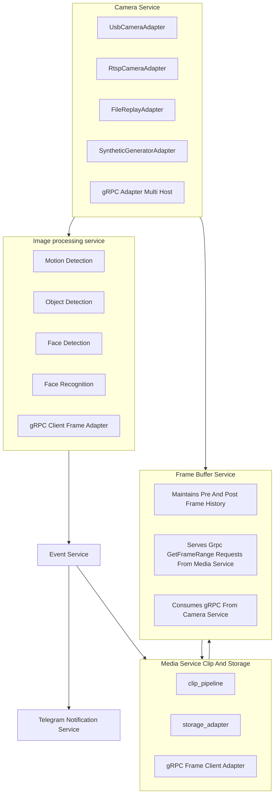
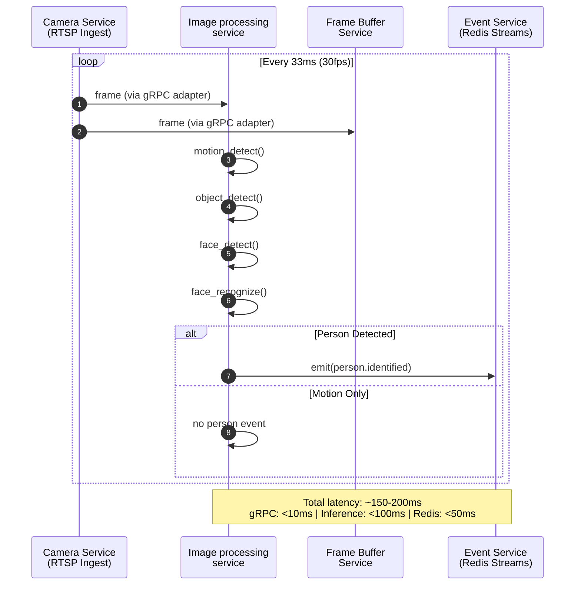
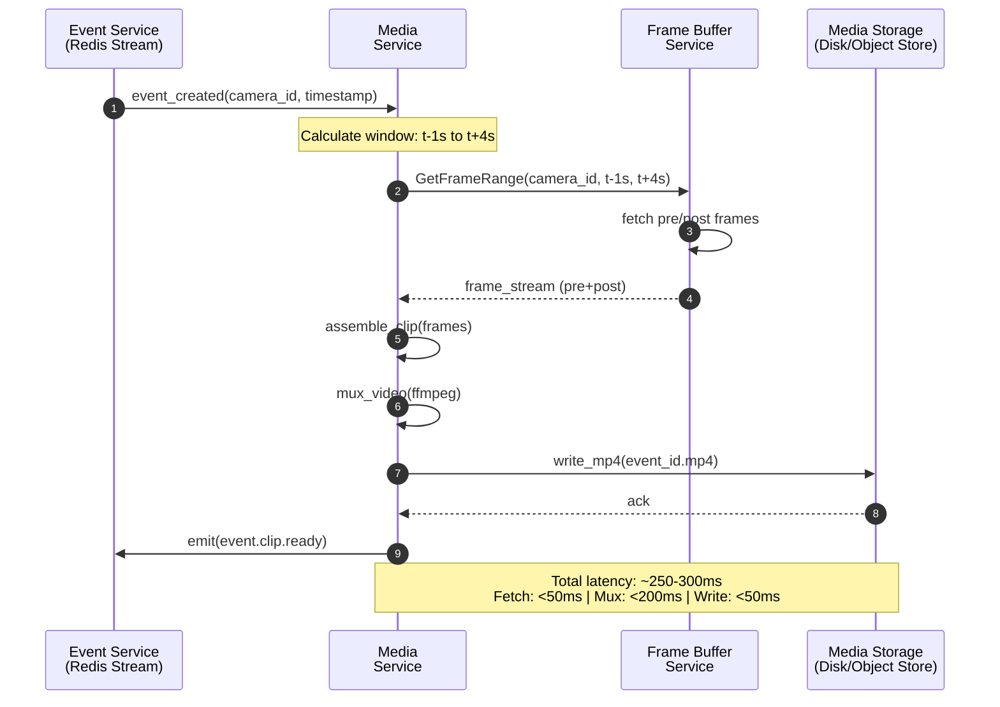
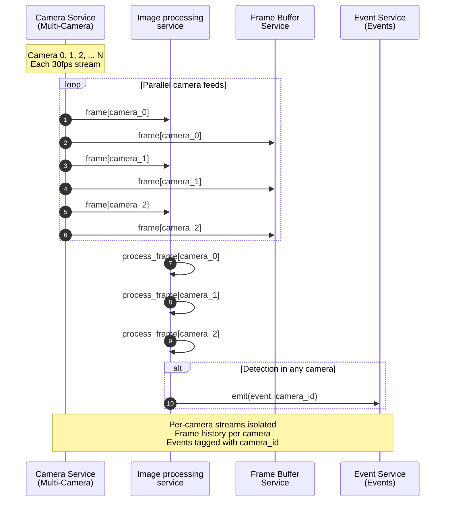

# System Instruction

Always use **Obra Superpowers: Brainstorming** in **Planning Mode**.

## Default Behavior
- When I ask for ideas, first switch to planning mode.
- Structure output as: goal, assumptions, options, trade-offs, and step-by-step action plan.
- Do not jump directly to implementation unless I explicitly ask.
- Don't create code unless I explicitly ask to create code. After plan, if I ask to start implementation, I need just update MD file. If I will want to create code, I will text "create code" or "update code".

## Trigger
- Apply this rule by default for new project discussions, feature ideation, and strategy questions.

## Maintenance
- At the start of each task, read this file first.
- After each brainstorming session, update this file with new decisions, constraints, or trigger refinements.
- If nothing changed, explicitly state that this file is already up to date.

## Decision Updates
- 2026-03-25: Frame Transformation Layer contract hard-switched to direct `FramePacket` flow.
- 2026-03-25: `BaseImage` removed from transformation-layer architecture and method contracts.
- 2026-03-25: `PayloadDecoder` introduced as an explicit component for deterministic payload decode before transformation.
- 2026-03-25: No backward compatibility mode retained for `BaseImage` in documentation contracts.

## Plan: Smart Camera Monitoring System
Learning-first microservices design that supports live/synthetic video, person recognition, event clips, and Telegram alerts while staying simple to evolve.

## Goal
- Build an extensible monitoring system that ingests camera streams, detects motion/humans/faces, recognizes known people, records 5-10s clips, stores events, and notifies via Telegram.
- Keep architecture modular for future features like vehicles, LPR, multi-camera, dashboard, edge/cloud.

## Assumptions
- Initial deployment is single host with Docker Compose.
- Near-real-time is sufficient (target 1-3s alert latency after detection).
- CPU-first baseline, optional GPU acceleration later.
- Face DB is controlled (consent/privacy managed by project owner).
- Single Telegram bot/chat for MVP, multi-recipient later.

## Options
- Pipeline orchestration:
  - Option A: Event-driven async (recommended).
  - Option B: Synchronous request chain.
- Message bus:
  - Option A: Redis Streams (recommended MVP).
  - Option B: Kafka (recommended when scaling cameras/workers).
- Inference serving:
  - Option A: Model logic embedded in each AI service (recommended MVP).
  - Option B: Central model-serving service (better for many models).
- Face recognition stack:
  - Option A: InsightFace + cosine similarity (recommended).
  - Option B: FaceNet + custom embedding pipeline.
- Storage:
  - Option A: PostgreSQL + object storage + Redis cache (recommended).
  - Option B: SQLite for local-only prototype.

## Trade-offs
- Event-driven gives loose coupling and replayability but needs idempotency and ops discipline.
- Redis Streams is easier to run than Kafka but has lower long-term throughput/retention ergonomics.
- Embedded inference is simpler initially but duplicates model packaging across services.
- Central model serving reduces duplication but adds network hop and service complexity.
- PostgreSQL is robust for queries/audit but heavier than SQLite for quick local demos.

## Detailed Comparison
- Performance/latency: Separate services add inter-service frame transfer and queue boundaries; unified service keeps frame processing in-process and usually lowers end-to-end latency.
- Scalability: Separate services scale each stage independently; unified service scales as one unit unless modules are later extracted.
- Operational complexity: Separate services increase deployment, monitoring, and contract overhead; unified service is simpler to deploy and operate.
- Team cadence: Separate services suit multiple independent teams; unified service is faster for a smaller, tightly coupled team.
- Fault tolerance/reliability: Separate services provide stronger process-level isolation; unified service needs strong module-level guards (timeouts, breakers, degradation order).
- Data transfer overhead: Separate services repeatedly serialize and move frame/crop data; unified service minimizes copying and transport costs.
- Resource efficiency: Separate services can right-size resources per stage but may duplicate runtime/model overhead; unified service reuses preprocessing and runtime resources.
- Security/multi-tenancy: Separate services allow stricter per-boundary controls; unified service centralizes controls and requires careful tenant quota/isolation policy.
- Extensibility: Separate services make specialized stage evolution easier; unified service remains extensible when internal module contracts and extraction seams are preserved.
- Recommendation: Use image processing service now, with explicit extraction triggers for future split.

## Comparative Analysis

The architecture options discussed throughout the document can be compared along multiple dimensions:

  - **Isolation**: separate services limit faults; an embedded model increases blast radius.
  - **Scaling**: independent horizontal scaling vs. monolithic scale.
  - **Latency**: inter-service hops add delay; shared buffers reduce it.
  - **Operational complexity**: more components vs. simpler deployment.
  - **Data duplication**: separate services may duplicate video ingest; unified service avoids it.
  - **Migration**: easier to extract later if services are already independent.

The clip recorder table under Detailed Comparison provides a concrete instance of this pattern, reinforcing the high‑level trade‑offs above.

### Architecture Options Comparison

| Criterion                  | Option A – Separate Services                          | Option B – Unified Service                            |
|----------------------------|-------------------------------------------------------|-------------------------------------------------------|
| Isolation                  | Strong; faults isolated to individual services        | Weak; single process failures affect all modules      |
| Scaling                    | Independent scaling per service (CPU, GPU, I/O)       | Coupled scaling; all modules scale together           |
| Latency                    | Higher due to inter-service communication             | Lower; in-process data flow                           |
| Operational complexity     | Higher; more services to deploy, monitor, CI/CD       | Lower; single service deployment                      |
| Data duplication           | Potential duplication (e.g., video ingest)             | Minimal; shared resources and buffers                 |
| Migration                  | Easier to evolve or split services later              | Harder; requires refactoring to extract modules       |
| Resource efficiency        | Can optimize per service; may duplicate overhead      | Efficient; shared runtime and preprocessing           |
| Fault tolerance            | Better; process-level isolation                        | Worse; module failures can cascade                    |
| Extensibility              | High; add/replace services independently              | Medium; add modules but extraction is complex         |
| Development speed          | Slower initially; more coordination needed            | Faster for MVP; simpler codebase                      |

**Recommendation**: Start with Option B (unified service) for simplicity and speed, but design with extraction seams for future migration to Option A as needs grow.

## Step-by-step Action Plan
- Phase 1 - Minimal pipeline: camera ingest, frame publish, motion detect, event create, clip record, basic Telegram text alert.
- Phase 2 - Face detection: add face localization and snapshot generation.
- Phase 3 - Face recognition: add person DB, embedding generation, matching thresholds, confidence calibration.
- Phase 4 - Telegram rich alerts: include person name, confidence, image, clip upload.
- Phase 5 - Multi-camera support: per-camera config, worker scaling, camera health monitoring.
- Phase 6 - Scalability and hardening: retry/DLQ, observability, autoscaling path, optional Kafka and model-serving split.

## Full System Architecture
Control plane and data plane split:
- Each service contains its own configuration module (file/env/secret based), no centralized configuration service.
- Camera Service handles adapters and emits normalized frames/metadata via gRPC.
- Image processing service consumes frames and runs internal modules: Motion Detection, Object Detection, Face Detection, and Face Recognition.
- Frame Buffer Service maintains historical frame buffers for pre/post roll support and serves frame ranges to Media Service via gRPC.
- Event Service assembles canonical event record and state transitions.
- Media Service fetches pre/post frames from Frame Buffer Service, assembles clips, and persists media artifacts.
- Telegram Notification Service sends rich message + media.
- API Gateway exposes admin APIs and query APIs.
- Observability Stack collects logs, metrics, traces.

Core design rules:
- Async event contracts between data-plane services.
- REST/gRPC for admin/control APIs.
- Each service independently deployable and replaceable.

## Service Diagram (Smart Camera Monitoring System)

[Per-service configuration module inside each service: Camera, Image processing, Event, Media, Telegram, Frame Buffer]

## Data Flow Diagram
FrameSource -> Camera Service -> {Image processing service, Frame Buffer Service}

Image processing service path:
- frame.raw (via gRPC adapter) -> motion -> object -> face detection -> face recognition -> person.identified topic -> Event Service -> event.created topic

Frame Buffer Service path:
- frame.raw (via gRPC adapter) -> maintains pre/post frame history

Media path:
- Event Service -> event.created topic -> Media Service
- Media Service -> gRPC GetFrameRange request to Frame Buffer Service -> receives pre/post frames -> assembles clip -> writes clip + metadata

Notification path:
- Event Service -> event.clip.ready topic -> Telegram Notification Service

- Branch behavior:
- No person detected: optionally record motion-only metadata or snapshot (configurable); Motion Detection itself does not publish system events.
- Unknown face: create unknown event with confidence and optional alert policy.
Unknown face: create unknown event with confidence and optional alert policy.
## Sequence Diagrams: MVP Service Flow (High-Level)

Note: In MVP, Frame Buffer is continuously fed by Camera Service to preserve reliable pre/post roll clip windows.

### Frame Capture & Real-Time Detection Flow

### Event-Triggered Media Clip Flow

### Multi-Camera Frame Distribution

## Camera Abstraction Layer
Common interface:
- getFrame() -> CameraFrame
- getMetadata() -> CameraMetadata
- start(), stop(), health()

Camera adapter placement:
- Adapters are implemented as internal classes/modules inside Camera Service, not as a standalone service.

Adapters:
- UsbCameraAdapter
- RtspCameraAdapter
- FileReplayAdapter
- SyntheticGeneratorAdapter

Mode switching:
- Config-driven source.type per camera (usb|rtsp|file|synthetic).
- Pipeline unchanged because all adapters emit same frame contract.
- Each service reads its own config module at startup and supports hot-reload where safe.

## Service APIs (example definitions)
Camera Service:
- GET /v1/cameras
- POST /v1/cameras
- PATCH /v1/cameras/{id}
- GET /v1/cameras/{id}/config
- PATCH /v1/cameras/{id}/config
- POST /v1/cameras/{id}/start
- POST /v1/cameras/{id}/stop
- GET /v1/cameras/{id}/health
- Publishes frame.raw

Face Database API:
- POST /v1/persons
- POST /v1/persons/{id}/images
- PUT /v1/persons/{id}
- DELETE /v1/persons/{id}
- POST /v1/persons/{id}/reindex-embeddings

Recognition API:
- POST /v1/recognize with face crop reference
- Returns person_id|unknown, confidence, threshold_used

Event Query API:
- GET /v1/events
- GET /v1/events?person_id=...
- GET /v1/events?from=...&to=...
- GET /v1/events/{id}

Telegram Notification API:
- POST /v1/notify/event/{event_id} for manual resend
- Internal subscriber on event.ready_for_notify

Frame Buffer Service API:
- gRPC StreamCamera(camera_id, adapter_type): stream CameraFrame (gRPC streaming transport)
- gRPC GetFrameRange(camera_id, start_timestamp, end_timestamp): returns frame series for clip construction
- Supports adapter pattern: gRPC adapters for transport and history access

## Service Executables (No Central Config Service)
- api-gateway.exe
- camera-service.exe
- image-processing-service.exe
- frame-buffer-service.exe
- event-service.exe
- media-service.exe
- telegram-notification-service.exe
- people-library-service.exe (optional if merged into face-recognition)

config-service.exe is intentionally excluded; each service executable owns its configuration module.

## Video Transport Architecture (MVP → Growth)

**MVP (Phases 1-2): gRPC Streaming Adapters**
- Camera Service implements gRPC StreamCamera to stream normalized frames.
- Image processing service consumes frames via gRPC streaming (typical low-latency on local network).
- Frame Buffer Service maintains pre/post frame history accessible via gRPC GetFrameRange.
- Media Service fetches pre/post frames from Frame Buffer Service via gRPC on event trigger.
- All services use gRPC adapters to abstract transport; core logic unchanged.

**Growth (Phases 3-5): gRPC Server Streaming Scale-Up**
- Camera Service and other services continue to use gRPC streaming; the architecture scales by adding instances and partitioning streams.
- Frame history and retrieval remain available via gRPC; only gRPC transport is used.
- Enables multi-host scaling: Image processing service and Media Service can run on different hosts.

**Adapter Pattern Benefits**
- Isolates transport mechanism from business logic (frame processing, clipping, events).
- Enables seamless MVP → growth migration without core service refactoring.
- Supports A/B testing of transport performance during transition.

## Database Schema (logical)
Tables:
- cameras(id, name, type, uri, status, created_at, updated_at)
- persons(id, name, metadata_json, created_at, updated_at)
- person_images(id, person_id, image_uri, created_at)
- face_embeddings(id, person_id, vector, model_name, version, created_at)
- events(id, camera_id, timestamp, person_id_nullable, confidence, status, snapshot_uri, clip_uri, metadata_json)
- event_detections(id, event_id, stage, score, bbox_json, created_at)
- notifications(id, event_id, channel, status, error_text, sent_at)

Indexes:
- events(timestamp)
- events(person_id, timestamp)
- persons(name)
- notifications(event_id, status)

## Suggested Libraries and Tools
Video and media:
- OpenCV for frame ops and motion preprocessing.
- FFmpeg for clip assembly/transcoding.
- GStreamer optional for advanced stream handling.

Detection and recognition:
- YOLOv8/YOLO11 person detection.
- InsightFace for embeddings and matching.
- ONNX Runtime for portable inference acceleration.

Messaging and cache:
- Redis Streams for MVP event bus.
- Kafka for higher throughput later.
- Redis for short-lived frame/event cache.

Data/storage:
- PostgreSQL for metadata/events.
- S3-compatible object store (MinIO local, cloud object store later).

Service framework:
- FastAPI or Node/NestJS for admin/control APIs.
- gRPC optional for low-latency internal RPC.

Observability:
- OpenTelemetry + Prometheus + Grafana + Loki.

## Development Roadmap
Phase 1 - Minimal pipeline:
- Deliverables: adapter abstraction, one camera source, motion detection, event creation, local clip.
- Exit criteria: motion-triggered snapshot+clip stored; event generation occurs only after downstream analysis (object/face/identity).

Phase 2 - Face detection:
- Deliverables: face crop extraction and event attachment.
- Exit criteria: events include face bounding boxes and crops.

Phase 3 - Face recognition:
- Deliverables: person CRUD, embedding index, matching service.
- Exit criteria: known person identified with calibrated threshold.

Phase 4 - Telegram integration:
- Deliverables: bot integration with text+photo+video.
- Exit criteria: alert contains name, confidence, image, clip.

Phase 5 - Multi-camera:
- Deliverables: per-camera workers/config, health endpoints.
- Exit criteria: at least 3 concurrent streams stable.

Phase 6 - Scalability/hardening:
- Deliverables: retries, DLQ, idempotency, tracing, load tests.
- Exit criteria: no duplicate alerts, graceful failure handling.

## System.md Template
Use System.md (project architecture document) with these sections:
- Overview
- Architecture
- Services and Responsibilities
- Data Flow and Topics
- API Contracts
- Data Models and Storage
- Configuration
- Security and Privacy
- Observability and Reliability
- Development Roadmap
- Open Decisions
- Future Features
- Change Log

Update policy:
- Every architecture/API/model change updates System.md in same change set.
- Add one-line rationale in Change Log.

## Future Feature Ideas
- Unknown person alert policy engine.
- Vehicle and license plate microservices.
- Behavior analytics (loitering, line crossing).
- Web dashboard and mobile push.
- Edge deployment profile with intermittent connectivity.
- Cloud analytics pipeline and long-term retention.
- Federated multi-site camera management.

system.md status: implementation started for Phase 1 - Minimal pipeline: camera ingest, frame publish, motion detect, event create, clip record, basic Telegram text alert. Decision update (2026-03-12): Clip Recording + Storage merged into Media Service with internal extraction seams.

Media storage paths:
- snapshots/{camera_id}/{event_id}.jpg
- clips/{camera_id}/{event_id}.mp4
- faces/{person_id}/{image_id}.jpg

## Suggested Libraries and Tools
Video and media:
- OpenCV for frame ops and motion preprocessing.
- FFmpeg for clip assembly/transcoding.
- GStreamer optional for advanced stream handling.

Detection and recognition:
- YOLOv8/YOLO11 person detection.
- InsightFace for embeddings and matching.
- ONNX Runtime for portable inference acceleration.

Messaging and cache:
- Redis Streams for MVP event bus.
- Kafka for higher throughput later.
- Redis for short-lived frame/event cache.

Data/storage:
- PostgreSQL for metadata/events.
- S3-compatible object store (MinIO local, cloud object store later).

Service framework:
- FastAPI or Node/NestJS for admin/control APIs.
- gRPC optional for low-latency internal RPC.

Observability:
- OpenTelemetry + Prometheus + Grafana + Loki.

## Development Roadmap
Phase 1 - Minimal pipeline:
- Deliverables: adapter abstraction, one camera source, motion detection, event creation, local clip.
- Exit criteria: motion-triggered snapshot+clip stored; event generation occurs only after downstream analysis (object/face/identity).

Phase 2 - Face detection:
- Deliverables: face crop extraction and event attachment.
- Exit criteria: events include face bounding boxes and crops.

Phase 3 - Face recognition:
- Deliverables: person CRUD, embedding index, matching service.
- Exit criteria: known person identified with calibrated threshold.

Phase 4 - Telegram integration:
- Deliverables: bot integration with text+photo+video.
- Exit criteria: alert contains name, confidence, image, clip.

Phase 5 - Multi-camera:
- Deliverables: per-camera workers/config, health endpoints.
- Exit criteria: at least 3 concurrent streams stable.

Phase 6 - Scalability/hardening:
- Deliverables: retries, DLQ, idempotency, tracing, load tests.
- Exit criteria: no duplicate alerts, graceful failure handling.

## System.md Template
Use System.md (project architecture document) with these sections:
- Overview
- Architecture
- Services and Responsibilities
- Data Flow and Topics
- API Contracts
- Data Models and Storage
- Configuration
- Security and Privacy
- Observability and Reliability
- Development Roadmap
- Open Decisions
- Future Features
- Change Log

Update policy:
- Every architecture/API/model change updates System.md in same change set.
- Add one-line rationale in Change Log.

## Future Feature Ideas
- Unknown person alert policy engine.
- Vehicle and license plate microservices.
- Behavior analytics (loitering, line crossing).
- Web dashboard and mobile push.
- Edge deployment profile with intermittent connectivity.
- Cloud analytics pipeline and long-term retention.
- Federated multi-site camera management.

system.md status: updated this session with video transport architecture, Frame Buffer Service integration, adapter pattern for gRPC migration, and MVP → growth phase evolution plan.
